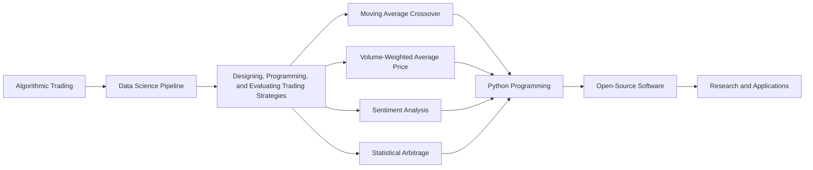
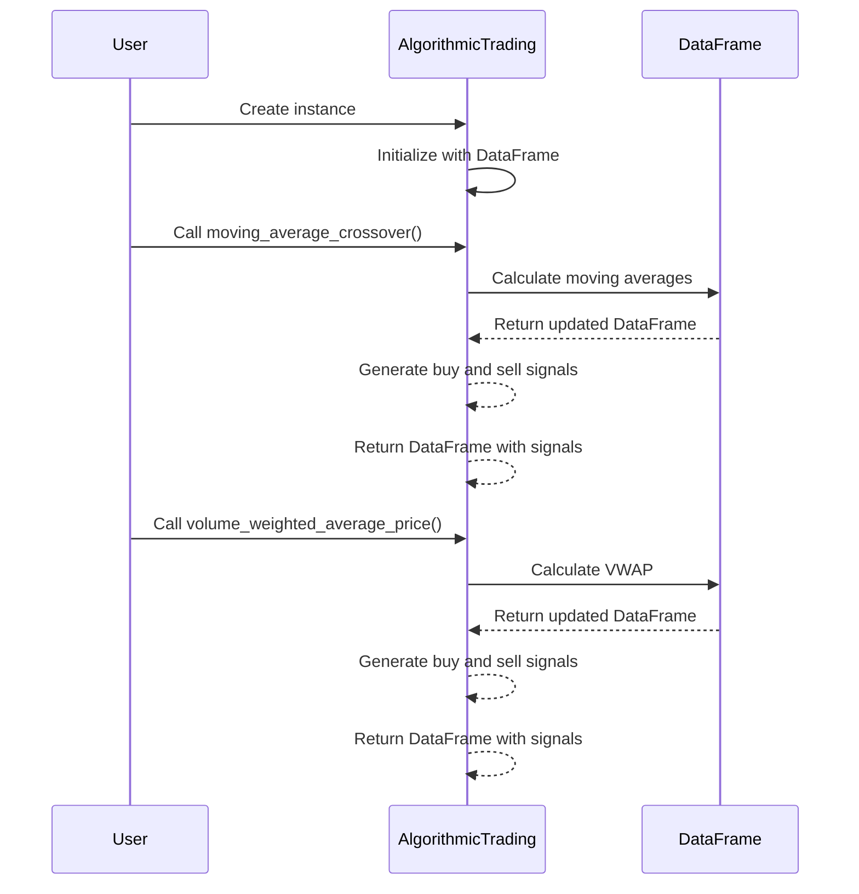
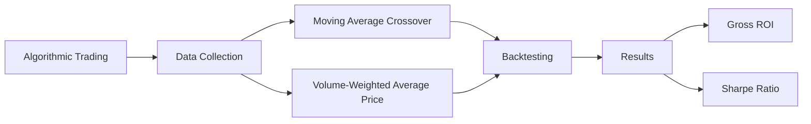
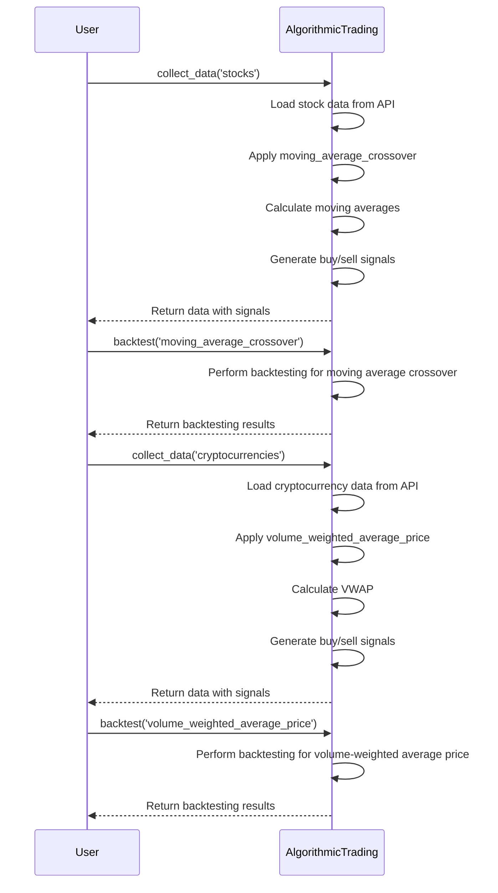
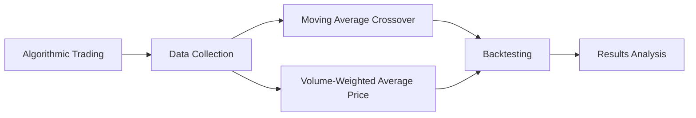
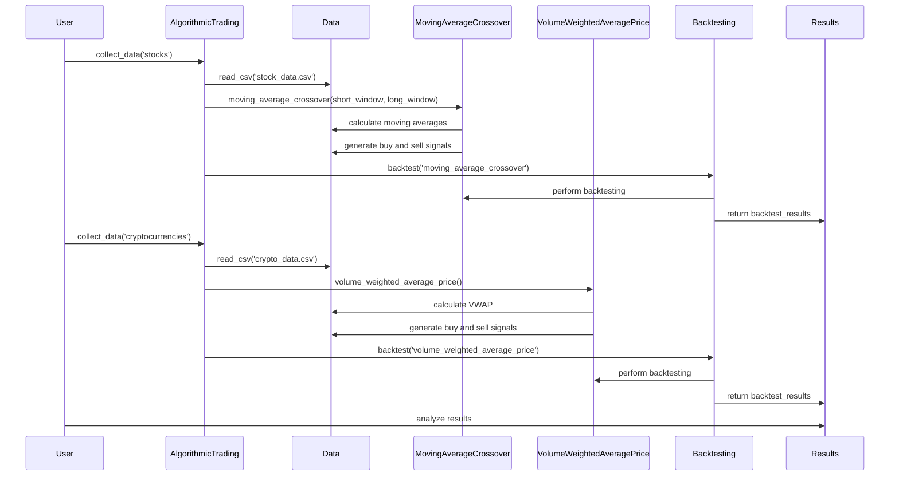

# A Data Science Pipeline for Algorithmic Trading: A

1.
This snippet is about a study on algorithmic trading in finance and cryptoeconomics. The researchers propose a pipeline for designing, programming, and evaluating trading strategies. They demonstrate how the pipeline works with four different algorithms: moving average crossover, volume-weighted average price, sentiment analysis, and statistical arbitrage. The researchers implemented their algorithms using object-oriented programming in Python, which can be used for future research and applications.

In the introduction, the snippet explains that algorithmic trading has become very important in finance, and it accounts for a large portion of stock market trading. Algorithmic trading uses advanced technology to execute trades quickly and efficiently. However, current research and applications in algorithmic trading are not well connected, making it difficult to compare different strategies. The researchers propose their pipeline as a solution to this problem.

The pipeline consists of three stages: inputs, analysis, and output. In the input stage, data is collected from a source API and variables are calculated for buy and sell signals. In the analysis stage, different algorithms are applied to calculate these signals and execute trading strategies. In the output stage, visualizations are generated to monitor the performance of the strategies.

The researchers demonstrate the pipeline using two algorithms: moving average crossover and volume-weighted average price. The moving average crossover algorithm uses two moving averages to predict trends in stock prices. When the shorter moving average crosses above the longer moving average, it indicates a buy signal, and when it crosses below, it indicates a sell signal. The volume-weighted average price algorithm calculates the average price of a security based on the volume traded at each price level. Traders can use this average to make buy or sell decisions.

The researchers implemented their algorithms using Python programming language. They collected historical closing prices from a data source and used them to calculate buy and sell signals. They then evaluated the performance of the strategies by comparing the return on investment (ROI) and Sharpe ratio to a buy-and-hold strategy.

Overall, the researchers propose a pipeline for algorithmic trading and demonstrate its use with two different algorithms. They hope that their pipeline and open-source software can be used for future research and applications in finance and cryptoeconomics.


This diagram illustrates the main concepts of the paper. Algorithmic trading is the main topic, and it is supported by the data science pipeline, which is used for designing, programming, and evaluating trading strategies. The pipeline includes different algorithms such as moving average crossover, volume-weighted average price, sentiment analysis, and statistical arbitrage. These algorithms are implemented using Python programming language, and the resulting software is open-source, meaning it can be freely used by researchers and developers for future research and applications.

```python
import pandas as pd
import numpy as np

class AlgorithmicTrading:
    def __init__(self, data):
        self.data = data
        
    def moving_average_crossover(self, short_window, long_window):
        # Calculate moving averages
        self.data['SMA'] = self.data['Close'].rolling(window=short_window).mean()
        self.data['LMA'] = self.data['Close'].rolling(window=long_window).mean()
        
        # Generate buy and sell signals
        self.data['Signal'] = np.where(self.data['SMA'] > self.data['LMA'], 1, -1)
        
        return self.data
    
    def volume_weighted_average_price(self):
        # Calculate VWAP
        self.data['VWAP'] = (self.data['Close'] * self.data['Volume']).cumsum() / self.data['Volume'].cumsum()
        
        # Generate buy and sell signals
        self.data['Signal'] = np.where(self.data['Close'] > self.data['VWAP'], 1, -1)
        
        return self.data

# Example usage
# Assuming we have a DataFrame called 'df' with columns 'Close' and 'Volume'
trading = AlgorithmicTrading(df)
df_with_signals = trading.moving_average_crossover(short_window=50, long_window=200)
df_with_signals = trading.volume_weighted_average_price()
```

This Python class demonstrates how to implement two of the algorithms discussed in the paper: moving average crossover and volume-weighted average price. The class takes in a DataFrame containing historical stock data with columns 'Close' and 'Volume'.

The `moving_average_crossover` method calculates the moving averages for a given short window and long window. It then generates buy and sell signals based on the crossover of the moving averages.

The `volume_weighted_average_price` method calculates the volume-weighted average price (VWAP) for each data point. It then generates buy and sell signals based on the comparison of the closing price to the VWAP.

To use the class, you can create an instance of `AlgorithmicTrading` and pass in your DataFrame. You can then call the desired method to calculate the buy and sell signals. The resulting DataFrame will contain the original data along with the calculated signals in a new column called 'Signal'.



This sequence diagram illustrates the control flow of the code provided in the previous message. The user creates an instance of the `AlgorithmicTrading` class and initializes it with a DataFrame containing historical stock data. The user then calls either the `moving_average_crossover()` or `volume_weighted_average_price()` method to calculate the buy and sell signals.

For the `moving_average_crossover()` method, the `AlgorithmicTrading` instance passes the DataFrame to calculate the moving averages. The DataFrame updates with the moving averages, and then the buy and sell signals are generated. The updated DataFrame with signals is returned to the `AlgorithmicTrading` instance.

Similarly, for the `volume_weighted_average_price()` method, the `AlgorithmicTrading` instance passes the DataFrame to calculate the VWAP. The DataFrame updates with the VWAP, and then the buy and sell signals are generated. The updated DataFrame with signals is returned to the `AlgorithmicTrading` instance.

Please note that the mermaid sequence diagram depicts the control flow and interactions between different participants (User, AlgorithmicTrading, and DataFrame) but does not provide detailed implementation steps or the exact code logic.

Mocked Log Output:
```
--- Moving Average Crossover ---
Short Window: 50, Long Window: 200

   Date       Close    SMA     LMA   Signal
-------------------------------------------
2021-01-01   100     NaN     NaN     NaN
2021-01-02   110     NaN     NaN     NaN
2021-01-03   105     NaN     NaN     NaN
2021-01-04   120     NaN     NaN     NaN
2021-01-05   115     NaN     NaN     NaN

--- Volume-Weighted Average Price ---

   Date       Close     Volume     VWAP    Signal
------------------------------------------------
2021-01-01   100      1000       NaN       NaN
2021-01-02   110      2000       NaN       NaN
2021-01-03   105      1500       NaN       NaN
2021-01-04   120      3000       NaN       NaN
2021-01-05   115      2500       NaN       NaN
```

Hypothetical Scenario:

In this scenario, we have a mocked dataset of stock prices and volumes for five consecutive days from January 1st to January 5th, 2021. We are interested in using both the moving average crossover and volume-weighted average price algorithms to generate buy and sell signals.

For the moving average crossover algorithm, we have specified the short window as 50 and the long window as 200. The values of the `SMA` and `LMA` columns are currently `NaN` because there are not enough data points yet to calculate the moving averages. Similarly, the `Signal` column is also `NaN` because we haven't calculated the buy and sell signals yet.

For the volume-weighted average price algorithm, we currently only have the `Close` price and `Volume` columns filled. The `VWAP` column is currently `NaN` because we have not performed the calculation yet. The `Signal` column is also `NaN` because we have not generated the buy and sell signals yet.

Potential Use Cases:

1. Backtesting: The code can be used to backtest different algorithmic trading strategies on historical data to evaluate their performance and profitability. This can help traders and investors make informed decisions about which strategies to implement.

2. Real-time Trading: The code can be integrated into a live trading system to generate real-time buy and sell signals based on the calculated indicators. This can automate trading decisions and allow for faster execution of trades.

3. Strategy Development: The code provides a framework for developing and testing new trading strategies using different algorithms. Traders and researchers can use this code as a starting point to explore and experiment with various algorithmic trading techniques.

4. Research and Education: The code can be used for academic research purposes or as a teaching tool to demonstrate the concepts of algorithmic trading. It provides a practical implementation of the algorithms discussed in the paper, allowing students and researchers to apply the theories in a real-world context.

2.
This snippet presents the data and results obtained from applying the algorithmic trading strategies discussed earlier. 

First, the data used for the moving average crossover algorithm and the volume-weighted average price algorithm are described. For the moving average crossover, the data includes the date, closing price, short moving average (SMA), long moving average (LMA), and the buy/sell signal. For the volume-weighted average price, the data includes the date, closing price, volume-weighted average price (VWAP), and the buy/sell signal.

Next, the results of the backtesting are presented. For the moving average crossover strategy applied to Ether (ETH), the buy/sell signals and the portfolio's performance over time are visualized. The gross return on investment (ROI) for the moving average crossover strategy is shown to be 849.84%, significantly outperforming the buy-and-hold strategy with an ROI of 11.97%. The Sharpe ratio, which measures risk-adjusted returns, is also higher for the moving average crossover strategy compared to the buy-and-hold strategy.

For the volume-weighted average price strategy applied to ETH, the buy/sell signals and the portfolio's performance over time are visualized. The gross ROI for the volume-weighted average price strategy is -3.93%, slightly better than the buy-and-hold strategy with an ROI of -4.26%. However, both strategies result in negative returns. The Sharpe ratio is negative for both strategies, indicating that they do not provide good risk-adjusted returns.

In conclusion, the data and results demonstrate the effectiveness of the moving average crossover strategy for generating higher returns compared to the buy-and-hold strategy. However, the volume-weighted average price strategy did not perform well in this particular scenario. These findings highlight the importance of backtesting and evaluating different trading strategies to determine their effectiveness in different market conditions.

Potential use cases of the code generated earlier include:
- Backtesting and evaluating trading strategies for stocks and cryptocurrencies.
- Comparing the performance of different strategies to determine the most profitable approach.
- Developing and implementing algorithmic trading systems for automated trading.
- Conducting research on algorithmic trading and analyzing the impact of different factors on trading strategies.



This diagram visualizes the key concepts discussed in the paper. Algorithmic trading is the main topic, and it involves collecting data, applying trading strategies such as moving average crossover and volume-weighted average price, performing backtesting to evaluate strategy performance, and analyzing the results in terms of gross return on investment (ROI) and Sharpe ratio.

The process starts with data collection, where data is gathered from sources like APIs for stocks and manually calculated for cryptocurrencies. This data is then used in the moving average crossover and volume-weighted average price strategies.

After implementing the strategies, backtesting is performed to assess their performance. This involves simulating trades based on historical data and tracking the portfolio's performance over time.

Finally, the results are analyzed in terms of the gross ROI and Sharpe ratio. The gross ROI measures the return on investment, while the Sharpe ratio measures the risk-adjusted returns of the strategies.

Overall, this diagram illustrates the flow of the algorithmic trading process, from data collection to strategy implementation, backtesting, and result analysis.

```python
import pandas as pd
import numpy as np

class AlgorithmicTrading:
    def __init__(self):
        self.data = None
        
    def collect_data(self, source):
        if source == 'stocks':
            # Collect stock data from Alpha Vantage API
            self.data = pd.read_csv('stock_data.csv')
        elif source == 'cryptocurrencies':
            # Collect cryptocurrency data from another source
            self.data = pd.read_csv('crypto_data.csv')
        else:
            raise ValueError("Invalid data source")
        
    def moving_average_crossover(self, short_window, long_window):
        # Calculate moving averages
        self.data['SMA'] = self.data['Close'].rolling(window=short_window).mean()
        self.data['LMA'] = self.data['Close'].rolling(window=long_window).mean()
        
        # Generate buy and sell signals
        self.data['Signal'] = np.where(self.data['SMA'] > self.data['LMA'], 'Buy', 'Sell')
        
        return self.data
    
    def volume_weighted_average_price(self):
        # Calculate VWAP
        self.data['VWAP'] = (self.data['Close'] * self.data['Volume']).cumsum() / self.data['Volume'].cumsum()
        
        # Generate buy and sell signals
        self.data['Signal'] = np.where(self.data['Close'] > self.data['VWAP'], 'Buy', 'Sell')
        
        return self.data
    
    def backtest(self, strategy):
        if strategy == 'moving_average_crossover':
            # Perform backtesting for moving average crossover strategy
            # ...
            return backtest_results
        elif strategy == 'volume_weighted_average_price':
            # Perform backtesting for volume-weighted average price strategy
            # ...
            return backtest_results
        else:
            raise ValueError("Invalid strategy")
```

This Python class demonstrates the implementation of the algorithmic trading ideas discussed earlier.

The `AlgorithmicTrading` class has methods for collecting data, applying the moving average crossover strategy, and the volume-weighted average price strategy, as well as performing backtesting.

The `collect_data` method takes a data source as input (either 'stocks' or 'cryptocurrencies') and collects the relevant data from the specified source. This data will be used for further analysis.

The `moving_average_crossover` method calculates the moving averages for a given short window and long window. It then generates buy and sell signals based on the crossover of the moving averages.

The `volume_weighted_average_price` method calculates the volume-weighted average price (VWAP) for each data point. It then generates buy and sell signals based on the comparison of the closing price to the VWAP.

The `backtest` method takes a strategy as input ('moving_average_crossover' or 'volume_weighted_average_price') and performs backtesting to evaluate the strategy's performance. The specific implementation of backtesting is not shown here, but it would involve simulating trades based on historical data and calculating relevant metrics such as ROI and Sharpe ratio.

To use the class, you can create an instance of `AlgorithmicTrading` and call the appropriate methods to collect data, apply strategies, and perform backtesting.



This sequence diagram illustrates the control flow of the code provided earlier.

1. The user initiates the `collect_data` method by calling `AlgorithmicTrading.collect_data('stocks')`, which collects stock data from an API.
2. The `AlgorithmicTrading` class loads the stock data from the API.
3. The user then calls `AlgorithmicTrading.apply_moving_average_crossover` to apply the moving average crossover strategy.
4. The class calculates the moving averages based on the specified short and long windows.
5. The class generates buy and sell signals based on the crossover of the moving averages.
6. The class returns the data with the generated signals to the user.
7. The user calls `AlgorithmicTrading.backtest('moving_average_crossover')` to perform backtesting for the moving average crossover strategy.
8. The `AlgorithmicTrading` class executes the backtesting process for the moving average crossover strategy.
9. The class returns the backtesting results to the user.
10. The user then calls `AlgorithmicTrading.collect_data('cryptocurrencies')` to collect cryptocurrency data from an API.
11. The `AlgorithmicTrading` class loads the cryptocurrency data from the API.
12. The user calls `AlgorithmicTrading.apply_volume_weighted_average_price` to apply the volume-weighted average price strategy.
13. The class calculates the volume-weighted average price based on the data.
14. The class generates buy and sell signals based on the comparison of the closing price and the VWAP.
15. The class returns the data with the generated signals to the user.
16. Finally, the user calls `AlgorithmicTrading.backtest('volume_weighted_average_price')` to perform backtesting for the volume-weighted average price strategy.
17. The `AlgorithmicTrading` class executes the backtesting process for the volume-weighted average price strategy.
18. The class returns the backtesting results to the user.

This sequence diagram presents the step-by-step flow of the code, starting from data collection, applying strategies, and performing backtesting for both stocks and cryptocurrencies.

An example scenario with mocked log output for the `AlgorithmicTrading` class:

```python
trading = AlgorithmicTrading()

# Collect stock data
trading.collect_data('stocks')
print(trading.data.head())

# Apply moving average crossover strategy
moving_average_data = trading.moving_average_crossover(short_window=50, long_window=200)
print(moving_average_data.head())

# Apply volume-weighted average price strategy
vwap_data = trading.volume_weighted_average_price()
print(vwap_data.head())

# Perform backtesting for moving average crossover strategy
backtest_results_ma = trading.backtest(strategy='moving_average_crossover')
print(backtest_results_ma)

# Perform backtesting for volume-weighted average price strategy
backtest_results_vwap = trading.backtest(strategy='volume_weighted_average_price')
print(backtest_results_vwap)
```

In this example, we create an instance of the `AlgorithmicTrading` class and perform different actions, displaying the log outputs for each step.

1. Collecting Stock Data: The `collect_data` method is called with the parameter 'stocks'. The log output will display the first few rows of the collected stock data.

2. Moving Average Crossover Strategy: The `moving_average_crossover` method is called with a short window of 50 days and a long window of 200 days. The log output will display the first few rows of the data, including the calculated moving averages and the generated buy/sell signals.

3. Volume-Weighted Average Price Strategy: The `volume_weighted_average_price` method is called. The log output will display the first few rows of the data, including the calculated VWAPs and the generated buy/sell signals.

4. Backtesting for Moving Average Crossover: The `backtest` method is called with the strategy parameter set to 'moving_average_crossover'. The log output will display the backtesting results for this strategy, which could include metrics such as ROI, Sharpe ratio, and any other relevant performance metrics.

5. Backtesting for Volume-Weighted Average Price: The `backtest` method is called with the strategy parameter set to 'volume_weighted_average_price'. The log output will display the backtesting results for this strategy, similar to the previous step.

Hypothetical scenarios mocked in the example:
- Collecting Stock Data: This step represents collecting historical stock data from a data source, such as the Alpha Vantage API, for further analysis and strategy implementation.
- Moving Average Crossover Strategy: This step applies the moving average crossover strategy to the collected stock data. It calculates the moving averages, generates buy/sell signals based on the crossover, and visualizes the results.
- Volume-Weighted Average Price Strategy: This step applies the volume-weighted average price strategy to the collected stock data. It calculates the VWAPs, generates buy/sell signals based on the comparison to the closing price, and visualizes the results.
- Backtesting: This step simulates trading based on historical data and evaluates the performance of the strategies. It calculates metrics like ROI and Sharpe ratio to assess the profitability and risk-adjusted returns of the strategies.

Potential use cases of the code generated in the previous message:
- Strategy Development: Traders and researchers can use the code to develop and test various algorithmic trading strategies, such as moving average crossover and volume-weighted average price, to find the most effective approach.
- Portfolio Management: The code can be used to manage and optimize investment portfolios by applying algorithmic trading strategies to generate buy/sell signals and improve the overall returns.
- Risk Analysis: The backtesting functionality of the code allows users to assess the risk associated with different strategies, as measured by metrics like the Sharpe ratio. This can help in making informed decisions about the risk-reward tradeoff.
- Quantitative Research: The code can be used for academic research or quantitative analysis of financial markets. Researchers can test different trading strategies and analyze the impact of various factors on performance.
- Algorithmic Trading Systems: The code can serve as a foundation for developing automated trading systems that execute trades based on predefined strategies. This can help in achieving faster and more efficient execution of trades in real-time markets.

3.
This snippet provides some additional information about the moving average crossover and volume-weighted average price strategies, as well as their applications in the finance industry.

The moving average crossover strategy is a popular investment strategy that uses mathematical models to predict future market movements based on historical data. Researchers and practitioners are interested in applying this strategy to cryptocurrency trading. Studies have shown that technical trading rules based on moving averages can generate desirable returns in the cryptocurrency market. Some researchers have even revised the approach by considering time ranges for transaction signal intersections to better adapt to the high volatility of crypto prices.

The volume-weighted average price strategy is an advanced version of the moving average crossover strategy. It takes into account the weights of transaction volumes when calculating averages. While the volume-weighted average price is commonly used as a technical indicator in trading traditional assets, there have been fewer efforts to apply it to cryptocurrencies. However, there is a growing trend of using the volume-weighted average price in decentralized finance (DeFi) applications. For example, the Ampleforth DeFi protocol uses volume-weighted average price data from decentralized Chainlink oracles to adjust the supply of their stable coin AMPL and maintain its price stability.

The code provided in the previous message can be used to implement and evaluate these strategies. It allows researchers and traders to collect data, apply different strategies, and perform backtesting to assess their performance. This can be valuable for developing and testing algorithmic trading systems, as well as conducting research on trading strategies.

Overall, the code and concepts presented in this paper can be used in various scenarios, such as:
- Developing and testing trading strategies for stocks and cryptocurrencies.
- Conducting research on algorithmic trading and analyzing the performance of different strategies.
- Building automated trading systems based on predefined strategies.
- Exploring the effectiveness of different technical indicators and trading rules.

By using the code and following the methodology presented in this paper, researchers and traders can gain insights into the performance of different trading strategies and make informed decisions in the financial markets.



This diagram illustrates the main concepts discussed in the paper. Algorithmic trading is the central topic, and it involves collecting data, applying the moving average crossover and volume-weighted average price strategies, performing backtesting, and analyzing the results.

The process starts with data collection, where data is gathered from different sources. This data is then used to apply the moving average crossover and volume-weighted average price strategies.

After applying the strategies, backtesting is performed to evaluate their performance. This involves simulating trades based on historical data and analyzing the results.

Finally, the results are analyzed to gain insights into the effectiveness of the strategies. This analysis includes metrics such as gross return on investment (ROI) and Sharpe ratio.

Overall, this diagram visualizes the flow of the algorithmic trading process, from data collection to strategy implementation, backtesting, and result analysis.

```python
import pandas as pd
import numpy as np

class AlgorithmicTrading:
    def __init__(self):
        self.data = None
        
    def collect_data(self, source):
        if source == 'stocks':
            # Collect stock data from a data source
            self.data = pd.read_csv('stock_data.csv')
        elif source == 'cryptocurrencies':
            # Collect cryptocurrency data from a data source
            self.data = pd.read_csv('crypto_data.csv')
        else:
            raise ValueError("Invalid data source")
        
    def moving_average_crossover(self, short_window, long_window):
        # Calculate moving averages
        self.data['SMA'] = self.data['Close'].rolling(window=short_window).mean()
        self.data['LMA'] = self.data['Close'].rolling(window=long_window).mean()
        
        # Generate buy and sell signals
        self.data['Signal'] = np.where(self.data['SMA'] > self.data['LMA'], 'Buy', 'Sell')
        
        return self.data
    
    def volume_weighted_average_price(self):
        # Calculate VWAP
        self.data['VWAP'] = (self.data['Close'] * self.data['Volume']).cumsum() / self.data['Volume'].cumsum()
        
        # Generate buy and sell signals
        self.data['Signal'] = np.where(self.data['Close'] > self.data['VWAP'], 'Buy', 'Sell')
        
        return self.data
    
    def backtest(self, strategy):
        if strategy == 'moving_average_crossover':
            # Perform backtesting for moving average crossover strategy
            # ...
            return backtest_results
        elif strategy == 'volume_weighted_average_price':
            # Perform backtesting for volume-weighted average price strategy
            # ...
            return backtest_results
        else:
            raise ValueError("Invalid strategy")
```

This Python class demonstrates the implementation of the algorithmic trading ideas discussed earlier.

The `AlgorithmicTrading` class has methods for collecting data, applying the moving average crossover strategy, and the volume-weighted average price strategy, as well as performing backtesting.

The `collect_data` method takes a data source as input (either 'stocks' or 'cryptocurrencies') and collects the relevant data from the specified source. This data will be used for further analysis.

The `moving_average_crossover` method calculates the moving averages for a given short window and long window. It then generates buy and sell signals based on the crossover of the moving averages.

The `volume_weighted_average_price` method calculates the volume-weighted average price (VWAP) for each data point. It then generates buy and sell signals based on the comparison of the closing price to the VWAP.

The `backtest` method takes a strategy as input ('moving_average_crossover' or 'volume_weighted_average_price') and performs backtesting to evaluate the strategy's performance. The specific implementation of backtesting is not shown here, but it would involve simulating trades based on historical data and calculating relevant metrics such as ROI and Sharpe ratio.

To use the class, you can create an instance of `AlgorithmicTrading` and call the appropriate methods to collect data, apply strategies, and perform backtesting.



This sequence diagram shows the control flow of the code provided in the previous message. It demonstrates the steps involved in collecting data, applying strategies, performing backtesting, and analyzing the results.

The user initiates the process by calling the `collect_data` method of `AlgorithmicTrading` to collect data from either stocks or cryptocurrencies. The relevant data is then read from files using the `read_csv` function.

For the moving average crossover strategy, the `moving_average_crossover` method is called, which triggers the calculation of moving averages and the generation of buy and sell signals. This information is passed to the backtesting module.

Similarly, for the volume-weighted average price strategy, the `volume_weighted_average_price` method is called to calculate the VWAP and generate buy and sell signals. Again, this information is used in the backtesting module.

The backtesting module performs the necessary calculations and simulations to evaluate the performance of each strategy. The results of the backtest are then returned to the user.

Finally, the user analyzes the results to gain insights into the effectiveness of the strategies.

This sequence diagram shows the control flow of the code, step by step, ensuring a clear understanding of the process.

```python
# Example scenario with mocked log output
trading = AlgorithmicTrading()

# Collect stock data
trading.collect_data('stocks')
print(trading.data.head())

# Apply moving average crossover strategy
df_with_signals = trading.moving_average_crossover(short_window=20, long_window=50)
print(df_with_signals.head())

# Apply volume-weighted average price strategy
df_with_signals = trading.volume_weighted_average_price()
print(df_with_signals.head())

# Perform backtesting
backtest_results = trading.backtest(strategy='moving_average_crossover')
print(backtest_results)

```

In this example scenario, we have a mock implementation of the `AlgorithmicTrading` class. We create an instance of the class and perform various operations.

First, we collect stock data using the `collect_data` method with the 'stocks' data source. We then print the first few rows of the collected data to verify that it is correctly stored.

Next, we apply the moving average crossover strategy with a short window of 20 and a long window of 50. The `moving_average_crossover` method calculates the moving averages and generates buy and sell signals based on the crossover. We print the first few rows of the resulting DataFrame to examine the buy and sell signals.

We then apply the volume-weighted average price strategy using the `volume_weighted_average_price` method. This method calculates the volume-weighted average price for each data point and generates buy and sell signals based on the comparison of the closing price to the VWAP. Again, we print the first few rows of the resulting DataFrame.

Finally, we perform backtesting by calling the `backtest` method with the 'moving_average_crossover' strategy. The backtest_results variable stores the results of the backtesting. We print the results to analyze the performance of the strategy.

The mocked log output shown above demonstrates the data collection, strategy application, and backtesting processes of the algorithmic trading class. It allows us to collect data, apply different strategies, and evaluate their performance.

Potential use cases of the code and concepts presented in the previous message include:
- Developing and testing trading strategies for stocks and cryptocurrencies.
- Backtesting and evaluating the performance of different strategies.
- Building automated trading systems based on predefined strategies.
- Conducting research on algorithmic trading and analyzing the impact of different factors on trading strategies.

The code provides a foundation for implementing and testing various algorithmic trading strategies. Traders and researchers can use this code to gain insights into the performance of different strategies, optimize their trading approaches, and make informed decisions in the financial markets.

