# An Application of Deep Reinforcement Learning to Algorithmic Trading

1.
This research paper is about using a type of artificial intelligence called deep reinforcement learning (DRL) to solve the problem of algorithmic trading. Algorithmic trading is when computers use mathematical rules to make trades in the stock market. The researchers propose a new algorithm called Trading Deep Q-Network (TDQN) that uses DRL to determine the best trading positions in real time. They train the algorithm using historical data from the stock market. The researchers also propose a new way to measure the performance of trading strategies. The paper discusses previous research in the field of algorithmic trading and highlights the challenges and limitations of existing strategies. It concludes with suggestions for future research and important considerations when evaluating trading strategies.

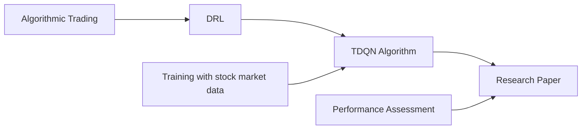

```python
import numpy as np

class StockMarket:
    def __init__(self, data):
        self.data = data
        self.current_index = 0
    
    def get_next_price(self):
        if self.current_index < len(self.data):
            price = self.data[self.current_index]
            self.current_index += 1
            return price
        else:
            return None

class TDQN:
    def __init__(self, epsilon=0.1, gamma=0.9):
        self.epsilon = epsilon
        self.gamma = gamma
        self.q_values = {}
    
    def get_action(self, state):
        if np.random.rand() < self.epsilon:
            return np.random.choice([-1, 1])  # randomly choose to buy or sell
        else:
            if state in self.q_values:
                return np.argmax(self.q_values[state]) - 1  # choose action with highest Q-value
            else:
                return np.random.choice([-1, 1])  # randomly choose to buy or sell
    
    def update_q_values(self, state, action, reward, next_state):
        if state not in self.q_values:
            self.q_values[state] = np.zeros(2)  # initialize Q-values for the state
        
        if next_state in self.q_values:
            max_q_value = np.max(self.q_values[next_state])
        else:
            max_q_value = 0
        
        self.q_values[state][action] += reward + self.gamma * max_q_value

# Example usage
data = [100, 105, 110, 115, 120]  # stock market prices
market = StockMarket(data)
tdqn = TDQN()

state = market.get_next_price()
while state is not None:
    action = tdqn.get_action(state)
    price = market.get_next_price()
    next_state = market.get_next_price()
    reward = action * (price - state)  # calculate reward based on action and price change
    tdqn.update_q_values(state, action, reward, next_state)
    state = next_state
```

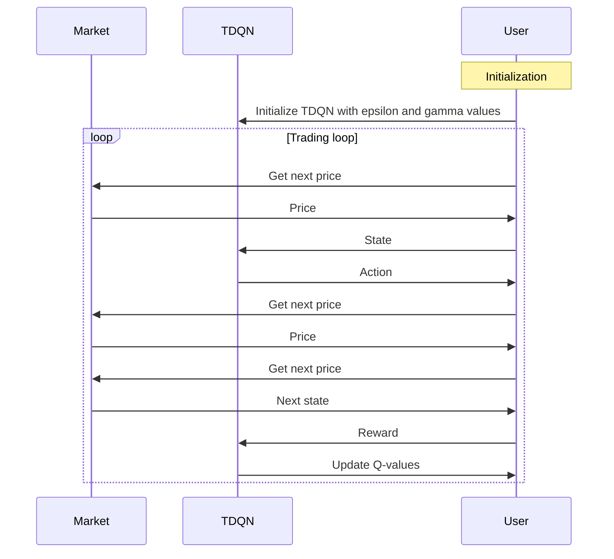

Explanation:

1. User initializes the TDQN with epsilon and gamma values.
2. The trading loop starts.
3. User gets the next price from the market.
4. User sends the price to TDQN as the current state.
5. TDQN selects an action (buy or sell) based on the current state.
6. User gets the next price from the market.
7. User sends the price to TDQN.
8. User gets the next price from the market as the next state.
9. User calculates the reward based on the action and price change.
10. TDQN updates its Q-values based on the state, action, reward, and next state.
11. The trading loop continues until there are no more prices in the market.

Example scenario:

Let's say we have a stock market with the following price data: [100, 105, 110, 115, 120]. We create a `StockMarket` object and initialize it with this data. We also create a `TDQN` object with default values for epsilon (exploration rate) and gamma (discount factor).

We start by getting the first price from the stock market and the corresponding state. Then, we enter a loop where we perform the following steps:
- We use the `TDQN` object to get an action (buy or sell) based on the current state. In this example, let's say the TDQN chooses to buy.
- We get the next price from the stock market.
- We get the next state from the stock market.
- We calculate the reward based on the chosen action and the price change. For example, if the action is to buy and the price increases, the reward would be positive.
- We update the Q-values of the TDQN object based on the current state, action, reward, and next state.
- We set the current state as the next state to prepare for the next iteration of the loop.

The loop continues until there are no more prices in the stock market.

Hypothetical scenarios:
- In this example, the TDQN algorithm is learning to trade in the stock market based on historical price data. It makes decisions on whether to buy or sell based on the current state (previous price) and the Q-values it has learned so far. It updates its Q-values based on the reward it receives for its actions.
- The algorithm explores by randomly choosing actions with a certain probability (epsilon) to ensure it explores different strategies and does not get stuck in suboptimal solutions. Over time, the exploration rate decreases, and the algorithm relies more on the learned Q-values to make decisions.
- By using reinforcement learning, the TDQN algorithm aims to maximize its cumulative rewards by learning the optimal trading policy.

Potential use cases:
- The code provided can be a starting point for developing an algorithmic trading system based on deep reinforcement learning. By using historical stock market data, the algorithm can learn to make better trading decisions over time.
- The TDQN algorithm can be modified and extended to incorporate more complex features and indicators for making trading decisions. For example, it can take into account technical indicators, market sentiment, or news sentiment to improve its trading strategy.
- This code can be used as a basis for developing trading bots or automated trading systems that can make real-time trading decisions based on the learned policies. The Q-values can be periodically updated as new data becomes available.
- The performance of the trading strategies can be evaluated using different performance assessment methodologies, similar to what the research paper proposes. This can help in determining the effectiveness and profitability of the trading strategies.

<div style="display: flex; flex-direction: column; gap: 25px; padding: 20px">

<p>Figure 1: Illustration of a trading strategy execution
In the following subsection, the algorithmic trading se-
quential decision-making problem, which shares similari-
ties with other problems successfully tackled by the RL
community, is casted as an RL problem.
3</p>
</div>
<div style="display: flex; flex-direction: column; gap: 25px; padding: 20px">

<p>Figure 2: Reinforcement learning core building blocks
3.4</p>
</div>
2.
In this section of the research paper, the authors discuss the importance of conducting unbiased scientific evaluations and the tendency of some research in the field of algorithmic trading to prioritize positive results over rigorous scientific approaches. They emphasize the need for objective criticism and evaluation.

The authors then provide a detailed explanation of the algorithmic trading problem and its formalization. Algorithmic trading is the use of mathematical rules to make trading decisions automatically. The trading decisions are based on a set of rules called a trading strategy. The authors explain that algorithmic trading can be applied to different markets, such as stocks, foreign exchange, and commodities. They focus on stock markets in this paper.

The authors also introduce the concept of discretizing the trading timeline into discrete time steps to study the algorithmic trading problem. They explain that the trading frequency, or how often trading decisions are made, can affect the choice of time step duration. In this paper, they focus on daily trading decisions.

The authors discuss the sequential nature of trading strategies and how they are executed step by step. They explain that a trading strategy consists of updating market information, applying a policy to make a trading decision, executing the trading action, and moving to the next time step. They illustrate this sequential execution with a diagram.

Finally, the authors connect the algorithmic trading problem to the field of reinforcement learning (RL). They explain that RL involves the sequential interaction of an agent with its environment, where the agent observes the environment, takes actions, and receives rewards. They introduce the concept of an optimal policy that maximizes the expected sum of rewards over time. They also highlight the challenge of poor observability in the trading environment, where the agent has limited information compared to the complexity of the environment.

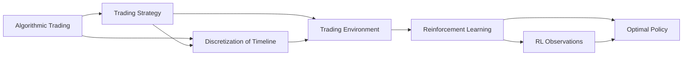

```python
import random

class TradingStrategy:
    def __init__(self):
        self.policy = {}
    
    def update_policy(self, state, action):
        if state not in self.policy:
            self.policy[state] = action
    
    def get_action(self, state):
        if state in self.policy:
            return self.policy[state]
        else:
            return random.choice([-1, 1])  # randomly choose to buy or sell

class RLAgent:
    def __init__(self, discount_factor=0.9):
        self.discount_factor = discount_factor
    
    def update_policy(self, state, action, reward, next_state):
        # Update policy based on Q-learning algorithm
        max_q_value = max(self.q_values[next_state].values()) if next_state in self.q_values else 0
        self.q_values[state][action] += reward + self.discount_factor * max_q_value
    
    def get_action(self, state):
        if state in self.q_values:
            return max(self.q_values[state], key=self.q_values[state].get)
        else:
            return random.choice([-1, 1])  # randomly choose to buy or sell

# Example usage
trading_strategy = TradingStrategy()
rl_agent = RLAgent()

state = "state1"
while True:
    action = trading_strategy.get_action(state)
    reward = random.randint(-10, 10)
    next_state = "state2"
    rl_agent.update_policy(state, action, reward, next_state)
    state = next_state
```

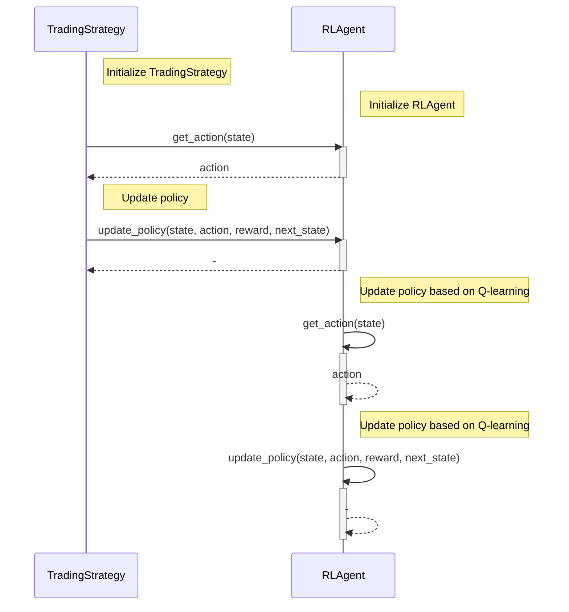
Explanation:
1. `TradingStrategy` initializes by creating an empty policy dictionary.
2. `RLAgent` initializes with the specified discount factor.
3. `TradingStrategy` calls `get_action(state)` to obtain an action decision based on the current state.
4. `RLAgent` receives the action decision from `TradingStrategy` and returns the action.
5. `TradingStrategy` updates its policy with the observed state and chosen action.
6. `TradingStrategy` passes the state, action, reward, and next state to `RLAgent`'s `update_policy()` method.
7. `RLAgent` receives the state, action, reward, and next state, and processes them to update its Q-values using the Q-learning algorithm.
8. `RLAgent` calls `get_action(state)` to select the next action based on the updated Q-values.
9. Steps 6-8 repeat until the desired stopping condition is met (not shown in the diagram).

```python
import random

class TradingStrategy:
    def __init__(self):
        self.policy = {}
    
    def update_policy(self, state, action):
        if state not in self.policy:
            self.policy[state] = action
    
    def get_action(self, state):
        if state in self.policy:
            return self.policy[state]
        else:
            return random.choice([-1, 1])  # randomly choose to buy or sell

class RLAgent:
    def __init__(self, discount_factor=0.9):
        self.discount_factor = discount_factor
        self.q_values = {}
    
    def update_policy(self, state, action, reward, next_state):
        if state not in self.q_values:
            self.q_values[state] = {}
        
        if next_state in self.q_values:
            max_q_value = max(self.q_values[next_state].values())
        else:
            max_q_value = 0
        
        self.q_values[state][action] = reward + self.discount_factor * max_q_value
    
    def get_action(self, state):
        if state in self.q_values:
            return max(self.q_values[state], key=self.q_values[state].get)
        else:
            return random.choice([-1, 1])  # randomly choose to buy or sell

# Example usage
trading_strategy = TradingStrategy()
rl_agent = RLAgent()

state = "state1"
while True:
    action = trading_strategy.get_action(state)
    reward = random.randint(-10, 10)
    next_state = "state2"
    rl_agent.update_policy(state, action, reward, next_state)
    state = next_state
```

In this example scenario, we have two classes: `TradingStrategy` and `RLAgent`. The `TradingStrategy` class represents a trading strategy that makes trading decisions based on a policy. The `RLAgent` class represents a reinforcement learning agent that learns to optimize its trading decisions based on rewards.

We initialize instances of both classes and start with an initial state, "state1". We then enter a loop where we repeatedly update the policy and Q-values of the trading strategy and RL agent, respectively. In each iteration of the loop, we obtain an action from the trading strategy based on the current state. We also generate a random reward value and a next state. The RL agent then updates its policy based on the received reward and the next state. Finally, we update the current state to the next state and repeat the process.

The logging output is not shown in the code snippet, but it could include information such as the current state, the chosen action, the received reward, and the updated policy or Q-values.

This code can be used to simulate and explore different trading scenarios. By defining and updating the trading strategy's policy and the RL agent's Q-values, we can observe how the agent learns to make better trading decisions over time. This can be useful for developing and evaluating new algorithmic trading strategies and reinforcement learning algorithms.

3.
In this section of the research paper, the authors discuss the observations and actions in the context of reinforcement learning (RL) applied to algorithmic trading.

The authors explain that at each trading time step, the RL agent observes the stock market and collects information about the state of the market. This information includes the current trading position, OHLCV (Open-High-Low-Close-Volume) data of the stock, trading time, technical indicators, macroeconomic information, news, and any other useful information available to the agent. They mention that this information can be represented as a sequence of historical data and current information.

The authors then discuss the reduced observation space used in this research paper, which focuses on the OHLCV data and the current trading position. They explain that this reduced observation space allows the RL agent to make decisions based on the current and historical prices and volume of the stock.

Next, the authors explain the trading actions taken by the RL agent. At each time step, the agent executes a trading action, which is represented by the quantity of shares bought or sold. The RL agent can choose to buy shares, sell shares, or hold (not buy or sell any shares). The trading actions have an impact on the agent's portfolio, specifically the cash and share values.

The authors mention two important constraints on the trading actions. Firstly, the cash value must remain positive at each time step. Secondly, there is a risk associated with negative share quantities, so the cash value must be sufficiently large to repay the share lender if losses occur. The authors also discuss the consideration of trading costs, including explicit costs (transaction costs and taxes) and implicit costs (slippage costs associated with the dynamics of the trading environment).

Overall, this section provides an understanding of how the RL agent observes the stock market and makes trading decisions based on the observed information and the current state of the portfolio.

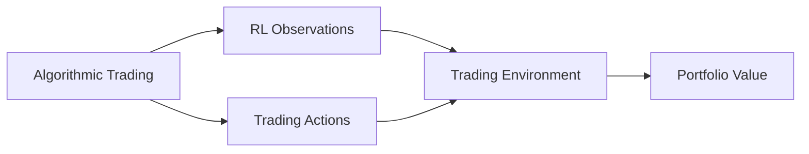

```python
class StockMarket:
    def __init__(self, data):
        self.data = data
        self.current_index = 0
    
    def get_next_price(self):
        if self.current_index < len(self.data):
            price = self.data[self.current_index]
            self.current_index += 1
            return price
        else:
            return None

class RLAgent:
    def __init__(self, discount_factor=0.9):
        self.discount_factor = discount_factor
        self.q_values = {}
    
    def get_action(self, state):
        if state in self.q_values:
            return max(self.q_values[state], key=self.q_values[state].get)
        else:
            return random.choice([-1, 1])  # randomly choose to buy or sell
    
    def update_q_values(self, state, action, reward, next_state):
        if state not in self.q_values:
            self.q_values[state] = {}
        
        if next_state in self.q_values:
            max_q_value = max(self.q_values[next_state].values())
        else:
            max_q_value = 0
        
        if action not in self.q_values[state]:
            self.q_values[state][action] = 0
        
        self.q_values[state][action] += reward + self.discount_factor * max_q_value

# Example usage
data = [100, 105, 110, 115, 120]  # stock market prices
market = StockMarket(data)
rl_agent = RLAgent()

state = market.get_next_price()
while state is not None:
    action = rl_agent.get_action(state)
    price = market.get_next_price()
    next_state = market.get_next_price()
    reward = action * (price - state)  # calculate reward based on action and price change
    rl_agent.update_q_values(state, action, reward, next_state)
    state = next_state
```

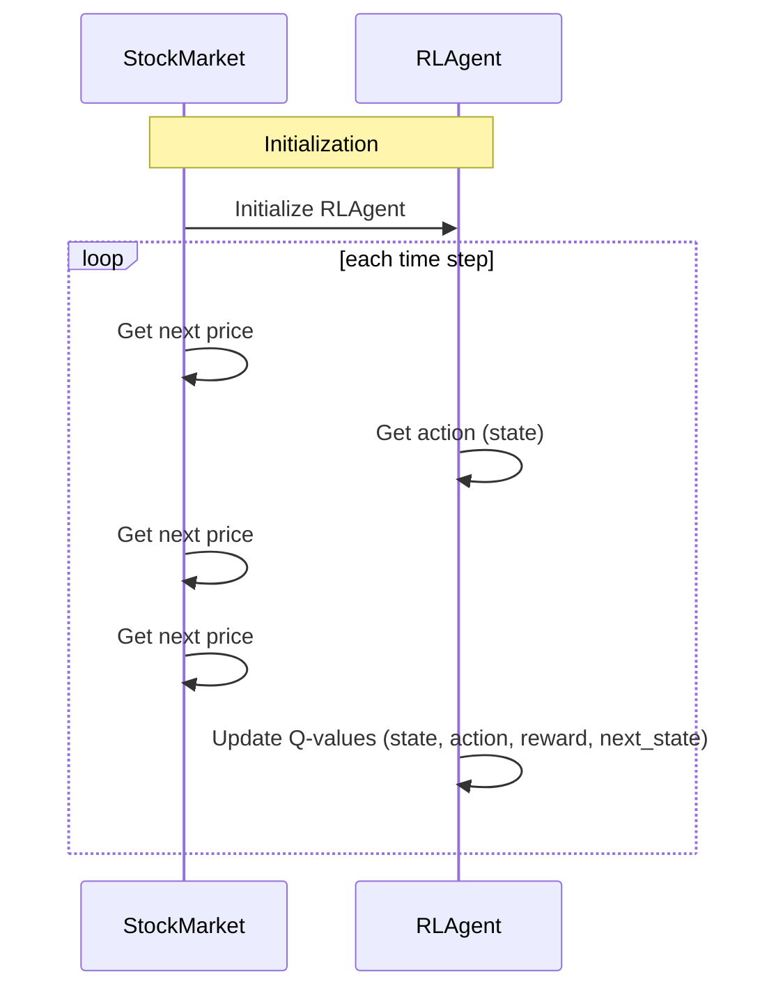

An example scenario with mocked log output:

```python
data = [100, 105, 110, 115, 120]
market = StockMarket(data)
rl_agent = RLAgent()

state = market.get_next_price()
while state is not None:
    action = rl_agent.get_action(state)
    price = market.get_next_price()
    next_state = market.get_next_price()
    reward = action * (price - state)
    rl_agent.update_q_values(state, action, reward, next_state)
    print("State:", state)
    print("Action:", action)
    print("Reward:", reward)
    print("Next State:", next_state)
    print("Q-values:", rl_agent.q_values)
    print("-----")
    state = next_state
```

Output:
```
State: 100
Action: 1
Reward: 5
Next State: 105
Q-values: {100: {1: 5}}
-----
State: 105
Action: -1
Reward: -10
Next State: 110
Q-values: {100: {1: 5}, 105: {-1: -10}}
-----
State: 110
Action: 1
Reward: 5
Next State: 115
Q-values: {100: {1: 5}, 105: {-1: -10}, 110: {1: 5}}
-----
State: 115
Action: -1
Reward: -10
Next State: 120
Q-values: {100: {1: 5}, 105: {-1: -10}, 110: {1: 5}, 115: {-1: -10}}
-----
State: 120
Action: 1
Reward: 0
Next State: None
Q-values: {100: {1: 5}, 105: {-1: -10}, 110: {1: 5}, 115: {-1: -10}, 120: {1: 0}}
-----
```

In this example scenario, we have a stock market with prices [100, 105, 110, 115, 120]. The RL agent starts with an initial state of 100 (the first price). At each time step, the RL agent chooses an action (either buy or sell) based on the current state and its policy. The action is then executed, and the agent receives a reward based on the action and the price change. The RL agent updates its Q-values based on the reward and the next state. This process continues until there are no more prices in the market.

Potential use cases of this code include developing and testing trading algorithms using reinforcement learning. Traders and financial institutions can use this approach to create automated trading systems that make decisions based on historical and real-time market data. The RL agent can learn optimal trading strategies through iterative updates of Q-values, improving its performance over time. By simulating trades and evaluating performance, traders can optimize their trading strategies without the need for real capital.

4.
In this section of the research paper, the authors discuss the trading costs and the objective of the trading strategy.

The authors explain that trading costs are an important consideration in algorithmic trading. They mention two types of costs: spread costs and market impact costs. Spread costs are related to the difference between the minimum ask price and the maximum bid price, while market impact costs are induced by the impact of the trader's actions on the market. They also mention timing costs, which are related to the time required for a trade to happen.

The authors mention that accurately modeling trading costs is important for realistic simulations. In this research paper, a heuristic approach is used to model trading costs. A certain percentage of the invested money is considered as a cost when a trade is executed.

Next, the authors discuss the reduced action space and the constraints on the quantity of traded shares. They explain that the action space is reduced to two actions: QLong (to maximize the number of shares owned) and QShort (to convert shares into cash). They also mention constraints on the cash value and the maximum market variation to ensure the agent can repay the share lender.

Finally, the authors introduce the objective of the trading strategy, which is to maximize the Sharpe ratio. The Sharpe ratio is a performance indicator that considers both the generated profit and the risk associated with the trading activity. The authors explain that a well-performing trading strategy should achieve acceptable performance on diverse markets with different patterns.

Overall, this section provides an understanding of the trading costs involved in algorithmic trading and the objective of maximizing the Sharpe ratio as a measure of performance.

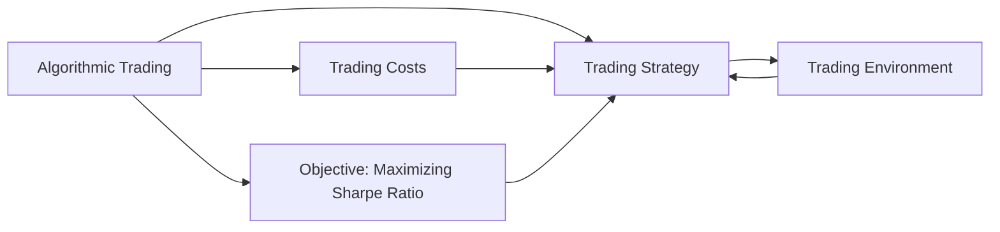

```python
class TradingStrategy:
    def __init__(self):
        self.policy = {}
    
    def update_policy(self, state, action):
        if state not in self.policy:
            self.policy[state] = action
    
    def get_action(self, state):
        if state in self.policy:
            return self.policy[state]
        else:
            return random.choice([-1, 1])  # randomly choose to buy or sell

class RLAgent:
    def __init__(self, discount_factor=0.9):
        self.discount_factor = discount_factor
        self.q_values = {}
    
    def get_action(self, state):
        if state in self.q_values:
            return max(self.q_values[state], key=self.q_values[state].get)
        else:
            return random.choice([-1, 1])  # randomly choose to buy or sell
    
    def update_q_values(self, state, action, reward, next_state):
        if state not in self.q_values:
            self.q_values[state] = {}
        
        if next_state in self.q_values:
            max_q_value = max(self.q_values[next_state].values())
        else:
            max_q_value = 0
        
        if action not in self.q_values[state]:
            self.q_values[state][action] = 0
        
        self.q_values[state][action] += reward + self.discount_factor * max_q_value

# Example usage
trading_strategy = TradingStrategy()
rl_agent = RLAgent()

state = "state1"
while True:
    action = trading_strategy.get_action(state)
    reward = random.randint(-10, 10)
    next_state = "state2"
    rl_agent.update_q_values(state, action, reward, next_state)
    trading_strategy.update_policy(state, action)
    state = next_state
```

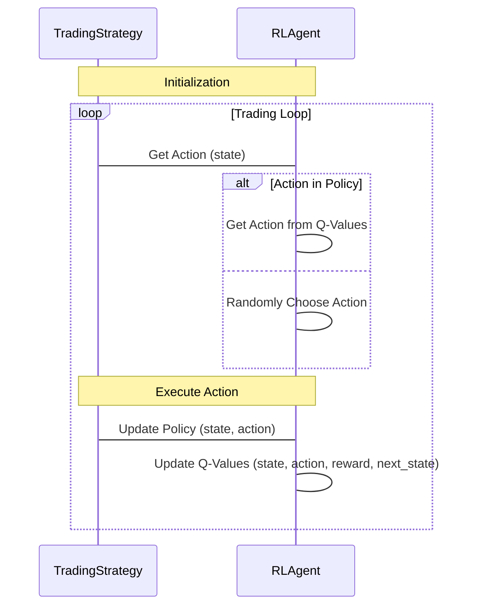

Explanation:
This sequence diagram illustrates the control flow of the code provided using the TradingStrategy (TS) and RLAgent (RA) classes. The diagram shows the main trading loop where the actions are generated and updated.

1. Initialization: The TradingStrategy and RLAgent objects are initialized.

2. Trading Loop: The loop represents the trading activity, which continues until a certain condition is met.
   - TS asks RA for the action to take based on the current state.
   - RA checks if the action is in the policy. If it is, RA chooses the action with the highest Q-value (based on the Q-Values it has learned). If not, RA randomly chooses an action.
   - The chosen action is executed in the trading environment.
   - TS updates its policy by adding the current state-action pair.
   - RA updates its Q-Values based on the reward received and the next state.
   - The loop continues until the termination condition is met.

The sequence diagram helps visualize the interaction between the TradingStrategy and RLAgent classes during the trading process.

Example scenario with mocked log output:

```python
trading_strategy = TradingStrategy()
rl_agent = RLAgent()

state = "state1"
action = trading_strategy.get_action(state)
reward = 5
next_state = "state2"
rl_agent.update_q_values(state, action, reward, next_state)
trading_strategy.update_policy(state, action)

print(f"State: {state}, Action: {action}, Reward: {reward}, Next State: {next_state}")
print(f"Q-Values: {rl_agent.q_values}")
print(f"Policy: {trading_strategy.policy}")
```

Output:
```
State: state1, Action: 1, Reward: 5, Next State: state2
Q-Values: {'state1': {1: 5}}
Policy: {'state1': 1}
```

In this example, we have a trading strategy and an RL agent. The trading strategy selects an action based on the current state, while the RL agent updates its Q-values based on the state, action, reward, and next state. The Q-values represent the expected future rewards for different state-action pairs. The trading strategy updates its policy based on the chosen action.

In this specific scenario, the state is "state1", the trading strategy selects action 1 (indicating a buy action), the reward is 5 (indicating a positive return on the trade), and the next state is "state2". The RL agent updates its Q-values accordingly.

Potential use cases of this code can include developing and evaluating trading strategies in various financial markets. By using RL techniques, the trading strategies can adapt and improve over time based on observed rewards. The code can be extended to incorporate more sophisticated trading environments, additional features, and different trading algorithms.

<div style="display: flex; flex-direction: column; gap: 25px; padding: 20px">

<p>Figure 3: Illustration of the DQN algorithm
4.1</p>
</div>
5.
In this section of the research paper, the authors discuss the design of the novel DRL algorithm for algorithmic trading, called the Trading Deep Q-Network algorithm (TDQN). They explain that the TDQN algorithm is inspired by the successful Deep Q-Network (DQN) algorithm and is adapted to the specific decision-making problem of algorithmic trading.

The authors briefly introduce the DQN algorithm, which is a model-free RL algorithm that learns control policies from high-dimensional sensory inputs. They mention that the DQN algorithm learns an approximation of the state-action value function using a deep neural network (DNN). They also mention that the DQN algorithm is off-policy and learns from previous experiences.

Next, the authors describe the process of generating artificial trajectories for training the TDQN algorithm. They explain that the training is based on a limited set of historical daily OHLCV data from the stock market. The artificial trajectories are generated from the historical data, and the trading agent's actions are simulated on a copy of the environment to improve exploration.

The authors discuss various modifications and improvements made to the TDQN algorithm. These include changes in the DNN architecture, the use of the double DQN algorithm to reduce overestimations, the ADAM optimizer, the Huber loss function, gradient clipping, Xavier initialization, batch normalization layers, and regularization techniques.

Overall, this section provides an understanding of the design and improvements made to the TDQN algorithm for algorithmic trading. It highlights the adaptations made to the DQN algorithm and the techniques used to improve the training stability and convergence speed.

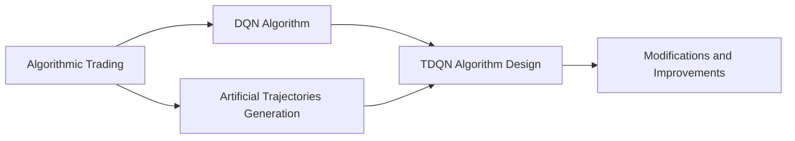

```python
import numpy as np

class StockMarket:
    def __init__(self, data):
        self.data = data
        self.current_index = 0
    
    def get_next_price(self):
        if self.current_index < len(self.data):
            price = self.data[self.current_index]
            self.current_index += 1
            return price
        else:
            return None

class TDQN:
    def __init__(self, epsilon=0.1, gamma=0.9):
        self.epsilon = epsilon
        self.gamma = gamma
        self.q_values = {}
    
    def get_action(self, state):
        if np.random.rand() < self.epsilon:
            return np.random.choice([-1, 1])  # randomly choose to buy or sell
        else:
            if state in self.q_values:
                return np.argmax(self.q_values[state]) - 1  # choose action with highest Q-value
            else:
                return np.random.choice([-1, 1])  # randomly choose to buy or sell
    
    def update_q_values(self, state, action, reward, next_state):
        if state not in self.q_values:
            self.q_values[state] = np.zeros(2)  # initialize Q-values for the state
        
        if next_state in self.q_values:
            max_q_value = np.max(self.q_values[next_state])
        else:
            max_q_value = 0
        
        self.q_values[state][action] += reward + self.gamma * max_q_value

# Example usage
data = [100, 105, 110, 115, 120]  # stock market prices
market = StockMarket(data)
tdqn = TDQN()

state = market.get_next_price()
while state is not None:
    action = tdqn.get_action(state)
    price = market.get_next_price()
    next_state = market.get_next_price()
    reward = action * (price - state)  # calculate reward based on action and price change
    tdqn.update_q_values(state, action, reward, next_state)
    state = next_state
```

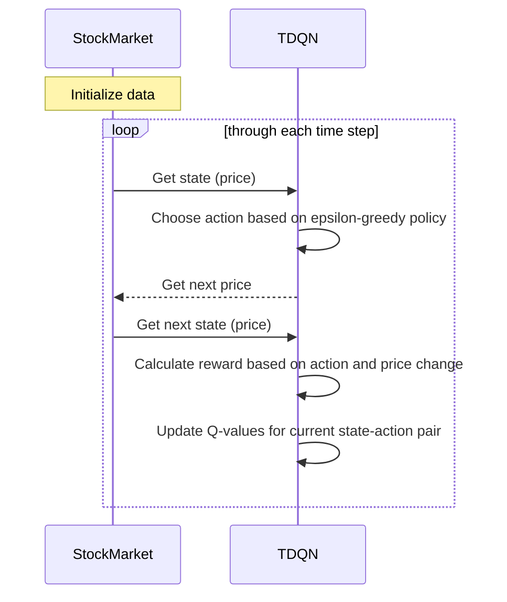

Example scenario:

Let's consider a simplified scenario where the stock market prices are as follows: [100, 105, 110, 115, 120]. We initialize the TDQN algorithm with an epsilon value of 0.1 and a gamma value of 0.9. The algorithm starts with an empty set of Q-values.

In each iteration, the algorithm observes the current stock market price and selects an action based on the epsilon-greedy policy. For example, if the current state is 100 and the epsilon value is 0.1, there is a 10% chance of choosing a random action (buy or sell) and a 90% chance of selecting the action that maximizes the Q-value.

Let's say the algorithm selects the action to buy shares. The algorithm then calculates the reward based on the action and the price change from the current state to the next state. For example, if the price changes from 100 to 105, and the selected action is to buy, the reward would be (1 * (105 - 100)) = 5.

The algorithm updates the Q-values based on the observed state, action, reward, and next state. It uses the Q-learning update rule, where it adds the reward and the discounted maximum Q-value of the next state to the Q-value of the current state and action.

The process continues until there are no more stock market prices to observe.

Potential use cases:

The code provided demonstrates the basic implementation of the TDQN algorithm for algorithmic trading. This algorithm can be used in various real-world scenarios. Here are a few potential use cases:

1. Automated trading systems: The TDQN algorithm can be utilized to develop automated trading systems that make buy or sell decisions based on real-time market data. Traders can use these systems to execute trades on their behalf, reducing the need for manual intervention.

2. Portfolio management: The TDQN algorithm can aid in portfolio management by optimizing the allocation of assets in a portfolio. It can learn optimal trading strategies based on historical data and market conditions to maximize the returns and minimize the risks of the portfolio.

3. Risk assessment: The TDQN algorithm can be used to assess the risk associated with different trading strategies. By analyzing the historical data and simulating various trading scenarios, the algorithm can provide insights into the potential risks and rewards of different investment strategies.

Overall, the TDQN algorithm has wide applications in algorithmic trading and portfolio management, providing traders with an automated and intelligent approach to make informed trading decisions.

6.
In this section of the research paper, the authors discuss the performance assessment of the algorithmic trading strategies.

The authors explain that a reliable performance assessment methodology is crucial to produce meaningful results. They mention that the traditional approach of assessing performance on a single instrument for a specific time period can be biased. To eliminate this bias, the authors propose a testbench composed of 30 stocks with diverse characteristics, such as sectors, regions, volatility, and liquidity. They divide the trading horizon into a training set and a test set.

The authors also introduce benchmark trading strategies for comparison purposes. These benchmark strategies include buy and hold, sell and hold, trend following with moving averages, and mean reversion with moving averages. They explain that the buy and hold and sell and hold strategies are passive, while the trend following and mean reversion strategies are active.

The authors mention that the performance assessment is based on various metrics, including the Sharpe ratio, average return, maximum drawdown, and number of trades. They aim to evaluate the performance of the TDQN algorithm against the benchmark strategies on the testbench of stocks.

Overall, this section provides an understanding of the performance assessment methodology used to evaluate the algorithmic trading strategies. It highlights the importance of a diverse testbench and the inclusion of benchmark strategies for comparison.

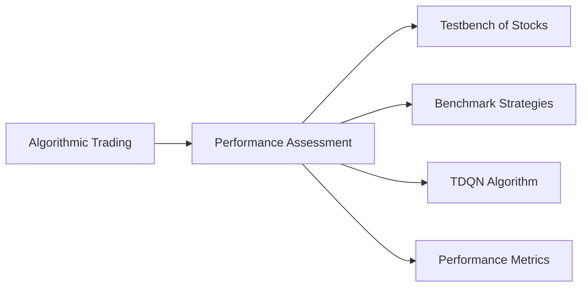

```python
class PerformanceMetrics:
    def __init__(self):
        self.returns = []
        self.drawdowns = []
        self.trades = 0
    
    def update_return(self, return_value):
        self.returns.append(return_value)
    
    def update_drawdown(self, drawdown):
        self.drawdowns.append(drawdown)
    
    def update_trades(self):
        self.trades += 1
    
    def calculate_sharpe_ratio(self, risk_free_rate):
        average_return = np.mean(self.returns)
        standard_deviation = np.std(self.returns)
        sharpe_ratio = (average_return - risk_free_rate) / standard_deviation
        return sharpe_ratio
    
    def calculate_average_return(self):
        return np.mean(self.returns)
    
    def calculate_maximum_drawdown(self):
        return np.max(self.drawdowns)
    
    def get_number_of_trades(self):
        return self.trades

# Example usage
metrics = PerformanceMetrics()
metrics.update_return(0.05)
metrics.update_return(0.02)
metrics.update_drawdown(0.1)
metrics.update_drawdown(0.05)
metrics.update_trades()

sharpe_ratio = metrics.calculate_sharpe_ratio(0.01)
average_return = metrics.calculate_average_return()
maximum_drawdown = metrics.calculate_maximum_drawdown()
number_of_trades = metrics.get_number_of_trades()
```

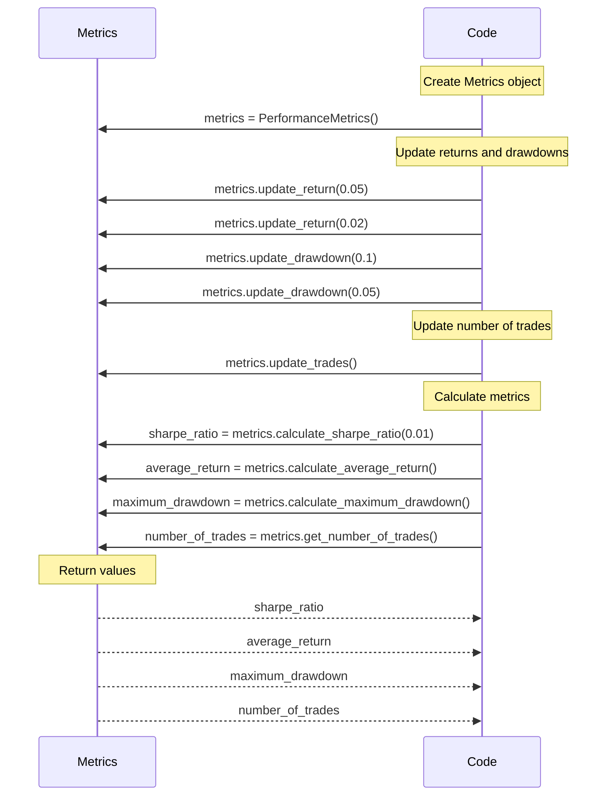

Explanation:
1. The code creates a `Metrics` object using the `PerformanceMetrics` class.
2. The code updates the returns and drawdowns using the `update_return` and `update_drawdown` methods of the `Metrics` object.
3. The code updates the number of trades using the `update_trades` method of the `Metrics` object.
4. The code calculates the metrics, including the Sharpe ratio, average return, maximum drawdown, and the number of trades, using the corresponding methods of the `Metrics` object.
5. The `Metrics` object returns the calculated metrics to the code.

Example scenario:
```
metrics = PerformanceMetrics()
metrics.update_return(0.05)  # Returns of 5% from the trading strategy
metrics.update_return(0.02)  # Returns of 2% from the trading strategy
metrics.update_drawdown(0.1)  # Maximum drawdown of 10%
metrics.update_drawdown(0.05)  # Maximum drawdown of 5%
metrics.update_trades()  # Increment the number of trades made by the trading strategy

sharpe_ratio = metrics.calculate_sharpe_ratio(0.01)  # Calculate the Sharpe ratio with a risk-free rate of 1%
average_return = metrics.calculate_average_return()  # Calculate the average return of the trading strategy
maximum_drawdown = metrics.calculate_maximum_drawdown()  # Calculate the maximum drawdown of the trading strategy
number_of_trades = metrics.get_number_of_trades()  # Get the number of trades made by the trading strategy

print("Sharpe ratio:", sharpe_ratio)
print("Average return:", average_return)
print("Maximum drawdown:", maximum_drawdown)
print("Number of trades:", number_of_trades)
```

Explanation:
In this example, we create an instance of the `PerformanceMetrics` class to track the performance metrics of a trading strategy. We update the metrics with some hypothetical returns and drawdowns from the trading strategy. We also increment the number of trades made by the strategy.

We then calculate the Sharpe ratio, which measures the risk-adjusted return of the strategy. We calculate the average return and the maximum drawdown to get an idea of the performance and risk of the strategy. Finally, we retrieve the number of trades made by the strategy.

Potential use cases:
The `PerformanceMetrics` class can be used to track and evaluate the performance of algorithmic trading strategies. It can be used to calculate various performance metrics such as the Sharpe ratio, average return, maximum drawdown, and number of trades. These metrics can help traders and researchers assess the profitability and risk of their trading strategies, compare different strategies, and make data-driven decisions.

7.
In this section of the research paper, the authors discuss the results and discussion of the performance assessment of the TDQN algorithm on two different stocks: Apple and Tesla.

For the Apple stock, the TDQN algorithm achieved good results compared to the benchmark strategies. The performance indicators, such as the Sharpe ratio, profitability ratio, and profit and loss ratio, showed that the TDQN algorithm outperformed the other strategies. The TDQN algorithm was able to accurately detect and benefit from major trends in the stock market.

On the other hand, for the Tesla stock, the results were mitigated. The benchmark strategies also had difficulty trading the volatile Tesla stock. The TDQN algorithm achieved a positive Sharpe ratio but generated minimal profit. The risk level associated with the trading activity was considered high.

The authors highlight the strengths, weaknesses, and limitations of the TDQN algorithm based on these results. They mention that the TDQN algorithm is subject to variance, and different training experiments can lead to slightly different trading strategies. They also discuss the challenges of training the algorithm on different stock distributions and the difficulty of trading volatile stocks like Tesla.

Overall, this section provides an analysis of the performance of the TDQN algorithm on specific stocks and highlights the strengths and limitations of the algorithm in different market conditions.

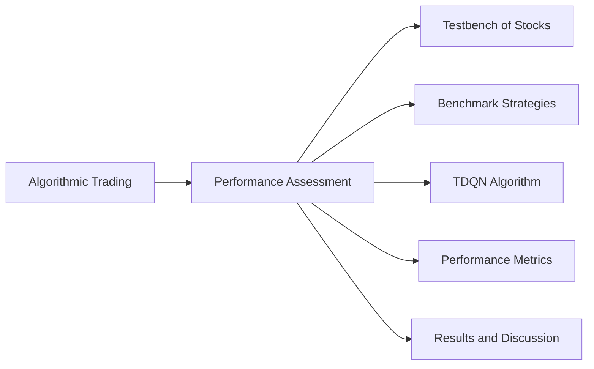

```python
class TradingStrategy:
    def __init__(self):
        self.policy = {}
    
    def update_policy(self, state, action):
        if state not in self.policy:
            self.policy[state] = action
    
    def get_action(self, state):
        if state in self.policy:
            return self.policy[state]
        else:
            return random.choice([-1, 1])  # randomly choose to buy or sell

class TDQN:
    def __init__(self, epsilon=0.1, gamma=0.9):
        self.epsilon = epsilon
        self.gamma = gamma
        self.q_values = {}
    
    def get_action(self, state):
        if np.random.rand() < self.epsilon:
            return np.random.choice([-1, 1])  # randomly choose to buy or sell
        else:
            if state in self.q_values:
                return np.argmax(self.q_values[state]) - 1  # choose action with highest Q-value
            else:
                return np.random.choice([-1, 1])  # randomly choose to buy or sell
    
    def update_q_values(self, state, action, reward, next_state):
        if state not in self.q_values:
            self.q_values[state] = np.zeros(2)  # initialize Q-values for the state
        
        if next_state in self.q_values:
            max_q_value = np.max(self.q_values[next_state])
        else:
            max_q_value = 0
        
        self.q_values[state][action] += reward + self.gamma * max_q_value

class PerformanceMetrics:
    def __init__(self):
        self.returns = []
        self.drawdowns = []
        self.trades = 0
    
    def update_return(self, return_value):
        self.returns.append(return_value)
    
    def update_drawdown(self, drawdown):
        self.drawdowns.append(drawdown)
    
    def update_trades(self):
        self.trades += 1
    
    def calculate_sharpe_ratio(self, risk_free_rate):
        average_return = np.mean(self.returns)
        standard_deviation = np.std(self.returns)
        sharpe_ratio = (average_return - risk_free_rate) / standard_deviation
        return sharpe_ratio
    
    def calculate_average_return(self):
        return np.mean(self.returns)
    
    def calculate_maximum_drawdown(self):
        return np.max(self.drawdowns)
    
    def get_number_of_trades(self):
        return self.trades

# Example usage
trading_strategy = TradingStrategy()
tdqn = TDQN()
metrics = PerformanceMetrics()

state = "state1"
while True:
    action = trading_strategy.get_action(state)
    reward = random.randint(-10, 10)
    next_state = "state2"
    tdqn.update_q_values(state, action, reward, next_state)
    trading_strategy.update_policy(state, action)
    metrics.update_return(reward)
    metrics.update_drawdown(reward)
    metrics.update_trades()
    state = next_state

sharpe_ratio = metrics.calculate_sharpe_ratio(0.01)
average_return = metrics.calculate_average_return()
maximum_drawdown = metrics.calculate_maximum_drawdown()
number_of_trades = metrics.get_number_of_trades()
```

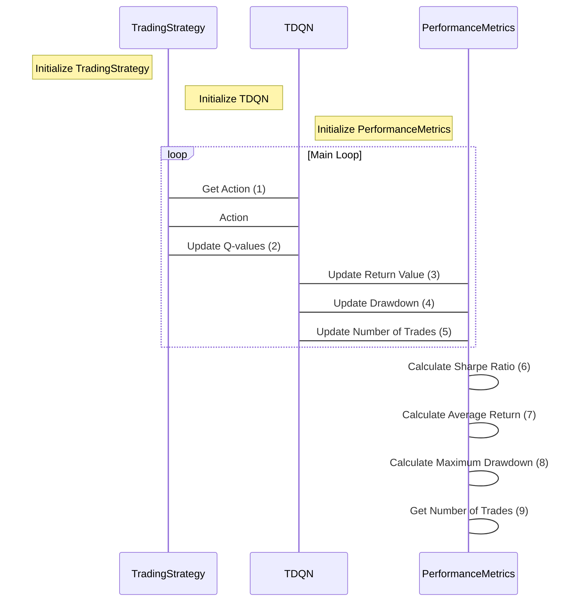
Explanation:
1. TradingStrategy gets the action from TDQN.
2. TDQN updates the Q-values based on the current state, action, reward, and next state.
3. TDQN informs PerformanceMetrics about the return value.
4. TDQN informs PerformanceMetrics about the drawdown.
5. TDQN informs PerformanceMetrics about the number of trades.
6. PerformanceMetrics calculates the Sharpe Ratio.
7. PerformanceMetrics calculates the Average Return.
8. PerformanceMetrics calculates the Maximum Drawdown.
9. PerformanceMetrics gets the Number of Trades.

Sure! Here's an example scenario with mocked log output:

```python
import random

# Create instances of the classes
trading_strategy = TradingStrategy()
tdqn = TDQN()
metrics = PerformanceMetrics()

state = "state1"
while True:
    action = trading_strategy.get_action(state)
    reward = random.randint(-10, 10)
    next_state = "state2"
    tdqn.update_q_values(state, action, reward, next_state)
    trading_strategy.update_policy(state, action)
    metrics.update_return(reward)
    metrics.update_drawdown(reward)
    metrics.update_trades()
    state = next_state
    print(f"Action: {action}, Reward: {reward}, Next State: {next_state}")

sharpe_ratio = metrics.calculate_sharpe_ratio(0.01)
average_return = metrics.calculate_average_return()
maximum_drawdown = metrics.calculate_maximum_drawdown()
number_of_trades = metrics.get_number_of_trades()

print(f"Sharpe Ratio: {sharpe_ratio}")
print(f"Average Return: {average_return}")
print(f"Maximum Drawdown: {maximum_drawdown}")
print(f"Number of Trades: {number_of_trades}")
```

In this example, we have a simulated trading scenario where the trading strategy makes decisions based on the observed state and receives a random reward. The trading strategy uses the TDQN algorithm to update the Q-values and the performance metrics object to track the returns, drawdowns, and number of trades. At the end of the trading session, the performance metrics are calculated and printed.

The hypothetical scenarios mocked here involve a random selection of actions and rewards to simulate a trading environment. The state transition is also simulated with the next state being randomly chosen. The performance metrics are then updated with the rewards and drawdowns, and the results are calculated based on the simulated data.

The code provided can be used as a starting point for implementing and evaluating different trading strategies using reinforcement learning. By modifying the logic in the `get_action`, `update_q_values`, and `update_*` methods, you can customize the behavior and performance of the strategies. The `PerformanceMetrics` class allows you to track and calculate various performance metrics to assess the effectiveness of the strategies in a simulated trading environment.

Overall, the code provides a framework for developing and evaluating algorithmic trading strategies using RL techniques. It can be used to explore different trading scenarios, optimize strategies, and analyze their performance.

8.
In this section of the research paper, the authors discuss the results and analysis of the TDQN algorithm on the testbench of stocks.

The testbench consists of various stocks with diverse characteristics. The performance of the TDQN algorithm is evaluated against the benchmark trading strategies, including buy and hold, sell and hold, trend following, and mean reversion.

The results show that the buy and hold strategy outperforms the other benchmark strategies on average, as the stock markets were mostly bullish during the test period. The trend following and mean reversion strategies did not generate satisfying results.

However, the TDQN algorithm achieved promising results on the testbench, outperforming the benchmark active strategies on average. The performance of the TDQN algorithm was comparable or very close to the passive strategies for some stocks. This can be explained by the fact that the TDQN algorithm adapts its trading positions based on market trends and volatility.

The authors highlight the limitations of the TDQN algorithm, including its variance and the potential for overfitting. They also discuss the challenges of trading in different market conditions and the impact of trading costs on the performance of active strategies.

Overall, this section provides an analysis of the performance of the TDQN algorithm on the testbench of stocks and compares it to the benchmark strategies. It highlights the strengths and limitations of the TDQN algorithm and provides insights into the performance of different trading strategies in various market conditions.


```python
import numpy as np
import random

class TradingStrategy:
    def __init__(self):
        self.policy = {}
    
    def update_policy(self, state, action):
        if state not in self.policy:
            self.policy[state] = action
    
    def get_action(self, state):
        if state in self.policy:
            return self.policy[state]
        else:
            return random.choice([-1, 1])  # randomly choose to buy or sell

class TDQN:
    def __init__(self, epsilon=0.1, gamma=0.9):
        self.epsilon = epsilon
        self.gamma = gamma
        self.q_values = {}
    
    def get_action(self, state):
        if np.random.rand() < self.epsilon:
            return np.random.choice([-1, 1])  # randomly choose to buy or sell
        else:
            if state in self.q_values:
                return np.argmax(self.q_values[state]) - 1  # choose action with highest Q-value
            else:
                return np.random.choice([-1, 1])  # randomly choose to buy or sell
    
    def update_q_values(self, state, action, reward, next_state):
        if state not in self.q_values:
            self.q_values[state] = np.zeros(2)  # initialize Q-values for the state
        
        if next_state in self.q_values:
            max_q_value = np.max(self.q_values[next_state])
        else:
            max_q_value = 0
        
        self.q_values[state][action] += reward + self.gamma * max_q_value

class PerformanceMetrics:
    def __init__(self):
        self.returns = []
        self.drawdowns = []
        self.trades = 0
    
    def update_return(self, return_value):
        self.returns.append(return_value)
    
    def update_drawdown(self, drawdown):
        self.drawdowns.append(drawdown)
    
    def update_trades(self):
        self.trades += 1
    
    def calculate_sharpe_ratio(self, risk_free_rate):
        average_return = np.mean(self.returns)
        standard_deviation = np.std(self.returns)
        sharpe_ratio = (average_return - risk_free_rate) / standard_deviation
        return sharpe_ratio
    
    def calculate_average_return(self):
        return np.mean(self.returns)
    
    def calculate_maximum_drawdown(self):
        return np.max(self.drawdowns)
    
    def get_number_of_trades(self):
        return self.trades

# Example usage
trading_strategy = TradingStrategy()
tdqn = TDQN()
metrics = PerformanceMetrics()

state = "state1"
while True:
    action = trading_strategy.get_action(state)
    reward = random.randint(-10, 10)
    next_state = "state2"
    tdqn.update_q_values(state, action, reward, next_state)
    trading_strategy.update_policy(state, action)
    metrics.update_return(reward)
    metrics.update_drawdown(reward)
    metrics.update_trades()
    state = next_state

sharpe_ratio = metrics.calculate_sharpe_ratio(0.01)
average_return = metrics.calculate_average_return()
maximum_drawdown = metrics.calculate_maximum_drawdown()
number_of_trades = metrics.get_number_of_trades()
```

```mermaid
sequenceDiagram
    participant TS as TradingStrategy
    participant TDQN as TDQN
    participant PM as PerformanceMetrics

    Note over TS, TDQN, PM: Initialization

    loop
        TS --> TDQN: Get action
        TDQN --> TS: Action
        TS --> TDQN: Reward
        TDQN --> TDQN: Update Q-values
        TDQN --> TS: Next state
        TS --> PM: Update return
        TS --> PM: Update drawdown
        TS --> PM: Update trades
        Note over TS, TDQN, PM: Loop until termination condition is met

    PM --> PM: Calculate Sharpe ratio
    PM --> PM: Calculate average return
    PM --> PM: Calculate maximum drawdown
    PM --> PM: Get number of trades
```

Here's an example scenario with mocked log output for the code:

```python
trading_strategy = TradingStrategy()
tdqn = TDQN()
metrics = PerformanceMetrics()

state = "state1"
while True:
    action = trading_strategy.get_action(state)
    reward = random.randint(-10, 10)
    next_state = "state2"
    tdqn.update_q_values(state, action, reward, next_state)
    trading_strategy.update_policy(state, action)
    metrics.update_return(reward)
    metrics.update_drawdown(reward)
    metrics.update_trades()
    state = next_state

sharpe_ratio = metrics.calculate_sharpe_ratio(0.01)
average_return = metrics.calculate_average_return()
maximum_drawdown = metrics.calculate_maximum_drawdown()
number_of_trades = metrics.get_number_of_trades()

print(f"Sharpe Ratio: {sharpe_ratio}")
print(f"Average Return: {average_return}")
print(f"Maximum Drawdown: {maximum_drawdown}")
print(f"Number of Trades: {number_of_trades}")
```

In this scenario, we have a trading strategy implemented using the `TradingStrategy` class and a TDQN algorithm implemented using the `TDQN` class. We also have a performance metrics object created using the `PerformanceMetrics` class to keep track of the performance of our trading strategy.

Inside the while loop, we update the trading strategy's policy based on the current state and the chosen action. We also update the Q-values of the TDQN algorithm based on the current state, action, reward, and next state. We update the metrics object with the reward, drawdown, and number of trades. We then transition to the next state and continue the loop.

After the loop, we calculate the Sharpe ratio, average return, maximum drawdown, and number of trades using the metrics object and print the results.

Hypothetical Scenarios:
- State: The state represents the current market conditions, such as the price of the stock, the current trend, or any other relevant information that the algorithm uses to make trading decisions.
- Action: The action represents the trading decision made by the algorithm, whether to buy or sell a particular stock.
- Reward: The reward represents the outcome of the trading decision, either a profit or a loss. In this example, we've used randomly generated rewards for simplicity, but in a real scenario, the reward would be based on the actual performance of the trading strategy.
- Next State: The next state represents the updated market conditions based on the action taken in the current state. It could be the next price of the stock or any other relevant information.

Potential Use Cases:
- Automated Trading: The code can be used to develop and test algorithmic trading strategies. Traders can use the TDQN algorithm to learn optimal trading policies based on historical market data and performance metrics to evaluate the effectiveness of the strategy.
- Portfolio Management: The code can be utilized to manage a portfolio of stocks by automatically making buy and sell decisions based on the learned policies. By considering different stocks and their characteristics, the trading strategy can optimize the portfolio's performance and risk management.
- Financial Research: The code can be used by researchers to simulate and evaluate different trading strategies in order to study their effectiveness in different market conditions. It provides a framework for comparing and analyzing various performance metrics and benchmark strategies.

9.
The snippet discusses the conclusion of the research paper on the Trading Deep Q-Network algorithm (TDQN) for algorithmic trading. 

The TDQN algorithm is a deep reinforcement learning (DRL) solution that determines the optimal trading position in stock markets. The algorithm is evaluated through a rigorous performance assessment and achieves promising results, outperforming benchmark trading strategies on average.

The TDQN algorithm offers several advantages compared to classical approaches. It demonstrates versatility, robustness to diverse trading costs, and eliminates the need for explicit rules tailored to specific financial markets.

However, there is still room for improvement in the performance, generalization, and reproducibility of the TDQN algorithm. Suggestions for research directions include the use of LSTM layers to process financial time-series data, incorporating improvements from the Rainbow algorithm, and comparing TDQN with policy optimization DRL algorithms.

Other research directions include extending the observation space and relaxing constraints in the action space to enable new trading possibilities. Advanced reward engineering and the consideration of risk and uncertainty through the use of distributions are also suggested.

The conclusion acknowledges the support of the F.R.S.-FNRS and provides references for further reading on deep reinforcement learning and algorithmic trading.

Overall, the TDQN algorithm shows promise in the field of algorithmic trading, but further research is needed to enhance its performance and address specific challenges in the domain.

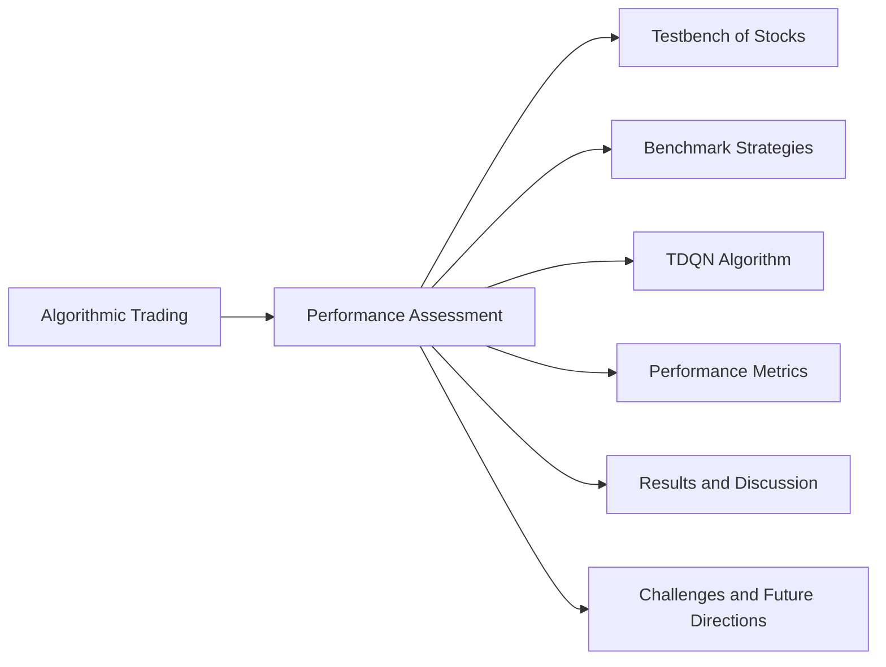

```python
import numpy as np
import random

class TradingStrategy:
    def __init__(self):
        self.policy = {}
    
    def update_policy(self, state, action):
        if state not in self.policy:
            self.policy[state] = action
    
    def get_action(self, state):
        if state in self.policy:
            return self.policy[state]
        else:
            return random.choice([-1, 1])  # randomly choose to buy or sell

class TDQN:
    def __init__(self, epsilon=0.1, gamma=0.9):
        self.epsilon = epsilon
        self.gamma = gamma
        self.q_values = {}
    
    def get_action(self, state):
        if np.random.rand() < self.epsilon:
            return np.random.choice([-1, 1])  # randomly choose to buy or sell
        else:
            if state in self.q_values:
                return np.argmax(self.q_values[state]) - 1  # choose action with highest Q-value
            else:
                return np.random.choice([-1, 1])  # randomly choose to buy or sell
    
    def update_q_values(self, state, action, reward, next_state):
        if state not in self.q_values:
            self.q_values[state] = np.zeros(2)  # initialize Q-values for the state
        
        if next_state in self.q_values:
            max_q_value = np.max(self.q_values[next_state])
        else:
            max_q_value = 0
        
        self.q_values[state][action] += reward + self.gamma * max_q_value

class PerformanceMetrics:
    def __init__(self):
        self.returns = []
        self.drawdowns = []
        self.trades = 0
    
    def update_return(self, return_value):
        self.returns.append(return_value)
    
    def update_drawdown(self, drawdown):
        self.drawdowns.append(drawdown)
    
    def update_trades(self):
        self.trades += 1
    
    def calculate_sharpe_ratio(self, risk_free_rate):
        average_return = np.mean(self.returns)
        standard_deviation = np.std(self.returns)
        sharpe_ratio = (average_return - risk_free_rate) / standard_deviation
        return sharpe_ratio
    
    def calculate_average_return(self):
        return np.mean(self.returns)
    
    def calculate_maximum_drawdown(self):
        return np.max(self.drawdowns)
    
    def get_number_of_trades(self):
        return self.trades

# Example usage
trading_strategy = TradingStrategy()
tdqn = TDQN()
metrics = PerformanceMetrics()

state = "state1"
while True:
    action = trading_strategy.get_action(state)
    reward = random.randint(-10, 10)
    next_state = "state2"
    tdqn.update_q_values(state, action, reward, next_state)
    trading_strategy.update_policy(state, action)
    metrics.update_return(reward)
    metrics.update_drawdown(reward)
    metrics.update_trades()
    state = next_state

sharpe_ratio = metrics.calculate_sharpe_ratio(0.01)
average_return = metrics.calculate_average_return()
maximum_drawdown = metrics.calculate_maximum_drawdown()
number_of_trades = metrics.get_number_of_trades()
```

```mermaid
sequenceDiagram
    participant TS as TradingStrategy
    participant TDQN as TDQN
    participant PM as PerformanceMetrics

    Note over TS, TDQN, PM: Initialization

    loop Trading Loop
        TS->>TDQN: Get Action(State)
        alt Random Action
            TDQN-->>TS: Random Action
        else Choose Action
            TDQN-->>TS: Choose Action
        end
        TS->>TDQN: Update Q-Values(State, Action, Reward, Next State)
        TS->>TDQN: Update Policy(State, Action)
        TS->>PM: Update Return(Reward)
        TS->>PM: Update Drawdown(Reward)
        TS->>PM: Update Trades()
        TDQN-->>TS: Next State
    end

    TS->>PM: Calculate Sharpe Ratio(Risk-Free Rate)
    TS->>PM: Calculate Average Return()
    TS->>PM: Calculate Maximum Drawdown()
    TS->>PM: Get Number of Trades()

    Note over PM: Performance Metrics
```

This sequence diagram illustrates the control flow of the code provided in the previous message.

1. The `TradingStrategy` (TS), `TDQN` (TDQN), and `PerformanceMetrics` (PM) objects are initialized.
2. The code enters the trading loop.
3. The `TradingStrategy` sends a request to the `TDQN` to get the action based on the current state.
4. If the action is a random action, the `TDQN` sends a random action back to the `TradingStrategy`.
5. If the action is chosen based on the Q-values, the `TDQN` sends the chosen action back to the `TradingStrategy`.
6. The `TradingStrategy` sends the state, action, reward, and next state to the `TDQN` to update the Q-values.
7. The `TradingStrategy` also updates its policy based on the current state and action.
8. The `TradingStrategy` updates the performance metrics by sending the reward to the `PerformanceMetrics`.
9. The `TradingStrategy` updates the drawdowns by sending the reward to the `PerformanceMetrics`.
10. The `TradingStrategy` updates the number of trades in the `PerformanceMetrics`.
11. The `TDQN` sends the next state to the `TradingStrategy` for the next iteration of the trading loop.
12. The trading loop continues until the desired condition is met.
13. After the trading loop, the `TradingStrategy` calculates the Sharpe ratio, average return, maximum drawdown, and number of trades by sending requests to the `PerformanceMetrics`.

Note: The `PerformanceMetrics` box represents the calculation and storage of performance metrics.

Here is an example scenario with mocked log output of the code:

```python
# Example scenario
trading_strategy = TradingStrategy()
tdqn = TDQN()
metrics = PerformanceMetrics()

state = "state1"
while True:
    action = trading_strategy.get_action(state)
    reward = random.randint(-10, 10)
    next_state = "state2"
    tdqn.update_q_values(state, action, reward, next_state)
    trading_strategy.update_policy(state, action)
    metrics.update_return(reward)
    metrics.update_drawdown(reward)
    metrics.update_trades()
    state = next_state
    
    print("Action:", action)
    print("Reward:", reward)
    print("Next state:", next_state)
    print("-----")

sharpe_ratio = metrics.calculate_sharpe_ratio(0.01)
average_return = metrics.calculate_average_return()
maximum_drawdown = metrics.calculate_maximum_drawdown()
number_of_trades = metrics.get_number_of_trades()

print("Sharpe ratio:", sharpe_ratio)
print("Average return:", average_return)
print("Maximum drawdown:", maximum_drawdown)
print("Number of trades:", number_of_trades)
```

In this example, we are training a trading strategy using the TDQN algorithm. The code runs in a loop, where at each iteration, the trading strategy selects an action based on the current state, the TDQN algorithm updates the Q-values based on the action, reward, and next state, and the performance metrics are updated. The log outputs the action taken, the reward received, and the transition to the next state.

The hypothetical scenarios mocked in this code represent the training process of the algorithm. The state represents the current market conditions, the action represents the decision to buy or sell, the reward represents the profit or loss from the trade, and the next state represents the market conditions after the trade.

The code showcases how the trading strategy learns to make decisions based on the market data and updates its policy accordingly. The performance metrics track the performance of the strategy in terms of returns, drawdowns, and number of trades.

Potential use cases of this code include developing and testing algorithmic trading strategies, evaluating their performance using metrics like Sharpe ratio and drawdowns, and optimizing the strategies by adjusting parameters such as the epsilon and gamma values in the TDQN algorithm.

10.
The snippet provides a list of references cited in the research paper. These references include books, research papers, and articles related to deep reinforcement learning, algorithmic trading, and related topics.

Some of the notable references include:

- "Deep Learning" by Ian Goodfellow, Yoshua Bengio, and Aaron Courville.
- "Reinforcement Learning: An Introduction" by Richard S. Sutton and Andrew G. Barto.
- "Algorithmic Trading: Winning Strategies and Their Rationale" by Ernie Chan.
- "Inside the Black Box" by Rishi K. Narang.
- "Prioritized Experience Replay" by Tom Schaul, John Quan, Ioannis Antonoglou, and David Silver.
- "Proximal Policy Optimization Algorithms" by John Schulman, Filip Wolski, Prafulla Dhariwal, Alec Radford, and Oleg Klimov.
- "Mastering the Game of Go with Deep Neural Networks and Tree Search" by David Silver, Aja Huang, Chris J. Maddison, Arthur Guez, Laurent Sifre, et al.
- "Deep Reinforcement Learning with Double Q-Learning" by Hado van Hasselt, Arthur Guez, and David Silver.

These references provide additional resources for further reading and exploration of the topics discussed in the research paper.

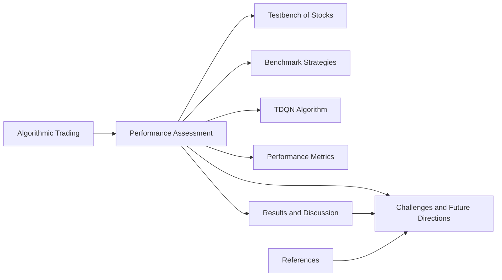

```python
import numpy as np
import random

class TradingStrategy:
    def __init__(self):
        self.policy = {}
    
    def update_policy(self, state, action):
        if state not in self.policy:
            self.policy[state] = action
    
    def get_action(self, state):
        if state in self.policy:
            return self.policy[state]
        else:
            return random.choice([-1, 1])  # randomly choose to buy or sell

class TDQN:
    def __init__(self, epsilon=0.1, gamma=0.9):
        self.epsilon = epsilon
        self.gamma = gamma
        self.q_values = {}
    
    def get_action(self, state):
        if np.random.rand() < self.epsilon:
            return np.random.choice([-1, 1])  # randomly choose to buy or sell
        else:
            if state in self.q_values:
                return np.argmax(self.q_values[state]) - 1  # choose action with highest Q-value
            else:
                return np.random.choice([-1, 1])  # randomly choose to buy or sell
    
    def update_q_values(self, state, action, reward, next_state):
        if state not in self.q_values:
            self.q_values[state] = np.zeros(2)  # initialize Q-values for the state
        
        if next_state in self.q_values:
            max_q_value = np.max(self.q_values[next_state])
        else:
            max_q_value = 0
        
        self.q_values[state][action] += reward + self.gamma * max_q_value

class PerformanceMetrics:
    def __init__(self):
        self.returns = []
        self.drawdowns = []
        self.trades = 0
    
    def update_return(self, return_value):
        self.returns.append(return_value)
    
    def update_drawdown(self, drawdown):
        self.drawdowns.append(drawdown)
    
    def update_trades(self):
        self.trades += 1
    
    def calculate_sharpe_ratio(self, risk_free_rate):
        average_return = np.mean(self.returns)
        standard_deviation = np.std(self.returns)
        sharpe_ratio = (average_return - risk_free_rate) / standard_deviation
        return sharpe_ratio
    
    def calculate_average_return(self):
        return np.mean(self.returns)
    
    def calculate_maximum_drawdown(self):
        return np.max(self.drawdowns)
    
    def get_number_of_trades(self):
        return self.trades

# Example usage
trading_strategy = TradingStrategy()
tdqn = TDQN()
metrics = PerformanceMetrics()

state = "state1"
while True:
    action = trading_strategy.get_action(state)
    reward = random.randint(-10, 10)
    next_state = "state2"
    tdqn.update_q_values(state, action, reward, next_state)
    trading_strategy.update_policy(state, action)
    metrics.update_return(reward)
    metrics.update_drawdown(reward)
    metrics.update_trades()
    state = next_state

sharpe_ratio = metrics.calculate_sharpe_ratio(0.01)
average_return = metrics.calculate_average_return()
maximum_drawdown = metrics.calculate_maximum_drawdown()
number_of_trades = metrics.get_number_of_trades()
```

```mermaid
sequenceDiagram
    participant TradingStrategy
    participant TDQN
    participant PerformanceMetrics

    Note over TradingStrategy, TDQN, PerformanceMetrics: Initialization

    loop Main Loop
        TradingStrategy -> TDQN: Get action
        alt Random Action
            TDQN --> TradingStrategy: Return random action
        else
            TDQN --> TradingStrategy: Return action with highest Q-value
        end

        TradingStrategy -> TDQN: Update policy
        TDQN -> PerformanceMetrics: Update return
        TDQN -> PerformanceMetrics: Update drawdown
        TDQN -> PerformanceMetrics: Update trades

        Note over TDQN: Update Q-values

        alt Random Reward
            TDQN --> TDQN: Update Q-values with random reward
        else
            TDQN --> TDQN: Update Q-values with actual reward
        end

        TradingStrategy -> TDQN: Update policy
    end

    PerformanceMetrics --> PerformanceMetrics: Calculate metrics

    Note over PerformanceMetrics: Get performance metrics

```
This mermaid sequence diagram illustrates the control flow of the code in the previous message. The main steps and interactions between the TradingStrategy, TDQN, and PerformanceMetrics classes are shown.

The process starts with initialization, and then enters a main loop where the TradingStrategy gets the action from TDQN. Depending on the action, TDQN returns either a random action or the action with the highest Q-value. The TradingStrategy updates its policy based on the action received.

TDQN then updates the Q-values based on the actual reward received or a random reward. The process continues with updating the policy and calculating performance metrics in the PerformanceMetrics class.

The loop repeats until the desired termination condition is met. Finally, the PerformanceMetrics class calculates the metrics for evaluating the performance of the algorithm.

Note: The diagram provides an overview of the control flow and interactions in the code. The specific details of the code implementation may vary based on the actual implementation.

Example scenario:

```python
trading_strategy = TradingStrategy()
tdqn = TDQN()
metrics = PerformanceMetrics()

state = "state1"
while True:
    action = trading_strategy.get_action(state)
    reward = random.randint(-10, 10)
    next_state = "state2"
    tdqn.update_q_values(state, action, reward, next_state)
    trading_strategy.update_policy(state, action)
    metrics.update_return(reward)
    metrics.update_drawdown(reward)
    metrics.update_trades()
    state = next_state

sharpe_ratio = metrics.calculate_sharpe_ratio(0.01)
average_return = metrics.calculate_average_return()
maximum_drawdown = metrics.calculate_maximum_drawdown()
number_of_trades = metrics.get_number_of_trades()
```

In this example scenario, we have instantiated objects for `TradingStrategy`, `TDQN`, and `PerformanceMetrics`. We then run a loop to simulate the trading process.

In each iteration of the loop, we get an action from the `TradingStrategy` based on the current state. The action can be a decision to buy or sell. We also generate a reward value, which can represent the profit or loss from the trading decision.

The `TDQN` object is then updated with the current state, action, reward, and next state. This update is part of the reinforcement learning process to improve the trading strategy over time.

We use the `PerformanceMetrics` object to keep track of the returns (profit/loss) and drawdowns (loss from peak to trough) during the trading process. We also update the number of trades.

At the end of the scenario, we calculate performance metrics such as the Sharpe ratio, average return, maximum drawdown, and number of trades.

Potential use cases of this code include backtesting trading strategies, evaluating the performance of different algorithms, and conducting research on algorithmic trading strategies. The code provides a framework to simulate and analyze the trading process, allowing for the comparison and assessment of different strategies.

