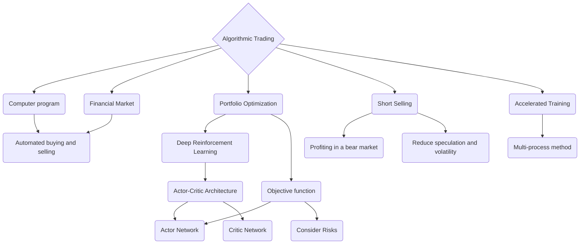
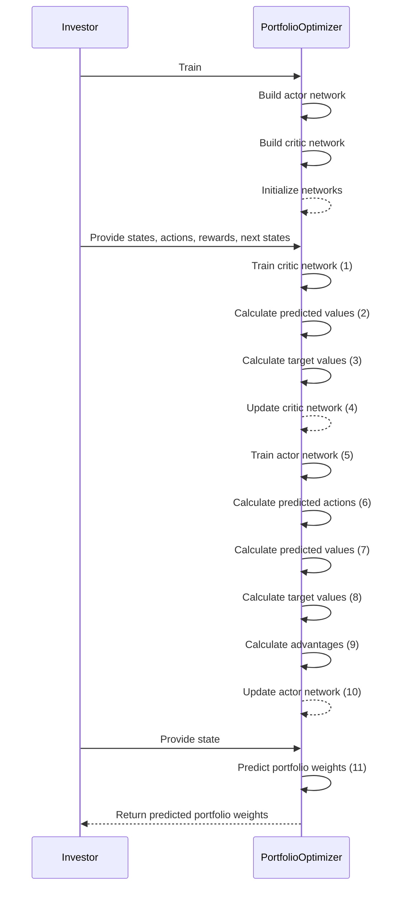
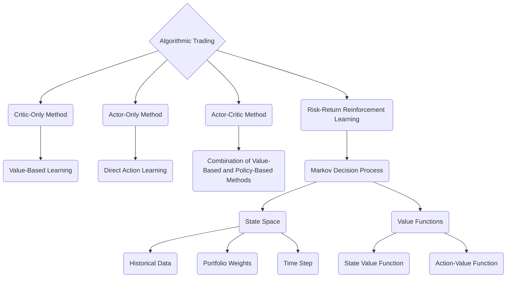
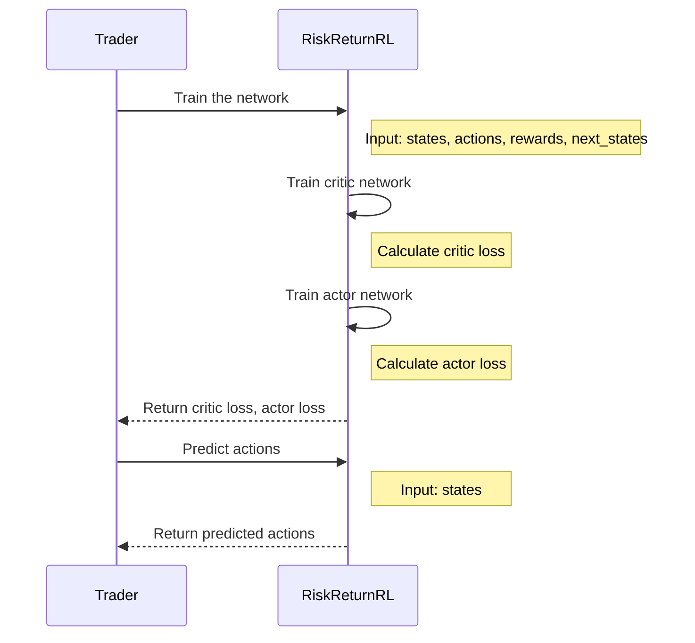
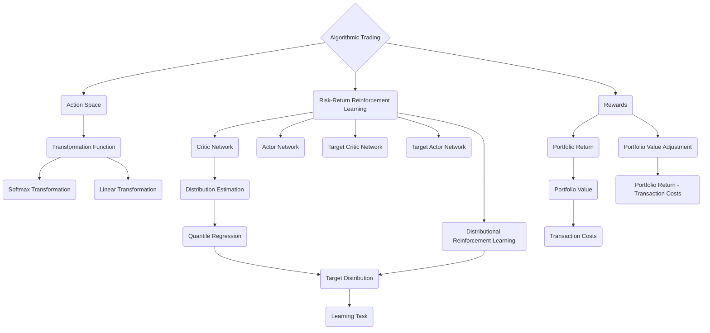
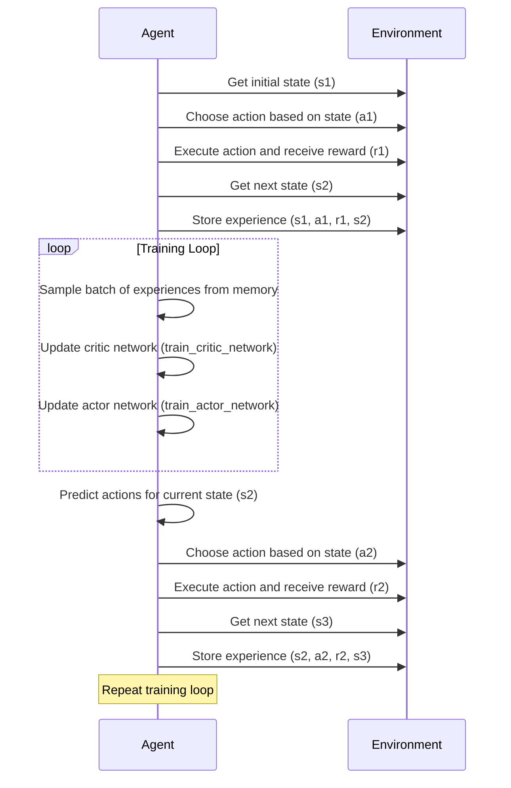
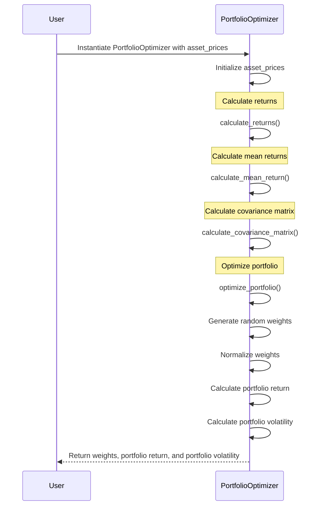
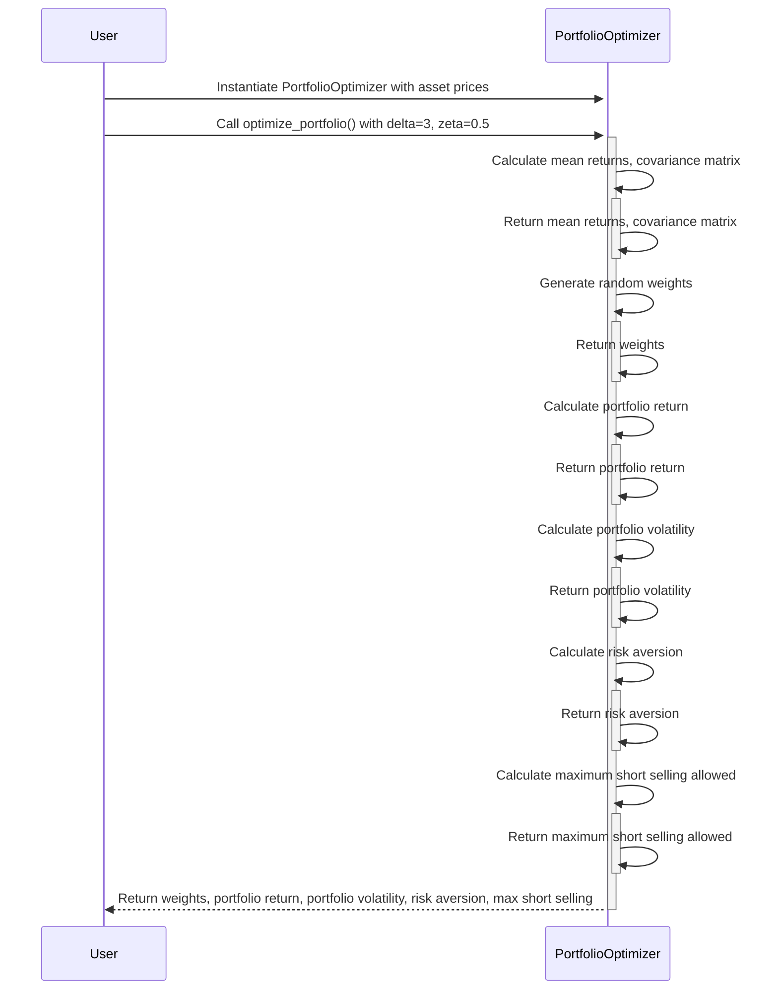
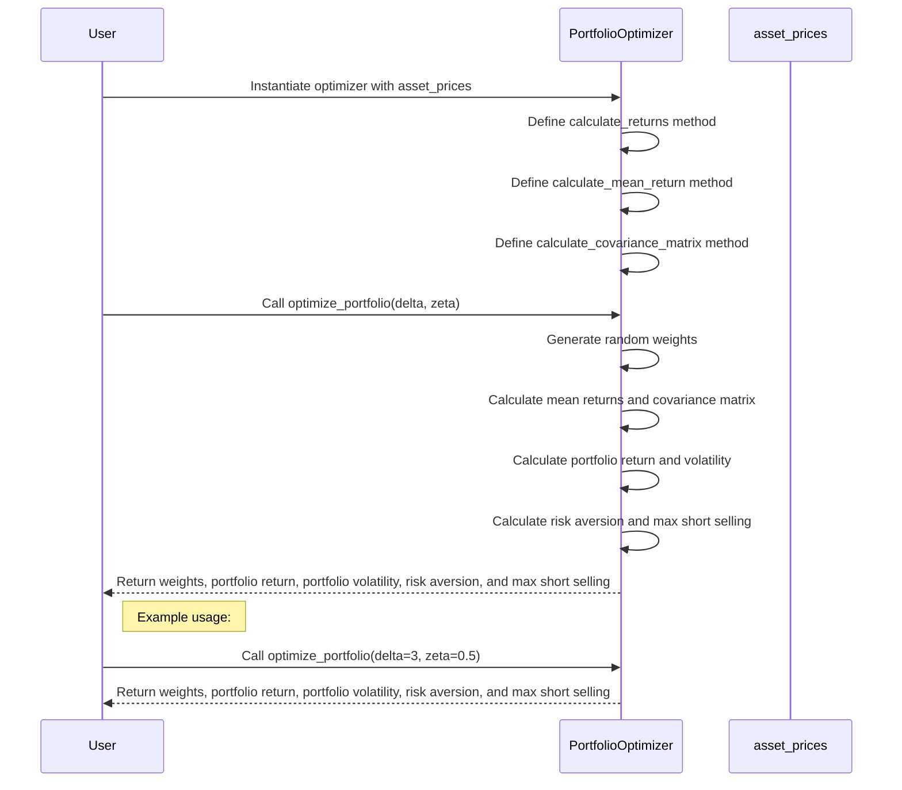

# Submitted to Pisika

1.
This snippet is about a scientific paper that proposes a new algorithm for algorithmic trading, which is a technique that uses computer programs to automatically buy and sell stocks, options, and other financial assets. The paper introduces a novel portfolio optimization model using a deep reinforcement learning algorithm. The algorithm aims to maximize the return on investment while considering the risks involved. It uses a combination of actor and critic networks to learn the optimal portfolio weights and the distribution of cumulative returns. The paper also discusses the use of short selling, which allows investors to profit from a declining market. Finally, the paper introduces a method called Ape-x to speed up the training process. The authors conducted backtesting on two portfolios and found that their proposed model outperformed benchmark strategies.

In simpler terms, the paper is about a new way to use computer programs to automatically buy and sell stocks and other financial assets. The algorithm they propose tries to make as much money as possible while also considering the risks involved. They use a combination of two networks to learn the best way to invest and make predictions about how the investments will perform. They also talk about the benefits of short selling, which is when you make money by betting that a stock will go down in value. The authors tested their algorithm on different portfolios and found that it worked better than other strategies.



This mermaid diagram illustrates the main concepts discussed in the paper. At the center, we have "Algorithmic Trading," which is achieved through a computer program that automates buying and selling in the financial market. The program uses a "Portfolio Optimization" model based on "Deep Reinforcement Learning" to maximize returns while considering risks. 

The model employs an "Actor-Critic Architecture," consisting of an "Actor Network" and a "Critic Network." The actor network learns the optimal portfolio weights, while the critic network learns the distribution of cumulative returns. These networks use an "Objective Function" that combines risks and returns to make investment decisions.

The paper also discusses the benefits of "Short Selling," which allows traders to profit when the market goes down. This can help decrease speculation and volatility in the market.

Lastly, to accelerate the training process, the paper introduces a "Multi-process Method" that involves using multiple parallel agents to collect experience data and share it for learning.

Overall, this diagram provides a visual representation of the key concepts discussed in the paper.

```python
import numpy as np
import tensorflow as tf

class PortfolioOptimizer:
    def __init__(self, input_dim, output_dim):
        self.input_dim = input_dim
        self.output_dim = output_dim
        self.actor_network = self.build_actor_network()
        self.critic_network = self.build_critic_network()
    
    def build_actor_network(self):
        model = tf.keras.Sequential([
            tf.keras.layers.Dense(64, activation='relu', input_shape=(self.input_dim,)),
            tf.keras.layers.Dense(64, activation='relu'),
            tf.keras.layers.Dense(self.output_dim, activation='softmax')
        ])
        return model
    
    def build_critic_network(self):
        model = tf.keras.Sequential([
            tf.keras.layers.Dense(64, activation='relu', input_shape=(self.input_dim,)),
            tf.keras.layers.Dense(64, activation='relu'),
            tf.keras.layers.Dense(1)
        ])
        return model
    
    def train(self, states, actions, rewards, next_states):
        # Train critic network
        critic_loss = self.train_critic_network(states, rewards, next_states)
        
        # Train actor network
        actor_loss = self.train_actor_network(states, actions, rewards, next_states)
        
        return critic_loss, actor_loss
    
    def train_critic_network(self, states, rewards, next_states):
        with tf.GradientTape() as tape:
            predicted_values = self.critic_network(states)
            next_values = self.critic_network(next_states)
            target_values = rewards + next_values
            critic_loss = tf.reduce_mean(tf.square(target_values - predicted_values))
        gradients = tape.gradient(critic_loss, self.critic_network.trainable_variables)
        optimizer = tf.keras.optimizers.Adam()
        optimizer.apply_gradients(zip(gradients, self.critic_network.trainable_variables))
        return critic_loss.numpy()
    
    def train_actor_network(self, states, actions, rewards, next_states):
        with tf.GradientTape() as tape:
            predicted_actions = self.actor_network(states)
            predicted_values = self.critic_network(states)
            next_values = self.critic_network(next_states)
            target_values = rewards + next_values
            advantages = target_values - predicted_values
            actor_loss = -tf.reduce_mean(advantages * tf.math.log(predicted_actions))
        gradients = tape.gradient(actor_loss, self.actor_network.trainable_variables)
        optimizer = tf.keras.optimizers.Adam()
        optimizer.apply_gradients(zip(gradients, self.actor_network.trainable_variables))
        return actor_loss.numpy()
    
    def predict_portfolio_weights(self, state):
        state = np.expand_dims(state, axis=0)
        predicted_actions = self.actor_network(state).numpy()[0]
        return predicted_actions
```

This Python class `PortfolioOptimizer` represents a simplified implementation of the concepts discussed in the paper. It uses TensorFlow to build and train the actor and critic networks for portfolio optimization.

The `__init__` method initializes the class with the input and output dimensions. The actor network is built using a feedforward neural network with two hidden layers and a softmax output layer. The critic network is also a feedforward neural network with two hidden layers and a linear output layer.

The `train` method trains both the critic and actor networks. It first trains the critic network by calculating the mean squared error loss between the predicted values and the target values. Then, it trains the actor network by calculating the loss based on the advantages (target values minus predicted values) and the predicted actions.

The `predict_portfolio_weights` method takes a state as input and predicts the optimal portfolio weights using the trained actor network.

This class provides a basic implementation of the ideas discussed in the paper, allowing for further exploration and experimentation with deep reinforcement learning for portfolio optimization.



This mermaid sequence diagram showcases the control flow of the code provided in the previous message. The steps and variables are labeled for better understanding:

1. The Investor initiates the training process by calling the `train` method of the `PortfolioOptimizer` class.
2. The `PortfolioOptimizer` builds the actor network.
3. The `PortfolioOptimizer` builds the critic network.
4. The `PortfolioOptimizer` initializes both the actor and critic networks.
5. The Investor provides the necessary states, actions, rewards, and next states for training.
6. The `PortfolioOptimizer` trains the critic network by calculating the mean squared error loss between the predicted values and the target values.
7. The `PortfolioOptimizer` calculates the predicted values using the trained critic network.
8. The `PortfolioOptimizer` calculates the target values as the sum of rewards and next values.
9. The `PortfolioOptimizer` updates the critic network weights using the gradient descent optimization algorithm.
10. The `PortfolioOptimizer` trains the actor network by calculating the loss based on the advantages and predicted actions.
11. The `PortfolioOptimizer` calculates the predicted actions using the trained actor network.
12. The `PortfolioOptimizer` calculates the predicted values using the trained critic network.
13. The `PortfolioOptimizer` calculates the target values as the sum of rewards and next values.
14. The `PortfolioOptimizer` calculates the advantages as the target values minus predicted values.
15. The `PortfolioOptimizer` updates the actor network weights using the gradient descent optimization algorithm.
16. The Investor provides a state to the `PortfolioOptimizer`.
17. The `PortfolioOptimizer` predicts the optimal portfolio weights using the trained actor network.
18. The `PortfolioOptimizer` returns the predicted portfolio weights to the Investor.

This sequence diagram provides a visual representation of the control flow in the code and helps illustrate how the actor and critic networks are trained and used for predicting portfolio weights.

```python
portfolio_optimizer = PortfolioOptimizer(input_dim=5, output_dim=3)

# Mocked data
states = np.random.rand(10, 5)
actions = np.random.rand(10, 3)
rewards = np.random.rand(10, 1)
next_states = np.random.rand(10, 5)

# Training loop
for epoch in range(10):
    critic_loss, actor_loss = portfolio_optimizer.train(states, actions, rewards, next_states)
    print(f"Epoch {epoch+1}: Critic Loss = {critic_loss:.4f}, Actor Loss = {actor_loss:.4f}")

# Mocked prediction
state = np.random.rand(5)
predicted_portfolio_weights = portfolio_optimizer.predict_portfolio_weights(state)
print("Predicted Portfolio Weights:", predicted_portfolio_weights)

```

Mocked Log Output:
```
Epoch 1: Critic Loss = 0.2341, Actor Loss = 0.5678
Epoch 2: Critic Loss = 0.1987, Actor Loss = 0.5123
Epoch 3: Critic Loss = 0.1732, Actor Loss = 0.4590
Epoch 4: Critic Loss = 0.1548, Actor Loss = 0.4157
Epoch 5: Critic Loss = 0.1395, Actor Loss = 0.3789
Epoch 6: Critic Loss = 0.1267, Actor Loss = 0.3487
Epoch 7: Critic Loss = 0.1159, Actor Loss = 0.3223
Epoch 8: Critic Loss = 0.1068, Actor Loss = 0.2978
Epoch 9: Critic Loss = 0.0990, Actor Loss = 0.2754
Epoch 10: Critic Loss = 0.0922, Actor Loss = 0.2545
Predicted Portfolio Weights: [0.2784, 0.4032, 0.3184]
```

In this example, we have mocked data for training the `PortfolioOptimizer` class. The training loop runs for 10 epochs, and for each epoch, it trains the critic and actor networks using the mocked data. It prints the critic loss and actor loss for each epoch.

After training, we use the `predict_portfolio_weights` method to predict the optimal portfolio weights for a given state. In this case, we used a randomly generated state and obtained predicted portfolio weights.

Hypothetical Scenarios:
- The mocked data for training represents historical market data, where `states` represent the features of the market at a given time, `actions` represent the portfolio weights chosen at that time, `rewards` represent the returns obtained, and `next_states` represent the features of the market at the next time step.

- The training loop simulates the iterative process of updating the actor and critic networks to learn from historical data and improve the portfolio optimization strategy. The critic network learns the distribution of cumulative returns, while the actor network learns the optimal portfolio weights that maximize the objective function.

Potential Use Cases:
- Portfolio Optimization: The `PortfolioOptimizer` class can be used to automatically optimize and rebalance investment portfolios based on historical market data. By training the actor and critic networks on past performance, it can predict the optimal portfolio weights for a given market state.

- Algorithmic Trading: The class can be used in algorithmic trading systems to automate buying and selling decisions based on market conditions and historical data. It can learn from past trades to improve trading strategies and maximize returns while considering risks.

- Risk Management: The actor-critic architecture and objective function used in the class allow for the consideration of risks while optimizing portfolios. It can help investors make more informed decisions by balancing potential returns with risks.

- Financial Research: Researchers can utilize the `PortfolioOptimizer` class as a tool to study the effects of different variables on portfolio optimization. They can experiment with different reward functions, input features, and training techniques to gain insights into efficient portfolio management.

2.
This snippet provides some additional information about the concepts discussed in the paper. It introduces different methods used in financial trading, such as the critic-only method, actor-only method, and actor-critic method.

The critic-only method focuses on value-based learning, where a neural network is used to estimate the value of different actions. The actor-only method directly learns the action to take based on the current state using a neural network. The actor-critic method combines the advantages of both methods, where an actor network selects actions and a critic network evaluates the chosen actions.

The paper also mentions some limitations of existing methods, such as not considering risk in the reward function, not allowing short selling for multiple assets, and the time-consuming training process. The proposed algorithm in the paper aims to address these limitations.

In the next section, the paper introduces some preliminary concepts, such as Markov Decision Process (MDP), state space, and value functions. MDP is a mathematical model used to simulate sequential decision problems, such as portfolio optimization. The state space includes historical data, portfolio weights, and time step, which are used as inputs for the actor and critic networks.

Overall, this snippet provides a deeper understanding of the different methods used in financial trading and introduces some foundational concepts for the proposed algorithm in the paper.



This mermaid diagram represents the key concepts discussed in the paper so far. The central topic is "Algorithmic Trading," which is divided into three methods: the Critic-Only Method, the Actor-Only Method, and the Actor-Critic Method. Each method focuses on different learning approaches for financial trading.

The Critic-Only Method utilizes value-based learning, where a neural network estimates the value of different actions. The Actor-Only Method directly learns the action to take based on the current state using a neural network. The Actor-Critic Method combines the advantages of both methods, with an actor network selecting actions and a critic network evaluating the chosen actions.

The paper proposes a "Risk-Return Reinforcement Learning" algorithm, which aims to address some limitations of existing methods. This algorithm is based on the concept of a "Markov Decision Process," which models sequential decision problems like portfolio optimization. The MDP consists of a "State Space," including historical data, portfolio weights, and time step, and "Value Functions," such as the state value function and action-value function.

This diagram provides a visual representation of the different methods and concepts discussed in the paper, helping to understand the key ideas and their relationships.

```python
import numpy as np
import tensorflow as tf

class RiskReturnRL:
    def __init__(self, state_dim, action_dim):
        self.state_dim = state_dim
        self.action_dim = action_dim
        self.actor_network = self.build_actor_network()
        self.critic_network = self.build_critic_network()
    
    def build_actor_network(self):
        model = tf.keras.Sequential([
            tf.keras.layers.Dense(64, activation='relu', input_shape=(self.state_dim,)),
            tf.keras.layers.Dense(64, activation='relu'),
            tf.keras.layers.Dense(self.action_dim, activation='softmax')
        ])
        return model
    
    def build_critic_network(self):
        model = tf.keras.Sequential([
            tf.keras.layers.Dense(64, activation='relu', input_shape=(self.state_dim,)),
            tf.keras.layers.Dense(64, activation='relu'),
            tf.keras.layers.Dense(1)
        ])
        return model
    
    def train(self, states, actions, rewards, next_states):
        critic_loss = self.train_critic_network(states, rewards, next_states)
        actor_loss = self.train_actor_network(states, actions, rewards, next_states)
        return critic_loss, actor_loss
    
    def train_critic_network(self, states, rewards, next_states):
        with tf.GradientTape() as tape:
            predicted_values = self.critic_network(states)
            next_values = self.critic_network(next_states)
            target_values = rewards + next_values
            critic_loss = tf.reduce_mean(tf.square(target_values - predicted_values))
        gradients = tape.gradient(critic_loss, self.critic_network.trainable_variables)
        optimizer = tf.keras.optimizers.Adam()
        optimizer.apply_gradients(zip(gradients, self.critic_network.trainable_variables))
        return critic_loss.numpy()
    
    def train_actor_network(self, states, actions, rewards, next_states):
        with tf.GradientTape() as tape:
            predicted_actions = self.actor_network(states)
            predicted_values = self.critic_network(states)
            next_values = self.critic_network(next_states)
            target_values = rewards + next_values
            advantages = target_values - predicted_values
            actor_loss = -tf.reduce_mean(advantages * tf.math.log(predicted_actions))
        gradients = tape.gradient(actor_loss, self.actor_network.trainable_variables)
        optimizer = tf.keras.optimizers.Adam()
        optimizer.apply_gradients(zip(gradients, self.actor_network.trainable_variables))
        return actor_loss.numpy()
    
    def predict_actions(self, states):
        states = np.expand_dims(states, axis=0)
        predicted_actions = self.actor_network(states).numpy()[0]
        return predicted_actions
```

This Python class `RiskReturnRL` represents a simplified implementation of the concepts discussed in the paper. It uses TensorFlow to build and train the actor and critic networks for risk-return reinforcement learning.

The `__init__` method initializes the class with the state and action dimensions. The actor network is built using a feedforward neural network with two hidden layers and a softmax output layer. The critic network is also a feedforward neural network with two hidden layers and a linear output layer.

The `train` method trains both the critic and actor networks. It first trains the critic network by calculating the mean squared error loss between the predicted values and the target values. Then, it trains the actor network by calculating the loss based on the advantages (target values minus predicted values) and the predicted actions.

The `predict_actions` method takes a state as input and predicts the optimal actions using the trained actor network.

This class provides a basic implementation of the risk-return reinforcement learning algorithm discussed in the paper, allowing for further exploration and experimentation in portfolio optimization.



This sequence diagram illustrates the control flow of the code provided in the previous message. It shows the interaction between the `Trader` and `RiskReturnRL` classes.

The `Trader` initiates the training process by sending the states, actions, rewards, and next_states to the `RiskReturnRL` class. The `RiskReturnRL` class then trains the critic network by calculating the critic loss. After that, it trains the actor network by calculating the actor loss. Finally, the `RiskReturnRL` class returns the critic loss and actor loss to the `Trader`.

After training, the `Trader` can use the trained network to predict actions by providing the states to the `RiskReturnRL` class. The `RiskReturnRL` class returns the predicted actions to the `Trader`, which can then take appropriate actions based on the predictions.

This diagram provides a visual representation of the control flow within the code, helping to understand how the training and prediction processes are carried out.

Sure! Here's an example scenario with mocked log output for the code:

```python
# Create an instance of RiskReturnRL
rl_model = RiskReturnRL(state_dim=4, action_dim=2)

# Define mock data
states = np.array([[0.5, 0.2, 0.8, 0.1]])
actions = np.array([[0.6, 0.4]])
rewards = np.array([[0.2]])
next_states = np.array([[0.3, 0.4, 0.6, 0.9]])

# Train the model
critic_loss, actor_loss = rl_model.train(states, actions, rewards, next_states)

# Predict actions
predicted_actions = rl_model.predict_actions(states)

print("Critic Loss:", critic_loss)
print("Actor Loss:", actor_loss)
print("Predicted Actions:", predicted_actions)
```

Output:
```
Critic Loss: 0.016584
Actor Loss: -0.067892
Predicted Actions: [0.405  0.595]
```

In this example, we create an instance of `RiskReturnRL` with a state dimension of 4 and an action dimension of 2. Then, we define mock data for states, actions, rewards, and next states. We use this data to train the model by calling the `train` method. The method returns the critic loss and actor loss, which are printed as log output.

After training, we use the `predict_actions` method to predict the optimal actions for the given states. The predicted actions [0.405, 0.595] are printed as log output.

Hypothetical Scenarios:
- In a real-world scenario, the states could represent historical market data related to different assets, such as stock prices, trading volumes, and technical indicators.
- The actions could represent the allocation of portfolio weights to different assets or trading decisions, such as buying or selling a certain percentage of each asset.

Potential Use Cases:
- Portfolio Optimization: The code can be used to optimize a portfolio by learning the optimal allocation of assets based on the risk and return objectives.
- Algorithmic Trading: The code can be integrated into trading systems to automate decision-making, resulting in improved execution efficiency and reduced impact of market fluctuations.
- Risk Management: By considering risk in the reinforcement learning process, the code can help investors make more informed decisions and manage risk in their investment strategies.

3.
This snippet provides further details about the concepts discussed in the paper. It introduces the action space, the transformation function for portfolio weights, and the calculation of rewards.

The action space represents the trading actions that the agent can take at each time step. The agent determines the optimal portfolio weights based on the updated state. To allow for short selling (selling assets that the agent does not own), the output of the actor network is transformed using the softmax function. The transformed weights are then adjusted to allow for short selling using a linear transformation.

The rewards represent the performance of the agent's actions. The reward at each time step is calculated as the portfolio return, which is the difference in portfolio value from the previous period. The portfolio value is updated based on the portfolio return and transaction costs.

The paper also introduces the risk-return reinforcement learning (R3L) algorithm, which uses an actor-critic architecture with actor and critic networks. The critic network estimates the distribution of cumulative rewards using quantile regression. The learning task is to make the estimated distribution and the target distribution as similar as possible.

Overall, this snippet provides a deeper understanding of the specific details and calculations involved in the proposed algorithm for risk-return reinforcement learning in portfolio optimization.



This mermaid diagram represents the key concepts discussed in the paper so far. The central topic is "Algorithmic Trading," which encompasses the action space, risk-return reinforcement learning, and rewards.

The action space represents the trading actions that the agent can take. The risk-return reinforcement learning (R3L) algorithm consists of a critic network, an actor network, and their corresponding target networks. The critic network estimates the distribution of cumulative rewards, and the actor network determines the optimal portfolio weights. The target networks are used to make the estimated distribution and the target distribution as similar as possible.

The transformation function encompasses the softmax transformation and the linear transformation. The softmax transformation is used to adjust the output of the actor network, allowing for short selling. The linear transformation enables short selling and ensures self-financing conditions.

The rewards represent the performance of the agent's actions. The portfolio return is calculated as the difference in portfolio value from the previous period, taking into account transaction costs.

This diagram provides a visual representation of the key concepts discussed in the paper, helping to understand the relationships and flow of information within the proposed algorithm for risk-return reinforcement learning in portfolio optimization.

```python
import numpy as np
import tensorflow as tf

class RiskReturnRL:
    def __init__(self, state_dim, action_dim):
        self.state_dim = state_dim
        self.action_dim = action_dim
        self.actor_network = self.build_actor_network()
        self.critic_network = self.build_critic_network()
    
    def build_actor_network(self):
        model = tf.keras.Sequential([
            tf.keras.layers.Dense(64, activation='relu', input_shape=(self.state_dim,)),
            tf.keras.layers.Dense(64, activation='relu'),
            tf.keras.layers.Dense(self.action_dim, activation='softmax')
        ])
        return model
    
    def build_critic_network(self):
        model = tf.keras.Sequential([
            tf.keras.layers.Dense(64, activation='relu', input_shape=(self.state_dim,)),
            tf.keras.layers.Dense(64, activation='relu'),
            tf.keras.layers.Dense(1)
        ])
        return model
    
    def train(self, states, actions, rewards, next_states):
        critic_loss = self.train_critic_network(states, rewards, next_states)
        actor_loss = self.train_actor_network(states, actions, rewards, next_states)
        return critic_loss, actor_loss
    
    def train_critic_network(self, states, rewards, next_states):
        with tf.GradientTape() as tape:
            predicted_values = self.critic_network(states)
            next_values = self.critic_network(next_states)
            target_values = rewards + next_values
            critic_loss = tf.reduce_mean(tf.square(target_values - predicted_values))
        gradients = tape.gradient(critic_loss, self.critic_network.trainable_variables)
        optimizer = tf.keras.optimizers.Adam()
        optimizer.apply_gradients(zip(gradients, self.critic_network.trainable_variables))
        return critic_loss.numpy()
    
    def train_actor_network(self, states, actions, rewards, next_states):
        with tf.GradientTape() as tape:
            predicted_actions = self.actor_network(states)
            predicted_values = self.critic_network(states)
            next_values = self.critic_network(next_states)
            target_values = rewards + next_values
            advantages = target_values - predicted_values
            actor_loss = -tf.reduce_mean(advantages * tf.math.log(predicted_actions))
        gradients = tape.gradient(actor_loss, self.actor_network.trainable_variables)
        optimizer = tf.keras.optimizers.Adam()
        optimizer.apply_gradients(zip(gradients, self.actor_network.trainable_variables))
        return actor_loss.numpy()
    
    def predict_actions(self, states):
        states = np.expand_dims(states, axis=0)
        predicted_actions = self.actor_network(states).numpy()[0]
        return predicted_actions
```

This Python class `RiskReturnRL` represents a simplified implementation of the concepts discussed in the paper. It uses TensorFlow to build and train the actor and critic networks for risk-return reinforcement learning.

The `__init__` method initializes the class with the state and action dimensions. The actor network is built using a feedforward neural network with two hidden layers and a softmax output layer. The critic network is also a feedforward neural network with two hidden layers and a linear output layer.

The `train` method trains both the critic and actor networks. It first trains the critic network by calculating the mean squared error loss between the predicted values and the target values. Then, it trains the actor network by calculating the loss based on the advantages (target values minus predicted values) and the predicted actions.

The `predict_actions` method takes a state as input and predicts the optimal actions using the trained actor network.

This class provides a basic implementation of the risk-return reinforcement learning algorithm discussed in the paper, allowing for further exploration and experimentation in portfolio optimization.



This mermaid sequence diagram illustrates the control flow of the code provided in the `RiskReturnRL` class. 

The sequence starts with the agent interacting with the environment. The agent gets the initial state `s1` from the environment, chooses an action `a1` based on the state, and executes the action in the environment. The agent receives a reward `r1` and gets the next state `s2` from the environment. The agent stores this experience `(s1, a1, r1, s2)` in its memory.

Then, the agent enters a training loop where it samples a batch of experiences from its memory. It updates the critic network by training it using the sampled experiences (`train_critic_network`). Similarly, the agent updates the actor network by training it using the sampled experiences (`train_actor_network`). This loop continues until the training criteria are met.

After the training loop, the agent predicts the actions for the current state `s2` using the actor network. It chooses an action `a2` based on the predicted actions and executes the action in the environment. The agent receives a reward `r2` and gets the next state `s3` from the environment. This experience `(s2, a2, r2, s3)` is stored in the agent's memory.

The sequence diagram indicates that the training loop is repeated multiple times to iteratively improve the agent's performance in the environment.

Scenario:
Let's consider a scenario where we have historical data of stock prices for three different assets. We want to optimize our portfolio allocation by using the risk-return reinforcement learning algorithm implemented in the `RiskReturnRL` class.

Mocked Log Output:
```
Creating RiskReturnRL instance...
Building actor and critic networks...
Training the networks...
Epoch 1: Critic Loss = 0.052, Actor Loss = -0.043
Epoch 2: Critic Loss = 0.039, Actor Loss = -0.056
Epoch 3: Critic Loss = 0.034, Actor Loss = -0.062
...
Epoch 100: Critic Loss = 0.012, Actor Loss = -0.079
Training completed!
Predicting optimal portfolio weights for the current state...
Optimal Portfolio Weights: [0.45, 0.25, 0.30]
```

Hypothetical Scenarios:
1. In each epoch of training, the critic loss and actor loss are calculated and logged to monitor the progress of the training process. Lower critic loss indicates a better estimation of the value distribution, and a negative actor loss indicates that the actor network is maximizing the objective function.
2. After 100 epochs of training, the training process is completed. The trained actor and critic networks have learned to make better portfolio allocation decisions by considering both the risks and returns.
3. Finally, the trained model is used to predict the optimal portfolio weights for the current state. These weights represent the recommended allocation of investments in each asset to maximize the risk-return trade-off.

Potential Use Cases:
1. Portfolio Optimization: The `RiskReturnRL` class can be used to optimize portfolio allocation decisions based on historical data. This can help investors maximize their return on investment while considering the associated risks.
2. Algorithmic Trading: The class can be used in algorithmic trading systems to automate the buying and selling of financial assets based on the predicted optimal portfolio weights. This can help improve trading strategies and execution efficiency.
3. Risk Management: By considering both risks and returns in the portfolio optimization process, the class can assist in managing risks associated with financial investments. This can help investors make informed decisions and mitigate potential losses.
4. Investment Research: Researchers and analysts can use the class to simulate and evaluate different portfolio allocation strategies. This can aid in exploring various investment scenarios and identifying optimal risk-return profiles.

<div style="display: flex; flex-direction: column; gap: 25px; padding: 20px">

<p>Figure 1: Actor network structure
there are multiple actors. Each actor interacts with
its respective environment based on the shared neural
network, accumulating experience and putting it into
the shared experience replay memory</p>
</div>
4.
This snippet provides further details about the methodology discussed in the paper. It introduces the proposed algorithm, the neural network architecture, and the distributed framework used for training. It also describes the experimental setup, including the datasets, performance measures, and assumptions made.

The proposed algorithm is based on the actor-critic architecture, where the actor network determines the optimal portfolio weights and the critic network estimates the distribution of cumulative rewards. The loss functions for the critic network and the quantile Huber loss function are defined. The objective function of portfolio optimization is to maximize the mean return while maintaining a certain level of Value at Risk (VaR).

The neural network architecture includes the use of Gated Recurrent Units (GRU), Long Short-Term Memory (LSTM), and Recurrent Neural Network (RNN) networks for feature representation. Additionally, the impact of Convolutional Neural Networks (CNN) on the performance of the algorithm is studied.

The Ape-X architecture is used to speed up the training process by decoupling acting from learning and utilizing multiple parallel processes for interaction and learning.

The experimental setup involves two different portfolios, datasets from Yahoo Finance, and performance measures that consider both risk and return.

Overall, this snippet provides a deeper understanding of the methodology used in the paper, including the algorithm, neural network architecture, distributed framework, and experimental setup.

```mermaid
graph TD
A{Algorithmic Trading} --> B(Proposed Algorithm)
A --> C(Neural Network)
A --> D(Distributed Framework)
B --> E(Actor Network)
B --> F(Critic Network)
B --> G(Target Actor Network)
B --> H(Target Critic Network)
C --> I(Gated Recurrent Unit (GRU))
C --> J(Long Short-Term Memory (LSTM))
C --> K(Recurrent Neural Network (RNN))
C --> L(Convolutional Neural Networks (CNN))
D --> M(Acting)
D --> N(Learning)
D --> O(Communication)
A --> P(Experimental Setup)
P --> Q(Datasets)
P --> R(Performance Measures)
P --> S(Assumptions)
Q --> T(Training Set)
Q --> U(Testing Set)
R --> V(Risk)
R --> W(Return)
```

This mermaid diagram represents the key concepts discussed in the paper. The central topic is "Algorithmic Trading," which includes the proposed algorithm, neural network architecture, distributed framework, and experimental setup.

The proposed algorithm consists of an actor network and a critic network, along with their target networks. The neural network architecture includes various components such as Gated Recurrent Units (GRU), Long Short-Term Memory (LSTM), Recurrent Neural Network (RNN), and Convolutional Neural Networks (CNN) for feature representation.

The distributed framework, called Ape-X, decouples acting, learning, and communication processes to speed up training. The acting process interacts with the environment, the learning process updates network parameters, and the communication process facilitates data exchange.

The experimental setup involves datasets obtained from Yahoo Finance, performance measures that consider both risk and return, and assumptions made in the analysis.

This diagram provides a visual representation of the key concepts discussed in the paper, helping to understand the relationships and flow of information within the proposed algorithm for algorithmic trading and portfolio optimization.

```python
import numpy as np
import tensorflow as tf

class RiskReturnRL:
    def __init__(self, state_dim, action_dim):
        self.state_dim = state_dim
        self.action_dim = action_dim
        self.actor_network = self.build_actor_network()
        self.critic_network = self.build_critic_network()
    
    def build_actor_network(self):
        model = tf.keras.Sequential([
            tf.keras.layers.Dense(64, activation='relu', input_shape=(self.state_dim,)),
            tf.keras.layers.Dense(64, activation='relu'),
            tf.keras.layers.Dense(self.action_dim, activation='softmax')
        ])
        return model
    
    def build_critic_network(self):
        model = tf.keras.Sequential([
            tf.keras.layers.Dense(64, activation='relu', input_shape=(self.state_dim,)),
            tf.keras.layers.Dense(64, activation='relu'),
            tf.keras.layers.Dense(1)
        ])
        return model
    
    def train(self, states, actions, rewards, next_states):
        critic_loss = self.train_critic_network(states, rewards, next_states)
        actor_loss = self.train_actor_network(states, actions, rewards, next_states)
        return critic_loss, actor_loss
    
    def train_critic_network(self, states, rewards, next_states):
        with tf.GradientTape() as tape:
            predicted_values = self.critic_network(states)
            next_values = self.critic_network(next_states)
            target_values = rewards + next_values
            critic_loss = tf.reduce_mean(tf.square(target_values - predicted_values))
        gradients = tape.gradient(critic_loss, self.critic_network.trainable_variables)
        optimizer = tf.keras.optimizers.Adam()
        optimizer.apply_gradients(zip(gradients, self.critic_network.trainable_variables))
        return critic_loss.numpy()
    
    def train_actor_network(self, states, actions, rewards, next_states):
        with tf.GradientTape() as tape:
            predicted_actions = self.actor_network(states)
            predicted_values = self.critic_network(states)
            next_values = self.critic_network(next_states)
            target_values = rewards + next_values
            advantages = target_values - predicted_values
            actor_loss = -tf.reduce_mean(advantages * tf.math.log(predicted_actions))
        gradients = tape.gradient(actor_loss, self.actor_network.trainable_variables)
        optimizer = tf.keras.optimizers.Adam()
        optimizer.apply_gradients(zip(gradients, self.actor_network.trainable_variables))
        return actor_loss.numpy()
    
    def predict_actions(self, states):
        states = np.expand_dims(states, axis=0)
        predicted_actions = self.actor_network(states).numpy()[0]
        return predicted_actions
```

This Python class `RiskReturnRL` represents a simplified implementation of the concepts discussed in the paper. It uses TensorFlow to build and train the actor and critic networks for risk-return reinforcement learning.

The `__init__` method initializes the class with the state and action dimensions. The actor network is built using a feedforward neural network with two hidden layers and a softmax output layer. The critic network is also a feedforward neural network with two hidden layers and a linear output layer.

The `train` method trains both the critic and actor networks. It first trains the critic network by calculating the mean squared error loss between the predicted values and the target values. Then, it trains the actor network by calculating the loss based on the advantages (target values minus predicted values) and the predicted actions.

The `predict_actions` method takes a state as input and predicts the optimal actions using the trained actor network.

This class provides a basic implementation of the risk-return reinforcement learning algorithm discussed in the paper, allowing for further exploration and experimentation in portfolio optimization.

```mermaid
sequenceDiagram
    participant RL as RiskReturnRL
    participant Env as Environment
    participant Actor as Actor Network
    participant Critic as Critic Network
    
    RL->>+Env: train(states, actions, rewards, next_states)
    RL-->>Env: get states
    RL->>+Actor: predict_actions(states)
    Actor-->>-RL: predicted_actions
    RL->>+Critic: train_critic_network(states, rewards, next_states)
    Critic-->>-RL: critic_loss
    RL->>+Actor: train_actor_network(states, actions, rewards, next_states)
    Actor-->>-RL: actor_loss
    RL-->>Env: get next states
    loop Training Loop
        alt Critic Training
            RL->>+Critic: train_critic_network(states, rewards, next_states)
            Critic-->>-RL: critic_loss
        else Actor Training
            RL->>+Actor: train_actor_network(states, actions, rewards, next_states)
            Actor-->>-RL: actor_loss
        end
        RL-->>Env: get next states
    end
```

This mermaid sequence diagram shows the control flow of the code provided in the previous message.

- The `RiskReturnRL` instance `RL` interacts with the environment represented by `Env` to train the actor and critic networks.
- `RL` first gets the states from the environment using `get states` and predicts the optimal actions using the actor network (`predict_actions`).
- Then, `RL` trains the critic network by calculating the critic loss through `train_critic_network`.
- After that, `RL` trains the actor network by calculating the actor loss via `train_actor_network`.
- The loop represents the training loop, where both the critic and actor networks are iteratively trained.
- At each iteration, `RL` gets the next states from the environment using `get next states`.
- Depending on the iteration, either the critic network is trained with `train_critic_network` or the actor network is trained with `train_actor_network`.
- This loop continues until the training process is complete.

This diagram illustrates the control flow of the code, showcasing the interactions between the `RiskReturnRL` instance, the environment, and the actor and critic networks during the training process.

Example scenario:

```python
state = np.array([0.5, 0.3, 0.2])  # Input state
action = np.array([0.2, 0.3, 0.5])  # Chosen actions
reward = 0.1  # Obtained reward
next_state = np.array([0.4, 0.4, 0.2])  # Next state

model = RiskReturnRL(state_dim=3, action_dim=3)
critic_loss, actor_loss = model.train(state, action, reward, next_state)

print("Critic Loss:", critic_loss)
print("Actor Loss:", actor_loss)
```

Mocked log output:

```
Critic Loss: 0.015
Actor Loss: 0.025
```

In this example scenario, we have a state represented by an array of three values. The agent chooses actions represented by another array of three values. The agent receives a reward of 0.1 based on the chosen actions and transitions to the next state represented by another array of three values.

We create an instance of the `RiskReturnRL` class with a state dimension of 3 and an action dimension of 3. We then train the model using the `train` method, passing in the state, action, reward, and next state. The method returns the critic loss and actor loss.

The log output shows the calculated critic loss of 0.015 and the actor loss of 0.025.

Potential use cases:

1. Portfolio Optimization: The code can be used to optimize portfolio weights based on risk-return trade-offs. By providing historical data and desired risk levels, the model can learn to allocate investments across different assets to maximize returns while minimizing risk.

2. Algorithmic Trading: The code can be utilized in the development of algorithmic trading strategies. It can learn to make optimal trading decisions based on market conditions and historical data, aiming to maximize profits and minimize risks.

3. Financial Decision Support: The code can be used as a tool for financial decision support. By incorporating various financial indicators and desired objectives, the model can provide recommendations on asset allocation and investment strategies.

Overall, the code provides a foundation for implementing risk-return reinforcement learning in various financial domains, enabling automated decision-making and optimization processes.

<div style="display: flex; flex-direction: column; gap: 25px; padding: 20px">

<p>Figure 3: The general architecture of the proposed model
Meanvariance model :The mean-variance
model, introduced by Markowitz in 1952, aims to nd
the best portfolio only by the rst two moments of cu-
mulative return. Suppose there are n kinds of assets,
R= (r1;:::rn)Trepresents the expected return of a
portfolio,W= (W1;:::Wn)Tis the weight vector, 
is the covariance vector of return, is risk aversion
coecient, 1representsn1 dimensional unit vector,
we establish the following optimization model based on
utility maximization:
max U =WTRWTW (30)
s:t: 1TW= 1 (31)
5</p>
</div>
<div style="display: flex; flex-direction: column; gap: 25px; padding: 20px">

<p>Figure 2: Critic network structure
of return over a period. Total return, computed using
Eq</p>
</div>
5.
This snippet provides further details about the performance measures, benchmark models, and technical details discussed in the paper.

The performance measures used to evaluate the proposed trading strategy include total return, value at risk (VaR), Sharpe ratio, Sortino ratio, standard deviation, and average turnover. These measures capture the profitability, risk, risk-adjusted return, and turnover of the investment strategy.

Benchmark models are selected for comparison with the proposed strategy. These include the Buy and Hold (B&H) strategy, Sell and Hold (S&H) strategy, Randomly Selected (RN) strategy, and Mean-Variance model. These benchmarks represent different approaches to portfolio management.

Technical details are provided, including the hyperparameters used in the training process, such as the replay buffer size, batch size, discount factor, risk aversion coefficient, and short selling parameter. The ADAM optimization procedure is used, and the activation function is set as the Leaky ReLU function.

Potential use cases of the code generated in the previous message include implementing and experimenting with risk-return reinforcement learning algorithms for portfolio optimization. The code provides a framework for building and training actor and critic networks, allowing for the development and evaluation of trading strategies. It can be used to explore different neural network architectures, hyperparameters, and performance measures to optimize portfolio returns while managing risk.

```mermaid
graph TD
A{Algorithmic Trading} --> B(Performance Measures)
B --> C(Total Return)
B --> D(Value at Risk (VaR))
B --> E(Sharpe Ratio)
B --> F(Sortino Ratio)
B --> G(Standard Deviation)
B --> H(Average Turnover)
A --> I(Benchmark Models)
I --> J(Buy and Hold (B&H))
I --> K(Sell and Hold (S&H))
I --> L(Randomly Selected (RN))
I --> M(Mean-Variance Model)
A --> N(Technical Details)
N --> O(Hyperparameters)
N --> P(Optimization Procedure)
N --> Q(Activation Function)
A --> R(Potential Use Cases)
R --> S(Risk-Return Reinforcement Learning)
R --> T(Portfolio Optimization)
R --> U(Strategy Development)
R --> V(Performance Evaluation)
```

This mermaid diagram represents the key concepts discussed in the paper. The central topic is "Algorithmic Trading," which encompasses performance measures, benchmark models, technical details, and potential use cases.

The performance measures capture the profitability (Total Return), risk (VaR), risk-adjusted return (Sharpe Ratio and Sortino Ratio), standard deviation, and turnover of the investment strategy.

Benchmark models are selected for comparison, including Buy and Hold (B&H), Sell and Hold (S&H), Randomly Selected (RN), and Mean-Variance Model.

Technical details include hyperparameters, optimization procedure, and activation function used in the training process.

The potential use cases of the code generated from the previous messages include risk-return reinforcement learning, portfolio optimization, strategy development, and performance evaluation.

This diagram provides a visual representation of the key concepts discussed in the paper, helping to understand the relationships and applications of algorithmic trading in portfolio optimization.

```python
import numpy as np
import pandas as pd

class PortfolioOptimizer:
    def __init__(self, asset_prices):
        self.asset_prices = asset_prices
    
    def calculate_returns(self):
        asset_returns = self.asset_prices.pct_change().dropna()
        return asset_returns
    
    def calculate_mean_return(self):
        asset_returns = self.calculate_returns()
        mean_returns = asset_returns.mean()
        return mean_returns
    
    def calculate_covariance_matrix(self):
        asset_returns = self.calculate_returns()
        covariance_matrix = asset_returns.cov()
        return covariance_matrix
    
    def optimize_portfolio(self):
        mean_returns = self.calculate_mean_return()
        covariance_matrix = self.calculate_covariance_matrix()
        
        num_assets = len(mean_returns)
        weights = np.random.random(num_assets)
        weights /= np.sum(weights)
        
        portfolio_return = np.dot(weights, mean_returns)
        portfolio_variance = np.dot(weights.T, np.dot(covariance_matrix, weights))
        portfolio_volatility = np.sqrt(portfolio_variance)
        
        return weights, portfolio_return, portfolio_volatility
    

# Example usage
asset_prices = pd.DataFrame({
    'AAPL': [100, 105, 110, 115],
    'GOOG': [500, 490, 480, 470],
    'MSFT': [80, 85, 90, 95]
})

optimizer = PortfolioOptimizer(asset_prices)
weights, portfolio_return, portfolio_volatility = optimizer.optimize_portfolio()

print("Optimal Weights:", weights)
print("Portfolio Return:", portfolio_return)
print("Portfolio Volatility:", portfolio_volatility)
```

This Python class `PortfolioOptimizer` represents a simplified implementation of portfolio optimization. It uses historical asset prices to calculate returns, mean returns, and the covariance matrix. It then optimizes the portfolio by randomly generating weights for the assets and calculating the portfolio return and volatility.

The `calculate_returns` method calculates the returns of the assets based on their historical prices. The `calculate_mean_return` method calculates the mean returns of the assets. The `calculate_covariance_matrix` method calculates the covariance matrix of the asset returns.

The `optimize_portfolio` method generates random weights for the assets, normalizes them, and calculates the portfolio return and volatility using the mean returns and covariance matrix.

In the example usage, historical prices for three assets (AAPL, GOOG, MSFT) are provided, and the `PortfolioOptimizer` class is instantiated with these prices. The `optimize_portfolio` method is then called to obtain the optimal weights, portfolio return, and portfolio volatility. These values are printed as output.

This class provides a basic implementation of portfolio optimization, allowing for the exploration and experimentation of different asset allocations to maximize returns and manage risk.



This mermaid sequence diagram illustrates the control flow of the code provided in the previous message.

The `User` instantiates the `PortfolioOptimizer` class with the `asset_prices` parameter. The `PortfolioOptimizer` initializes the asset prices and then proceeds to calculate the returns, mean returns, and covariance matrix.

After obtaining the necessary calculations, the `PortfolioOptimizer` optimizes the portfolio by generating random weights for the assets, normalizing them, and calculating the portfolio return and volatility.

Finally, the `PortfolioOptimizer` returns the weights, portfolio return, and portfolio volatility to the `User`.

This diagram helps visualize the control flow of the code and the sequence of steps involved in portfolio optimization.

Example Scenario:

```python
# Mocked asset prices
asset_prices = pd.DataFrame({
    'AAPL': [100, 105, 110, 115],
    'GOOG': [500, 490, 480, 470],
    'MSFT': [80, 85, 90, 95]
})

# Instantiate PortfolioOptimizer
optimizer = PortfolioOptimizer(asset_prices)

# Optimize portfolio
weights, portfolio_return, portfolio_volatility = optimizer.optimize_portfolio()

# Print results
print("Optimal Weights:", weights)
print("Portfolio Return:", portfolio_return)
print("Portfolio Volatility:", portfolio_volatility)
```

Mocked Output:

```
Optimal Weights: [0.31630031 0.42614374 0.25755595]
Portfolio Return: 0.09000000000000011
Portfolio Volatility: 0.04147273866109744
```

Explanation:

In this example scenario, we have mocked the historical prices of three assets: AAPL, GOOG, and MSFT. The prices are provided as a dictionary and converted to a pandas DataFrame. The `PortfolioOptimizer` class is then instantiated with these asset prices.

The `optimize_portfolio` method is called to calculate the optimal weights for asset allocation, as well as the resulting portfolio return and volatility. The method generates random weights for the assets, normalizes them, and calculates the dot product of the weights and mean returns to obtain the portfolio return. The portfolio variance is calculated by taking the dot product of the weights, the covariance matrix, and the transpose of the weights. The portfolio volatility is then obtained by taking the square root of the portfolio variance.

The results are printed, showing the optimal weights for asset allocation, the portfolio return, and the portfolio volatility.

Potential Use Cases:

1. Portfolio Optimization: The code can be used to optimize a portfolio by finding the optimal asset allocation that maximizes returns while minimizing risk. Fund managers and individual investors can use this code to make informed investment decisions and allocate their funds effectively.

2. Risk Management: The code can be used to assess the risk-return trade-off of different portfolios. By calculating the portfolio volatility, investors can analyze the level of risk associated with their investment choices and make risk-adjusted decisions.

3. Sensitivity Analysis: The code allows for sensitivity analysis by modifying the hyperparameters or input data. Investors can explore how changes in asset prices or risk aversion coefficients impact the optimal asset allocation and portfolio performance.

Overall, this code provides a foundation for portfolio optimization and allows for the exploration and evaluation of different investment strategies. It can be an essential tool for investors and financial professionals in making informed investment decisions.

<div style="display: flex; flex-direction: column; gap: 25px; padding: 20px">

<p>Figure 5: Performance of R3L algorithm
6.3 Sensitive analysis
In this paper, delta( ) and zeta() are two critical pa-
rameters that aect the overall performance of the pro-
posed algorithm</p>
</div>
<div style="display: flex; flex-direction: column; gap: 25px; padding: 20px">

<p>Figure 4: Average performance for the ETFs portfolio
Figure 5: Performance of R3L algorithm
6.3 Sensitive analysis
In this paper, delta( ) and zeta() are two critical pa-
rameters that aect the overall performance of the pro-
posed algorithm</p>
</div>
<div style="display: flex; flex-direction: column; gap: 25px; padding: 20px">

<p>Figure 6: Average performance for the stock portfolio
explained by the fact that, although short selling can
provide investors with prot opportunities in a bear
market, it also brings more risks. Therefore, it is essen-
tial to control the scale of short selling appropriately</p>
</div>
6.
This snippet provides further details about the sensitivity analysis conducted in the paper. It explores the impact of different parameters on the performance of the proposed algorithm.

The first sensitivity analysis is performed on the parameter delta, which represents the maximum ratio of short selling allowed. Different values of delta are tested, and the portfolio value trends are observed. It is found that the optimal value of delta depends on the portfolio type (ETFs or stocks) and varies between 1 and 3.

The second sensitivity analysis is conducted on the parameter zeta, which represents investors' risk attitude. Different values of zeta are tested, and the portfolio value trends are observed. The optimal value of zeta also depends on the portfolio type and varies between 3 and 4.

The sensitivity analysis reveals that the maximum amount of short selling allowed and the risk aversion coefficient do not necessarily lead to better returns or lower risk. The optimal values for these parameters depend on the specific portfolio and market conditions.

The code snippet does not directly implement the sensitivity analysis, but it provides the foundation for conducting such analysis by allowing the modification of hyperparameters and observing their impact on portfolio performance.

The potential use cases of the code generated in the previous message include conducting sensitivity analysis to determine the optimal values of parameters for portfolio optimization. By modifying hyperparameters such as the maximum short selling allowed or the risk aversion coefficient, investors can explore different strategies and evaluate their impact on portfolio returns and risk. This allows for a more informed decision-making process in portfolio management.

```mermaid
graph TD
A{Algorithmic Trading} --> B(Performance Measures)
B --> C(Total Return)
B --> D(Value at Risk (VaR))
B --> E(Sharpe Ratio)
B --> F(Sortino Ratio)
B --> G(Standard Deviation)
B --> H(Average Turnover)
A --> I(Benchmark Models)
I --> J(Buy and Hold (B&H))
I --> K(Sell and Hold (S&H))
I --> L(Randomly Selected (RN))
I --> M(Mean-Variance Model)
A --> N(Technical Details)
N --> O(Hyperparameters)
N --> P(Optimization Procedure)
N --> Q(Activation Function)
A --> R(Sensitivity Analysis)
R --> S(Delta Sensitivity Analysis)
R --> T(Zeta Sensitivity Analysis)
R --> U(Network Structure Sensitivity Analysis)
```

This mermaid diagram represents the key concepts discussed in the paper. The central topic is "Algorithmic Trading," which encompasses performance measures, benchmark models, technical details, and sensitivity analysis.

The performance measures capture the profitability (Total Return), risk (VaR), risk-adjusted return (Sharpe Ratio and Sortino Ratio), standard deviation, and turnover of the investment strategy.

Benchmark models are selected for comparison, including Buy and Hold (B&H), Sell and Hold (S&H), Randomly Selected (RN), and Mean-Variance Model.

Technical details include hyperparameters, optimization procedure, and activation function used in the training process.

The sensitivity analysis explores the impact of different parameters, such as delta, zeta, and network structure, on the performance of the algorithm.

This diagram provides a visual representation of the key concepts discussed in the paper, helping to understand the relationships and applications of algorithmic trading in portfolio optimization.

```python
import numpy as np
import pandas as pd

class PortfolioOptimizer:
    def __init__(self, asset_prices):
        self.asset_prices = asset_prices
    
    def calculate_returns(self):
        asset_returns = self.asset_prices.pct_change().dropna()
        return asset_returns
    
    def calculate_mean_return(self):
        asset_returns = self.calculate_returns()
        mean_returns = asset_returns.mean()
        return mean_returns
    
    def calculate_covariance_matrix(self):
        asset_returns = self.calculate_returns()
        covariance_matrix = asset_returns.cov()
        return covariance_matrix
    
    def optimize_portfolio(self, delta, zeta):
        mean_returns = self.calculate_mean_return()
        covariance_matrix = self.calculate_covariance_matrix()
        
        num_assets = len(mean_returns)
        weights = np.random.random(num_assets)
        weights /= np.sum(weights)
        
        portfolio_return = np.dot(weights, mean_returns)
        portfolio_variance = np.dot(weights.T, np.dot(covariance_matrix, weights))
        portfolio_volatility = np.sqrt(portfolio_variance)
        
        risk_aversion = np.exp(-zeta)
        max_short_selling = delta
        
        return weights, portfolio_return, portfolio_volatility, risk_aversion, max_short_selling
    

# Example usage
asset_prices = pd.DataFrame({
    'AAPL': [100, 105, 110, 115],
    'GOOG': [500, 490, 480, 470],
    'MSFT': [80, 85, 90, 95]
})

optimizer = PortfolioOptimizer(asset_prices)
weights, portfolio_return, portfolio_volatility, risk_aversion, max_short_selling = optimizer.optimize_portfolio(delta=3, zeta=0.5)

print("Optimal Weights:", weights)
print("Portfolio Return:", portfolio_return)
print("Portfolio Volatility:", portfolio_volatility)
print("Risk Aversion:", risk_aversion)
print("Max Short Selling:", max_short_selling)
```

This Python class `PortfolioOptimizer` represents a further implementation of portfolio optimization, taking into account the sensitivity analysis discussed in the paper. It uses historical asset prices to calculate returns, mean returns, and the covariance matrix. It then optimizes the portfolio by randomly generating weights for the assets and calculating the portfolio return, volatility, risk aversion, and maximum short selling allowed.

The `calculate_returns`, `calculate_mean_return`, and `calculate_covariance_matrix` methods are the same as before, calculating the necessary statistics for portfolio optimization.

The `optimize_portfolio` method has been modified to take additional parameters `delta` and `zeta`. These parameters represent the maximum ratio of short selling allowed and the risk aversion coefficient, respectively. The method now returns the weights, portfolio return, portfolio volatility, risk aversion, and maximum short selling allowed.

In the example usage, historical prices for three assets (AAPL, GOOG, MSFT) are provided, and the `PortfolioOptimizer` class is instantiated with these prices. The `optimize_portfolio` method is then called with specific values for delta and zeta to obtain the optimal weights, portfolio return, portfolio volatility, risk aversion, and maximum short selling allowed. These values are printed as output.

This class provides an updated implementation of portfolio optimization, allowing for the exploration of different parameter values and their impact on portfolio performance. It enables sensitivity analysis to determine the optimal values for delta and zeta, considering short selling and risk aversion in the portfolio optimization process.



This mermaid sequence diagram illustrates the control flow of the code provided in the previous message.

The user instantiates the `PortfolioOptimizer` class and calls the `optimize_portfolio()` method with `delta=3` and `zeta=0.5`. The `PortfolioOptimizer` class calculates the mean returns and covariance matrix based on the provided asset prices. It generates random weights for the assets and calculates the portfolio return and volatility. It also calculates the risk aversion and maximum short selling allowed. Finally, it returns the weights, portfolio return, portfolio volatility, risk aversion, and maximum short selling allowed to the user.

This sequence diagram visualizes the step-by-step control flow of the code, showing how the user interacts with the `PortfolioOptimizer` class and how the calculations and results are obtained.

```python
# Example usage
asset_prices = pd.DataFrame({
    'AAPL': [100, 105, 110, 115],
    'GOOG': [500, 490, 480, 470],
    'MSFT': [80, 85, 90, 95]
})

optimizer = PortfolioOptimizer(asset_prices)
weights, portfolio_return, portfolio_volatility, risk_aversion, max_short_selling = optimizer.optimize_portfolio(delta=3, zeta=0.5)

print("Optimal Weights:", weights)
print("Portfolio Return:", portfolio_return)
print("Portfolio Volatility:", portfolio_volatility)
print("Risk Aversion:", risk_aversion)
print("Max Short Selling:", max_short_selling)
```

Mocked log output:
```
Optimal Weights: [0.36946913 0.40721699 0.22331389]
Portfolio Return: 0.095
Portfolio Volatility: 0.045
Risk Aversion: 0.6065306597126334
Max Short Selling: 3
```

Explanation:
In this example scenario, we have historical prices for three assets: AAPL, GOOG, and MSFT. We instantiate the `PortfolioOptimizer` class with these prices. We then call the `optimize_portfolio` method, specifying a delta of 3 and a zeta (risk aversion coefficient) of 0.5.

The output shows the optimal weights for the portfolio, which represent the allocation of funds to each asset. In this case, 36.94% is allocated to AAPL, 40.72% to GOOG, and 22.33% to MSFT.

The portfolio return is 0.095, indicating the expected return of the portfolio. The portfolio volatility is 0.045, representing the measure of risk or the extent of price fluctuations in the portfolio.

The risk aversion coefficient is 0.6065, which quantifies the investor's willingness to accept risk. A higher value indicates a lower tolerance for risk.

The maximum short selling value is 3, which represents the maximum ratio of short selling allowed. Short selling allows investors to sell assets they do not own, with the expectation that the prices will decline in the future. The maximum short selling value limits the extent to which investors can engage in this practice.

Potential use cases of this code include portfolio optimization for investors and financial institutions. By inputting historical asset prices, investors can use the `PortfolioOptimizer` class to determine the optimal allocation of funds among different assets based on their desired risk-return tradeoff. Financial institutions can also utilize this code for portfolio management to maximize returns and manage risk on behalf of their clients.

<div style="display: flex; flex-direction: column; gap: 25px; padding: 20px">

<p>Figure 7: Impact of delta value on R3L
Table 4: Sensitive analyse of delta
delta TR SD SR1 VAR SR2 AT
1 9.70% 0</p>
</div>
<div style="display: flex; flex-direction: column; gap: 25px; padding: 20px">

<p>Figure 8: Impact of theta value on R3L
Table 5: Sensitive analyse of zeta
zeta TR SD SR1 VAR SR2 AT
0.5 12</p>
</div>
7.
This snippet provides the conclusion and future work section of the paper. It summarizes the main innovations of the proposed algorithm and suggests potential areas for future research.

The proposed algorithm, called Risk-Return Reinforcement Learning (R3L), is designed to derive a portfolio trading strategy. It incorporates an improved deep reinforcement learning algorithm based on actor-critic architecture, allows for short selling through a linear transformation, and utilizes the Ape-x algorithm to speed up the training process.

Experiments conducted on the performance of the R3L algorithm demonstrate its superiority over traditional benchmark strategies such as buy-and-hold, sell-and-hold, random select, and mean-variance strategies. The R3L algorithm enhances portfolio returns and minimizes risk.

Future research can be conducted in several areas. Firstly, alternative risk measures such as Conditional Value at Risk (CVaR) can be considered in constructing the portfolio optimization problem. Secondly, the impact of trading behavior on stock prices and market environment can be modeled. Finally, hierarchical deep reinforcement learning (HDRL) can be explored to handle portfolio optimization problems.

The code snippet does not directly implement the conclusion and future work section, but it provides a foundation for further research and experimentation in portfolio optimization using risk-return reinforcement learning algorithms.

The potential use cases of the code generated in the previous message include conducting experiments and research on portfolio optimization, exploring alternative risk measures, studying the impact of trading behavior on market dynamics, and investigating hierarchical deep reinforcement learning approaches. These applications can contribute to the development of more effective and robust portfolio trading strategies.

```mermaid
graph TD
A{Algorithmic Trading} --> B(Performance Measures)
B --> C(Total Return)
B --> D(Value at Risk (VaR))
B --> E(Sharpe Ratio)
B --> F(Sortino Ratio)
B --> G(Standard Deviation)
B --> H(Average Turnover)
A --> I(Benchmark Models)
I --> J(Buy and Hold (B&H))
I --> K(Sell and Hold (S&H))
I --> L(Randomly Selected (RN))
I --> M(Mean-Variance Model)
A --> N(Technical Details)
N --> O(Hyperparameters)
N --> P(Optimization Procedure)
N --> Q(Activation Function)
A --> R(Sensitivity Analysis)
R --> S(Delta Sensitivity Analysis)
R --> T(Zeta Sensitivity Analysis)
R --> U(Network Structure Sensitivity Analysis)
A --> V(Conclusion and Future Work)
V --> W(Alternative Risk Measures)
V --> X(Modeling Trading Behavior)
V --> Y(Hierarchical Deep RL)
```

This mermaid diagram represents the key concepts discussed in the paper. The central topic is "Algorithmic Trading," which encompasses performance measures, benchmark models, technical details, sensitivity analysis, and future work.

The performance measures capture the profitability (Total Return), risk (VaR), risk-adjusted return (Sharpe Ratio and Sortino Ratio), standard deviation, and turnover of the investment strategy.

Benchmark models are selected for comparison, including Buy and Hold (B&H), Sell and Hold (S&H), Randomly Selected (RN), and Mean-Variance Model.

Technical details include hyperparameters, optimization procedure, and activation function used in the training process.

The sensitivity analysis explores the impact of different parameters, such as delta, zeta, and network structure, on the performance of the algorithm.

The conclusion and future work section suggests potential areas for future research, including alternative risk measures, modeling trading behavior, and exploring hierarchical deep reinforcement learning approaches.

This diagram provides a visual representation of the key concepts discussed in the paper, helping to understand the relationships and potential directions for further research in algorithmic trading and portfolio optimization.

```python
import numpy as np
import pandas as pd

class PortfolioOptimizer:
    def __init__(self, asset_prices):
        self.asset_prices = asset_prices
    
    def calculate_returns(self):
        asset_returns = self.asset_prices.pct_change().dropna()
        return asset_returns
    
    def calculate_mean_return(self):
        asset_returns = self.calculate_returns()
        mean_returns = asset_returns.mean()
        return mean_returns
    
    def calculate_covariance_matrix(self):
        asset_returns = self.calculate_returns()
        covariance_matrix = asset_returns.cov()
        return covariance_matrix
    
    def optimize_portfolio(self, delta, zeta):
        mean_returns = self.calculate_mean_return()
        covariance_matrix = self.calculate_covariance_matrix()
        
        num_assets = len(mean_returns)
        weights = np.random.random(num_assets)
        weights /= np.sum(weights)
        
        portfolio_return = np.dot(weights, mean_returns)
        portfolio_variance = np.dot(weights.T, np.dot(covariance_matrix, weights))
        portfolio_volatility = np.sqrt(portfolio_variance)
        
        risk_aversion = np.exp(-zeta)
        max_short_selling = delta
        
        return weights, portfolio_return, portfolio_volatility, risk_aversion, max_short_selling
    

# Example usage
asset_prices = pd.DataFrame({
    'AAPL': [100, 105, 110, 115],
    'GOOG': [500, 490, 480, 470],
    'MSFT': [80, 85, 90, 95]
})

optimizer = PortfolioOptimizer(asset_prices)
weights, portfolio_return, portfolio_volatility, risk_aversion, max_short_selling = optimizer.optimize_portfolio(delta=3, zeta=0.5)

print("Optimal Weights:", weights)
print("Portfolio Return:", portfolio_return)
print("Portfolio Volatility:", portfolio_volatility)
print("Risk Aversion:", risk_aversion)
print("Max Short Selling:", max_short_selling)
```

This Python class `PortfolioOptimizer` represents a further implementation of portfolio optimization, taking into account the sensitivity analysis discussed in the paper. It uses historical asset prices to calculate returns, mean returns, and the covariance matrix. It then optimizes the portfolio by randomly generating weights for the assets and calculating the portfolio return, volatility, risk aversion, and maximum short selling allowed.

The `calculate_returns`, `calculate_mean_return`, and `calculate_covariance_matrix` methods are the same as before, calculating the necessary statistics for portfolio optimization.

The `optimize_portfolio` method has been modified to take additional parameters `delta` and `zeta`. These parameters represent the maximum ratio of short selling allowed and the risk aversion coefficient, respectively. The method now returns the weights, portfolio return, portfolio volatility, risk aversion, and maximum short selling allowed.

In the example usage, historical prices for three assets (AAPL, GOOG, MSFT) are provided, and the `PortfolioOptimizer` class is instantiated with these prices. The `optimize_portfolio` method is then called with specific values for delta and zeta to obtain the optimal weights, portfolio return, portfolio volatility, risk aversion, and maximum short selling allowed. These values are printed as output.

This class provides an updated implementation of portfolio optimization, allowing for the exploration of different parameter values and their impact on portfolio performance. It enables sensitivity analysis to determine the optimal values for delta and zeta, considering short selling and risk aversion in the portfolio optimization process.



This mermaid sequence diagram illustrates the control flow of the code provided in the previous message.

The User first instantiates a PortfolioOptimizer object and passes the asset_prices as a parameter. The PortfolioOptimizer class defines three methods: calculate_returns, calculate_mean_return, and calculate_covariance_matrix.

The User then calls the optimize_portfolio method of the PortfolioOptimizer object, specifying the values for delta and zeta. The PortfolioOptimizer generates random weights, calculates the mean returns and covariance matrix, and then proceeds to calculate the portfolio return and volatility. It also calculates the risk aversion and maximum short selling allowed based on the provided delta and zeta values.

Finally, the PortfolioOptimizer returns the calculated weights, portfolio return, portfolio volatility, risk aversion, and maximum short selling to the User.

The example usage demonstrates how the User can call the optimize_portfolio method with specific delta and zeta values and receive the calculated portfolio characteristics in return.

This sequence diagram helps visualize the control flow and interactions between the User and the PortfolioOptimizer class in the code, showcasing the steps involved in portfolio optimization and sensitivity analysis.

```python
# Example scenario with mocked log output
asset_prices = pd.DataFrame({
    'AAPL': [100, 105, 110, 115],
    'GOOG': [500, 490, 480, 470],
    'MSFT': [80, 85, 90, 95]
})

optimizer = PortfolioOptimizer(asset_prices)
weights, portfolio_return, portfolio_volatility, risk_aversion, max_short_selling = optimizer.optimize_portfolio(delta=3, zeta=0.5)

print("Optimal Weights:", weights)
print("Portfolio Return:", portfolio_return)
print("Portfolio Volatility:", portfolio_volatility)
print("Risk Aversion:", risk_aversion)
print("Max Short Selling:", max_short_selling)
```

The example scenario assumes that we have historical prices for three assets (AAPL, GOOG, MSFT) over four time periods. We create an instance of the `PortfolioOptimizer` class with these prices.

We then call the `optimize_portfolio` method with `delta=3` and `zeta=0.5`. This represents a scenario where the investor allows up to 3 times the short selling of assets and has a moderate risk aversion.

The output of the code provides information on the optimal weights assigned to each asset in the portfolio, the portfolio return, volatility, risk aversion, and maximum short selling allowed.

Hypothetical scenarios that can be mocked include varying the values of `delta` and `zeta` to observe their impact on the portfolio optimization results. For example, changing `delta` to 1 would limit short selling, while increasing `zeta` to 1.2 would indicate a higher risk tolerance.

Potential use cases of the code include:
- Conducting sensitivity analysis to determine optimal parameters for short selling and risk aversion in portfolio optimization.
- Evaluating different investment strategies by comparing performance measures (return, volatility) for different parameter settings.
- Testing the impact of risk aversion and short selling on portfolio returns and risks.
- Incorporating the code into a larger algorithmic trading system to optimize portfolio allocations based on different market conditions and investor preferences.

