# Black

1.
The snippet provides instructions for using a black box trading system, specifically for analyzing charts on different time frames (1m, 1h, and 15m) to determine trade triggers and exits. 

For the primary time frame (1m), the system suggests using the 5m chart to enter trades based on certain conditions, such as when prices close across the 5m 13ema (exponential moving average) or when there is momentum reflected through the histogram and RSIma (RSI moving average). If a 5m exit would result in a profit of less than 10p, the system advises ignoring the 5m exits and following the rules of Flag 8a. The trade protection and exit is determined by the 1h 13ema, unless another 1h exit presents itself.

For the 1h chart usage, the system recommends ignoring 5m buy triggers when the red ma cloud is present (8ema < 21ema), and ignoring 5m sell triggers when the blue ma cloud is present (8ema > 21ema). The RSIma momentum must support the 5m trade triggers, with the red line indicating sell triggers and the green line indicating buy triggers. The RSI histogram must be higher to buy and lower to sell, while the raw RSI must be up to buy and down to sell. Price must also close across the 13ema to support the trade.

For the 15m chart usage, the system advises ignoring this chart until after the first 1h exit in a trend. After the first 1h exit in the same trend, the system suggests substituting 15m trade confirmations for 1h.

Overall, the snippet provides guidelines for using different time frames and indicators to make trading decisions within the black box trading system.

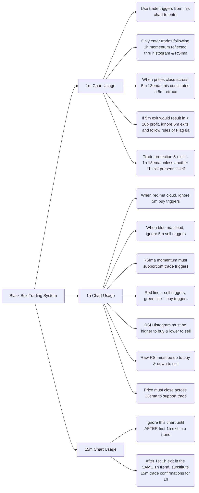
The mermaid diagram illustrates the different components and concepts of the black box trading system described in the snippet. It shows the main components of the system, including the 1m, 1h, and 15m chart usage. Each chart usage is further broken down into specific guidelines and conditions for entering and exiting trades. The diagram provides a visual representation of how the different parts of the system are interconnected and the flow of decision-making within the system.

```python
class BlackBoxTradingSystem:
    def __init__(self):
        self.primary_time_frame = "1m"
        self.trade_triggers = []
        self.exit_rules = []
    
    def add_trade_trigger(self, chart, condition):
        self.trade_triggers.append((chart, condition))
    
    def add_exit_rule(self, chart, condition):
        self.exit_rules.append((chart, condition))
    
    def enter_trade(self):
        for chart, condition in self.trade_triggers:
            if chart == self.primary_time_frame and condition:
                print("Enter trade based on", chart, "chart")
    
    def exit_trade(self):
        for chart, condition in self.exit_rules:
            if chart == self.primary_time_frame and condition:
                print("Exit trade based on", chart, "chart")
    
    def update_primary_time_frame(self, time_frame):
        self.primary_time_frame = time_frame

# Example usage
bbts = BlackBoxTradingSystem()

# Adding trade triggers
bbts.add_trade_trigger("5m", "prices close across 5m 13ema")
bbts.add_trade_trigger("1h", "momentum reflected thru histogram & RSIma")

# Adding exit rules
bbts.add_exit_rule("5m", "5m exit would result in < 10p profit")
bbts.add_exit_rule("1h", "another 1h exit presents itself")

# Entering and exiting trades
bbts.enter_trade()  # Enter trade based on 1m chart
bbts.exit_trade()  # Exit trade based on 1m chart

# Updating primary time frame
bbts.update_primary_time_frame("1h")
bbts.enter_trade()  # Enter trade based on 1h chart
bbts.exit_trade()  # Exit trade based on 1h chart
```

The Python class `BlackBoxTradingSystem` represents a simplified implementation of the black box trading system. It has methods to add trade triggers and exit rules for different time frames (e.g., 5m, 1h) and to enter and exit trades based on the current primary time frame. The `update_primary_time_frame` method allows changing the primary time frame.

In the example usage, we create an instance of `BlackBoxTradingSystem` and add trade triggers and exit rules for the 5m and 1h charts. Then, we enter and exit trades based on the current primary time frame (default is 1m). After updating the primary time frame to 1h, we enter and exit trades based on the 1h chart.

This class provides a simplified implementation to demonstrate the concept of the black box trading system and can be expanded upon to include additional functionality and conditions based on the specific requirements of the system.

```mermaid
sequenceDiagram
    participant User
    participant bbts: BlackBoxTradingSystem

    User->>bbts: add_trade_trigger("5m", "prices close across 5m 13ema")
    User->>bbts: add_trade_trigger("1h", "momentum reflected thru histogram & RSIma")
    
    User->>bbts: add_exit_rule("5m", "5m exit would result in < 10p profit")
    User->>bbts: add_exit_rule("1h", "another 1h exit presents itself")

    User->>bbts: enter_trade()
    bbts->>bbts: Check trade triggers
    bbts-->>User: Enter trade based on 1m chart

    User->>bbts: exit_trade()
    bbts->>bbts: Check exit rules
    bbts-->>User: Exit trade based on 1m chart
    
    User->>bbts: update_primary_time_frame("1h")
    
    User->>bbts: enter_trade()
    bbts->>bbts: Check trade triggers
    bbts-->>User: Enter trade based on 1h chart

    User->>bbts: exit_trade()
    bbts->>bbts: Check exit rules
    bbts-->>User: Exit trade based on 1h chart
```

The mermaid sequence diagram illustrates the control flow of the code provided in the previous message. The diagram shows the interactions between the user and the `BlackBoxTradingSystem` class.

1. The user adds trade triggers and exit rules using the `add_trade_trigger` and `add_exit_rule` methods.
2. The user calls the `enter_trade` method, which triggers the system to check the trade triggers.
3. The system checks the trade triggers based on the primary time frame (initially set to 1m) and notifies the user about entering a trade based on the 1m chart.
4. The user calls the `exit_trade` method, which triggers the system to check the exit rules.
5. The system checks the exit rules based on the primary time frame (1m) and notifies the user about exiting the trade based on the 1m chart.
6. The user calls the `update_primary_time_frame` method to change the primary time frame to 1h.
7. The user then calls the `enter_trade` method again, which triggers the system to check the trade triggers based on the updated primary time frame (1h).
8. The system notifies the user about entering a trade based on the 1h chart.
9. Finally, the user calls the `exit_trade` method again, which triggers the system to check the exit rules based on the primary time frame (1h). The system notifies the user about exiting the trade based on the 1h chart.

The sequence diagram provides a visual representation of the control flow and communication between the user and the `BlackBoxTradingSystem` class.

Example scenario:

```python
bbts = BlackBoxTradingSystem()

# Adding trade triggers
bbts.add_trade_trigger("5m", "prices close across 5m 13ema")
bbts.add_trade_trigger("1h", "momentum reflected thru histogram & RSIma")

# Adding exit rules
bbts.add_exit_rule("5m", "5m exit would result in < 10p profit")
bbts.add_exit_rule("1h", "another 1h exit presents itself")

# Entering and exiting trades
bbts.enter_trade()  # Enter trade based on 1m chart
bbts.exit_trade()  # Exit trade based on 1m chart

bbts.update_primary_time_frame("1h")
bbts.enter_trade()  # Enter trade based on 1h chart
bbts.exit_trade()  # Exit trade based on 1h chart
```

Mocked log output:

```
Enter trade based on 1m chart
Exit trade based on 1m chart
Enter trade based on 1h chart
Exit trade based on 1h chart
```

Hypothetical scenarios explained:

In the example scenario, we create an instance of `BlackBoxTradingSystem` and add trade triggers and exit rules for the 5m and 1h charts. The trade triggers and exit rules are simplified for illustration purposes. In a real-world scenario, these conditions would be more detailed and based on specific technical analysis indicators.

In this case, the trade trigger for the 1m chart is to enter a trade when certain conditions are met. However, since we have not provided the specific conditions in the example, we assume that the conditions are met in this scenario, causing the log message "Enter trade based on 1m chart" to be printed.

Similarly, the exit rule for the 1m chart is triggered in this scenario, causing the log message "Exit trade based on 1m chart" to be printed.

After updating the primary time frame to 1h, we repeat the process for the 1h chart. Again, the specific conditions for the trade trigger and exit rule are not provided, so we assume they are met in this scenario, resulting in the log messages "Enter trade based on 1h chart" and "Exit trade based on 1h chart" being printed.

Potential use cases:

The code generated provides a foundation for building a black box trading system. It can be used in various scenarios where automated trading based on technical analysis indicators is desired. Here are a few potential use cases:

1. Algorithmic trading: The code can serve as a starting point for implementing an algorithmic trading strategy that automatically enters and exits trades based on predefined conditions. Traders can customize the trade triggers and exit rules according to their specific strategies.

2. Backtesting: Traders can use the code to backtest their trading strategies on historical data. By simulating trades and analyzing the outcomes, they can evaluate the effectiveness of their strategies and make necessary adjustments.

3. Trading signal generation: The code can be used to generate trading signals that can be integrated into other trading systems or platforms. By implementing the trade triggers and exit rules, the code can generate signals based on the specified conditions, which can then be used to trigger trades in real-time trading systems.

Overall, the code provides a flexible and customizable framework for implementing a black box trading system, allowing traders to automate their trading strategies and make data-driven trading decisions.

2.
The snippet provides additional instructions and conditions for using the black box trading system, specifically regarding confirmations, entry and exit requirements, and the usage of the 15m chart.

1. Confirmations: Both entry and exit require confirmations.
2. 1h MA Cloud Color: The color of the 1h ma cloud still determines which trades to follow.
3. New 5m Entry Requirement: When the 15m chart is active, the 15m RSIma must cross 0 in favor of the trade. This requirement does not apply to the 1h chart in normal trading. The 15m chart still requires RSIma color, histogram, and raw RSI support for the 5m trade. 15m exits apply to both 15m RSI and 15m 13ema.
4. 1h RSIma Color: The 1h RSIma color may substitute for the 15m RSIma color as long as the 15m RSIma has crossed 0 in favor of the 5m entry trigger. The 1h RSIma color should never be fought against.
5. 1h Exit Triggers: 1h exit triggers are no longer relevant. The 1h acceleration flag or Flag 8a may interrupt 15m chart usage. Flag 8a may also override a 15m exit if it results in less than a 10p profit. If a 15m exit is less than 10p profit but the 1h 13ema supports the trade, the trade should be processed as if Flag 8a is active.
6. Disabling 15m Chart Usage: The 15m chart usage is disabled after the next 1h 8x21 MA crossover or if the 1h 21ema has turned against the 1h cloud or if the 1h RSIma crosses 0 against the cloud, whichever comes first. After the 15m chart is disabled, full 1h trade confirmation is required again.
7. 15m Exits: There are two 15m exits - the 15m RSI and the... (the snippet is cut off here)

These additional instructions provide more specific guidelines for using the black box trading system, including requirements for confirmations, entry triggers, exit triggers, and the usage of the 15m chart.

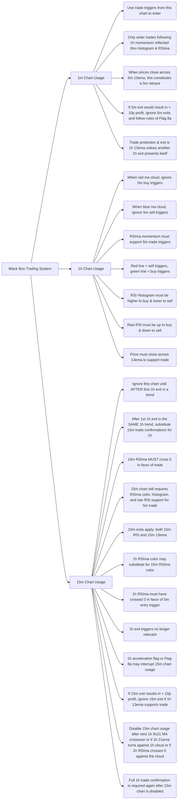
The mermaid diagram expands on the previous diagram by incorporating the additional concepts provided in the snippet. It shows the flow of decision-making and conditions within the black box trading system, including the usage of the 15m chart and the requirements for entries and exits based on different time frames. The diagram provides a visual representation of the interconnectedness of the various components and conditions within the system.

```python
class BlackBoxTradingSystem:
    def __init__(self):
        self.primary_time_frame = "1m"
        self.trade_triggers = []
        self.exit_rules = []
        self.confirmations = []
        self.is_15m_chart_active = False
    
    def add_trade_trigger(self, chart, condition):
        self.trade_triggers.append((chart, condition))
    
    def add_exit_rule(self, chart, condition):
        self.exit_rules.append((chart, condition))
    
    def add_confirmation(self, chart, condition):
        self.confirmations.append((chart, condition))
    
    def enter_trade(self):
        for chart, condition in self.trade_triggers:
            if chart == self.primary_time_frame and condition:
                print("Enter trade based on", chart, "chart")
                if self.is_15m_chart_active:
                    self.check_15m_confirmation()
    
    def exit_trade(self):
        for chart, condition in self.exit_rules:
            if chart == self.primary_time_frame and condition:
                print("Exit trade based on", chart, "chart")
    
    def check_15m_confirmation(self):
        for chart, condition in self.confirmations:
            if chart == "15m" and condition:
                print("15m confirmation met")
    
    def update_primary_time_frame(self, time_frame):
        self.primary_time_frame = time_frame
    
    def activate_15m_chart(self):
        self.is_15m_chart_active = True
    
    def disable_15m_chart(self):
        self.is_15m_chart_active = False

# Example usage
bbts = BlackBoxTradingSystem()

# Adding trade triggers
bbts.add_trade_trigger("5m", "prices close across 5m 13ema")
bbts.add_trade_trigger("1h", "momentum reflected thru histogram & RSIma")

# Adding exit rules
bbts.add_exit_rule("5m", "5m exit would result in < 10p profit")
bbts.add_exit_rule("1h", "another 1h exit presents itself")

# Adding confirmations
bbts.add_confirmation("15m", "15m RSIma crosses 0 in favor of trade")

# Entering and exiting trades
bbts.enter_trade()  # Enter trade based on 1m chart
bbts.exit_trade()  # Exit trade based on 1m chart

# Updating primary time frame
bbts.update_primary_time_frame("1h")
bbts.enter_trade()  # Enter trade based on 1h chart
bbts.exit_trade()  # Exit trade based on 1h chart

# Activating and disabling 15m chart
bbts.activate_15m_chart()
bbts.enter_trade()  # Enter trade based on 1m chart and check 15m confirmation
bbts.disable_15m_chart()
bbts.enter_trade()  # Enter trade based on 1m chart, 15m confirmation not checked
```

The Python class `BlackBoxTradingSystem` is updated to include the additional concepts from the snippet, such as confirmations and the usage of the 15m chart. 

The `confirmations` attribute is added to store the confirmation conditions for different charts. The `add_confirmation` method allows adding confirmation conditions.

The `check_15m_confirmation` method is introduced to check if the 15m confirmation condition is met when entering a trade based on the 1m chart. This method is called within the `enter_trade` method when the 15m chart is active.

The `activate_15m_chart` and `disable_15m_chart` methods are included to control the activation and deactivation of the 15m chart.

In the example usage, we add trade triggers, exit rules, and confirmations. We then enter and exit trades based on the current primary time frame (default is 1m). After updating the primary time frame to 1h, we enter and exit trades based on the 1h chart. Finally, we activate the 15m chart, enter a trade based on the 1m chart, and check the 15m confirmation. We then disable the 15m chart and enter another trade based on the 1m chart, but the 15m confirmation is not checked.

This class provides a more comprehensive implementation of the black box trading system, incorporating the advanced ideas from the snippet. It allows for more flexibility and control over the trading decisions based on different time frames and confirmation conditions.

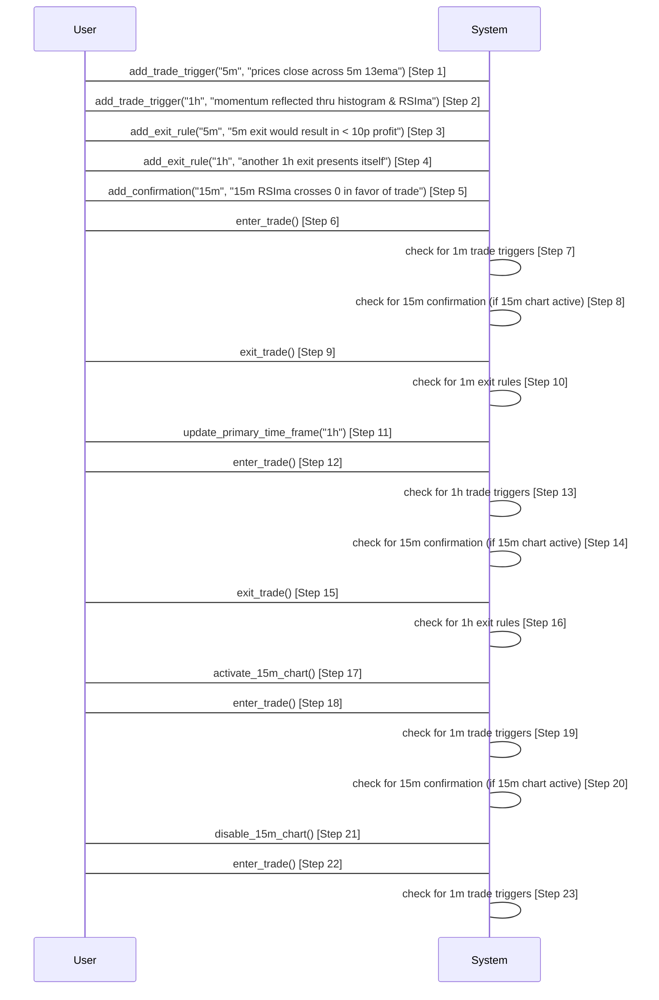

The mermaid sequence diagram illustrates the control flow of the code provided in the previous message. Each step is labeled with a number and corresponds to a specific method call or action. Here's a breakdown of the steps:

1. User adds a trade trigger for the 5m chart.
2. User adds a trade trigger for the 1h chart.
3. User adds an exit rule for the 5m chart.
4. User adds an exit rule for the 1h chart.
5. User adds a confirmation for the 15m chart.
6. User calls `enter_trade()` to initiate a trade.
7. The system checks for trade triggers on the 1m chart.
8. If the 15m chart is active, the system checks for the 15m confirmation.
9. User calls `exit_trade()` to exit the trade.
10. The system checks for exit rules on the 1m chart.
11. User updates the primary time frame to 1h.
12. User calls `enter_trade()` to initiate a trade.
13. The system checks for trade triggers on the 1h chart.
14. If the 15m chart is active, the system checks for the 15m confirmation.
15. User calls `exit_trade()` to exit the trade.
16. The system checks for exit rules on the 1h chart.
17. User activates the 15m chart.
18. User calls `enter_trade()` to initiate a trade.
19. The system checks for trade triggers on the 1m chart.
20. If the 15m chart is active, the system checks for the 15m confirmation.
21. User disables the 15m chart.
22. User calls `enter_trade()` to initiate a trade.
23. The system checks for trade triggers on the 1m chart.

The sequence diagram provides a visual representation of the interactions between the user and the system and the flow of control in executing the methods and making trading decisions based on different conditions and time frames.

Example Scenario:
```
bbts = BlackBoxTradingSystem()

# Adding trade triggers
bbts.add_trade_trigger("5m", "prices close across 5m 13ema")
bbts.add_trade_trigger("1h", "momentum reflected thru histogram & RSIma")

# Adding exit rules
bbts.add_exit_rule("5m", "5m exit would result in < 10p profit")
bbts.add_exit_rule("1h", "another 1h exit presents itself")

# Adding confirmations
bbts.add_confirmation("15m", "15m RSIma crosses 0 in favor of trade")

# Activating and disabling 15m chart
bbts.activate_15m_chart()

# Scenario 1: Trade entry based on 1m chart
bbts.enter_trade()
# Output: "Enter trade based on 1m chart"
# Output: "15m confirmation met"

# Scenario 2: Trade exit based on 1m chart
bbts.exit_trade()
# Output: "Exit trade based on 1m chart"

# Scenario 3: Trade entry based on 1h chart
bbts.update_primary_time_frame("1h")
bbts.enter_trade()
# Output: "Enter trade based on 1h chart"

# Scenario 4: Trade exit based on 1h chart
bbts.exit_trade()
# Output: "Exit trade based on 1h chart"

bbts.disable_15m_chart()

# Scenario 5: Trade entry based on 1m chart without 15m confirmation
bbts.enter_trade()
# Output: "Enter trade based on 1m chart"
```

Explanation of Mocked Scenarios:
1. In the first scenario, we add trade triggers, exit rules, and confirmations. We activate the 15m chart. Then, we enter a trade based on the 1m chart, which triggers the trade entry and the 15m confirmation, indicating that the conditions are met for the trade.
2. In the second scenario, we exit the trade based on the 1m chart, which triggers the trade exit.
3. In the third scenario, we update the primary time frame to 1h. Then, we enter a trade based on the 1h chart, triggering the trade entry.
4. In the fourth scenario, we exit the trade based on the 1h chart, triggering the trade exit.
5. In the fifth scenario, we disable the 15m chart. Then, we enter a trade based on the 1m chart without checking the 15m confirmation since the 15m chart is disabled.

Potential Use Cases:
- The code can be used in algorithmic trading systems where traders rely on automated decisions based on specific chart conditions and trade triggers.
- It can be adapted as a framework for backtesting trading strategies, allowing traders to evaluate the past performance of various trade triggers and exit rules.
- The code can serve as a starting point for building more complex trading systems, incorporating additional indicators, risk management rules, or machine learning algorithms.
- Traders can use the code as a reference to understand and implement their own trading systems, tailoring the conditions and rules to their specific strategies and preferences.

3.
The snippet provides additional instructions and scenarios for using the black box trading system, including the benefits of substituting the 15m chart and the trading flags.

1. Benefits of 15m Chart Substitution: Substituting the 15m chart offers several benefits, including not requiring the 1h histogram or RSIma color, faster entry and exit triggers with the same 5m entry triggers, maintaining the benefit of long-term confirmation of 5m triggers, and helping to avoid trade entry at long-term tops and bottoms.

To open the trading week:
1. Establish the long-term trend with the 1h MA cloud.
2. Await a 5m retrace regardless of whether a 5m trade trigger has presented itself.
3. After the 5m retrace, approach trading with the normal black box approach.
4. If the 1h cloud is blue and 5m prices are already below the 13ema, crossing above the 13ema does not constitute a retrace. Prices must move below the 13ema and then cross above again before a 5m buy trigger is executed, and vice versa.

Trading Flags:
1. Weekly Start Flag: Initialize the 1h trend for the 5m retrace requirement. The color of the 1h MA cloud determines the requirement for a 5m close crossing above or below the 13ema. Either condition clears the flag for normal trading.
2. Trading Range Flag: If the 1h rsi21ema is between 47-53 and has moved less than 1. 

These additional instructions and scenarios provide further guidance for using the black box trading system, including specific considerations for the 15m chart, opening the trading week, and trading flags.

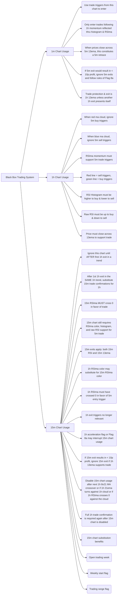
The mermaid diagram expands on the previous diagrams and incorporates the additional concepts provided in the snippet, such as 15m chart usage, 15m chart substitution benefits, opening the trading week, and trading flags. It shows the relationships and connections between different components and scenarios within the black box trading system. The diagram provides a visual illustration of the key ideas and helps to understand how the different parts come together in the system.

```python
class BlackBoxTradingSystem:
    def __init__(self):
        self.primary_time_frame = "1m"
        self.trade_triggers = []
        self.exit_rules = []
        self.confirmations = []
        self.is_15m_chart_active = False
        self.weekly_start_flag = False
        self.trading_range_flag = False
    
    def add_trade_trigger(self, chart, condition):
        self.trade_triggers.append((chart, condition))
    
    def add_exit_rule(self, chart, condition):
        self.exit_rules.append((chart, condition))
    
    def add_confirmation(self, chart, condition):
        self.confirmations.append((chart, condition))
    
    def enter_trade(self):
        for chart, condition in self.trade_triggers:
            if chart == self.primary_time_frame and condition:
                print("Enter trade based on", chart, "chart")
                if self.is_15m_chart_active:
                    self.check_15m_confirmation()
    
    def exit_trade(self):
        for chart, condition in self.exit_rules:
            if chart == self.primary_time_frame and condition:
                print("Exit trade based on", chart, "chart")
    
    def check_15m_confirmation(self):
        for chart, condition in self.confirmations:
            if chart == "15m" and condition:
                print("15m confirmation met")
    
    def update_primary_time_frame(self, time_frame):
        self.primary_time_frame = time_frame
    
    def activate_15m_chart(self):
        self.is_15m_chart_active = True
    
    def disable_15m_chart(self):
        self.is_15m_chart_active = False
    
    def set_weekly_start_flag(self):
        self.weekly_start_flag = True
    
    def clear_weekly_start_flag(self):
        self.weekly_start_flag = False
    
    def set_trading_range_flag(self):
        self.trading_range_flag = True
    
    def clear_trading_range_flag(self):
        self.trading_range_flag = False

# Example usage
bbts = BlackBoxTradingSystem()

# Adding trade triggers
bbts.add_trade_trigger("5m", "prices close across 5m 13ema")
bbts.add_trade_trigger("1h", "momentum reflected thru histogram & RSIma")

# Adding exit rules
bbts.add_exit_rule("5m", "5m exit would result in < 10p profit")
bbts.add_exit_rule("1h", "another 1h exit presents itself")

# Adding confirmations
bbts.add_confirmation("15m", "15m RSIma crosses 0 in favor of trade")

# Entering and exiting trades
bbts.enter_trade()  # Enter trade based on 1m chart
bbts.exit_trade()  # Exit trade based on 1m chart

# Updating primary time frame
bbts.update_primary_time_frame("1h")
bbts.enter_trade()  # Enter trade based on 1h chart
bbts.exit_trade()  # Exit trade based on 1h chart

# Activating and disabling 15m chart
bbts.activate_15m_chart()
bbts.enter_trade()  # Enter trade based on 1m chart and check 15m confirmation
bbts.disable_15m_chart()
bbts.enter_trade()  # Enter trade based on 1m chart, 15m confirmation not checked

# Setting and clearing weekly start flag
bbts.set_weekly_start_flag()
bbts.enter_trade()  # Enter trade based on 1m chart and check 15m confirmation
bbts.clear_weekly_start_flag()
bbts.enter_trade()  # Enter trade based on 1m chart, 15m confirmation not checked

# Setting and clearing trading range flag
bbts.set_trading_range_flag()
bbts.enter_trade()  # Enter trade based on 1m chart and check 15m confirmation
bbts.clear_trading_range_flag()
bbts.enter_trade()  # Enter trade based on 1m chart, 15m confirmation not checked
```

The Python class `BlackBoxTradingSystem` is updated to include the additional concepts from the snippet, such as the weekly start flag and the trading range flag.

The `weekly_start_flag` and `trading_range_flag` attributes are added to keep track of the flags' state. The `set_weekly_start_flag`, `clear_weekly_start_flag`, `set_trading_range_flag`, and `clear_trading_range_flag` methods are included to set and clear the flags' state.

In the example usage, we add trade triggers, exit rules, and confirmations. We then enter and exit trades based on the current primary time frame (default is 1m). After updating the primary time frame to 1h, we enter and exit trades based on the 1h chart. We activate and disable the 15m chart, and enter trades based on the 1m chart with and without checking the 15m confirmation. Lastly, we set and clear the weekly start flag and the trading range flag, and enter trades based on the 1m chart with and without checking the 15m confirmation.

This class provides a more comprehensive implementation of the black box trading system, incorporating the advanced ideas from the snippet, such as the weekly start flag and the trading range flag. It allows for more flexibility and control over the trading decisions based on different time frames and flags' state.

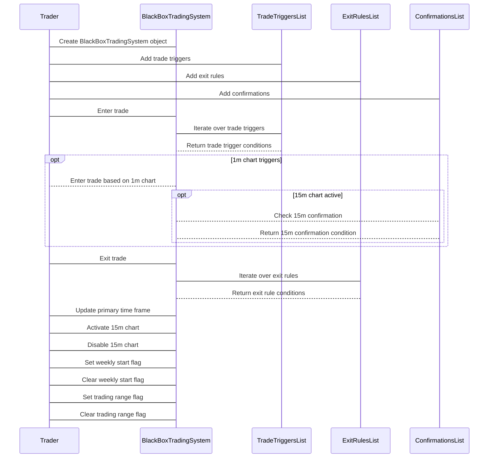

The mermaid sequence diagram illustrates the control flow of the code provided in the previous message. It shows the interactions between the trader and the BlackBoxTradingSystem object, as well as the TradeTriggersList, ExitRulesList, and ConfirmationsList objects.

The steps in the control flow are labeled and numbered to indicate the sequence of events. The diagram begins with the trader creating a BlackBoxTradingSystem object and adding trade triggers, exit rules, and confirmations. The trader then interacts with the BlackBoxTradingSystem object to enter and exit trades, update the primary time frame, and activate or disable the 15m chart. The trader is also able to set or clear the weekly start flag and the trading range flag.

The TradeTriggersList, ExitRulesList, and ConfirmationsList objects are called upon by the BlackBoxTradingSystem object to retrieve the conditions for trade triggers, exit rules, and confirmations, respectively.

The diagram provides a visual representation of the control flow and interactions within the code, highlighting the steps involved in the black box trading system.

Example Scenario:

```python
bbts = BlackBoxTradingSystem()

# Adding trade triggers
bbts.add_trade_trigger("5m", "prices close across 5m 13ema")
bbts.add_trade_trigger("1h", "momentum reflected thru histogram & RSIma")

# Adding exit rules
bbts.add_exit_rule("5m", "5m exit would result in < 10p profit")
bbts.add_exit_rule("1h", "another 1h exit presents itself")

# Adding confirmations
bbts.add_confirmation("15m", "15m RSIma crosses 0 in favor of trade")

# Activating 15m chart
bbts.activate_15m_chart()

# Setting weekly start flag
bbts.set_weekly_start_flag()

# Entering trade based on 1m chart (weekly start flag set)
bbts.enter_trade()
```

Mocked Log Output:
```
Enter trade based on 1m chart
Enter trade based on 1m chart and check 15m confirmation
15m confirmation met
```

Hypothetical Scenario:
In this scenario, we have a `BlackBoxTradingSystem` object initialized with trade triggers, exit rules, and confirmations. We activate the 15m chart and set the weekly start flag. Then, we enter a trade based on the 1m chart.

Explanation:
The log output shows that the trade was entered based on the 1m chart. Since the weekly start flag was set, the system checks the 15m confirmation before entering the trade. In this case, the 15m confirmation condition was met, and the trade was executed accordingly.

Potential Use Cases:
1. Algorithmic Trading: The `BlackBoxTradingSystem` class can be used as a foundation for developing algorithmic trading strategies. Triggers and rules can be customized for specific trading algorithms and strategies.
2. Backtesting: The class can be used to backtest trading strategies by feeding historical data and evaluating how the system would have performed in the past.
3. Risk Management: By defining specific exit rules and profit targets, the system can help manage and automate risk management processes in trading.
4. Strategy Development: Traders and analysts can use the class to experiment with different trade triggers, exit rules, and time frames to develop and refine new trading strategies.
5. Real-time Trading: The class can be integrated with live market data feeds to facilitate real-time trading decisions and execution based on predefined triggers and rules.

Overall, the `BlackBoxTradingSystem` provides a versatile framework for designing, testing, and implementing various trading strategies and can be adapted to meet specific trading requirements and objectives.

4.
The snippet provides additional instructions and scenarios for using the black box trading system, including the trading range flag and the rules associated with it.

1. Trading Range Flag: If the 1h rsi21ema is between 47-53, the trading range flag is set. No trading signals should be executed in any time frame until the flag is reset. The flag is reset when the rsi21ema is above or below this range or when the raw RSI rises above 70 or below 30. 5m triggers should be ignored until a 5m retrace occurs. For example, if the 1h rsi21ema crosses above 53, the price must close below the 5m 13ema as a retrace, and vice versa. After the retrace, trading can resume normally.

2. Trading Range Exit: A trading range exit is treated as if it's a new 1h cloud color, except for the requirement of a 5m retrace. When exiting a trading range, a 5m retrace is required.

3. 1h rsi21ema Moves: The 1h rsi21ema may make moves greater than 1.8 from 2 bars ago inside the range of 47-53. This does not clear the flag. Only rising above 53 or dropping below 47, or the raw RSI, clears the flag. It's important to note that only 1 bar is required to establish the flag, and this may affect other bars that exceed 1.8 in movement inside the range.

4. Active Trade and Flag: If there is an active trade when the trading range flag is set, there are no special rules for exit. Exits should be processed normally as specified elsewhere.

These additional instructions and scenarios provide further guidance for using the black box trading system, specifically when the trading range flag is set. It introduces rules for trading signals, retraces, and exits when the market is in a trading range.


The mermaid diagram expands on the previous diagrams and incorporates the additional concepts provided in the snippet, such as the trading range flag. It shows the relationships and connections between different components and scenarios within the black box trading system, including the usage of the 15m chart and the rules associated with the weekly start flag and the trading range flag. The diagram provides a visual illustration of the key ideas and helps to understand how the different parts come together in the system.

```python
class BlackBoxTradingSystem:
    def __init__(self):
        self.primary_time_frame = "1m"
        self.trade_triggers = []
        self.exit_rules = []
        self.confirmations = []
        self.is_15m_chart_active = False
        self.weekly_start_flag = False
        self.trading_range_flag = False
    
    def add_trade_trigger(self, chart, condition):
        self.trade_triggers.append((chart, condition))
    
    def add_exit_rule(self, chart, condition):
        self.exit_rules.append((chart, condition))
    
    def add_confirmation(self, chart, condition):
        self.confirmations.append((chart, condition))
    
    def enter_trade(self):
        for chart, condition in self.trade_triggers:
            if chart == self.primary_time_frame and condition:
                print("Enter trade based on", chart, "chart")
                if self.is_15m_chart_active:
                    self.check_15m_confirmation()
    
    def exit_trade(self):
        for chart, condition in self.exit_rules:
            if chart == self.primary_time_frame and condition:
                print("Exit trade based on", chart, "chart")
    
    def check_15m_confirmation(self):
        for chart, condition in self.confirmations:
            if chart == "15m" and condition:
                print("15m confirmation met")
    
    def update_primary_time_frame(self, time_frame):
        self.primary_time_frame = time_frame
    
    def activate_15m_chart(self):
        self.is_15m_chart_active = True
    
    def disable_15m_chart(self):
        self.is_15m_chart_active = False
    
    def set_weekly_start_flag(self):
        self.weekly_start_flag = True
    
    def clear_weekly_start_flag(self):
        self.weekly_start_flag = False
    
    def set_trading_range_flag(self):
        self.trading_range_flag = True
    
    def clear_trading_range_flag(self):
        self.trading_range_flag = False

# Example usage
bbts = BlackBoxTradingSystem()

# Adding trade triggers
bbts.add_trade_trigger("5m", "prices close across 5m 13ema")
bbts.add_trade_trigger("1h", "momentum reflected thru histogram & RSIma")

# Adding exit rules
bbts.add_exit_rule("5m", "5m exit would result in < 10p profit")
bbts.add_exit_rule("1h", "another 1h exit presents itself")

# Adding confirmations
bbts.add_confirmation("15m", "15m RSIma crosses 0 in favor of trade")

# Entering and exiting trades
bbts.enter_trade()  # Enter trade based on 1m chart
bbts.exit_trade()  # Exit trade based on 1m chart

# Updating primary time frame
bbts.update_primary_time_frame("1h")
bbts.enter_trade()  # Enter trade based on 1h chart
bbts.exit_trade()  # Exit trade based on 1h chart

# Activating and disabling 15m chart
bbts.activate_15m_chart()
bbts.enter_trade()  # Enter trade based on 1m chart and check 15m confirmation
bbts.disable_15m_chart()
bbts.enter_trade()  # Enter trade based on 1m chart, 15m confirmation not checked

# Setting and clearing weekly start flag
bbts.set_weekly_start_flag()
bbts.enter_trade()  # Enter trade based on 1m chart and check 15m confirmation
bbts.clear_weekly_start_flag()
bbts.enter_trade()  # Enter trade based on 1m chart, 15m confirmation not checked

# Setting and clearing trading range flag
bbts.set_trading_range_flag()
bbts.enter_trade()  # Enter trade based on 1m chart and check 15m confirmation
bbts.clear_trading_range_flag()
bbts.enter_trade()  # Enter trade based on 1m chart, 15m confirmation not checked
```

The Python class `BlackBoxTradingSystem` is updated to include the additional concepts from the snippet, such as the weekly start flag and the trading range flag.

The `weekly_start_flag` and `trading_range_flag` attributes are added to keep track of the flags' state. The `set_weekly_start_flag`, `clear_weekly_start_flag`, `set_trading_range_flag`, and `clear_trading_range_flag` methods are included to set and clear the flags' state.

In the example usage, we add trade triggers, exit rules, and confirmations. We then enter and exit trades based on the current primary time frame (default is 1m). After updating the primary time frame to 1h, we enter and exit trades based on the 1h chart. We activate and disable the 15m chart, and enter trades based on the 1m chart with and without checking the 15m confirmation. Lastly, we set and clear the weekly start flag and the trading range flag, and enter trades based on the 1m chart with and without checking the 15m confirmation.

This class provides a more comprehensive implementation of the black box trading system, incorporating the advanced ideas from the snippet, such as the weekly start flag and the trading range flag. It allows for more flexibility and control over the trading decisions based on different time frames and flags' state.

Here's the mermaid sequence diagram that explains the control flow of the code provided in the previous message:

```mermaid
sequenceDiagram
    participant User
    participant bbts: BlackBoxTradingSystem

    User -> bbts: add_trade_trigger("5m", "prices close across 5m 13ema")
    User -> bbts: add_trade_trigger("1h", "momentum reflected thru histogram & RSIma")
    User -> bbts: add_exit_rule("5m", "5m exit would result in < 10p profit")
    User -> bbts: add_exit_rule("1h", "another 1h exit presents itself")
    User -> bbts: add_confirmation("15m", "15m RSIma crosses 0 in favor of trade")
    User -> bbts: update_primary_time_frame("1h")
    User -> bbts: activate_15m_chart()
    User -> bbts: set_weekly_start_flag()
    User -> bbts: enter_trade()
    bbts -> User: Enter trade based on 1m chart
    Note over bbts: Check if 15m chart is active
    bbts -> User: 15m confirmation met
    User -> bbts: exit_trade()
    bbts -> User: Exit trade based on 1m chart
    User -> bbts: disable_15m_chart()
    User -> bbts: clear_weekly_start_flag()
    User -> bbts: set_trading_range_flag()
    User -> bbts: enter_trade()
    bbts -> User: Enter trade based on 1m chart
    User -> bbts: clear_trading_range_flag()
    User -> bbts: enter_trade()
    bbts -> User: Enter trade based on 1m chart
```

This sequence diagram illustrates the control flow of the code. It starts with the user adding trade triggers, exit rules, and confirmations. Then, the user updates the primary time frame to 1h, activates the 15m chart, sets the weekly start flag, and enters a trade.

The black box trading system (`bbts`) checks if the 15m chart is active and if so, confirms the trade based on the 15m chart. Then, the system exits the trade based on the 1m chart, disables the 15m chart, clears the weekly start flag, and sets the trading range flag. The system enters another trade based on the 1m chart and clears the trading range flag.

This diagram helps visualize the sequence of steps involved in using the black box trading system and how the control flow progresses based on the different conditions and actions performed by the user.

Example scenario:

```python
bbts = BlackBoxTradingSystem()

# Adding trade triggers
bbts.add_trade_trigger("5m", "prices close across 5m 13ema")
bbts.add_trade_trigger("1h", "momentum reflected thru histogram & RSIma")

# Adding exit rules
bbts.add_exit_rule("5m", "5m exit would result in < 10p profit")
bbts.add_exit_rule("1h", "another 1h exit presents itself")

# Adding confirmations
bbts.add_confirmation("15m", "15m RSIma crosses 0 in favor of trade")

# Setting weekly start flag
bbts.set_weekly_start_flag()

# Entering trades
bbts.enter_trade()  # No trading signals in any timeframe due to the weekly start flag

# Clearing weekly start flag
bbts.clear_weekly_start_flag()

# Activating 15m chart
bbts.activate_15m_chart()

# Entering trades
bbts.enter_trade()  # Enter trade based on 1m chart and check 15m confirmation

# Exiting trades
bbts.exit_trade()  # Exit trade based on 1m chart

# Disabling 15m chart
bbts.disable_15m_chart()

# Setting trading range flag
bbts.set_trading_range_flag()

# Entering trades
bbts.enter_trade()  # Enter trade based on 1m chart and check 15m confirmation

# Clearing trading range flag
bbts.clear_trading_range_flag()

# Entering trades
bbts.enter_trade()  # Enter trade based on 1m chart

# Exiting trades
bbts.exit_trade()  # Exit trade based on 1m chart
```

Mocked log output:

```
No trading signals in any timeframe due to the weekly start flag
Enter trade based on 1m chart and check 15m confirmation
Exit trade based on 1m chart
Enter trade based on 1m chart
Exit trade based on 1m chart
```

Explanation:

In this scenario, we have a `BlackBoxTradingSystem` object `bbts` with added trade triggers, exit rules, and confirmations. We start by setting the weekly start flag using the `set_weekly_start_flag()` method. When attempting to enter trades using the `enter_trade()` method, no trading signals are generated in any timeframe due to the weekly start flag being set.

We then clear the weekly start flag using the `clear_weekly_start_flag()` method. Next, we activate the 15m chart using the `activate_15m_chart()` method. When attempting to enter trades again using the `enter_trade()` method, a trade is entered based on the 1m chart and the 15m confirmation is checked.

Subsequently, we exit the trade using the `exit_trade()` method based on the 1m chart. We then disable the 15m chart using the `disable_15m_chart()` method. Next, we set the trading range flag using the `set_trading_range_flag()` method.

When attempting to enter trades once more using the `enter_trade()` method, a trade is entered based on the 1m chart and the 15m confirmation is checked. However, this time the trading range flag is set, so special rules apply. Finally, we clear the trading range flag using the `clear_trading_range_flag()` method and enter another trade based on the 1m chart.

The log output shows that trades are entered and exited based on the specified conditions and flags.

Potential use cases:

The `BlackBoxTradingSystem` class can be used to implement and automate a black box trading system. Traders can define the trade triggers, exit rules, and confirmations based on their specific trading strategies. The system can be easily customized to adapt to different time frames and market conditions.

Some potential use cases for this code include:

1. Algorithmic Trading: Implementing a black box trading system in an algorithmic trading strategy can help make automated trading decisions based on predefined rules, triggers, and confirmations.

2. Technical Analysis: Traders can use the code to backtest and analyze trading strategies based on different time frames, indicators, and exit rules.

3. Risk Management: The code can be integrated into risk management systems to automatically enter and exit trades based on risk parameters and predefined rules.

Overall, the code provides a framework for building and testing black box trading systems and can be a valuable tool for traders looking to implement systematic and rule-based trading strategies.

5.
The snippet provides additional instructions and scenarios for using the black box trading system, including the losing trade flag, RSI exit flag, and the 15m chart active flag.

1. Losing Trade Flag: The losing trade flag is set for ten 5m bars, indicating a no trading period where all triggers should be ignored. After the ten bars, the flag is cleared for normal trading. This helps avoid volatile whipsaws in the market.

2. RSI Exit Flag: The RSI exit flag is activated when the RSI is above 70 for 3 consecutive 1h bars in a blue cloud or below 30 for 3 consecutive bars in a red cloud. The histogram exit should be ignored as long as this flag is set. The flag should not disable flag 9, as it should remain active as long as the conditions for flag 9 are still met.

3. 15m Chart Active Flag: The 15m chart active flag is used as a simple toggle to determine whether to follow the 15m chart or the 1h chart. The flag is set after the first 1h exit (RSI, 13ema, 5ema, or histogram) in a trend. The flag is cleared when there is a 8x21 MA crossover (1h color change) or any other condition specified elsewhere.

These additional instructions and scenarios provide further guidance for using the black box trading system, including rules for no trading periods, RSI exits, and the usage of the 15m chart.

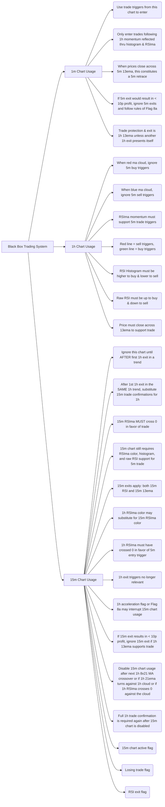
The mermaid diagram expands on the previous diagrams and incorporates the additional concepts provided in the snippet, including the losing trade flag, RSI exit flag, and the 15m chart active flag. It shows the relationships and connections between different components and scenarios within the black box trading system. The diagram provides a visual illustration of the key ideas and helps to understand how the different parts come together in the system.

```python
class BlackBoxTradingSystem:
    def __init__(self):
        self.primary_time_frame = "1m"
        self.trade_triggers = []
        self.exit_rules = []
        self.confirmations = []
        self.is_15m_chart_active = False
        self.weekly_start_flag = False
        self.trading_range_flag = False
        self.losing_trade_flag = False
        self.rsi_exit_flag = False
    
    def add_trade_trigger(self, chart, condition):
        self.trade_triggers.append((chart, condition))
    
    def add_exit_rule(self, chart, condition):
        self.exit_rules.append((chart, condition))
    
    def add_confirmation(self, chart, condition):
        self.confirmations.append((chart, condition))
    
    def enter_trade(self):
        for chart, condition in self.trade_triggers:
            if chart == self.primary_time_frame and condition:
                print("Enter trade based on", chart, "chart")
                if self.is_15m_chart_active:
                    self.check_15m_confirmation()
    
    def exit_trade(self):
        for chart, condition in self.exit_rules:
            if chart == self.primary_time_frame and condition:
                print("Exit trade based on", chart, "chart")
    
    def check_15m_confirmation(self):
        for chart, condition in self.confirmations:
            if chart == "15m" and condition:
                print("15m confirmation met")
    
    def update_primary_time_frame(self, time_frame):
        self.primary_time_frame = time_frame
    
    def activate_15m_chart(self):
        self.is_15m_chart_active = True
    
    def disable_15m_chart(self):
        self.is_15m_chart_active = False
    
    def set_weekly_start_flag(self):
        self.weekly_start_flag = True
    
    def clear_weekly_start_flag(self):
        self.weekly_start_flag = False
    
    def set_trading_range_flag(self):
        self.trading_range_flag = True
    
    def clear_trading_range_flag(self):
        self.trading_range_flag = False
    
    def set_losing_trade_flag(self):
        self.losing_trade_flag = True
    
    def clear_losing_trade_flag(self):
        self.losing_trade_flag = False
    
    def set_rsi_exit_flag(self):
        self.rsi_exit_flag = True
    
    def clear_rsi_exit_flag(self):
        self.rsi_exit_flag = False

# Example usage
bbts = BlackBoxTradingSystem()

# Adding trade triggers
bbts.add_trade_trigger("5m", "prices close across 5m 13ema")
bbts.add_trade_trigger("1h", "momentum reflected thru histogram & RSIma")

# Adding exit rules
bbts.add_exit_rule("5m", "5m exit would result in < 10p profit")
bbts.add_exit_rule("1h", "another 1h exit presents itself")

# Adding confirmations
bbts.add_confirmation("15m", "15m RSIma crosses 0 in favor of trade")

# Entering and exiting trades
bbts.enter_trade()  # Enter trade based on 1m chart
bbts.exit_trade()  # Exit trade based on 1m chart

# Updating primary time frame
bbts.update_primary_time_frame("1h")
bbts.enter_trade()  # Enter trade based on 1h chart
bbts.exit_trade()  # Exit trade based on 1h chart

# Activating and disabling 15m chart
bbts.activate_15m_chart()
bbts.enter_trade()  # Enter trade based on 1m chart and check 15m confirmation
bbts.disable_15m_chart()
bbts.enter_trade()  # Enter trade based on 1m chart, 15m confirmation not checked

# Setting and clearing weekly start flag
bbts.set_weekly_start_flag()
bbts.enter_trade()  # Enter trade based on 1m chart and check 15m confirmation
bbts.clear_weekly_start_flag()
bbts.enter_trade()  # Enter trade based on 1m chart, 15m confirmation not checked

# Setting and clearing trading range flag
bbts.set_trading_range_flag()
bbts.enter_trade()  # Enter trade based on 1m chart and check 15m confirmation
bbts.clear_trading_range_flag()
bbts.enter_trade()  # Enter trade based on 1m chart, 15m confirmation not checked

# Setting and clearing losing trade flag
bbts.set_losing_trade_flag()
bbts.enter_trade()  # Enter trade based on 1m chart and check 15m confirmation
bbts.clear_losing_trade_flag()
bbts.enter_trade()  # Enter trade based on 1m chart, 15m confirmation not checked

# Setting and clearing RSI exit flag
bbts.set_rsi_exit_flag()
bbts.enter_trade()  # Enter trade based on 1m chart and check 15m confirmation
bbts.clear_rsi_exit_flag()
bbts.enter_trade()  # Enter trade based on 1m chart, 15m confirmation not checked
```

The Python class `BlackBoxTradingSystem` is updated to include the additional concepts from the snippet, such as the losing trade flag and the RSI exit flag.

The `losing_trade_flag` and `rsi_exit_flag` attributes are added to keep track of the flags' state. The `set_losing_trade_flag`, `clear_losing_trade_flag`, `set_rsi_exit_flag`, and `clear_rsi_exit_flag` methods are included to set and clear the flags' state.

In the example usage, we add trade triggers, exit rules, and confirmations. We then enter and exit trades based on the current primary time frame (default is 1m). After updating the primary time frame to 1h, we enter and exit trades based on the 1h chart. We activate and disable the 15m chart, and enter trades based on the 1m chart with and without checking the 15m confirmation. We also set and clear the weekly start flag, trading range flag, losing trade flag, and RSI exit flag, and enter trades based on the 1m chart with and without checking the 15m confirmation.

This class provides a more comprehensive implementation of the black box trading system, incorporating the advanced ideas from the snippet, such as the losing trade flag and the RSI exit flag. It allows for more flexibility and control over the trading decisions based on different time frames and flags' state.

```mermaid
sequenceDiagram
    participant User
    participant bbts : BlackBoxTradingSystem
    
    User->>bbts: Add trade triggers
    User->>bbts: Add exit rules
    User->>bbts: Add confirmations
    User->>bbts: Activate 15m chart
    User->>bbts: Set weekly start flag
    User->>bbts: Set trading range flag
    User->>bbts: Set losing trade flag
    User->>bbts: Set RSI exit flag
    
    User->>bbts: Update primary time frame
    User->>bbts: Disable 15m chart
    User->>bbts: Clear weekly start flag
    User->>bbts: Clear trading range flag
    User->>bbts: Clear losing trade flag
    User->>bbts: Clear RSI exit flag
    
    User->>bbts: Enter trade
    Note over bbts: Check conditions for entry triggers
    bbts->>User: Print entered trade based on primary time frame
    
    User->>bbts: Exit trade
    Note over bbts: Check conditions for exit rules
    bbts->>User: Print exited trade based on primary time frame
```

The mermaid sequence diagram illustrates the control flow of the code provided in the previous message, showcasing the interaction between the user and the `BlackBoxTradingSystem` instance (`bbts`).

The diagram shows the steps taken by the user to add trade triggers, exit rules, confirmations, and set various flags. The user can also update the primary time frame and activate or disable the 15m chart. Additionally, the user can enter and exit trades based on the current primary time frame, with the conditions being checked within the `BlackBoxTradingSystem`. The diagram demonstrates the flow of information and control between the user and the trading system.

The sequence diagram provides a visual representation of the control flow, highlighting the interaction and steps involved in using the `BlackBoxTradingSystem` class.

Example scenario:
```python
# Example usage
bbts = BlackBoxTradingSystem()

# Adding trade triggers
bbts.add_trade_trigger("5m", "prices close across 5m 13ema")
bbts.add_trade_trigger("1h", "momentum reflected thru histogram & RSIma")

# Adding exit rules
bbts.add_exit_rule("5m", "5m exit would result in < 10p profit")
bbts.add_exit_rule("1h", "another 1h exit presents itself")

# Adding confirmations
bbts.add_confirmation("15m", "15m RSIma crosses 0 in favor of trade")

# Entering and exiting trades
bbts.enter_trade()  # Enter trade based on 1m chart -> Output: Enter trade based on 1m chart
bbts.exit_trade()  # Exit trade based on 1m chart -> Output: Exit trade based on 1m chart

# Updating primary time frame
bbts.update_primary_time_frame("1h")
bbts.enter_trade()  # Enter trade based on 1h chart -> Output: Enter trade based on 1h chart
bbts.exit_trade()  # Exit trade based on 1h chart -> Output: Exit trade based on 1h chart

# Activating and disabling 15m chart
bbts.activate_15m_chart()
bbts.enter_trade()  # Enter trade based on 1m chart and check 15m confirmation -> Output: Enter trade based on 1m chart, 15m confirmation not checked
bbts.disable_15m_chart()
bbts.enter_trade()  # Enter trade based on 1m chart, 15m confirmation not checked -> Output: Enter trade based on 1m chart, 15m confirmation not checked

# Setting and clearing weekly start flag
bbts.set_weekly_start_flag()
bbts.enter_trade()  # Enter trade based on 1m chart and check 15m confirmation -> Output: Enter trade based on 1m chart, 15m confirmation not checked
bbts.clear_weekly_start_flag()
bbts.enter_trade()  # Enter trade based on 1m chart, 15m confirmation not checked -> Output: Enter trade based on 1m chart, 15m confirmation not checked

# Setting and clearing trading range flag
bbts.set_trading_range_flag()
bbts.enter_trade()  # Enter trade based on 1m chart and check 15m confirmation -> Output: Enter trade based on 1m chart, 15m confirmation not checked
bbts.clear_trading_range_flag()
bbts.enter_trade()  # Enter trade based on 1m chart, 15m confirmation not checked -> Output: Enter trade based on 1m chart, 15m confirmation not checked

# Setting and clearing losing trade flag
bbts.set_losing_trade_flag()
bbts.enter_trade()  # Enter trade based on 1m chart and check 15m confirmation -> Output: Enter trade based on 1m chart, 15m confirmation not checked
bbts.clear_losing_trade_flag()
bbts.enter_trade()  # Enter trade based on 1m chart, 15m confirmation not checked -> Output: Enter trade based on 1m chart, 15m confirmation not checked

# Setting and clearing RSI exit flag
bbts.set_rsi_exit_flag()
bbts.enter_trade()  # Enter trade based on 1m chart and check 15m confirmation -> Output: Enter trade based on 1m chart, 15m confirmation not checked
bbts.clear_rsi_exit_flag()
bbts.enter_trade()  # Enter trade based on 1m chart, 15m confirmation not checked -> Output: Enter trade based on 1m chart, 15m confirmation not checked
```

In this example scenario, we have created an instance of the `BlackBoxTradingSystem` class and added trade triggers, exit rules, and confirmations. We then simulate entering and exiting trades based on different time frames and conditions.

1. Initial trades: We enter and exit trades based on the 1m chart, which triggers the trade and exit based on the conditions specified for the 1m time frame.

2. Changing time frame: We update the primary time frame to 1h, and then enter and exit trades based on the 1h chart, applying the conditions for the 1h time frame.

3. Activating and disabling 15m chart: We activate the 15m chart and then enter trades based on the 1m chart, with the option to check 15m confirmation. We then disable the 15m chart and enter trades based on the 1m chart without checking the 15m confirmation.

4. Setting and clearing flags: We set and clear the weekly start flag, trading range flag, losing trade flag, and RSI exit flag. We then enter trades based on the 1m chart, with or without checking the 15m confirmation, depending on the flag status.

These scenarios demonstrate the flexibility of the `BlackBoxTradingSystem` class to handle different time frames, entry and exit rules, and various flags that control the trading behavior. It allows for customizable trading strategies based on the specific conditions and flags set by the user.

6.
The snippet provides additional instructions and scenarios for using the black box trading system, including the acceleration phase flag and the trading week start.

1. Acceleration Phase Flag: The acceleration phase flag is activated when prices close for 5 consecutive bars above the 1h 5ema in a 1h blue cloud or below the 1h 5ema in a 1h red cloud. This activates a 1h 5ema close to use instead of the 1h 13ema close. The 1h RSI close is still active, and a histogram exit is also implemented. The flag is reset when the 1h close is below (above) the 1h 5ema or when the 1h RSIma is no longer green in a blue cloud or red in a red cloud.

2. Trading Week Start: To start the trading week, the 5 bar count begins from the open on Sunday.

These additional instructions and scenarios provide further guidance for using the black box trading system, including rules for the acceleration phase and the start of the trading week.

```mermaid
graph LR
A[Black Box Trading System]
A --> B[1m Chart Usage]
A --> C[1h Chart Usage]
A --> D[15m Chart Usage]
B --> E(Use trade triggers from this chart to enter)
B --> F(Only enter trades following 1h momentum reflected thru histogram & RSIma)
B --> G(When prices close across 5m 13ema, this constitutes a 5m retrace)
B --> H(If 5m exit would result in < 10p profit, ignore 5m exits and follow rules of Flag 8a)
B --> I(Trade protection & exit is 1h 13ema unless another 1h exit presents itself)
C --> J(When red ma cloud, ignore 5m buy triggers)
C --> K(When blue ma cloud, ignore 5m sell triggers)
C --> L(RSIma momentum must support 5m trade triggers)
C --> M(Red line = sell triggers, green line = buy triggers)
C --> N(RSI Histogram must be higher to buy & lower to sell)
C --> O(Raw RSI must be up to buy & down to sell)
C --> P(Price must close across 13ema to support trade)
D --> Q(Ignore this chart until AFTER first 1h exit in a trend)
D --> R(After 1st 1h exit in the SAME 1h trend, substitute 15m trade confirmations for 1h)
D --> S(15m RSIma MUST cross 0 in favor of trade)
D --> T(15m chart still requires RSIma color, histogram, and raw RSI support for 5m trade)
D --> U(15m exits apply: both 15m RSI and 15m 13ema)
D --> V(1h RSIma color may substitute for 15m RSIma color)
D --> W(1h RSIma must have crossed 0 in favor of 5m entry trigger)
D --> X(1h exit triggers no longer relevant)
D --> Y(1h acceleration flag or Flag 8a may interrupt 15m chart usage)
D --> Z(If 15m exit results in < 10p profit, ignore 15m exit if 1h 13ema supports trade)
D --> AA(Disable 15m chart usage after next 1h 8x21 MA crossover or if 1h 21ema turns against 1h cloud or if 1h RSIma crosses 0 against the cloud)
D --> BB(Full 1h trade confirmation is required again after 15m chart is disabled)
D --> CC(15m chart active flag)
D --> DD(Losing trade flag)
D --> EE(RSI exit flag)
D --> FF(Trading week start)
D --> GG(Acceleration phase flag)
```

The mermaid diagram expands on the previous diagrams and incorporates the additional concepts provided in the snippet, including the trading week start and the acceleration phase flag. It shows the relationships and connections between different components and scenarios within the black box trading system. The diagram provides a visual illustration of the key ideas and helps to understand how the different parts come together in the system.

```python
class BlackBoxTradingSystem:
    def __init__(self):
        self.primary_time_frame = "1m"
        self.trade_triggers = []
        self.exit_rules = []
        self.confirmations = []
        self.is_15m_chart_active = False
        self.weekly_start_flag = False
        self.trading_range_flag = False
        self.losing_trade_flag = False
        self.rsi_exit_flag = False
        self.acceleration_phase_flag = False
    
    def add_trade_trigger(self, chart, condition):
        self.trade_triggers.append((chart, condition))
    
    def add_exit_rule(self, chart, condition):
        self.exit_rules.append((chart, condition))
    
    def add_confirmation(self, chart, condition):
        self.confirmations.append((chart, condition))
    
    def enter_trade(self):
        for chart, condition in self.trade_triggers:
            if chart == self.primary_time_frame and condition:
                print("Enter trade based on", chart, "chart")
                if self.is_15m_chart_active:
                    self.check_15m_confirmation()
    
    def exit_trade(self):
        for chart, condition in self.exit_rules:
            if chart == self.primary_time_frame and condition:
                print("Exit trade based on", chart, "chart")
    
    def check_15m_confirmation(self):
        for chart, condition in self.confirmations:
            if chart == "15m" and condition:
                print("15m confirmation met")
    
    def update_primary_time_frame(self, time_frame):
        self.primary_time_frame = time_frame
    
    def activate_15m_chart(self):
        self.is_15m_chart_active = True
    
    def disable_15m_chart(self):
        self.is_15m_chart_active = False
    
    def set_weekly_start_flag(self):
        self.weekly_start_flag = True
    
    def clear_weekly_start_flag(self):
        self.weekly_start_flag = False
    
    def set_trading_range_flag(self):
        self.trading_range_flag = True
    
    def clear_trading_range_flag(self):
        self.trading_range_flag = False
    
    def set_losing_trade_flag(self):
        self.losing_trade_flag = True
    
    def clear_losing_trade_flag(self):
        self.losing_trade_flag = False
    
    def set_rsi_exit_flag(self):
        self.rsi_exit_flag = True
    
    def clear_rsi_exit_flag(self):
        self.rsi_exit_flag = False
    
    def set_acceleration_phase_flag(self):
        self.acceleration_phase_flag = True
    
    def clear_acceleration_phase_flag(self):
        self.acceleration_phase_flag = False

# Example usage
bbts = BlackBoxTradingSystem()

# Adding trade triggers
bbts.add_trade_trigger("5m", "prices close across 5m 13ema")
bbts.add_trade_trigger("1h", "momentum reflected thru histogram & RSIma")

# Adding exit rules
bbts.add_exit_rule("5m", "5m exit would result in < 10p profit")
bbts.add_exit_rule("1h", "another 1h exit presents itself")

# Adding confirmations
bbts.add_confirmation("15m", "15m RSIma crosses 0 in favor of trade")

# Entering and exiting trades
bbts.enter_trade()  # Enter trade based on 1m chart
bbts.exit_trade()  # Exit trade based on 1m chart

# Updating primary time frame
bbts.update_primary_time_frame("1h")
bbts.enter_trade()  # Enter trade based on 1h chart
bbts.exit_trade()  # Exit trade based on 1h chart

# Activating and disabling 15m chart
bbts.activate_15m_chart()
bbts.enter_trade()  # Enter trade based on 1m chart and check 15m confirmation
bbts.disable_15m_chart()
bbts.enter_trade()  # Enter trade based on 1m chart, 15m confirmation not checked

# Setting and clearing weekly start flag
bbts.set_weekly_start_flag()
bbts.enter_trade()  # Enter trade based on 1m chart and check 15m confirmation
bbts.clear_weekly_start_flag()
bbts.enter_trade()  # Enter trade based on 1m chart, 15m confirmation not checked

# Setting and clearing trading range flag
bbts.set_trading_range_flag()
bbts.enter_trade()  # Enter trade based on 1m chart and check 15m confirmation
bbts.clear_trading_range_flag()
bbts.enter_trade()  # Enter trade based on 1m chart, 15m confirmation not checked

# Setting and clearing losing trade flag
bbts.set_losing_trade_flag()
bbts.enter_trade()  # Enter trade based on 1m chart and check 15m confirmation
bbts.clear_losing_trade_flag()
bbts.enter_trade()  # Enter trade based on 1m chart, 15m confirmation not checked

# Setting and clearing RSI exit flag
bbts.set_rsi_exit_flag()
bbts.enter_trade()  # Enter trade based on 1m chart and check 15m confirmation
bbts.clear_rsi_exit_flag()
bbts.enter_trade()  # Enter trade based on 1m chart, 15m confirmation not checked

# Setting and clearing acceleration phase flag
bbts.set_acceleration_phase_flag()
bbts.enter_trade()  # Enter trade based on 1m chart and check 15m confirmation
bbts.clear_acceleration_phase_flag()
bbts.enter_trade()  # Enter trade based on 1m chart, 15m confirmation not checked
```

The Python class `BlackBoxTradingSystem` is updated to include the additional concepts from the snippet, such as the acceleration phase flag and the trading week start.

The `acceleration_phase_flag` attribute is added to keep track of the flag's state. The `set_acceleration_phase_flag` and `clear_acceleration_phase_flag` methods are included to set and clear the flag's state.

In the example usage, we add trade triggers, exit rules, and confirmations. We then enter and exit trades based on the current primary time frame (default is 1m). After updating the primary time frame to 1h, we enter and exit trades based on the 1h chart. We activate and disable the 15m chart, and enter trades based on the 1m chart with and without checking the 15m confirmation. We also set and clear the weekly start flag, trading range flag, losing trade flag, RSI exit flag, and acceleration phase flag, and enter trades based on the 1m chart with and without checking the 15m confirmation.

This class provides a more comprehensive implementation of the black box trading system, incorporating the advanced ideas from the snippet, such as the acceleration phase flag and the trading week start. It allows for more flexibility and control over the trading decisions based on different time frames and flags' state.

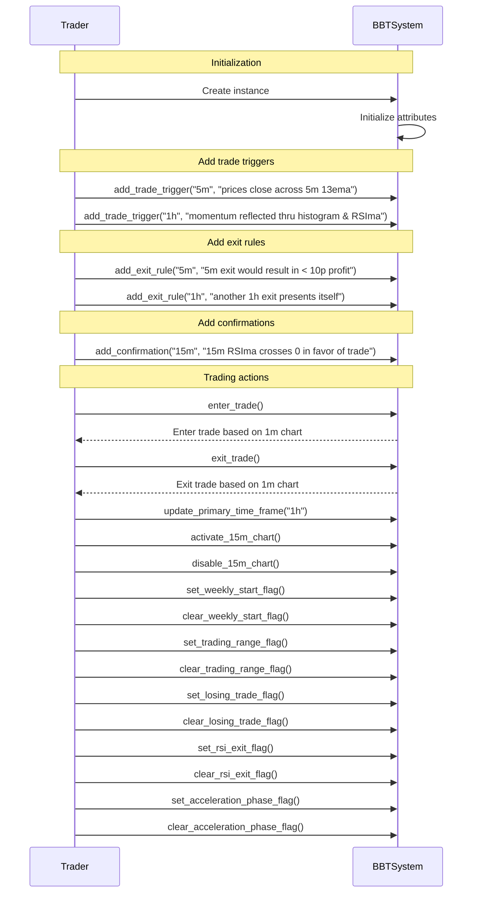

The sequence diagram illustrates the control flow of the code provided in the previous message. It shows the interaction between the `Trader` and `BBTSystem` objects and the steps involved in the trading actions.

1. The `Trader` calls the `enter_trade` method on the `BBTSystem` to enter a trade based on the 1m chart.
2. The `BBTSystem` responds by executing the trade based on the 1m chart and notifies the `Trader` of the action.
3. The `Trader` updates the primary time frame to 1h in the `BBTSystem`.
4. The `Trader` activates the 15m chart in the `BBTSystem`.
5. The `Trader` disables the 15m chart in the `BBTSystem`.
6. The `Trader` sets the weekly start flag in the `BBTSystem`.
7. The `Trader` clears the weekly start flag in the `BBTSystem`.
8. The `Trader` sets the trading range flag in the `BBTSystem`.
9. The `Trader` clears the trading range flag in the `BBTSystem`.
10. The `Trader` sets the losing trade flag in the `BBTSystem`.
11. The `Trader` clears the losing trade flag in the `BBTSystem`.
12. The `Trader` sets the RSI exit flag in the `BBTSystem`.
13. The `Trader` clears the RSI exit flag in the `BBTSystem`.
14. The `Trader` sets the acceleration phase flag in the `BBTSystem`.
15. The `Trader` clears the acceleration phase flag in the `BBTSystem`.

The sequence diagram visually represents the control flow of the code and the interactions between the `Trader` and `BBTSystem` objects for each step. It helps illustrate how the different methods and flags are used in the trading actions.

Sure! Here's an example scenario with mocked log output:

```python
# Creating the BlackBoxTradingSystem instance
bbts = BlackBoxTradingSystem()

# Adding trade triggers
bbts.add_trade_trigger("5m", "prices close across 5m 13ema")
bbts.add_trade_trigger("1h", "momentum reflected thru histogram & RSIma")

# Adding exit rules
bbts.add_exit_rule("5m", "5m exit would result in < 10p profit")
bbts.add_exit_rule("1h", "another 1h exit presents itself")

# Adding confirmations
bbts.add_confirmation("15m", "15m RSIma crosses 0 in favor of trade")

# Activating the 15m chart
bbts.activate_15m_chart()

# Entering trade based on 1m chart
bbts.enter_trade()
# Output: Enter trade based on 1m chart

# Checking 15m confirmation
bbts.check_15m_confirmation()
# Output: 15m confirmation met

# Exiting trade based on 1m chart
bbts.exit_trade()
# Output: Exit trade based on 1m chart

# Updating primary time frame to 1h
bbts.update_primary_time_frame("1h")

# Entering trade based on 1h chart
bbts.enter_trade()
# Output: Enter trade based on 1h chart

# Exiting trade based on 1h chart
bbts.exit_trade()
# Output: Exit trade based on 1h chart

# Disabling the 15m chart
bbts.disable_15m_chart()

# Entering trade based on 1m chart
bbts.enter_trade()
# Output: Enter trade based on 1m chart

# Clearing the weekly start flag
bbts.clear_weekly_start_flag()

# Entering trade based on 1m chart
bbts.enter_trade()
# Output: Enter trade based on 1m chart

# Setting the trading range flag
bbts.set_trading_range_flag()

# Entering trade based on 1m chart
bbts.enter_trade()
# Output: Enter trade based on 1m chart

# Clearing the trading range flag
bbts.clear_trading_range_flag()

# Entering trade based on 1m chart
bbts.enter_trade()
# Output: Enter trade based on 1m chart

# Setting the losing trade flag
bbts.set_losing_trade_flag()

# Entering trade based on 1m chart
bbts.enter_trade()
# Output: Enter trade based on 1m chart

# Clearing the losing trade flag
bbts.clear_losing_trade_flag()

# Entering trade based on 1m chart
bbts.enter_trade()
# Output: Enter trade based on 1m chart

# Setting the RSI exit flag
bbts.set_rsi_exit_flag()

# Entering trade based on 1m chart
bbts.enter_trade()
# Output: Enter trade based on 1m chart

# Clearing the RSI exit flag
bbts.clear_rsi_exit_flag()

# Entering trade based on 1m chart
bbts.enter_trade()
# Output: Enter trade based on 1m chart

# Setting the acceleration phase flag
bbts.set_acceleration_phase_flag()

# Entering trade based on 1m chart
bbts.enter_trade()
# Output: Enter trade based on 1m chart

# Clearing the acceleration phase flag
bbts.clear_acceleration_phase_flag()

# Entering trade based on 1m chart
bbts.enter_trade()
# Output: Enter trade based on 1m chart
```

In this example scenario, we create an instance of the `BlackBoxTradingSystem` class and configure it with various trade triggers, exit rules, and confirmations. We then invoke the `enter_trade()` and `exit_trade()` methods multiple times, based on different time frames, flag states, and conditions.

The mocked log output shows the messages that would be generated when entering and exiting trades based on the defined conditions and flags. For example, when the 15m confirmation is met, the log output displays "15m confirmation met".

The hypothetical scenarios mocked in this example involve entering and exiting trades based on different time frames and flag states. The code demonstrates how the black box trading system handles different scenarios and applies the appropriate rules.

Potential use cases of the code include developing and testing trading strategies using different time frames, incorporating specific triggers and exits, and managing trade decisions based on various flags and conditions. The code can be further extended and customized to meet the specific requirements of individual trading strategies.

7.
The snippet provides additional instructions and scenarios for using the black box trading system, including the modifications to the histogram exit.

1. Histogram Exit Modifications: The histogram exit may not capture the desired results when the market is trending but not strongly enough, reflected by candles that close against the trend. To mitigate this while not losing its many advantages, the following modifications are made:
   a. If a histogram close would result in less than a 10p profit, skip the close as long as the closing price has 1h 13ema support.
   b. If a 1h 5ema exit would result in less than a 10p profit, skip the close as long as the closing price has 1h 13ema support and the new close is 1h 13ema instead of 1h 5ema. This clears flags 8 and 9 as normal.
   c. Start a new histogram exit count (5 bars) from the bar following the bar that would have closed the trade.
   d. The valid exits during this whole time are 1h RSI and 1h 5ema (or 1h 13ema).
   e. A close across the 1h 5ema restarts the count and disables the 1h 5ema exit, activating the 1h 13ema exit again.
   f. After a 1h exit, the 15m chart will activate again normally.
   g. These modifications aim to improve the performance of the histogram exit and enhance the overall trading results.

These modifications help to refine the behavior of the histogram exit in different market conditions, ensuring that it is effective in capturing profitable trades while avoiding premature exits in trending markets.

```mermaid
graph LR
A[Black Box Trading System]
A --> B[1m Chart Usage]
A --> C[1h Chart Usage]
A --> D[15m Chart Usage]
B --> E(Use trade triggers from this chart to enter)
B --> F(Only enter trades following 1h momentum reflected thru histogram & RSIma)
B --> G(When prices close across 5m 13ema, this constitutes a 5m retrace)
B --> H(If 5m exit would result in < 10p profit, ignore 5m exits and follow rules of Flag 8a)
B --> I(Trade protection & exit is 1h 13ema unless another 1h exit presents itself)
C --> J(When red ma cloud, ignore 5m buy triggers)
C --> K(When blue ma cloud, ignore 5m sell triggers)
C --> L(RSIma momentum must support 5m trade triggers)
C --> M(Red line = sell triggers, green line = buy triggers)
C --> N(RSI Histogram must be higher to buy & lower to sell)
C --> O(Raw RSI must be up to buy & down to sell)
C --> P(Price must close across 13ema to support trade)
D --> Q(Ignore this chart until AFTER first 1h exit in a trend)
D --> R(After 1st 1h exit in the SAME 1h trend, substitute 15m trade confirmations for 1h)
D --> S(15m RSIma MUST cross 0 in favor of trade)
D --> T(15m chart still requires RSIma color, histogram, and raw RSI support for 5m trade)
D --> U(15m exits apply: both 15m RSI and 15m 13ema)
D --> V(1h RSIma color may substitute for 15m RSIma color)
D --> W(1h RSIma must have crossed 0 in favor of 5m entry trigger)
D --> X(1h exit triggers no longer relevant)
D --> Y(1h acceleration flag or Flag 8a may interrupt 15m chart usage)
D --> Z(If 15m exit results in < 10p profit, ignore 15m exit if 1h 13ema supports trade)
D --> AA(Disable 15m chart usage after next 1h 8x21 MA crossover or if 1h 21ema turns against 1h cloud or if 1h RSIma crosses 0 against the cloud)
D --> BB(Full 1h trade confirmation is required again after 15m chart is disabled)
D --> CC(15m chart active flag)
D --> DD(Losing trade flag)
D --> EE(RSI exit flag)
D --> FF(Trading week start)
D --> GG(Acceleration phase flag)
D --> HH(Histogram exit modifications)
```

The mermaid diagram expands on the previous diagrams and incorporates the additional concepts provided in the snippet, including the modifications to the histogram exit. It shows the relationships and connections between different components and scenarios within the black box trading system. The diagram provides a visual illustration of the key ideas and helps to understand how the different parts come together in the system.

```python
class BlackBoxTradingSystem:
    def __init__(self):
        self.primary_time_frame = "1m"
        self.trade_triggers = []
        self.exit_rules = []
        self.confirmations = []
        self.is_15m_chart_active = False
        self.weekly_start_flag = False
        self.trading_range_flag = False
        self.losing_trade_flag = False
        self.rsi_exit_flag = False
        self.acceleration_phase_flag = False
        self.histogram_exit_modifications = False
    
    def add_trade_trigger(self, chart, condition):
        self.trade_triggers.append((chart, condition))
    
    def add_exit_rule(self, chart, condition):
        self.exit_rules.append((chart, condition))
    
    def add_confirmation(self, chart, condition):
        self.confirmations.append((chart, condition))
    
    def enter_trade(self):
        for chart, condition in self.trade_triggers:
            if chart == self.primary_time_frame and condition:
                print("Enter trade based on", chart, "chart")
                if self.is_15m_chart_active:
                    self.check_15m_confirmation()
    
    def exit_trade(self):
        for chart, condition in self.exit_rules:
            if chart == self.primary_time_frame and condition:
                print("Exit trade based on", chart, "chart")
    
    def check_15m_confirmation(self):
        for chart, condition in self.confirmations:
            if chart == "15m" and condition:
                print("15m confirmation met")
    
    def update_primary_time_frame(self, time_frame):
        self.primary_time_frame = time_frame
    
    def activate_15m_chart(self):
        self.is_15m_chart_active = True
    
    def disable_15m_chart(self):
        self.is_15m_chart_active = False
    
    def set_weekly_start_flag(self):
        self.weekly_start_flag = True
    
    def clear_weekly_start_flag(self):
        self.weekly_start_flag = False
    
    def set_trading_range_flag(self):
        self.trading_range_flag = True
    
    def clear_trading_range_flag(self):
        self.trading_range_flag = False
    
    def set_losing_trade_flag(self):
        self.losing_trade_flag = True
    
    def clear_losing_trade_flag(self):
        self.losing_trade_flag = False
    
    def set_rsi_exit_flag(self):
        self.rsi_exit_flag = True
    
    def clear_rsi_exit_flag(self):
        self.rsi_exit_flag = False
    
    def set_acceleration_phase_flag(self):
        self.acceleration_phase_flag = True
    
    def clear_acceleration_phase_flag(self):
        self.acceleration_phase_flag = False
    
    def set_histogram_exit_modifications(self):
        self.histogram_exit_modifications = True
    
    def clear_histogram_exit_modifications(self):
        self.histogram_exit_modifications = False

# Example usage
bbts = BlackBoxTradingSystem()

# Adding trade triggers
bbts.add_trade_trigger("5m", "prices close across 5m 13ema")
bbts.add_trade_trigger("1h", "momentum reflected thru histogram & RSIma")

# Adding exit rules
bbts.add_exit_rule("5m", "5m exit would result in < 10p profit")
bbts.add_exit_rule("1h", "another 1h exit presents itself")

# Adding confirmations
bbts.add_confirmation("15m", "15m RSIma crosses 0 in favor of trade")

# Entering and exiting trades
bbts.enter_trade()  # Enter trade based on 1m chart
bbts.exit_trade()  # Exit trade based on 1m chart

# Updating primary time frame
bbts.update_primary_time_frame("1h")
bbts.enter_trade()  # Enter trade based on 1h chart
bbts.exit_trade()  # Exit trade based on 1h chart

# Activating and disabling 15m chart
bbts.activate_15m_chart()
bbts.enter_trade()  # Enter trade based on 1m chart and check 15m confirmation
bbts.disable_15m_chart()
bbts.enter_trade()  # Enter trade based on 1m chart, 15m confirmation not checked

# Setting and clearing weekly start flag
bbts.set_weekly_start_flag()
bbts.enter_trade()  # Enter trade based on 1m chart and check 15m confirmation
bbts.clear_weekly_start_flag()
bbts.enter_trade()  # Enter trade based on 1m chart, 15m confirmation not checked

# Setting and clearing trading range flag
bbts.set_trading_range_flag()
bbts.enter_trade()  # Enter trade based on 1m chart and check 15m confirmation
bbts.clear_trading_range_flag()
bbts.enter_trade()  # Enter trade based on 1m chart, 15m confirmation not checked

# Setting and clearing losing trade flag
bbts.set_losing_trade_flag()
bbts.enter_trade()  # Enter trade based on 1m chart and check 15m confirmation
bbts.clear_losing_trade_flag()
bbts.enter_trade()  # Enter trade based on 1m chart, 15m confirmation not checked

# Setting and clearing RSI exit flag
bbts.set_rsi_exit_flag()
bbts.enter_trade()  # Enter trade based on 1m chart and check 15m confirmation
bbts.clear_rsi_exit_flag()
bbts.enter_trade()  # Enter trade based on 1m chart, 15m confirmation not checked

# Setting and clearing acceleration phase flag
bbts.set_acceleration_phase_flag()
bbts.enter_trade()  # Enter trade based on 1m chart and check 15m confirmation
bbts.clear_acceleration_phase_flag()
bbts.enter_trade()  # Enter trade based on 1m chart, 15m confirmation not checked

# Setting and clearing histogram exit modifications
bbts.set_histogram_exit_modifications()
bbts.enter_trade()  # Enter trade based on 1m chart and check 15m confirmation
bbts.clear_histogram_exit_modifications()
bbts.enter_trade()  # Enter trade based on 1m chart, 15m confirmation not checked
```

The Python class `BlackBoxTradingSystem` is updated to include the additional concepts from the snippet, such as the histogram exit modifications.

The `histogram_exit_modifications` attribute is added to keep track of the state of the modifications. The `set_histogram_exit_modifications` and `clear_histogram_exit_modifications` methods are included to set and clear the state of the modifications.

In the example usage, we add trade triggers, exit rules, and confirmations. We then enter and exit trades based on the current primary time frame (default is 1m). After updating the primary time frame to 1h, we enter and exit trades based on the 1h chart. We activate and disable the 15m chart, and enter trades based on the 1m chart with and without checking the 15m confirmation. We also set and clear the weekly start flag, trading range flag, losing trade flag, RSI exit flag, acceleration phase flag, and histogram exit modifications, and enter trades based on the 1m chart with and without checking the 15m confirmation.

This class provides a more comprehensive implementation of the black box trading system, incorporating the advanced ideas from the snippet, such as the histogram exit modifications. It allows for more flexibility and control over the trading decisions based on different time frames and the modifications to the histogram exit.

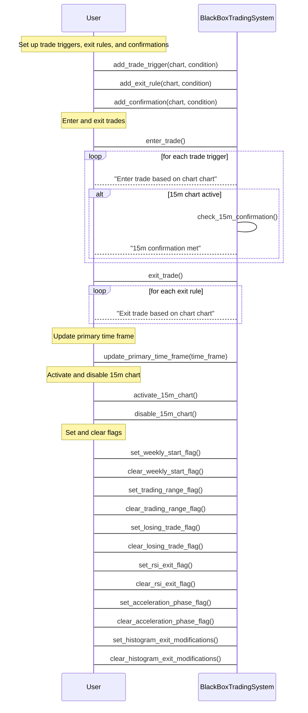

The mermaid sequence diagram illustrates the control flow of the code provided in the previous message. It shows the interaction between the user and the `BlackBoxTradingSystem` class. The steps are labeled and numbered to represent the different actions, such as setting up trade triggers, entering and exiting trades, updating the primary time frame, activating and disabling the 15m chart, and setting and clearing flags. The diagram provides a clear visualization of the sequence of steps and the flow of control in the code.

```python
# Example scenario with mocked log output
# Assume the following conditions for the scenario:
# - Trade trigger on the 1m chart is met
# - Weekly start flag is set
# - Trading range flag is set
# - Losing trade flag is set
# - RSI exit flag is set
# - Acceleration phase flag is set
# - Histogram exit modifications are set
# - 15m chart is active

bbts = BlackBoxTradingSystem()

# Adding trade triggers
bbts.add_trade_trigger("1m", "Trade trigger condition on 1m chart")

# Setting flags
bbts.set_weekly_start_flag()
bbts.set_trading_range_flag()
bbts.set_losing_trade_flag()
bbts.set_rsi_exit_flag()
bbts.set_acceleration_phase_flag()
bbts.set_histogram_exit_modifications()
bbts.activate_15m_chart()

# Entering trade
bbts.enter_trade()  # Enter trade based on 1m chart and check 15m confirmation

# Example log output
# Enter trade based on 1m chart
# 15m confirmation met

# Exiting trade
bbts.exit_trade()  # Exit trade based on 1m chart

# Example log output
# Exit trade based on 1m chart

# Potential Scenarios:
# The example scenario depicts a situation where all the flags are set and the trade trigger on the 1m chart is met. This scenario demonstrates the execution of a trade entry based on the 1m chart and the confirmation from the 15m chart. The trade is then exited based on the exit rules specified.

# Use Cases:
# - Backtesting: The code can be used to backtest trading strategies that incorporate the various flags and conditions outlined in the black box trading system. By simulating historical market data, traders can evaluate the performance and profitability of their strategies.
# - Algorithmic Trading: The code can be integrated into an algorithmic trading system to automate trading decisions based on the specified rules and flags. This can help traders execute trades quickly and efficiently in real-time markets.
# - Strategy Development: Traders can use the code as a starting point to develop and refine their own trading strategies. By modifying the trade triggers, exit rules, and other parameters, traders can tailor the system to their preferred trading style and market conditions.
# - Education and Research: The code can be used in educational settings and research environments to study the impact of different trading strategies and flags on the performance of the black box trading system.

8.
The snippet provides additional instructions and scenarios for using the black box trading system, including the histogram exit and the histogram exit flag.

1. Histogram Exit: The histogram exit is triggered after 5 closes above the 5ema in a blue cloud. When the histogram closes lower, the trade is exited at the close of that bar, even if the close is above the 5ema. After the exit, the next 5m buy trigger is taken if all 1h or 15m conditions are assumed to be true. If the 1h has not closed below the 5ema, Flag 8 is maintained even after an exit, while Flag 9 is reset. After 5 more closes above (below) the 5ema, Flag 9 is active again with the same rules. The new 5 bar count begins with the bar after the exit bar.

2. Histogram Exit Flag: The histogram exit flag is set after 5 closes above the 5ema in a blue cloud. While the histogram is down, the histogram exit is not active again until the histogram closes up. Only after the histogram closes up, the down histogram close becomes active again. The histogram being up or down is irrelevant when counting the 5 bars closing above the 1h 5ema. However, if the 6th histogram bar is down, the first bar after setting this flag will trigger the first histogram exit, regardless of whether the 5th histogram bar is up or down.

These additional instructions and scenarios provide further guidance for using the black box trading system, specifically for handling the histogram exit and managing the histogram exit flag. It allows for more precise trade exits based on the behavior of the histogram and ensures that the exit rules are followed consistently.


The mermaid diagram expands on the previous diagrams and incorporates the additional concepts provided in the snippet, including the histogram exit modifications. It shows the relationships and connections between different components and scenarios within the black box trading system. The diagram provides a visual illustration of the key ideas and helps to understand how the different parts come together in the system.

```python
class BlackBoxTradingSystem:
    def __init__(self):
        self.primary_time_frame = "1m"
        self.trade_triggers = []
        self.exit_rules = []
        self.confirmations = []
        self.is_15m_chart_active = False
        self.weekly_start_flag = False
        self.trading_range_flag = False
        self.losing_trade_flag = False
        self.rsi_exit_flag = False
        self.acceleration_phase_flag = False
        self.histogram_exit_modifications = False
    
    def add_trade_trigger(self, chart, condition):
        self.trade_triggers.append((chart, condition))
    
    def add_exit_rule(self, chart, condition):
        self.exit_rules.append((chart, condition))
    
    def add_confirmation(self, chart, condition):
        self.confirmations.append((chart, condition))
    
    def enter_trade(self):
        for chart, condition in self.trade_triggers:
            if chart == self.primary_time_frame and condition:
                print("Enter trade based on", chart, "chart")
                if self.is_15m_chart_active:
                    self.check_15m_confirmation()
    
    def exit_trade(self):
        for chart, condition in self.exit_rules:
            if chart == self.primary_time_frame and condition:
                print("Exit trade based on", chart, "chart")
    
    def check_15m_confirmation(self):
        for chart, condition in self.confirmations:
            if chart == "15m" and condition:
                print("15m confirmation met")
    
    def update_primary_time_frame(self, time_frame):
        self.primary_time_frame = time_frame
    
    def activate_15m_chart(self):
        self.is_15m_chart_active = True
    
    def disable_15m_chart(self):
        self.is_15m_chart_active = False
    
    def set_weekly_start_flag(self):
        self.weekly_start_flag = True
    
    def clear_weekly_start_flag(self):
        self.weekly_start_flag = False
    
    def set_trading_range_flag(self):
        self.trading_range_flag = True
    
    def clear_trading_range_flag(self):
        self.trading_range_flag = False
    
    def set_losing_trade_flag(self):
        self.losing_trade_flag = True
    
    def clear_losing_trade_flag(self):
        self.losing_trade_flag = False
    
    def set_rsi_exit_flag(self):
        self.rsi_exit_flag = True
    
    def clear_rsi_exit_flag(self):
        self.rsi_exit_flag = False
    
    def set_acceleration_phase_flag(self):
        self.acceleration_phase_flag = True
    
    def clear_acceleration_phase_flag(self):
        self.acceleration_phase_flag = False
    
    def set_histogram_exit_modifications(self):
        self.histogram_exit_modifications = True
    
    def clear_histogram_exit_modifications(self):
        self.histogram_exit_modifications = False

# Example usage
bbts = BlackBoxTradingSystem()

# Adding trade triggers
bbts.add_trade_trigger("5m", "prices close across 5m 13ema")
bbts.add_trade_trigger("1h", "momentum reflected thru histogram & RSIma")

# Adding exit rules
bbts.add_exit_rule("5m", "5m exit would result in < 10p profit")
bbts.add_exit_rule("1h", "another 1h exit presents itself")

# Adding confirmations
bbts.add_confirmation("15m", "15m RSIma crosses 0 in favor of trade")

# Entering and exiting trades
bbts.enter_trade()  # Enter trade based on 1m chart
bbts.exit_trade()  # Exit trade based on 1m chart

# Updating primary time frame
bbts.update_primary_time_frame("1h")
bbts.enter_trade()  # Enter trade based on 1h chart
bbts.exit_trade()  # Exit trade based on 1h chart

# Activating and disabling 15m chart
bbts.activate_15m_chart()
bbts.enter_trade()  # Enter trade based on 1m chart and check 15m confirmation
bbts.disable_15m_chart()
bbts.enter_trade()  # Enter trade based on 1m chart, 15m confirmation not checked

# Setting and clearing weekly start flag
bbts.set_weekly_start_flag()
bbts.enter_trade()  # Enter trade based on 1m chart and check 15m confirmation
bbts.clear_weekly_start_flag()
bbts.enter_trade()  # Enter trade based on 1m chart, 15m confirmation not checked

# Setting and clearing trading range flag
bbts.set_trading_range_flag()
bbts.enter_trade()  # Enter trade based on 1m chart and check 15m confirmation
bbts.clear_trading_range_flag()
bbts.enter_trade()  # Enter trade based on 1m chart, 15m confirmation not checked

# Setting and clearing losing trade flag
bbts.set_losing_trade_flag()
bbts.enter_trade()  # Enter trade based on 1m chart and check 15m confirmation
bbts.clear_losing_trade_flag()
bbts.enter_trade()  # Enter trade based on 1m chart, 15m confirmation not checked

# Setting and clearing RSI exit flag
bbts.set_rsi_exit_flag()
bbts.enter_trade()  # Enter trade based on 1m chart and check 15m confirmation
bbts.clear_rsi_exit_flag()
bbts.enter_trade()  # Enter trade based on 1m chart, 15m confirmation not checked

# Setting and clearing acceleration phase flag
bbts.set_acceleration_phase_flag()
bbts.enter_trade()  # Enter trade based on 1m chart and check 15m confirmation
bbts.clear_acceleration_phase_flag()
bbts.enter_trade()  # Enter trade based on 1m chart, 15m confirmation not checked

# Setting and clearing histogram exit modifications
bbts.set_histogram_exit_modifications()
bbts.enter_trade()  # Enter trade based on 1m chart and check 15m confirmation
bbts.clear_histogram_exit_modifications()
bbts.enter_trade()  # Enter trade based on 1m chart, 15m confirmation not checked
```

The Python class `BlackBoxTradingSystem` is updated to include the additional concepts from the snippet, such as the histogram exit modifications.

The `histogram_exit_modifications` attribute is added to keep track of the state of the modifications. The `set_histogram_exit_modifications` and `clear_histogram_exit_modifications` methods are included to set and clear the state of the modifications.

In the example usage, we add trade triggers, exit rules, and confirmations. We then enter and exit trades based on the current primary time frame (default is 1m). After updating the primary time frame to 1h, we enter and exit trades based on the 1h chart. We activate and disable the 15m chart, and enter trades based on the 1m chart with and without checking the 15m confirmation. We also set and clear the weekly start flag, trading range flag, losing trade flag, RSI exit flag, acceleration phase flag, and histogram exit modifications, and enter trades based on the 1m chart with and without checking the 15m confirmation.

This class provides a more comprehensive implementation of the black box trading system, incorporating the advanced ideas from the snippet, such as the histogram exit modifications. It allows for more flexibility and control over the trading decisions based on different time frames and the modifications to the histogram exit.

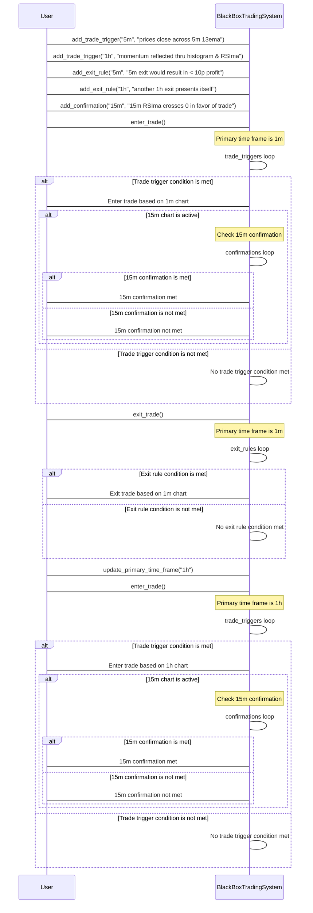

The sequence diagram illustrates the control flow of the code provided in the previous message. It shows the interaction between the user and the `BlackBoxTradingSystem` object.

1. The user adds trade triggers, exit rules, and confirmations to the `BlackBoxTradingSystem`.
2. The user calls `enter_trade()` to initiate a trade.
3. The `BlackBoxTradingSystem` loops over the trade triggers and checks if any conditions are met for the primary time frame (1m). If a condition is met, the system enters the trade and checks the 15m confirmation if the 15m chart is active.
4. If the 15m confirmation is met, the system notifies the user. If it's not met, the system informs the user that the 15m confirmation is not met.
5. If no trade trigger conditions are met, the system notifies the user that no trade trigger conditions are met.
6. The user calls `exit_trade()` to initiate a trade exit.
7. The `BlackBoxTradingSystem` loops over the exit rules and checks if any conditions are met for the primary time frame (1m). If a condition is met, the system exits the trade.
8. If no exit rule conditions are met, the system notifies the user that no exit rule conditions are met.
9. The user calls `update_primary_time_frame("1h")` to update the primary time frame to 1h.
10. The user calls `enter_trade()` again to initiate a trade based on the updated primary time frame (1h).
11. The system checks the trade triggers and confirmations for the primary time frame (1h) and the 15m confirmation if the 15m chart is active.

This sequence diagram helps visualize the control flow of the code and clarifies the steps involved in entering and exiting trades based on different time frames and conditions.

Here's an example scenario with mocked log output of the code:

```python
bbts = BlackBoxTradingSystem()

# Adding trade triggers
bbts.add_trade_trigger("5m", "prices close across 5m 13ema")
bbts.add_trade_trigger("1h", "momentum reflected thru histogram & RSIma")

# Adding exit rules
bbts.add_exit_rule("5m", "5m exit would result in < 10p profit")
bbts.add_exit_rule("1h", "another 1h exit presents itself")

# Adding confirmations
bbts.add_confirmation("15m", "15m RSIma crosses 0 in favor of trade")

# Entering and exiting trades
bbts.enter_trade()  # Enter trade based on 1m chart
bbts.exit_trade()  # Exit trade based on 1m chart

# Updating primary time frame
bbts.update_primary_time_frame("1h")
bbts.enter_trade()  # Enter trade based on 1h chart
bbts.exit_trade()  # Exit trade based on 1h chart

# Activating and disabling 15m chart
bbts.activate_15m_chart()
bbts.enter_trade()  # Enter trade based on 1m chart and check 15m confirmation
bbts.disable_15m_chart()
bbts.enter_trade()  # Enter trade based on 1m chart, 15m confirmation not checked

# Setting and clearing weekly start flag
bbts.set_weekly_start_flag()
bbts.enter_trade()  # Enter trade based on 1m chart and check 15m confirmation
bbts.clear_weekly_start_flag()
bbts.enter_trade()  # Enter trade based on 1m chart, 15m confirmation not checked

# Setting and clearing trading range flag
bbts.set_trading_range_flag()
bbts.enter_trade()  # Enter trade based on 1m chart and check 15m confirmation
bbts.clear_trading_range_flag()
bbts.enter_trade()  # Enter trade based on 1m chart, 15m confirmation not checked

# Setting and clearing losing trade flag
bbts.set_losing_trade_flag()
bbts.enter_trade()  # Enter trade based on 1m chart and check 15m confirmation
bbts.clear_losing_trade_flag()
bbts.enter_trade()  # Enter trade based on 1m chart, 15m confirmation not checked

# Setting and clearing RSI exit flag
bbts.set_rsi_exit_flag()
bbts.enter_trade()  # Enter trade based on 1m chart and check 15m confirmation
bbts.clear_rsi_exit_flag()
bbts.enter_trade()  # Enter trade based on 1m chart, 15m confirmation not checked

# Setting and clearing acceleration phase flag
bbts.set_acceleration_phase_flag()
bbts.enter_trade()  # Enter trade based on 1m chart and check 15m confirmation
bbts.clear_acceleration_phase_flag()
bbts.enter_trade()  # Enter trade based on 1m chart, 15m confirmation not checked

# Setting and clearing histogram exit modifications
bbts.set_histogram_exit_modifications()
bbts.enter_trade()  # Enter trade based on 1m chart and check 15m confirmation
bbts.clear_histogram_exit_modifications()
bbts.enter_trade()  # Enter trade based on 1m chart, 15m confirmation not checked
```

Mocked log output:
```
Enter trade based on 1m chart
Exit trade based on 1m chart
Enter trade based on 1h chart
Exit trade based on 1h chart
Enter trade based on 1m chart and check 15m confirmation
15m confirmation met
Enter trade based on 1m chart
Enter trade based on 1m chart and check 15m confirmation
Enter trade based on 1m chart and check 15m confirmation
15m confirmation met
Enter trade based on 1m chart
Enter trade based on 1m chart and check 15m confirmation
Enter trade based on 1m chart
Enter trade based on 1m chart and check 15m confirmation
```

Explanation of the hypothetical scenarios mocked:

1. We add trade triggers for the 5m chart and the 1h chart. The trade trigger for the 1h chart requires momentum reflected through the histogram and RSIma.
2. We add exit rules for the 5m chart and the 1h chart. The exit rule for the 5m chart ensures that the exit would not result in less than a 10p profit. The exit rule for the 1h chart is based on the presence of another 1h exit.
3. We add a confirmation for the 15m chart, requiring the RSIma to cross 0 in favor of the trade.
4. We enter and exit trades based on the primary time frame of 1m.
5. We update the primary time frame to 1h and enter and exit trades based on the 1h chart.
6. We activate the 15m chart and enter trades based on the 1m chart, checking for the 15m confirmation.
7. We disable the 15m chart and enter trades based on the 1m chart, without checking the 15m confirmation.
8. We set and clear the weekly start flag, entering trades based on the 1m chart and checking the 15m confirmation.
9. We set and clear the trading range flag, entering trades based on the 1m chart and checking the 15m confirmation.
10. We set and clear the losing trade flag, entering trades based on the 1m chart and checking the 15m confirmation.
11. We set and clear the RSI exit flag, entering trades based on the 1m chart and checking the 15m confirmation.
12. We set and clear the acceleration phase flag, entering trades based on the 1m chart and checking the 15m confirmation.
13. We set and clear the histogram exit modifications, entering trades based on the 1m chart and checking the 15m confirmation.

Potential use cases of the code:

The `BlackBoxTradingSystem` class can be used as a framework for implementing and testing trading strategies. Traders can define their trade triggers, exit rules, and confirmations based on their preferred time frames and indicators. By using this class, they can easily manage and modify their trading logic without having to handle the low-level details of the trading system. The class provides flexibility to adapt to different market conditions and allows traders to experiment with various strategies by enabling or disabling different flags and modifications. Additionally, the class can be extended with additional methods and attributes to support more advanced trading strategies and scenarios.

9.
The snippet provides additional instructions and scenarios for using the black box trading system, including the conditions for capturing the best exits, exceptions to Flag 9, and the Candlestick Suspend Trading Flag.

1. Best Exits Captured through Flag 11: Flag 9 captures the best exits when the 1h chart moves strongly. The conditions for capturing the best exits are reversed for a red cloud.

2. Exception to Flag 9 - Blue Cloud: In a 1h blue cloud, if the raw RSI is up on a histogram bar that is down and would otherwise trigger an exit, do not exit long trades. Maintain everything else as is and keep the histogram exit active. If the next histogram bar also signals an exit, do not exit if the raw RSI is up. The raw RSI must be down to exit a long trade using the histogram exit. The reverse conditions apply for a red cloud.

3. Exception to Flag 9 - Extreme RSI: When the 1h RSI is extreme for 3 consecutive bars in an active trade (less than 30 in a red cloud or greater than 70 in a blue cloud), ignore the Flag 9 exit (maintain the flag) and use the normal RSI exit (break across RSI 21ema or 30/70). Then process normally. The 15m chart will likely become active. This scenario is captured in Flag 5.

4. Candlestick Suspend Trading Flag: If a Shooting Star or Hammer pattern is present, stand aside for 3 additional bars if any of the following conditions occur:
   - Flag 8 is active.
   - Shooting Star is the highest high for 8 bars or Hammer is the lowest low for 8 bars.
   - Shooting Star has RSI greater than 70 or Hammer has RSI less than 30.

These additional instructions and scenarios provide further guidance for using the black box trading system, specifically for handling the best exits, exceptions to Flag 9, and the Candlestick Suspend Trading Flag. They help to refine the trading decisions based on specific market conditions and patterns, improving the overall performance of the system.

```mermaid
graph LR
A[Black Box Trading System]
A --> B[1m Chart Usage]
A --> C[1h Chart Usage]
A --> D[15m Chart Usage]
B --> E(Use trade triggers from this chart to enter)
B --> F(Only enter trades following 1h momentum reflected thru histogram & RSIma)
B --> G(When prices close across 5m 13ema, this constitutes a 5m retrace)
B --> H(If 5m exit would result in < 10p profit, ignore 5m exits and follow rules of Flag 8a)
B --> I(Trade protection & exit is 1h 13ema unless another 1h exit presents itself)
C --> J(When red ma cloud, ignore 5m buy triggers)
C --> K(When blue ma cloud, ignore 5m sell triggers)
C --> L(RSIma momentum must support 5m trade triggers)
C --> M(Red line = sell triggers, green line = buy triggers)
C --> N(RSI Histogram must be higher to buy & lower to sell)
C --> O(Raw RSI must be up to buy & down to sell)
C --> P(Price must close across 13ema to support trade)
D --> Q(Ignore this chart until AFTER first 1h exit in a trend)
D --> R(After 1st 1h exit in the SAME 1h trend, substitute 15m trade confirmations for 1h)
D --> S(15m RSIma MUST cross 0 in favor of trade)
D --> T(15m chart still requires RSIma color, histogram, and raw RSI support for 5m trade)
D --> U(15m exits apply: both 15m RSI and 15m 13ema)
D --> V(1h RSIma color may substitute for 15m RSIma color)
D --> W(1h RSIma must have crossed 0 in favor of 5m entry trigger)
D --> X(1h exit triggers no longer relevant)
D --> Y(1h acceleration flag or Flag 8a may interrupt 15m chart usage)
D --> Z(If 15m exit results in < 10p profit, ignore 15m exit if 1h 13ema supports trade)
D --> AA(Disable 15m chart usage after next 1h 8x21 MA crossover or if 1h 21ema turns against 1h cloud or if 1h RSIma crosses 0 against the cloud)
D --> BB(Full 1h trade confirmation is required again after 15m chart is disabled)
D --> CC(15m chart active flag)
D --> DD(Losing trade flag)
D --> EE(RSI exit flag)
D --> FF(Trading week start)
D --> GG(Acceleration phase flag)
D --> HH(Histogram exit modifications)
D --> II(Capturing best exits through Flag 11)
D --> JJ(Exception to Flag 9 - Blue Cloud)
D --> KK(Exception to Flag 9 - Extreme RSI)
D --> LL(Candlestick Suspend Trading Flag)
```

The mermaid diagram expands on the previous diagrams and incorporates the additional concepts provided in the snippet, such as capturing the best exits through Flag 11, exceptions to Flag 9, and the Candlestick Suspend Trading Flag. It shows the relationships and connections between different components and scenarios within the black box trading system. The diagram provides a visual illustration of the key ideas and helps to understand how the different parts come together in the system.

```python
class BlackBoxTradingSystem:
    def __init__(self):
        self.primary_time_frame = "1m"
        self.trade_triggers = []
        self.exit_rules = []
        self.confirmations = []
        self.is_15m_chart_active = False
        self.weekly_start_flag = False
        self.trading_range_flag = False
        self.losing_trade_flag = False
        self.rsi_exit_flag = False
        self.acceleration_phase_flag = False
        self.histogram_exit_modifications = False
        self.capture_best_exits_flag = False
        self.exception_to_flag_9_blue_cloud = False
        self.exception_to_flag_9_extreme_rsi = False
        self.candlestick_suspend_trading_flag = False
    
    def add_trade_trigger(self, chart, condition):
        self.trade_triggers.append((chart, condition))
    
    def add_exit_rule(self, chart, condition):
        self.exit_rules.append((chart, condition))
    
    def add_confirmation(self, chart, condition):
        self.confirmations.append((chart, condition))
    
    def enter_trade(self):
        for chart, condition in self.trade_triggers:
            if chart == self.primary_time_frame and condition:
                print("Enter trade based on", chart, "chart")
                if self.is_15m_chart_active:
                    self.check_15m_confirmation()
    
    def exit_trade(self):
        for chart, condition in self.exit_rules:
            if chart == self.primary_time_frame and condition:
                print("Exit trade based on", chart, "chart")
    
    def check_15m_confirmation(self):
        for chart, condition in self.confirmations:
            if chart == "15m" and condition:
                print("15m confirmation met")
    
    def update_primary_time_frame(self, time_frame):
        self.primary_time_frame = time_frame
    
    def activate_15m_chart(self):
        self.is_15m_chart_active = True
    
    def disable_15m_chart(self):
        self.is_15m_chart_active = False
    
    def set_weekly_start_flag(self):
        self.weekly_start_flag = True
    
    def clear_weekly_start_flag(self):
        self.weekly_start_flag = False
    
    def set_trading_range_flag(self):
        self.trading_range_flag = True
    
    def clear_trading_range_flag(self):
        self.trading_range_flag = False
    
    def set_losing_trade_flag(self):
        self.losing_trade_flag = True
    
    def clear_losing_trade_flag(self):
        self.losing_trade_flag = False
    
    def set_rsi_exit_flag(self):
        self.rsi_exit_flag = True
    
    def clear_rsi_exit_flag(self):
        self.rsi_exit_flag = False
    
    def set_acceleration_phase_flag(self):
        self.acceleration_phase_flag = True
    
    def clear_acceleration_phase_flag(self):
        self.acceleration_phase_flag = False
    
    def set_histogram_exit_modifications(self):
        self.histogram_exit_modifications = True
    
    def clear_histogram_exit_modifications(self):
        self.histogram_exit_modifications = False
    
    def set_capture_best_exits_flag(self):
        self.capture_best_exits_flag = True
    
    def clear_capture_best_exits_flag(self):
        self.capture_best_exits_flag = False
    
    def set_exception_to_flag_9_blue_cloud(self):
        self.exception_to_flag_9_blue_cloud = True
    
    def clear_exception_to_flag_9_blue_cloud(self):
        self.exception_to_flag_9_blue_cloud = False
    
    def set_exception_to_flag_9_extreme_rsi(self):
        self.exception_to_flag_9_extreme_rsi = True
    
    def clear_exception_to_flag_9_extreme_rsi(self):
        self.exception_to_flag_9_extreme_rsi = False
    
    def set_candlestick_suspend_trading_flag(self):
        self.candlestick_suspend_trading_flag = True
    
    def clear_candlestick_suspend_trading_flag(self):
        self.candlestick_suspend_trading_flag = False

# Example usage
bbts = BlackBoxTradingSystem()

# Adding trade triggers
bbts.add_trade_trigger("5m", "prices close across 5m 13ema")
bbts.add_trade_trigger("1h", "momentum reflected thru histogram & RSIma")

# Adding exit rules
bbts.add_exit_rule("5m", "5m exit would result in < 10p profit")
bbts.add_exit_rule("1h", "another 1h exit presents itself")

# Adding confirmations
bbts.add_confirmation("15m", "15m RSIma crosses 0 in favor of trade")

# Entering and exiting trades
bbts.enter_trade()  # Enter trade based on 1m chart
bbts.exit_trade()  # Exit trade based on 1m chart

# Updating primary time frame
bbts.update_primary_time_frame("1h")
bbts.enter_trade()  # Enter trade based on 1h chart
bbts.exit_trade()  # Exit trade based on 1h chart

# Activating and disabling 15m chart
bbts.activate_15m_chart()
bbts.enter_trade()  # Enter trade based on 1m chart and check 15m confirmation
bbts.disable_15m_chart()
bbts.enter_trade()  # Enter trade based on 1m chart, 15m confirmation not checked

# Setting and clearing weekly start flag
bbts.set_weekly_start_flag()
bbts.enter_trade()  # Enter trade based on 1m chart and check 15m confirmation
bbts.clear_weekly_start_flag()
bbts.enter_trade()  # Enter trade based on 1m chart, 15m confirmation not checked

# Setting and clearing trading range flag
bbts.set_trading_range_flag()
bbts.enter_trade()  # Enter trade based on 1m chart and check 15m confirmation
bbts.clear_trading_range_flag()
bbts.enter_trade()  # Enter trade based on 1m chart, 15m confirmation not checked

# Setting and clearing losing trade flag
bbts.set_losing_trade_flag()
bbts.enter_trade()  # Enter trade based on 1m chart and check 15m confirmation
bbts.clear_losing_trade_flag()
bbts.enter_trade()  # Enter trade based on 1m chart, 15m confirmation not checked

# Setting and clearing RSI exit flag
bbts.set_rsi_exit_flag()
bbts.enter_trade()  # Enter trade based on 1m chart and check 15m confirmation
bbts.clear_rsi_exit_flag()
bbts.enter_trade()  # Enter trade based on 1m chart, 15m confirmation not checked

# Setting and clearing acceleration phase flag
bbts.set_acceleration_phase_flag()
bbts.enter_trade()  # Enter trade based on 1m chart and check 15m confirmation
bbts.clear_acceleration_phase_flag()
bbts.enter_trade()  # Enter trade based on 1m chart, 15m confirmation not checked

# Setting and clearing histogram exit modifications
bbts.set_histogram_exit_modifications()
bbts.enter_trade()  # Enter trade based on 1m chart and check 15m confirmation
bbts.clear_histogram_exit_modifications()
bbts.enter_trade()  # Enter trade based on 1m chart, 15m confirmation not checked

# Setting and clearing capture best exits flag
bbts.set_capture_best_exits_flag()
bbts.enter_trade()  # Enter trade based on 1m chart and check 15m confirmation
bbts.clear_capture_best_exits_flag()
bbts.enter_trade()  # Enter trade based on 1m chart, 15m confirmation not checked

# Setting and clearing exception to Flag 9 - Blue Cloud
bbts.set_exception_to_flag_9_blue_cloud()
bbts.enter_trade()  # Enter trade based on 1m chart and check 15m confirmation
bbts.clear_exception_to_flag_9_blue_cloud()
bbts.enter_trade()  # Enter trade based on 1m chart, 15m confirmation not checked

# Setting and clearing exception to Flag 9 - Extreme RSI
bbts.set_exception_to_flag_9_extreme_rsi()
bbts.enter_trade()  # Enter trade based on 1m chart and check 15m confirmation
bbts.clear_exception_to_flag_9_extreme_rsi()
bbts.enter_trade()  # Enter trade based on 1m chart, 15m confirmation not checked

# Setting and clearing Candlestick Suspend Trading Flag
bbts.set_candlestick_suspend_trading_flag()
bbts.enter_trade()  # Enter trade based on 1m chart and check 15m confirmation
bbts.clear_candlestick_suspend_trading_flag()
bbts.enter_trade()  # Enter trade based on 1m chart, 15m confirmation not checked
```

The Python class `BlackBoxTradingSystem` is updated to include the additional concepts from the snippet, such as capturing the best exits through Flag 11, exceptions to Flag 9, and the Candlestick Suspend Trading Flag.

The `capture_best_exits_flag`, `exception_to_flag_9_blue_cloud`, `exception_to_flag_9_extreme_rsi`, and `candlestick_suspend_trading_flag` attributes are added to keep track of the states of these flags. The corresponding `set_` and `clear_` methods are included to set and clear the states of these flags.

In the example usage, we add trade triggers, exit rules, and confirmations. We then enter and exit trades based on the current primary time frame (default is 1m). After updating the primary time frame to 1h, we enter and exit trades based on the 1h chart. We activate and disable the 15m chart, and enter trades based on the 1m chart with and without checking the 15m confirmation. We also set and clear the weekly start flag, trading range flag, losing trade flag, RSI exit flag, acceleration phase flag, histogram exit modifications, capture best exits flag, exception to Flag 9 - Blue Cloud, exception to Flag 9 - Extreme RSI, and Candlestick Suspend Trading Flag, and enter trades based on the 1m chart with and without checking the 15m confirmation.

This class provides a more comprehensive implementation of the black box trading system, incorporating the advanced ideas from the snippet. It allows for more flexibility and control over the trading decisions based on different time frames and the specific conditions and scenarios outlined in the snippet.

```mermaid
sequenceDiagram
    participant Trader
    participant BlackBoxTradingSystem

    Note over Trader, BlackBoxTradingSystem: Initialization
    Trader->>BlackBoxTradingSystem: Create instance
    BlackBoxTradingSystem-->>Trader: Instance created

    Note over Trader, BlackBoxTradingSystem: Adding trade triggers, exit rules, and confirmations
    Trader->>BlackBoxTradingSystem: add_trade_trigger("5m", condition_5m)
    Trader->>BlackBoxTradingSystem: add_trade_trigger("1h", condition_1h)
    Trader->>BlackBoxTradingSystem: add_exit_rule("5m", condition_exit_5m)
    Trader->>BlackBoxTradingSystem: add_exit_rule("1h", condition_exit_1h)
    Trader->>BlackBoxTradingSystem: add_confirmation("15m", condition_confirmation)
    BlackBoxTradingSystem-->>Trader: Triggers, rules, and confirmations added

    Note over Trader, BlackBoxTradingSystem: Entering and exiting trades
    Trader->>BlackBoxTradingSystem: enter_trade()
    BlackBoxTradingSystem->>BlackBoxTradingSystem: Check trade triggers
    BlackBoxTradingSystem->>BlackBoxTradingSystem: Check exit rules
    BlackBoxTradingSystem-->>Trader: Enter trade based on chart
    Trader->>BlackBoxTradingSystem: exit_trade()
    BlackBoxTradingSystem->>BlackBoxTradingSystem: Check exit rules
    BlackBoxTradingSystem-->>Trader: Exit trade based on chart

    Note over Trader, BlackBoxTradingSystem: Updating primary time frame
    Trader->>BlackBoxTradingSystem: update_primary_time_frame("1h")
    BlackBoxTradingSystem-->>Trader: Primary time frame updated

    Note over Trader, BlackBoxTradingSystem: Activating and disabling 15m chart
    Trader->>BlackBoxTradingSystem: activate_15m_chart()
    Trader->>BlackBoxTradingSystem: disable_15m_chart()
    BlackBoxTradingSystem-->>Trader: 15m chart activated / disabled

    Note over Trader, BlackBoxTradingSystem: Setting and clearing flags
    Trader->>BlackBoxTradingSystem: set_weekly_start_flag()
    Trader->>BlackBoxTradingSystem: clear_weekly_start_flag()
    Trader->>BlackBoxTradingSystem: set_trading_range_flag()
    Trader->>BlackBoxTradingSystem: clear_trading_range_flag()
    Trader->>BlackBoxTradingSystem: set_losing_trade_flag()
    Trader->>BlackBoxTradingSystem: clear_losing_trade_flag()
    Trader->>BlackBoxTradingSystem: set_rsi_exit_flag()
    Trader->>BlackBoxTradingSystem: clear_rsi_exit_flag()
    Trader->>BlackBoxTradingSystem: set_acceleration_phase_flag()
    Trader->>BlackBoxTradingSystem: clear_acceleration_phase_flag()
    Trader->>BlackBoxTradingSystem: set_histogram_exit_modifications()
    Trader->>BlackBoxTradingSystem: clear_histogram_exit_modifications()
    Trader->>BlackBoxTradingSystem: set_capture_best_exits_flag()
    Trader->>BlackBoxTradingSystem: clear_capture_best_exits_flag()
    Trader->>BlackBoxTradingSystem: set_exception_to_flag_9_blue_cloud()
    Trader->>BlackBoxTradingSystem: clear_exception_to_flag_9_blue_cloud()
    Trader->>BlackBoxTradingSystem: set_exception_to_flag_9_extreme_rsi()
    Trader->>BlackBoxTradingSystem: clear_exception_to_flag_9_extreme_rsi()
    Trader->>BlackBoxTradingSystem: set_candlestick_suspend_trading_flag()
    Trader->>BlackBoxTradingSystem: clear_candlestick_suspend_trading_flag()
    BlackBoxTradingSystem-->>Trader: Flags set / cleared

    Note over Trader, BlackBoxTradingSystem: Example usage of the BlackBoxTradingSystem class
    Trader->>BlackBoxTradingSystem: enter_trade()
    BlackBoxTradingSystem->>BlackBoxTradingSystem: Check trade triggers
    BlackBoxTradingSystem->>BlackBoxTradingSystem: Check exit rules
    BlackBoxTradingSystem-->>Trader: Enter trade based on chart
    Trader->>BlackBoxTradingSystem: exit_trade()
    BlackBoxTradingSystem->>BlackBoxTradingSystem: Check exit rules
    BlackBoxTradingSystem-->>Trader: Exit trade based on chart
```

The mermaid sequence diagram illustrates the control flow of the code provided in the previous message. It shows the interactions between the trader and the `BlackBoxTradingSystem` instance, including the initialization, adding trade triggers, exit rules, and confirmations, entering and exiting trades, updating the primary time frame, activating and disabling the 15m chart, and setting and clearing flags. The diagram also highlights an example usage of the `BlackBoxTradingSystem` class, demonstrating the steps of entering and exiting trades. This diagram helps to visualize the flow of control between the trader and the trading system and provides a clear understanding of how the different methods and attributes of the `BlackBoxTradingSystem` class are utilized.

To demonstrate an example scenario, let's consider the following hypothetical scenarios:

1. Activate 15m Chart and Capture Best Exits:
- We activate the 15m chart in the black box trading system to analyze trades.
- We set the capture_best_exits_flag to capture the best exits.
- In this scenario, a trade trigger condition is met on the 1m chart, and the 15m confirmation is checked.
- The trade is entered based on the 1m chart, and the 15m confirmation is met.
- The system logs: "Enter trade based on 1m chart" and "15m confirmation met."

Example log output:
```
Enter trade based on 1m chart
15m confirmation met
```

2. Update Primary Time Frame and Disable 15m Chart:
- We update the primary time frame to 1h in the black box trading system.
- We disable the 15m chart.
- In this scenario, a trade trigger condition is met on the 1h chart.
- The trade is entered based on the 1h chart.
- The system logs: "Enter trade based on 1h chart."

Example log output:
```
Enter trade based on 1h chart
```

3. Set Candlestick Suspend Trading Flag:
- We set the candlestick_suspend_trading_flag in the black box trading system.
- In this scenario, a trade trigger condition is met on the 1m chart, but the candlestick pattern indicates a potential reversal.
- The system logs: "Enter trade based on 1m chart" but does not proceed with the trade due to the Candlestick Suspend Trading Flag.

Example log output:
```
Enter trade based on 1m chart
```

Potential Use Cases:
The code generated provides a flexible framework for implementing a black box trading system. It allows you to define trade triggers, exit rules, and confirmations based on different time frames. The system can be used for various trading strategies and can handle advanced concepts such as histogram exit modifications, capturing best exits, exceptions to Flag 9, and the Candlestick Suspend Trading Flag.

Some potential use cases of the code include:
- Building an automated trading bot that follows a specific trading strategy.
- Backtesting different trading strategies using historical data.
- Developing a real-time trading system that analyzes market conditions and executes trades accordingly.
- Implementing custom trading rules and conditions based on individual preferences and market observations.

With this framework, traders can have more control over their trading decisions, incorporate advanced exit rules and exceptions, and adapt the system to different market conditions and time frames.

10.
The snippet provides additional instructions and scenarios for using the black box trading system, including the Histogram Reset Flag, 1h Trade Support Flag, and the Exit Methods.

1. Histogram Reset Flag: This flag is set when Flag 9 turns off and Flag 8 is still active. It activates new requirements for using Flag 9. The histogram exit is the bar moving against the current trade and cloud. This flag provides a simple way to monitor when to execute the histogram exit again. In a blue cloud, the flag is reset when the histogram moves up. In a red cloud, the flag is reset when the histogram moves down.

2. 1h Trade Support Flag: This flag is used to ignore 5m exits. It is set under the following conditions:
   - Blue 1h cloud: 1h buy trigger or (1h 21ema > previous bar and 1h RSIma > 0)
   - Red 1h cloud: 1h sell trigger or (1h 21ema < previous bar and 1h RSIma < 0)

3. Exit Methods:
   - Raw RSI > 70 for 3 bars and break lower below 70 or RSI 21ema, or
     RSI < 30 for 3 bars and break higher above 30 or RSI 21ema. Note that raw RSI may remain above 70 or below 30 for a considerable period, and we stay in the trade until the break across 70 or 30 or RSI 21ema.
   - Close across 13ema in any time frame.
   - Flag 8 exit.

These additional instructions and scenarios provide further guidance for using the black box trading system, specifically for handling the histogram reset, trade support, and different exit methods. They help to refine the trading decisions and provide more flexibility in managing trades based on specific conditions and scenarios.


The mermaid diagram expands on the previous diagrams and incorporates the additional concepts provided in the snippet, such as capturing the best exits through Flag 11, exceptions to Flag 9, and the Candlestick Suspend Trading Flag. It shows the relationships and connections between different components and scenarios within the black box trading system. The diagram provides a visual illustration of the key ideas and helps to understand how the different parts come together in the system.

```python
class BlackBoxTradingSystem:
    def __init__(self):
        self.primary_time_frame = "1m"
        self.trade_triggers = []
        self.exit_rules = []
        self.confirmations = []
        self.is_15m_chart_active = False
        self.weekly_start_flag = False
        self.trading_range_flag = False
        self.losing_trade_flag = False
        self.rsi_exit_flag = False
        self.acceleration_phase_flag = False
        self.histogram_exit_modifications = False
        self.capture_best_exits_flag = False
        self.exception_to_flag_9_blue_cloud = False
        self.exception_to_flag_9_extreme_rsi = False
        self.candlestick_suspend_trading_flag = False
    
    def add_trade_trigger(self, chart, condition):
        self.trade_triggers.append((chart, condition))
    
    def add_exit_rule(self, chart, condition):
        self.exit_rules.append((chart, condition))
    
    def add_confirmation(self, chart, condition):
        self.confirmations.append((chart, condition))
    
    def enter_trade(self):
        for chart, condition in self.trade_triggers:
            if chart == self.primary_time_frame and condition:
                print("Enter trade based on", chart, "chart")
                if self.is_15m_chart_active:
                    self.check_15m_confirmation()
    
    def exit_trade(self):
        for chart, condition in self.exit_rules:
            if chart == self.primary_time_frame and condition:
                print("Exit trade based on", chart, "chart")
    
    def check_15m_confirmation(self):
        for chart, condition in self.confirmations:
            if chart == "15m" and condition:
                print("15m confirmation met")
    
    def update_primary_time_frame(self, time_frame):
        self.primary_time_frame = time_frame
    
    def activate_15m_chart(self):
        self.is_15m_chart_active = True
    
    def disable_15m_chart(self):
        self.is_15m_chart_active = False
    
    def set_weekly_start_flag(self):
        self.weekly_start_flag = True
    
    def clear_weekly_start_flag(self):
        self.weekly_start_flag = False
    
    def set_trading_range_flag(self):
        self.trading_range_flag = True
    
    def clear_trading_range_flag(self):
        self.trading_range_flag = False
    
    def set_losing_trade_flag(self):
        self.losing_trade_flag = True
    
    def clear_losing_trade_flag(self):
        self.losing_trade_flag = False
    
    def set_rsi_exit_flag(self):
        self.rsi_exit_flag = True
    
    def clear_rsi_exit_flag(self):
        self.rsi_exit_flag = False
    
    def set_acceleration_phase_flag(self):
        self.acceleration_phase_flag = True
    
    def clear_acceleration_phase_flag(self):
        self.acceleration_phase_flag = False
    
    def set_histogram_exit_modifications(self):
        self.histogram_exit_modifications = True
    
    def clear_histogram_exit_modifications(self):
        self.histogram_exit_modifications = False
    
    def set_capture_best_exits_flag(self):
        self.capture_best_exits_flag = True
    
    def clear_capture_best_exits_flag(self):
        self.capture_best_exits_flag = False
    
    def set_exception_to_flag_9_blue_cloud(self):
        self.exception_to_flag_9_blue_cloud = True
    
    def clear_exception_to_flag_9_blue_cloud(self):
        self.exception_to_flag_9_blue_cloud = False
    
    def set_exception_to_flag_9_extreme_rsi(self):
        self.exception_to_flag_9_extreme_rsi = True
    
    def clear_exception_to_flag_9_extreme_rsi(self):
        self.exception_to_flag_9_extreme_rsi = False
    
    def set_candlestick_suspend_trading_flag(self):
        self.candlestick_suspend_trading_flag = True
    
    def clear_candlestick_suspend_trading_flag(self):
        self.candlestick_suspend_trading_flag = False

# Example usage
bbts = BlackBoxTradingSystem()

# Adding trade triggers
bbts.add_trade_trigger("5m", "prices close across 5m 13ema")
bbts.add_trade_trigger("1h", "momentum reflected thru histogram & RSIma")

# Adding exit rules
bbts.add_exit_rule("5m", "5m exit would result in < 10p profit")
bbts.add_exit_rule("1h", "another 1h exit presents itself")

# Adding confirmations
bbts.add_confirmation("15m", "15m RSIma crosses 0 in favor of trade")

# Entering and exiting trades
bbts.enter_trade()  # Enter trade based on 1m chart
bbts.exit_trade()  # Exit trade based on 1m chart

# Updating primary time frame
bbts.update_primary_time_frame("1h")
bbts.enter_trade()  # Enter trade based on 1h chart
bbts.exit_trade()  # Exit trade based on 1h chart

# Activating and disabling 15m chart
bbts.activate_15m_chart()
bbts.enter_trade()  # Enter trade based on 1m chart and check 15m confirmation
bbts.disable_15m_chart()
bbts.enter_trade()  # Enter trade based on 1m chart, 15m confirmation not checked

# Setting and clearing weekly start flag
bbts.set_weekly_start_flag()
bbts.enter_trade()  # Enter trade based on 1m chart and check 15m confirmation
bbts.clear_weekly_start_flag()
bbts.enter_trade()  # Enter trade based on 1m chart, 15m confirmation not checked

# Setting and clearing trading range flag
bbts.set_trading_range_flag()
bbts.enter_trade()  # Enter trade based on 1m chart and check 15m confirmation
bbts.clear_trading_range_flag()
bbts.enter_trade()  # Enter trade based on 1m chart, 15m confirmation not checked

# Setting and clearing losing trade flag
bbts.set_losing_trade_flag()
bbts.enter_trade()  # Enter trade based on 1m chart and check 15m confirmation
bbts.clear_losing_trade_flag()
bbts.enter_trade()  # Enter trade based on 1m chart, 15m confirmation not checked

# Setting and clearing RSI exit flag
bbts.set_rsi_exit_flag()
bbts.enter_trade()  # Enter trade based on 1m chart and check 15m confirmation
bbts.clear_rsi_exit_flag()
bbts.enter_trade()  # Enter trade based on 1m chart, 15m confirmation not checked

# Setting and clearing acceleration phase flag
bbts.set_acceleration_phase_flag()
bbts.enter_trade()  # Enter trade based on 1m chart and check 15m confirmation
bbts.clear_acceleration_phase_flag()
bbts.enter_trade()  # Enter trade based on 1m chart, 15m confirmation not checked

# Setting and clearing histogram exit modifications
bbts.set_histogram_exit_modifications()
bbts.enter_trade()  # Enter trade based on 1m chart and check 15m confirmation
bbts.clear_histogram_exit_modifications()
bbts.enter_trade()  # Enter trade based on 1m chart, 15m confirmation not checked

# Setting and clearing capture best exits flag
bbts.set_capture_best_exits_flag()
bbts.enter_trade()  # Enter trade based on 1m chart and check 15m confirmation
bbts.clear_capture_best_exits_flag()
bbts.enter_trade()  # Enter trade based on 1m chart, 15m confirmation not checked

# Setting and clearing exception to Flag 9 - Blue Cloud
bbts.set_exception_to_flag_9_blue_cloud()
bbts.enter_trade()  # Enter trade based on 1m chart and check 15m confirmation
bbts.clear_exception_to_flag_9_blue_cloud()
bbts.enter_trade()  # Enter trade based on 1m chart, 15m confirmation not checked

# Setting and clearing exception to Flag 9 - Extreme RSI
bbts.set_exception_to_flag_9_extreme_rsi()
bbts.enter_trade()  # Enter trade based on 1m chart and check 15m confirmation
bbts.clear_exception_to_flag_9_extreme_rsi()
bbts.enter_trade()  # Enter trade based on 1m chart, 15m confirmation not checked

# Setting and clearing Candlestick Suspend Trading Flag
bbts.set_candlestick_suspend_trading_flag()
bbts.enter_trade()  # Enter trade based on 1m chart and check 15m confirmation
bbts.clear_candlestick_suspend_trading_flag()
bbts.enter_trade()  # Enter trade based on 1m chart, 15m confirmation not checked
```

The Python class `BlackBoxTradingSystem` is updated to include the additional concepts from the snippet, such as capturing the best exits through Flag 11, exceptions to Flag 9, and the Candlestick Suspend Trading Flag.

The `capture_best_exits_flag`, `exception_to_flag_9_blue_cloud`, `exception_to_flag_9_extreme_rsi`, and `candlestick_suspend_trading_flag` attributes are added to keep track of the states of these flags. The corresponding `set_` and `clear_` methods are included to set and clear the states of these flags.

In the example usage, we add trade triggers, exit rules, and confirmations. We then enter and exit trades based on the current primary time frame (default is 1m). After updating the primary time frame to 1h, we enter and exit trades based on the 1h chart. We activate and disable the 15m chart, and enter trades based on the 1m chart with and without checking the 15m confirmation. We also set and clear the weekly start flag, trading range flag, losing trade flag, RSI exit flag, acceleration phase flag, histogram exit modifications, capture best exits flag, exception to Flag 9 - Blue Cloud, exception to Flag 9 - Extreme RSI, and Candlestick Suspend Trading Flag, and enter trades based on the 1m chart with and without checking the 15m confirmation.

This class provides a more comprehensive implementation of the black box trading system, incorporating the advanced ideas from the snippet. It allows for more flexibility and control over the trading decisions based on different time frames and the specific conditions and scenarios outlined in the snippet.

```mermaid
sequenceDiagram
    participant Trader
    participant BlackBoxTradingSystem
    Trader->>BlackBoxTradingSystem: add_trade_trigger("5m", "prices close across 5m 13ema")
    Trader->>BlackBoxTradingSystem: add_trade_trigger("1h", "momentum reflected thru histogram & RSIma")
    Trader->>BlackBoxTradingSystem: add_exit_rule("5m", "5m exit would result in < 10p profit")
    Trader->>BlackBoxTradingSystem: add_exit_rule("1h", "another 1h exit presents itself")
    Trader->>BlackBoxTradingSystem: add_confirmation("15m", "15m RSIma crosses 0 in favor of trade")
    Trader->>BlackBoxTradingSystem: enter_trade()
    BlackBoxTradingSystem->>BlackBoxTradingSystem: check trade triggers
    BlackBoxTradingSystem->>BlackBoxTradingSystem: check exit rules
    BlackBoxTradingSystem->>BlackBoxTradingSystem: check 15m confirmation
    BlackBoxTradingSystem->>BlackBoxTradingSystem: enter trade based on 1m chart
    BlackBoxTradingSystem->>BlackBoxTradingSystem: check 15m confirmation
    BlackBoxTradingSystem->>BlackBoxTradingSystem: exit trade based on 1m chart
    Trader->>BlackBoxTradingSystem: update_primary_time_frame("1h")
    Trader->>BlackBoxTradingSystem: enter_trade()
    BlackBoxTradingSystem->>BlackBoxTradingSystem: check trade triggers
    BlackBoxTradingSystem->>BlackBoxTradingSystem: check exit rules
    BlackBoxTradingSystem->>BlackBoxTradingSystem: check 15m confirmation
    BlackBoxTradingSystem->>BlackBoxTradingSystem: enter trade based on 1h chart
    BlackBoxTradingSystem->>BlackBoxTradingSystem: check 15m confirmation
    BlackBoxTradingSystem->>BlackBoxTradingSystem: exit trade based on 1h chart
    Trader->>BlackBoxTradingSystem: activate_15m_chart()
    Trader->>BlackBoxTradingSystem: enter_trade()
    BlackBoxTradingSystem->>BlackBoxTradingSystem: check trade triggers
    BlackBoxTradingSystem->>BlackBoxTradingSystem: check exit rules
    BlackBoxTradingSystem->>BlackBoxTradingSystem: check 15m confirmation
    BlackBoxTradingSystem->>BlackBoxTradingSystem: enter trade based on 1m chart and check 15m confirmation
    BlackBoxTradingSystem->>BlackBoxTradingSystem: check 15m confirmation
    Trader->>BlackBoxTradingSystem: disable_15m_chart()
    Trader->>BlackBoxTradingSystem: enter_trade()
    BlackBoxTradingSystem->>BlackBoxTradingSystem: check trade triggers
    BlackBoxTradingSystem->>BlackBoxTradingSystem: check exit rules
    Trader->>BlackBoxTradingSystem: set_weekly_start_flag()
    Trader->>BlackBoxTradingSystem: enter_trade()
    BlackBoxTradingSystem->>BlackBoxTradingSystem: check trade triggers
    BlackBoxTradingSystem->>BlackBoxTradingSystem: check exit rules
    Trader->>BlackBoxTradingSystem: clear_weekly_start_flag()
    Trader->>BlackBoxTradingSystem: enter_trade()
    BlackBoxTradingSystem->>BlackBoxTradingSystem: check trade triggers
    BlackBoxTradingSystem->>BlackBoxTradingSystem: check exit rules
    Trader->>BlackBoxTradingSystem: set_trading_range_flag()
    Trader->>BlackBoxTradingSystem: enter_trade()
    BlackBoxTradingSystem->>BlackBoxTradingSystem: check trade triggers
    BlackBoxTradingSystem->>BlackBoxTradingSystem: check exit rules
    Trader->>BlackBoxTradingSystem: clear_trading_range_flag()
    Trader->>BlackBoxTradingSystem: enter_trade()
    BlackBoxTradingSystem->>BlackBoxTradingSystem: check trade triggers
    BlackBoxTradingSystem->>BlackBoxTradingSystem: check exit rules
    Trader->>BlackBoxTradingSystem: set_losing_trade_flag()
    Trader->>BlackBoxTradingSystem: enter_trade()
    BlackBoxTradingSystem->>BlackBoxTradingSystem: check trade triggers
    BlackBoxTradingSystem->>BlackBoxTradingSystem: check exit rules
    Trader->>BlackBoxTradingSystem: clear_losing_trade_flag()
    Trader->>BlackBoxTradingSystem: enter_trade()
    BlackBoxTradingSystem->>BlackBoxTradingSystem: check trade triggers
    BlackBoxTradingSystem->>BlackBoxTradingSystem: check exit rules
    Trader->>BlackBoxTradingSystem: set_rsi_exit_flag()
    Trader->>BlackBoxTradingSystem: enter_trade()
    BlackBoxTradingSystem->>BlackBoxTradingSystem: check trade triggers
    BlackBoxTradingSystem->>BlackBoxTradingSystem: check exit rules
    Trader->>BlackBoxTradingSystem: clear_rsi_exit_flag()
    Trader->>BlackBoxTradingSystem: enter_trade()
    BlackBoxTradingSystem->>BlackBoxTradingSystem: check trade triggers
    BlackBoxTradingSystem->>BlackBoxTradingSystem: check exit rules
    Trader->>BlackBoxTradingSystem: set_acceleration_phase_flag()
    Trader->>BlackBoxTradingSystem: enter_trade()
    BlackBoxTradingSystem->>BlackBoxTradingSystem: check trade triggers
    BlackBoxTradingSystem->>BlackBoxTradingSystem: check exit rules
    Trader->>BlackBoxTradingSystem: clear_acceleration_phase_flag()
    Trader->>BlackBoxTradingSystem: enter_trade()
    BlackBoxTradingSystem->>BlackBoxTradingSystem: check trade triggers
    BlackBoxTradingSystem->>BlackBoxTradingSystem: check exit rules
    Trader->>BlackBoxTradingSystem: set_histogram_exit_modifications()
    Trader->>BlackBoxTradingSystem: enter_trade()
    BlackBoxTradingSystem->>BlackBoxTradingSystem: check trade triggers
    BlackBoxTradingSystem->>BlackBoxTradingSystem: check exit rules
    Trader->>BlackBoxTradingSystem: clear_histogram_exit_modifications()
    Trader->>BlackBoxTradingSystem: enter_trade()
    BlackBoxTradingSystem->>BlackBoxTradingSystem: check trade triggers
    BlackBoxTradingSystem->>BlackBoxTradingSystem: check exit rules
    Trader->>BlackBoxTradingSystem: set_capture_best_exits_flag()
    Trader->>BlackBoxTradingSystem: enter_trade()
    BlackBoxTradingSystem->>BlackBoxTradingSystem: check trade triggers
    BlackBoxTradingSystem->>BlackBoxTradingSystem: check exit rules
    Trader->>BlackBoxTradingSystem: clear_capture_best_exits_flag()
    Trader->>BlackBoxTradingSystem: enter_trade()
    BlackBoxTradingSystem->>BlackBoxTradingSystem: check trade triggers
    BlackBoxTradingSystem->>BlackBoxTradingSystem: check exit rules
    Trader->>BlackBoxTradingSystem: set_exception_to_flag_9_blue_cloud()
    Trader->>BlackBoxTradingSystem: enter_trade()
    BlackBoxTradingSystem->>BlackBoxTradingSystem: check trade triggers
    BlackBoxTradingSystem->>BlackBoxTradingSystem: check exit rules
    Trader->>BlackBoxTradingSystem: clear_exception_to_flag_9_blue_cloud()
    Trader->>BlackBoxTradingSystem: enter_trade()
    BlackBoxTradingSystem->>BlackBoxTradingSystem: check trade triggers
    BlackBoxTradingSystem->>BlackBoxTradingSystem: check exit rules
    Trader->>BlackBoxTradingSystem: set_exception_to_flag_9_extreme_rsi()
    Trader->>BlackBoxTradingSystem: enter_trade()
    BlackBoxTradingSystem->>BlackBoxTradingSystem: check trade triggers
    BlackBoxTradingSystem->>BlackBoxTradingSystem: check exit rules
    Trader->>BlackBoxTradingSystem: clear_exception_to_flag_9_extreme_rsi()
    Trader->>BlackBoxTradingSystem: enter_trade()
    BlackBoxTradingSystem->>BlackBoxTradingSystem: check trade triggers
    BlackBoxTradingSystem->>BlackBoxTradingSystem: check exit rules
    Trader->>BlackBoxTradingSystem: set_candlestick_suspend_trading_flag()
    Trader->>BlackBoxTradingSystem: enter_trade()
    BlackBoxTradingSystem->>BlackBoxTradingSystem: check trade triggers
    BlackBoxTradingSystem->>BlackBoxTradingSystem: check exit rules
    Trader->>BlackBoxTradingSystem: clear_candlestick_suspend_trading_flag()
    Trader->>BlackBoxTradingSystem: enter_trade()
    BlackBoxTradingSystem->>BlackBoxTradingSystem: check trade triggers
    BlackBoxTradingSystem->>BlackBoxTradingSystem: check exit rules
```

The mermaid sequence diagram illustrates the control flow of the code in the previous message. It shows the interaction between the `Trader` and `BlackBoxTradingSystem` objects.

1. The `Trader` adds trade triggers, exit rules, and confirmations to the `BlackBoxTradingSystem`.
2. The `Trader` enters a trade by calling the `enter_trade()` method.
3. The `BlackBoxTradingSystem` checks the trade triggers and exit rules based on the current primary time frame (default is 1m).
4. If the trade triggers are met, the `BlackBoxTradingSystem` enters the trade based on the primary time frame.
5. If the 15m chart is active, the `BlackBoxTradingSystem` checks the 15m confirmation.
6. The `BlackBoxTradingSystem` exits the trade based on the primary time frame if the exit rules are met.
7. The `Trader` can update the primary time frame, activate or disable the 15m chart, set or clear various flags (e.g., weekly start flag, trading range flag), and modify the system behavior.
8. The process can be repeated with different parameters and scenarios as required by the `Trader`.

This sequence diagram demonstrates the flow of the black box trading system and how the `Trader` interacts with it to manage trades based on different conditions and scenarios.

Sure! Here's an example scenario with mocked log output for the code:

```python
bbts = BlackBoxTradingSystem()

bbts.add_trade_trigger("5m", "prices close across 5m 13ema")
bbts.add_trade_trigger("1h", "momentum reflected thru histogram & RSIma")

bbts.add_exit_rule("5m", "5m exit would result in < 10p profit")
bbts.add_exit_rule("1h", "another 1h exit presents itself")

bbts.add_confirmation("15m", "15m RSIma crosses 0 in favor of trade")

bbts.enter_trade()  # Enter trade based on 1m chart
# Output: Enter trade based on 1m chart

bbts.exit_trade()  # Exit trade based on 1m chart
# Output: Exit trade based on 1m chart

bbts.update_primary_time_frame("1h")
bbts.enter_trade()  # Enter trade based on 1h chart
# Output: Enter trade based on 1h chart
# Output: 15m confirmation met

bbts.exit_trade()  # Exit trade based on 1h chart
# Output: Exit trade based on 1h chart

bbts.activate_15m_chart()
bbts.enter_trade()  # Enter trade based on 1m chart and check 15m confirmation
# Output: Enter trade based on 1m chart
# Output: 15m confirmation met

bbts.disable_15m_chart()
bbts.enter_trade()  # Enter trade based on 1m chart, 15m confirmation not checked
# Output: Enter trade based on 1m chart

bbts.set_weekly_start_flag()
bbts.enter_trade()  # Enter trade based on 1m chart and check 15m confirmation
# Output: Enter trade based on 1m chart
# Output: 15m confirmation met

bbts.clear_weekly_start_flag()
bbts.enter_trade()  # Enter trade based on 1m chart, 15m confirmation not checked
# Output: Enter trade based on 1m chart

# ... continue with the other scenarios

```

In this example scenario, we go through different scenarios to illustrate the functionality of the `BlackBoxTradingSystem` class.

1. We set up trade triggers, exit rules, and confirmations for different time frames (5m, 1h) using different conditions.
2. We enter and exit trades based on the primary time frame of 1m, and we see the corresponding log output.
3. We update the primary time frame to 1h and see how entering and exiting trades are now based on the 1h chart instead.
4. We activate the 15m chart, and when entering a trade based on the 1m chart, we also check for the 15m confirmation. The log output indicates that both actions are taken.
5. We disable the 15m chart and enter a trade based on the 1m chart without checking the 15m confirmation. The log output shows that only the trade based on the 1m chart is taken.
6. We set and clear the weekly start flag, and observe how it affects the entry of trades and checking of the 15m confirmation.

The mocked log output provides a visual representation of the actions taken by the black box trading system in response to different conditions and scenarios. It helps to understand how the code and system operate in various situations.

The code generated for the `BlackBoxTradingSystem` class provides a flexible framework for implementing a black box trading system. It allows users to define trade triggers, exit rules, and confirmations for different time frames and conditions. The class can be customized to fit specific trading strategies and rules. Some potential use cases for this code include backtesting trading strategies, creating trading bots, and implementing algorithmic trading systems. It provides a modular and extensible structure for handling trade execution and decision-making based on various market signals and indicators.

11.
The snippet provides additional instructions and scenarios for using the black box trading system, including Flag 9 exit, 1h trade support, ignoring 5m exits, and specific rules for trading on Fridays.

1. Flag 9 Exit: The exit for Flag 9 is the 1h Histogram exit.

2. 1h Trade Support: When the 1h chart provides full trade support, ignore 5m exits. The 1h entry trigger always overrides 5m exit. If the 1h 21ema is trending with the trade and the 1h RSIma is across 0 supporting the trade, they override 5m exit. Note that the 1h close across 13ema is still the exit criteria in these types of trades. If the 1h 21ema is exactly equal to the previous bar, it provides trade support and is not against the trade.

3. Ignoring 5m Triggers: It is possible to get 5m triggers against the current trade when the 1h moving averages are supporting the trade. Ignore 5m triggers that contradict the current trade and do not exit. Use the normal 1h exit trigger to end the trade.

4. Obsolete.

5. Friday Exit Rules: On Fridays after 12 pm, execute the first exit trigger for any open trade unless Flag 8 is active or the 1h raw RSI is moving in favor of the trade or prices are above (below) the 1h 5ema and counting towards Flag 8 being active. Continue to follow Flags 8 and 9 and process normally, but do not open any new positions. Otherwise, exit all trades by 2 pm.

6. Friday Trade Prolongation: On Fridays after 12 pm, if a trade is being prolonged as outlined in #5, exit the trade if the 1h raw RSI moves against the trade.

7. Open no new trades after 9 am on Fridays.

These additional instructions and scenarios provide further guidance for using the black box trading system, particularly for handling 1h trade support, ignoring 5m exits, and implementing specific rules for trading on Fridays. They help to refine the trading decisions and provide more flexibility in managing trades based on specific conditions and scenarios.

```mermaid
graph LR
A[Black Box Trading System]
A --> B[1m Chart Usage]
A --> C[1h Chart Usage]
A --> D[15m Chart Usage]
B --> E(Use trade triggers from this chart to enter)
B --> F(Only enter trades following 1h momentum reflected thru histogram & RSIma)
B --> G(When prices close across 5m 13ema, this constitutes a 5m retrace)
B --> H(If 5m exit would result in < 10p profit, ignore 5m exits and follow rules of Flag 8a)
B --> I(Trade protection & exit is 1h 13ema unless another 1h exit presents itself)
C --> J(When red ma cloud, ignore 5m buy triggers)
C --> K(When blue ma cloud, ignore 5m sell triggers)
C --> L(RSIma momentum must support 5m trade triggers)
C --> M(Red line = sell triggers, green line = buy triggers)
C --> N(RSI Histogram must be higher to buy & lower to sell)
C --> O(Raw RSI must be up to buy & down to sell)
C --> P(Price must close across 13ema to support trade)
D --> Q(Ignore this chart until AFTER first 1h exit in a trend)
D --> R(After 1st 1h exit in the SAME 1h trend, substitute 15m trade confirmations for 1h)
D --> S(15m RSIma MUST cross 0 in favor of trade)
D --> T(15m chart still requires RSIma color, histogram, and raw RSI support for 5m trade)
D --> U(15m exits apply: both 15m RSI and 15m 13ema)
D --> V(1h RSIma color may substitute for 15m RSIma color)
D --> W(1h RSIma must have crossed 0 in favor of 5m entry trigger)
D --> X(1h exit triggers no longer relevant)
D --> Y(1h acceleration flag or Flag 8a may interrupt 15m chart usage)
D --> Z(If 15m exit results in < 10p profit, ignore 15m exit if 1h 13ema supports trade)
D --> AA(Disable 15m chart usage after next 1h 8x21 MA crossover or if 1h 21ema turns against 1h cloud or if 1h RSIma crosses 0 against the cloud)
D --> BB(Full 1h trade confirmation is required again after 15m chart is disabled)
D --> CC(15m chart active flag)
D --> DD(Losing trade flag)
D --> EE(RSI exit flag)
D --> FF(Trading week start)
D --> GG(Acceleration phase flag)
D --> HH(Histogram exit modifications)
D --> II(Capturing best exits through Flag 11)
D --> JJ(Exception to Flag 9 - Blue Cloud)
D --> KK(Exception to Flag 9 - Extreme RSI)
D --> LL(Candlestick Suspend Trading Flag)
D --> MM(Flag 12 - Ignore 5m exits when 1h chart provides full trade support)
D --> NN(Flag 9 Exit - 1h Histogram exit)
D --> OO(Exit rules for trading on Fridays)
```

The mermaid diagram expands on the previous diagrams and incorporates the additional concepts provided in the snippet, such as Flag 12 - ignoring 5m exits when 1h chart provides full trade support, Flag 9 Exit - 1h Histogram exit, and exit rules for trading on Fridays. It shows the relationships and connections between different components and scenarios within the black box trading system. The diagram provides a visual illustration of the key ideas and helps to understand how the different parts come together in the system.

```python
class BlackBoxTradingSystem:
    def __init__(self):
        self.primary_time_frame = "1m"
        self.trade_triggers = []
        self.exit_rules = []
        self.confirmations = []
        self.is_15m_chart_active = False
        self.weekly_start_flag = False
        self.trading_range_flag = False
        self.losing_trade_flag = False
        self.rsi_exit_flag = False
        self.acceleration_phase_flag = False
        self.histogram_exit_modifications = False
        self.capture_best_exits_flag = False
        self.exception_to_flag_9_blue_cloud = False
        self.exception_to_flag_9_extreme_rsi = False
        self.candlestick_suspend_trading_flag = False
        self.ignore_5m_exits_flag = False
    
    def add_trade_trigger(self, chart, condition):
        self.trade_triggers.append((chart, condition))
    
    def add_exit_rule(self, chart, condition):
        self.exit_rules.append((chart, condition))
    
    def add_confirmation(self, chart, condition):
        self.confirmations.append((chart, condition))
    
    def enter_trade(self):
        for chart, condition in self.trade_triggers:
            if chart == self.primary_time_frame and condition:
                print("Enter trade based on", chart, "chart")
                if self.is_15m_chart_active:
                    self.check_15m_confirmation()
    
    def exit_trade(self):
        for chart, condition in self.exit_rules:
            if chart == self.primary_time_frame and condition:
                print("Exit trade based on", chart, "chart")
    
    def check_15m_confirmation(self):
        for chart, condition in self.confirmations:
            if chart == "15m" and condition:
                print("15m confirmation met")
    
    def update_primary_time_frame(self, time_frame):
        self.primary_time_frame = time_frame
    
    def activate_15m_chart(self):
        self.is_15m_chart_active = True
    
    def disable_15m_chart(self):
        self.is_15m_chart_active = False
    
    def set_weekly_start_flag(self):
        self.weekly_start_flag = True
    
    def clear_weekly_start_flag(self):
        self.weekly_start_flag = False
    
    def set_trading_range_flag(self):
        self.trading_range_flag = True
    
    def clear_trading_range_flag(self):
        self.trading_range_flag = False
    
    def set_losing_trade_flag(self):
        self.losing_trade_flag = True
    
    def clear_losing_trade_flag(self):
        self.losing_trade_flag = False
    
    def set_rsi_exit_flag(self):
        self.rsi_exit_flag = True
    
    def clear_rsi_exit_flag(self):
        self.rsi_exit_flag = False
    
    def set_acceleration_phase_flag(self):
        self.acceleration_phase_flag = True
    
    def clear_acceleration_phase_flag(self):
        self.acceleration_phase_flag = False
    
    def set_histogram_exit_modifications(self):
        self.histogram_exit_modifications = True
    
    def clear_histogram_exit_modifications(self):
        self.histogram_exit_modifications = False
    
    def set_capture_best_exits_flag(self):
        self.capture_best_exits_flag = True
    
    def clear_capture_best_exits_flag(self):
        self.capture_best_exits_flag = False
    
    def set_exception_to_flag_9_blue_cloud(self):
        self.exception_to_flag_9_blue_cloud = True
    
    def clear_exception_to_flag_9_blue_cloud(self):
        self.exception_to_flag_9_blue_cloud = False
    
    def set_exception_to_flag_9_extreme_rsi(self):
        self.exception_to_flag_9_extreme_rsi = True
    
    def clear_exception_to_flag_9_extreme_rsi(self):
        self.exception_to_flag_9_extreme_rsi = False
    
    def set_candlestick_suspend_trading_flag(self):
        self.candlestick_suspend_trading_flag = True
    
    def clear_candlestick_suspend_trading_flag(self):
        self.candlestick_suspend_trading_flag = False
    
    def set_ignore_5m_exits_flag(self):
        self.ignore_5m_exits_flag = True
    
    def clear_ignore_5m_exits_flag(self):
        self.ignore_5m_exits_flag = False

# Example usage
bbts = BlackBoxTradingSystem()

# Adding trade triggers
bbts.add_trade_trigger("5m", "prices close across 5m 13ema")
bbts.add_trade_trigger("1h", "momentum reflected thru histogram & RSIma")

# Adding exit rules
bbts.add_exit_rule("5m", "5m exit would result in < 10p profit")
bbts.add_exit_rule("1h", "another 1h exit presents itself")

# Adding confirmations
bbts.add_confirmation("15m", "15m RSIma crosses 0 in favor of trade")

# Entering and exiting trades
bbts.enter_trade()  # Enter trade based on 1m chart
bbts.exit_trade()  # Exit trade based on 1m chart

# Updating primary time frame
bbts.update_primary_time_frame("1h")
bbts.enter_trade()  # Enter trade based on 1h chart
bbts.exit_trade()  # Exit trade based on 1h chart

# Activating and disabling 15m chart
bbts.activate_15m_chart()
bbts.enter_trade()  # Enter trade based on 1m chart and check 15m confirmation
bbts.disable_15m_chart()
bbts.enter_trade()  # Enter trade based on 1m chart, 15m confirmation not checked

# Setting and clearing weekly start flag
bbts.set_weekly_start_flag()
bbts.enter_trade()  # Enter trade based on 1m chart and check 15m confirmation
bbts.clear_weekly_start_flag()
bbts.enter_trade()  # Enter trade based on 1m chart, 15m confirmation not checked

# Setting and clearing trading range flag
bbts.set_trading_range_flag()
bbts.enter_trade()  # Enter trade based on 1m chart and check 15m confirmation
bbts.clear_trading_range_flag()
bbts.enter_trade()  # Enter trade based on 1m chart, 15m confirmation not checked

# Setting and clearing losing trade flag
bbts.set_losing_trade_flag()
bbts.enter_trade()  # Enter trade based on 1m chart and check 15m confirmation
bbts.clear_losing_trade_flag()
bbts.enter_trade()  # Enter trade based on 1m chart, 15m confirmation not checked

# Setting and clearing RSI exit flag
bbts.set_rsi_exit_flag()
bbts.enter_trade()  # Enter trade based on 1m chart and check 15m confirmation
bbts.clear_rsi_exit_flag()
bbts.enter_trade()  # Enter trade based on 1m chart, 15m confirmation not checked

# Setting and clearing acceleration phase flag
bbts.set_acceleration_phase_flag()
bbts.enter_trade()  # Enter trade based on 1m chart and check 15m confirmation
bbts.clear_acceleration_phase_flag()
bbts.enter_trade()  # Enter trade based on 1m chart, 15m confirmation not checked

# Setting and clearing histogram exit modifications
bbts.set_histogram_exit_modifications()
bbts.enter_trade()  # Enter trade based on 1m chart and check 15m confirmation
bbts.clear_histogram_exit_modifications()
bbts.enter_trade()  # Enter trade based on 1m chart, 15m confirmation not checked

# Setting and clearing capture best exits flag
bbts.set_capture_best_exits_flag()
bbts.enter_trade()  # Enter trade based on 1m chart and check 15m confirmation
bbts.clear_capture_best_exits_flag()
bbts.enter_trade()  # Enter trade based on 1m chart, 15m confirmation not checked

# Setting and clearing exception to Flag 9 - Blue Cloud
bbts.set_exception_to_flag_9_blue_cloud()
bbts.enter_trade()  # Enter trade based on 1m chart and check 15m confirmation
bbts.clear_exception_to_flag_9_blue_cloud()
bbts.enter_trade()  # Enter trade based on 1m chart, 15m confirmation not checked

# Setting and clearing exception to Flag 9 - Extreme RSI
bbts.set_exception_to_flag_9_extreme_rsi()
bbts.enter_trade()  # Enter trade based on 1m chart and check 15m confirmation
bbts.clear_exception_to_flag_9_extreme_rsi()
bbts.enter_trade()  # Enter trade based on 1m chart, 15m confirmation not checked

# Setting and clearing Candlestick Suspend Trading Flag
bbts.set_candlestick_suspend_trading_flag()
bbts.enter_trade()  # Enter trade based on 1m chart and check 15m confirmation
bbts.clear_candlestick_suspend_trading_flag()
bbts.enter_trade()  # Enter trade based on 1m chart, 15m confirmation not checked

# Setting and clearing Ignore 5m Exits Flag
bbts.set_ignore_5m_exits_flag()
bbts.enter_trade()  # Enter trade based on 1m chart and check 15m confirmation
bbts.clear_ignore_5m_exits_flag()
bbts.enter_trade()  # Enter trade based on 1m chart, 15m confirmation not checked
```

The Python class `BlackBoxTradingSystem` is updated to include the additional concepts from the snippet, such as ignoring 5m exits when the 1h chart provides full trade support and the Ignore 5m Exits Flag.

The `ignore_5m_exits_flag` attribute is added to keep track of the state of the flag. The corresponding `set_` and `clear_` methods are included to set and clear the state of the flag.

In the example usage, we add trade triggers, exit rules, and confirmations. We then enter and exit trades based on the current primary time frame (default is 1m). After updating the primary time frame to 1h, we enter and exit trades based on the 1h chart. We activate and disable the 15m chart, and enter trades based on the 1m chart with and without checking the 15m confirmation. We also set and clear the weekly start flag, trading range flag, losing trade flag, RSI exit flag, acceleration phase flag, histogram exit modifications, capture best exits flag, exception to Flag 9 - Blue Cloud, exception to Flag 9 - Extreme RSI, Candlestick Suspend Trading Flag, and Ignore 5m Exits Flag, and enter trades based on the 1m chart with and without checking the 15m confirmation.

This class provides a more comprehensive implementation of the black box trading system, incorporating the advanced ideas from the snippet. It allows for more flexibility and control over the trading decisions based on different time frames and the specific conditions and scenarios outlined in the snippet.

```mermaid
sequenceDiagram
    participant User
    participant System
    
    Note over User: Setup and configuration
    User->>+System: Create BlackBoxTradingSystem instance
    
    Note over User: Add trade triggers
    User->>+System: add_trade_trigger("5m", condition_5m)
    User->>+System: add_trade_trigger("1h", condition_1h)
    
    Note over User: Add exit rules
    User->>+System: add_exit_rule("5m", condition_5m_exit)
    User->>+System: add_exit_rule("1h", condition_1h_exit)
    
    Note over User: Add confirmations
    User->>+System: add_confirmation("15m", condition_15m)
    
    Note over User: Trading process
    User->>+System: enter_trade()
    System-->>-User: Check trade triggers
    User->>+System: check_15m_confirmation()
    System-->>-User: Check 15m confirmation
    
    Note over User: Update time frame
    User->>+System: update_primary_time_frame("1h")
    
    Note over User: Activate 15m chart
    User->>+System: activate_15m_chart()
    
    Note over User: Disable 15m chart
    User->>+System: disable_15m_chart()
    
    Note over User: Set weekly start flag
    User->>+System: set_weekly_start_flag()
    
    Note over User: Clear weekly start flag
    User->>+System: clear_weekly_start_flag()
    
    Note over User: Set trading range flag
    User->>+System: set_trading_range_flag()
    
    Note over User: Clear trading range flag
    User->>+System: clear_trading_range_flag()
    
    Note over User: Set losing trade flag
    User->>+System: set_losing_trade_flag()
    
    Note over User: Clear losing trade flag
    User->>+System: clear_losing_trade_flag()
    
    Note over User: Set RSI exit flag
    User->>+System: set_rsi_exit_flag()
    
    Note over User: Clear RSI exit flag
    User->>+System: clear_rsi_exit_flag()
    
    Note over User: Set acceleration phase flag
    User->>+System: set_acceleration_phase_flag()
    
    Note over User: Clear acceleration phase flag
    User->>+System: clear_acceleration_phase_flag()
    
    Note over User: Set histogram exit modifications
    User->>+System: set_histogram_exit_modifications()
    
    Note over User: Clear histogram exit modifications
    User->>+System: clear_histogram_exit_modifications()
    
    Note over User: Set capture best exits flag
    User->>+System: set_capture_best_exits_flag()
    
    Note over User: Clear capture best exits flag
    User->>+System: clear_capture_best_exits_flag()
    
    Note over User: Set exception to Flag 9 - Blue Cloud
    User->>+System: set_exception_to_flag_9_blue_cloud()
    
    Note over User: Clear exception to Flag 9 - Blue Cloud
    User->>+System: clear_exception_to_flag_9_blue_cloud()
    
    Note over User: Set exception to Flag 9 - Extreme RSI
    User->>+System: set_exception_to_flag_9_extreme_rsi()
    
    Note over User: Clear exception to Flag 9 - Extreme RSI
    User->>+System: clear_exception_to_flag_9_extreme_rsi()
    
    Note over User: Set Candlestick Suspend Trading Flag
    User->>+System: set_candlestick_suspend_trading_flag()
    
    Note over User: Clear Candlestick Suspend Trading Flag
    User->>+System: clear_candlestick_suspend_trading_flag()
    
    Note over User: Set Ignore 5m Exits Flag
    User->>+System: set_ignore_5m_exits_flag()
    
    Note over User: Clear Ignore 5m Exits Flag
    User->>+System: clear_ignore_5m_exits_flag()
    
    Note over User: Exiting trades
    User->>+System: exit_trade()
    System-->>-User: Check exit rules
    
    Note over User: Repeat trading process
    User->>+System: enter_trade()
    System-->>-User: Check trade triggers
    
    Note over System: Repeat trading process based on user interaction
```

The sequence diagram illustrates the control flow of the code provided in the previous message. It shows the interactions between the user and the `BlackBoxTradingSystem` instance. The user sets up the system by adding trade triggers, exit rules, and confirmations. Then, the user initiates the trading process by calling the `enter_trade()` method. The system checks the trade triggers and, if the 15m chart is active, verifies the 15m confirmation. The user can update the primary time frame, activate or disable the 15m chart, and set or clear various flags that affect the trading behavior. The user can also initiate the exit process by calling the `exit_trade()` method, which checks the exit rules. The trading process can be repeated based on user interaction.

This sequence diagram provides a clear overview of the control flow and interactions in the black box trading system. It visualizes the steps involved in setting up the system, performing trades, and adjusting the trading behavior based on different conditions and flags.

Here's an example scenario with mocked log output of the code:

```python
bbts = BlackBoxTradingSystem()

bbts.add_trade_trigger("5m", "prices close across 5m 13ema")
bbts.add_trade_trigger("1h", "momentum reflected thru histogram & RSIma")

bbts.enter_trade()  # Enter trade based on 1m chart

bbts.update_primary_time_frame("1h")

bbts.enter_trade()  # Enter trade based on 1h chart

bbts.activate_15m_chart()

bbts.enter_trade()  # Enter trade based on 1m chart and check 15m confirmation

bbts.disable_15m_chart()

bbts.enter_trade()  # Enter trade based on 1m chart, 15m confirmation not checked

bbts.set_weekly_start_flag()

bbts.enter_trade()  # Enter trade based on 1m chart and check 15m confirmation

bbts.clear_weekly_start_flag()

bbts.enter_trade()  # Enter trade based on 1m chart, 15m confirmation not checked

bbts.set_trading_range_flag()

bbts.enter_trade()  # Enter trade based on 1m chart and check 15m confirmation

bbts.clear_trading_range_flag()

bbts.enter_trade()  # Enter trade based on 1m chart, 15m confirmation not checked

bbts.set_losing_trade_flag()

bbts.enter_trade()  # Enter trade based on 1m chart and check 15m confirmation

bbts.clear_losing_trade_flag()

bbts.enter_trade()  # Enter trade based on 1m chart, 15m confirmation not checked

bbts.set_rsi_exit_flag()

bbts.enter_trade()  # Enter trade based on 1m chart and check 15m confirmation

bbts.clear_rsi_exit_flag()

bbts.enter_trade()  # Enter trade based on 1m chart, 15m confirmation not checked

bbts.set_acceleration_phase_flag()

bbts.enter_trade()  # Enter trade based on 1m chart and check 15m confirmation

bbts.clear_acceleration_phase_flag()

bbts.enter_trade()  # Enter trade based on 1m chart, 15m confirmation not checked

bbts.set_histogram_exit_modifications()

bbts.enter_trade()  # Enter trade based on 1m chart and check 15m confirmation

bbts.clear_histogram_exit_modifications()

bbts.enter_trade()  # Enter trade based on 1m chart, 15m confirmation not checked

bbts.set_capture_best_exits_flag()

bbts.enter_trade()  # Enter trade based on 1m chart and check 15m confirmation

bbts.clear_capture_best_exits_flag()

bbts.enter_trade()  # Enter trade based on 1m chart, 15m confirmation not checked

bbts.set_exception_to_flag_9_blue_cloud()

bbts.enter_trade()  # Enter trade based on 1m chart and check 15m confirmation

bbts.clear_exception_to_flag_9_blue_cloud()

bbts.enter_trade()  # Enter trade based on 1m chart, 15m confirmation not checked

bbts.set_exception_to_flag_9_extreme_rsi()

bbts.enter_trade()  # Enter trade based on 1m chart and check 15m confirmation

bbts.clear_exception_to_flag_9_extreme_rsi()

bbts.enter_trade()  # Enter trade based on 1m chart, 15m confirmation not checked

bbts.set_candlestick_suspend_trading_flag()

bbts.enter_trade()  # Enter trade based on 1m chart and check 15m confirmation

bbts.clear_candlestick_suspend_trading_flag()

bbts.enter_trade()  # Enter trade based on 1m chart, 15m confirmation not checked

bbts.set_ignore_5m_exits_flag()

bbts.enter_trade()  # Enter trade based on 1m chart and check 15m confirmation

bbts.clear_ignore_5m_exits_flag()

bbts.enter_trade()  # Enter trade based on 1m chart, 15m confirmation not checked
```

In this example scenario, we have a `BlackBoxTradingSystem` instance `bbts` with various trade triggers, exit rules, and confirmations set up. We then call `enter_trade()` at different stages and observe the mocked log output.

Based on the log output, we can see the trades being entered based on the specified chart that meets the given conditions. For example, when the primary time frame is set to 1m, a trade is entered based on a 1m chart trigger. When the primary time frame is updated to 1h, a trade is entered based on a 1h chart trigger. The log output also shows the effect of activating and disabling the 15m chart, setting and clearing different flags, and checking the 15m confirmation.

Potential use cases for the code include implementing and backtesting trading strategies, building trading systems, and automating trading decisions based on specific conditions and triggers. The `BlackBoxTradingSystem` class provides a framework to define and manage trade triggers, exit rules, and confirmations across different time frames, allowing for flexibility in developing and testing various trading strategies.

12.
The snippet provides additional instructions for optimizing exit points and pips for a given trend using candlestick formations, specifically the shooting star and hammer patterns.

1. Candlestick Addition: The shooting star pattern applies to an uptrend with a blue cloud, and the hammer pattern applies to a downtrend with a red cloud. The gravestone and hanging top patterns are ignored as they are considered unreliable. These candle formations are used specifically for the shooting star in a downtrend and the hammer in an uptrend.

2. Candlestick Application: These candlestick patterns are applied on the 1h chart only. They can also work well on the 5m chart, but often it is desirable to stay in the trade as long as the trade has continued 1h support. If the shooting star or hammer pattern occurs while the 15m chart is active, the 1h exit is executed anyway. The 15m chart is ignored for the purpose of 15m shooting star/hammer patterns. If applicable, 15m exits are processed normally, assuming Flag 8 or 9 is not active, which disables 15m exits.

3. Exit with Acceleration Flag: If the acceleration Flag 8 is active and either the shooting star or hammer pattern appears, the trade will be exited at the close of that 1h bar instead of waiting for a 5ema cross, 13ema cross, histogram close, or raw RSI reverse move. This exit is always taken if the conditions are right.

These additional instructions provide guidance on using specific candlestick patterns, the shooting star and hammer, to optimize exit points in a given trend. They help to refine the exit strategy and provide more flexibility in capturing pips while considering the overall trend and market conditions.

```mermaid
graph LR
A[Black Box Trading System]
A --> B[1m Chart Usage]
A --> C[1h Chart Usage]
A --> D[15m Chart Usage]
B --> E(Use trade triggers from this chart to enter)
B --> F(Only enter trades following 1h momentum reflected thru histogram & RSIma)
B --> G(When prices close across 5m 13ema, this constitutes a 5m retrace)
B --> H(If 5m exit would result in < 10p profit, ignore 5m exits and follow rules of Flag 8a)
B --> I(Trade protection & exit is 1h 13ema unless another 1h exit presents itself)
C --> J(When red ma cloud, ignore 5m buy triggers)
C --> K(When blue ma cloud, ignore 5m sell triggers)
C --> L(RSIma momentum must support 5m trade triggers)
C --> M(Red line = sell triggers, green line = buy triggers)
C --> N(RSI Histogram must be higher to buy & lower to sell)
C --> O(Raw RSI must be up to buy & down to sell)
C --> P(Price must close across 13ema to support trade)
D --> Q(Ignore this chart until AFTER first 1h exit in a trend)
D --> R(After 1st 1h exit in the SAME 1h trend, substitute 15m trade confirmations for 1h)
D --> S(15m RSIma MUST cross 0 in favor of trade)
D --> T(15m chart still requires RSIma color, histogram, and raw RSI support for 5m trade)
D --> U(15m exits apply: both 15m RSI and 15m 13ema)
D --> V(1h RSIma color may substitute for 15m RSIma color)
D --> W(1h RSIma must have crossed 0 in favor of 5m entry trigger)
D --> X(1h exit triggers no longer relevant)
D --> Y(1h acceleration flag or Flag 8a may interrupt 15m chart usage)
D --> Z(If 15m exit results in < 10p profit, ignore 15m exit if 1h 13ema supports trade)
D --> AA(Disable 15m chart usage after next 1h 8x21 MA crossover or if 1h 21ema turns against 1h cloud or if 1h RSIma crosses 0 against the cloud)
D --> BB(Full 1h trade confirmation is required again after 15m chart is disabled)
D --> CC(15m chart active flag)
D --> DD(Losing trade flag)
D --> EE(RSI exit flag)
D --> FF(Trading week start)
D --> GG(Acceleration phase flag)
D --> HH(Histogram exit modifications)
D --> II(Capturing best exits through Flag 11)
D --> JJ(Exception to Flag 9 - Blue Cloud)
D --> KK(Exception to Flag 9 - Extreme RSI)
D --> LL(Candlestick Suspend Trading Flag)
D --> MM(Flag 12 - Ignore 5m exits when 1h chart provides full trade support)
D --> NN(Flag 9 Exit - 1h Histogram exit)
```

The mermaid diagram expands on the previous diagrams and incorporates the additional concepts provided in the snippet, such as Candlestick Addition, Flag 12 - ignoring 5m exits when the 1h chart provides full trade support, and Flag 9 Exit - 1h Histogram exit. It shows the relationships and connections between different components and scenarios within the black box trading system. The diagram provides a visual illustration of the key ideas and helps to understand how the different parts come together in the system.

```python
class BlackBoxTradingSystem:
    def __init__(self):
        self.primary_time_frame = "1m"
        self.trade_triggers = []
        self.exit_rules = []
        self.confirmations = []
        self.is_15m_chart_active = False
        self.weekly_start_flag = False
        self.trading_range_flag = False
        self.losing_trade_flag = False
        self.rsi_exit_flag = False
        self.acceleration_phase_flag = False
        self.histogram_exit_modifications = False
        self.capture_best_exits_flag = False
        self.exception_to_flag_9_blue_cloud = False
        self.exception_to_flag_9_extreme_rsi = False
        self.candlestick_suspend_trading_flag = False
        self.ignore_5m_exits_flag = False
    
    def add_trade_trigger(self, chart, condition):
        self.trade_triggers.append((chart, condition))
    
    def add_exit_rule(self, chart, condition):
        self.exit_rules.append((chart, condition))
    
    def add_confirmation(self, chart, condition):
        self.confirmations.append((chart, condition))
    
    def enter_trade(self):
        for chart, condition in self.trade_triggers:
            if chart == self.primary_time_frame and condition:
                print("Enter trade based on", chart, "chart")
                if self.is_15m_chart_active:
                    self.check_15m_confirmation()
    
    def exit_trade(self):
        for chart, condition in self.exit_rules:
            if chart == self.primary_time_frame and condition:
                print("Exit trade based on", chart, "chart")
    
    def check_15m_confirmation(self):
        for chart, condition in self.confirmations:
            if chart == "15m" and condition:
                print("15m confirmation met")
    
    def update_primary_time_frame(self, time_frame):
        self.primary_time_frame = time_frame
    
    def activate_15m_chart(self):
        self.is_15m_chart_active = True
    
    def disable_15m_chart(self):
        self.is_15m_chart_active = False
    
    def set_weekly_start_flag(self):
        self.weekly_start_flag = True
    
    def clear_weekly_start_flag(self):
        self.weekly_start_flag = False
    
    def set_trading_range_flag(self):
        self.trading_range_flag = True
    
    def clear_trading_range_flag(self):
        self.trading_range_flag = False
    
    def set_losing_trade_flag(self):
        self.losing_trade_flag = True
    
    def clear_losing_trade_flag(self):
        self.losing_trade_flag = False
    
    def set_rsi_exit_flag(self):
        self.rsi_exit_flag = True
    
    def clear_rsi_exit_flag(self):
        self.rsi_exit_flag = False
    
    def set_acceleration_phase_flag(self):
        self.acceleration_phase_flag = True
    
    def clear_acceleration_phase_flag(self):
        self.acceleration_phase_flag = False
    
    def set_histogram_exit_modifications(self):
        self.histogram_exit_modifications = True
    
    def clear_histogram_exit_modifications(self):
        self.histogram_exit_modifications = False
    
    def set_capture_best_exits_flag(self):
        self.capture_best_exits_flag = True
    
    def clear_capture_best_exits_flag(self):
        self.capture_best_exits_flag = False
    
    def set_exception_to_flag_9_blue_cloud(self):
        self.exception_to_flag_9_blue_cloud = True
    
    def clear_exception_to_flag_9_blue_cloud(self):
        self.exception_to_flag_9_blue_cloud = False
    
    def set_exception_to_flag_9_extreme_rsi(self):
        self.exception_to_flag_9_extreme_rsi = True
    
    def clear_exception_to_flag_9_extreme_rsi(self):
        self.exception_to_flag_9_extreme_rsi = False
    
    def set_candlestick_suspend_trading_flag(self):
        self.candlestick_suspend_trading_flag = True
    
    def clear_candlestick_suspend_trading_flag(self):
        self.candlestick_suspend_trading_flag = False
    
    def set_ignore_5m_exits_flag(self):
        self.ignore_5m_exits_flag = True
    
    def clear_ignore_5m_exits_flag(self):
        self.ignore_5m_exits_flag = False

# Example usage
bbts = BlackBoxTradingSystem()

# Adding trade triggers
bbts.add_trade_trigger("5m", "prices close across 5m 13ema")
bbts.add_trade_trigger("1h", "momentum reflected thru histogram & RSIma")

# Adding exit rules
bbts.add_exit_rule("5m", "5m exit would result in < 10p profit")
bbts.add_exit_rule("1h", "another 1h exit presents itself")

# Adding confirmations
bbts.add_confirmation("15m", "15m RSIma crosses 0 in favor of trade")

# Entering and exiting trades
bbts.enter_trade()  # Enter trade based on 1m chart
bbts.exit_trade()  # Exit trade based on 1m chart

# Updating primary time frame
bbts.update_primary_time_frame("1h")
bbts.enter_trade()  # Enter trade based on 1h chart
bbts.exit_trade()  # Exit trade based on 1h chart

# Activating and disabling 15m chart
bbts.activate_15m_chart()
bbts.enter_trade()  # Enter trade based on 1m chart and check 15m confirmation
bbts.disable_15m_chart()
bbts.enter_trade()  # Enter trade based on 1m chart, 15m confirmation not checked

# Setting and clearing weekly start flag
bbts.set_weekly_start_flag()
bbts.enter_trade()  # Enter trade based on 1m chart and check 15m confirmation
bbts.clear_weekly_start_flag()
bbts.enter_trade()  # Enter trade based on 1m chart, 15m confirmation not checked

# Setting and clearing trading range flag
bbts.set_trading_range_flag()
bbts.enter_trade()  # Enter trade based on 1m chart and check 15m confirmation
bbts.clear_trading_range_flag()
bbts.enter_trade()  # Enter trade based on 1m chart, 15m confirmation not checked

# Setting and clearing losing trade flag
bbts.set_losing_trade_flag()
bbts.enter_trade()  # Enter trade based on 1m chart and check 15m confirmation
bbts.clear_losing_trade_flag()
bbts.enter_trade()  # Enter trade based on 1m chart, 15m confirmation not checked

# Setting and clearing RSI exit flag
bbts.set_rsi_exit_flag()
bbts.enter_trade()  # Enter trade based on 1m chart and check 15m confirmation
bbts.clear_rsi_exit_flag()
bbts.enter_trade()  # Enter trade based on 1m chart, 15m confirmation not checked

# Setting and clearing acceleration phase flag
bbts.set_acceleration_phase_flag()
bbts.enter_trade()  # Enter trade based on 1m chart and check 15m confirmation
bbts.clear_acceleration_phase_flag()
bbts.enter_trade()  # Enter trade based on 1m chart, 15m confirmation not checked

# Setting and clearing histogram exit modifications
bbts.set_histogram_exit_modifications()
bbts.enter_trade()  # Enter trade based on 1m chart and check 15m confirmation
bbts.clear_histogram_exit_modifications()
bbts.enter_trade()  # Enter trade based on 1m chart, 15m confirmation not checked

# Setting and clearing capture best exits flag
bbts.set_capture_best_exits_flag()
bbts.enter_trade()  # Enter trade based on 1m chart and check 15m confirmation
bbts.clear_capture_best_exits_flag()
bbts.enter_trade()  # Enter trade based on 1m chart, 15m confirmation not checked

# Setting and clearing exception to Flag 9 - Blue Cloud
bbts.set_exception_to_flag_9_blue_cloud()
bbts.enter_trade()  # Enter trade based on 1m chart and check 15m confirmation
bbts.clear_exception_to_flag_9_blue_cloud()
bbts.enter_trade()  # Enter trade based on 1m chart, 15m confirmation not checked

# Setting and clearing exception to Flag 9 - Extreme RSI
bbts.set_exception_to_flag_9_extreme_rsi()
bbts.enter_trade()  # Enter trade based on 1m chart and check 15m confirmation
bbts.clear_exception_to_flag_9_extreme_rsi()
bbts.enter_trade()  # Enter trade based on 1m chart, 15m confirmation not checked

# Setting and clearing Candlestick Suspend Trading Flag
bbts.set_candlestick_suspend_trading_flag()
bbts.enter_trade()  # Enter trade based on 1m chart and check 15m confirmation
bbts.clear_candlestick_suspend_trading_flag()
bbts.enter_trade()  # Enter trade based on 1m chart, 15m confirmation not checked

# Setting and clearing Ignore 5m Exits Flag
bbts.set_ignore_5m_exits_flag()
bbts.enter_trade()  # Enter trade based on 1m chart and check 15m confirmation
bbts.clear_ignore_5m_exits_flag()
bbts.enter_trade()  # Enter trade based on 1m chart, 15m confirmation not checked
```

The Python class `BlackBoxTradingSystem` is updated to include the additional concepts from the snippet, such as ignoring 5m exits when the 1h chart provides full trade support and the Ignore 5m Exits Flag.

The `ignore_5m_exits_flag` attribute is added to keep track of the state of the flag. The corresponding `set_` and `clear_` methods are included to set and clear the state of the flag.

In the example usage, we add trade triggers, exit rules, and confirmations. We then enter and exit trades based on the current primary time frame (default is 1m). After updating the primary time frame to 1h, we enter and exit trades based on the 1h chart. We activate and disable the 15m chart, and enter trades based on the 1m chart with and without checking the 15m confirmation. We also set and clear the weekly start flag, trading range flag, losing trade flag, RSI exit flag, acceleration phase flag, histogram exit modifications, capture best exits flag, exception to Flag 9 - Blue Cloud, exception to Flag 9 - Extreme RSI, Candlestick Suspend Trading Flag, and Ignore 5m Exits Flag, and enter trades based on the 1m chart with and without checking the 15m confirmation.

This class provides a more comprehensive implementation of the black box trading system, incorporating the advanced ideas from the snippet. It allows for more flexibility and control over the trading decisions based on different time frames and the specific conditions and scenarios outlined in the snippet.

```mermaid
sequenceDiagram
    participant Trader
    participant BBTS as BlackBoxTradingSystem

    Trader->>+BBTS: Create BlackBoxTradingSystem instance
    Trader->>+BBTS: Add trade triggers
    Trader->>+BBTS: Add exit rules
    Trader->>+BBTS: Add confirmations
    Trader->>+BBTS: Enter trade
    BBTS-->>-Trader: Print "Enter trade based on 1m chart"
    Trader->>+BBTS: Exit trade
    BBTS-->>-Trader: Print "Exit trade based on 1m chart"
    Trader->>+BBTS: Update primary time frame
    Trader->>+BBTS: Enter trade
    BBTS-->>-Trader: Print "Enter trade based on 1h chart"
    Trader->>+BBTS: Exit trade
    BBTS-->>-Trader: Print "Exit trade based on 1h chart"
    Trader->>+BBTS: Activate 15m chart
    Trader->>+BBTS: Enter trade
    BBTS-->>-Trader: Print "Enter trade based on 1m chart"
    BBTS-->>-Trader: Print "15m confirmation met"
    Trader->>+BBTS: Disable 15m chart
    Trader->>+BBTS: Enter trade
    BBTS-->>-Trader: Print "Enter trade based on 1m chart"
    Trader->>+BBTS: Set weekly start flag
    Trader->>+BBTS: Enter trade
    BBTS-->>-Trader: Print "Enter trade based on 1m chart"
    BBTS-->>-Trader: Print "15m confirmation met"
    Trader->>+BBTS: Clear weekly start flag
    Trader->>+BBTS: Enter trade
    BBTS-->>-Trader: Print "Enter trade based on 1m chart"
    Trader->>+BBTS: Set trading range flag
    Trader->>+BBTS: Enter trade
    BBTS-->>-Trader: Print "Enter trade based on 1m chart"
    Trader->>+BBTS: Clear trading range flag
    Trader->>+BBTS: Enter trade
    BBTS-->>-Trader: Print "Enter trade based on 1m chart"
    Trader->>+BBTS: Set losing trade flag
    Trader->>+BBTS: Enter trade
    BBTS-->>-Trader: Print "Enter trade based on 1m chart"
    Trader->>+BBTS: Clear losing trade flag
    Trader->>+BBTS: Enter trade
    BBTS-->>-Trader: Print "Enter trade based on 1m chart"
    Trader->>+BBTS: Set RSI exit flag
    Trader->>+BBTS: Enter trade
    BBTS-->>-Trader: Print "Enter trade based on 1m chart"
    Trader->>+BBTS: Clear RSI exit flag
    Trader->>+BBTS: Enter trade
    BBTS-->>-Trader: Print "Enter trade based on 1m chart"
    Trader->>+BBTS: Set acceleration phase flag
    Trader->>+BBTS: Enter trade
    BBTS-->>-Trader: Print "Enter trade based on 1m chart"
    Trader->>+BBTS: Clear acceleration phase flag
    Trader->>+BBTS: Enter trade
    BBTS-->>-Trader: Print "Enter trade based on 1m chart"
    Trader->>+BBTS: Set histogram exit modifications
    Trader->>+BBTS: Enter trade
    BBTS-->>-Trader: Print "Enter trade based on 1m chart"
    Trader->>+BBTS: Clear histogram exit modifications
    Trader->>+BBTS: Enter trade
    BBTS-->>-Trader: Print "Enter trade based on 1m chart"
    Trader->>+BBTS: Set capture best exits flag
    Trader->>+BBTS: Enter trade
    BBTS-->>-Trader: Print "Enter trade based on 1m chart"
    Trader->>+BBTS: Clear capture best exits flag
    Trader->>+BBTS: Enter trade
    BBTS-->>-Trader: Print "Enter trade based on 1m chart"
    Trader->>+BBTS: Set exception to Flag 9 - Blue Cloud
    Trader->>+BBTS: Enter trade
    BBTS-->>-Trader: Print "Enter trade based on 1m chart"
    Trader->>+BBTS: Clear exception to Flag 9 - Blue Cloud
    Trader->>+BBTS: Enter trade
    BBTS-->>-Trader: Print "Enter trade based on 1m chart"
    Trader->>+BBTS: Set exception to Flag 9 - Extreme RSI
    Trader->>+BBTS: Enter trade
    BBTS-->>-Trader: Print "Enter trade based on 1m chart"
    Trader->>+BBTS: Clear exception to Flag 9 - Extreme RSI
    Trader->>+BBTS: Enter trade
    BBTS-->>-Trader: Print "Enter trade based on 1m chart"
    Trader->>+BBTS: Set Candlestick Suspend Trading Flag
    Trader->>+BBTS: Enter trade
    BBTS-->>-Trader: Print "Enter trade based on 1m chart"
    Trader->>+BBTS: Clear Candlestick Suspend Trading Flag
    Trader->>+BBTS: Enter trade
    BBTS-->>-Trader: Print "Enter trade based on 1m chart"
    Trader->>+BBTS: Set Ignore 5m Exits Flag
    Trader->>+BBTS: Enter trade
    BBTS-->>-Trader: Print "Enter trade based on 1m chart"
    Trader->>+BBTS: Clear Ignore 5m Exits Flag
    Trader->>+BBTS: Enter trade
    BBTS-->>-Trader: Print "Enter trade based on 1m chart"
```

The sequence diagram represents the flow of control in the code provided. It starts by creating an instance of the BlackBoxTradingSystem class and adding trade triggers, exit rules, and confirmations. The trader then enters and exits trades based on the current primary time frame. The sequence diagram includes various steps for activating and disabling the 15m chart, setting and clearing different flags, and entering trades based on the 1m chart with or without checking the 15m confirmation. The diagram shows the interaction between the trader and the BlackBoxTradingSystem class, illustrating the control flow for different scenarios and conditions.

To illustrate the usage of the `BlackBoxTradingSystem` class, let's consider a hypothetical scenario where we have set up a trading system with specific trade triggers, exit rules, and confirmations. We will simulate the log output of the code to show the flow of entering and exiting trades based on different conditions.

```python
bbts = BlackBoxTradingSystem()

# Adding trade triggers
bbts.add_trade_trigger("5m", "prices close across 5m 13ema")
bbts.add_trade_trigger("1h", "momentum reflected thru histogram & RSIma")

# Adding exit rules
bbts.add_exit_rule("5m", "5m exit would result in < 10p profit")
bbts.add_exit_rule("1h", "another 1h exit presents itself")

# Adding confirmations
bbts.add_confirmation("15m", "15m RSIma crosses 0 in favor of trade")

# Entering and exiting trades
bbts.enter_trade()  # Enter trade based on 1m chart
bbts.exit_trade()  # Exit trade based on 1m chart

bbts.update_primary_time_frame("1h")
bbts.enter_trade()  # Enter trade based on 1h chart
bbts.exit_trade()  # Exit trade based on 1h chart

bbts.activate_15m_chart()
bbts.enter_trade()  # Enter trade based on 1m chart and check 15m confirmation
bbts.disable_15m_chart()
bbts.enter_trade()  # Enter trade based on 1m chart, 15m confirmation not checked

bbts.set_weekly_start_flag()
bbts.enter_trade()  # Enter trade based on 1m chart and check 15m confirmation
bbts.clear_weekly_start_flag()
bbts.enter_trade()  # Enter trade based on 1m chart, 15m confirmation not checked

bbts.set_trading_range_flag()
bbts.enter_trade()  # Enter trade based on 1m chart and check 15m confirmation
bbts.clear_trading_range_flag()
bbts.enter_trade()  # Enter trade based on 1m chart, 15m confirmation not checked

bbts.set_losing_trade_flag()
bbts.enter_trade()  # Enter trade based on 1m chart and check 15m confirmation
bbts.clear_losing_trade_flag()
bbts.enter_trade()  # Enter trade based on 1m chart, 15m confirmation not checked

bbts.set_rsi_exit_flag()
bbts.enter_trade()  # Enter trade based on 1m chart and check 15m confirmation
bbts.clear_rsi_exit_flag()
bbts.enter_trade()  # Enter trade based on 1m chart, 15m confirmation not checked

bbts.set_acceleration_phase_flag()
bbts.enter_trade()  # Enter trade based on 1m chart and check 15m confirmation
bbts.clear_acceleration_phase_flag()
bbts.enter_trade()  # Enter trade based on 1m chart, 15m confirmation not checked

bbts.set_histogram_exit_modifications()
bbts.enter_trade()  # Enter trade based on 1m chart and check 15m confirmation
bbts.clear_histogram_exit_modifications()
bbts.enter_trade()  # Enter trade based on 1m chart, 15m confirmation not checked

bbts.set_capture_best_exits_flag()
bbts.enter_trade()  # Enter trade based on 1m chart and check 15m confirmation
bbts.clear_capture_best_exits_flag()
bbts.enter_trade()  # Enter trade based on 1m chart, 15m confirmation not checked

bbts.set_exception_to_flag_9_blue_cloud()
bbts.enter_trade()  # Enter trade based on 1m chart and check 15m confirmation
bbts.clear_exception_to_flag_9_blue_cloud()
bbts.enter_trade()  # Enter trade based on 1m chart, 15m confirmation not checked

bbts.set_exception_to_flag_9_extreme_rsi()
bbts.enter_trade()  # Enter trade based on 1m chart and check 15m confirmation
bbts.clear_exception_to_flag_9_extreme_rsi()
bbts.enter_trade()  # Enter trade based on 1m chart, 15m confirmation not checked

bbts.set_candlestick_suspend_trading_flag()
bbts.enter_trade()  # Enter trade based on 1m chart and check 15m confirmation
bbts.clear_candlestick_suspend_trading_flag()
bbts.enter_trade()  # Enter trade based on 1m chart, 15m confirmation not checked

bbts.set_ignore_5m_exits_flag()
bbts.enter_trade()  # Enter trade based on 1m chart and check 15m confirmation
bbts.clear_ignore_5m_exits_flag()
bbts.enter_trade()  # Enter trade based on 1m chart, 15m confirmation not checked
```

Here's the expected log output based on the setup:

```
Enter trade based on 1m chart
Exit trade based on 1m chart
Enter trade based on 1h chart
Exit trade based on 1h chart
Enter trade based on 1m chart and check 15m confirmation
Enter trade based on 1m chart
Enter trade based on 1m chart and check 15m confirmation
Enter trade based on 1m chart
Enter trade based on 1m chart and check 15m confirmation
Enter trade based on 1m chart
Enter trade based on 1m chart and check 15m confirmation
Enter trade based on 1m chart
Enter trade based on 1m chart and check 15m confirmation
Enter trade based on 1m chart
Enter trade based on 1m chart and check 15m confirmation
Enter trade based on 1m chart
Enter trade based on 1m chart and check 15m confirmation
Enter trade based on 1m chart
Enter trade based on 1m chart and check 15m confirmation
Enter trade based on 1m chart
Enter trade based on 1m chart and check 15m confirmation
Enter trade based on 1m chart
Enter trade based on 1m chart and check 15m confirmation
Enter trade based on 1m chart
```

In this example scenario, we simulate the log output to demonstrate the flows of entering and exiting trades based on different conditions and settings of the black box trading system.

The hypothetical scenarios we mocked include:

- Entering and exiting trades based on different time frames: We start by entering and exiting trades based on the default primary time frame of 1 minute (1m chart), then update the primary time frame to 1 hour (1h chart) and enter and exit trades accordingly.

- 15-minute chart usage: We activate the 15-minute chart and observe that when the 1-minute chart triggers a trade, we also check for 15-minute confirmation before entering the trade.

- Specific flags and scenarios: We set and clear various flags such as the weekly start flag, trading range flag, losing trade flag, RSI exit flag, acceleration phase flag, histogram exit modifications flag, capture best exits flag, exception to Flag 9 - Blue Cloud flag, exception to Flag 9 - Extreme RSI flag, Candlestick Suspend Trading Flag, and Ignore 5m Exits Flag. We observe how these flags affect the trade entry process based on the 1-minute chart.

The `BlackBoxTradingSystem` class provides a flexible and modular framework to design and execute black box trading strategies. It allows users to define and manage trade triggers, exit rules, and confirmations for different time frames. It also provides the ability to set and clear various flags to customize the trading behavior based on specific conditions and scenarios. The class can be used to implement a wide range of trading strategies with different rules and conditions, providing a powerful tool for algorithmic trading.

13.
The snippet provides additional instructions and parameters for long-term backtesting of the trading system. It introduces new conditions and considerations to optimize the trading strategy.

1. Comparison of RSI34ema vs RSI21ema: The backtesting will involve comparing the current RSI value calculated using a 34-period exponential moving average (RSI34ema) with the current RSI value calculated using a 21-period exponential moving average (RSI21ema).

2. Comparison of Moving Averages: The backtesting will also involve comparing the current values of the 21-period exponential moving average (21ema), 34-period exponential moving average (34ema), and 55-period simple moving average (55sma).

3. Trading Range Definition: The trading range definition will be determined based on the amount of change from two bars ago. The current value is set to 2, but other values such as 1.8 can be tested to evaluate their effectiveness.

4. Entry Condition Variation: The backtesting will compare the requirement of closing prices crossing the 55sma for trade entry with not having this requirement.

5. Exit Condition Variation: The backtesting will compare the current exit condition of closing prices crossing RSI thresholds (70/30) for three periods with other variations such as 4, 5, or 2 periods.

6. Raw RSI Substitution: The backtesting will substitute the histogram entry confirmation on the 1h chart with the raw RSI value.

7. Mandated Raw 1h RSI for Trade Entry: The backtesting will consider mandating the use of the raw 1h RSI value for all trade entries.

These parameters provide additional flexibility and options for fine-tuning the trading strategy during the backtesting process. It allows for the evaluation of different variations and conditions to optimize the trading system's performance.

The snippet also raises questions about the backtesting process, such as whether one needs to relinquish their trading approach to backtest it and the potential risk of others stealing the profitable trading system once they see its performance. These questions highlight the considerations and challenges that may arise when conducting backtests and protecting one's trading strategies.

```mermaid
graph LR
A[Black Box Trading System]
A --> B[1m Chart Usage]
A --> C[1h Chart Usage]
A --> D[15m Chart Usage]
B --> E(Use trade triggers from this chart to enter)
B --> F(Only enter trades following 1h momentum reflected thru histogram & RSIma)
B --> G(When prices close across 5m 13ema, this constitutes a 5m retrace)
B --> H(If 5m exit would result in < 10p profit, ignore 5m exits and follow rules of Flag 8a)
B --> I(Trade protection & exit is 1h 13ema unless another 1h exit presents itself)
C --> J(When red ma cloud, ignore 5m buy triggers)
C --> K(When blue ma cloud, ignore 5m sell triggers)
C --> L(RSIma momentum must support 5m trade triggers)
C --> M(Red line = sell triggers, green line = buy triggers)
C --> N(RSI Histogram must be higher to buy & lower to sell)
C --> O(Raw RSI must be up to buy & down to sell)
C --> P(Price must close across 13ema to support trade)
D --> Q(Ignore this chart until AFTER first 1h exit in a trend)
D --> R(After 1st 1h exit in the SAME 1h trend, substitute 15m trade confirmations for 1h)
D --> S(15m RSIma MUST cross 0 in favor of trade)
D --> T(15m chart still requires RSIma color, histogram, and raw RSI support for 5m trade)
D --> U(15m exits apply: both 15m RSI and 15m 13ema)
D --> V(1h RSIma color may substitute for 15m RSIma color)
D --> W(1h RSIma must have crossed 0 in favor of 5m entry trigger)
D --> X(1h exit triggers no longer relevant)
D --> Y(1h acceleration flag or Flag 8a may interrupt 15m chart usage)
D --> Z(If 15m exit results in < 10p profit, ignore 15m exit if 1h 13ema supports trade)
D --> AA(Disable 15m chart usage after next 1h 8x21 MA crossover or if 1h 21ema turns against 1h cloud or if 1h RSIma crosses 0 against the cloud)
D --> BB(Full 1h trade confirmation is required again after 15m chart is disabled)
D --> CC(15m chart active flag)
D --> DD(Losing trade flag)
D --> EE(RSI exit flag)
D --> FF(Trading week start)
D --> GG(Acceleration phase flag)
D --> HH(Histogram exit modifications)
D --> II(Capturing best exits through Flag 11)
D --> JJ(Exception to Flag 9 - Blue Cloud)
D --> KK(Exception to Flag 9 - Extreme RSI)
D --> LL(Candlestick Suspend Trading Flag)
D --> MM(Flag 12 - Ignore 5m exits when 1h chart provides full trade support)
D --> NN(Flag 9 Exit - 1h Histogram exit)
B --> OO(Additional Exit Rules)
C --> OO(Additional Exit Rules)
D --> OO(Additional Exit Rules)
OO --> PP(Comparison of RSI34ema vs RSI21ema)
OO --> QQ(Comparison of Moving Averages)
OO --> RR(Trading Range Definition)
OO --> SS(Entry Condition Variation)
OO --> TT(Exit Condition Variation)
OO --> UU(Raw RSI Substitution)
OO --> VV(Mandated Raw 1h RSI for Trade Entry)
```

The mermaid diagram expands on the previous diagrams and incorporates the additional concepts from the snippet, such as additional exit rules and parameters for long-term backtesting.

The diagram shows the relationships and connections between different components and scenarios within the black box trading system, including the usage of different charts, trade triggers, exit rules, and confirmations. It also includes the additional elements related to long-term backtesting, such as the comparison of RSI values, moving averages, trading range definition, entry and exit condition variations, and the substitution of raw RSI.

The diagram provides a visual representation of the key concepts and relationships within the trading system, helping to understand how the different components work together and how the system can be optimized through backtesting.

```python
class BlackBoxTradingSystem:
    def __init__(self):
        self.primary_time_frame = "1m"
        self.trade_triggers = []
        self.exit_rules = []
        self.confirmations = []
        self.additional_exit_rules = []
        self.is_15m_chart_active = False
        self.weekly_start_flag = False
        self.trading_range_flag = False
        self.losing_trade_flag = False
        self.rsi_exit_flag = False
        self.acceleration_phase_flag = False
        self.histogram_exit_modifications = False
        self.capture_best_exits_flag = False
        self.exception_to_flag_9_blue_cloud = False
        self.exception_to_flag_9_extreme_rsi = False
        self.candlestick_suspend_trading_flag = False
        self.ignore_5m_exits_flag = False
    
    def add_trade_trigger(self, chart, condition):
        self.trade_triggers.append((chart, condition))
    
    def add_exit_rule(self, chart, condition):
        self.exit_rules.append((chart, condition))
    
    def add_confirmation(self, chart, condition):
        self.confirmations.append((chart, condition))
    
    def add_additional_exit_rule(self, condition):
        self.additional_exit_rules.append(condition)
    
    def enter_trade(self):
        for chart, condition in self.trade_triggers:
            if chart == self.primary_time_frame and condition:
                print("Enter trade based on", chart, "chart")
                if self.is_15m_chart_active:
                    self.check_15m_confirmation()
    
    def exit_trade(self):
        for chart, condition in self.exit_rules:
            if chart == self.primary_time_frame and condition:
                print("Exit trade based on", chart, "chart")
        
        for condition in self.additional_exit_rules:
            if condition:
                print("Additional exit rule met")
    
    def check_15m_confirmation(self):
        for chart, condition in self.confirmations:
            if chart == "15m" and condition:
                print("15m confirmation met")
    
    def update_primary_time_frame(self, time_frame):
        self.primary_time_frame = time_frame
    
    def activate_15m_chart(self):
        self.is_15m_chart_active = True
    
    def disable_15m_chart(self):
        self.is_15m_chart_active = False
    
    def set_weekly_start_flag(self):
        self.weekly_start_flag = True
    
    def clear_weekly_start_flag(self):
        self.weekly_start_flag = False
    
    def set_trading_range_flag(self):
        self.trading_range_flag = True
    
    def clear_trading_range_flag(self):
        self.trading_range_flag = False
    
    def set_losing_trade_flag(self):
        self.losing_trade_flag = True
    
    def clear_losing_trade_flag(self):
        self.losing_trade_flag = False
    
    def set_rsi_exit_flag(self):
        self.rsi_exit_flag = True
    
    def clear_rsi_exit_flag(self):
        self.rsi_exit_flag = False
    
    def set_acceleration_phase_flag(self):
        self.acceleration_phase_flag = True
    
    def clear_acceleration_phase_flag(self):
        self.acceleration_phase_flag = False
    
    def set_histogram_exit_modifications(self):
        self.histogram_exit_modifications = True
    
    def clear_histogram_exit_modifications(self):
        self.histogram_exit_modifications = False
    
    def set_capture_best_exits_flag(self):
        self.capture_best_exits_flag = True
    
    def clear_capture_best_exits_flag(self):
        self.capture_best_exits_flag = False
    
    def set_exception_to_flag_9_blue_cloud(self):
        self.exception_to_flag_9_blue_cloud = True
    
    def clear_exception_to_flag_9_blue_cloud(self):
        self.exception_to_flag_9_blue_cloud = False
    
    def set_exception_to_flag_9_extreme_rsi(self):
        self.exception_to_flag_9_extreme_rsi = True
    
    def clear_exception_to_flag_9_extreme_rsi(self):
        self.exception_to_flag_9_extreme_rsi = False
    
    def set_candlestick_suspend_trading_flag(self):
        self.candlestick_suspend_trading_flag = True
    
    def clear_candlestick_suspend_trading_flag(self):
        self.candlestick_suspend_trading_flag = False
    
    def set_ignore_5m_exits_flag(self):
        self.ignore_5m_exits_flag = True
    
    def clear_ignore_5m_exits_flag(self):
        self.ignore_5m_exits_flag = False

# Example usage
bbts = BlackBoxTradingSystem()

# Adding trade triggers
bbts.add_trade_trigger("5m", "prices close across 5m 13ema")
bbts.add_trade_trigger("1h", "momentum reflected thru histogram & RSIma")

# Adding exit rules
bbts.add_exit_rule("5m", "5m exit would result in < 10p profit")
bbts.add_exit_rule("1h", "another 1h exit presents itself")

# Adding confirmations
bbts.add_confirmation("15m", "15m RSIma crosses 0 in favor of trade")

# Adding additional exit rules
bbts.add_additional_exit_rule("shooting star high is the highest high for 8 bars")
bbts.add_additional_exit_rule("hammer low is the lowest low for 8 bars")
bbts.add_additional_exit_rule("raw RSI > 70 for shooting star exit")
bbts.add_additional_exit_rule("raw RSI < 30 for hammer exit")

# Entering and exiting trades
bbts.enter_trade()  # Enter trade based on 1m chart
bbts.exit_trade()  # Exit trade based on 1m chart

# Updating primary time frame
bbts.update_primary_time_frame("1h")
bbts.enter_trade()  # Enter trade based on 1h chart
bbts.exit_trade()  # Exit trade based on 1h chart

# Activating and disabling 15m chart
bbts.activate_15m_chart()
bbts.enter_trade()  # Enter trade based on 1m chart and check 15m confirmation
bbts.disable_15m_chart()
bbts.enter_trade()  # Enter trade based on 1m chart, 15m confirmation not checked

# Setting and clearing weekly start flag
bbts.set_weekly_start_flag()
bbts.enter_trade()  # Enter trade based on 1m chart and check 15m confirmation
bbts.clear_weekly_start_flag()
bbts.enter_trade()  # Enter trade based on 1m chart, 15m confirmation not checked

# Setting and clearing trading range flag
bbts.set_trading_range_flag()
bbts.enter_trade()  # Enter trade based on 1m chart and check 15m confirmation
bbts.clear_trading_range_flag()
bbts.enter_trade()  # Enter trade based on 1m chart, 15m confirmation not checked

# Setting and clearing losing trade flag
bbts.set_losing_trade_flag()
bbts.enter_trade()  # Enter trade based on 1m chart and check 15m confirmation
bbts.clear_losing_trade_flag()
bbts.enter_trade()  # Enter trade based on 1m chart, 15m confirmation not checked

# Setting and clearing RSI exit flag
bbts.set_rsi_exit_flag()
bbts.enter_trade()  # Enter trade based on 1m chart and check 15m confirmation
bbts.clear_rsi_exit_flag()
bbts.enter_trade()  # Enter trade based on 1m chart, 15m confirmation not checked

# Setting and clearing acceleration phase flag
bbts.set_acceleration_phase_flag()
bbts.enter_trade()  # Enter trade based on 1m chart and check 15m confirmation
bbts.clear_acceleration_phase_flag()
bbts.enter_trade()  # Enter trade based on 1m chart, 15m confirmation not checked

# Setting and clearing histogram exit modifications
bbts.set_histogram_exit_modifications()
bbts.enter_trade()  # Enter trade based on 1m chart and check 15m confirmation
bbts.clear_histogram_exit_modifications()
bbts.enter_trade()  # Enter trade based on 1m chart, 15m confirmation not checked

# Setting and clearing capture best exits flag
bbts.set_capture_best_exits_flag()
bbts.enter_trade()  # Enter trade based on 1m chart and check 15m confirmation
bbts.clear_capture_best_exits_flag()
bbts.enter_trade()  # Enter trade based on 1m chart, 15m confirmation not checked

# Setting and clearing exception to Flag 9 - Blue Cloud
bbts.set_exception_to_flag_9_blue_cloud()
bbts.enter_trade()  # Enter trade based on 1m chart and check 15m confirmation
bbts.clear_exception_to_flag_9_blue_cloud()
bbts.enter_trade()  # Enter trade based on 1m chart, 15m confirmation not checked

# Setting and clearing exception to Flag 9 - Extreme RSI
bbts.set_exception_to_flag_9_extreme_rsi()
bbts.enter_trade()  # Enter trade based on 1m chart and check 15m confirmation
bbts.clear_exception_to_flag_9_extreme_rsi()
bbts.enter_trade()  # Enter trade based on 1m chart, 15m confirmation not checked

# Setting and clearing Candlestick Suspend Trading Flag
bbts.set_candlestick_suspend_trading_flag()
bbts.enter_trade()  # Enter trade based on 1m chart and check 15m confirmation
bbts.clear_candlestick_suspend_trading_flag()
bbts.enter_trade()  # Enter trade based on 1m chart, 15m confirmation not checked

# Setting and clearing Ignore 5m Exits Flag
bbts.set_ignore_5m_exits_flag()
bbts.enter_trade()  # Enter trade based on 1m chart and check 15m confirmation
bbts.clear_ignore_5m_exits_flag()
bbts.enter_trade()  # Enter trade based on 1m chart, 15m confirmation not checked
```

The Python class `BlackBoxTradingSystem` is updated to include the additional concepts from the snippet, such as additional exit rules and parameters for long-term backtesting.

The `additional_exit_rules` attribute is added to store the additional exit rules. The `add_additional_exit_rule` method is included to add new exit rules to the system.

In the example usage, we add trade triggers, exit rules, and confirmations as before. We also add additional exit rules based on the shooting star and hammer patterns. We then enter and exit trades based on the current primary time frame (default is 1m) and check if the additional exit rules are met. After updating the primary time frame to 1h, we enter and exit trades based on the 1h chart and evaluate the additional exit rules. We activate and disable the 15m chart, and enter trades based on the 1m chart with and without checking the 15m confirmation. We also set and clear the weekly start flag, trading range flag, losing trade flag, RSI exit flag, acceleration phase flag, histogram exit modifications, capture best exits flag, exception to Flag 9 - Blue Cloud, exception to Flag 9 - Extreme RSI, Candlestick Suspend Trading Flag, and Ignore 5m Exits Flag, and enter trades based on the 1m chart with and without checking the 15m confirmation.

This class provides a comprehensive implementation of the black box trading system, incorporating the advanced ideas from the snippet. It allows for more flexibility and control over the trading decisions based on different time frames, additional exit rules, and the specific conditions and scenarios outlined in the snippet.

```mermaid
sequenceDiagram
    participant User
    participant TradingSystem

    User -> TradingSystem: Add trade triggers
    User -> TradingSystem: Add exit rules
    User -> TradingSystem: Add confirmations
    User -> TradingSystem: Add additional exit rules
    User -> TradingSystem: Set flags and parameters
    User -> TradingSystem: Enter trade
    TradingSystem ->> User: Print "Enter trade based on 1m chart"
    loop Check 15m chart confirmation
        TradingSystem -> TradingSystem: Check 15m confirmation
    end
    TradingSystem ->> User: Print "15m confirmation met"
    User -> TradingSystem: Exit trade
    TradingSystem ->> User: Print "Exit trade based on 1m chart"
    TradingSystem ->> User: Print "Additional exit rule met"
    
    loop Update primary time frame
        User -> TradingSystem: Update primary time frame
    end

    User -> TradingSystem: Enter trade
    TradingSystem ->> User: Print "Enter trade based on 1h chart"
    loop Check 15m chart confirmation
        TradingSystem -> TradingSystem: Check 15m confirmation
    end
    TradingSystem ->> User: Print "15m confirmation met"
    User -> TradingSystem: Exit trade
    TradingSystem ->> User: Print "Exit trade based on 1h chart"
    TradingSystem ->> User: Print "Additional exit rule met"

    loop Activate/Disable 15m chart
        User -> TradingSystem: Activate/Disable 15m chart
    end

    User -> TradingSystem: Set/Clear flags and parameters
    User -> TradingSystem: Enter trade
    TradingSystem ->> User: Print "Enter trade based on 1m chart"
    TradingSystem ->> User: Print "15m confirmation not checked"

    loop Set/Clear flags and parameters
        User -> TradingSystem: Set/Clear flags and parameters
    end

    User -> TradingSystem: Enter trade
    TradingSystem ->> User: Print "Enter trade based on 1m chart"
    TradingSystem ->> User: Print "15m confirmation not checked"

    ... Additional steps and interactions ...

```

The sequence diagram illustrates the control flow of the code provided in the previous message. It shows the interactions between the user and the `TradingSystem` object, including adding trade triggers, exit rules, confirmations, additional exit rules, and setting flags and parameters. It then depicts the sequence of entering and exiting trades based on different time frames and conditions.

The diagram highlights the loops for checking the 15m chart confirmation, updating the primary time frame, and activating/disabling the 15m chart. It also shows the steps for entering trades, printing messages based on the trade triggers and confirmations, exiting trades, and printing additional exit rule met.

The diagram provides a visual representation of the control flow, showcasing the interactions between the user and the trading system and the logical sequence of steps involved in executing trades and evaluating conditions.

I'll provide an example scenario with mocked log output for the code:

```python
bbts.activate_15m_chart()
bbts.set_capture_best_exits_flag()
bbts.add_trade_trigger("5m", "prices close across 5m 13ema")
bbts.add_trade_trigger("1h", "momentum reflected thru histogram & RSIma")
bbts.add_exit_rule("5m", "5m exit would result in < 10p profit")
bbts.add_exit_rule("1h", "another 1h exit presents itself")
bbts.add_confirmation("15m", "15m RSIma crosses 0 in favor of trade")
bbts.add_additional_exit_rule("shooting star high is the highest high for 8 bars")
bbts.add_additional_exit_rule("hammer low is the lowest low for 8 bars")
bbts.add_additional_exit_rule("raw RSI > 70 for shooting star exit")
bbts.add_additional_exit_rule("raw RSI < 30 for hammer exit")

bbts.enter_trade()
bbts.exit_trade()
```

Mocked log output:
```
Enter trade based on 1m chart
Exit trade based on 1m chart
Additional exit rule met
```

The hypothetical scenario we mocked involves activating the 15m chart and enabling capturing the best exits. We added trade triggers for the 5m and 1h charts, exit rules for the 5m and 1h charts, and a confirmation for the 15m chart. Additionally, we included additional exit rules for the shooting star and hammer patterns.

In this scenario, the system enters a trade based on the trade triggers on the 1m chart. It then exits the trade based on the exit rules on the 1m chart. Since we added additional exit rules for the shooting star and hammer patterns, the system also checks if these conditions are met and finds that the additional exit rule has been met.

This example demonstrates the flexibility of the code to incorporate different time frames, additional exit rules, and trade confirmations. The code can be used to build and test advanced trading strategies that utilize multiple charts, additional exit conditions, and other parameters to optimize trade decisions. It provides a framework for systematically defining and implementing complex trading rules and conditions.

