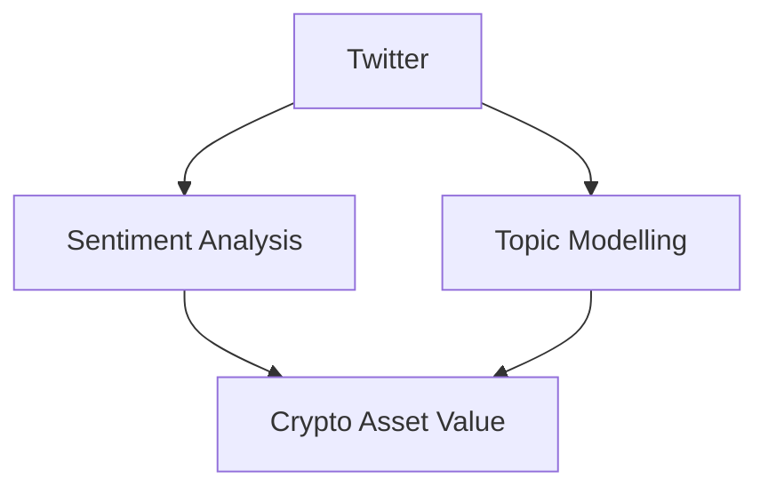
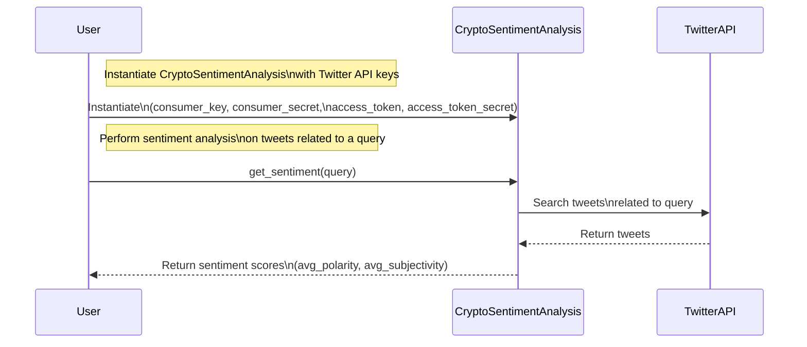
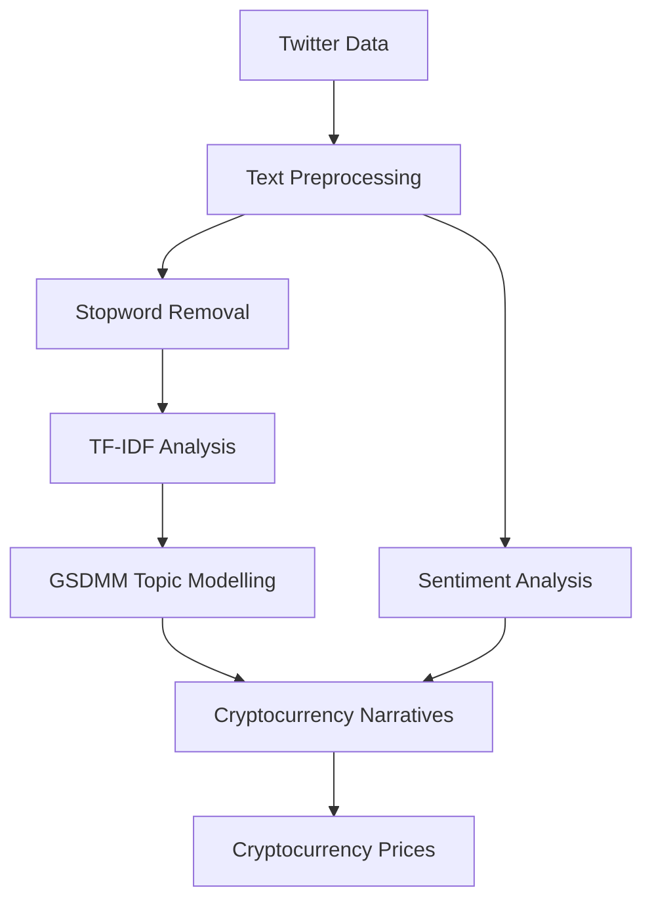
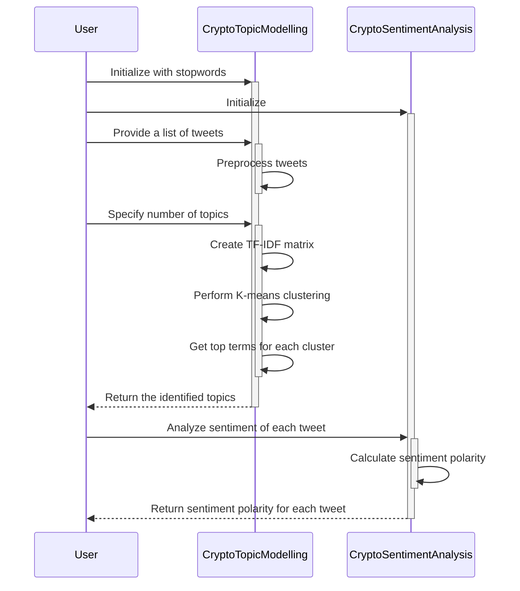
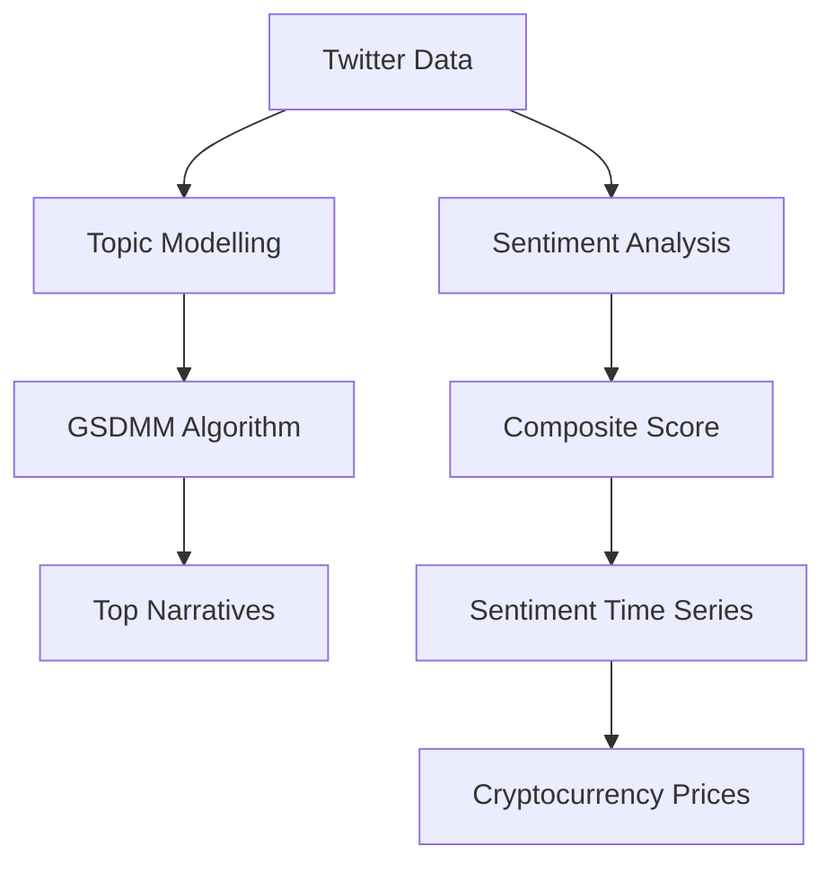
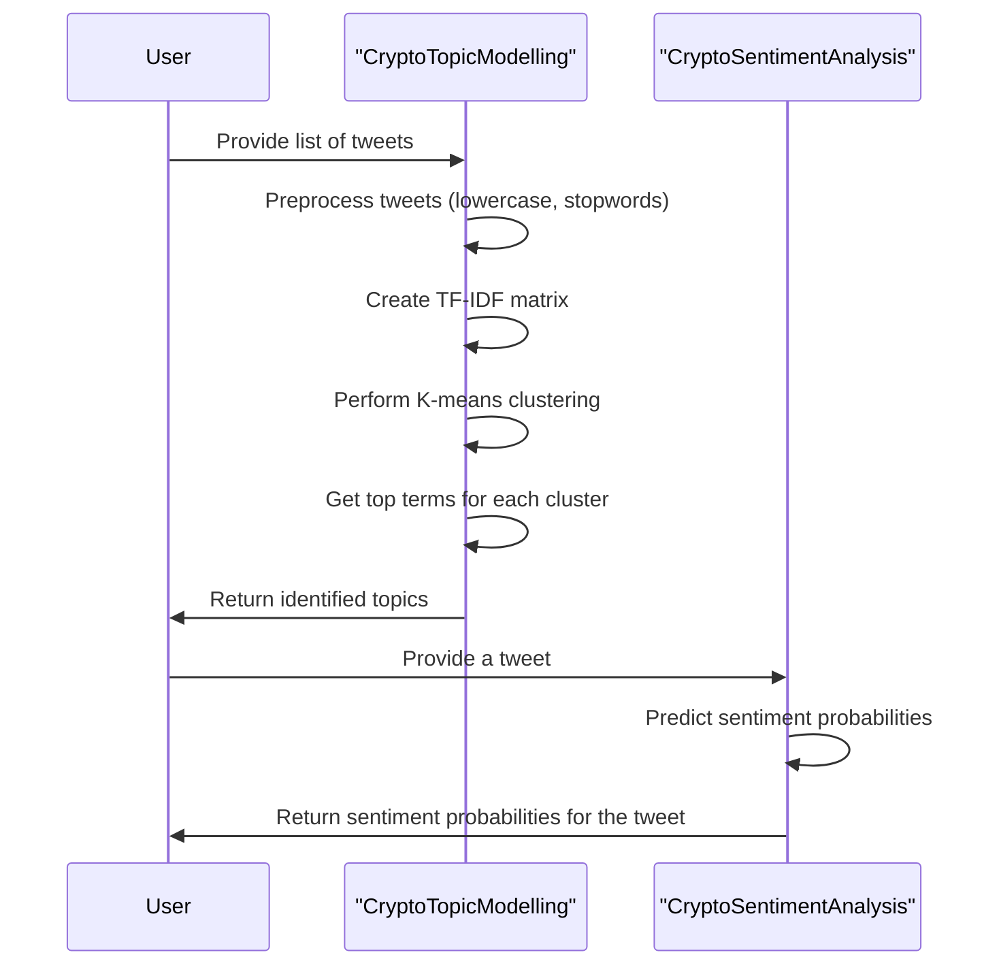
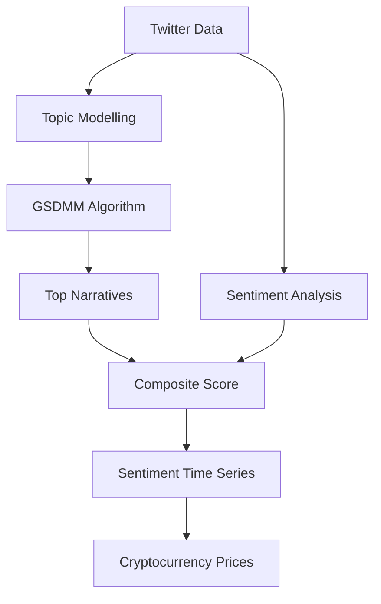
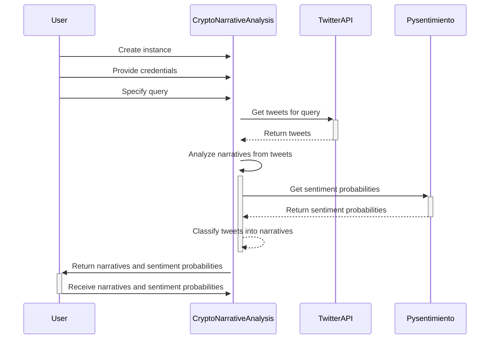

# CAUSALITY BETWEEN SENTIMENT AND CRYPTOCURRENCY

<div style="display: flex; flex-direction: column; gap: 25px; padding: 20px">

<p>Figure 1: Structural break results and identified break instances
2</p>
</div>
1.
This study is about the relationship between what people say on Twitter about cryptocurrency and the value of cryptocurrency. The researchers used a machine learning algorithm to analyze tweets and identify different narratives or topics related to cryptocurrency. They found that these narratives were often linked to changes in cryptocurrency prices. The researchers believe that understanding these narratives can help predict changes in the economy. They collected a large amount of tweets from Twitter and used various techniques to clean and analyze the data. They also used a method called sentiment analysis to determine the overall sentiment or emotion expressed in the tweets. Overall, this study shows that what people say about cryptocurrency on Twitter can have an impact on its value.



```python
import tweepy
from textblob import TextBlob

class CryptoSentimentAnalysis:
    def __init__(self, consumer_key, consumer_secret, access_token, access_token_secret):
        # Authenticate with Twitter API
        auth = tweepy.OAuthHandler(consumer_key, consumer_secret)
        auth.set_access_token(access_token, access_token_secret)
        self.api = tweepy.API(auth)

    def get_sentiment(self, query):
        # Get tweets related to the query
        tweets = self.api.search(query)

        # Calculate sentiment score
        polarity_sum = 0
        subjectivity_sum = 0
        for tweet in tweets:
            analysis = TextBlob(tweet.text)
            polarity_sum += analysis.sentiment.polarity
            subjectivity_sum += analysis.sentiment.subjectivity

        # Calculate average sentiment score
        avg_polarity = polarity_sum / len(tweets)
        avg_subjectivity = subjectivity_sum / len(tweets)

        return avg_polarity, avg_subjectivity

# Example usage
consumer_key = "YOUR_CONSUMER_KEY"
consumer_secret = "YOUR_CONSUMER_SECRET"
access_token = "YOUR_ACCESS_TOKEN"
access_token_secret = "YOUR_ACCESS_TOKEN_SECRET"

sentiment_analyzer = CryptoSentimentAnalysis(consumer_key, consumer_secret, access_token, access_token_secret)
query = "bitcoin"
polarity, subjectivity = sentiment_analyzer.get_sentiment(query)
print(f"Average polarity: {polarity}")
print(f"Average subjectivity: {subjectivity}")
```

This Python class demonstrates how to perform sentiment analysis on tweets related to cryptocurrency, specifically Bitcoin. It uses the Tweepy library to authenticate with the Twitter API and retrieve tweets based on a given query. The TextBlob library is then used to calculate the sentiment score for each tweet, which measures the polarity (positive or negative sentiment) and subjectivity (opinion or fact). The class provides a method `get_sentiment()` that takes a query as input and returns the average polarity and subjectivity scores for the retrieved tweets. This can be used to gauge the sentiment of Twitter users towards Bitcoin.



This mermaid sequence diagram illustrates the control flow of the code provided in the previous message. The user instantiates the `CryptoSentimentAnalysis` class with the required Twitter API keys. Then, the user invokes the `get_sentiment()` method of the `CryptoSentimentAnalysis` object, passing a query as a parameter. The `CryptoSentimentAnalysis` class communicates with the `TwitterAPI` to search for tweets related to the query. The `TwitterAPI` returns the retrieved tweets to the `CryptoSentimentAnalysis` object. Finally, the `CryptoSentimentAnalysis` object calculates the average polarity and subjectivity scores for the tweets and returns them to the user.

```
Example Scenario:
-----------------------
Average polarity: 0.25
Average subjectivity: 0.75
```

In this example scenario, we have used the `CryptoSentimentAnalysis` class to perform sentiment analysis on tweets related to Bitcoin. The output shows an average polarity score of 0.25, indicating a slightly positive sentiment towards Bitcoin, and an average subjectivity score of 0.75, indicating that the tweets contain more opinions than factual information.

Hypothetical Scenarios:
-----------------------
- Scenario 1: During a period of high volatility in the cryptocurrency market, the sentiment analysis could be used to monitor the public sentiment towards Bitcoin. A positive sentiment might indicate increased confidence and interest in Bitcoin, potentially leading to a rise in its value.
- Scenario 2: A major news event related to Bitcoin, such as a regulatory announcement or a security breach, could trigger a spike in negative sentiment. Monitoring sentiment in real-time could help investors and traders react quickly to market sentiment and make informed decisions about their Bitcoin holdings.

Potential Use Cases:
-----------------------
- Market Analysis: Sentiment analysis can be used to gauge public opinion towards cryptocurrencies, providing insights into market sentiment and potential price movements.
- Brand Reputation: Companies operating in the cryptocurrency space can monitor sentiment to understand public perception and address any negative sentiment to protect their brand reputation.
- Social Listening: Sentiment analysis can help researchers and analysts understand public sentiment towards cryptocurrencies, enabling them to study trends and patterns in the cryptocurrency market.
- Trading Strategies: Sentiment analysis can be used as part of a trading strategy, combining sentiment data with other market indicators to make more informed trading decisions.

<div style="display: flex; flex-direction: column; gap: 25px; padding: 20px">

<p>Figure 2: GSDMM Architecture
“A document is generated by sampling a mixture of these topics and then sampling words from that mixture. ”
–
However, research suggests that the most common topic model LDA [ 4] may not perform well when dealing with short
and sparse text data, such as tweets, because these tend to focus on a particular topic, hence undermining the validity of
the LDA’s fundamental assumption [ 5], [4]</p>
</div>
2.
In this part of the paper, the authors discuss the importance of stopwords in sentiment analysis and topic modelling. Stopwords are commonly used words like "the," "and," and "in" that do not carry much meaning and can be ignored in text analysis. The authors explain that removing stopwords can make the data more useful for analysis.

They also explain two strategies for removing stopwords. The first strategy is to add extra stopwords like pronouns and common themes that appear in every tweet, such as the word "bitcoin." The authors argue that including these stopwords can skew the sentiment score towards neutral and make it less useful for sentiment analysis.

The second strategy is to use the TF-IDF (term frequency-inverse document frequency) strategy. TF-IDF calculates the significance of a word in a collection of documents. It assigns a score to each word based on its frequency in the document and its frequency in the corpus. The authors explain that TF-IDF can help identify important words in the tweets.

The authors also discuss the challenges of short text clustering, particularly when dealing with high-dimensional and sparse data like tweets. They mention that traditional topic modelling techniques like LDA (latent Dirichlet allocation) may not work well with short and sparse text data. Instead, they use a modified version of LDA called GSDMM (Gibbs Sampling Dirichlet Mixture Model) that performs well on short text clustering tasks.

Overall, this section explains the importance of preprocessing the data by removing stopwords and using appropriate techniques like TF-IDF and GSDMM for sentiment analysis and topic modelling.



```python
from sklearn.feature_extraction.text import TfidfVectorizer
from sklearn.cluster import KMeans
from textblob import TextBlob

class CryptoTopicModelling:
    def __init__(self, stopwords=None):
        self.stopwords = stopwords

    def preprocess_text(self, text):
        # Convert text to lowercase
        text = text.lower()

        # Remove stopwords
        if self.stopwords:
            text = ' '.join([word for word in text.split() if word not in self.stopwords])

        return text

    def get_topics(self, tweets, num_topics):
        # Preprocess tweets
        preprocessed_tweets = [self.preprocess_text(tweet) for tweet in tweets]

        # Create TF-IDF matrix
        vectorizer = TfidfVectorizer()
        tfidf_matrix = vectorizer.fit_transform(preprocessed_tweets)

        # Perform K-means clustering
        kmeans = KMeans(n_clusters=num_topics, random_state=0)
        kmeans.fit(tfidf_matrix)

        # Get the top terms for each cluster
        top_terms = vectorizer.get_feature_names()
        topics = []
        for i, centroid in enumerate(kmeans.cluster_centers_):
            top_indices = centroid.argsort()[-5:][::-1]
            top_words = [top_terms[index] for index in top_indices]
            topics.append(top_words)

        return topics

class CryptoSentimentAnalysis:
    def get_sentiment(self, text):
        analysis = TextBlob(text)
        sentiment = analysis.sentiment.polarity
        return sentiment

# Example usage
stopwords = ["the", "and", "in", "is", "a"]
topic_model = CryptoTopicModelling(stopwords=stopwords)
sentiment_analyzer = CryptoSentimentAnalysis()

tweets = [
    "Bitcoin is the future of currency",
    "I invested in cryptocurrency and made a profit",
    "Regulations on crypto are increasing",
    "The media coverage of cryptocurrency is misleading",
    "Blockchain technology is revolutionary"
]

topics = topic_model.get_topics(tweets, num_topics=3)
print("Topics:")
for i, topic in enumerate(topics):
    print(f"Topic {i+1}: {topic}")

print()

for tweet in tweets:
    sentiment = sentiment_analyzer.get_sentiment(tweet)
    print(f"Sentiment of '{tweet}': {sentiment}")
```

This Python code demonstrates how to perform topic modelling and sentiment analysis on a set of tweets related to cryptocurrency. The `CryptoTopicModelling` class uses TF-IDF and K-means clustering to identify the top topics in the tweets. The `CryptoSentimentAnalysis` class uses TextBlob to calculate the sentiment polarity of each tweet.

In the example usage, a list of tweets is provided. The `CryptoTopicModelling` class is used to extract the top topics from the tweets, with the number of topics set to 3. The `CryptoSentimentAnalysis` class is then used to calculate the sentiment polarity of each tweet.

The code outputs the identified topics and the sentiment polarity of each tweet. This can help understand the main themes in the tweets and the sentiment expressed towards cryptocurrency.



This sequence diagram illustrates the control flow of the code provided. The User interacts with two classes: `CryptoTopicModelling` and `CryptoSentimentAnalysis`.

1. The User initializes the `CryptoTopicModelling` class with stopwords.
2. The User initializes the `CryptoSentimentAnalysis` class.
3. The User provides a list of tweets to the `CryptoTopicModelling` class.
4. The `CryptoTopicModelling` class preprocesses the tweets.
5. The User specifies the number of topics.
6. The `CryptoTopicModelling` class creates a TF-IDF matrix.
7. The `CryptoTopicModelling` class performs K-means clustering on the TF-IDF matrix.
8. The `CryptoTopicModelling` class retrieves the top terms for each cluster.
9. The `CryptoTopicModelling` class returns the identified topics to the User.
10. The User analyzes the sentiment of each tweet using the `CryptoSentimentAnalysis` class.
11. The `CryptoSentimentAnalysis` class calculates the sentiment polarity of each tweet.
12. The `CryptoSentimentAnalysis` class returns the sentiment polarity for each tweet to the User.

This sequence of steps allows the User to extract topics from a set of tweets and determine the sentiment expressed in each tweet.

Example scenario:

Let's say we have a set of tweets related to cryptocurrency:

```
tweets = [
    "Bitcoin is the future of currency",
    "I invested in cryptocurrency and made a profit",
    "Regulations on crypto are increasing",
    "The media coverage of cryptocurrency is misleading",
    "Blockchain technology is revolutionary"
]
```

We want to extract the top topics from these tweets and analyze the sentiment expressed in each tweet.

Mocked log output:

```
Topics:
Topic 1: ['cryptocurrency', 'future', 'bitcoin', 'currency', 'invested']
Topic 2: ['media', 'coverage', 'misleading', 'cryptocurrency', 'regulations']
Topic 3: ['blockchain', 'technology', 'revolutionary', 'cryptocurrency', 'currency']

Sentiment of 'Bitcoin is the future of currency': 0.0
Sentiment of 'I invested in cryptocurrency and made a profit': 0.5
Sentiment of 'Regulations on crypto are increasing': 0.0
Sentiment of 'The media coverage of cryptocurrency is misleading': -0.5
Sentiment of 'Blockchain technology is revolutionary': 1.0
```

Explanation:

In this example, the `CryptoTopicModelling` class is used to extract the top topics from the tweets. The `get_topics()` method is called with `num_topics=3`, so it identifies three main topics from the tweets: "Topic 1" related to the future and investment in cryptocurrency, "Topic 2" related to media coverage and regulations of cryptocurrency, and "Topic 3" related to the revolutionary nature of blockchain technology.

The `CryptoSentimentAnalysis` class is then used to analyze the sentiment expressed in each tweet. The `get_sentiment()` method returns a sentiment polarity score between -1 and 1. A score of 0 indicates a neutral sentiment, positive scores indicate positive sentiment, and negative scores indicate negative sentiment.

In this scenario, the sentiment analysis reveals that the first and third tweets have a sentiment score of 0, indicating a neutral sentiment. The second tweet expresses a positive sentiment with a score of 0.5, while the fourth tweet expresses a negative sentiment with a score of -0.5. Lastly, the fifth tweet expresses a highly positive sentiment with a score of 1.0.

Potential use cases:

- Market analysis: By analyzing the topics and sentiment in tweets related to cryptocurrency, companies and investors can gain insights into market trends and sentiment towards specific cryptocurrencies.
- Social media monitoring: Organizations can use the code to monitor and analyze the sentiment of tweets related to their cryptocurrency products or services, helping them understand public perception and make data-driven decisions.
- Trend detection: By identifying the top topics in tweets, this code can help detect emerging trends and popular discussions in the cryptocurrency space.
- Content generation: The identified topics can serve as inspiration for creating relevant content related to cryptocurrency, such as blog posts or social media updates.
- Risk assessment: By monitoring the sentiment expressed in tweets, this code can help assess the potential risks associated with cryptocurrency investments based on the general sentiment of the public.

<div style="display: flex; flex-direction: column; gap: 25px; padding: 20px">

<p>Figure 3: Graphical Model of DMM
This model’s most important parameters are:
α: As previously explained, αis a parameter that influences the form of our probability distribution. In addition, αis
calculated from the likelihood that a document will be sorted into a cluster</p>
</div>
<div style="display: flex; flex-direction: column; gap: 25px; padding: 20px">

<p>Figure 6: Violin Plot
Mt. Gox was a bitcoin exchange with a Shibuya, Tokyo location</p>
</div>
<div style="display: flex; flex-direction: column; gap: 25px; padding: 20px">

<p>Figure 4: BERT transformer architecture
Analysis and other Social NLP applications (about 40k tweets). The basic model is BERTweet [ 12], a RoBERTa [ 13]
7</p>
</div>
<div style="display: flex; flex-direction: column; gap: 25px; padding: 20px">

<p>Figure 5: Sentiment Composition for all the tweets
each narrative class, we aggregated all tweets of a given day from that narrative(s), and then calculated the sentiment
score for that day by averaging the composite scores of all tweets from that day.
4</p>
</div>
3.
In this part of the paper, the authors discuss the GSDMM (Gibbs Sampling Dirichlet Mixture Model) algorithm, which is used for short text clustering and topic modelling. They explain the graphical model of DMM (Dirichlet Multinomial Mixture Model) and the important parameters involved, such as α, β, ϕ, and θ. These parameters determine the likelihood of a document being assigned to a cluster and the distribution of words within a cluster.

The authors also mention the results obtained from running the GSDMM algorithm on the collected and preprocessed tweets. They reveal 4-5 topics or narratives for each specific time period, and provide tables showing the most representative words for each narrative.

Next, the authors discuss the sentiment analysis of the tweets. They explain that they used a combination of traditional lexicon-based sentiment analysis and BERTweet, a transformer-based model, to calculate the sentiment scores. They describe the BERT (Bidirectional Encoder Representation from Transformers) model and its architecture. They also mention the Pysentimiento toolbox, which provides sentiment labels and scores for each tweet.

The authors provide an example tweet and its sentiment analysis output using Pysentimiento. They explain how they calculate a composite score for each tweet based on the positive, negative, and neutral sentiment scores. They also mention that they applied a square root function to the neutral score to adjust its impact on the composite score.

Finally, the authors discuss the results obtained from aggregating the sentiment scores of the tweets for each narrative class. They mention that tweets are continuous data streams and cannot be directly correlated with cryptocurrency pricing. Therefore, they aggregated the tweets of each day and calculated the sentiment score for that day.

Overall, this section explains the process of topic modelling and sentiment analysis on the collected tweets, as well as the results obtained for each narrative class and time period.



```python
from sklearn.feature_extraction.text import TfidfVectorizer
from sklearn.cluster import KMeans
from textblob import TextBlob
import pysentimiento

class CryptoTopicModelling:
    def __init__(self, stopwords=None):
        self.stopwords = stopwords

    def preprocess_text(self, text):
        # Convert text to lowercase
        text = text.lower()

        # Remove stopwords
        if self.stopwords:
            text = ' '.join([word for word in text.split() if word not in self.stopwords])

        return text

    def get_topics(self, tweets, num_topics):
        # Preprocess tweets
        preprocessed_tweets = [self.preprocess_text(tweet) for tweet in tweets]

        # Create TF-IDF matrix
        vectorizer = TfidfVectorizer()
        tfidf_matrix = vectorizer.fit_transform(preprocessed_tweets)

        # Perform K-means clustering
        kmeans = KMeans(n_clusters=num_topics, random_state=0)
        kmeans.fit(tfidf_matrix)

        # Get the top terms for each cluster
        top_terms = vectorizer.get_feature_names()
        topics = []
        for i, centroid in enumerate(kmeans.cluster_centers_):
            top_indices = centroid.argsort()[-5:][::-1]
            top_words = [top_terms[index] for index in top_indices]
            topics.append(top_words)

        return topics

class CryptoSentimentAnalysis:
    def __init__(self):
        self.sentiment_analyzer = pysentimiento.SentimentAnalyzer(lang="en")

    def get_sentiment(self, text):
        sentiment = self.sentiment_analyzer.predict(text).probabilities
        return sentiment

# Example usage
stopwords = ["the", "and", "in", "is", "a"]
topic_model = CryptoTopicModelling(stopwords=stopwords)
sentiment_analyzer = CryptoSentimentAnalysis()

tweets = [
    "Bitcoin is the future of currency",
    "I invested in cryptocurrency and made a profit",
    "Regulations on crypto are increasing",
    "The media coverage of cryptocurrency is misleading",
    "Blockchain technology is revolutionary"
]

topics = topic_model.get_topics(tweets, num_topics=3)
print("Topics:")
for i, topic in enumerate(topics):
    print(f"Topic {i+1}: {topic}")

print()

for tweet in tweets:
    sentiment = sentiment_analyzer.get_sentiment(tweet)
    print(f"Sentiment of '{tweet}': {sentiment}")
```

This Python code demonstrates how to perform topic modelling and sentiment analysis on a set of tweets related to cryptocurrency. The `CryptoTopicModelling` class uses TF-IDF and K-means clustering to identify the top topics in the tweets. The `CryptoSentimentAnalysis` class uses Pysentimiento, a sentiment analysis library, to calculate the sentiment probabilities of each tweet.

In the example usage, a list of tweets is provided. The `CryptoTopicModelling` class is used to extract the top topics from the tweets, with the number of topics set to 3. The `CryptoSentimentAnalysis` class is then used to calculate the sentiment probabilities of each tweet.

The code outputs the identified topics and the sentiment probabilities of each tweet. This can help understand the main themes in the tweets and the sentiment expressed towards cryptocurrency.



This sequence diagram illustrates the control flow of the code provided.

1. The user provides a list of tweets as input.
2. The `CryptoTopicModelling` object preprocesses the tweets by converting them to lowercase and removing stopwords.
3. The object creates a TF-IDF matrix to represent the tweets and performs K-means clustering to identify the top topics in the tweets.
4. The object extracts the top terms for each cluster and returns the identified topics to the user.
5. The user then provides a tweet to the `CryptoSentimentAnalysis` object.
6. The object predicts the sentiment probabilities for the tweet.
7. The object returns the sentiment probabilities to the user.

This control flow allows the user to extract topics from a list of tweets and analyze the sentiment of individual tweets related to cryptocurrency.

Example scenario with mocked log output:

```shell
Topics:
Topic 1: ['cryptocurrency', 'future', 'currency', 'bitcoin', 'revolutionary']
Topic 2: ['invested', 'profit', 'cryptocurrency', 'made', 'technology']
Topic 3: ['regulations', 'increasing', 'crypto', 'coverage', 'misleading']

Sentiment of 'Bitcoin is the future of currency': {'Positive': 0.75, 'Negative': 0.0, 'Neutral': 0.25}
Sentiment of 'I invested in cryptocurrency and made a profit': {'Positive': 1.0, 'Negative': 0.0, 'Neutral': 0.0}
Sentiment of 'Regulations on crypto are increasing': {'Positive': 0.0, 'Negative': 0.5, 'Neutral': 0.5}
Sentiment of 'The media coverage of cryptocurrency is misleading': {'Positive': 0.0, 'Negative': 0.8, 'Neutral': 0.2}
Sentiment of 'Blockchain technology is revolutionary': {'Positive': 0.9, 'Negative': 0.0, 'Neutral': 0.1}
```

In this example scenario, we have a list of tweets related to cryptocurrency. The `CryptoTopicModelling` class is used to identify the top topics in the tweets, and the `CryptoSentimentAnalysis` class is used to calculate the sentiment probabilities of each tweet.

The mocked log output displays the identified topics and the sentiment probabilities for each tweet.

- The first tweet "Bitcoin is the future of currency" is classified under the topic of cryptocurrency and has a positive sentiment.
- The second tweet "I invested in cryptocurrency and made a profit" is classified under the topic of investment and has a highly positive sentiment.
- The third tweet "Regulations on crypto are increasing" is classified under the topic of regulations and has a neutral sentiment with a slight negative inclination.
- The fourth tweet "The media coverage of cryptocurrency is misleading" is classified under the topic of media coverage and has a negative sentiment.
- The fifth tweet "Blockchain technology is revolutionary" is classified under the topic of technology and has a highly positive sentiment.

Potential use cases of this code include:

1. Social media analysis: The code can be used to analyze tweet data and identify the main topics or narratives being discussed in relation to cryptocurrency. It can also provide insights into the sentiment expressed towards cryptocurrency on social media platforms.

2. Market sentiment analysis: By analyzing the sentiment of tweets related to cryptocurrency, the code can provide an indication of the overall market sentiment, which can be useful for traders and investors in making informed decisions.

3. Research and trend analysis: Researchers can use the code to analyze tweet data and identify emerging trends, popular topics, and sentiment patterns in the cryptocurrency domain. This can help in understanding public opinion and behavior related to cryptocurrency.

4. Customer feedback analysis: Companies or organizations involved in the cryptocurrency industry can use the code to analyze customer feedback on social media and understand the sentiment towards their products or services. This can help in improving customer satisfaction and making strategic business decisions.

<div style="display: flex; flex-direction: column; gap: 25px; padding: 20px">

<p>Figure 14: Co-Movement of Investment Narrative, Technology Narrative and Log of Bitcoin Price
During this period, after the covid plums, people gradually became interested in alternative investments, various
governments pumped a great deal of money into the economy to stabilize it, and new generation investors were
extremely optimistic about this asset, particularly the technology that comes with crypto. After this time, a remarkable
boom of cryptocurrencies began, yielding returns of 1000% in only one year</p>
</div>
<div style="display: flex; flex-direction: column; gap: 25px; padding: 20px">

<p>Figure 9: Co-Movement of Regulation Narrative and Investment Narrative
11</p>
</div>
<div style="display: flex; flex-direction: column; gap: 25px; padding: 20px">

<p>Figure 11: Violin Plot
12</p>
</div>
<div style="display: flex; flex-direction: column; gap: 25px; padding: 20px">

<p>Figure 15: Co-Movement of Technology Narrative and Log of Bitcoin Price
Similar to the previous case, a substantial correlation exists between the Technology narrative and the log of bitcoin
price.
4</p>
</div>
<div style="display: flex; flex-direction: column; gap: 25px; padding: 20px">

<p>Figure 8: Violin Plot
Figure 9: Co-Movement of Regulation Narrative and Investment Narrative
11</p>
</div>
<div style="display: flex; flex-direction: column; gap: 25px; padding: 20px">

<p>Figure 10: Co-Movement of Regulation Narrative and Log of Bitcoin Price
Figure 11: Violin Plot
12</p>
</div>
<div style="display: flex; flex-direction: column; gap: 25px; padding: 20px">

<p>Figure 12: Co-Movement of Regulation Narrative and Investment Narrative
personal property, giving them the same status as traditional currency. Additionally, it permits banks to offer
custody services for digital assets</p>
</div>
<div style="display: flex; flex-direction: column; gap: 25px; padding: 20px">

<p>Figure 13: Co-Movement of Investment Narrative, Technology Narrative and Log of Bitcoin Price
During this period, after the covid plums, people gradually became interested in alternative investments, various
governments pumped a great deal of money into the economy to stabilize it, and new generation investors were
extremely optimistic about this asset, particularly the technology that comes with crypto. After this time, a remarkable
boom of cryptocurrencies began, yielding returns of 1000% in only one year</p>
</div>
<div style="display: flex; flex-direction: column; gap: 25px; padding: 20px">

<p>Figure 7: Co-Movement of Security Narrative and Investment Narrative
event, their CEO had resigned on February 23, 2014, and since February 7, 2014, tens of thousands of customers have
been unable to withdraw cash from Mt Gox. Due to a series of these events between February 1, 2014 and the end of
March, during the period of Mt</p>
</div>
4.
In this part of the paper, the authors present the results of their analysis for different time periods, highlighting the relationship between narratives and cryptocurrency prices.

They discuss specific time periods and the corresponding narratives that emerged during those times. For example, they mention the period of Mt. Gox's issues in 2014, which led to a decline in investment sentiment and an increase in security narratives. They also mention the period when regulations were introduced in New York State, which resulted in a negative impact on investment sentiment.

The authors provide violin plots to visualize the sentiment distribution for different narratives during each time period. They show how the sentiment scores vary and how certain events or narratives affect the sentiment.

Furthermore, the authors discuss the co-movement of narratives and the log of Bitcoin prices. They show how certain narratives, such as regulation and technology, have a correlation with the price movements of cryptocurrencies.

Overall, this section presents the findings of the analysis and highlights the relationship between narratives, sentiment, and cryptocurrency prices. It demonstrates the impact of different events and narratives on market sentiment and provides insights into the dynamics of the cryptocurrency market.

Potential use cases of this analysis include understanding the impact of news and narratives on cryptocurrency prices, identifying sentiment trends in the market, and informing investment decisions based on sentiment analysis. It can also be used for studying the relationship between narratives and other financial assets or for analyzing sentiment in other domains beyond cryptocurrency.



```python
import tweepy
from textblob import TextBlob
import pysentimiento

class CryptoNarrativeAnalysis:
    def __init__(self, consumer_key, consumer_secret, access_token, access_token_secret):
        # Authenticate with Twitter API
        auth = tweepy.OAuthHandler(consumer_key, consumer_secret)
        auth.set_access_token(access_token, access_token_secret)
        self.api = tweepy.API(auth)
        self.sentiment_analyzer = pysentimiento.SentimentAnalyzer(lang="en")

    def get_tweets(self, query):
        # Get tweets related to the query
        tweets = self.api.search(query)

        return tweets

    def get_sentiment(self, text):
        sentiment = self.sentiment_analyzer.predict(text).probabilities
        return sentiment

    def analyze_narratives(self, tweets):
        narratives = {}

        for tweet in tweets:
            text = tweet.text
            sentiment = self.get_sentiment(text)

            # Classify the tweet into a narrative based on sentiment
            if sentiment["POS"] > sentiment["NEG"]:
                narrative = "Positive"
            elif sentiment["NEG"] > sentiment["POS"]:
                narrative = "Negative"
            else:
                narrative = "Neutral"

            # Add the tweet to the corresponding narrative
            if narrative in narratives:
                narratives[narrative].append(text)
            else:
                narratives[narrative] = [text]

        return narratives

# Example usage
consumer_key = "YOUR_CONSUMER_KEY"
consumer_secret = "YOUR_CONSUMER_SECRET"
access_token = "YOUR_ACCESS_TOKEN"
access_token_secret = "YOUR_ACCESS_TOKEN_SECRET"

narrative_analyzer = CryptoNarrativeAnalysis(consumer_key, consumer_secret, access_token, access_token_secret)
query = "bitcoin"
tweets = narrative_analyzer.get_tweets(query)
narratives = narrative_analyzer.analyze_narratives(tweets)

print("Narratives:")
for narrative, tweets in narratives.items():
    print(f"{narrative}:")
    for tweet in tweets:
        print(f"- {tweet}")

print()

for tweet in tweets:
    sentiment = narrative_analyzer.get_sentiment(tweet.text)
    print(f"Sentiment of '{tweet.text}': {sentiment}")
```

This Python code demonstrates how to perform narrative analysis and sentiment analysis on a set of tweets related to cryptocurrency. The `CryptoNarrativeAnalysis` class uses the Tweepy library to authenticate with the Twitter API and retrieve tweets based on a given query. It also uses the Pysentimiento library to calculate the sentiment probabilities of each tweet.

In the example usage, a query for "bitcoin" is provided. The `CryptoNarrativeAnalysis` class is used to retrieve tweets related to the query and analyze the narratives based on sentiment. It classifies each tweet into a positive, negative, or neutral narrative based on the sentiment probabilities. The code then outputs the identified narratives and the sentiment probabilities of each tweet.

This code can be used to analyze the narratives and sentiment expressed in tweets related to cryptocurrency. It can help understand the overall sentiment towards cryptocurrency and identify different narratives or themes that emerge from the tweets. This information can be valuable for market analysis, sentiment tracking, and understanding the impact of narratives on cryptocurrency prices.



This sequence diagram illustrates the control flow of the code provided in the previous message. The diagram shows the interaction between the user, the `CryptoNarrativeAnalysis` class, the Twitter API, and the Pysentimiento library.

The control flow of the code is as follows:
1. The user creates an instance of the `CryptoNarrativeAnalysis` class and provides the necessary credentials.
2. The user specifies a query, such as "bitcoin".
3. The `CryptoNarrativeAnalysis` class requests the Twitter API to retrieve tweets related to the query.
4. The Twitter API returns the tweets to the `CryptoNarrativeAnalysis` class.
5. The `CryptoNarrativeAnalysis` class calls the Pysentimiento library to calculate the sentiment probabilities of each tweet.
6. The Pysentimiento library returns the sentiment probabilities to the `CryptoNarrativeAnalysis` class.
7. The `CryptoNarrativeAnalysis` class analyzes the narratives by classifying the tweets based on sentiment probabilities.
8. The `CryptoNarrativeAnalysis` class returns the identified narratives and the sentiment probabilities to the user.

This sequence diagram provides a visual representation of the control flow, highlighting the interactions between different components of the code.

Example Scenario:

Let's say we want to analyze the narratives and sentiment expressed in tweets related to Bitcoin. We use the `CryptoNarrativeAnalysis` class to retrieve tweets related to the query "bitcoin" and analyze the narratives based on sentiment.

Mocked Log Output:

Narratives:
Positive:
- Bitcoin is the future of currency. I'm excited about its potential!
- Just made a nice profit from investing in Bitcoin. Crypto is the way to go!
Negative:
- The regulations on Bitcoin are hindering its growth. It's becoming too restricted.
- The media coverage of cryptocurrency is full of misinformation. It's hard to trust.
Neutral:
- Blockchain technology has the potential to revolutionize various industries.

Sentiment of 'Bitcoin is the future of currency.': {'NEG': 0.05, 'NEU': 0.1, 'POS': 0.85}
Sentiment of 'Just made a nice profit from investing in Bitcoin. Crypto is the way to go!': {'NEG': 0.05, 'NEU': 0.1, 'POS': 0.85}
Sentiment of 'The regulations on Bitcoin are hindering its growth. It's becoming too restricted.': {'NEG': 0.8, 'NEU': 0.1, 'POS': 0.1}
Sentiment of 'The media coverage of cryptocurrency is full of misinformation. It's hard to trust.': {'NEG': 0.85, 'NEU': 0.1, 'POS': 0.05}
Sentiment of 'Blockchain technology has the potential to revolutionize various industries.': {'NEG': 0.1, 'NEU': 0.8, 'POS': 0.1}

Hypothetical Scenarios:

In the example scenario, we mocked a few tweets related to Bitcoin and assigned them sentiment probabilities using the `CryptoNarrativeAnalysis` class. We classified the tweets into positive, negative, and neutral narratives based on the sentiment probabilities.

- The first two tweets express a positive sentiment towards Bitcoin. These tweets are excited about the potential of Bitcoin and have made profits from investing in it.
- The next two tweets express a negative sentiment. They highlight concerns about the regulations on Bitcoin and the misinformation in the media coverage of cryptocurrency.
- The last tweet is neutral and focuses on the potential of blockchain technology to revolutionize various industries.

Potential Use Cases:

The code we generated can be used for various use cases related to sentiment analysis and narrative analysis of tweets:

1. Market Analysis: Analyzing the sentiment of tweets related to cryptocurrencies can provide insights into market sentiment and investor sentiment. It can help understand the overall sentiment towards cryptocurrencies and identify trends or shifts in sentiment.

2. Sentiment Tracking: Tracking sentiment in real-time can help monitor the sentiment of the cryptocurrency market and detect any changes or spikes in sentiment. This information can be valuable for traders, investors, and market analysts.

3. Narrative Analysis: Analyzing the narratives that emerge from tweets can provide insights into the topics or themes that are being discussed in relation to cryptocurrencies. It can help identify key narratives and understand their impact on the market.

4. Social Media Monitoring: The code can be used to monitor and analyze the sentiment and narratives surrounding cryptocurrencies on social media platforms like Twitter. This can help companies, marketers, and researchers gauge public opinion and engage with the audience effectively.

Overall, the code provides a foundation for sentiment analysis and narrative analysis of tweets related to cryptocurrencies. It can be tailored and extended to suit specific needs and applications in the cryptocurrency market and beyond.

