# EXPLORATION OF ALGORITHMIC TRADING STRATEGIES FOR

1.
This snippet is an abstract from a research paper that explores algorithmic trading strategies for the Bitcoin market. The researchers use machine learning models to predict the direction of Bitcoin's price movement on a daily basis. They incorporate both internal features of the Bitcoin network and external features, such as stock market data and social media data, to inform their predictions. The researchers evaluate their models using real-world trading data and find that their models are profitable, outperforming a traditional buy-and-hold strategy when incorporating a risk tolerance score. The paper highlights the potential of machine learning models in extracting profit from the Bitcoin market and suggests further research in this area.

In simpler terms, the researchers are using computer programs to predict whether the price of Bitcoin will go up or down each day. They use different types of information, like data from the Bitcoin network and other sources, to make these predictions. They test their predictions using real trading data and find that their models can make money. This research shows that using machine learning can be a successful strategy for trading Bitcoin.


This diagram shows the key concepts of the paper. The Bitcoin market is explored using algorithmic trading strategies. Machine learning models are used to predict the price movements of Bitcoin. These predictions are evaluated to analyze the profitability of the trading strategy. The researchers then incorporate a risk tolerance score to improve the profit.

```python
import pandas as pd
from sklearn.model_selection import train_test_split
from sklearn.ensemble import RandomForestClassifier
from sklearn.metrics import accuracy_score

class BitcoinTradingModel:
    def __init__(self):
        self.model = RandomForestClassifier()

    def train(self, data):
        # Split the data into features and labels
        X = data.drop("Direction", axis=1)
        y = data["Direction"]

        # Split the data into training and testing sets
        X_train, X_test, y_train, y_test = train_test_split(X, y, test_size=0.2, random_state=42)

        # Train the model
        self.model.fit(X_train, y_train)

        # Evaluate the model
        y_pred = self.model.predict(X_test)
        accuracy = accuracy_score(y_test, y_pred)
        print("Model accuracy:", accuracy)

    def predict(self, data):
        # Make predictions using the trained model
        predictions = self.model.predict(data)
        return predictions

# Example usage
# Assuming we have a DataFrame called 'bitcoin_data' with features and labels
model = BitcoinTradingModel()
model.train(bitcoin_data)
predictions = model.predict(bitcoin_data)
print(predictions)
```

This Python class demonstrates the implementation of a machine learning model for Bitcoin trading. The `BitcoinTradingModel` class uses the RandomForestClassifier algorithm from the scikit-learn library.

The `train` method takes in a DataFrame `data` that contains the features (e.g., Bitcoin network data, technical indicators) and labels (e.g., price movement direction). It splits the data into training and testing sets, trains the model on the training set, and evaluates its accuracy on the testing set.

The `predict` method takes in another DataFrame `data` and uses the trained model to make predictions on it. The predicted price movement directions are returned as an output.

You can create an instance of the `BitcoinTradingModel` class, train it on your Bitcoin data, and then use it to make predictions on new data.


This sequence diagram demonstrates the control flow of the code provided in the previous message. The user interacts with the `BitcoinTradingModel` class, where they can either train the model or make predictions using the trained model.

When training the model, the user provides data to the `train` method. The model splits the data into features and labels, then trains the `RandomForestClassifier` algorithm on the labeled data. The model evaluates its accuracy on a testing set and returns the accuracy to the user.

When making predictions, the user provides new data to the `predict` method. The model uses the trained `RandomForestClassifier` algorithm to make predictions on the new data, and then returns the predictions to the user.

Example scenario:

Suppose we have a dataset called `bitcoin_data` that contains features such as the previous day's Bitcoin price, trading volume, and social media sentiment, along with the corresponding labels indicating whether the price increased or decreased on the next day.

```python
bitcoin_data.head()
```
Output:
```
   Previous_Price  Volume  Social_Media_Sentiment  Direction
0         60000.0   10000                       1          1
1         59000.0    8000                       0          0
2         58000.0   12000                       1          1
3         59000.0   15000                      -1          0
4         60000.0   10000                       0          1
```

We can create an instance of the `BitcoinTradingModel` class, train it on the `bitcoin_data`, and then use it to make predictions.

```python
model = BitcoinTradingModel()
model.train(bitcoin_data)

predictions = model.predict(bitcoin_data)
print(predictions)
```

Mocked log output:

```
Model accuracy: 0.75
[1, 0, 1, 0, 1]
```

Explanation of hypothetical scenarios:

In this example scenario, we mocked a simplified dataset with features like the previous day's Bitcoin price, trading volume, and social media sentiment, along with the corresponding labels indicating whether the price increased or decreased on the next day.

We then created an instance of the `BitcoinTradingModel` class and trained it on the `bitcoin_data` using the `train` method. The model achieved an accuracy of 0.75, indicating how well it can predict the price movement direction based on the given features.

We then used the `predict` method to make predictions on the same dataset, `bitcoin_data`. The predictions are binary values (1 or 0), indicating whether the model predicts an increase or decrease in the Bitcoin price.

Potential use cases:

The code provided can be used for various use cases related to Bitcoin trading:

1. **Price movement prediction**: Traders can use this code to predict whether the price of Bitcoin will increase or decrease on the next day based on historical data. This can help them make informed decisions about buying or selling Bitcoin.

2. **Algorithmic trading**: The trained machine learning model can be integrated into an algorithmic trading system that automatically executes trades based on its predictions. This allows for faster and more efficient trading decisions.

3. **Risk management**: By incorporating a risk tolerance score, as mentioned in the paper, traders can adjust their trading strategy to maximize profits while managing the risk associated with Bitcoin's volatility.

4. **Market analysis**: The code can be used to analyze the impact of different features, such as social media sentiment or trading volume, on Bitcoin's price movement. This can provide valuable insights into the factors driving the market.

Overall, the code provides a foundation for developing and testing machine learning models for Bitcoin trading, allowing traders to leverage data-driven strategies in the dynamic cryptocurrency market.

2.
This snippet discusses the challenges of reproducing the results from a previous research paper by Mudassir et al. [2020]. The researchers of this current paper attempted to replicate the models and results reported in the previous study but encountered issues with overfitting, which means that the models were too closely fitted to the training data and performed poorly on new, unseen data. They found discrepancies in the reported results, including models being trained on the test data and errors in applying the Principal Component Analysis (PCA) step.

The researchers then describe their own approach to the Bitcoin price prediction problem. They developed an algorithmic trading method using a wide range of features that were not fully explored in previous studies. They also utilized the probabilistic outputs of the classifiers to parameterize trading risk, allowing traders to specify their risk appetite.

The rest of the paper is organized as follows: Section 2 investigates the reproducibility challenges of the previous study, Section 3 describes the approach taken by the researchers in this current study, Section 4 presents the results of their machine learning models, and Section 5 concludes the research.

In simpler terms, the researchers tried to reproduce the results of a previous study but found issues with overfitting and errors in the reported results. They then developed their own approach to predict Bitcoin prices using a variety of features and taking into account trading risk.


This diagram represents the key concepts discussed in the paper. The researchers first attempt to reproduce the results of a previous study by Mudassir et al. but encounter challenges in reproducing their results. This leads them to develop their own algorithmic Bitcoin trading method, which incorporates a wide range of features that were not fully explored in previous studies. They also utilize the probabilistic outputs of the classifiers to parameterize trading risk. The method is then tested on unseen data and its performance is evaluated, comparing it with previous metrics reported in the previous study.

```python
import pandas as pd
from sklearn.model_selection import train_test_split
from sklearn.ensemble import RandomForestClassifier
from sklearn.metrics import accuracy_score

class BitcoinTradingModel:
    def __init__(self):
        self.model = RandomForestClassifier()

    def train(self, data):
        # Split the data into features and labels
        X = data.drop("Direction", axis=1)
        y = data["Direction"]

        # Split the data into training and testing sets
        X_train, X_test, y_train, y_test = train_test_split(X, y, test_size=0.2, random_state=42)

        # Train the model
        self.model.fit(X_train, y_train)

        # Evaluate the model
        y_pred = self.model.predict(X_test)
        accuracy = accuracy_score(y_test, y_pred)
        print("Model accuracy:", accuracy)

    def predict(self, data):
        # Make predictions using the trained model
        predictions = self.model.predict(data)
        return predictions

class BitcoinTradingBenchmark:
    def __init__(self, previous_results):
        self.previous_results = previous_results

    def evaluate(self, new_results):
        # Compare new results with previous results
        # and identify discrepancies or improvements
        pass

# Example usage
# Assuming we have a DataFrame called 'bitcoin_data' with features and labels
model = BitcoinTradingModel()
model.train(bitcoin_data)
predictions = model.predict(bitcoin_data)
print(predictions)

# Assuming we have previous results from a paper in a DataFrame called 'previous_results'
benchmark = BitcoinTradingBenchmark(previous_results)
benchmark.evaluate(new_results)
```

In addition to the `BitcoinTradingModel` class, I have added a new class called `BitcoinTradingBenchmark` to represent the idea of evaluating the new results in comparison to the previous results from a paper.

The `BitcoinTradingBenchmark` class takes in the previous results as a parameter during initialization. It has an `evaluate` method that takes in new results and compares them with the previous results. This method can be used to identify any discrepancies or improvements in the new results.

You can create an instance of the `BitcoinTradingBenchmark` class, passing in the previous results from a paper. Then, you can use the `evaluate` method to compare the new results with the previous results.

This code demonstrates how the new results can be evaluated in the context of the previous study, allowing for a benchmarking process.


This sequence diagram illustrates the control flow of the code provided.

1. The user interacts with the `Model` object by calling the `train` method with the `bitcoin_data`.
2. The `Model` object splits the data into features and labels, then further splits it into training and testing sets.
3. The model is trained using the training set and evaluated using the testing set. The accuracy of the model is calculated and stored internally.
4. The user then calls the `predict` method on the `Model` object, passing in `bitcoin_data` to make predictions.
5. The `Model` object makes predictions using the trained model and returns the results to the user.
6. The user interacts with the `Benchmark` object by calling the `evaluate` method with `new_results`.
7. The `Benchmark` object compares the `new_results` with the previous results and identifies any discrepancies or improvements.

This diagram shows the sequence of steps and interactions between the user, the `Model` object, and the `Benchmark` object.

Example scenario:
```python
# Mocked log output
Model accuracy: 0.75
[0, 1, 0, 1, 1, 0]
```

In this scenario, we have a mocked log output from the code. The model is trained on the Bitcoin data, and the accuracy of the model on the test set is 0.75, indicating that the model is able to predict the direction of Bitcoin's price movement with 75% accuracy. Then, the model is used to make predictions on the same Bitcoin data, and the predicted price movement directions are [0, 1, 0, 1, 1, 0].

Hypothetical scenarios:
1. The code can be used to train and evaluate different machine learning models using various algorithms, such as random forest or support vector machine, to find the best model that predicts Bitcoin's price movement.
2. The code can be used to experiment with different feature sets, incorporating both internal features of the Bitcoin network and external features like social media data or economic data, to explore which features have the most significant impact on the model's performance.
3. By utilizing the probabilistic outputs of the classifiers, the code allows traders to parameterize the trading risk, enabling them to adjust their trading strategy based on their risk appetite. This can be useful for both individual traders and institutional investors in managing their portfolio and optimizing their profit.
4. The code can be used to benchmark and compare the performance of new models or approaches with previous studies in the field of Bitcoin trading. This helps in assessing the progress and advancements made in the field and identifying any discrepancies or improvements in the results.
5. The code can be used to analyze the performance of different trading strategies by backtesting them on historical Bitcoin data. This allows traders to evaluate the profitability and risk of their strategies before implementing them in real-world trading scenarios.
Overall, the code provides a framework for building and evaluating machine learning models for Bitcoin trading, enabling researchers and traders to explore and analyze different approaches, features, and strategies to improve their understanding and profitability in the Bitcoin market.

<div style="display: flex; flex-direction: column; gap: 25px; padding: 20px">

<p>Figure 1: The proposed methodology for this study.
potential predictive factor</p>
</div>
3.
This snippet discusses the methodologies used in the research paper. It highlights the challenges of rigorous and robust model development and emphasizes the importance of transparency and openness in the data science field.

The proposed methodology starts with the construction of a dataset using both internal features from the Bitcoin Blockchain network and external factors that may affect the Bitcoin price. The data collection process involves scraping data from various sources, such as bitinfocharts.com and data.bitcoinity.org, to gather internal Bitcoin features and additional features from different Bitcoin exchanges.

In addition to the internal features, the researchers incorporate external features, such as stock and commodity indices, macroeconomic data, sentiment-based features, and currency exchange data. They significantly expand the standard feature set used in previous studies to explore untapped feature areas and increase prediction power. The external features are scraped from finance.yahoo.com using the Yahoo Finance API.

The overall methodology includes data preprocessing, feature selection, model training with hyperparameter optimization and cross-validation, and evaluation using real-world data.

In simpler terms, the researchers collect a wide range of data related to Bitcoin and external factors that may influence its price. They preprocess the data, select relevant features, train machine learning models, and evaluate the models using real-world data.

Potential use cases of the code and methodologies presented in this paper include developing algorithmic trading strategies for Bitcoin and other cryptocurrencies, conducting research on the impact of different features on cryptocurrency prices, and exploring the use of machine learning models for predicting financial markets.


This diagram illustrates the key concepts discussed in the paper. It starts with the reproducibility challenges of a previous study by Mudassir et al. The researchers propose a new approach, which involves developing an algorithmic Bitcoin trading method. The method includes exploring both internal and external features, collecting data from various sources, conducting hyperparameter optimization for parameter selection, training machine learning models, and evaluating their performance on real-world data.

The diagram highlights the flow of the research process, starting from the challenges of reproducing previous results and leading to the development and evaluation of the new algorithmic trading method.

```python
import pandas as pd
from sklearn.model_selection import train_test_split
from sklearn.ensemble import RandomForestClassifier
from sklearn.metrics import accuracy_score

class BitcoinTradingModel:
    def __init__(self):
        self.model = RandomForestClassifier()

    def train(self, data):
        # Split the data into features and labels
        X = data.drop("Direction", axis=1)
        y = data["Direction"]

        # Split the data into training and testing sets
        X_train, X_test, y_train, y_test = train_test_split(X, y, test_size=0.2, random_state=42)

        # Train the model
        self.model.fit(X_train, y_train)

        # Evaluate the model
        y_pred = self.model.predict(X_test)
        accuracy = accuracy_score(y_test, y_pred)
        print("Model accuracy:", accuracy)

    def predict(self, data):
        # Make predictions using the trained model
        predictions = self.model.predict(data)
        return predictions

class BitcoinDataCollector:
    def __init__(self):
        self.internal_features = []
        self.external_features = []

    def collect_internal_features(self, source):
        # Scrape internal Bitcoin features from a given source
        # and store them in the internal_features attribute
        pass

    def collect_external_features(self, source):
        # Scrape external features from a given source
        # and store them in the external_features attribute
        pass

# Example usage
# Assuming we have a DataFrame called 'bitcoin_data' with features and labels
model = BitcoinTradingModel()
model.train(bitcoin_data)
predictions = model.predict(bitcoin_data)
print(predictions)

# Assuming we have a BitcoinDataCollector instance called 'data_collector'
data_collector = BitcoinDataCollector()
data_collector.collect_internal_features(source1)
data_collector.collect_external_features(source2)
```

In addition to the `BitcoinTradingModel` class, I have added a new class called `BitcoinDataCollector` to represent the idea of collecting internal and external features for the Bitcoin trading model.

The `BitcoinDataCollector` class has two methods: `collect_internal_features` and `collect_external_features`. These methods take a source as a parameter and are responsible for scraping and collecting the internal and external features, respectively. The collected features are stored in the `internal_features` and `external_features` attributes of the class.

You can create an instance of the `BitcoinDataCollector` class and use its methods to collect internal and external features from different sources. This data can then be used to train the `BitcoinTradingModel` or for further analysis.

This code demonstrates how the collection of internal and external features can be encapsulated in a separate class, allowing for modularity and easier management of data collection processes.


This sequence diagram shows the control flow of the code provided. It starts with the user training the BitcoinTradingModel by providing the bitcoin_data. The BitcoinTradingModel then communicates with the BitcoinDataCollector to collect both the internal features and external features. The BitcoinDataCollector retrieves the features by scraping data from different sources. Once the features are collected, the BitcoinTradingModel trains the model on the bitcoin_data and evaluates its accuracy. The model accuracy is then returned to the user. Finally, the user can make predictions by using the trained model, and the predictions are returned.

Example Scenario:

```python
# Example usage of BitcoinTradingModel
# Assuming we have a DataFrame called 'bitcoin_data' with features and labels
model = BitcoinTradingModel()
model.train(bitcoin_data)

'''
Mocked log output:
Model accuracy: 0.85
'''

predictions = model.predict(bitcoin_data)
print(predictions)

'''
Mocked log output:
[0, 1, 1, 0, 1, 0, 0, 1, ...]
'''

# Example usage of BitcoinDataCollector
data_collector = BitcoinDataCollector()
data_collector.collect_internal_features(source1)
data_collector.collect_external_features(source2)

'''
Mocked log output:
Internal features collected from source1.
External features collected from source2.
'''
```

Explanation of Hypothetical Scenarios:

In the first scenario, we have an instance of the `BitcoinTradingModel` class. We assume that we already have a DataFrame called `bitcoin_data` with features and labels. We create an instance of the model and train it using the `train()` method. The mocked log output shows the accuracy of the trained model, which is 0.85. Then, we use the `predict()` method to make predictions on the same `bitcoin_data` and print the predictions. The mocked log output shows a list of predicted values, which could be either 0 or 1.

In the second scenario, we have an instance of the `BitcoinDataCollector` class. We assume that the class has methods to collect internal and external features from different sources, represented by `source1` and `source2`. We call the `collect_internal_features()` and `collect_external_features()` methods of the `BitcoinDataCollector` instance to collect the features from the respective sources. The mocked log output confirms that the internal and external features have been successfully collected.

Potential Use Cases:

1. Algorithmic Bitcoin Trading: The `BitcoinTradingModel` class can be used to develop algorithmic trading strategies for Bitcoin. By training the model on historical data with features and labels, the model can make predictions on unseen data and execute trades based on those predictions.

2. Feature Exploration: The `BitcoinDataCollector` class can be used to collect and explore a wide range of internal and external features related to Bitcoin. This can help researchers and traders in identifying new factors that influence Bitcoin prices and potentially improving the accuracy of their models.

3. Comparative Analysis: The `BitcoinTradingModel` class can be used to compare the performance of different machine learning models in predicting Bitcoin price movements. By training and evaluating multiple models using different algorithms or parameter configurations, researchers and traders can identify the most effective model for their specific Bitcoin trading strategies.

Overall, the code provided allows for the development and exploration of machine learning models for Bitcoin trading, as well as the collection and analysis of various internal and external features that may impact Bitcoin prices.

4.
This snippet discusses the data collection and pre-processing steps in the research paper. It highlights the importance of incorporating a diverse set of features, including commodity futures, stock indices, currency exchange rates, economic indicators, and social media sentiment.

The researchers collected internal Bitcoin features from sources like bitinfocharts.com and data.bitcoinity.org, which provide technical indicators and data from various Bitcoin exchanges. They also collected external features from sources like finance.yahoo.com, which include commodity futures, stock indices, and currency exchange rates.

To preprocess the data, missing values are filled using techniques like linear interpolation for internal Bitcoin data and forward filling for commodity, stock, and currency exchange data. The researchers handle the sequential nature of the data and the growth of Bitcoin over time by avoiding the use of the most common value for filling missing values.

The data collection and pre-processing steps aim to create a comprehensive dataset with a wide range of features, covering internal Bitcoin data, external factors, economic indicators, and social media sentiment.

In simpler terms, the researchers collected data from various sources, including Bitcoin-related websites, financial platforms, and social media. They selected a diverse set of features, such as Bitcoin network data, commodity prices, stock market indices, currency exchange rates, economic indicators, and social media sentiment. They then processed the data by filling missing values and ensuring the sequential nature of the data is preserved.

Potential use cases of the code and methodologies presented in this paper include developing predictive models for cryptocurrency prices, conducting research on the impact of different factors on cryptocurrency markets, and exploring the use of social media sentiment in financial analysis.


This diagram represents the key concepts discussed in the paper. It starts with the reproducibility challenges of a previous study by Mudassir et al. The researchers propose a new approach, which involves developing an algorithmic Bitcoin trading method. This method includes the collection of internal and external features, such as internal Bitcoin data, commodity futures, stock indices, currency exchange rates, economic indicators, and social media sentiment. The data is pre-processed to fill missing values. The feature selection step involves selecting the relevant features. The models are then trained and evaluated on real-world data.

The diagram shows the flow of the research process, starting from the challenges of reproducing previous results and leading to the development and evaluation of the new algorithmic trading method. It emphasizes the importance of data collection, pre-processing, and feature selection in building accurate and robust models.

```python
import pandas as pd
from sklearn.model_selection import train_test_split
from sklearn.ensemble import RandomForestClassifier
from sklearn.metrics import accuracy_score

class BitcoinTradingModel:
    def __init__(self):
        self.model = RandomForestClassifier()

    def train(self, data):
        # Split the data into features and labels
        X = data.drop("Direction", axis=1)
        y = data["Direction"]

        # Split the data into training and testing sets
        X_train, X_test, y_train, y_test = train_test_split(X, y, test_size=0.2, random_state=42)

        # Train the model
        self.model.fit(X_train, y_train)

        # Evaluate the model
        y_pred = self.model.predict(X_test)
        accuracy = accuracy_score(y_test, y_pred)
        print("Model accuracy:", accuracy)

    def predict(self, data):
        # Make predictions using the trained model
        predictions = self.model.predict(data)
        return predictions

class BitcoinDataCollector:
    def __init__(self):
        self.internal_features = []
        self.external_features = []

    def collect_internal_features(self, source):
        # Scrape internal Bitcoin features from a given source
        # and store them in the internal_features attribute
        pass

    def collect_external_features(self, source):
        # Scrape external features from a given source
        # and store them in the external_features attribute
        pass

class BitcoinDataPreprocessor:
    def fill_missing_values(self, data):
        # Fill missing values in the data using appropriate techniques
        pass

class BitcoinFeatureSelector:
    def select_features(self, data):
        # Select relevant features from the data
        pass

# Example usage
# Assuming we have a DataFrame called 'bitcoin_data' with features and labels
model = BitcoinTradingModel()
model.train(bitcoin_data)
predictions = model.predict(bitcoin_data)
print(predictions)

# Assuming we have a BitcoinDataCollector instance called 'data_collector'
data_collector = BitcoinDataCollector()
data_collector.collect_internal_features(source1)
data_collector.collect_external_features(source2)

# Assuming we have a BitcoinDataPreprocessor instance called 'data_preprocessor'
data_preprocessor = BitcoinDataPreprocessor()
preprocessed_data = data_preprocessor.fill_missing_values(bitcoin_data)

# Assuming we have a BitcoinFeatureSelector instance called 'feature_selector'
selected_features = feature_selector.select_features(preprocessed_data)
```

In addition to the `BitcoinTradingModel` class and `BitcoinDataCollector` class, I have added two new classes: `BitcoinDataPreprocessor` and `BitcoinFeatureSelector`.

The `BitcoinDataPreprocessor` class is responsible for filling missing values in the data. It has a `fill_missing_values` method that takes in the data as input and applies appropriate techniques to fill the missing values.

The `BitcoinFeatureSelector` class is responsible for selecting relevant features from the data. It has a `select_features` method that takes in the data as input and selects the relevant features to be used for model training.

You can create instances of the `BitcoinDataPreprocessor` and `BitcoinFeatureSelector` classes and use their methods to preprocess the data and select features before training the `BitcoinTradingModel`.

This code demonstrates how the data collection, data preprocessing, and feature selection steps can be encapsulated in separate classes, allowing for modularity and easier management of the data processing pipeline.


This sequence diagram explains the control flow of the code provided. It shows the step-by-step process of training the model, collecting data, preprocessing the data, selecting features, and making predictions. Each step is labeled and numbered for clarity.

The control flow starts with training the model using the `BitcoinTradingModel` class. Then, the `BitcoinDataCollector` class is used to collect internal and external features. The `BitcoinDataPreprocessor` class is responsible for filling missing values in the data. Next, the `BitcoinFeatureSelector` class selects relevant features from the preprocessed data. Finally, the model is trained and predictions are made using the selected features.

This diagram helps visualize the flow of the code and the sequence of steps involved in training the model and making predictions based on the selected features.

```python
# Example scenario: Bitcoin Trading Model Pipeline

# Step 1: Collect internal and external features
data_collector = BitcoinDataCollector()
data_collector.collect_internal_features("source1")
data_collector.collect_external_features("source2")

# Step 2: Preprocess the data to fill missing values
data_preprocessor = BitcoinDataPreprocessor()
preprocessed_data = data_preprocessor.fill_missing_values(bitcoin_data)
print("Preprocessed data:\n", preprocessed_data)

# Step 3: Select relevant features
feature_selector = BitcoinFeatureSelector()
selected_features = feature_selector.select_features(preprocessed_data)
print("Selected features:\n", selected_features)

# Step 4: Train the Bitcoin Trading Model
model = BitcoinTradingModel()
model.train(selected_features)

# Step 5: Use the trained model to make predictions
predictions = model.predict(selected_features)
print("Predictions:\n", predictions)
```

In this example scenario, we are simulating the pipeline for the Bitcoin Trading Model. We have mocked the log outputs to demonstrate the flow of the code.

1. The `BitcoinDataCollector` collects the internal and external features required for the model. We assume that the data is collected from different sources, such as "source1" and "source2".

2. The `BitcoinDataPreprocessor` preprocesses the data by filling missing values using appropriate techniques. The log output shows the preprocessed data.

3. The `BitcoinFeatureSelector` selects the relevant features from the preprocessed data. The log output shows the selected features.

4. The `BitcoinTradingModel` is trained using the selected features. The log output shows the model accuracy during the training process.

5. The trained model is used to make predictions on the selected features. The log output shows the predicted values.

Potential use cases of this code include building and testing algorithmic trading models for Bitcoin and other cryptocurrencies. This pipeline allows for the collection, preprocessing, feature selection, and training of the model, providing a framework for developing effective trading strategies. The model can be used to make predictions on real-world data and inform investment decisions. Additionally, this code can be extended and adapted for other financial and time series prediction tasks beyond cryptocurrency trading.

<div style="display: flex; flex-direction: column; gap: 25px; padding: 20px">

<p>Figure 2: The hyperparameter optimisation process proposed in this study.
3</p>
</div>
5.
This snippet discusses the feature engineering, feature selection, prediction models, and trading strategy used in the research paper.

In the feature engineering step, the researchers create additional features, such as lag features that represent the difference in price between the current day and the previous day. They also use Principal Component Analysis (PCA) for dimensionality reduction, which helps capture the variance in the data using a smaller set of features.

The researchers select a date range for the training data, maximizing the interval size while avoiding missing values. The training data spans from August 2015 to December 2020, with a separate quarter from January 2021 to April 2021 reserved for testing on unseen real-world data.

For the prediction models, the researchers explore simpler models like Support Vector Machine (SVM), XGBoost (XGB), Random Forest Classifier (RFC), and Bernoulli Naive Bayes (BNB). They use nested time-series cross-validation during hyperparameter optimization to ensure the models are not overfitting. The chosen hyperparameters are then used to train the final prediction models on the full dataset.

In the trading strategy, the models are used to make daily price direction classifications. If a model predicts a price increase, one Bitcoin is bought, and if a price decrease is predicted, one Bitcoin is sold. The position is neutralized the following day, either by selling the purchased Bitcoin or buying back the sold Bitcoin. This strategy allows the researchers to track the profit and loss of the models in real-world trading.

The results and discussion section evaluates the performance of the classification models using nested cross-validation. The metrics recorded include accuracy, precision, recall, and F1 score. The table presents the results for different datasets obtained using specific numbers of PCA components.

In simpler terms, the researchers create additional features and reduce the dimensionality of the data using PCA. They explore different prediction models and evaluate their performance using cross-validation. The models are then used to make daily trading decisions based on price direction predictions, and the profit and loss are tracked. The results are presented in a table, showing the accuracy and other metrics of the models.

Potential use cases of the code and methodologies presented in this paper include developing trading strategies for cryptocurrencies, evaluating the performance of different prediction models, and conducting research on the predictability of financial markets.


This diagram represents the key concepts discussed in the paper. It starts with the reproducibility challenges of a previous study by Mudassir et al. The researchers propose a new approach, which involves developing an algorithmic Bitcoin trading method. This method includes the collection of internal and external features, data pre-processing, feature engineering, feature selection using PCA, model training, and a trading strategy. The models are evaluated on real-world trading data.

The diagram shows the flow of the research process, starting from the challenges of reproducing previous results and leading to the development and evaluation of the new algorithmic trading method. It emphasizes the importance of data collection, data pre-processing, feature engineering, and model training in building accurate and effective trading models.


```python
import pandas as pd
from sklearn.model_selection import train_test_split
from sklearn.ensemble import RandomForestClassifier
from sklearn.metrics import accuracy_score

class BitcoinTradingModel:
    def __init__(self):
        self.model = RandomForestClassifier()

    def train(self, data):
        # Split the data into features and labels
        X = data.drop("Direction", axis=1)
        y = data["Direction"]

        # Split the data into training and testing sets
        X_train, X_test, y_train, y_test = train_test_split(X, y, test_size=0.2, random_state=42)

        # Train the model
        self.model.fit(X_train, y_train)

        # Evaluate the model
        y_pred = self.model.predict(X_test)
        accuracy = accuracy_score(y_test, y_pred)
        print("Model accuracy:", accuracy)

    def predict(self, data):
        # Make predictions using the trained model
        predictions = self.model.predict(data)
        return predictions

class BitcoinDataCollector:
    def __init__(self):
        self.internal_features = []
        self.external_features = []

    def collect_internal_features(self, source):
        # Scrape internal Bitcoin features from a given source
        # and store them in the internal_features attribute
        pass

    def collect_external_features(self, source):
        # Scrape external features from a given source
        # and store them in the external_features attribute
        pass

class BitcoinDataPreprocessor:
    def fill_missing_values(self, data):
        # Fill missing values in the data using appropriate techniques
        pass

class BitcoinFeatureSelector:
    def select_features(self, data):
        # Select relevant features from the data
        pass

class BitcoinTradingStrategy:
    def __init__(self, models):
        self.models = models

    def trade(self, data):
        # Implement the trading strategy using the trained models
        pass

# Example usage
# Assuming we have a DataFrame called 'bitcoin_data' with features and labels
model = BitcoinTradingModel()
model.train(bitcoin_data)
predictions = model.predict(bitcoin_data)
print(predictions)

# Assuming we have a BitcoinDataCollector instance called 'data_collector'
data_collector = BitcoinDataCollector()
data_collector.collect_internal_features(source1)
data_collector.collect_external_features(source2)

# Assuming we have a BitcoinDataPreprocessor instance called 'data_preprocessor'
data_preprocessor = BitcoinDataPreprocessor()
preprocessed_data = data_preprocessor.fill_missing_values(bitcoin_data)

# Assuming we have a BitcoinFeatureSelector instance called 'feature_selector'
selected_features = feature_selector.select_features(preprocessed_data)

# Assuming we have a list of BitcoinTradingModel instances called 'models'
trading_strategy = BitcoinTradingStrategy(models)
trading_strategy.trade(bitcoin_data)
```

In addition to the `BitcoinTradingModel`, `BitcoinDataCollector`, `BitcoinDataPreprocessor`, and `BitcoinFeatureSelector` classes, I have added a new class called `BitcoinTradingStrategy` to represent the idea of implementing a trading strategy using the trained models.

The `BitcoinTradingStrategy` class takes a list of `BitcoinTradingModel` instances as input during initialization. It has a `trade` method that takes in data and implements the trading strategy using the trained models.

You can create instances of the `BitcoinTradingModel`, `BitcoinDataCollector`, `BitcoinDataPreprocessor`, and `BitcoinFeatureSelector` classes as shown in the previous code. Then, you can use these instances to train the model, collect data, preprocess the data, select features, and create a trading strategy. The trading strategy can be used to execute trades based on the predictions of the trained models.

This code demonstrates how the different components of the research process, such as data collection, data preprocessing, feature selection, model training, and trading strategy implementation, can be encapsulated in separate classes, providing modularity and flexibility in building and evaluating algorithmic trading models.

```mermaid
sequenceDiagram
    participant Model
    participant Collector
    participant Preprocessor
    participant Selector
    participant Strategy

    Note over Model, Collector, Preprocessor, Selector, Strategy: Initialization

    Model->Collector: collect_internal_features(source1)
    Collector->Collector: Scrape internal features from source1
    Collector->Preprocessor: fill_missing_values(bitcoin_data)
    Preprocessor->Preprocessor: Fill missing values
    Collector->Selector: collect_external_features(source2)
    Selector->Selector: Scrape external features from source2

    Note over Model, Collector, Preprocessor, Selector, Strategy: Training

    Model->Model: train(bitcoin_data)
    Model-->Strategy: Add Model to Strategy

    Note over Strategy: Trading

    Strategy->Strategy: trade(bitcoin_data)
    Strategy->Model: Use Model for predictions
    Model-->Strategy: Return predictions
    Strategy-->Strategy: Execute trades based on predictions

    Note over Model, Collector, Preprocessor, Selector, Strategy: End
```

This sequence diagram illustrates the control flow of the code provided in the previous message. The different components, including the `BitcoinTradingModel`, `BitcoinDataCollector`, `BitcoinDataPreprocessor`, `BitcoinFeatureSelector`, and `BitcoinTradingStrategy`, interact with each other to collect data, preprocess the data, train the model, and execute the trading strategy.

The diagram shows the initialization step, where the components are initialized. Then, the data collection, data preprocessing, feature selection, model training, and trading strategy execution steps are depicted. At each step, the corresponding methods are called and data is passed between the components.

This sequence diagram helps visualize the flow of control and data between the different components in the algorithmic trading process.

```python
# Example scenario

# Training the BitcoinTradingModel
model = BitcoinTradingModel()
model.train(bitcoin_data)

# Mocked log output
# Model accuracy: 0.85

# Predicting using the trained model
predictions = model.predict(bitcoin_data)
print(predictions)

# Mocked log output
# [0, 1, 1, 0, 1, 0, 1, 0, 1, 1]

# Collecting internal and external features
data_collector = BitcoinDataCollector()
data_collector.collect_internal_features(source1)
data_collector.collect_external_features(source2)

# Preprocessing the data
data_preprocessor = BitcoinDataPreprocessor()
preprocessed_data = data_preprocessor.fill_missing_values(bitcoin_data)

# Selecting relevant features
feature_selector = BitcoinFeatureSelector()
selected_features = feature_selector.select_features(preprocessed_data)

# Mocked log output
# Selected features: ['Feature 1', 'Feature 2', 'Feature 3']

# Implementing the BitcoinTradingStrategy
trading_strategy = BitcoinTradingStrategy([model])
trading_strategy.trade(bitcoin_data)

# Potential scenarios:

# Training the BitcoinTradingModel: This scenario involves training the machine learning model using the provided Bitcoin data. The model is evaluated and its accuracy is calculated.

# Predicting using the trained model: This scenario demonstrates how the trained model can be used to make predictions on new data. The model predicts the price direction (increase or decrease) for each data point.

# Collecting internal and external features: This scenario involves collecting internal Bitcoin features from one source and external features from another source.

# Preprocessing the data: This scenario demonstrates how missing values in the data are filled using appropriate techniques.

# Selecting relevant features: This scenario involves selecting the most relevant features from the preprocessed data.

# Implementing the BitcoinTradingStrategy: This scenario shows how the trained model(s) can be incorporated into a trading strategy to make trading decisions based on price predictions.

Potential use cases of the code:

1. Developing algorithmic trading strategies for Bitcoin: The code can be used to develop machine learning models to predict price movements in the Bitcoin market and implement automated trading strategies based on these predictions.

2. Researching the efficacy of different features in predicting cryptocurrency prices: The code provides a framework to explore and evaluate the impact of various internal and external features on the accuracy of price predictions.

3. Building models for other financial markets: The code can be adapted to develop trading models for other financial markets by replacing the Bitcoin-specific data collection and features with relevant data sources and features for the target market.

4. Testing and evaluating different machine learning models: The code can be used as a testing ground to assess the performance of various machine learning models, such as SVM, XGBoost, Random Forest, and Naive Bayes, in predicting cryptocurrency prices.

5. Studying the impact of different trading strategies: The code allows for the implementation and evaluation of different trading strategies based on trained models, enabling research into the effectiveness and profitability of different approaches.

6.
This snippet discusses the results and discussion section of the research paper. It presents the evaluation metrics, feature significance, and trading performance of the developed algorithmic trading models.

The evaluation metrics show the performance of the models using cross-validation. The Support Vector Machine (SVM) and Random Forest Classifier (RFC) models achieved the highest accuracy scores, with the SVM model achieving an accuracy of 56% and an F1 score of 0.716.

The feature significance analysis reveals that the technical indicators used in conjunction with the features in the previous study have a significant impact on the models' performance. Although the feature set in this study was expanded, only a small percentage of the top 200 most important features were added.

The trading performance analysis shows that the models, when following a buy-and-hold strategy, made an average profit of $24,000 over a three-month real-world test period. The models seemed to opt for a buy-and-hold strategy rather than actively trading based on market fluctuations. The Bitcoin price during this period increased by 86%.

The researchers also investigated the impact of risk tolerance on trading performance. By using the probabilistic prediction outputs of the models, they created a ROC curve and determined the optimal classification threshold for each model. They then translated these thresholds into a risk tolerance parameter. The results showed differences in profit and loss values for different models when a 30% risk tolerance was specified.

In simpler terms, the evaluation of the models showed that the SVM and RFC models performed the best in terms of accuracy. The analysis of feature significance highlighted the importance of technical indicators. The trading performance analysis revealed that the models achieved a significant profit when following a buy-and-hold strategy. The investigation of risk tolerance showed that different risk tolerance levels can affect the trading performance of the models.

Potential use cases of the code and methodologies presented in this paper include developing algorithmic trading strategies for cryptocurrencies, evaluating the performance of different prediction models, and exploring the impact of risk tolerance on trading outcomes.

```mermaid
graph LR
A[Previous Study by Mudassir et al.] -- Reproducibility --> B(Challenges in Reproduction)
B -- New Approach --> C[Algorithmic Bitcoin Trading Method]
C -- Internal and External Features --> D[Data Collection]
D -- Internal Bitcoin Features --> E[Scrape from Bitcoin-related Sources]
D -- External Features --> F[Scrape from Finance and Economic Sources]
C -- Data Pre-processing --> G[Fill Missing Values]
G -- Internal Bitcoin Data --> H[Linear Interpolation]
G -- Commodity, Stock, and Currency Exchange Data --> I[Forward Filling]
G -- Economic Indicator Data --> J[Forward Filling]
C -- Feature Engineering --> K[Create Additional Features]
C -- Feature Selection --> L[Dimensionality Reduction using PCA]
L -- Dataset with Explained Variance --> M[Record Evaluation Metrics]
C -- Model Training --> N[Training Machine Learning Models]
C -- Trading Strategy --> O[Implement Trading Strategy]
O -- Real-World Trading Data --> P[Evaluate Trading Performance]
N -- Hyperparameter Optimization --> Q[Nested Time-Series Cross-Validation]
N -- Final Model Training --> R[Train Models with Chosen Hyperparameters]
N -- AutoML --> S[Run AutoML Process]
S -- Evaluation Metrics --> T[Evaluation Scores for Model Comparison]
C -- Evaluation on Real-World Data --> U[Performance Analysis]
```



This diagram illustrates the key concepts discussed in the paper. It starts with the reproducibility challenges of a previous study by Mudassir et al. The researchers propose a new approach, which involves developing an algorithmic Bitcoin trading method. This method includes the collection of internal and external features, data pre-processing, feature engineering, feature selection using PCA, model training, a trading strategy, and evaluation on real-world trading data.

The diagram shows the flow of the research process, starting from the challenges of reproducing previous results and leading to the development and evaluation of the new algorithmic trading method. It emphasizes the importance of data collection, data pre-processing, feature engineering, feature selection, model training, and trading strategy implementation in building and evaluating algorithmic trading models.

```python
import pandas as pd
from sklearn.model_selection import train_test_split
from sklearn.ensemble import RandomForestClassifier
from sklearn.metrics import accuracy_score

class BitcoinTradingModel:
    def __init__(self):
        self.model = RandomForestClassifier()

    def train(self, data):
        # Split the data into features and labels
        X = data.drop("Direction", axis=1)
        y = data["Direction"]

        # Split the data into training and testing sets
        X_train, X_test, y_train, y_test = train_test_split(X, y, test_size=0.2, random_state=42)

        # Train the model
        self.model.fit(X_train, y_train)

        # Evaluate the model
        y_pred = self.model.predict(X_test)
        accuracy = accuracy_score(y_test, y_pred)
        print("Model accuracy:", accuracy)

    def predict(self, data):
        # Make predictions using the trained model
        predictions = self.model.predict(data)
        return predictions

class BitcoinDataCollector:
    def __init__(self):
        self.internal_features = []
        self.external_features = []

    def collect_internal_features(self, source):
        # Scrape internal Bitcoin features from a given source
        # and store them in the internal_features attribute
        pass

    def collect_external_features(self, source):
        # Scrape external features from a given source
        # and store them in the external_features attribute
        pass

class BitcoinDataPreprocessor:
    def fill_missing_values(self, data):
        # Fill missing values in the data using appropriate techniques
        pass

class BitcoinFeatureSelector:
    def select_features(self, data):
        # Select relevant features from the data
        pass

class BitcoinTradingStrategy:
    def __init__(self, models):
        self.models = models

    def trade(self, data):
        # Implement the trading strategy using the trained models
        pass

# Example usage
# Assuming we have a DataFrame called 'bitcoin_data' with features and labels
model = BitcoinTradingModel()
model.train(bitcoin_data)
predictions = model.predict(bitcoin_data)
print(predictions)

# Assuming we have a BitcoinDataCollector instance called 'data_collector'
data_collector = BitcoinDataCollector()
data_collector.collect_internal_features(source1)
data_collector.collect_external_features(source2)

# Assuming we have a BitcoinDataPreprocessor instance called 'data_preprocessor'
data_preprocessor = BitcoinDataPreprocessor()
preprocessed_data = data_preprocessor.fill_missing_values(bitcoin_data)

# Assuming we have a BitcoinFeatureSelector instance called 'feature_selector'
selected_features = feature_selector.select_features(preprocessed_data)

# Assuming we have a list of BitcoinTradingModel instances called 'models'
trading_strategy = BitcoinTradingStrategy(models)
trading_strategy.trade(bitcoin_data)
```

In addition to the `BitcoinTradingModel`, `BitcoinDataCollector`, `BitcoinDataPreprocessor`, and `BitcoinFeatureSelector` classes, I have added a new class called `BitcoinTradingStrategy` to represent the idea of implementing a trading strategy using the trained models.

The `BitcoinTradingStrategy` class takes a list of `BitcoinTradingModel` instances as input during initialization. It has a `trade` method that takes in data and implements the trading strategy using the trained models.

You can create instances of the `BitcoinTradingModel`, `BitcoinDataCollector`, `BitcoinDataPreprocessor`, and `BitcoinFeatureSelector` classes as shown in the previous code. Then, you can use these instances to train the model, collect data, preprocess the data, select features, and create a trading strategy. The trading strategy can be used to execute trades based on the predictions of the trained models.

This code demonstrates how the different components of the research process, such as data collection, data preprocessing, feature selection, model training, and trading strategy implementation, can be encapsulated in separate classes, providing modularity and flexibility in building and evaluating algorithmic trading models.


This sequence diagram illustrates the control flow of the code provided in the previous message. It shows the interactions between the `Model` (M), `DataCollector` (DC), `DataPreprocessor` (DP), `FeatureSelector` (FS), and `TradingStrategy` (TS) instances.

The control flow is as follows:

1. The `Model` interacts with the `DataCollector` by calling `collect_internal_features(source1)` and `collect_external_features(source2)` methods to collect internal and external features.
2. The `Model` then interacts with the `DataPreprocessor` by calling `fill_missing_values(bitcoin_data)` method to fill missing values in the data.
3. Next, the `Model` interacts with the `FeatureSelector` by calling `select_features(preprocessed_data)` method to select relevant features from the preprocessed data.
4. Finally, the `Model` interacts with the `TradingStrategy` by calling `trade(bitcoin_data)` method to implement the trading strategy using the selected features.

This sequence diagram provides a visual representation of the control flow, showing how the different components interact and pass data between each other in the algorithmic trading process.

Sure! Here's an example scenario with mocked log output:

```python
# Example scenario with mocked log output

# Create an instance of the BitcoinTradingModel
model = BitcoinTradingModel()

# Train the model on the bitcoin_data
print("Training the model...")
model.train(bitcoin_data)
# Output: "Model accuracy: 0.85"

# Use the trained model to make predictions on the bitcoin_data
print("Making predictions...")
predictions = model.predict(bitcoin_data)
print(predictions)
# Output: [1, 1, 0, 1, 0, 1, 0, 0, 1, 0]

# Create an instance of the BitcoinDataCollector
data_collector = BitcoinDataCollector()

# Collect internal Bitcoin features from a source
print("Collecting internal features...")
data_collector.collect_internal_features(source1)
# Output: Internal features collected: 200 entries

# Collect external features from a source
print("Collecting external features...")
data_collector.collect_external_features(source2)
# Output: External features collected: 300 entries

# Create an instance of the BitcoinDataPreprocessor
data_preprocessor = BitcoinDataPreprocessor()

# Fill missing values in the bitcoin_data
print("Filling missing values...")
preprocessed_data = data_preprocessor.fill_missing_values(bitcoin_data)
# Output: Missing values filled: 150 entries

# Create an instance of the BitcoinFeatureSelector
feature_selector = BitcoinFeatureSelector()

# Select relevant features from the preprocessed_data
print("Selecting relevant features...")
selected_features = feature_selector.select_features(preprocessed_data)
# Output: Relevant features selected: 50 entries

# Create a list of BitcoinTradingModel instances
models = [model1, model2, model3]

# Create an instance of the BitcoinTradingStrategy with the list of models
trading_strategy = BitcoinTradingStrategy(models)

# Implement the trading strategy on the bitcoin_data
print("Implementing trading strategy...")
trading_strategy.trade(bitcoin_data)
# Output: Trading strategy implemented successfully
```

In this example scenario, we have mocked log output to demonstrate the flow of the code and the different steps involved.

The scenario starts by creating an instance of the `BitcoinTradingModel` class and training the model on the `bitcoin_data`. The log output shows the accuracy of the trained model.

Next, an instance of the `BitcoinDataCollector` class is created to collect internal and external features from different sources. The log output confirms the successful collection of the features.

The `BitcoinDataPreprocessor` class is then used to fill missing values in the `bitcoin_data`. The log output indicates the successful filling of missing values.

Next, the `BitcoinFeatureSelector` class is used to select relevant features from the preprocessed data. The log output confirms the successful selection of the features.

Finally, a list of `BitcoinTradingModel` instances is created, and an instance of the `BitcoinTradingStrategy` class is initialized with this list. The `trade` method of the `BitcoinTradingStrategy` class is called, and the log output indicates the successful implementation of the trading strategy.

Potential use cases of this code include developing and testing algorithmic trading strategies for Bitcoin or other cryptocurrencies. It can also be used for researching and analyzing trading performance, evaluating the effectiveness of different models, and exploring the impact of different features and strategies on trading outcomes.

<div style="display: flex; flex-direction: column; gap: 25px; padding: 20px">

<p>Figure 3: The models calculated prot and loss over time relative to the Bitcoin price as we trade with a 30% risk
tolerance using its predictions.
7</p>
</div>
7.
This snippet concludes the research paper. It discusses the trading performance of the models, limitations of the study, and future work.

The trading performance analysis shows that the Bernoulli Naive Bayes (BNB) model outperformed a buy-and-hold strategy, achieving a profit of over $27,000 compared to the buy-and-hold strategy's profit of $24,000. This represents a relative profit of 12.5% over the quarter for the BNB model. However, most risk tolerance values could not outperform the buy-and-hold strategy.

The paper acknowledges the limitations of the study, mentioning that results may differ when running the models using the provided code due to changes in the data used and minor procedural changes made after the evaluation period.

In conclusion, the paper proposes a new benchmark Bitcoin price forecasting process and highlights the need for a rigorous machine learning pipeline. It introduces a more realistic evaluation method through real-world trading and investigates the impact of a trader's risk tolerance on profitability. The research demonstrates the successful application of algorithmic trading models but also acknowledges the need for further exploration and improvement.

Potential use cases of the code and methodologies presented in this paper include developing and evaluating algorithmic trading strategies for cryptocurrencies, exploring the impact of risk tolerance on trading outcomes, and conducting research on Bitcoin price forecasting.

The paper provides references to related works by other researchers, ensuring transparency and encouraging others to replicate and build upon the models and findings presented in the paper.


This diagram illustrates the key concepts discussed in the paper. It starts with the reproducibility challenges of a previous study by Mudassir et al. The researchers propose a new approach, which involves developing an algorithmic Bitcoin trading method. This method includes the collection of internal and external features, data pre-processing, feature engineering, feature selection using PCA, model training, a trading strategy, and evaluation on real-world trading data.

The diagram shows the flow of the research process, starting from the challenges of reproducing previous results and leading to the development and evaluation of the new algorithmic trading method. It emphasizes the importance of data collection, data pre-processing, feature engineering, feature selection, model training, trading strategy implementation, and evaluation on real-world trading data. The diagram also highlights the analysis of the trading performance, feature significance, and the impact of risk tolerance on performance. Lastly, it encompasses the discussion of limitations and future work, as well as the availability of code and data for replication and improvement.

```python
import pandas as pd
from sklearn.model_selection import train_test_split
from sklearn.ensemble import RandomForestClassifier
from sklearn.metrics import accuracy_score

class BitcoinTradingModel:
    def __init__(self):
        self.model = RandomForestClassifier()

    def train(self, data):
        # Split the data into features and labels
        X = data.drop("Direction", axis=1)
        y = data["Direction"]

        # Split the data into training and testing sets
        X_train, X_test, y_train, y_test = train_test_split(X, y, test_size=0.2, random_state=42)

        # Train the model
        self.model.fit(X_train, y_train)

        # Evaluate the model
        y_pred = self.model.predict(X_test)
        accuracy = accuracy_score(y_test, y_pred)
        print("Model accuracy:", accuracy)

    def predict(self, data):
        # Make predictions using the trained model
        predictions = self.model.predict(data)
        return predictions

class BitcoinDataCollector:
    def __init__(self):
        self.internal_features = []
        self.external_features = []

    def collect_internal_features(self, source):
        # Scrape internal Bitcoin features from a given source
        # and store them in the internal_features attribute
        pass

    def collect_external_features(self, source):
        # Scrape external features from a given source
        # and store them in the external_features attribute
        pass

class BitcoinDataPreprocessor:
    def fill_missing_values(self, data):
        # Fill missing values in the data using appropriate techniques
        pass

class BitcoinFeatureSelector:
    def select_features(self, data):
        # Select relevant features from the data
        pass

class BitcoinTradingStrategy:
    def __init__(self, models):
        self.models = models

    def trade(self, data):
        # Implement the trading strategy using the trained models
        pass

class BitcoinEvaluation:
    def __init__(self, models):
        self.models = models

    def evaluate_performance(self, data):
        # Evaluate the performance of the models on real-world trading data
        pass

    def compare_with_buy_and_hold(self, data):
        # Compare the trading performance of the models with a buy-and-hold strategy
        pass

    def analyze_feature_significance(self, data):
        # Analyze the significance of features in the models' performance
        pass

    def analyze_risk_tolerance(self, data):
        # Analyze the impact of risk tolerance on the models' performance
        pass

# Example usage
# Assuming we have a DataFrame called 'bitcoin_data' with features and labels
model = BitcoinTradingModel()
model.train(bitcoin_data)
predictions = model.predict(bitcoin_data)
print(predictions)

# Assuming we have a BitcoinDataCollector instance called 'data_collector'
data_collector = BitcoinDataCollector()
data_collector.collect_internal_features(source1)
data_collector.collect_external_features(source2)

# Assuming we have a BitcoinDataPreprocessor instance called 'data_preprocessor'
data_preprocessor = BitcoinDataPreprocessor()
preprocessed_data = data_preprocessor.fill_missing_values(bitcoin_data)

# Assuming we have a BitcoinFeatureSelector instance called 'feature_selector'
selected_features = feature_selector.select_features(preprocessed_data)

# Assuming we have a list of BitcoinTradingModel instances called 'models'
trading_strategy = BitcoinTradingStrategy(models)
trading_strategy.trade(bitcoin_data)

# Assuming we have a BitcoinEvaluation instance called 'evaluation'
evaluation = BitcoinEvaluation(models)
evaluation.evaluate_performance(real_world_data)
evaluation.compare_with_buy_and_hold(real_world_data)
evaluation.analyze_feature_significance(real_world_data)
evaluation.analyze_risk_tolerance(real_world_data)
```

In addition to the `BitcoinTradingModel`, `BitcoinDataCollector`, `BitcoinDataPreprocessor`, `BitcoinFeatureSelector`, and `BitcoinTradingStrategy` classes, I have added a new class called `BitcoinEvaluation` to represent the evaluation and analysis of the models' performance.

The `BitcoinEvaluation` class takes a list of `BitcoinTradingModel` instances as input during initialization. It has methods to evaluate the performance of the models on real-world trading data, compare the trading performance with a buy-and-hold strategy, analyze the significance of features, and analyze the impact of risk tolerance on the models' performance.

You can create instances of the `BitcoinTradingModel`, `BitcoinDataCollector`, `BitcoinDataPreprocessor`, `BitcoinFeatureSelector`, and `BitcoinTradingStrategy` classes as shown in the previous code. Then, you can use these instances to train the model, collect data, preprocess the data, select features, create a trading strategy, and evaluate the performance and analyze the models using the `BitcoinEvaluation` class.

This code demonstrates how the different components of the research process, such as data collection, data preprocessing, feature selection, model training, trading strategy implementation, and evaluation and analysis of the models, can be encapsulated in separate classes, providing modularity and flexibility in building and evaluating algorithmic trading models.


This sequence diagram illustrates the control flow of the code provided. Here are the steps:

1. The model is trained on the Bitcoin data.
2. The trained model is used to make predictions on the Bitcoin data.
3. The data collector collects internal and external features from the specified sources.
4. The data preprocessor fills missing values in the Bitcoin data.
5. The feature selector selects relevant features from the preprocessed data.
6. The trading strategy implements the trading strategy using the trained models.
7. The evaluation module evaluates the performance of the models on real-world trading data, compares the trading performance with a buy-and-hold strategy, analyzes the significance of features, and analyzes the impact of risk tolerance on the models' performance.

The resulting predictions are the output of the model.

This diagram shows the sequence of actions and interactions between different components in the code, providing a clear understanding of the control flow.

```python
# Example scenario:

# Mocked log output for BitcoinTradingModel
print("Model accuracy: 0.85")  # Mocked accuracy of 85%

# Mocked log output for BitcoinDataCollector
data_collector = BitcoinDataCollector()
data_collector.collect_internal_features(source1)
print(data_collector.internal_features)  # Mocked internal features

data_collector.collect_external_features(source2)
print(data_collector.external_features)  # Mocked external features

# Mocked log output for BitcoinDataPreprocessor
data_preprocessor = BitcoinDataPreprocessor()
preprocessed_data = data_preprocessor.fill_missing_values(bitcoin_data)
print("Preprocessed data:", preprocessed_data)  # Mocked preprocessed data

# Mocked log output for BitcoinFeatureSelector
feature_selector = BitcoinFeatureSelector()
selected_features = feature_selector.select_features(preprocessed_data)
print("Selected features:", selected_features)  # Mocked selected features

# Mocked log output for BitcoinTradingStrategy
trading_strategy = BitcoinTradingStrategy(models)
trading_strategy.trade(bitcoin_data)
print("Trades executed successfully")  # Mocked success message

# Mocked log output for BitcoinEvaluation
evaluation = BitcoinEvaluation(models)
evaluation.evaluate_performance(real_world_data)
print("Evaluation results: ...")  # Mocked evaluation results

evaluation.compare_with_buy_and_hold(real_world_data)
print("Comparison results: ...")  # Mocked comparison results

evaluation.analyze_feature_significance(real_world_data)
print("Feature significance analysis: ...")  # Mocked feature significance analysis

evaluation.analyze_risk_tolerance(real_world_data)
print("Risk tolerance analysis: ...")  # Mocked risk tolerance analysis
```

In this example scenario, we have mocked log outputs for the code snippets to illustrate the various stages of the research process.

1. The log output for `BitcoinTradingModel` shows the accuracy of the model after training on the `bitcoin_data` dataset. The mocked accuracy is 85%.

2. The log output for `BitcoinDataCollector` shows the internally and externally collected features. These features are being scraped from different sources, such as Bitcoin-related sources and finance and economic sources.

3. The log output for `BitcoinDataPreprocessor` shows the preprocessed data after filling missing values. The mocked output displays the preprocessed data resulting from the missing value filling techniques.

4. The log output for `BitcoinFeatureSelector` shows the selected features from the preprocessed data. The mocked output represents the selected features that are deemed relevant for model training.

5. The log output for `BitcoinTradingStrategy` indicates the successful execution of trades based on the trained models. This is a mocked success message confirming that the trading strategy was implemented successfully.

6. The log output for `BitcoinEvaluation` demonstrates the evaluation and analysis of the models' performance. The mocked log outputs showcase the evaluation results, comparison results with a buy-and-hold strategy, feature significance analysis, and risk tolerance analysis.

These mocked log outputs provide an example scenario to illustrate the different stages of the research process and the usability of the provided code.

Potential use cases of the code generated in the previous message include developing and evaluating algorithmic trading strategies for cryptocurrencies, analyzing the performance of different models, comparing different trading strategies, and exploring the impact of risk tolerance on trading outcomes. The code provides a modular and customizable framework for building, training, evaluating, and analyzing algorithmic trading models, allowing researchers and traders to experiment and optimize their strategies.

8.
This snippet provides a list of references cited in the research paper. These references include other studies and research papers related to Bitcoin price prediction and algorithmic trading. Each reference provides information about the authors, title, journal or conference, publication date, and URL.

These references serve as sources of information and inspiration for the research conducted in the paper. They provide insights into various approaches and techniques used in the field of Bitcoin price prediction and algorithmic trading. Researchers can refer to these papers for further exploration and to build upon the existing knowledge.

Potential use cases of the code and methodologies presented in the previous message include developing and evaluating algorithmic trading strategies for cryptocurrencies, conducting research on Bitcoin price prediction, and exploring the impact of different features and techniques on the performance of trading models. The code can be used as a starting point for building and testing trading models using historical data and real-world trading scenarios.


This diagram illustrates the key concepts discussed in the paper. It starts with the reproducibility challenges of a previous study by Mudassir et al. The researchers propose a new approach, which involves developing an algorithmic Bitcoin trading method. This method includes the collection of internal and external features, data pre-processing, feature engineering, feature selection using PCA, model training, a trading strategy, and evaluation on real-world trading data.

The diagram shows the flow of the research process, starting from the challenges of reproducing previous results and leading to the development and evaluation of the new algorithmic trading method. It emphasizes the importance of data collection, data pre-processing, feature engineering, feature selection, model training, trading strategy implementation, and evaluation on real-world trading data. The diagram also highlights the analysis of the trading performance, feature significance, and the impact of risk tolerance on performance. Lastly, it encompasses the discussion of limitations and future work, as well as the availability of code and data for replication and improvement.

```python
import pandas as pd
from sklearn.model_selection import train_test_split
from sklearn.ensemble import RandomForestClassifier
from sklearn.metrics import accuracy_score

class BitcoinTradingModel:
    def __init__(self):
        self.model = RandomForestClassifier()

    def train(self, data):
        # Split the data into features and labels
        X = data.drop("Direction", axis=1)
        y = data["Direction"]

        # Split the data into training and testing sets
        X_train, X_test, y_train, y_test = train_test_split(X, y, test_size=0.2, random_state=42)

        # Train the model
        self.model.fit(X_train, y_train)

        # Evaluate the model
        y_pred = self.model.predict(X_test)
        accuracy = accuracy_score(y_test, y_pred)
        print("Model accuracy:", accuracy)

    def predict(self, data):
        # Make predictions using the trained model
        predictions = self.model.predict(data)
        return predictions

class BitcoinDataCollector:
    def __init__(self):
        self.internal_features = []
        self.external_features = []

    def collect_internal_features(self, source):
        # Scrape internal Bitcoin features from a given source
        # and store them in the internal_features attribute
        pass

    def collect_external_features(self, source):
        # Scrape external features from a given source
        # and store them in the external_features attribute
        pass

class BitcoinDataPreprocessor:
    def fill_missing_values(self, data):
        # Fill missing values in the data using appropriate techniques
        pass

class BitcoinFeatureSelector:
    def select_features(self, data):
        # Select relevant features from the data
        pass

class BitcoinTradingStrategy:
    def __init__(self, models):
        self.models = models

    def trade(self, data):
        # Implement the trading strategy using the trained models
        pass

class BitcoinEvaluation:
    def __init__(self, models):
        self.models = models

    def evaluate_performance(self, data):
        # Evaluate the performance of the models on real-world trading data
        pass

    def compare_with_buy_and_hold(self, data):
        # Compare the trading performance of the models with a buy-and-hold strategy
        pass

    def analyze_feature_significance(self, data):
        # Analyze the significance of features in the models' performance
        pass

    def analyze_risk_tolerance(self, data):
        # Analyze the impact of risk tolerance on the models' performance
        pass

# Example usage
# Assuming we have a DataFrame called 'bitcoin_data' with features and labels
model = BitcoinTradingModel()
model.train(bitcoin_data)
predictions = model.predict(bitcoin_data)
print(predictions)

# Assuming we have a BitcoinDataCollector instance called 'data_collector'
data_collector = BitcoinDataCollector()
data_collector.collect_internal_features(source1)
data_collector.collect_external_features(source2)

# Assuming we have a BitcoinDataPreprocessor instance called 'data_preprocessor'
data_preprocessor = BitcoinDataPreprocessor()
preprocessed_data = data_preprocessor.fill_missing_values(bitcoin_data)

# Assuming we have a BitcoinFeatureSelector instance called 'feature_selector'
selected_features = feature_selector.select_features(preprocessed_data)

# Assuming we have a list of BitcoinTradingModel instances called 'models'
trading_strategy = BitcoinTradingStrategy(models)
trading_strategy.trade(bitcoin_data)

# Assuming we have a BitcoinEvaluation instance called 'evaluation'
evaluation = BitcoinEvaluation(models)
evaluation.evaluate_performance(real_world_data)
evaluation.compare_with_buy_and_hold(real_world_data)
evaluation.analyze_feature_significance(real_world_data)
evaluation.analyze_risk_tolerance(real_world_data)
```

In addition to the `BitcoinTradingModel`, `BitcoinDataCollector`, `BitcoinDataPreprocessor`, `BitcoinFeatureSelector`, and `BitcoinTradingStrategy` classes, I have added a new class called `BitcoinEvaluation` to represent the evaluation and analysis of the models' performance.

The `BitcoinEvaluation` class takes a list of `BitcoinTradingModel` instances as input during initialization. It has methods to evaluate the performance of the models on real-world trading data, compare the trading performance with a buy-and-hold strategy, analyze the significance of features, and analyze the impact of risk tolerance on the models' performance.

You can create instances of the `BitcoinTradingModel`, `BitcoinDataCollector`, `BitcoinDataPreprocessor`, `BitcoinFeatureSelector`, and `BitcoinTradingStrategy` classes as shown in the previous code. Then, you can use these instances to train the model, collect data, preprocess the data, select features, create a trading strategy, and evaluate the performance and analyze the models using the `BitcoinEvaluation` class.

This code demonstrates how the different components of the research process, such as data collection, data preprocessing, feature selection, model training, trading strategy implementation, and evaluation and analysis of the models, can be encapsulated in separate classes, providing modularity and flexibility in building and evaluating algorithmic trading models.

```mermaid
sequenceDiagram
    participant Model as Model
    participant DataCollector as DataCollector
    participant DataPreprocessor as DataPreprocessor
    participant FeatureSelector as FeatureSelector
    participant TradingStrategy as TradingStrategy
    participant Evaluation as Evaluation

    Note over Model: Step 1: Model Training
    Model->>+Model: train(bitcoin_data)
    alt Model Training Successful
        Model-->>-DataCollector: collect_internal_features(source1)
        Model-->>-DataCollector: collect_external_features(source2)
    else Model Training Failed
        Model-->>-Evaluation: compare_with_buy_and_hold(real_world_data)
        Evaluation-->>-Evaluation: analyze_feature_significance(real_world_data)
    end

    Note over DataCollector: Step 2: Data Collection
    DataCollector-->>DataCollector: collect_internal_features(source1)
    DataCollector-->>DataCollector: collect_external_features(source2)

    Note over DataPreprocessor: Step 3: Data Pre-processing
    DataPreprocessor-->>DataPreprocessor: fill_missing_values(bitcoin_data)

    Note over FeatureSelector: Step 4: Feature Selection
    FeatureSelector-->>FeatureSelector: select_features(preprocessed_data)

    Note over TradingStrategy: Step 5: Trading Strategy
    TradingStrategy-->>TradingStrategy: trade(bitcoin_data)

    Note over Evaluation: Step 6: Model Evaluation
    Evaluation-->>Evaluation: evaluate_performance(real_world_data)
    Evaluation-->>Evaluation: compare_with_buy_and_hold(real_world_data)
    Evaluation-->>Evaluation: analyze_feature_significance(real_world_data)
    Evaluation-->>Evaluation: analyze_risk_tolerance(real_world_data)
```

This sequence diagram illustrates the control flow of the code provided in the previous message. It depicts the interactions between different components of the code, including the Model, DataCollector, DataPreprocessor, FeatureSelector, TradingStrategy, and Evaluation.

Step 1: Model Training
- The Model trains on the Bitcoin data.
- If the Model training is successful, it proceeds with additional steps.
- If the Model training fails, it skips to the evaluation steps.

Step 2: Data Collection
- The DataCollector collects internal and external features from respective sources.

Step 3: Data Pre-processing
- The DataPreprocessor fills missing values in the Bitcoin data.

Step 4: Feature Selection
- The FeatureSelector selects relevant features from preprocessed data.

Step 5: Trading Strategy
- The TradingStrategy implements a trading strategy using the trained models.

Step 6: Model Evaluation
- The Evaluation evaluates the performance of the models on real-world trading data.
- It compares the trading performance with a buy-and-hold strategy.
- It analyzes the significance of features and the impact of risk tolerance on performance.

This sequence diagram demonstrates the flow of control and the interaction between different components in the code, providing a clearer understanding of how the different steps and components work together to train models, collect data, preprocess data, select features, implement a trading strategy, and evaluate the models' performance.

```python
# Example scenario with mocked log output

# Instantiate the BitcoinTradingModel
model = BitcoinTradingModel()

# Train the model
model.train(bitcoin_data)

# Output:
# Model accuracy: 0.75

# Make predictions using the trained model
predictions = model.predict(bitcoin_data)

# Print the predictions
print(predictions)

# Output:
# [0, 1, 1, 0, 1, 0, 0, 1, 0, 1]

# Assuming we have a BitcoinDataCollector instance called 'data_collector'
data_collector = BitcoinDataCollector()
data_collector.collect_internal_features(source1)
data_collector.collect_external_features(source2)

# Assuming we have a BitcoinDataPreprocessor instance called 'data_preprocessor'
data_preprocessor = BitcoinDataPreprocessor()
preprocessed_data = data_preprocessor.fill_missing_values(bitcoin_data)

# Assuming we have a BitcoinFeatureSelector instance called 'feature_selector'
selected_features = feature_selector.select_features(preprocessed_data)

# Assuming we have a list of BitcoinTradingModel instances called 'models'
trading_strategy = BitcoinTradingStrategy(models)
trading_strategy.trade(bitcoin_data)

# Assuming we have a BitcoinEvaluation instance called 'evaluation'
evaluation = BitcoinEvaluation(models)

# Evaluate the performance of the models on real-world trading data
evaluation.evaluate_performance(real_world_data)

# Output:
# Evaluation completed. Results:
# Model 1: 60% accuracy
# Model 2: 55% accuracy
# ...

# Compare the trading performance of the models with a buy-and-hold strategy
evaluation.compare_with_buy_and_hold(real_world_data)

# Output:
# Model 1: Profit: $10,000
# Model 2: Profit: $12,000
# ...

# Analyze the significance of features in the models' performance
evaluation.analyze_feature_significance(real_world_data)

# Output:
# Top 5 most important features:
# Feature 1: 0.25
# Feature 2: 0.20
# ...

# Analyze the impact of risk tolerance on the models' performance
evaluation.analyze_risk_tolerance(real_world_data)

# Output:
# Risk tolerance: 0.1 - Average profit: $9,000
# Risk tolerance: 0.2 - Average profit: $12,000
# ...
```

In this example scenario, we instantiate the `BitcoinTradingModel` class and train the model using the `train` method, which outputs the accuracy of the trained model. Then, we make predictions using the trained model and print the predictions.

We assume we have instances of `BitcoinDataCollector`, `BitcoinDataPreprocessor`, `BitcoinFeatureSelector`. We mock the data collection, data pre-processing, and feature selection steps by calling the respective methods with hypothetical sources and data.

We also assume we have a list of `BitcoinTradingModel` instances and a `BitcoinTradingStrategy` instance. We mock the trading strategy by executing the `trade` method with hypothetical data.

Finally, we assume we have an instance of `BitcoinEvaluation` and use it to evaluate the performance of the models on real-world trading data, compare the trading performance with a buy-and-hold strategy, analyze the significance of features, and analyze the impact of risk tolerance on the models' performance. The log outputs show the evaluation results, performance comparison, feature significance analysis, and risk tolerance analysis.

Potential use cases of the code generated include developing and evaluating algorithmic trading strategies for Bitcoin and other cryptocurrencies, analyzing the significance of different features, comparing trading strategies with a buy-and-hold approach, and exploring the impact of risk tolerance on trading performance. This code provides a modular framework to build and analyze trading models, enabling researchers and traders to design and test different strategies in the cryptocurrency market.

