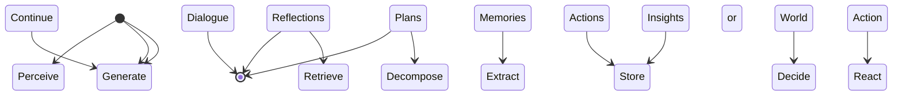
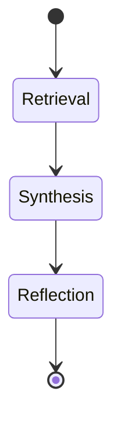

The paper introduces the concept of generative agents, which are computational software agents that simulate believable human behavior. These agents wake up, perform daily activities, form opinions, initiate conversations, and plan their behavior based on past experiences. The paper describes an architecture that extends a large language model to store and synthesize the agent's memories, and retrieve them dynamically to plan behavior. The generative agents are instantiated in an interactive sandbox environment inspired by The Sims, where users can observe and interact with the agents using natural language. The paper presents an evaluation of the generative agents, showing that they produce believable individual and emergent social behaviors. The architecture and interaction patterns introduced in the paper enable the creation of believable simulations of human behavior in various applications. The paper also discusses the ethical and societal risks of generative agents and suggests ways to mitigate these risks.

<div style="display: flex; flex-direction: column; gap: 25px; padding: 20px">


</div>
The text discusses the concept of creating believable agents in the context of simulations and games. Believable agents are designed to exhibit emergent behaviors through social interactions with users or other agents. These agents have historically been developed for intelligent game NPCs, with the goal of enhancing player experiences and enabling emergent narratives and social interactions. However, creating believable agents in open-world environments has been a challenge.

The text explores different approaches to creating believable agents, such as rule-based approaches and learning-based approaches. Rule-based approaches, like finite-state machines and behavior trees, involve manually crafting the agent's behavior. While these approaches can handle rudimentary social interactions, they are limited in their ability to comprehensively address the breadth of possible interactions in an open world.

Learning-based approaches, such as reinforcement learning, have achieved superhuman performance in games with definable rewards. However, they have not yet addressed the challenge of creating believable agents in open-world environments.

The text also discusses cognitive architectures, which aim to support a comprehensive set of cognitive functions. These architectures have been used to create agents with robust behavior in non-open-world contexts. However, they are limited in their ability to generate new behavior.

The text suggests that large language models offer an opportunity to create believable agents by synthesizing memories into behavior. These models encode a wide range of human behavior and can generate believable behavior when prompted with a narrowly defined context. The text proposes an agent architecture that handles retrieval of past experiences and combines them with the agent's current context and plans.

To illustrate the affordances of generative agents, the text describes a sandbox world called Smallville. In this world, generative agents are instantiated as characters with sprite avatars. They interact with the world through their actions and with each other through natural language communication. The agents can communicate with each other and with users, who can steer the simulation and intervene through conversation or directives.

The text also explains the environmental interaction in Smallville, which includes various spaces and objects. Agents can move around the world, enter and leave buildings, and approach other agents. Users and agents can influence the state of objects in the world, and users can reshape an agent's environment.

Overall, the text highlights the challenges and opportunities in creating believable agents and introduces the concept of using large language models to synthesize memories into behavior. The Smallville sandbox world serves as an example to demonstrate the affordances and interactions of generative agents.


The text describes a generative agent architecture that aims to simulate human behavior in an open world. The agents in this architecture interact with each other and react to changes in the environment based on their current situation and past experiences. The architecture includes a memory stream that maintains a comprehensive record of an agent's experiences, which is used to retrieve relevant memories for decision-making. The retrieval function considers recency, importance, and relevance to select the most relevant memories. The architecture also includes mechanisms for reflection, allowing agents to make inferences and maintain long-term coherence. The behavior of generative agents is demonstrated through examples of their interactions and coordination in a sandbox world. The architecture utilizes a large language model, such as GPT-3.5 Turbo, to generate behavior based on the retrieved memories and current situation. The architecture is designed to be flexible and can be adapted to future improvements in language models.


The text describes an approach to creating generative agents that can reflect on their observations and make plans for future actions. The agents use a combination of memories, reflections, and plans to guide their behavior.

To generate reflections, the agents query a language model with recent memories and generate high-level questions. They then retrieve relevant memories and use the language model to extract insights from those memories. These insights are stored as reflections in the agent's memory stream.

Plans describe a sequence of actions for the agent and help keep their behavior consistent over time. The agents generate plans by recursively decomposing a rough sketch of the day's agenda into finer-grained actions. These plans are stored in the memory stream and can be updated or changed as needed.

The agents operate in an action loop where they perceive the world around them and store those observations in their memory stream. They use these observations to decide whether to continue with their existing plan or react to the current situation. If a reaction is prompted, the agents generate dialogue based on their memories about each other.

The sandbox environment is implemented using the Phaser web game development framework. The environment is represented as a tree data structure, which is converted into natural language to pass to the generative agents. The agents interact with the environment through a server that maintains information about each agent and updates the sandbox objects based on the agents' actions.

Overall, this approach allows generative agents to reflect on their observations, make plans, and interact with the sandbox environment in a coherent and believable manner.

Diagram:


Python code:
```python
class Agent:
    def __init__(self, name, traits):
        self.name = name
        self.traits = traits
        self.memory_stream = []
        self.reflections = []
        self.plans = []

    def generate_reflections(self):
        recent_memories = self.memory_stream[-100:]
        questions = language_model.query(recent_memories, "What are 3 most salient high-level questions?")
        for question in questions:
            relevant_memories = retrieve_memories(question)
            insights = language_model.extract_insights(relevant_memories)
            reflection = Reflection(question, insights)
            self.reflections.append(reflection)

    def generate_plans(self):
        rough_plan = language_model.generate_rough_plan(self.summary_description, self.previous_day_summary)
        self.plans = decompose_actions(rough_plan)

    def perceive_world(self):
        observations = sandbox_server.get_observations()
        self.memory_stream.extend(observations)

    def decide_action(self):
        if self.existing_plan:
            if language_model.should_continue(self.existing_plan, self.memory_stream):
                return self.existing_plan
            else:
                return self.react()
        else:
            return self.generate_new_plan()

    def react(self):
        observation = self.memory_stream[-1]
        context_summary = generate_context_summary(observation)
        reaction = language_model.generate_reaction(context_summary)
        return reaction

    def generate_dialogue(self):
        dialogue_history = []
        while True:
            if self.is_my_turn():
                my_utterance = language_model.generate_utterance(self.memory_stream, dialogue_history)
                dialogue_history.append(my_utterance)
            else:
                other_agent_utterance = language_model.generate_utterance(self.memory_stream, dialogue_history)
                dialogue_history.append(other_agent_utterance)
            if should_end_dialogue(dialogue_history):
                break
        return dialogue_history
```


The text describes a system of generative agents that navigate and interact with a virtual environment. Each agent builds a tree representation of the environment as they navigate it, updating the tree as they perceive new areas. To determine the appropriate location for each action, the agents traverse their environment tree and flatten a portion of it into natural language to prompt the language model. The agents use traditional game path algorithms to animate their movement to the indicated location. When an agent executes an action on an object, the language model is prompted to determine the resulting change in the object's state.

The text also discusses the evaluation of generative agents. The evaluation consists of two stages: a controlled evaluation and an end-to-end analysis. In the controlled evaluation, the agents are individually assessed to determine if they generate believable behavior in specific contexts. The agents are interviewed and asked questions in five key areas: self-knowledge, memory, plans, reactions, and reflections. Human evaluators rank the believability of the agents' responses. The full generative agent architecture is found to produce the most believable behavior compared to ablated architectures and human crowdworkers. The agents are able to remember past experiences and generate responses consistent with their self-knowledge, but there are instances where they fail to retrieve the correct information from their memory.

To summarize the text, it describes a system of generative agents that navigate and interact with a virtual environment. The agents build a tree representation of the environment and use it to determine the appropriate locations for their actions. The agents also prompt a language model to determine the resulting changes in object states. The evaluation of the generative agents shows that the full architecture produces the most believable behavior. The agents are able to remember past experiences and generate responses consistent with their self-knowledge, but there are instances where they fail to retrieve the correct information from their memory.


The text describes the behavior of generative agents in a simulation. These agents have the ability to retrieve and synthesize information from their memory to generate responses. However, they may sometimes retrieve incomplete or embellished memories, leading to uncertainty or false information. The agents also have the ability to reflect on their experiences, which helps them make decisions and provide more accurate responses.

In an evaluation of the generative agents, emergent social behaviors were observed. The agents were able to spread information, form relationships with each other, and coordinate their actions. For example, the agents spread information about a mayoral candidacy and a Valentine's Day party. They also formed new relationships and coordinated their attendance at the party.

However, there were also some limitations and errors in the agents' behavior. They sometimes chose less typical locations for their actions, misunderstood proper behavior in certain locations, and exhibited overly formal or cooperative behavior. These issues could be addressed through improvements in memory retrieval, incorporating norms into the agents' knowledge, and fine-tuning their behavior.

The applications of generative agents are wide-ranging, including social prototyping, virtual reality experiences, and human-centered design. These agents can simulate human behavior and provide personalized and effective technological experiences.

Future work can focus on enhancing the modules of the generative agent architecture, improving performance and cost-effectiveness, and conducting longer-term evaluations. Varying the underlying models and hyperparameters can also provide insights into the agents' behavior. Overall, generative agents have the potential to revolutionize various fields and create new interactive experiences.

Diagram:

This diagram illustrates the flow of information and processes in the generative agent architecture. The agents start by retrieving information from their memory, then synthesize this information to generate responses. They can also reflect on their experiences to make decisions. This cycle continues indefinitely.


The text discusses the potential risks and ethical concerns associated with generative agents, as well as the architecture and applications of these agents. Generative agents are computational entities that simulate human behavior and can be used in various interactive applications. However, there are several risks that need to be addressed. One risk is the potential for bias in the behavior or stereotypes generated by these agents. To mitigate this, further work on value alignment is necessary. Generative agents may also fail to generate believable behavior for marginalized populations due to data deserts. Additionally, there are concerns about the robustness of generative agents, as they may be vulnerable to prompt hacking, memory hacking, and hallucination. Future research should focus on testing these robustness issues and developing mitigations.

From an ethical standpoint, generative agents raise concerns about people forming parasocial relationships with them, even when such relationships may not be appropriate. To address this, generative agents should explicitly disclose their nature as computational entities, and developers should ensure that the agents are value-aligned to avoid engaging in inappropriate behaviors. Another ethical concern is the impact of errors, as incorrect inferences or predictions by generative agents could lead to annoyance or harm. Platforms hosting generative agents should maintain an audit log of inputs and outputs to detect and intervene against malicious use. Over-reliance on generative agents is also a risk, as developers or designers may displace the role of humans and system stakeholders in the design process. Generative agents should never be a substitute for real human input in studies and design processes.

In conclusion, generative agents have the potential to revolutionize human-computer interaction, but it is important to address the ethical concerns associated with their use. By ensuring value alignment, mitigating biases, and maintaining transparency, generative agents can be deployed ethically and responsibly.


The text provided is a list of references from various sources. It includes academic papers, books, technical reports, and articles related to topics such as artificial intelligence, human-computer interaction, game AI, and language models. The references cover a wide range of subjects, including embodied reasoning, interactive characters, prompt-based prototyping, user interface analysis techniques, combat flight simulation, knowledge-intensive NLP, behavior trees, socially situated artificial intelligence, and more. The list also includes references to specific AI architectures, cognitive models, and evaluation methods. These references can be used as a starting point for further research in these areas.


