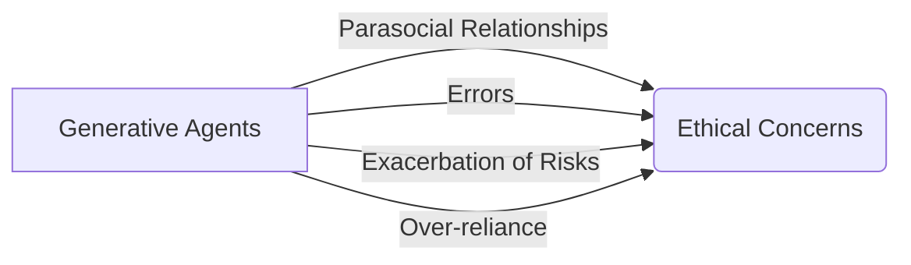

# Generative Agents: Interactive Simulacra of Human Behavior

<div style="display: flex; flex-direction: column; gap: 25px; padding: 20px">

<p>Figure 1: Generative agents create believable simulacra of human behavior for interactive applications. In this work, we demon-
strate generative agents by populating a sandbox environment, reminiscent of The Sims, with twenty-five agents</p>
</div>
The paper introduces the concept of generative agents, which are computational software agents that simulate believable human behavior. These agents wake up, perform daily activities, form opinions, initiate conversations, and plan their behavior based on past experiences. The paper describes an architecture that extends a large language model to store and synthesize the agent's memories, and retrieve them dynamically to plan behavior. The generative agents are instantiated in an interactive sandbox environment inspired by The Sims, where users can observe and interact with the agents using natural language. The paper presents an evaluation of the generative agents, showing that they produce believable individual and emergent social behaviors. The architecture and interaction patterns introduced in the paper enable the creation of believable simulations of human behavior in various applications. The paper also discusses the ethical and societal risks of generative agents and suggests ways to mitigate these risks.


<div style="display: flex; flex-direction: column; gap: 25px; padding: 20px">

<p>Figure 2: The Smallville sandbox world, with areas labeled. The root node describes the entire world, children describe areas
(e</p>
</div>
Believable agents are computer programs that simulate human behavior in order to enhance player experiences in games and interactive fictions. These agents can be created using rule-based approaches or learning-based approaches. Rule-based approaches involve manually crafting the agent's behavior using finite-state machines or behavior trees. While these approaches are simple and dominant, they are limited in their ability to handle complex interactions and cannot perform new procedures. Learning-based approaches, such as reinforcement learning, allow agents to learn their behavior and have achieved superhuman performance in certain games. However, these approaches have not yet addressed the challenge of creating believable agents in open-world environments.

Cognitive architectures, such as SOAR and ACT-R, aim to support a comprehensive set of cognitive functions and have been used to create believable agents in non-open-world contexts. These agents operate in perceive-plan-act cycles and rely on manually crafted procedural knowledge. While they exhibit robust behavior, they are limited in their ability to seek new behavior.

Creating believable agents remains an open problem, but large language models offer an opportunity to re-examine this challenge. These models encode a wide range of human behavior and can be used to generate believable behavior when prompted with a narrowly defined context. However, existing approaches rely on first-order templates and do not fully leverage the models' capacity for past experience.

In order to explore the affordances of generative agents, a sandbox world called Smallville is introduced. This world features a community of 25 unique agents, each represented by a sprite avatar. Agents interact with the world through their actions and with each other through natural language communication. Users can steer the simulation and intervene by communicating with the agents or issuing directives. The agents also interact with the environment, moving around the world and influencing the state of objects.

Overall, the challenge of creating believable agents is still ongoing, but large language models show promise in synthesizing memories into believable behavior. The Smallville sandbox world provides a platform to explore the affordances and interactions of generative agents.


</div>
The text describes a generative agent architecture that aims to simulate human behavior in an open world. The architecture includes a memory stream that maintains a comprehensive record of the agent's experiences, a retrieval function that selects relevant memories for the agent to consider, and a reflection mechanism that allows the agent to make inferences and generalize from its past experiences.

The architecture is demonstrated through a "Day in the Life" example of an agent named John Lin. John wakes up in the morning, completes his morning routine, interacts with his family members, and goes to work. The example shows how the agent's behaviors evolve over time as it interacts with the environment and other agents.

The text also discusses emergent social behaviors in the generative agent system. Agents can engage in dialogue and spread information to each other. They can form new relationships and remember their interactions with other agents. They can also coordinate joint activities, such as planning a party or organizing an event.

To address the challenges of long-term planning and coherence, the architecture combines a large language model with mechanisms for synthesizing and retrieving relevant information. The retrieval function considers recency, importance, and relevance to select the most relevant memories for the agent's current situation. The reflection mechanism allows the agent to make inferences and generalize from its past experiences.

Overall, the generative agent architecture provides a framework for behavior in an open world, allowing agents to engage in interactions, react to changes in the environment, and simulate human-like behavior.


<div style="display: flex; flex-direction: column; gap: 25px; padding: 20px">

<p>Figure 3: A morning in the life of a generative agent, John Lin. John wakes up around 6 am and completes his morning routine,
which includes brushing his teeth, taking a shower, and eating breakfast</p>
</div>
Figure 7: A reflection tree for Klaus Mueller. The agent’s observations of the world, represented in the leaf nodes, are recursively synthesized to derive Klaus’s self-notion that he is highly dedicated to his research.

In order to improve the agent's decision-making process, a second type of memory called "reflection" is introduced. Reflections are higher-level, abstract thoughts generated by the agent. They are included alongside other observations when retrieval occurs. Reflections are generated periodically based on the importance scores of the agent's latest events. The agent reflects on questions that can be asked given its recent experiences. The agent queries a language model with the 100 most recent records in its memory stream to generate candidate questions. These questions are then used as queries for retrieval, and relevant memories are gathered for each question. The language model is prompted to extract insights and cite the records that served as evidence for the insights. The generated insights are stored as reflections in the memory stream.

The agent can reflect not only on its observations but also on other reflections. This allows the agent to generate trees of reflections, where the leaf nodes represent base observations and the non-leaf nodes represent higher-level thoughts. This process helps the agent derive a deeper understanding of itself and its environment.

Here is an example of a reflection tree for Klaus Mueller:


In this example, Klaus Mueller's observation of writing a research paper leads to the reflection that he is dedicated to research. His observation of enjoying reading on gentrification leads to the reflection that he is interested in urban development. These reflections help Klaus understand himself better and make more informed decisions.

In addition to reflections, generative agents also use plans to ensure coherent and believable behavior over time. Plans describe a future sequence of actions for the agent and include a location, starting time, and duration. Plans are stored in the memory stream and are considered alongside observations and reflections when deciding how to behave. Agents can change their plans if needed.

To create plans, the agent starts with a rough sketch of the day's agenda in broad strokes. The agent prompts a language model with its summary description and a summary of its previous day to generate this initial plan. The plan is then recursively decomposed to create finer-grained actions. This process helps the agent create realistic and interesting plans that match its goals and disposition.

Here is an example of a plan for Eddy Lin:

```
1) Wake up and complete the morning routine at 8:00 am
2) Go to Oak Hill College to take classes starting at 10:00 am
3) Work on the new music composition from 1:00 pm to 5:00 pm
4) Have dinner at 5:30 pm
5) Finish school assignments and go to bed by 11:00 pm
```

This plan provides a structured outline of Eddy's day, dividing it into chunks of actions. The plan is then recursively decomposed into more detailed actions, ensuring that Eddy's behavior is consistent and believable over time.

Overall, the combination of reflections and plans helps generative agents make more informed decisions and behave in a coherent and believable manner.


<div style="display: flex; flex-direction: column; gap: 25px; padding: 20px">

<p>Figure 4: At the beginning of the simulation, one agent is ini-
tialized with an intent to organize a Valentine’s Day party.
Despite many possible points of failure in the ensuring
chain of events—agents might not act on that intent, might
not remember to tell others, might not remember to show
up—the Valentine’s Day party does in fact occur, with a num-
ber of agents gathering and interacting</p>
</div>
Agents in a sandbox environment build individual tree representations of the environment as they navigate it. These trees capture the spaces and objects that the agent should be aware of. The agents update their trees as they perceive new areas. To determine the appropriate location for each action, the agent's environment tree is traversed and a portion of it is flattened into natural language to prompt the language model. The model then finds the most suitable area for the action. This process is repeated recursively until a leaf node is reached. Traditional game path algorithms are used to animate the agent's movement to the indicated location. When an agent executes an action on an object, the language model is prompted to ask what happens to the state of the object. The state of the object is then updated based on the model's response.

To evaluate the generative agents, a controlled evaluation is conducted. The agents are interviewed to assess their ability to remember past experiences, generate plans, react appropriately to unexpected events, and reflect on their performance. The agents are asked questions in five key areas: self-knowledge, memory, plans, reactions, and reflections. Human evaluators rank the believability of the agents' responses. The full generative agent architecture produces the most believable behavior compared to ablated architectures and human crowdworkers. The agents are able to remember past experiences and answer questions consistently, but there are instances where they fail to retrieve the correct information from their memory. Overall, the generative agents demonstrate the capacity to generate believable behavior based on their environment and experiences.


<div style="display: flex; flex-direction: column; gap: 25px; padding: 20px">

<p>Figure 5: Our generative agent architecture. Agents perceive their environment, and all perceptions are saved in a compre-
hensive record of the agent’s experiences called the memory stream</p>
</div>
The text describes the behavior of generative agents in a simulation called Smallville. The agents are designed to interact with each other and exhibit emergent social behaviors. The agents retrieve information from their memory, but sometimes they only retrieve fragments of memories, leading to uncertainty and hallucinations. The agents can also embellish their knowledge based on the world knowledge encoded in the language model. Reflection is important for the agents to make decisions that require deeper synthesis of their experiences.

In the simulation, the agents exhibited emergent behaviors such as information diffusion, relationship formation, and agent coordination. The spread of information was measured by asking the agents if they knew about certain events, and the network density was calculated to measure relationship formation. The agents were also able to coordinate their behavior for a Valentine's Day party organized by one of the agents.

However, there were some limitations and errors observed in the simulation. The agents sometimes chose less typical locations for their actions, leading to less believable behavior. There were also instances where the agents misclassified proper behavior, such as entering a closed store or assuming a bathroom could accommodate multiple people. The agents' behavior was also influenced by instruction tuning, which made them overly polite and cooperative.

The text suggests that generative agents have potential applications in various domains, such as social prototyping, virtual reality, and human-centered design. Future work can focus on improving the modules of the generative agent architecture, enhancing performance and cost-effectiveness, and conducting longer-term evaluations to understand the agents' capabilities and limitations.


The paper discusses the potential risks and ethical concerns associated with generative agents, which are interactive computational agents that simulate human behavior. One risk is the formation of parasocial relationships between users and generative agents, where users may anthropomorphize the agents or attach human emotions to them. To mitigate this risk, the paper proposes two principles: explicit disclosure of the agents' nature as computational entities and value alignment to ensure appropriate behavior. Another risk is the impact of errors, which could lead to annoyance or harm. The paper suggests following best practices in human-AI design to understand and mitigate errors. Generative agents may also exacerbate existing risks associated with generative AI, such as deepfakes and misinformation generation. To address this, the paper recommends maintaining an audit log of inputs and outputs to detect and intervene against malicious use. Lastly, there is a risk of over-reliance on generative agents, where developers or designers might replace human input in the design process. The paper emphasizes that generative agents should never be a substitute for real human input and should only be used to prototype ideas in the early stages of design. By adhering to these principles, the deployment of generative agents can be ethical and socially responsible.

Diagram:



The text is a list of references from various sources related to artificial intelligence, human-computer interaction, and game development. It includes papers, articles, books, and technical reports that cover topics such as interactive narrative, behavior trees, AI agents in virtual worlds, and human-AI interaction. The references provide a wealth of information for researchers and practitioners in these fields. One notable paper is "Inner Monologue: Embodied Reasoning through Planning with Language Models" by Andy Zeng et al., which explores the use of language models for embodied reasoning. Another interesting paper is "Socially Situated Artificial Intelligence Enables Learning from Human Interaction" by Ranjay Krishna et al., which discusses how AI can learn from human interaction. Overall, the references cover a wide range of topics and can serve as valuable resources for those interested in AI, HCI, and game development.


