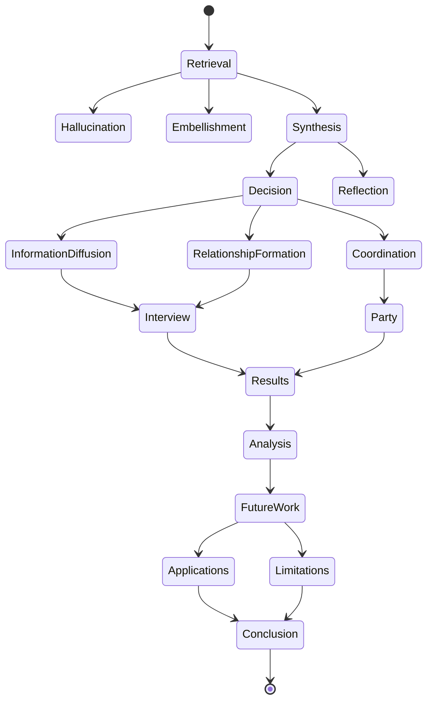
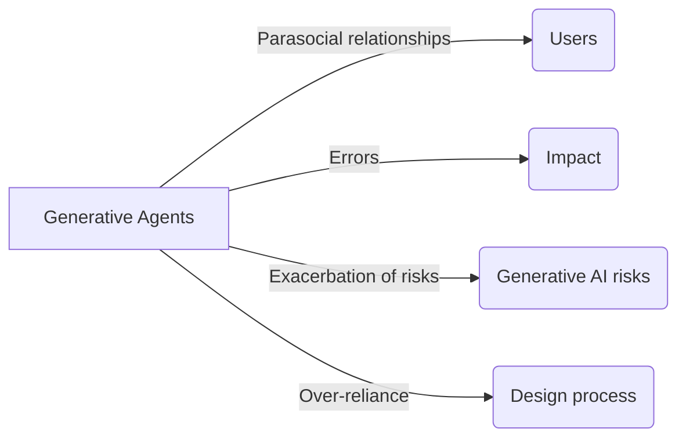

# Generative Agents: Interactive Simulacra of Human Behavior

Figure 1: Generative agents create believable simulacra of human behavior for interactive applications. In this work, we demon-
strate generative agents by populating a sandbox environment, reminiscent of The Sims, with twenty-five agents

The paper introduces the concept of generative agents, which are computational software agents that simulate believable human behavior. These agents wake up, perform daily activities, form opinions, initiate conversations, and plan their behavior based on past experiences. The paper describes an architecture that extends a large language model to store and synthesize the agent's memories, and retrieve them dynamically to plan behavior. The authors instantiate generative agents in an interactive sandbox environment inspired by The Sims, where users can observe and interact with a small town of twenty-five agents using natural language. The evaluation shows that these generative agents produce believable individual and emergent social behaviors. The paper also discusses the architecture's components and their contributions to the believability of agent behavior. The authors highlight the potential applications of generative agents in various domains and discuss the ethical and societal risks associated with their use. The paper concludes by presenting the contributions of the work, including the introduction of generative agents, the novel architecture, and the evaluations conducted. The authors situate their work within the existing literature on human-AI interaction and believable proxies of human behavior.

Figure 2: The Smallville sandbox world, with areas labeled. The root node describes the entire world, children describe areas
(e

Believable agents are computer programs that simulate human behavior in order to enhance player experiences in games and interactive fictions. These agents can be created using rule-based approaches or learning-based approaches. Rule-based approaches involve manually crafting the agent's behavior using finite-state machines or behavior trees. Learning-based approaches, such as reinforcement learning, allow the agents to learn their behavior through training. However, current approaches have limitations in creating believable agents in open-world environments.

Cognitive architectures, such as SOAR and ACT-R, aim to support a comprehensive set of cognitive functions in believable agents. These architectures maintain memories, fill them with symbolic structures, and operate in perceive-plan-act cycles. While they exhibit robust behavior, they are limited to manually crafted procedural knowledge and lack the ability to seek new behavior.

Large language models, such as GPT-3, offer an opportunity to create believable agents by leveraging their ability to generate human-like behavior. These models encode a wide range of human behavior and can be used to generate behavior based on a given context. However, existing approaches rely on first-order templates and lack conditioning on past experiences.

To explore the potential of large language models in creating believable agents, the authors propose a generative agent architecture. This architecture combines the use of large language models with a dynamic memory retrieval mechanism. The agents are instantiated as characters in a sandbox world and interact with each other through natural language communication. Users can also intervene in the simulation by communicating with the agents or issuing directives.

The Smallville sandbox world is a simple environment where the generative agents reside. Each agent is represented by a sprite avatar and has a natural language description of their identity and relationships with other agents. The agents interact with the world through their actions, which are translated into concrete movements in the sandbox. They also communicate with each other in natural language and can be controlled by users through conversation or directives.

The generative agent architecture combines the use of large language models with a dynamic memory retrieval mechanism. The agents' behavior is conditioned not only on their current environment but also on past experiences. The architecture allows for the generation of believable behavior that is influenced by the agents' memories and plans.

Overall, the authors propose a novel approach to creating believable agents using large language models. The generative agent architecture offers a way to synthesize memories into behavior and enables interactions in a sandbox world. This approach has the potential to advance the field of believable agents and create more immersive experiences in games and interactive fictions.

Diagram:

Figure 2: The Smallville sandbox world, with areas labeled. The root node describes the entire world, children describe areas (e.g., houses, cafe, stores), and leaf nodes describe objects (e.g., table, bookshelf). Agent remember a subgraph reflecting the parts of the world they have seen, in the state that they saw them.

The text describes a generative agent architecture that aims to simulate human behavior in an open world. The architecture includes a memory stream that maintains a comprehensive record of the agent's experiences. The memory stream consists of observations, which are events directly perceived by the agent. The architecture also includes a retrieval function that selects relevant memories from the memory stream based on recency, importance, and relevance to the current situation. The selected memories are used to condition the output of a language model, which generates behavior for the agent. The architecture also incorporates mechanisms for long-term planning and coherence.

To illustrate the behavior of generative agents, the text provides an example "Day in the Life" of an agent named John Lin. John wakes up in the morning, completes his morning routine, and interacts with his family members. The text shows a conversation between John and his son Eddy, as well as a conversation between John and his wife Mei. These interactions demonstrate how generative agents can engage in dialogue and form relationships.

The text also discusses emergent social behaviors in the generative agent system. Agents can engage in information diffusion by sharing information with each other through dialogue. The text provides an example conversation between two agents, Sam and Tom, where Sam informs Tom about his candidacy in a local election. Agents also form new relationships over time and remember their interactions with other agents. The text gives an example of an agent named Sam running into another agent named Latoya in a park and later referencing that interaction in a conversation. Additionally, generative agents can coordinate with each other to plan and execute joint activities. The text describes an example where an agent named Isabella plans a Valentine's Day party and invites friends and customers to attend.

The generative agent architecture is depicted in a diagram, which shows the flow of information from the environment to the memory stream to the language model. The architecture includes mechanisms for perception, memory retrieval, action determination, long-term planning, and reflection.

Overall, the generative agent architecture allows agents to simulate human-like behavior by leveraging past experiences and interacting with the environment and other agents. The architecture addresses challenges related to memory management, long-term planning, and coherence.

Figure 3: A morning in the life of a generative agent, John Lin. John wakes up around 6 am and completes his morning routine,
which includes brushing his teeth, taking a shower, and eating breakfast

Figure 7: A reflection tree for Klaus Mueller. The agent’s observations of the world, represented in the leaf nodes, are recursively synthesized to derive Klaus’s self-notion that he is highly dedicated to his research.

In order to improve the agent's decision-making process, a second type of memory called "reflection" is introduced. Reflections are higher-level, abstract thoughts generated by the agent. They are included alongside other observations when retrieval occurs. Reflections are generated periodically based on the importance scores of the agent's latest events. The agent reflects on questions that can be asked given its recent experiences. The agent queries a language model with the 100 most recent records in its memory stream to generate candidate questions. These questions are then used as queries for retrieval, and relevant memories are gathered for each question. The language model is prompted to extract insights and cite the records that served as evidence for the insights. The generated insights are stored as reflections in the memory stream.

The agent can reflect not only on its observations but also on other reflections. This allows the agent to generate trees of reflections, where the leaf nodes represent base observations and the non-leaf nodes represent higher-level thoughts. This process helps the agent derive a deeper understanding of itself and its environment.

To ensure coherent and believable behavior over a longer time horizon, planning is essential. Plans describe a future sequence of actions for the agent and help keep its behavior consistent. Plans include a location, a starting time, and a duration. They are stored in the memory stream and considered alongside observations and reflections when deciding how to behave. Plans can be adjusted and changed midstream if needed.

The process of planning starts with creating a rough sketch of the agent's plan for the day, divided into chunks of actions. This initial plan is then recursively decomposed to create finer-grained actions. The agent's existing plan is updated based on its observations, and if an interaction between agents is indicated, their dialogue is generated.

The Smallville sandbox game environment is built using the Phaser web game development framework. The sandbox environment is represented as a tree data structure, which is converted into natural language to pass to the generative agents. The sandbox server maintains a JSON data structure that contains information about each agent in the sandbox world and updates the status of sandbox objects based on the agents' actions. The sandbox server also sends relevant information to each agent's memory based on their visual range.

Overall, the combination of reflections and planning allows generative agents to make more informed and coherent decisions in the sandbox environment.

Figure 4: At the beginning of the simulation, one agent is ini-
tialized with an intent to organize a Valentine’s Day party.
Despite many possible points of failure in the ensuring
chain of events—agents might not act on that intent, might
not remember to tell others, might not remember to show
up—the Valentine’s Day party does in fact occur, with a num-
ber of agents gathering and interacting

Agents in a sandbox environment build individual tree representations of the environment as they navigate it. These trees capture the spaces and objects that the agent should be aware of. The agents update their trees as they perceive new areas. To determine the appropriate location for each action, the agent's environment tree is traversed and a portion of it is flattened into natural language to prompt the language model. The model then finds the most suitable area for the action. This process is repeated recursively until a leaf node is reached. Traditional game path algorithms are used to animate the agent's movement to the indicated location. When an agent executes an action on an object, the language model is prompted to ask what happens to the state of the object. The state is then updated based on the model's response.

To evaluate the generative agents, a controlled evaluation is conducted. The agents are individually assessed to determine if they generate believable behavior in specific contexts. The agents are interviewed and asked questions in five key areas: self-knowledge, memory, plans, reactions, and reflections. The believability of their responses is measured as the dependent variable. The evaluation also includes an end-to-end analysis of the agent community over two full days to study their emergent behavior as a collective. Human evaluators watch replays of the agents' lives and rank the believability of their responses.

The results of the evaluation show that the full architecture of generative agents produces the most believable behavior. Performance degrades with the removal of each component in the ablation conditions. Generative agents equipped with a complete memory module are capable of recalling past experiences and answering questions consistently. However, there are instances where the agents fail to retrieve the correct information from their memory. Overall, the generative agents demonstrate the capacity to generate believable behavior based on their environment and experiences.

Figure 5: Our generative agent architecture. Agents perceive their environment, and all perceptions are saved in a compre-
hensive record of the agent’s experiences called the memory stream

The text describes the behavior of generative agents in a simulation called Smallville. The agents are designed to interact with each other and exhibit emergent social behaviors. The agents retrieve information from their memory, but sometimes they only retrieve fragments of memories, leading to uncertainty and hallucinations. The agents can also embellish their knowledge based on the language model they use. The text also discusses the importance of reflection for synthesis, where agents can make decisions based on a deeper understanding of their experiences.

In the simulation, the agents exhibit emergent social behaviors such as information diffusion, relationship formation, and coordination. The spread of information is measured by asking the agents if they know about certain events or candidates. The agents also form relationships with each other based on their knowledge of other agents. The coordination is observed in the context of a Valentine's Day party, where agents choose to attend the party after hearing about it.

The results of the simulation show that the agents successfully exhibit emergent behaviors. The spread of information increases over time, relationships are formed among the agents, and coordination occurs for the party. However, there are also some limitations and errors in the behavior of the agents. For example, they may choose less typical locations for their actions or misinterpret certain norms. The text also discusses the potential applications of generative agents, such as social prototyping and human-centered design.

Overall, the simulation demonstrates the potential of generative agents to exhibit realistic social behaviors and opens up possibilities for future research and applications.

Diagram:

The paper discusses the potential risks and ethical concerns associated with generative agents, which are interactive computational agents that simulate human behavior. One risk is the formation of parasocial relationships between users and generative agents, where users may anthropomorphize the agents or attach human emotions to them. To mitigate this risk, the paper proposes two principles: explicit disclosure of the agents' nature as computational entities and value alignment to ensure appropriate behavior. Another risk is the impact of errors, which could lead to annoyance or harm. The paper suggests following best practices in human-AI design to understand and mitigate errors. Generative agents may also exacerbate existing risks associated with generative AI, such as deepfakes and misinformation generation. To address this, the paper recommends maintaining an audit log of inputs and generated outputs to detect and intervene against malicious use. Lastly, there is a risk of over-reliance on generative agents, where developers or designers might replace human input in the design process. The paper emphasizes that generative agents should never be a substitute for real human input and should only be used to prototype ideas in the early stages of design. By adhering to these principles, the deployment of generative agents can be ethical and socially responsible.

Diagram:

Reference:
- [42] Douglas Hofstadter. 1995. Fluid concepts and creative analogies: computer models of the fundamental mechanisms of thought. Basic Books.

The text is a list of references from various sources. It includes academic papers, books, technical reports, and online resources. The references cover a wide range of topics related to artificial intelligence, human-computer interaction, game development, and cognitive science. Some of the notable references include papers on embodied reasoning, interactive characters, language models, behavior trees, and AI in video games. The list also includes resources on user interface analysis techniques, intelligent agents, virtual humans, and natural language communication. The references provide a wealth of information for anyone interested in these fields.
