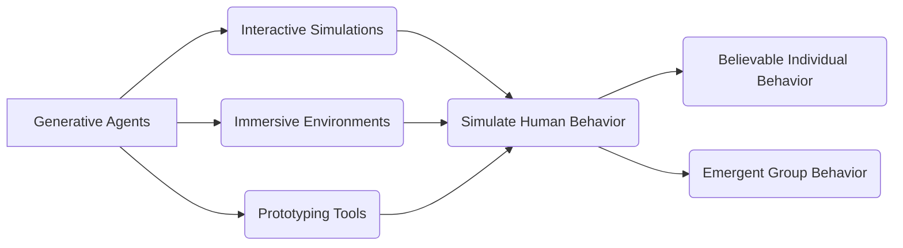
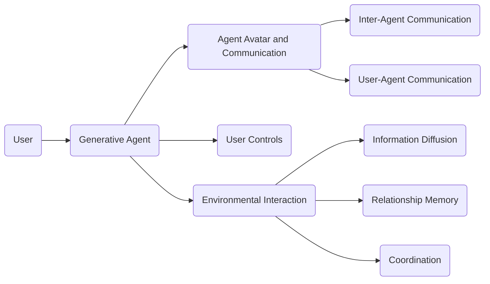

# Generative Agents: Interactive Simulacra of Human Behavior

<div style="display: flex; flex-direction: column; gap: 25px; padding: 20px">

<p>Figure 1: Generative agents create believable simulacra of human behavior for interactive applications. In this work, we demon-
strate generative agents by populating a sandbox environment, reminiscent of The Sims, with twenty-five agents</p>
</div>
<div style="display: flex; flex-direction: column; gap: 25px; padding: 20px">

<p>Figure 2: The Smallville sandbox world, with areas labeled. The root node describes the entire world, children describe areas
(e</p>
</div>
1.
Believable proxies of human behavior, called generative agents, can be created using computational software. These agents simulate human behavior in interactive applications and can be used in various domains such as immersive environments and prototyping tools. The agents wake up, perform daily activities, form relationships, and interact with the environment. To enable generative agents, an architecture is used that stores and synthesizes the agent's experiences and retrieves them to plan behavior. The agents are evaluated and shown to produce believable individual and group behaviors. This work introduces a new approach to creating simulations of human behavior using large language models and computational agents.





Certainly! Here's a Python class that represents a generative agent:

```python
class GenerativeAgent:
    def __init__(self, name):
        self.name = name
        self.experiences = []

    def wake_up(self):
        # Perform wake up routine
        pass

    def cook_breakfast(self):
        # Perform breakfast cooking routine
        pass

    def go_to_work(self):
        # Perform routine for going to work
        pass

    def form_relationships(self):
        # Form relationships with other agents
        pass

    def interact_with_environment(self):
        # Interact with the environment
        pass

    def remember(self, experience):
        self.experiences.append(experience)

    def reflect(self):
        # Synthesize memories into higher-level inferences
        pass

    def plan_behavior(self):
        # Plan behavior based on reflections and current environment
        pass

    def act(self):
        # Perform planned behavior
        pass
```

This class represents a generative agent with methods for performing various activities such as waking up, cooking breakfast, going to work, forming relationships, and interacting with the environment. The agent also has methods for remembering experiences, reflecting on memories, planning behavior, and acting accordingly.

<div style="display: flex; flex-direction: column; gap: 25px; padding: 20px">

<p>Figure 3: A morning in the life of a generative agent, John Lin. John wakes up around 6 am and completes his morning routine,
which includes brushing his teeth, taking a shower, and eating breakfast</p>
</div>
<div style="display: flex; flex-direction: column; gap: 25px; padding: 20px">

<p>Figure 2: The Smallville sandbox world, with areas labeled. The root node describes the entire world, children describe areas
(e</p>
</div>
2.
In the Smallville sandbox world, generative agents interact with each other and the environment. Each agent is represented by a sprite avatar and communicates through natural language. They can perform actions, such as writing or checking emails, which are translated into emojis above their avatars. Agents can also engage in conversations with each other using full natural language. Users can control the simulation by communicating with the agents or issuing directives as the agent's "inner voice". The environment includes various locations like a cafe, park, and houses, and agents can move around, enter buildings, and interact with objects. The agents remember their experiences and form relationships with other agents. They also coordinate activities, such as planning a Valentine's Day party. The generative agent architecture includes a memory stream that records all the agent's experiences and a retrieval function to retrieve relevant memories. The architecture also supports reflection, allowing agents to make inferences and generalize from their memories.





```python
class GenerativeAgent:
    def __init__(self, name, occupation, relationships):
        self.name = name
        self.occupation = occupation
        self.relationships = relationships

    def communicate(self, message):
        # Agent's communication logic
        pass

    def perform_action(self, action):
        # Agent's action logic
        pass

    def update_environment(self, environment):
        # Agent's interaction with the environment
        pass

    def remember(self, memory):
        # Agent's memory storage logic
        pass

    def retrieve_memory(self, query):
        # Agent's memory retrieval logic
        pass

    def reflect(self):
        # Agent's reflection and inference logic
        pass

    def coordinate(self, activity):
        # Agent's coordination with other agents
        pass

# Example usage
agent = GenerativeAgent("Isabella Rodriguez", "Barista", {"Maria Lopez": "Friend", "Tom Moreno": "Colleague"})
agent.communicate("I'm checking my emails.")
agent.perform_action("Make coffee")
agent.update_environment("Cafe")
agent.remember("Isabella Rodriguez is making coffee.")
agent.retrieve_memory("What did I do yesterday?")
agent.reflect()
agent.coordinate("Plan a Valentine's Day party")
```

This Python class represents a generative agent in the Smallville sandbox world. It has attributes like name, occupation, and relationships. The class includes methods for communication, performing actions, updating the environment, remembering experiences, retrieving memories, reflecting on past events, and coordinating activities with other agents.

3.
Generative agents are designed to produce believable behavior based on their environment and experiences. In a controlled evaluation, the agents were interviewed to assess their abilities in maintaining self-knowledge, retrieving memory, generating plans, reacting to unexpected events, and reflecting on their performance. The agents were compared to ablations that disabled their access to different types of memory (observation, reflection, and planning), as well as a human-generated condition. Human evaluators ranked the believability of the agents' responses.


<div style="display: flex; flex-direction: column; gap: 25px; padding: 20px">

<p>Figure 4: At the beginning of the simulation, one agent is ini-
tialized with an intent to organize a Valentine’s Day party.
Despite many possible points of failure in the ensuring
chain of events—agents might not act on that intent, might
not remember to tell others, might not remember to show
up—the Valentine’s Day party does in fact occur, with a num-
ber of agents gathering and interacting</p>
</div>
<div style="display: flex; flex-direction: column; gap: 25px; padding: 20px">

<p>Figure 5: Our generative agent architecture. Agents perceive their environment, and all perceptions are saved in a compre-
hensive record of the agent’s experiences called the memory stream</p>
</div>
4.
Generative agents have various applications beyond the sandbox demonstration presented in this work. They can be used for social prototyping in online forums, behavior in virtual reality metaverses, and even as social robots in physical spaces. Generative agents can also be used in the human-centered design process to create personalized and effective technological experiences. Future research can expand on the modules of the generative agent architecture and improve their performance and cost-effectiveness. Evaluations should be conducted over longer periods of time to gain a better understanding of the agents' capabilities and limitations. It is also important to address biases and vulnerabilities in generative agents and test their robustness.


5.
Generative agents are interactive computer programs that simulate human behavior. While they offer new possibilities for human-computer interaction, they also raise ethical concerns. One concern is that people may form parasocial relationships with generative agents and attribute human emotions to them. To address this, generative agents should explicitly disclose their nature as computational entities and be programmed to behave appropriately. Another concern is the potential for errors, which could lead to annoyance or harm. To mitigate this, best practices in human-AI design should be followed. Generative agents may also exacerbate risks associated with generative AI, such as deepfakes and misinformation. Platforms hosting generative agents should maintain an audit log to detect and intervene against malicious use. Finally, there is a risk of over-reliance on generative agents, which should never replace real human input in design processes. By following these principles, the deployment of generative agents can be ethical and socially responsible.


6.
Generative agents have been evaluated through individual interviews to assess their abilities in self-knowledge, memory, planning, reactions, and reflections. The agents were asked questions about themselves, their memories, their plans, their reactions to unexpected events, and their reflections on their experiences. The agents demonstrated coherence and consistency in their character, the ability to remember past experiences, the generation and maintenance of long-term and short-term plans, appropriate reactions to unexpected events, and meaningful reflections on their experiences.


