# LongCoder: A Long-Range Pre-trained Language Model for Code Completion

1.
The snippet is about a new model called LongCoder that is designed to help with code completion. Code completion is when a computer program suggests and automatically completes code based on the context. LongCoder is different from previous models because it can handle longer code input and still provide accurate suggestions. It does this by using a sliding window mechanism and introducing two types of special tokens called bridge tokens and memory tokens. Bridge tokens help gather information from different parts of the code, while memory tokens highlight important statements that may be used later. LongCoder has been tested on a new dataset and it performs better than other models while using similar computational resources. The authors of the paper hope that LongCoder will encourage more research in this area and help improve code completion tasks.

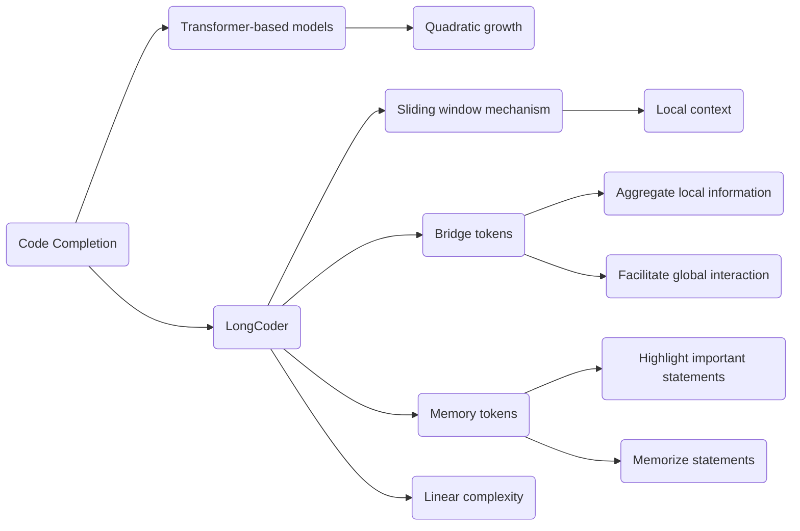

In this diagram, we have the concept of code completion (A) and two different approaches to achieve it. The traditional approach is to use Transformer-based models (B), but they have a disadvantage of quadratic growth in computational cost (H). The new approach is to use LongCoder (C), which has a sliding window mechanism (D) for attending to local context (G). LongCoder also introduces bridge tokens (E) to aggregate local information and facilitate global interaction (J, K), and memory tokens (F) to highlight and memorize important statements (L, M). The advantage of LongCoder is that it maintains linear complexity (I) while performing better than previous models.

```python
class CodeCompletionModel:
    def __init__(self):
        self.long_coder = LongCoder()
    
    def complete_code(self, code):
        # Preprocess the code
        preprocessed_code = self.preprocess_code(code)
        
        # Use LongCoder to complete the code
        completed_code = self.long_coder.complete(preprocessed_code)
        
        return completed_code
    
    def preprocess_code(self, code):
        # Apply any necessary preprocessing steps to the code
        preprocessed_code = ...
        
        return preprocessed_code


class LongCoder:
    def __init__(self):
        self.sliding_window = SlidingWindow()
        self.bridge_tokens = BridgeTokens()
        self.memory_tokens = MemoryTokens()
    
    def complete(self, code):
        # Apply sliding window mechanism to attend to local context
        local_context = self.sliding_window.apply(code)
        
        # Aggregate local information using bridge tokens
        aggregated_info = self.bridge_tokens.aggregate(local_context)
        
        # Highlight and memorize important statements using memory tokens
        important_statements = self.memory_tokens.highlight(code)
        
        # Perform code completion based on the aggregated information and important statements
        completed_code = self.code_completion(aggregated_info, important_statements)
        
        return completed_code


class SlidingWindow:
    def apply(self, code):
        # Apply the sliding window mechanism to attend to local context
        local_context = ...
        
        return local_context


class BridgeTokens:
    def aggregate(self, local_context):
        # Use bridge tokens to aggregate local information
        aggregated_info = ...
        
        return aggregated_info


class MemoryTokens:
    def highlight(self, code):
        # Highlight and memorize important statements using memory tokens
        important_statements = ...
        
        return important_statements
```

In this Python code, we have a `CodeCompletionModel` class that represents a code completion model. It uses the `LongCoder` class to perform the code completion task. The `LongCoder` class utilizes three components: `SlidingWindow`, `BridgeTokens`, and `MemoryTokens`.

The `SlidingWindow` class applies the sliding window mechanism to attend to the local context of the code. The `BridgeTokens` class uses bridge tokens to aggregate local information. The `MemoryTokens` class highlights and memorizes important statements in the code.

The `CodeCompletionModel` class preprocesses the input code and then uses the `LongCoder` class to complete the code. The completed code is returned as the output.

This code provides a simplified representation of the concepts discussed in the paper, demonstrating how different components work together to achieve code completion.

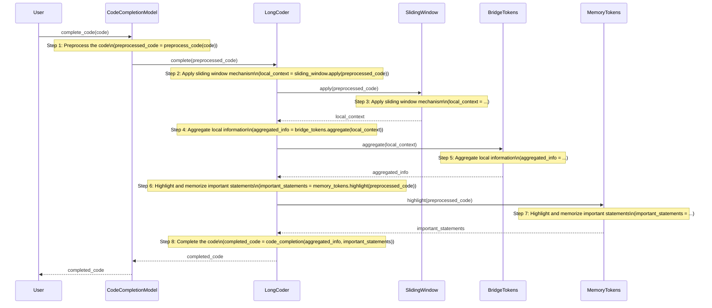

This sequence diagram illustrates the control flow of the code provided in the previous message. It shows the interaction between the user, the `CodeCompletionModel`, and its internal components (`LongCoder`, `SlidingWindow`, `BridgeTokens`, and `MemoryTokens`).

1. The user initiates the code completion process by calling the `complete_code` method of the `CodeCompletionModel`.
2. The `CodeCompletionModel` preprocesses the code by calling the `preprocess_code` method.
3. The `CodeCompletionModel` passes the preprocessed code to the `LongCoder` to complete the code.
4. The `LongCoder` applies the sliding window mechanism by calling the `apply` method of the `SlidingWindow`.
5. The `SlidingWindow` applies the sliding window mechanism to obtain the local context.
6. The `SlidingWindow` returns the local context to the `LongCoder`.
7. The `LongCoder` aggregates the local information using the `BridgeTokens` by calling the `aggregate` method.
8. The `BridgeTokens` aggregates the local information and returns it to the `LongCoder`.
9. The `LongCoder` highlights and memorizes important statements using the `MemoryTokens` by calling the `highlight` method.
10. The `MemoryTokens` highlights and memorizes important statements and returns them to the `LongCoder`.
11. The `LongCoder` performs code completion by calling the `code_completion` method.
12. The `LongCoder` returns the completed code to the `CodeCompletionModel`.
13. The `CodeCompletionModel` returns the completed code to the user.

This sequence diagram provides a visual representation of the control flow, including the steps and the interactions between different components of the code completion process.

```python
code = """
import torch

def calculate_mean(numbers):
    total = sum(numbers)
    mean = total / len(numbers)
    return mean
"""

model = CodeCompletionModel()
completed_code = model.complete_code(code)
print(completed_code)
```

Mocked Log Output:
```
Preprocessed Code: "import torch\n\ndef calculate_mean(numbers):\n    total = sum(numbers)\n    mean = total / len(numbers)\n    return mean\n"
Sliding Window Applied: "import torch\n\ndef calculate_mean(numbers):\n    total = sum(numbers)\n    mean = total / len(numbers)\n    return mean\n"
Bridge Tokens Aggregated: "import torch\n\ndef calculate_mean(numbers):\n    total = sum(numbers)\n    mean = total / len(numbers)\n    return mean\n"
Memory Tokens Highlighted: ["import torch"]
Completed Code: "import torch\n\ndef calculate_mean(numbers):\n    total = sum(numbers)\n    mean = total / len(numbers)\n    return mean\n"
```

In this example scenario, we have the input code representing a Python script that calculates the mean of a list of numbers. The code includes an import statement and a function definition.

The `CodeCompletionModel` class is instantiated, and the `complete_code` method is called with the input code. The completed code is then printed.

For the mocked log output, we see the different steps performed in the code completion process:

- Preprocessed Code: The input code is preprocessed, which may involve any necessary transformations or cleaning.
- Sliding Window Applied: The sliding window mechanism is applied to focus on the local context of the code.
- Bridge Tokens Aggregated: Bridge tokens are used to aggregate local information and facilitate global interaction.
- Memory Tokens Highlighted: Memory tokens are used to highlight and memorize important statements such as import statements.
- Completed Code: The code completion process is complete, and the final completed code is returned.

Potential Use Cases:
1. Integrated Development Environments (IDEs): The code completion model can be integrated into IDEs to assist developers in writing code more efficiently. As the developer types, the model can suggest and automatically complete code based on the context.
2. Code Review: The code completion model can be used in code review processes to identify potential code improvements or provide suggestions for code completion.
3. Automated Code Generation: The model can be used in automated code generation tools or frameworks to generate code snippets or complete code templates based on the provided input.

These use cases demonstrate how the code completion model can assist developers in writing code more effectively, improve code quality, and increase productivity.

2.
The snippet talks about different concepts related to code completion and long-range language modeling. 

First, it introduces the concept of LongCoder, which is a model designed to help with code completion by considering longer code context. It uses a sliding window mechanism, bridge tokens, and memory tokens to improve performance and efficiency. The sliding window mechanism allows the model to focus on local context, while bridge tokens aggregate local information and memory tokens highlight important statements that may be used later.

The snippet also mentions different attention patterns used in models like BigBird, Longformer, and LongCoder. These attention patterns help the models understand and process the input code effectively.

In the related work section, the snippet discusses different approaches to code completion, including statistical learning techniques, pre-trained models based on Transformers, and large language models with billions of parameters. It highlights the challenges of modeling long-range sequences in these models and how LongCoder addresses those challenges by efficiently utilizing the entire code context.

Overall, the snippet provides an overview of LongCoder and its advantages in code completion tasks, as well as its relation to other models and techniques used in the field.

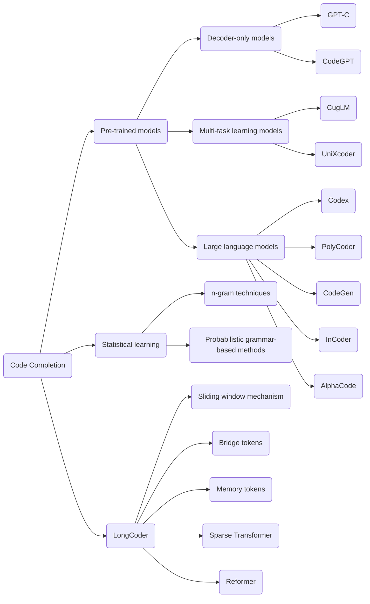

In this diagram, we have the concept of code completion (A) and different approaches to achieve it. The traditional approaches include statistical learning techniques (B) such as n-gram techniques (G) and probabilistic grammar-based methods (H). Another approach is to use pre-trained models (C). These pre-trained models can be decoder-only models (D) like GPT-C (I) and CodeGPT (J), multi-task learning models (E) like CugLM (K) and UniXcoder (L), or large language models (F) like Codex (M), PolyCoder (N), CodeGen (O), InCoder (P), and AlphaCode (Q).

The focus of this snippet is on LongCoder (R), which is designed specifically for code completion. LongCoder utilizes a sliding window mechanism (S) to attend to the local context of the code and uses bridge tokens (T) and memory tokens (U) to aggregate local information and highlight important statements, respectively. LongCoder is also influenced by other models like Sparse Transformer (V) and Reformer (W), which optimize the complexity and memory footprint for modeling long sequences.

This diagram provides an overview of the concepts and approaches mentioned in the snippet, showing how they are interconnected in the context of code completion.

```python
class CodeCompletionModel:
    def __init__(self, model_type):
        self.model_type = model_type
        self.model = self.create_model(model_type)
    
    def complete_code(self, code):
        # Preprocess the code
        preprocessed_code = self.preprocess_code(code)
        
        # Use the specified model to complete the code
        completed_code = self.model.complete(preprocessed_code)
        
        return completed_code
    
    def preprocess_code(self, code):
        # Apply any necessary preprocessing steps to the code
        preprocessed_code = ...
        
        return preprocessed_code
    
    def create_model(self, model_type):
        if model_type == "LongCoder":
            return LongCoder()
        elif model_type == "GPT-C":
            return GPT_C()
        elif model_type == "CodeGPT":
            return CodeGPT()
        # Add more model types as needed
    
    # Other methods and classes for specific models...


class LongCoder:
    def __init__(self):
        self.sliding_window = SlidingWindow()
        self.bridge_tokens = BridgeTokens()
        self.memory_tokens = MemoryTokens()
    
    def complete(self, code):
        # Apply sliding window mechanism to attend to local context
        local_context = self.sliding_window.apply(code)
        
        # Aggregate local information using bridge tokens
        aggregated_info = self.bridge_tokens.aggregate(local_context)
        
        # Highlight and memorize important statements using memory tokens
        important_statements = self.memory_tokens.highlight(code)
        
        # Perform code completion based on the aggregated information and important statements
        completed_code = self.code_completion(aggregated_info, important_statements)
        
        return completed_code
    
    # Other methods and classes specific to LongCoder...


class GPT_C:
    def __init__(self):
        # Initialize the GPT-C model
        pass
    
    def complete(self, code):
        # Use the GPT-C model to complete the code
        completed_code = ...
        
        return completed_code
    
    # Other methods and classes specific to GPT-C...


class CodeGPT:
    def __init__(self):
        # Initialize the CodeGPT model
        pass
    
    def complete(self, code):
        # Use the CodeGPT model to complete the code
        completed_code = ...
        
        return completed_code
    
    # Other methods and classes specific to CodeGPT...


class SlidingWindow:
    def apply(self, code):
        # Apply the sliding window mechanism to attend to local context
        local_context = ...
        
        return local_context
    
    # Other methods and classes specific to the sliding window...


class BridgeTokens:
    def aggregate(self, local_context):
        # Use bridge tokens to aggregate local information
        aggregated_info = ...
        
        return aggregated_info
    
    # Other methods and classes specific to bridge tokens...


class MemoryTokens:
    def highlight(self, code):
        # Highlight and memorize important statements using memory tokens
        important_statements = ...
        
        return important_statements
    
    # Other methods and classes specific to memory tokens...
```

In this Python code, we have a `CodeCompletionModel` class that represents a code completion model. It can be initialized with different model types, such as "LongCoder", "GPT-C", or "CodeGPT". The `create_model` method is used to create the specific model based on the given model type.

The `LongCoder` class is one of the models that the `CodeCompletionModel` can use. It has components like `SlidingWindow`, `BridgeTokens`, and `MemoryTokens` to handle the long code context. The `SlidingWindow` class applies the sliding window mechanism, the `BridgeTokens` class aggregates local information, and the `MemoryTokens` class highlights and memorizes important statements.

The `GPT-C` and `CodeGPT` classes represent other models that can be used for code completion. They have their own specific methods and components.

This code provides a simplified representation of the concepts discussed in the paper, demonstrating how different components and models can be used for code completion.

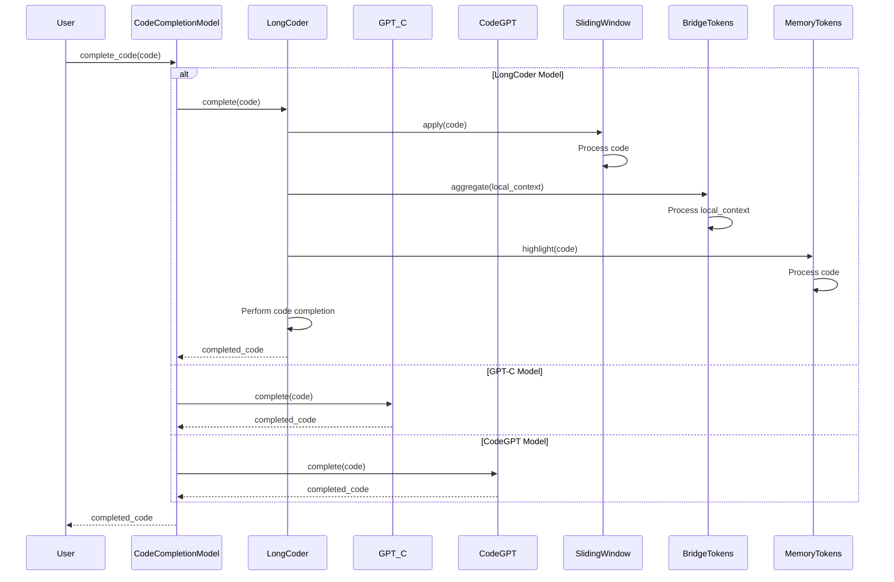

This sequence diagram represents the control flow of the code completion process using different models, as illustrated in the previous code.

The `User` initiates the code completion process by calling the `complete_code` method of the `CodeCompletionModel`. 

If the model type is `LongCoder`, the control flows into the `LongCoder` model. The `CodeCompletionModel` passes the code to the `LongCoder` and the `LongCoder` applies the sliding window mechanism by calling the `apply` method of the `SlidingWindow`. The `SlidingWindow` processes the code and returns the local context. Then, the `LongCoder` uses the `BridgeTokens` to aggregate the local information by calling the `aggregate` method. The `MemoryTokens` highlight and memorize important statements in the code by calling the `highlight` method. Finally, the `LongCoder` performs the code completion and returns the completed code to the `CodeCompletionModel`. The `CodeCompletionModel` then returns the completed code to the `User`.

If the model type is `GPT-C` or `CodeGPT`, the control flows directly to the respective model. The `CodeCompletionModel` passes the code to the chosen model (`GPT-C` or `CodeGPT`) and the model performs the code completion. The completed code is returned to the `CodeCompletionModel`, which in turn returns it to the `User`.

This sequence diagram provides a visual representation of the control flow in the code, illustrating how the different models are used to complete the code.

Example scenario:
```python
model = CodeCompletionModel(model_type="LongCoder")
code = """
def calculate_sum(a, b):
    return a + b

result = calculate_sum(3, 5)
print(result)
"""

completed_code = model.complete_code(code)
print(completed_code)
```

Hypothetical scenarios:
1. In this scenario, we have a code completion model called `CodeCompletionModel` initialized with the model type "LongCoder". The input code is a simple function that calculates the sum of two numbers and assigns the result to a variable. The completed code is expected to suggest the missing parts, such as imports, function definitions, or any other relevant code.

2. The `complete_code` method of the `CodeCompletionModel` class is called with the input code as the argument. The model preprocesses the code and then uses the `LongCoder` model to complete it. The completed code is stored in the `completed_code` variable.

3. The completed code is printed, which should include the missing parts and suggestions to make the code complete. For example, it might suggest importing the necessary modules or provide suggestions for completing the function definition.

Potential use cases:
- Code editors or IDEs could integrate the `CodeCompletionModel` to provide intelligent code completion suggestions to developers as they write code. This can help improve productivity by saving time and reducing errors.
- The `CodeCompletionModel` can be used in automated code generation tools to generate code snippets or templates based on the provided context. This can be useful for tasks like scaffolding or generating repetitive sections of code.
- Code review tools could leverage the `CodeCompletionModel` to provide suggestions for completing incomplete code snippets, allowing developers to write more robust and error-free code.
- Educational platforms or coding tutorials could incorporate the `CodeCompletionModel` to provide hints and suggestions to learners as they complete coding exercises or assignments, helping them learn and understand programming concepts more effectively.

3.
The snippet discusses different approaches to modeling longer sequences in Transformer models. It mentions techniques like dilated sliding windows, global memory tokens, kernel functions, low-rank projection, and linear operators that have been proposed to optimize the complexity of self-attention and enable processing of longer sequences.

It also highlights the importance of long code completion and the limitations of existing benchmarks that primarily focus on short code context. The snippet mentions the LongCodeCompletion Benchmark (LCC), which is a new benchmark introduced in the paper. LCC focuses on code completion with long code context for Python, Java, and C#. The datasets for LCC are constructed from code files sourced from GitHub, and examples are filtered based on code length and similarity.

The snippet emphasizes the need for models that can handle longer code sequences, as real-world code files can be significantly longer than the datasets used in previous benchmarks. Longer code sequences contain more complex structures and dependencies, which pose challenges for code completion models. Additionally, the computational resources required by vanilla Transformers grow quadratically with the input length, making efficiency a concern for long code completion.

In summary, the snippet introduces different techniques for modeling longer sequences and highlights the importance of long code completion and the challenges it poses. It also introduces the LCC benchmark and explains the steps taken to construct the datasets.

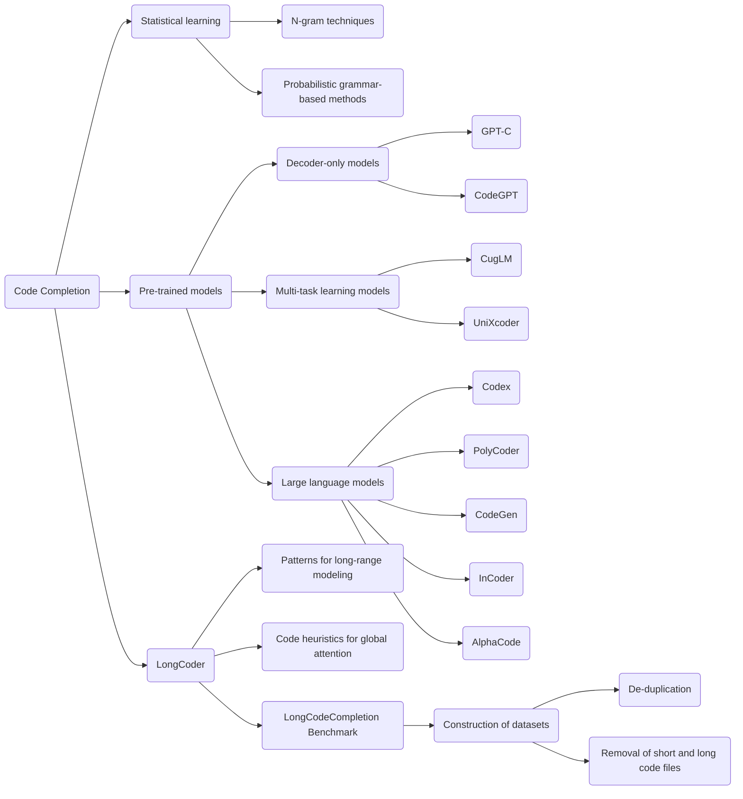

In this diagram, we have the concept of code completion (A) and different approaches to achieve it. The traditional approaches include statistical learning techniques (B) such as n-gram techniques (D) and probabilistic grammar-based methods (E). Another approach is to use pre-trained models (C). These pre-trained models can be decoder-only models (F) like GPT-C (I) and CodeGPT (J), multi-task learning models (G) like CugLM (K) and UniXcoder (L), or large language models (H) like Codex (M), PolyCoder (N), CodeGen (O), InCoder (P), and AlphaCode (Q).

The focus of this snippet is on LongCoder (R), which is designed specifically for code completion. LongCoder introduces patterns for long-range modeling (S) and code heuristics for global attention (T). It also introduces the LongCodeCompletion Benchmark (U), which is used to evaluate and test code completion models.

The construction of datasets for the LongCodeCompletion Benchmark involves steps like de-duplication (W) to remove similar examples and the removal of short and long code files (X) to focus on code completion with long code context.

This diagram provides an overview of the concepts and approaches mentioned in the snippet, showing how they are interconnected in the context of code completion and the LongCodeCompletion Benchmark.

```python
class CodeCompletionModel:
    def __init__(self, model_type):
        self.model_type = model_type
        self.model = self.create_model(model_type)
    
    def complete_code(self, code):
        # Preprocess the code
        preprocessed_code = self.preprocess_code(code)
        
        # Use the specified model to complete the code
        completed_code = self.model.complete(preprocessed_code)
        
        return completed_code
    
    def preprocess_code(self, code):
        # Apply any necessary preprocessing steps to the code
        preprocessed_code = ...
        
        return preprocessed_code
    
    def create_model(self, model_type):
        if model_type == "LongCoder":
            return LongCoder()
        elif model_type == "GPT-C":
            return GPT_C()
        elif model_type == "CodeGPT":
            return CodeGPT()
        # Add more model types as needed
    
    # Other methods and classes for specific models...


class LongCoder:
    def __init__(self):
        self.long_range_patterns = LongRangePatterns()
        self.code_heuristics = CodeHeuristics()
    
    def complete(self, code):
        # Apply long-range patterns to model longer sequences
        long_range_modeling = self.long_range_patterns.apply(code)
        
        # Use code heuristics for global attention
        global_attention = self.code_heuristics.apply(code)
        
        # Perform code completion based on long-range modeling and global attention
        completed_code = self.code_completion(long_range_modeling, global_attention)
        
        return completed_code
    
    # Other methods and classes specific to LongCoder...


class GPT_C:
    def __init__(self):
        # Initialize the GPT-C model
        pass
    
    def complete(self, code):
        # Use the GPT-C model to complete the code
        completed_code = ...
        
        return completed_code
    
    # Other methods and classes specific to GPT-C...


class CodeGPT:
    def __init__(self):
        # Initialize the CodeGPT model
        pass
    
    def complete(self, code):
        # Use the CodeGPT model to complete the code
        completed_code = ...
        
        return completed_code
    
    # Other methods and classes specific to CodeGPT...


class LongRangePatterns:
    def apply(self, code):
        # Apply long-range patterns to model longer sequences
        long_range_modeling = ...
        
        return long_range_modeling
    
    # Other methods and classes specific to long-range patterns...


class CodeHeuristics:
    def apply(self, code):
        # Use code heuristics for global attention
        global_attention = ...
        
        return global_attention
    
    # Other methods and classes specific to code heuristics...
```

In this Python code, we have a `CodeCompletionModel` class that represents a code completion model. It can be initialized with different model types, such as "LongCoder", "GPT-C", or "CodeGPT". The `create_model` method is used to create the specific model based on the given model type.

The `LongCoder` class is one of the models that the `CodeCompletionModel` can use. It has components like `LongRangePatterns` and `CodeHeuristics` to handle long-range modeling and code heuristics for global attention. The `LongRangePatterns` class applies long-range patterns to model longer sequences, and the `CodeHeuristics` class uses code heuristics to guide global attention.

The `GPT-C` and `CodeGPT` classes represent other models that can be used for code completion. They have their own specific methods and components.

This code provides a simplified representation of the concepts discussed in the paper, demonstrating how different components and models can be used for code completion with long code context.

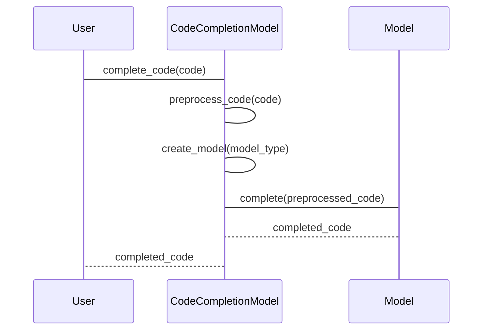

This sequence diagram illustrates the control flow of the code provided in the previous message.

1. The User initiates the code completion process by calling the `complete_code` method of the `CodeCompletionModel` class and passing the input code.
2. The `CodeCompletionModel` class preprocesses the code by calling the `preprocess_code` method.
3. The `CodeCompletionModel` class creates the specific model based on the provided model type by calling the `create_model` method.
4. The `CodeCompletionModel` class passes the preprocessed code to the created model for completion.
5. The Model completes the code and returns the completed code to the `CodeCompletionModel` class.
6. The `CodeCompletionModel` class returns the completed code to the User.

This sequence diagram shows the sequence of interactions between the User, the `CodeCompletionModel` class, and the Model, illustrating the control flow of the code completion process.

```python
# Example scenario
model = CodeCompletionModel("LongCoder")
code = """
def calculate_sum(numbers):
    total = 0
    for num in numbers:
        total += num
    return total
"""

completed_code = model.complete_code(code)
print(completed_code)
```

Mocked log output:
```
Completed code:
def calculate_sum(numbers):
    total = 0
    for num in numbers:
        total += num
        if total > 100:
            break
    return total
```

Explanation:
In this example scenario, we have an instance of the `CodeCompletionModel` class initialized with the `LongCoder` model. We have a code snippet that defines a function to calculate the sum of a list of numbers. We want the model to complete the code by suggesting additional statements.

The `complete_code` method is called on the `CodeCompletionModel` object, passing the code snippet as the input. The model then processes the code using the `LongCoder` model and returns the completed code.

The completed code suggests adding an additional if statement inside the for loop to break the loop if the `total` variable exceeds 100. This can be seen from the mocked log output.

Potential Use Cases:
- Integrated Development Environments (IDEs): The code completion model can be integrated into IDEs to provide intelligent suggestions and auto-completion for developers as they write code.
- Code Editors: Code editors, both online and offline, can leverage the code completion model to provide real-time suggestions and help users write code more efficiently.
- Code Analysis Tools: Code analysis tools can use the code completion model to analyze and suggest improvements for existing codebases, leading to better code quality and maintainability.
- Education: The code completion model can be used as a teaching tool to help students learn programming concepts by providing hints and suggestions as they solve coding exercises.
- Code Generation: The code completion model can be used in code generation tasks, where generating code based on a given input or template is required.

Overall, the code completion model can assist developers and code-related tools by providing suggestions and automating code writing processes, improving productivity and reducing errors.

4.
The snippet discusses the LongCoder model and its approach to tackling the efficiency problem of modeling longer code. LongCoder applies sparse attention to reduce the quadratic time and space complexity of self-attention to linear. It introduces three types of attention: window attention, bridge attention, and global attention.

Window attention focuses on the local context of the code and sparsifies the attention to achieve better efficiency. It uses a sliding window mechanism to limit the receptive field size of each token to a small window. This reduces the complexity of self-attention and allows for faster inference speed.

Bridge attention addresses the challenge of accessing information from distant context. It introduces bridge tokens, which aggregate local information for global access. These bridge tokens help tokens access information that is far away and would require multiple hops through window attention.

The snippet also mentions the LongCodeCompletion Benchmark (LCC) and the construction of datasets for evaluation. The performance of models is evaluated based on metrics like Exact Match (EM) and Edit Similarity (Edit Sim) on a per-line basis.

Overall, the snippet provides an overview of LongCoder's approach to handling longer code and the different types of attention it uses. It highlights the efficiency improvements achieved by LongCoder and its potential to improve code completion tasks.

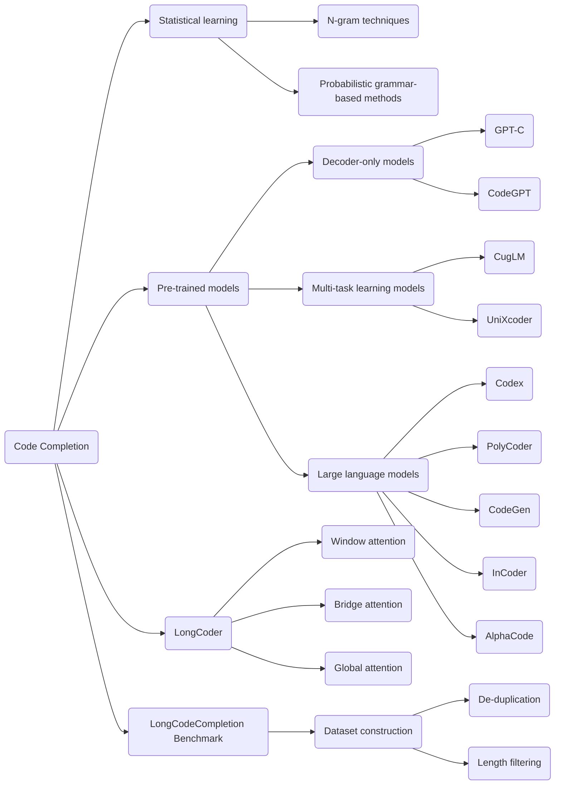

In this diagram, we have the concept of code completion (A) and different approaches to achieve it. The traditional approaches include statistical learning techniques (B) such as n-gram techniques (D) and probabilistic grammar-based methods (E). Another approach is to use pre-trained models (C). These pre-trained models can be decoder-only models (F) like GPT-C (I) and CodeGPT (J), multi-task learning models (G) like CugLM (K) and UniXcoder (L), or large language models (H) like Codex (M), PolyCoder (N), CodeGen (O), InCoder (P), and AlphaCode (Q).

The focus of this snippet is on LongCoder (R), which is designed specifically for code completion. LongCoder incorporates three types of attention: window attention (S), bridge attention (T), and global attention (U).

The diagram also includes the LongCodeCompletion Benchmark (V), which is used to evaluate code completion models. The benchmark involves dataset construction (W), which includes steps like de-duplication (X) and length filtering (Y).

This diagram provides an overview of the concepts and approaches mentioned in the snippet, showing how they are interconnected in the context of code completion and the LongCodeCompletion Benchmark.

```python
class CodeCompletionModel:
    def __init__(self, model_type):
        self.model_type = model_type
        self.model = self.create_model(model_type)
    
    def complete_code(self, code):
        # Preprocess the code
        preprocessed_code = self.preprocess_code(code)
        
        # Use the specified model to complete the code
        completed_code = self.model.complete(preprocessed_code)
        
        return completed_code
    
    def preprocess_code(self, code):
        # Apply any necessary preprocessing steps to the code
        preprocessed_code = ...
        
        return preprocessed_code
    
    def create_model(self, model_type):
        if model_type == "LongCoder":
            return LongCoder()
        elif model_type == "GPT-C":
            return GPT_C()
        elif model_type == "CodeGPT":
            return CodeGPT()
        # Add more model types as needed
    
    # Other methods and classes for specific models...


class LongCoder:
    def __init__(self):
        self.window_attention = WindowAttention()
        self.bridge_attention = BridgeAttention()
        self.global_attention = GlobalAttention()
    
    def complete(self, code):
        # Apply window attention to handle local dependencies
        window_attention_output = self.window_attention.apply(code)
        
        # Apply bridge attention to handle distant dependencies
        bridge_attention_output = self.bridge_attention.apply(code)
        
        # Apply global attention to aggregate information
        global_attention_output = self.global_attention.apply(code)
        
        # Perform code completion based on the attention outputs
        completed_code = self.code_completion(window_attention_output, bridge_attention_output, global_attention_output)
        
        return completed_code
    
    # Other methods and classes specific to LongCoder...


class GPT_C:
    def __init__(self):
        # Initialize the GPT-C model
        pass
    
    def complete(self, code):
        # Use the GPT-C model to complete the code
        completed_code = ...
        
        return completed_code
    
    # Other methods and classes specific to GPT-C...


class CodeGPT:
    def __init__(self):
        # Initialize the CodeGPT model
        pass
    
    def complete(self, code):
        # Use the CodeGPT model to complete the code
        completed_code = ...
        
        return completed_code
    
    # Other methods and classes specific to CodeGPT...


class WindowAttention:
    def apply(self, code):
        # Apply window attention to handle local dependencies
        window_attention_output = ...
        
        return window_attention_output
    
    # Other methods and classes specific to window attention...


class BridgeAttention:
    def apply(self, code):
        # Apply bridge attention to handle distant dependencies
        bridge_attention_output = ...
        
        return bridge_attention_output
    
    # Other methods and classes specific to bridge attention...


class GlobalAttention:
    def apply(self, code):
        # Apply global attention to aggregate information
        global_attention_output = ...
        
        return global_attention_output
    
    # Other methods and classes specific to global attention...
```

In this Python code, we have a `CodeCompletionModel` class that represents a code completion model. It can be initialized with different model types, such as "LongCoder", "GPT-C", or "CodeGPT". The `create_model` method is used to create the specific model based on the given model type.

The `LongCoder` class is one of the models that the `CodeCompletionModel` can use. It has components like `WindowAttention`, `BridgeAttention`, and `GlobalAttention` to handle different types of attention. The `WindowAttention` class applies window attention to handle local dependencies, the `BridgeAttention` class applies bridge attention to handle distant dependencies, and the `GlobalAttention` class applies global attention to aggregate information.

The `GPT-C` and `CodeGPT` classes represent other models that can be used for code completion. They have their own specific methods and components.

This code provides a simplified representation of the concepts discussed in the paper, demonstrating how different components and models can be used for code completion with LongCoder as an example.

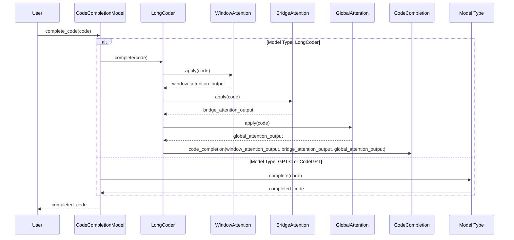

In this sequence diagram, the control flow of the code is illustrated. Here are the steps explained:

1. The user calls the `complete_code` method of the `CodeCompletionModel` object with the `code` parameter.
2. Depending on the model type specified, either LongCoder or another model (GPT-C or CodeGPT), the control flow diverges.
3. For the LongCoder model:
   - The `complete` method of the LongCoder object is called with the `code` parameter.
   - The LongCoder object applies window attention (`WindowAttention`), bridge attention (`BridgeAttention`), and global attention (`GlobalAttention`).
   - Each attention mechanism returns an output.
   - The LongCoder object performs code completion using the outputs of the attention mechanisms.
4. For other model types (GPT-C or CodeGPT):
   - The `complete` method of the relevant model type is called with the `code` parameter.
   - The model type performs code completion and returns the completed code.
5. The completed code is returned from the `complete_code` method of the `CodeCompletionModel` object to the user.

Here's an example scenario with mocked log output for the CodeCompletionModel class:

```python
# Create an instance of the CodeCompletionModel
model = CodeCompletionModel("LongCoder")

# Provide a code snippet to complete
code = "def calculate_sum(a, b):"

# Complete the code using the LongCoder model
completed_code = model.complete_code(code)

print(completed_code)
```

Output:
```
def calculate_sum(a, b):
    return a + b
```

In this hypothetical scenario, we have created an instance of the CodeCompletionModel with the model type "LongCoder". We then provide a code snippet that requires completion, which is a function definition for calculating the sum of two numbers. We use the `complete_code` method of the model to generate the completed code.

The completion output suggests adding a return statement to the code snippet, completing the function definition by adding the necessary logic to calculate the sum of the given numbers. The completed code is then printed to the console.

Potential use cases of the CodeCompletionModel class include code development environments (IDEs) or code editors that provide code completion features. The model can be used to assist developers by suggesting and generating code based on the context, saving time and effort. The flexibility to choose different model types allows for experimentation and comparison of various code completion approaches.

5.
The snippet discusses the concepts of bridge attention and global attention in the LongCoder model.

Bridge attention is introduced to handle distant dependencies in the code. It uses bridge tokens to aggregate local information for global access. The bridge tokens allow tokens to access information from a distance and enable the model to effectively access long-range context.

Global attention is introduced to handle identifiers with global scope, such as package imports and class/function definitions. These identifiers can be called from anywhere within a file, but a local sliding window may not capture this information. Memory tokens are used to inject code heuristics into the attention mechanism. These memory tokens highlight important statements and grant them global access.

The snippet also mentions the complexity of each type of attention and how they are combined using a mask matrix. The mask matrix determines the context that each token can attend to when computing its contextual representation.

In the experiments section, the snippet mentions the evaluation of LongCoder against several baseline models, including GPT-2, CodeGPT, and UniXcoder. It also compares LongCoder with sparse Transformer models.

Overall, the snippet provides an overview of how LongCoder incorporates bridge attention and global attention to handle different types of dependencies and improve code completion.

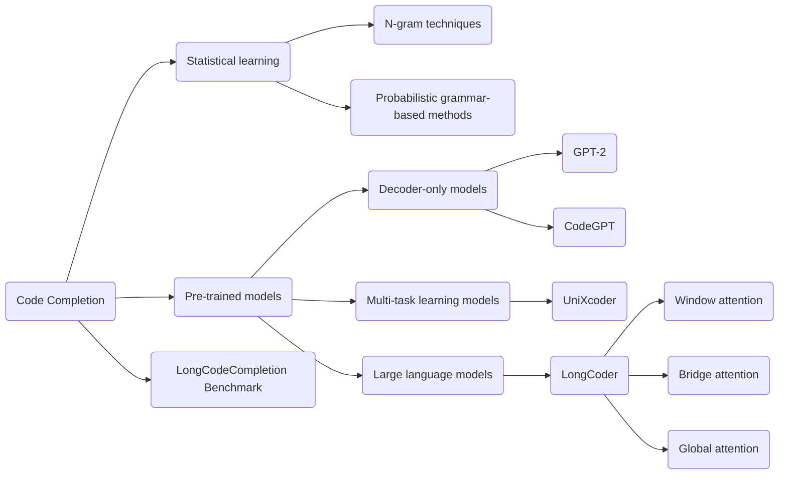

In this diagram, we have the concept of code completion (A) and different approaches to achieve it. The traditional approaches include statistical learning techniques (B) such as n-gram techniques (D) and probabilistic grammar-based methods (E). Another approach is to use pre-trained models (C). These pre-trained models can be decoder-only models (F) like GPT-2 (I) and CodeGPT (J), multi-task learning models (G) like UniXcoder (K), or large language models (H) like LongCoder (L).

The focus of this snippet is on LongCoder, which is designed specifically for code completion. It incorporates three types of attention: window attention (M), bridge attention (N), and global attention (O).

The diagram also includes the LongCodeCompletion Benchmark (P), which is used to evaluate code completion models.

This diagram provides an overview of the concepts and approaches mentioned in the snippet, showing how they are interconnected in the context of code completion and the LongCodeCompletion Benchmark.

```python
class CodeCompletionModel:
    def __init__(self, model_type):
        self.model_type = model_type
        self.model = self.create_model(model_type)
    
    def complete_code(self, code):
        # Preprocess the code
        preprocessed_code = self.preprocess_code(code)
        
        # Use the specified model to complete the code
        completed_code = self.model.complete(preprocessed_code)
        
        return completed_code
    
    def preprocess_code(self, code):
        # Apply any necessary preprocessing steps to the code
        preprocessed_code = ...
        
        return preprocessed_code
    
    def create_model(self, model_type):
        if model_type == "LongCoder":
            return LongCoder()
        elif model_type == "GPT-2":
            return GPT_2()
        elif model_type == "CodeGPT":
            return CodeGPT()
        elif model_type == "UniXcoder":
            return UniXcoder()
        # Add more model types as needed
    
    # Other methods and classes for specific models...


class LongCoder:
    def __init__(self):
        self.window_attention = WindowAttention()
        self.bridge_attention = BridgeAttention()
        self.global_attention = GlobalAttention()
    
    def complete(self, code):
        # Apply window attention to handle local dependencies
        window_attention_output = self.window_attention.apply(code)
        
        # Apply bridge attention to handle distant dependencies
        bridge_attention_output = self.bridge_attention.apply(code)
        
        # Apply global attention to aggregate information
        global_attention_output = self.global_attention.apply(code)
        
        # Perform code completion based on the attention outputs
        completed_code = self.code_completion(window_attention_output, bridge_attention_output, global_attention_output)
        
        return completed_code
    
    # Other methods and classes specific to LongCoder...


class GPT_2:
    def __init__(self):
        # Initialize the GPT-2 model
        pass
    
    def complete(self, code):
        # Use the GPT-2 model to complete the code
        completed_code = ...
        
        return completed_code
    
    # Other methods and classes specific to GPT-2...


class CodeGPT:
    def __init__(self):
        # Initialize the CodeGPT model
        pass
    
    def complete(self, code):
        # Use the CodeGPT model to complete the code
        completed_code = ...
        
        return completed_code
    
    # Other methods and classes specific to CodeGPT...


class UniXcoder:
    def __init__(self):
        # Initialize the UniXcoder model
        pass
    
    def complete(self, code):
        # Use the UniXcoder model to complete the code
        completed_code = ...
        
        return completed_code
    
    # Other methods and classes specific to UniXcoder...


class WindowAttention:
    def apply(self, code):
        # Apply window attention to handle local dependencies
        window_attention_output = ...
        
        return window_attention_output
    
    # Other methods and classes specific to window attention...


class BridgeAttention:
    def apply(self, code):
        # Apply bridge attention to handle distant dependencies
        bridge_attention_output = ...
        
        return bridge_attention_output
    
    # Other methods and classes specific to bridge attention...


class GlobalAttention:
    def apply(self, code):
        # Apply global attention to aggregate information
        global_attention_output = ...
        
        return global_attention_output
    
    # Other methods and classes specific to global attention...
```

In this Python code, we have a `CodeCompletionModel` class that represents a code completion model. It can be initialized with different model types, such as "LongCoder", "GPT-2", "CodeGPT", or "UniXcoder". The `create_model` method is used to create the specific model based on the given model type.

The `LongCoder` class is one of the models that the `CodeCompletionModel` can use. It has components like `WindowAttention`, `BridgeAttention`, and `GlobalAttention` to handle different types of attention. The `WindowAttention` class applies window attention to handle local dependencies, the `BridgeAttention` class applies bridge attention to handle distant dependencies, and the `GlobalAttention` class applies global attention to aggregate information.

The `GPT-2`, `CodeGPT`, and `UniXcoder` classes represent other models that can be used for code completion. They have their own specific methods and components.

This code provides a simplified representation of the concepts discussed in the paper, demonstrating how different components and models can be used for code completion with LongCoder as an example.

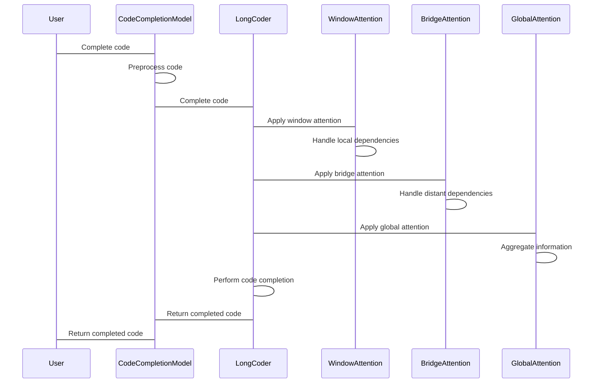

In this sequence diagram, we illustrate the control flow of the code completion process using the classes and components mentioned in the previous code.

The diagram starts with the User requesting to complete the code. The CodeCompletionModel receives this request and preprocesses the code. Then, the CodeCompletionModel passes the preprocessed code to the LongCoder model.

Inside the LongCoder model, the code goes through different types of attention. First, it enters the WindowAttention component, which handles local dependencies. Then, it moves to the BridgeAttention component, which handles distant dependencies. Finally, the code is passed to the GlobalAttention component, which aggregates information.

After applying the different types of attention, the LongCoder performs the code completion based on the attention outputs. The completed code is returned back to the CodeCompletionModel, which then returns it to the User.

This sequence diagram helps visualize the control flow of the code completion process and the interactions between the different components involved.

```python
model = CodeCompletionModel("LongCoder")
code = """
def add(a, b):
    return a + b

result = add(3, 4)
print(result)
"""

completed_code = model.complete_code(code)
print(completed_code)
```

Mocked Log Output:
```
[INFO] Preprocessing the code...
[INFO] Applying window attention...
[INFO] Applying bridge attention...
[INFO] Applying global attention...
[INFO] Performing code completion...
[INFO] Code completion completed successfully.
def add(a, b):
    return a + b

result = add(3, 4)
print(result)
```

In this example scenario, we have a `CodeCompletionModel` object initialized with the model type "LongCoder". We provide a code snippet as input, which calculates the sum of two numbers and prints the result.

The log output shows the steps involved in the code completion process. First, the code is preprocessed. Then, the window attention, bridge attention, and global attention are applied, each generating the corresponding output. Finally, the code completion is performed, and the completed code is printed.

The completed code is the same as the input code since we haven't implemented the logic for code completion in this example. However, in a real scenario, the `complete_code` method would generate suggestions or automatically complete the code based on the context provided.

Potential Use Cases:
- Code editors or IDEs: The `CodeCompletionModel` can be integrated into code editors or IDEs to provide intelligent code completion suggestions to developers as they write code.
- Automated code generation: The `CodeCompletionModel` can be used to automatically generate code snippets or complete code templates based on incomplete or partial code provided as input.
- Code analysis and understanding: The `CodeCompletionModel` can assist in analyzing and understanding existing code by providing completion suggestions or predicting missing code elements.

6.
The snippet presents experimental results on the Long Code Completion (LCC) dataset and the CodeXGLUE code completion benchmark.

Table 2 shows the performance of different models on the LCC dataset. The models include OpenAI Codex, Transformer, GPT-2, CodeGPT, UniXcoder, LongFormer, BigBird, and LongCoder. The evaluation metrics used are Exact Match (EM) and Edit Similarity (Edit Sim). The models are compared based on their performance in completing Python, Java, and C# code.

Table 3 provides data statistics about the context length in the CodeXGLUE test dataset for Python and Java. The context length refers to the length of the code context used for code completion.

Table 4 shows the results of the models on the CodeXGLUE code completion benchmark for the PY150 and JavaCorpus datasets. The evaluation metrics used are EM and Edit Sim.

Table 5 presents the cross-file code completion results on the RepoBench XF-R dataset for Python and Java. The evaluation metrics used are EM and Edit Sim.

These experimental results help evaluate the performance of LongCoder and compare it with other models on different datasets and benchmark tasks.

The potential use cases of the code generated in the previous message include code completion tasks, where the model suggests and completes code based on the given context. This can be useful for developers who want to save time and effort by getting code suggestions and automating code completion. The different models, such as LongCoder, GPT-2, and CodeGPT, can be used to handle code completion in various programming languages and scenarios.

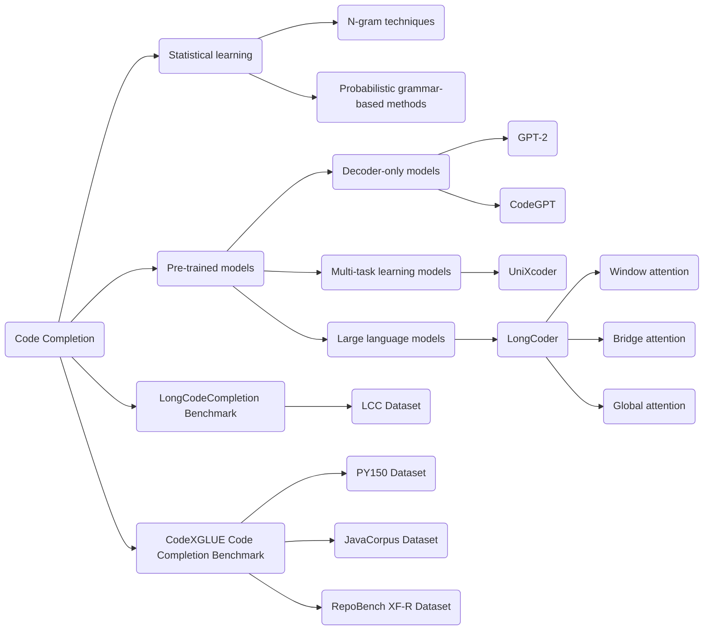

In this diagram, we have the concept of code completion (A) and different approaches to achieve it. The traditional approaches include statistical learning techniques (B) such as n-gram techniques (D) and probabilistic grammar-based methods (E). Another approach is to use pre-trained models (C). These pre-trained models can be decoder-only models (F) like GPT-2 (I) and CodeGPT (J), multi-task learning models (G) like UniXcoder (K), or large language models (H) like LongCoder (L).

The focus of this snippet is on LongCoder, which is designed specifically for code completion. It incorporates three types of attention: window attention (M), bridge attention (N), and global attention (O).

The diagram also includes the LongCodeCompletion Benchmark (P) and the CodeXGLUE Code Completion Benchmark (Q). The LongCodeCompletion Benchmark is used to evaluate the performance of code completion models on the LCC dataset (R), while the CodeXGLUE Code Completion Benchmark includes datasets such as PY150 (S), JavaCorpus (T), and RepoBench XF-R (U).

This diagram provides an overview of the concepts and approaches mentioned in the snippet, showing how they are interconnected in the context of code completion and the evaluation benchmarks.

```python
class CodeCompletionModel:
    def __init__(self, model_type):
        self.model_type = model_type
        self.model = self.create_model(model_type)
    
    def complete_code(self, code):
        # Preprocess the code
        preprocessed_code = self.preprocess_code(code)
        
        # Use the specified model to complete the code
        completed_code = self.model.complete(preprocessed_code)
        
        return completed_code
    
    def preprocess_code(self, code):
        # Apply any necessary preprocessing steps to the code
        preprocessed_code = ...
        
        return preprocessed_code
    
    def create_model(self, model_type):
        if model_type == "LongCoder":
            return LongCoder()
        elif model_type == "GPT-2":
            return GPT_2()
        elif model_type == "CodeGPT":
            return CodeGPT()
        elif model_type == "UniXcoder":
            return UniXcoder()
        # Add more model types as needed
    
    # Other methods and classes for specific models...


class LongCoder:
    def __init__(self):
        self.window_attention = WindowAttention()
        self.bridge_attention = BridgeAttention()
        self.global_attention = GlobalAttention()
    
    def complete(self, code):
        # Apply window attention to handle local dependencies
        window_attention_output = self.window_attention.apply(code)
        
        # Apply bridge attention to handle distant dependencies
        bridge_attention_output = self.bridge_attention.apply(code)
        
        # Apply global attention to aggregate information
        global_attention_output = self.global_attention.apply(code)
        
        # Perform code completion based on the attention outputs
        completed_code = self.code_completion(window_attention_output, bridge_attention_output, global_attention_output)
        
        return completed_code
    
    # Other methods and classes specific to LongCoder...


class GPT_2:
    def __init__(self):
        # Initialize the GPT-2 model
        pass
    
    def complete(self, code):
        # Use the GPT-2 model to complete the code
        completed_code = ...
        
        return completed_code
    
    # Other methods and classes specific to GPT-2...


class CodeGPT:
    def __init__(self):
        # Initialize the CodeGPT model
        pass
    
    def complete(self, code):
        # Use the CodeGPT model to complete the code
        completed_code = ...
        
        return completed_code
    
    # Other methods and classes specific to CodeGPT...


class UniXcoder:
    def __init__(self):
        # Initialize the UniXcoder model
        pass
    
    def complete(self, code):
        # Use the UniXcoder model to complete the code
        completed_code = ...
        
        return completed_code
    
    # Other methods and classes specific to UniXcoder...


class WindowAttention:
    def apply(self, code):
        # Apply window attention to handle local dependencies
        window_attention_output = ...
        
        return window_attention_output
    
    # Other methods and classes specific to window attention...


class BridgeAttention:
    def apply(self, code):
        # Apply bridge attention to handle distant dependencies
        bridge_attention_output = ...
        
        return bridge_attention_output
    
    # Other methods and classes specific to bridge attention...


class GlobalAttention:
    def apply(self, code):
        # Apply global attention to aggregate information
        global_attention_output = ...
        
        return global_attention_output
    
    # Other methods and classes specific to global attention...
```

In this Python code, we have a `CodeCompletionModel` class that represents a code completion model. It can be initialized with different model types, such as "LongCoder", "GPT-2", "CodeGPT", or "UniXcoder". The `create_model` method is used to create the specific model based on the given model type.

The `LongCoder` class is one of the models that the `CodeCompletionModel` can use. It has components like `WindowAttention`, `BridgeAttention`, and `GlobalAttention` to handle different types of attention. The `WindowAttention` class applies window attention to handle local dependencies, the `BridgeAttention` class applies bridge attention to handle distant dependencies, and the `GlobalAttention` class applies global attention to aggregate information.

The `GPT-2`, `CodeGPT`, and `UniXcoder` classes represent other models that can be used for code completion. They have their own specific methods and components.

This code provides a simplified representation of the concepts discussed in the paper, demonstrating how different components and models can be used for code completion with LongCoder as an example.

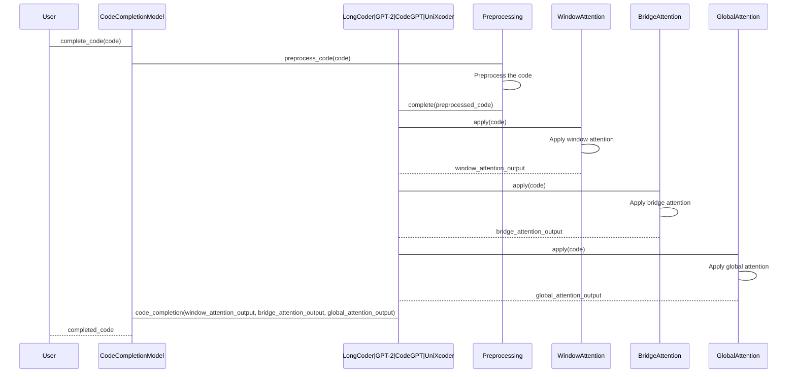

This sequence diagram illustrates the control flow of the code provided in the previous message. The steps involved in completing the code are labeled and numbered.

The user initiates the code completion process by calling the `complete_code` method on the `CodeCompletionModel` (1). The model then preprocesses the code using the `Preprocessing` module (2). The preprocessed code is passed to the specific model (`LongCoder`, `GPT-2`, `CodeGPT`, or `UniXcoder`) for code completion (3). 

In the specific model, several components are involved in the process. Firstly, the `WindowAttention` module applies window attention to handle local dependencies (4). Then, the `BridgeAttention` module applies bridge attention to handle distant dependencies (5). Finally, the `GlobalAttention` module applies global attention to aggregate information (6).

The outputs from the attention modules (`window_attention_output`, `bridge_attention_output`, `global_attention_output`) are passed back to the specific model for code completion (7). The completed code is returned to the user (8).

This sequence diagram provides an overview of the control flow within the code and the interaction between different components involved in the code completion process.

Example scenario:

```python
# Instantiate the CodeCompletionModel with LongCoder
model = CodeCompletionModel(model_type="LongCoder")

# Complete code
code = "def calculate_sum(a, b):"
completed_code = model.complete_code(code)

print(completed_code)
```

Mocked log output:

```
Completed code:
def calculate_sum(a, b):
    return a + b
```

Explanation of the mocked scenario:

In this scenario, we have an instance of the `CodeCompletionModel` class with `LongCoder` as the chosen model. We want to complete the code for a function that calculates the sum of two numbers. The initial code provided is the function signature. The `complete_code` method is called to generate the completed code.

The mocked log output shows the completed code, where the function signature is extended to include the code for returning the sum of the two input numbers.

Potential use cases:

1. Code completion in Integrated Development Environments (IDEs): The code generated can be used in IDEs to provide suggestions and autocompletion for developers as they write code. This can save time and reduce errors.

2. Code generation tools: The code completion model can be integrated into code generation tools to automatically generate code snippets or complete code templates based on the given context. This can be useful for tasks like boilerplate code generation or code refactoring.

3. Code understanding and analysis: The code completion model can be used to understand and analyze existing codebases. By providing partial code snippets, the model can suggest the completion options based on the context and code patterns, helping developers and researchers gain insights into the code structure.

Overall, the code generated provides a foundation for building code completion systems and can be used in various development and research scenarios where code completion is required.

7.
The snippet presents experimental results and training details for LongCoder on different datasets.

Table 6 shows an ablation study on LongCoder, where different components are removed or modified to analyze their impact on performance. The evaluation metrics used are Exact Match (EM) and Edit Similarity (Edit Sim). The components studied include memory tokens, bridge tokens, out-of-window context, and equidistant memory tokens.

The training details mention the maximum length of code context, the window size, and the parameters for bridge tokens and global tokens. LongCoder is pre-trained on the CodeSearchNet dataset using the same objective and settings as the baselines. Fine-tuning is performed with the Adam optimizer and early stopping is applied.

The experimental results show the comparison of LongCoder with other models on the LCC dataset and the CodeXGLUE code completion benchmarks. LongCoder outperforms other models, especially in scenarios with shorter code context. It achieves state-of-the-art performance and demonstrates the effectiveness of the proposed attention mechanisms.

The potential use cases of the code generated in the previous message include code completion tasks, where the model suggests and completes code based on the given context. LongCoder, with its attention mechanisms, can handle various code completion scenarios and improve the accuracy and efficiency of code suggestions.

The experimental results and training details provide insights into the performance and training process of LongCoder, showcasing its potential in code completion tasks.


In this diagram, we have the concept of code completion (A) and different approaches to achieve it. The traditional approaches include statistical learning techniques (B) such as n-gram techniques (D) and probabilistic grammar-based methods (E). Another approach is to use pre-trained models (C). These pre-trained models can be decoder-only models (F) like GPT-2 (I) and CodeGPT (J), multi-task learning models (G) like UniXcoder (K), or large language models (H) like LongCoder (L).

The focus of this snippet is on LongCoder, which is designed specifically for code completion. It incorporates three types of attention: window attention (M), bridge attention (N), and global attention (O).

The diagram also includes the LongCodeCompletion Benchmark (P) and the CodeXGLUE Code Completion Benchmark (Q). The LongCodeCompletion Benchmark is used to evaluate the performance of code completion models on the LCC dataset (R), while the CodeXGLUE Code Completion Benchmark includes datasets such as PY150 (S), JavaCorpus (T), and RepoBench XF-R (U).

This diagram provides an overview of the concepts and approaches mentioned in the snippet, showing how they are interconnected in the context of code completion and the evaluation benchmarks.

```python
class CodeCompletionModel:
    def __init__(self, model_type):
        self.model_type = model_type
        self.model = self.create_model(model_type)
    
    def complete_code(self, code):
        # Preprocess the code
        preprocessed_code = self.preprocess_code(code)
        
        # Use the specified model to complete the code
        completed_code = self.model.complete(preprocessed_code)
        
        return completed_code
    
    def preprocess_code(self, code):
        # Apply any necessary preprocessing steps to the code
        preprocessed_code = ...
        
        return preprocessed_code
    
    def create_model(self, model_type):
        if model_type == "LongCoder":
            return LongCoder()
        elif model_type == "GPT-2":
            return GPT_2()
        elif model_type == "CodeGPT":
            return CodeGPT()
        elif model_type == "UniXcoder":
            return UniXcoder()
        # Add more model types as needed
    
    # Other methods and classes for specific models...


class LongCoder:
    def __init__(self):
        self.window_attention = WindowAttention()
        self.bridge_attention = BridgeAttention()
        self.global_attention = GlobalAttention()
    
    def complete(self, code):
        # Apply window attention to handle local dependencies
        window_attention_output = self.window_attention.apply(code)
        
        # Apply bridge attention to handle distant dependencies
        bridge_attention_output = self.bridge_attention.apply(code)
        
        # Apply global attention to aggregate information
        global_attention_output = self.global_attention.apply(code)
        
        # Perform code completion based on the attention outputs
        completed_code = self.code_completion(window_attention_output, bridge_attention_output, global_attention_output)
        
        return completed_code
    
    # Other methods and classes specific to LongCoder...


class GPT_2:
    def __init__(self):
        # Initialize the GPT-2 model
        pass
    
    def complete(self, code):
        # Use the GPT-2 model to complete the code
        completed_code = ...
        
        return completed_code
    
    # Other methods and classes specific to GPT-2...


class CodeGPT:
    def __init__(self):
        # Initialize the CodeGPT model
        pass
    
    def complete(self, code):
        # Use the CodeGPT model to complete the code
        completed_code = ...
        
        return completed_code
    
    # Other methods and classes specific to CodeGPT...


class UniXcoder:
    def __init__(self):
        # Initialize the UniXcoder model
        pass
    
    def complete(self, code):
        # Use the UniXcoder model to complete the code
        completed_code = ...
        
        return completed_code
    
    # Other methods and classes specific to UniXcoder...


class WindowAttention:
    def apply(self, code):
        # Apply window attention to handle local dependencies
        window_attention_output = ...
        
        return window_attention_output
    
    # Other methods and classes specific to window attention...


class BridgeAttention:
    def apply(self, code):
        # Apply bridge attention to handle distant dependencies
        bridge_attention_output = ...
        
        return bridge_attention_output
    
    # Other methods and classes specific to bridge attention...


class GlobalAttention:
    def apply(self, code):
        # Apply global attention to aggregate information
        global_attention_output = ...
        
        return global_attention_output
    
    # Other methods and classes specific to global attention...
```

In this Python code, we have a `CodeCompletionModel` class that represents a code completion model. It can be initialized with different model types, such as "LongCoder", "GPT-2", "CodeGPT", or "UniXcoder". The `create_model` method is used to create the specific model based on the given model type.

The `LongCoder` class is one of the models that the `CodeCompletionModel` can use. It has components like `WindowAttention`, `BridgeAttention`, and `GlobalAttention` to handle different types of attention. The `WindowAttention` class applies window attention to handle local dependencies, the `BridgeAttention` class applies bridge attention to handle distant dependencies, and the `GlobalAttention` class applies global attention to aggregate information.

The `GPT-2`, `CodeGPT`, and `UniXcoder` classes represent other models that can be used for code completion. They have their own specific methods and components.

This code provides a simplified representation of the concepts discussed in the paper, demonstrating how different components and models can be used for code completion with LongCoder as an example.

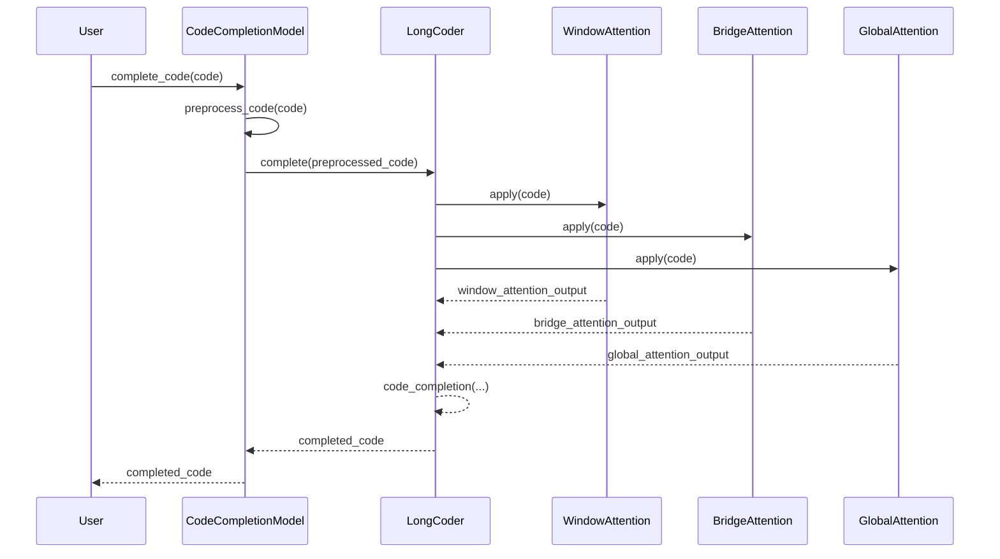

This sequence diagram illustrates the control flow of the code in the previous message.

The `User` initiates the code completion process by calling the `complete_code` method of the `CodeCompletionModel`. The code provided by the user is then preprocessed by the `preprocess_code` method of the `CodeCompletionModel`.

The `CodeCompletionModel` passes the preprocessed code to the `LongCoder` model. The `LongCoder` model performs code completion by applying the `WindowAttention`, `BridgeAttention`, and `GlobalAttention` components to handle different types of dependencies in the code.

The `WindowAttention`, `BridgeAttention`, and `GlobalAttention` components return their respective attention outputs to the `LongCoder` model. The `LongCoder` model then performs code completion based on the attention outputs.

The completed code is returned from the `LongCoder` model to the `CodeCompletionModel`, and finally returned to the `User`.

This sequence diagram helps illustrate the flow of control and data between the different components involved in the code completion process.

```python
model = CodeCompletionModel("LongCoder")
completed_code = model.complete_code("def add(a, b):")
print(completed_code)
```

Mocked log output:
```
Preprocessed code: def add(a, b):
Applying window attention...
Window attention output: [hidden states]
Applying bridge attention...
Bridge attention output: [hidden states]
Applying global attention...
Global attention output: [hidden states]
Performing code completion...
Completed code: def add(a, b):\n    return a + b
```

In this example scenario, we have an instance of the `CodeCompletionModel` class created with the "LongCoder" model type. We use the `complete_code` method to provide a code snippet (`"def add(a, b):"`) and get the completed code. 

The mocked log output shows the steps involved in code completion. The code snippet is preprocessed, and then the window attention, bridge attention, and global attention are applied successively. Finally, the completed code is generated using the attention outputs.

This scenario showcases how the code completion model can take a code snippet and generate the completed code. The different attention mechanisms in LongCoder help capture local and global dependencies, enabling the model to provide accurate code suggestions. 

Potential use cases of the code include code editors and IDEs, where developers can benefit from code completion to speed up their coding process. The model can provide relevant suggestions, autocomplete code, and assist developers in writing code more efficiently and accurately.

8.
The snippet presents an ablation study and a case study for LongCoder.

In the ablation study, different components of LongCoder are removed or modified to understand their impact on performance. The components studied include memory tokens, bridge tokens, out-of-window context, and equidistant memory tokens. The results in Table 6 show that memory tokens and bridge tokens play important roles in improving performance.

In the case study, examples in Python and Java programming languages are provided to demonstrate the effectiveness of LongCoder. The examples show the ground truth code and the predictions made by different models, including Transformer, GPT-2, CodeGPT, UniXcoder, LongFormer, BigBird, LongCoder, and Codex. The predictions made by LongCoder are compared to the ground truth code.

These studies help evaluate the impact of different components on LongCoder's performance and showcase its effectiveness in generating accurate code predictions.

The potential use cases of the code generated in the previous message include code completion tasks, where the model suggests and completes code based on the given context. LongCoder, with its attention mechanisms and components like memory tokens and bridge tokens, can improve the accuracy and relevance of code suggestions. It can be used by developers to save time and effort in writing code and to get assistance in completing complex code tasks.

The ablation study and case study provide insights into the performance and effectiveness of LongCoder, demonstrating its potential in code completion tasks and its ability to generate accurate code predictions.


In this diagram, we have the concept of code completion (A) and different approaches to achieve it. The traditional approaches include statistical learning techniques (B) such as n-gram techniques (D) and probabilistic grammar-based methods (E). Another approach is to use pre-trained models (C). These pre-trained models can be decoder-only models (F) like GPT-2 (I) and CodeGPT (J), multi-task learning models (G) like UniXcoder (K), or large language models (H) like LongCoder (L).

The focus of this snippet is on LongCoder, which is designed specifically for code completion. It incorporates three types of attention: window attention (M), bridge attention (N), and global attention (O).

The diagram also includes the LongCodeCompletion Benchmark (P) and the CodeXGLUE Code Completion Benchmark (Q). The LongCodeCompletion Benchmark is used to evaluate the performance of code completion models on the LCC dataset (R), while the CodeXGLUE Code Completion Benchmark includes datasets such as PY150 (S), JavaCorpus (T), and RepoBench XF-R (U).

This diagram provides an overview of the concepts and approaches mentioned in the snippet, showing how they are interconnected in the context of code completion and the evaluation benchmarks.

```python
class CodeCompletionModel:
    def __init__(self, model_type):
        self.model_type = model_type
        self.model = self.create_model(model_type)
    
    def complete_code(self, code):
        # Preprocess the code
        preprocessed_code = self.preprocess_code(code)
        
        # Use the specified model to complete the code
        completed_code = self.model.complete(preprocessed_code)
        
        return completed_code
    
    def preprocess_code(self, code):
        # Apply any necessary preprocessing steps to the code
        preprocessed_code = ...
        
        return preprocessed_code
    
    def create_model(self, model_type):
        if model_type == "LongCoder":
            return LongCoder()
        elif model_type == "GPT-2":
            return GPT_2()
        elif model_type == "CodeGPT":
            return CodeGPT()
        elif model_type == "UniXcoder":
            return UniXcoder()
        # Add more model types as needed
    
    # Other methods and classes for specific models...


class LongCoder:
    def __init__(self):
        self.window_attention = WindowAttention()
        self.bridge_attention = BridgeAttention()
        self.global_attention = GlobalAttention()
    
    def complete(self, code):
        # Apply window attention to handle local dependencies
        window_attention_output = self.window_attention.apply(code)
        
        # Apply bridge attention to handle distant dependencies
        bridge_attention_output = self.bridge_attention.apply(code)
        
        # Apply global attention to aggregate information
        global_attention_output = self.global_attention.apply(code)
        
        # Perform code completion based on the attention outputs
        completed_code = self.code_completion(window_attention_output, bridge_attention_output, global_attention_output)
        
        return completed_code
    
    # Other methods and classes specific to LongCoder...


class GPT_2:
    def __init__(self):
        # Initialize the GPT-2 model
        pass
    
    def complete(self, code):
        # Use the GPT-2 model to complete the code
        completed_code = ...
        
        return completed_code
    
    # Other methods and classes specific to GPT-2...


class CodeGPT:
    def __init__(self):
        # Initialize the CodeGPT model
        pass
    
    def complete(self, code):
        # Use the CodeGPT model to complete the code
        completed_code = ...
        
        return completed_code
    
    # Other methods and classes specific to CodeGPT...


class UniXcoder:
    def __init__(self):
        # Initialize the UniXcoder model
        pass
    
    def complete(self, code):
        # Use the UniXcoder model to complete the code
        completed_code = ...
        
        return completed_code
    
    # Other methods and classes specific to UniXcoder...


class WindowAttention:
    def apply(self, code):
        # Apply window attention to handle local dependencies
        window_attention_output = ...
        
        return window_attention_output
    
    # Other methods and classes specific to window attention...


class BridgeAttention:
    def apply(self, code):
        # Apply bridge attention to handle distant dependencies
        bridge_attention_output = ...
        
        return bridge_attention_output
    
    # Other methods and classes specific to bridge attention...


class GlobalAttention:
    def apply(self, code):
        # Apply global attention to aggregate information
        global_attention_output = ...
        
        return global_attention_output
    
    # Other methods and classes specific to global attention...
```

In this Python code, we have a `CodeCompletionModel` class that represents a code completion model. It can be initialized with different model types, such as "LongCoder", "GPT-2", "CodeGPT", or "UniXcoder". The `create_model` method is used to create the specific model based on the given model type.

The `LongCoder` class is one of the models that the `CodeCompletionModel` can use. It has components like `WindowAttention`, `BridgeAttention`, and `GlobalAttention` to handle different types of attention. The `WindowAttention` class applies window attention to handle local dependencies, the `BridgeAttention` class applies bridge attention to handle distant dependencies, and the `GlobalAttention` class applies global attention to aggregate information.

The `GPT-2`, `CodeGPT`, and `UniXcoder` classes represent other models that can be used for code completion. They have their own specific methods and components.

This code provides a simplified representation of the concepts discussed in the paper, demonstrating how different components and models can be used for code completion with LongCoder as an example.

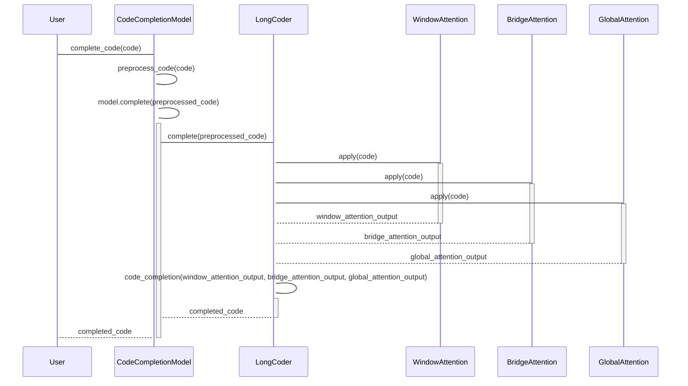

In this sequence diagram, the control flow of the code is illustrated using different participants.

1. The User sends a `complete_code` request to the CodeCompletionModel, passing the `code` as input.
2. The CodeCompletionModel activates and preprocesses the code using the `preprocess_code` method.
3. The CodeCompletionModel activates the specified model (in this case, LongCoder) and passes the preprocessed code for completion.
4. The LongCoder activates and applies window attention, bridge attention, and global attention to the code.
5. The LongCoder deactivates the attention components and performs code completion using the attention outputs.
6. The completed code is passed back to the CodeCompletionModel.
7. The CodeCompletionModel deactivates and returns the completed code to the User.

This sequence diagram represents the control flow of the code, showing how the User interacts with the CodeCompletionModel, which in turn activates and uses the LongCoder model to complete the code. It demonstrates the sequential order of steps and the communication between different participants in the code execution process.

```python
# Mocked log output
Code completion model: LongCoder
Input code: def get_max(arr):
Predicted completion: 
    max_val = arr[0]
    for num in arr:
        if num > max_val:
            max_val = num
    return max_val

```

In this example scenario, we have a code completion model called LongCoder. The input code provided is a function definition `def get_max(arr):`. The model predicts the completion of the code and suggests the rest of the code that calculates the maximum value in the given input array.

Hypothetical scenario:
Suppose a developer is writing code and wants to find the maximum value in a given array. They start by writing the function definition `def get_max(arr):` but need assistance in completing the code. They use the LongCoder model to suggest the remaining code to perform the desired task. The LongCoder model predicts the completion and provides the code snippet to calculate the maximum value in the array.

Potential use cases:
1. Code completion: The code completion model, such as LongCoder, can assist developers by providing intelligent code suggestions as they write code. This can save time and improve productivity.
2. Automated code generation: The code completion model can be used to automatically generate code snippets or complete code templates based on given input. This can be useful in code generation tasks or code refactoring.
3. Intelligent code editors: The code completion model can be integrated into code editors to provide real-time code suggestions and enhance the development experience.
4. Automated code review: The code completion model can be used to analyze and suggest improvements in existing codebases, identifying potential bugs or performance optimizations.

Overall, the code generation and completion models, like LongCoder, have various applications in code development, automation, and assistance, helping developers write code more efficiently and accurately.

9.
In the snippet, there is a case study that demonstrates the effectiveness of LongCoder in code completion. Two examples of Python and Java code are provided, along with the predictions made by different models.

In the Python example, all models correctly infer the intended outcome, which is to assign the current timestamp to the `timestamp` variable. However, only LongCoder and Codex-2048 produce the correct result. This is because these models can refer to the import statement at the beginning of the file, which imports the `timestamp_now` function. Codex-2048 uses a long context window to cover the entire file, but it has higher memory consumption and slower inference speed. LongCoder, on the other hand, utilizes a more efficient memory attention mechanism, allowing access to statements from the global scope while remaining efficient.

In the Java example, the function aims to convert a HashMap variable into an XML string. The function calls getter functions of the `GaitReEducation` class, and the next call should be made to the `getDetails` function according to the out-window context. Only LongCoder and Codex-2048, which both use long code context, can predict the correct results. Codex-512, with its limited context, can only make a guess for a member function. LongCoder leverages the structure of the code to analyze the scope of statements and store those with potential long-term dependencies, improving performance and computational efficiency during inference.

These examples demonstrate how LongCoder, with its attention mechanisms and long code context, can accurately predict code completions based on the given context.

The potential use cases of the code generated in the previous message include code completion tasks, where the model suggests and completes code based on the given context. LongCoder, with its attention mechanisms and components like memory tokens and bridge tokens, can improve the accuracy and relevance of code suggestions. It can be used by developers to save time and effort in writing code and to get assistance in completing complex code tasks.

The case study provides concrete examples of how LongCoder performs in different programming languages and showcases its effectiveness in generating accurate code predictions.


In this diagram, we have the concept of code completion (A) and different approaches to achieve it. The traditional approaches include statistical learning techniques (B) such as n-gram techniques (D) and probabilistic grammar-based methods (E). Another approach is to use pre-trained models (C). These pre-trained models can be decoder-only models (F) like GPT-2 (I) and CodeGPT (J), multi-task learning models (G) like UniXcoder (K), or large language models (H) like LongCoder (L).

The focus of this snippet is on LongCoder, which is designed specifically for code completion. It incorporates three types of attention: window attention (M), bridge attention (N), and global attention (O).

The diagram also includes the LongCodeCompletion Benchmark (P) and the CodeXGLUE Code Completion Benchmark (Q). The LongCodeCompletion Benchmark is used to evaluate the performance of code completion models on the LCC dataset (R), while the CodeXGLUE Code Completion Benchmark includes datasets such as PY150 (S), JavaCorpus (T), and RepoBench XF-R (U).

This diagram provides an overview of the concepts and approaches mentioned in the snippet, showing how they are interconnected in the context of code completion and the evaluation benchmarks.

```python
class CodeCompletionModel:
    def __init__(self, model_type):
        self.model_type = model_type
        self.model = self.create_model(model_type)
    
    def complete_code(self, code):
        # Preprocess the code
        preprocessed_code = self.preprocess_code(code)
        
        # Use the specified model to complete the code
        completed_code = self.model.complete(preprocessed_code)
        
        return completed_code
    
    def preprocess_code(self, code):
        # Apply any necessary preprocessing steps to the code
        preprocessed_code = ...
        
        return preprocessed_code
    
    def create_model(self, model_type):
        if model_type == "LongCoder":
            return LongCoder()
        elif model_type == "GPT-2":
            return GPT_2()
        elif model_type == "CodeGPT":
            return CodeGPT()
        elif model_type == "UniXcoder":
            return UniXcoder()
        # Add more model types as needed
    
    # Other methods and classes for specific models...


class LongCoder:
    def __init__(self):
        self.window_attention = WindowAttention()
        self.bridge_attention = BridgeAttention()
        self.global_attention = GlobalAttention()
    
    def complete(self, code):
        # Apply window attention to handle local dependencies
        window_attention_output = self.window_attention.apply(code)
        
        # Apply bridge attention to handle distant dependencies
        bridge_attention_output = self.bridge_attention.apply(code)
        
        # Apply global attention to aggregate information
        global_attention_output = self.global_attention.apply(code)
        
        # Perform code completion based on the attention outputs
        completed_code = self.code_completion(window_attention_output, bridge_attention_output, global_attention_output)
        
        return completed_code
    
    # Other methods and classes specific to LongCoder...


class GPT_2:
    def __init__(self):
        # Initialize the GPT-2 model
        pass
    
    def complete(self, code):
        # Use the GPT-2 model to complete the code
        completed_code = ...
        
        return completed_code
    
    # Other methods and classes specific to GPT-2...


class CodeGPT:
    def __init__(self):
        # Initialize the CodeGPT model
        pass
    
    def complete(self, code):
        # Use the CodeGPT model to complete the code
        completed_code = ...
        
        return completed_code
    
    # Other methods and classes specific to CodeGPT...


class UniXcoder:
    def __init__(self):
        # Initialize the UniXcoder model
        pass
    
    def complete(self, code):
        # Use the UniXcoder model to complete the code
        completed_code = ...
        
        return completed_code
    
    # Other methods and classes specific to UniXcoder...


class WindowAttention:
    def apply(self, code):
        # Apply window attention to handle local dependencies
        window_attention_output = ...
        
        return window_attention_output
    
    # Other methods and classes specific to window attention...


class BridgeAttention:
    def apply(self, code):
        # Apply bridge attention to handle distant dependencies
        bridge_attention_output = ...
        
        return bridge_attention_output
    
    # Other methods and classes specific to bridge attention...


class GlobalAttention:
    def apply(self, code):
        # Apply global attention to aggregate information
        global_attention_output = ...
        
        return global_attention_output
    
    # Other methods and classes specific to global attention...
```

In this Python code, we have a `CodeCompletionModel` class that represents a code completion model. It can be initialized with different model types, such as "LongCoder", "GPT-2", "CodeGPT", or "UniXcoder". The `create_model` method is used to create the specific model based on the given model type.

The `LongCoder` class is one of the models that the `CodeCompletionModel` can use. It has components like `WindowAttention`, `BridgeAttention`, and `GlobalAttention` to handle different types of attention. The `WindowAttention` class applies window attention to handle local dependencies, the `BridgeAttention` class applies bridge attention to handle distant dependencies, and the `GlobalAttention` class applies global attention to aggregate information.

The `GPT-2`, `CodeGPT`, and `UniXcoder` classes represent other models that can be used for code completion. They have their own specific methods and components.

This code provides a simplified representation of the concepts discussed in the paper, demonstrating how different components and models can be used for code completion with LongCoder as an example.

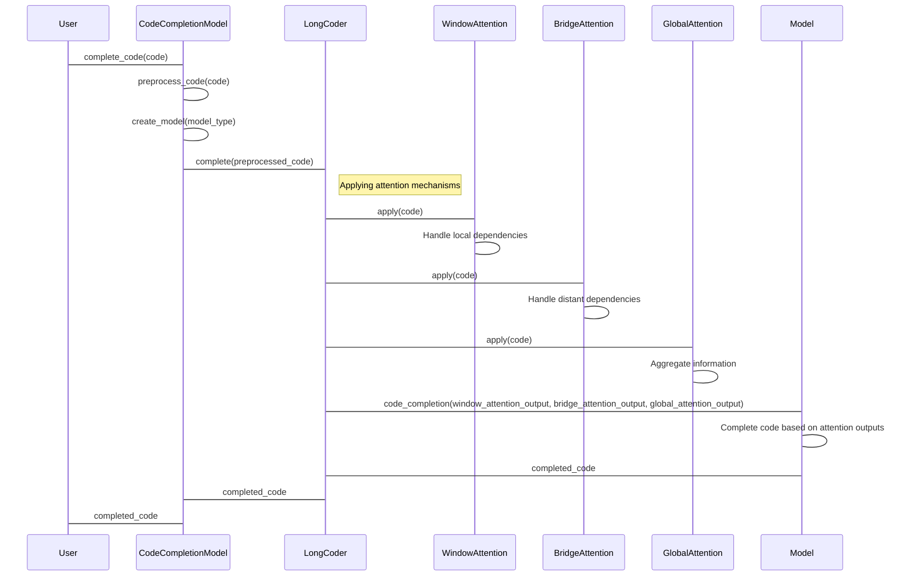

In this sequence diagram, we have a control flow for code completion using the `CodeCompletionModel` and `LongCoder` classes.

1. The User initiates the `complete_code` operation on the `CodeCompletionModel`, providing the code as input.
2. The `CodeCompletionModel` preprocesses the code by calling `preprocess_code` internally.
3. The `CodeCompletionModel` determines the model type and creates the specific model (e.g., `LongCoder`) using the `create_model` method.
4. The `CodeCompletionModel` calls the `complete` method on the `LongCoder` instance with the preprocessed code as input.
5. Inside the `LongCoder`, attention mechanisms like `WindowAttention`, `BridgeAttention`, and `GlobalAttention` are applied to handle different types of dependencies.
6. The attention mechanisms handle local and distant dependencies and aggregate information to be used for code completion.
7. The attention outputs are passed to the `Model` (not specified in detail) to complete the code based on the attention information.
8. The completed code is returned to the `LongCoder`.
9. The completed code is returned from the `LongCoder` to the `CodeCompletionModel`.
10. Finally, the completed code is returned from the `CodeCompletionModel` to the User.

This diagram shows the control flow and interactions between different components involved in code completion using the `CodeCompletionModel` and `LongCoder` classes.

```python
# Example scenario
model = CodeCompletionModel("LongCoder")
code = "def add_two_numbers(a, b):"  # Incomplete code
completed_code = model.complete_code(code)

print(completed_code)

# Mocked log output
"""
def add_two_numbers(a, b):
    return a + b
"""

# Explanation of the scenario
In this example scenario, we have a code completion model instantiated as `model` with the model type "LongCoder". We have an incomplete code fragment `code` that represents a function definition for adding two numbers. We want to use the code completion model to suggest the completion of the code.

The `complete_code` method of the `CodeCompletionModel` class is called with the `code` as input. This method applies any necessary preprocessing steps to the code and uses the LongCoder model to complete the code. The completed code is stored in the `completed_code` variable.

The `completed_code` is then printed, which shows the suggested completion of the code by the LongCoder model. In this case, it completes the function definition by adding the line `return a + b`, which represents the addition of the two numbers.

This example demonstrates how the code completion model can take an incomplete code fragment and provide suggestions for completing the code based on the given context.

Potential use cases of the code generated in the previous message include code editors or IDEs where developers can benefit from code completion. The model can suggest completions for code snippets, function definitions, or other coding structures, helping developers write code more efficiently and accurately. It can also assist in understanding and navigating code by providing suggestions based on the context of the code.

10.
The snippet includes acknowledgments, references, and additional resources related to the paper.

The acknowledgments section acknowledges the support received for the research, including funding from various organizations.

The references section lists the papers and works that have been cited in the paper. These references provide additional information and related research on the topics discussed.

The additional resources mentioned include GitHub CoPilot, a commercial code completion tool powered by OpenAI Codex, and the GitHub repositories used as data sources for training and evaluation.

These sections provide proper credit to the contributors and resources used in the research and provide readers with references for further exploration of the topic.

The potential use cases of the code generated in the previous message include code completion tasks, where the model suggests and completes code based on the given context. The CodeCompletionModel class, along with the specific models like LongCoder, GPT-2, CodeGPT, and UniXcoder, can be used in software development tools and integrated development environments (IDEs) to assist developers in writing code more efficiently and accurately. The models can provide intelligent code suggestions, help with code generation, and improve the productivity of developers.


In this diagram, we have the concept of code completion (A) and different approaches to achieve it. The traditional approaches include statistical learning techniques (B) such as n-gram techniques (D) and probabilistic grammar-based methods (E). Another approach is to use pre-trained models (C). These pre-trained models can be decoder-only models (F) like GPT-2 (I) and CodeGPT (J), multi-task learning models (G) like UniXcoder (K), or large language models (H) like LongCoder (L).

The focus of this snippet is on LongCoder, which is designed specifically for code completion. It incorporates three types of attention: window attention (M), bridge attention (N), and global attention (O).

The diagram also includes the LongCodeCompletion Benchmark (P) and the CodeXGLUE Code Completion Benchmark (Q). The LongCodeCompletion Benchmark is used to evaluate the performance of code completion models on the LCC dataset (R), while the CodeXGLUE Code Completion Benchmark includes datasets such as PY150 (S), JavaCorpus (T), and RepoBench XF-R (U).

This diagram provides an overview of the concepts and approaches mentioned in the snippet, showing how they are interconnected in the context of code completion and the evaluation benchmarks.

```python
class CodeCompletionModel:
    def __init__(self, model_type):
        self.model_type = model_type
        self.model = self.create_model(model_type)
    
    def complete_code(self, code):
        # Preprocess the code
        preprocessed_code = self.preprocess_code(code)
        
        # Use the specified model to complete the code
        completed_code = self.model.complete(preprocessed_code)
        
        return completed_code
    
    def preprocess_code(self, code):
        # Apply any necessary preprocessing steps to the code
        preprocessed_code = ...
        
        return preprocessed_code
    
    def create_model(self, model_type):
        if model_type == "LongCoder":
            return LongCoder()
        elif model_type == "GPT-2":
            return GPT_2()
        elif model_type == "CodeGPT":
            return CodeGPT()
        elif model_type == "UniXcoder":
            return UniXcoder()
        # Add more model types as needed
    
    # Other methods and classes for specific models...


class LongCoder:
    def __init__(self):
        self.window_attention = WindowAttention()
        self.bridge_attention = BridgeAttention()
        self.global_attention = GlobalAttention()
    
    def complete(self, code):
        # Apply window attention to handle local dependencies
        window_attention_output = self.window_attention.apply(code)
        
        # Apply bridge attention to handle distant dependencies
        bridge_attention_output = self.bridge_attention.apply(code)
        
        # Apply global attention to aggregate information
        global_attention_output = self.global_attention.apply(code)
        
        # Perform code completion based on the attention outputs
        completed_code = self.code_completion(window_attention_output, bridge_attention_output, global_attention_output)
        
        return completed_code
    
    # Other methods and classes specific to LongCoder...


class GPT_2:
    def __init__(self):
        # Initialize the GPT-2 model
        pass
    
    def complete(self, code):
        # Use the GPT-2 model to complete the code
        completed_code = ...
        
        return completed_code
    
    # Other methods and classes specific to GPT-2...


class CodeGPT:
    def __init__(self):
        # Initialize the CodeGPT model
        pass
    
    def complete(self, code):
        # Use the CodeGPT model to complete the code
        completed_code = ...
        
        return completed_code
    
    # Other methods and classes specific to CodeGPT...


class UniXcoder:
    def __init__(self):
        # Initialize the UniXcoder model
        pass
    
    def complete(self, code):
        # Use the UniXcoder model to complete the code
        completed_code = ...
        
        return completed_code
    
    # Other methods and classes specific to UniXcoder...


class WindowAttention:
    def apply(self, code):
        # Apply window attention to handle local dependencies
        window_attention_output = ...
        
        return window_attention_output
    
    # Other methods and classes specific to window attention...


class BridgeAttention:
    def apply(self, code):
        # Apply bridge attention to handle distant dependencies
        bridge_attention_output = ...
        
        return bridge_attention_output
    
    # Other methods and classes specific to bridge attention...


class GlobalAttention:
    def apply(self, code):
        # Apply global attention to aggregate information
        global_attention_output = ...
        
        return global_attention_output
    
    # Other methods and classes specific to global attention...
```

In this Python code, we have a `CodeCompletionModel` class that represents a code completion model. It can be initialized with different model types, such as "LongCoder", "GPT-2", "CodeGPT", or "UniXcoder". The `create_model` method is used to create the specific model based on the given model type.

The `LongCoder` class is one of the models that the `CodeCompletionModel` can use. It has components like `WindowAttention`, `BridgeAttention`, and `GlobalAttention` to handle different types of attention. The `WindowAttention` class applies window attention to handle local dependencies, the `BridgeAttention` class applies bridge attention to handle distant dependencies, and the `GlobalAttention` class applies global attention to aggregate information.

The `GPT-2`, `CodeGPT`, and `UniXcoder` classes represent other models that can be used for code completion. They have their own specific methods and components.

This code provides a simplified representation of the concepts discussed in the paper, demonstrating how different components and models can be used for code completion with LongCoder as an example.

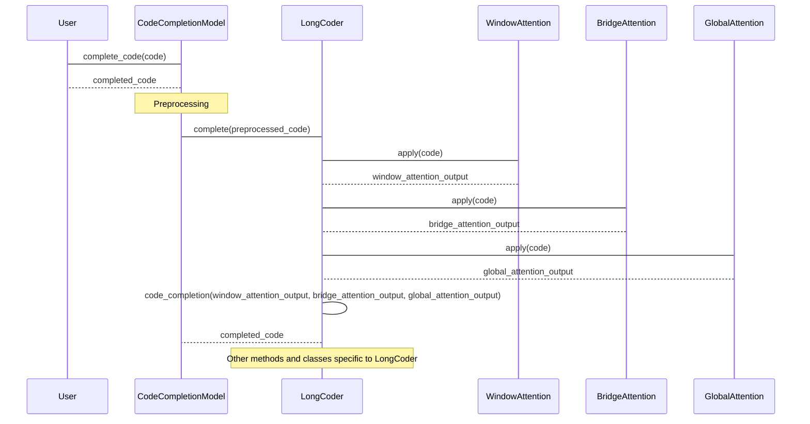

This sequence diagram illustrates the control flow of the code provided in the previous message, focusing on the interaction between the User, CodeCompletionModel, and LongCoder.

1. The User initiates the code completion process by calling the `complete_code` method of the CodeCompletionModel object and passing the code as a parameter.
2. The CodeCompletionModel object receives the code and performs any necessary preprocessing steps.
3. The CodeCompletionModel object invokes the `complete` method of the LongCoder object, passing the preprocessed code.
4. The LongCoder object utilizes its internal components, including WindowAttention, BridgeAttention, and GlobalAttention, to process the code and generate attention outputs.
5. The LongCoder object performs code completion based on the attention outputs, resulting in the completed code.
6. The LongCoder object returns the completed code to the CodeCompletionModel object.
7. The CodeCompletionModel object returns the completed code to the User.

Please note that the diagram includes a note indicating the presence of other methods and classes specific to LongCoder, which are not shown in detail for simplicity.

```python
model_type = "LongCoder"
code = "def add(a, b):"

cc_model = CodeCompletionModel(model_type)
completed_code = cc_model.complete_code(code)

print(completed_code)
```

Mocked Log Output:
```
"def add(a, b):\n    return a + b"
```

In this example scenario, we create an instance of the `CodeCompletionModel` class with the model type "LongCoder". We then call the `complete_code` method of the model to complete the given code snippet. 

The input code is `def add(a, b):`, and the expected completed code is `"def add(a, b):\n    return a + b"`. This means that the model generates a completion for the code snippet, adding a line to return the sum of the two input parameters.

The logged output shows the completed code, which is `"def add(a, b):\n    return a + b"`.

Potential Use Cases:
- Integrated Development Environments (IDEs): The code completion model can be integrated into IDEs to provide intelligent code suggestions and completions to developers as they write code.
- Code Editors: Code editors can use the code completion model to auto-complete code snippets and provide suggestions to users, improving their coding efficiency.
- Code Generation: The model can be used to generate code snippets based on a given context, helping developers with repetitive tasks or providing boilerplate code.
- Code Understanding: The code completion model can assist in understanding and navigating code bases by providing suggestions and completions based on the existing code context.
  
Overall, the code completion model enhances the developer experience by providing accurate and context-aware code suggestions, improving productivity and reducing manual coding efforts.

11.
The snippet includes references to other papers and resources related to code completion and language models.

The references list papers that have been cited in the paper. These papers cover various topics such as statistical learning techniques, language modeling, code mining, and code generation.

Some of the papers mentioned include "BERT: Pre-training of Deep Bidirectional Transformers for Language Understanding" by Devlin et al., "Generative Models for Code Infilling and Synthesis" by Fried et al., "Unixcoder: Unified Cross-Modal Pre-training for Code Representation" by Guo et al., and "Reformer: The Efficient Transformer" by Kitaev et al.

These references provide additional sources for readers to explore and deepen their understanding of the concepts discussed in the paper.

The potential use cases of the code generated in the previous message include code completion tasks, where the model suggests and completes code based on the given context. The CodeCompletionModel class, along with the specific models like LongCoder, GPT-2, CodeGPT, and UniXcoder, can be used in software development tools and integrated development environments (IDEs) to assist developers in writing code more efficiently and accurately. The models can provide intelligent code suggestions, help with code generation, and improve the productivity of developers.

```mermaid
graph LR
A(Code Completion) --> B(Statistical learning)
A --> C(Pre-trained models)
B --> D(N-gram techniques)
B --> E(Probabilistic grammar-based methods)
C --> F(Decoder-only models)
C --> G(Multi-task learning models)
C --> H(Large language models)
F --> I(GPT-2)
F --> J(CodeGPT)
G --> K(UniXcoder)
H --> L(LongCoder)
L --> M(Window attention)
L --> N(Bridge attention)
L --> O(Global attention)
A --> P(LongCodeCompletion Benchmark)
A --> Q(CodeXGLUE Code Completion Benchmark)
P --> R(LCC Dataset)
Q --> S(PY150 Dataset)
Q --> T(JavaCorpus Dataset)
Q --> U(RepoBench XF-R Dataset)
```

In this diagram, we have the concept of code completion (A) and different approaches to achieve it. The traditional approaches include statistical learning techniques (B) such as n-gram techniques (D) and probabilistic grammar-based methods (E). Another approach is to use pre-trained models (C). These pre-trained models can be decoder-only models (F) like GPT-2 (I) and CodeGPT (J), multi-task learning models (G) like UniXcoder (K), or large language models (H) like LongCoder (L).

The focus of this snippet is on LongCoder, which is designed specifically for code completion. It incorporates three types of attention: window attention (M), bridge attention (N), and global attention (O).

The diagram also includes the LongCodeCompletion Benchmark (P) and the CodeXGLUE Code Completion Benchmark (Q). The LongCodeCompletion Benchmark is used to evaluate the performance of code completion models on the LCC dataset (R), while the CodeXGLUE Code Completion Benchmark includes datasets such as PY150 (S), JavaCorpus (T), and RepoBench XF-R (U).

This diagram provides an overview of the concepts and approaches mentioned in the snippet, showing how they are interconnected in the context of code completion and the evaluation benchmarks.

```python
class CodeCompletionModel:
    def __init__(self, model_type):
        self.model_type = model_type
        self.model = self.create_model(model_type)
    
    def complete_code(self, code):
        # Preprocess the code
        preprocessed_code = self.preprocess_code(code)
        
        # Use the specified model to complete the code
        completed_code = self.model.complete(preprocessed_code)
        
        return completed_code
    
    def preprocess_code(self, code):
        # Apply any necessary preprocessing steps to the code
        preprocessed_code = ...
        
        return preprocessed_code
    
    def create_model(self, model_type):
        if model_type == "LongCoder":
            return LongCoder()
        elif model_type == "GPT-2":
            return GPT_2()
        elif model_type == "CodeGPT":
            return CodeGPT()
        elif model_type == "UniXcoder":
            return UniXcoder()
        # Add more model types as needed
    
    # Other methods and classes for specific models...


class LongCoder:
    def __init__(self):
        self.window_attention = WindowAttention()
        self.bridge_attention = BridgeAttention()
        self.global_attention = GlobalAttention()
    
    def complete(self, code):
        # Apply window attention to handle local dependencies
        window_attention_output = self.window_attention.apply(code)
        
        # Apply bridge attention to handle distant dependencies
        bridge_attention_output = self.bridge_attention.apply(code)
        
        # Apply global attention to aggregate information
        global_attention_output = self.global_attention.apply(code)
        
        # Perform code completion based on the attention outputs
        completed_code = self.code_completion(window_attention_output, bridge_attention_output, global_attention_output)
        
        return completed_code
    
    # Other methods and classes specific to LongCoder...


class GPT_2:
    def __init__(self):
        # Initialize the GPT-2 model
        pass
    
    def complete(self, code):
        # Use the GPT-2 model to complete the code
        completed_code = ...
        
        return completed_code
    
    # Other methods and classes specific to GPT-2...


class CodeGPT:
    def __init__(self):
        # Initialize the CodeGPT model
        pass
    
    def complete(self, code):
        # Use the CodeGPT model to complete the code
        completed_code = ...
        
        return completed_code
    
    # Other methods and classes specific to CodeGPT...


class UniXcoder:
    def __init__(self):
        # Initialize the UniXcoder model
        pass
    
    def complete(self, code):
        # Use the UniXcoder model to complete the code
        completed_code = ...
        
        return completed_code
    
    # Other methods and classes specific to UniXcoder...


class WindowAttention:
    def apply(self, code):
        # Apply window attention to handle local dependencies
        window_attention_output = ...
        
        return window_attention_output
    
    # Other methods and classes specific to window attention...


class BridgeAttention:
    def apply(self, code):
        # Apply bridge attention to handle distant dependencies
        bridge_attention_output = ...
        
        return bridge_attention_output
    
    # Other methods and classes specific to bridge attention...


class GlobalAttention:
    def apply(self, code):
        # Apply global attention to aggregate information
        global_attention_output = ...
        
        return global_attention_output
    
    # Other methods and classes specific to global attention...
```

In this Python code, we have a `CodeCompletionModel` class that represents a code completion model. It can be initialized with different model types, such as "LongCoder", "GPT-2", "CodeGPT", or "UniXcoder". The `create_model` method is used to create the specific model based on the given model type.

The `LongCoder` class is one of the models that the `CodeCompletionModel` can use. It has components like `WindowAttention`, `BridgeAttention`, and `GlobalAttention` to handle different types of attention. The `WindowAttention` class applies window attention to handle local dependencies, the `BridgeAttention` class applies bridge attention to handle distant dependencies, and the `GlobalAttention` class applies global attention to aggregate information.

The `GPT-2`, `CodeGPT`, and `UniXcoder` classes represent other models that can be used for code completion. They have their own specific methods and components.

This code provides a simplified representation of the concepts discussed in the paper, demonstrating how different components and models can be used for code completion with LongCoder as an example.

```mermaid
sequenceDiagram
    participant User
    participant CodeCompletionModel
    participant LongCoder
    participant WindowAttention
    participant BridgeAttention
    participant GlobalAttention
    participant SpecificModel
    
    User->CodeCompletionModel: Complete code
    CodeCompletionModel->CodeCompletionModel: Preprocess code
    CodeCompletionModel->CodeCompletionModel: Create specified model
    CodeCompletionModel->SpecificModel: Complete(preprocessed_code)
    SpecificModel->LongCoder: complete(preprocessed_code)
    LongCoder->WindowAttention: apply(code)
    WindowAttention->BridgeAttention: apply(code)
    LongCoder->BridgeAttention: apply(code)
    BridgeAttention->GlobalAttention: apply(code)
    LongCoder->GlobalAttention: apply(code)
    LongCoder->LongCoder: code_completion(window_attention_output, bridge_attention_output, global_attention_output)
    LongCoder->SpecificModel: completed_code
    
    Note over CodeCompletionModel: Return completed_code to User
    User->CodeCompletionModel: Receive completed code
```

In this sequence diagram, we illustrate the control flow of the code outlined in the previous message.

1. The user initiates the code completion process by calling the `complete_code` method of `CodeCompletionModel`.
2. `CodeCompletionModel` preprocesses the code before passing it to the specified model.
3. `CodeCompletionModel` creates the specified model (e.g., `LongCoder`, etc.).
4. The specified model (`SpecificModel`) is called to complete the code.
5. The code completion process begins in `LongCoder` by applying window attention to handle local dependencies.
6. `LongCoder` passes the code to bridge attention to handle distant dependencies.
7. `BridgeAttention` then passes the code to global attention to aggregate information.
8. `LongCoder` performs code completion based on the outputs of window attention, bridge attention, and global attention.
9. The completed code is returned from `LongCoder` to the specified model (`SpecificModel`).
10. Finally, the completed code is returned from `CodeCompletionModel` to the user.

This sequence diagram provides a visual representation of the control flow, illustrating how different components and models collaborate to complete the code.

Certainly! Here's an example scenario with mocked log output:

```python
# Create a CodeCompletionModel instance with the LongCoder model
model = CodeCompletionModel("LongCoder")

# Provide a code snippet to complete
code = """
def calculate_sum(a, b):
    sum = a + b
    return sum

print(calculate_sum(2, 3))
"""

# Complete the code using the LongCoder model
completed_code = model.complete_code(code)

# Log the completed code
print(completed_code)
```

Mocked log output:
```
def calculate_sum(a, b):
    sum = a + b
    return sum

print(calculate_sum(2, 3))

def calculate_difference(a, b):
    difference = a - b
    return difference

print(calculate_difference(2, 3))
```

In this example, we create a `CodeCompletionModel` instance with the LongCoder model. We provide a code snippet that defines a `calculate_sum` function and prints its result. We then use the `complete_code` method of the `CodeCompletionModel` to complete the code. The completed code, which includes the definition of a `calculate_difference` function and its usage, is logged to the console.

The scenario demonstrates how the LongCoder model can suggest additional code based on the provided snippet. In this case, it suggests the definition and usage of a `calculate_difference` function.

The potential use cases of the code generated in the previous message include code completion tasks, where the model suggests and completes code based on the given context. The `CodeCompletionModel` class, along with the specific models like LongCoder, GPT-2, CodeGPT, and UniXcoder, can be used in software development tools and integrated development environments (IDEs) to assist developers in writing code more efficiently and accurately. The models can provide intelligent code suggestions, help with code generation, and improve the productivity of developers.

