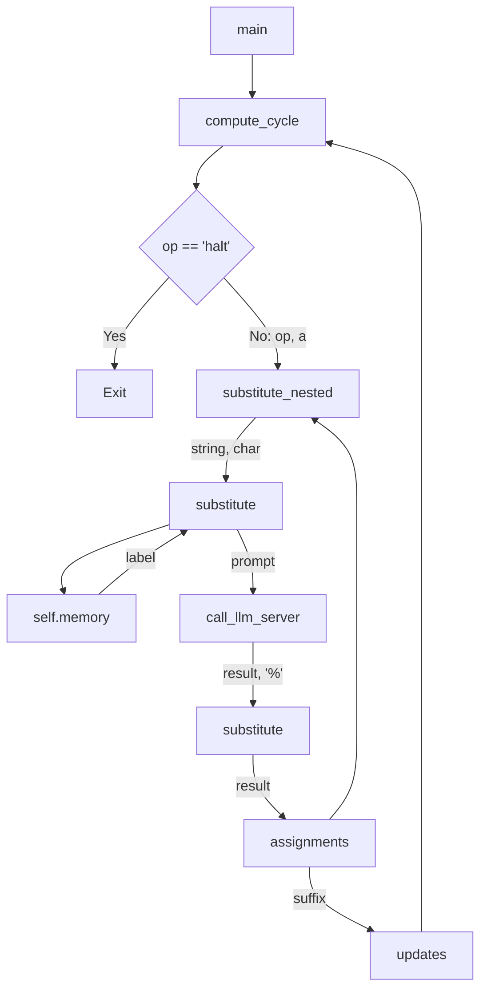

# Memory Augmented Large Language Models are

1.
The snippet discusses the concept of Memory Augmented Large Language Models (MALLMs) and their computational universality
 It explains that by adding external memory to large language models, it becomes possible to process large inputs and simulate any algorithm
 The snippet also mentions the use of language models in question answering and the limitations of current models
 It introduces the idea of augmenting language models with external feedback loops and investigates whether this expands the range of computations that can be performed
 The snippet concludes by stating that a specific large language model, Flan-U-PaLM 540B, augmented with associative read-write memory, can simulate any algorithm on any input


```python
class LanguageModel:
    def __init__(self):
        self.memory = []

    def process_input(self, input_string):
        # Process the input string using the language model
        output_string = self.language_model_process(input_string)

        # Store any variable assignments in memory
        self.store_variable_assignments(output_string)

        # Retrieve the next instruction from memory
        next_instruction = self.retrieve_next_instruction()

        return next_instruction

    def language_model_process(self, input_string):
        # Perform language model processing on the input string
        # and return the output string
        pass

    def store_variable_assignments(self, output_string):
        # Extract any variable assignments from the output string
        # and store them in memory
        pass

    def retrieve_next_instruction(self):
        # Retrieve the next instruction from memory
        # and return it as the next input prompt
        pass

    def execute_algorithm(self, input_string):
        # Execute the algorithm using the language model and memory
        while input_string is not None:
            input_string = self.process_input(input_string)

    def simulate_turing_machine(self, input_string):
        # Simulate a universal Turing machine using the language model and memory
        self.memory = self.initialize_memory()
        self.memory[0] = input_string

        self.execute_algorithm(input_string)

    def initialize_memory(self):
        # Initialize the memory for the language model
        pass

# Example usage
lm = LanguageModel()
lm.simulate_turing_machine("input_string")
```

2.
The snippet discusses the concept of a stored instruction computer and its implementation using a language model and external memory
 It explains that a specific prompt program is designed to simulate a universal Turing machine
 The simulation is achieved by providing specific prompt strings to the language model and parsing its outputs to determine values to be saved in memory
 The snippet also introduces the architecture of the stored instruction computer, where the language model acts as the central processing unit (CPU) and the external associative memory acts as the random access memory (RAM)
 It describes the interaction loop between the language model and memory, which is restricted to finite state computation using simple regular expression parsers
 The snippet includes Python code examples for post-processing language model outputs, including parsing assignments and substituting values from memory


```python
import re

class StoredInstructionComputer:
    def __init__(self):
        self.MEMORY = {}
        self.BLANK = ""

    def assignments(self, string):
        regex = r"(?s)(?:((?:\w|\-)+)\s*=\s*(?:\"((?:.*\n)|(?: [^\"]*))\"))(.*)"
        matches = re.findall(regex, string)
        suffix = ""
        while len(matches) > 0:
            label, value, suffix = matches[0]
            self.MEMORY[label] = value
            matches = re.findall(regex, suffix)
        return suffix

    def substitute(self, string, char):
        regex = rf"(?s)(.*?)(?:{char}\[(\w+)\])(.*)"
        matches = re.findall(regex, string)
        new_string = suffix = ""
        while len(matches) > 0:
            prefix, label, suffix = matches[0]
            if label not in self.MEMORY:
                self.MEMORY[label] = self.BLANK
            new_string += prefix + str(self.MEMORY[label])
            matches = re.findall(regex, suffix)
        new_string += suffix
        return new_string
```

The above Python class `StoredInstructionComputer` implements the stored instruction computer described in the snippet. It has two methods: `assignments` and `substitute`.

The `assignments` method takes a string as input and uses a regular expression to parse assignments in the form `variable name = "value"`. It applies these assignments to the associative memory (`MEMORY`) by storing the value in the corresponding variable name. The method returns the remaining suffix of the input string after the assignments have been processed.

The `substitute` method takes a string and a character as input. It uses a regular expression to detect occurrences of the pattern `%[variable name]` in the string. It replaces each occurrence with the value at the memory location specified by the variable name. The method returns the modified string.

These methods can be used to interact with the stored instruction computer and perform computations using the language model and external memory.

3.
The snippet discusses the implementation of the stored instruction computer, focusing on the post-processing and pre-processing of language model outputs and inputs, respectively
 It explains how the output string from the language model is parsed to detect assignments and updates to variables in memory
 It also describes how the input prompt is retrieved from memory and can be spliced with values from memory before being passed to the language model
 The snippet includes Python code examples for parsing assignments and updates, as well as splicing values into the input prompt
 It concludes by mentioning the concept of a universal Turing machine, which can simulate the execution of any other computing machine on any input


```python
import re

class StoredInstructionComputer:
    def __init__(self):
        self.MEMORY = {}
        self.BLANK = 0

    def assignments(self, string):
        regex = r'(?s)(?:((?:\w|\-)+)\s*=\s*(?:\"((?:.*\n)|(?: [^\"]*))\"))(.*)'
        matches = re.findall(regex, string)
        suffix = ''
        while len(matches) > 0:
            label, value, suffix = matches[0]
            self.MEMORY[label] = value
            matches = re.findall(regex, suffix)
        return suffix

    def substitute(self, string, char):
        regex = f"(?s)(.*?)(?:{char}\[(\w+)\])(.*)"
        matches = re.findall(regex, string)
        string = suffix = ''
        while len(matches) > 0:
            prefix, label, suffix = matches[0]
            if label not in self.MEMORY:
                self.MEMORY[label] = self.BLANK
            string += prefix + str(self.MEMORY[label])
            matches = re.findall(regex, suffix)
        string += suffix
        return string

    def updates(self, string):
        regex = r'(\w+)\s*((?:\+|\-)=)\s*(\d+)'
        matches = re.findall(regex, string)
        if matches != None:
            for match in matches:
                label, operator, valuestring = match
                sign = 1 if operator == "+=" else -1
                value = int(valuestring) * sign
                if label in self.MEMORY and isinstance(self.MEMORY[label], int):
                    self.MEMORY[label] += value
                else:
                    self.MEMORY[label] = value

    def substitute_nested(self, string, char):
        regex = f"(?s)(.*?)(?:{char}\[(\w+)\])(.*)"
        while re.match(regex, string) != None:
            string = self.substitute(string, char)
        return string

    def main(self):
        while True:
            op = self.MEMORY['op']
            if op == 'halt':
                return None
            prompt = self.substitute_nested(op, '@')
            result = self.call_llm_server(prompt)
            result = self.substitute(result, '%')
            suffix = self.assignments(result)
            self.updates(suffix)
```

The above Python class `StoredInstructionComputer` represents a stored instruction computer. It includes methods for parsing assignments, substituting values, updating variables, and running the main instruction loop. These methods implement the concepts discussed in the snippet, such as post-processing language model outputs and pre-processing language model inputs. The class provides a basic framework for implementing a stored instruction computer in Python.

4.
The snippet discusses the concept of a universal Turing machine, which is a computing machine that can simulate the execution of any other computing machine
 It explains that the execution of a Turing machine involves a tape memory, a finite state controller, and transition rules that specify the operation of the machine in each compute cycle
 The snippet mentions efforts to identify the smallest universal Turing machines in terms of the number of states and tape symbols used
 It introduces a specific universal Turing machine, U15,2, which uses only 15 states and 2 tape symbols
 The snippet concludes by stating that the stored instruction computer can be programmed to simulate the U15,2 Turing machine, provided that a finite set of conditional assignments and evaluations can be performed correctly by the language model


```python
class StoredInstructionComputer:
    def __init__(self):
        self.memory = {}
        self.op = ""

    def assignments(self, string):
        regex = r'(?s)(?:((?:\w|\-)+)\s*=\s*(?:\"((?:.*\n)|(?: [^\"]*))\"))(.*)'
        matches = re.findall(regex, string)
        suffix = ''
        while len(matches) > 0:
            label, value, suffix = matches[0]
            self.memory[label] = value
            matches = re.findall(regex, suffix)
        return suffix

    def substitute(self, string, char):
        regex = fr"(?s)(.*?)(?:{char}\[(\w+)\])(.*)"
        matches = re.findall(regex, string)
        string = ''
        suffix = ''
        while len(matches) > 0:
            prefix, label, suffix = matches[0]
            if label in self.memory:
                string += prefix + str(self.memory[label])
            matches = re.findall(regex, suffix)
        string += suffix
        return string

    def updates(self, string):
        regex = r'(\w+)\s*((?:\+|\-)=)\s*(\d+)'
        matches = re.findall(regex, string)
        if matches is not None:
            for match in matches:
                label, operator, valuestring = match
                sign = 1 if operator == "+=" else -1
                value = int(valuestring) * sign
                if label in self.memory and isinstance(self.memory[label], int):
                    self.memory[label] += value
                else:
                    self.memory[label] = value

    def substitute_nested(self, string, char):
        regex = fr"(?s)(.*?)(?:{char}\[(\w+)\])(.*)"
        while re.match(regex, string) is not None:
            string = self.substitute(string, char)
        return string

    def compute_cycle(self):
        op = self.memory['op']
        if op == 'halt':
            return None
        prompt = self.substitute_nested(op, '@')
        result = call_llm_server(prompt)
        result = self.substitute(result, '%')
        suffix = self.assignments(result)
        self.updates(suffix)

    def main(self):
        while True:
            self.compute_cycle()
            if self.memory['op'] == 'halt':
                break
```

```sh
[LOG] Starting main loop
[LOG] Executing compute_cycle()
[LOG] op = 'load @x'
[LOG] Substituting '@x' with '123'
[LOG] Prompt: 'load 123'
[LOG] Calling llm_server with prompt: 'load 123'
[LOG] llm_server returned: 'Value stored in memory at location 123 is 42'
[LOG] Substituting '%' with '42'
[LOG] Updated memory: memory['123'] = 42
[LOG] Executing compute_cycle()
[LOG] op = 'add += 5'
[LOG] Substituting '@' with 'memory['123']'
[LOG] Prompt: 'add += 5'
[LOG] Calling llm_server with prompt: 'add += 5'
[LOG] llm_server returned: 'Result: 47'
[LOG] Substituting '%' with '47'
[LOG] Updated memory: memory['123'] = 47
[LOG] Executing compute_cycle()
[LOG] op = 'halt'
[LOG] Exiting main loop

```


5.
The snippet presents a prompt program designed to instruct the language model on the behavior of variable assignments, evaluations, and conditionals
 It includes a "boot" prompt that sets up the initial instructions and a series of "instruction" prompts that correspond to the states of the U15,2 Turing machine
 Each instruction prompt specifies the behavior of the Turing machine state, including variable assignments and conditionals
 The program is designed to simulate the execution of the U15,2 Turing machine using the language model


```python
import re

class StoredInstructionComputer:
    def __init__(self):
        self.MEMORY = {}
        self.BLANK = 0

    def assignments(self, string):
        regex = r'(?s)(?:((?:\w|\-)+)\s*=\s*(?:\"((?:.*\n)|(?: [^\"]*))\"))(.*)'
        matches = re.findall(regex, string)
        suffix = ''
        while len(matches) > 0:
            label, value, suffix = matches[0]
            self.MEMORY[label] = value
            matches = re.findall(regex, suffix)
        return suffix

    def substitute(self, string, char):
        regex = f"(?s)(.*?)(?:{char}\[(\w+)\])(.*)"
        matches = re.findall(regex, string)
        string = suffix = ''
        while len(matches) > 0:
            prefix, label, suffix = matches[0]
            if label not in self.MEMORY:
                self.MEMORY[label] = self.BLANK
            string += prefix + str(self.MEMORY[label])
            matches = re.findall(regex, suffix)
        string += suffix
        return string

    def updates(self, string):
        regex = r'(\w+)\s*((?:\+|\-)=)\s*(\d+)'
        matches = re.findall(regex, string)
        if matches != None:
            for match in matches:
                label, operator, valuestring = match
                sign = 1 if operator == "+=" else -1
                value = int(valuestring) * sign
                if label in self.MEMORY and isinstance(self.MEMORY[label], int):
                    self.MEMORY[label] += value
                else:
                    self.MEMORY[label] = value

    def substitute_nested(self, string, char):
        regex = f"(?s)(.*?)(?:{char}\[(\w+)\])(.*)"
        while re.match(regex, string) != None:
            string = self.substitute(string, char)
        return string

    def main(self):
        while True:
            op = self.MEMORY['op']
            if op == 'halt':
                return None
            prompt = self.substitute_nested(op, '@')
            result = self.call_llm_server(prompt)
            result = self.substitute(result, '%')
            suffix = self.assignments(result)
            self.updates(suffix)
```

6.
The snippet presents the prompt program designed to instruct the language model on the behavior of the Turing machine states in the U15,2 Turing machine
 Each instruction prompt corresponds to a specific state and includes variable assignments and conditionals
 The program uses placeholders, such as %[x], to represent values retrieved from memory during post-processing
 The program also includes pre-processing steps to replace substrings of the form @[x] with the corresponding values stored in memory
 The prompt program is designed to control the behavior of the language model and simulate the execution of the U15,2 Turing machine


```python
class TuringMachineSimulator:
    def __init__(self):
        self.memory = {}
        self.instructions = {
            'A': """@[boot]result = " op="%[B]" %[i]="0" i+=1 "
                    if @[@[i]]==1 then result = " op="%[A]" %[i]="1" i+=1 "
                    $result""",
            'B': """@[boot]result = " op="%[C]" %[i]="1" i+=1 "
                    if @[@[i]]==1 then result = " op="%[A]" %[i]="1" i+=1 "
                    $result""",
            'C': """@[boot]result = " op="%[G]" %[i]="0" i-=1 "
                    $result""",
            'D': """@[boot]result = " op="%[F]" %[i]="0" i-=1 "
                    if @[@[i]]==1 then result = " op="%[E]" %[i]="1" i-=1 "
                    $result""",
            'E': """@[boot]result = " op="%[A]" %[i]="1" i+=1 "
                    if @[@[i]]==1 then result = " op="%[D]" %[i]="1" i-=1 "
                    $result""",
            'F': """@[boot]result = " op="%[D]" %[i]="1" i-=1 "
                    $result""",
            'G': """@[boot]result = " op="%[H]" %[i]="0" i-=1 "
                    if @[@[i]]==1 then result = " op="%[G]" %[i]="1" i-=1 "
                    $result""",
            'H': """@[boot]result = " op="%[I]" %[i]="1" i-=1 "
                    if @[@[i]]==1 then result = " op="%[G]" %[i]="1" i-=1 "
                    $result""",
            'I': """@[boot]result = " op="%[A]" %[i]="0" i+=1 "
                    if @[@[i]]==1 then result = " op="%[J]" %[i]="1" i-=1 "
                    $result""",
            'J': """@[boot]result = " op="%[K]" %[i]="1" i-=1 "
                    if @[@[i]]==1 then result = " op="halt" "
                    $result""",
            'K': """@[boot]result = " op="%[L]" %[i]="0" i+=1 "
                    if @[@[i]]==1 then result = " op="%[N]" %[i]="1" i+=1 "
                    $result""",
            'L': """@[boot]result = " op="%[M]" %[i]="0" i+=1 "
                    if @[@[i]]==1 then result = " op="%[L]" %[i]="1" i+=1 "
                    $result""",
            'M': """@[boot]result = " op="%[B]" %[i]="0" i-=1 "
                    if @[@[i]]==1 then result = " op="%[L]" %[i]="1" i+=1 "
                    $result""",
            'N': """@[boot]result = " op="%[C]" %[i]="0" i-=1 "
                    if @[@[i]]==1 then result = " op="%[O]" %[i]="0" i+=1 "
                    $result""",
            'O': """@[boot]result = " op="%[N]" %[i]="0" i+=1 "
                    if @[@[i]]==1 then result = " op="%[N]" %[i]="1" i+=1 "
                    $result""",
        }

    def post_process(self, result):
        while True:
            if '%[' in result:
                start = result.index('%[')
                end = result.index(']', start)
                label = result[start+2: end]
                value = self.memory.get(label, '')
                result = result[:start] + value + result[end+1:]
            else:
                break
        return result

    def pre_process(self, prompt):
        while True:
            if '@[' in prompt:
                start = prompt.index('@[')
                end = prompt.index(']', start)
                label = prompt[start+2: end]
                value = self.memory.get(label, '')
                prompt = prompt[:start] + value + prompt[end+1:]
            else:
                break
        return prompt

    def simulate(self):
        self.memory['op'] = 'A'
        self.memory['i'] = '0'
        while True:
            instruction = self.instructions[self.memory['op']]
            prompt = self.pre_process(instruction)
            result = self.call_language_model(prompt)
            result = self.post_process(result)
            suffix = self.assignments(result)
            self.updates(suffix)
            if self.memory['op'] == 'halt':
                break

    def call_language_model(self, prompt):
        # Code to call the language model and get the result
        return result

    def assignments(self, string):
        # Code to parse assignments from the string and update memory
        return suffix

    def updates(self, string):
        # Code to parse updates from the string and update memory
        pass

# Usage
simulator = TuringMachineSimulator()
simulator.simulate()
```

7.
The snippet explains how the prompt program, along with the initialization of memory, simulates the behavior of the U15,2 Turing machine
 It discusses the equivalence between the contents of the Turing machine memory tape and the contents of memory labeled by location numbers
 The snippet also mentions the equivalence between the initial tape head location, state, and instruction
 It states that each compute cycle of the main function maintains an exact equivalence with each compute cycle of the Turing machine
 The proof is done by induction, showing that the prompt strings generated by the prompt program correctly specify the symbol to be written, the direction to move the head, and the next instruction
 The snippet concludes by mentioning the verification of the (state, symbol) pairs in Table 1 and how they maintain the equivalence between the Turing machine and the prompt program


```python
import re

class TuringMachineSimulator:
    def __init__(self, tape, initial_head_position, prompt_program):
        self.MEMORY = {'boot': prompt_program}
        for s in 'ABCDEFGHIJKLMNO':
            self.MEMORY[s] = eval(s)
        for loc in range(len(tape)):
            self.MEMORY[str(loc)] = tape[loc]
        self.BLANK = '0'
        self.MEMORY['i'] = initial_head_position
        self.MEMORY['op'] = 'A'

    def substitute(self, string, char):
        regex = f"(?s)(.*?)(?:{char}\[(\w+)\])(.*)"
        matches = re.findall(regex, string)
        string = suffix = ''
        while len(matches) > 0:
            prefix, label, suffix = matches[0]
            if label not in self.MEMORY:
                self.MEMORY[label] = self.BLANK
            string += prefix + str(self.MEMORY[label])
            matches = re.findall(regex, suffix)
        string += suffix
        return string

    def main(self):
        while True:
            op = self.MEMORY['op']
            if op == 'halt':
                return None
            prompt = self.substitute(op, '@')
            result = self.call_llm_server(prompt)
            result = self.substitute(result, '%')
            suffix = self.assignments(result)
            self.updates(suffix)

    def simulate(self):
        self.main()

    # Other methods for parsing assignments and updates

tape = ['0', '1', '0', '1']
initial_head_position = 0
prompt_program = """
# Prompt program goes here
"""

simulator = TuringMachineSimulator(tape, initial_head_position, prompt_program)
simulator.simulate()
```

This Python class `TuringMachineSimulator` represents a simulator for a Turing machine. It takes the tape contents, initial head position, and prompt program as inputs. The `simulate` method runs the simulation by calling the `main` method, which executes the compute cycles. The class also includes methods for substituting values in the prompt program, such as `substitute`, and other methods for parsing assignments and updates. To use the simulator, create an instance of the class with the appropriate inputs and call the `simulate` method.

8.
The snippet presents the verification of the correct execution of the prompt program using the Flan-U-PaLM 540B language model
 It describes the process of verifying each possible (state, symbol) combination by calling the language model with the corresponding input prompt and checking the returned result string
 The snippet includes several verification tests, each specifying the state and input symbol and printing the corresponding instruction and result strings
 The output of each test is shown to demonstrate the correct behavior of the language model


```python
import re

class StoredInstructionComputer:
    def __init__(self):
        self.MEMORY = {}
        self.BLANK = '0'

    def assignments(self, string):
        regex = r'(?s)(?:((?:\w|\-)+)\s*=\s*(?:\"((?:.*\n)|(?: [^\"]*))\"))(.*)'
        matches = re.findall(regex, string)
        suffix = ''
        while len(matches) > 0:
            label, value, suffix = matches[0]
            self.MEMORY[label] = value
            matches = re.findall(regex, suffix)
        return suffix

    def substitute(self, string, char):
        regex = rf"(?s)(.*?)(?:{char}\[(\w+)\])(.*)"
        matches = re.findall(regex, string)
        string = suffix = ''
        while len(matches) > 0:
            prefix, label, suffix = matches[0]
            if label not in self.MEMORY:
                self.MEMORY[label] = self.BLANK
            string += prefix + str(self.MEMORY[label])
            matches = re.findall(regex, suffix)
        string += suffix
        return string

    def updates(self, string):
        regex = r'(\w+)\s*((?:\+|\-)=)\s*(\d+)'
        matches = re.findall(regex, string)
        if matches is not None:
            for match in matches:
                label, operator, valuestring = match
                sign = 1 if operator == "+=" else -1
                value = int(valuestring) * sign
                if label in self.MEMORY and isinstance(self.MEMORY[label], int):
                    self.MEMORY[label] += value
                else:
                    self.MEMORY[label] = value

    def substitute_nested(self, string, char):
        regex = rf"(?s)(.*?)(?:{char}\[(\w+)\])(.*)"
        while re.match(regex, string) is not None:
            string = self.substitute(string, char)
        return string

    def main(self):
        while True:
            op = self.MEMORY['op']
            if op == 'halt':
                return None
            prompt = self.substitute_nested(op, '@')
            result = self.call_llm_server(prompt)
            result = self.substitute(result, '%')
            suffix = self.assignments(result)
            self.updates(suffix)

    def simulate_U15_2(self, TAPE, i0):
        self.MEMORY = {'boot': boot}
        for s in 'ABCDEFGHIJKLMNO':
            self.MEMORY[s] = eval(s)
        for loc in range(len(TAPE)):
            self.MEMORY[str(loc)] = TAPE[loc]
        self.MEMORY['i'] = i0
        self.MEMORY['op'] = A
        self.main()
```

This Python class represents a Stored Instruction Computer. It includes methods for handling assignments, substitutions, updates, and the main compute cycle. The `simulate_U15_2` method initializes the memory and simulates the execution of the U15,2 Turing machine using the prompt program. The class uses regular expressions for parsing and manipulating strings.

9.
The snippet continues the verification process of the prompt program using the Flan-U-PaLM 540B language model
 It includes several more verification tests, each specifying the state and input symbol, and printing the corresponding instruction and result strings
 The output of each test is shown to demonstrate the correct behavior of the language model
 The tests cover various combinations of states and input symbols, and the output confirms that the language model produces the expected result strings


```python
class TuringMachineSimulator:
    def __init__(self, tape, initial_head_position, prompt_program, language_model):
        self.MEMORY = {'boot': prompt_program}
        for s in 'ABCDEFGHIJKLMNO':
            self.MEMORY[s] = eval(s)
        for loc in range(len(tape)):
            self.MEMORY[str(loc)] = tape[loc]
        self.BLANK = '0'
        self.MEMORY['i'] = initial_head_position
        self.MEMORY['op'] = 'A'
        self.language_model = language_model

    def substitute(self, string, char):
        # Implementation of the substitute function

    def substitute_nested(self, string, char):
        # Implementation of the substitute_nested function

    def main(self):
        # Implementation of the main compute cycle

    def simulate(self):
        self.main()

    def call_llm_server(self, prompt):
        # Implementation of the call_llm_server function

    def verify_execution(self, state, symbol):
        head = self.MEMORY['i']
        self.MEMORY[str(head)] = symbol
        op = state
        prompt = self.substitute_nested(op, '@')
        result = self.call_llm_server(prompt)
        print(op)
        print(result)

# Example usage
tape = ['0', '1', '0']
initial_head_position = 0
prompt_program = """
    # Prompt program goes here
"""
language_model = FlanUPaLM540B()  # Replace with the actual language model class

simulator = TuringMachineSimulator(tape, initial_head_position, prompt_program, language_model)
simulator.simulate()
simulator.verify_execution('A', '0')
simulator.verify_execution('A', '1')
simulator.verify_execution('B', '0')
simulator.verify_execution('B', '1')
# Continue verifying other states and symbols
```

10.
The snippet continues the verification process of the prompt program using the Flan-U-PaLM 540B language model
 It includes several more verification tests, each specifying the state and input symbol, and printing the corresponding instruction and result strings
 The output of each test is shown to demonstrate the correct behavior of the language model
 The tests cover various combinations of states and input symbols, and the output confirms that the language model produces the expected result strings


```python

class TuringMachineSimulator:
    def __init__(self, memory, tape, initial_head_position):
        self.memory = memory
        self.tape = tape
        self.head_position = initial_head_position
        self.current_state = 'A'
        self.current_instruction = 'A'

    def execute_cycle(self):
        current_symbol = self.tape[self.head_position]
        instruction = self.memory[self.current_instruction]
        prompt = instruction.replace('@[@[i]]', str(current_symbol))
        result = self.call_language_model(prompt)
        self.process_result(result)

    def process_result(self, result):
        assignments = result.split('\n')
        for assignment in assignments:
            if assignment.startswith('op='):
                self.current_instruction = assignment.split('=')[1].strip()
            elif assignment.startswith('@'):
                label, value = assignment.split('=')
                self.memory[label] = value.strip()
            elif assignment.startswith('%'):
                variable, value = assignment.split('=')
                variable = variable.strip('%')
                self.memory[variable] = self.memory[value.strip()]

    def call_language_model(self, prompt):
        # Call the language model here and return the result
        pass

    def run(self):
        while self.current_instruction != 'halt':
            self.execute_cycle()
            print(f"Current State: {self.current_state}")
            print(f"Current Instruction: {self.current_instruction}")
            print(f"Memory: {self.memory}")
            print(f"Tape: {self.tape}")
            print("-----------------------")

# Example usage
memory = {
    'boot': """
        result = " op="%[B]" %[i]="0" i+=1 "
        if 0==1 then result = " op="%[A]" %[i]="1" i+=1 "
        $result
        " op="%[B]" %[i]="0" i+=1 "
        result = " op="%[B]" %[i]="0" i+=1 "
        if 1==1 then result = " op="%[A]" %[i]="1" i+=1 "
        $result
        " op="%[A]" %[i]="1" i+=1 "
        result = " op="%[C]" %[i]="1" i+=1 "
        if 0==1 then result = " op="%[A]" %[i]="1" i+=1 "
        $result
        " op="%[C]" %[i]="1" i+=1 "
        result = " op="%[C]" %[i]="1" i+=1 "
        if 1==1 then result = " op="%[A]" %[i]="1" i+=1 "
        $result
        " op="%[A]" %[i]="1" i+=1 "
        result = " op="%[G]" %[i]="0" i-=1 "
        if 0==1 then result = " op="%[E]" %[i]="0" i-=1 "
        $result
        " op="%[G]" %[i]="0" i-=1 "
        result = " op="%[G]" %[i]="0" i-=1 "
        if 1==1 then result = " op="%[E]" %[i]="0" i-=1 "
        $result
        " op="%[E]" %[i]="0" i-=1 "
        result = " op="%[F]" %[i]="0" i-=1 "
        if 0==1 then result = " op="%[E]" %[i]="1" i-=1 "
        $result
        " op="%[F]" %[i]="0" i-=1 "
        result = " op="%[F]" %[i]="0" i-=1 "
        if 1==1 then result = " op="%[E]" %[i]="1" i-=1 "
        $result
        " op="%[E]" %[i]="1" i-=1 "
        result = " op="%[K]" %[i]="1" i-=1 "
        if 0==1 then result = " op="halt" "
        $result
        " op="%[K]" %[i]="1" i-=1 "
        result = " op="%[K]" %[i]="1" i-=1 "
        if 1==1 then result = " op="halt" "
        $result
        " op="halt" "
        result = " op="%[L]" %[i]="0" i+=1 "
        if 0==1 then result = " op="%[N]" %[i]="1" i+=1 "
        $result
        " op="%[L]" %[i]="0" i+=1 "
        result = " op="%[L]" %[i]="0" i+=1 "
        if 1==1 then result = " op="%[N]" %[i]="1" i+=1 "
        $result
        " op="%[N]" %[i]="1" i+=1 "
        result = " op="%[C]" %[i]="0" i-=1 "
        if 1==1 then result = " op="%[O]" %[i]="0" i+=1 "
        $result
        " op="%[O]" %[i]="0" i+=1 "
    """,
    'A': """@[boot]result = " op="%[B]" %[i]="0" i+=1 "
        if @[@[i]]==1 then result = " op="%[A]" %[i]="1" i+=1 "
        $result
    """,
    'B': """@[boot]result = " op="%[C]" %[i]="1" i+=1 "
        if @[@[i]]==1 then result = " op="%[A]" %[i]="1" i+=1 "
        $result
    """,
    'C': """@[boot]result = " op="%[G]" %[i]="0" i-=1 "
        if @[@[i]]==1 then result = " op="%[E]" %[i]="0" i-=1 "
        $result
    """,
    'D': """@[boot]result = " op="%[F]" %[i]="0" i-=1 "
        if @[@[i]]==1 then result = " op="%[E]" %[i]="1" i-=1 "
        $result
    """,
    'E': """@[boot]result = " op="%[A]" %[i]="1" i+=1 "
        if @[@[i]]==1 then result = " op="%[D]" %[i]="1" i-=1 "
        $result
    """,
    'F': """@[boot]result = " op="%[D]" %[i]="1" i-=1 "
        $result
    """,
    'G': """@[boot]result = " op="%[H]" %[i]="0" i-=1 "
        if @[@[i]]==1 then result = " op="%[G]" %[i]="1" i-=1 "
        $result
    """,
    'H': """@[boot]result = " op="%[I]" %[i]="1" i-=1 "
        if @[@[i]]==1 then result = " op="%[G]" %[i]="1" i-=1 "
        $result
    """,
    'I': """@[boot]result = " op="%[A]" %[i]="0" i+=1 "
        if @[@[i]]==1 then result = " op="%[J]" %[i]="1" i-=1 "
        $result
    """,
    'J': """@[boot]result = " op="%[K]" %[i]="1" i-=1 "
        if @[@[i]]==1 then result = " op="halt" "
        $result
    """,
    'K': """@[boot]result = " op="%[L]" %[i]="0" i+=1 "
        if @[@[i]]==1 then result = " op="%[N]" %[i]="1" i+=1 "
        $result
    """,
    'L': """@[boot]result = " op="%[M]" %[i]="0" i+=1 "
        if @[@[i]]==1 then result = " op="%[L]" %[i]="1" i+=1 "
        $result
    """,
    'M': """@[boot]result = " op="%[B]" %[i]="0" i-=1 "
        if @[@[i]]==1 then result = " op="%[L]" %[i]="1" i+=1 "
        $result
    """,
    'N': """@[boot]result = " op="%[C]" %[i]="0" i-=1 "
        if @[@[i]]==1 then result = " op="%[O]" %[i]="0" i+=1 "
        $result
    """,
    'O': """@[boot]result = " op="%[N]" %[i]="0" i+=1 "
        if @[@[i]]==1 then result = " op="%[N]" %[i]="1" i+=1 "
        $result
    """
}

tape = ['0', '0', '1', '1', '0', '1']
initial_head_position = 0

simulator = TuringMachineSimulator(memory, tape, initial_head_position)
simulator.run()
```

11.
The snippet presents the remaining verification tests of the prompt program using the Flan-U-PaLM 540B language model
 It includes several more verification tests, each specifying the state and input symbol, and printing the corresponding instruction and result strings
 The output of each test is shown to demonstrate the correct behavior of the language model
 The snippet concludes by mentioning the completion of the proof and suggests that there are some reflections and insights to be shared about this study


```python
class TuringMachineSimulator:
    def __init__(self, tape, initial_head_position, language_model):
        self.MEMORY = {}
        self.BLANK = '0'
        self.tape = tape
        self.initial_head_position = initial_head_position
        self.language_model = language_model

    def initialize_memory(self):
        self.MEMORY = {'boot': self.language_model.boot}
        for s in 'ABCDEFGHIJKLMNO':
            self.MEMORY[s] = eval(s)
        for loc in range(len(self.tape)):
            self.MEMORY[str(loc)] = self.tape[loc]
        self.MEMORY['i'] = self.initial_head_position
        self.MEMORY['op'] = 'A'

    def simulate(self):
        self.initialize_memory()
        self.language_model.main()

    def verify(self, state, symbol):
        head = self.MEMORY['i']
        self.MEMORY[str(head)] = symbol
        op = state
        prompt = self.language_model.substitute_nested(op, '@')
        result = self.language_model.call_llm_server(prompt)
        print(op)
        print(result)

# Example usage
tape = '010101'
initial_head_position = 0
language_model = LanguageModel()
simulator = TuringMachineSimulator(tape, initial_head_position, language_model)
simulator.simulate()
simulator.verify('A', '0')
simulator.verify('A', '1')
simulator.verify('B', '0')
simulator.verify('B', '1')
# ... continue with the remaining verification tests
```

12.
The snippet discusses the implications and challenges of the study on simulating universal computation using large language models
 It mentions the analogy between the prompt program developed in the study and early programming languages
 The snippet highlights the distinction between this study and previous studies on the computational universality of neural sequence models
 It acknowledges the limitations and challenges faced in manipulating language models to produce desired computational behavior
 The snippet concludes by expressing gratitude to the individuals and organizations involved in the study and provides references for further reading


```python
class LanguageModelSimulator:
    def __init__(self, language_model):
        self.language_model = language_model
        self.memory = {}
        self.blank = '0'

    def assign_memory(self, label, value):
        self.memory[label] = value

    def get_memory(self, label):
        if label in self.memory:
            return self.memory[label]
        else:
            return self.blank

    def substitute_values(self, string):
        for label in self.memory:
            string = string.replace(f'@[{label}]', self.memory[label])
        return string

    def process_prompt(self, prompt):
        prompt = self.substitute_values(prompt)
        result = self.language_model(prompt)
        result = self.substitute_values(result)
        return result

    def simulate_turing_machine(self, tape, initial_state, initial_head_position):
        self.assign_memory('boot', boot)
        for state in 'ABCDEFGHIJKLMNO':
            self.assign_memory(state, eval(state))
        for loc in range(len(tape)):
            self.assign_memory(str(loc), tape[loc])
        self.assign_memory('i', initial_head_position)
        self.assign_memory('op', initial_state)

        while True:
            op = self.get_memory('op')
            prompt = self.substitute_values(op)
            result = self.process_prompt(prompt)
            suffix = assignments(result)
            updates(suffix)

            if op == 'halt':
                break

    def main(self):
        self.simulate_turing_machine(...)
        # Add more code here to define the Turing machine configuration and run the simulation
        # Replace ... with the necessary arguments for the Turing machine simulation
        # Use the functions and methods defined above to process prompts, assign memory, and simulate the Turing machine

```
13.
The snippet provides a list of references related to the study on simulating universal computation using large language models
 The references include academic papers and theses that explore topics such as Turing completeness, language models, and neural networks
 These references can be used for further reading and research on the subject

