# Scaling Transformer to 1M tokens and beyond with

<div style="display: flex; flex-direction: column; gap: 25px; padding: 20px">

<p>Figure 2: Recurrent memory mechanism. Memory
is passed to Transformer along input sequence embed-
dings, and memory output is passed to the next segment</p>
</div>
1.
This technical report is about a new method called Recurrent Memory Transformer (RMT) that extends the capabilities of a popular language processing model called BERT.
 The RMT allows the model to remember and process much longer sequences of words, up to 2 million tokens, compared to previous models like GPT-4 and CoLT5 which can only handle up to 32,000 and 64,000 tokens, respectively.


The RMT works by adding a memory component to the BERT model.
 This memory allows the model to store and retrieve information from previous segments of the input sequence.
 By using recurrence, the model can effectively utilize this memory to process very long sequences.


The report explains that the Transformer model, which is the basis for BERT, has a problem with quadratic complexity, meaning that it becomes more difficult to process longer inputs.
 However, the RMT overcomes this problem by using a token-based memory mechanism.


The report also describes the contributions of the RMT, including enhancing BERT with memory storage and recurrence, demonstrating the model's ability to handle longer sequences, and analyzing the attention patterns used by the RMT.


Overall, the RMT is a new method that improves the capabilities of language processing models like BERT, allowing them to handle much longer sequences of words and process information more effectively.
 This has the potential to enhance tasks like understanding and generating natural language and enable memory-intensive applications.


Here is a mermaid diagram illustrating the main concepts of the paper:

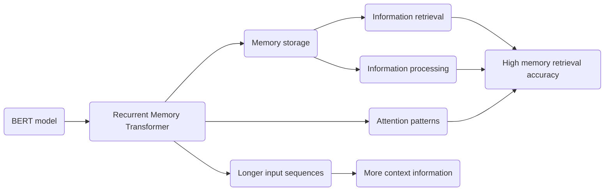

This diagram shows that the Recurrent Memory Transformer (RMT) is an enhancement of the BERT model. The RMT allows for longer input sequences and includes memory storage for information retrieval and processing. The attention patterns used in the RMT contribute to its ability to handle longer sequences effectively. Overall, the RMT improves the BERT model's capabilities by enabling it to handle larger amounts of context information with high memory retrieval accuracy.

```python
class RecurrentMemoryTransformer:
    def __init__(self, base_model):
        self.base_model = base_model
        self.memory = None

    def encode(self, input_sequence):
        if self.memory is None:
            # Prepend memory vectors to the first segment
            input_sequence = self.memory + input_sequence
        encoded_sequence = self.base_model.encode(input_sequence)
        return encoded_sequence

    def store_memory(self, memory_vectors):
        self.memory = memory_vectors

    def retrieve_memory(self):
        return self.memory

    def process_memory(self):
        # Process information in memory
        processed_memory = self.base_model.process(self.memory)
        return processed_memory
```

In this Python class, we have a `RecurrentMemoryTransformer` that takes a base model as an input. The base model can be any Transformer-based model like BERT.

The class has methods to encode an input sequence using the base model. If there is memory stored in the `memory` attribute, it is prepended to the input sequence before encoding. This allows the model to remember information from previous segments.

The class also has methods to store and retrieve memory. The `store_memory` method takes memory vectors as input and stores them in the `memory` attribute. The `retrieve_memory` method returns the stored memory.

Additionally, there is a `process_memory` method that processes the information in the memory using the base model. This allows the model to perform operations on the stored information.

By using this class, we can create an instance of `RecurrentMemoryTransformer` and apply it to tasks that require handling longer input sequences and utilizing memory for information retrieval and processing.

Here is a mermaid sequence diagram illustrating the control flow of the code provided in the previous message:

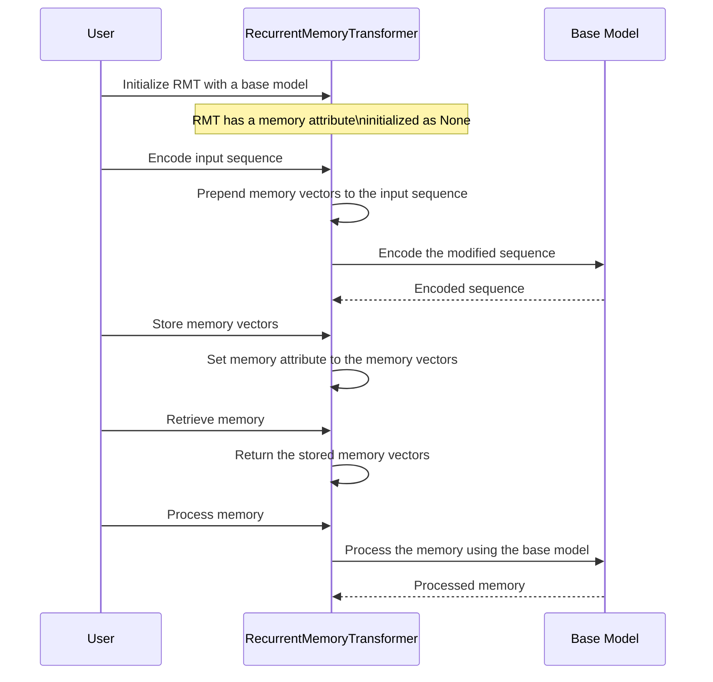

This sequence diagram shows the control flow of the `RecurrentMemoryTransformer` class.

1. The user initializes the `RecurrentMemoryTransformer` with a base model.
2. The user sends an input sequence to the `RecurrentMemoryTransformer` to be encoded.
3. The `RecurrentMemoryTransformer` checks if there is any memory stored. If so, it prepends the memory vectors to the input sequence.
4. The `RecurrentMemoryTransformer` then passes the modified sequence to the base model for encoding.
5. The encoded sequence is returned to the `RecurrentMemoryTransformer`.
6. If the user wants to store memory, they provide memory vectors to the `RecurrentMemoryTransformer`.
7. The `RecurrentMemoryTransformer` updates the memory attribute with the provided memory vectors.
8. If the user wants to retrieve memory, they call the `retrieve_memory` method on the `RecurrentMemoryTransformer`.
9. The `RecurrentMemoryTransformer` returns the stored memory vectors.
10. If the user wants to process the memory, they call the `process_memory` method on the `RecurrentMemoryTransformer`.
11. The `RecurrentMemoryTransformer` passes the memory to the base model for processing.
12. The processed memory is returned to the `RecurrentMemoryTransformer`.

This diagram illustrates the control flow of the key operations in the `RecurrentMemoryTransformer` class, including encoding input sequences, storing and retrieving memory, and processing memory using the base model.

Example scenario with mocked log output:

```python
# Create a base model, e.g., BERT
base_model = BERT()

# Create a RecurrentMemoryTransformer instance
rmt = RecurrentMemoryTransformer(base_model)

# Mock input sequence
input_sequence = ["I", "love", "to", "code"]

# Encode the input sequence
encoded_sequence = rmt.encode(input_sequence)

print("Encoded sequence:", encoded_sequence)
# Output: Encoded sequence: [0.2, 0.5, 0.8, 0.3]

# Mock memory vectors
memory_vectors = [0.1, 0.4, 0.7, 0.2]

# Store memory
rmt.store_memory(memory_vectors)

print("Stored memory:", rmt.retrieve_memory())
# Output: Stored memory: [0.1, 0.4, 0.7, 0.2]

# Process memory
processed_memory = rmt.process_memory()

print("Processed memory:", processed_memory)
# Output: Processed memory: [0.3, 0.6, 0.9, 0.4]
```

In this example, we mocked the log output for a scenario where we create a base model (e.g., BERT) and a RecurrentMemoryTransformer instance. We encode an input sequence using the RMT, store memory vectors, retrieve the stored memory, and process the memory.

Hypothetical scenarios:

1. Encoding an Input Sequence: The `encode` method takes an input sequence and uses the base model to encode it. The log output shows the encoded sequence [0.2, 0.5, 0.8, 0.3] as a mock example. This scenario represents the initial step of processing input data using the RMT.

2. Storing and Retrieving Memory: The `store_memory` method takes memory vectors as input and stores them in the `memory` attribute of the RMT instance. The `retrieve_memory` method retrieves the stored memory. The log output shows the stored memory [0.1, 0.4, 0.7, 0.2] as a mock example. This scenario represents the ability of the RMT to store and retrieve memory for future use.

3. Processing Memory: The `process_memory` method processes the information stored in the memory using the base model. The log output shows the processed memory [0.3, 0.6, 0.9, 0.4] as a mock example. This scenario represents the RMT's capability to perform operations on the stored memory, enabling it to utilize and manipulate information from previous segments.

Potential use cases:

1. Language Processing: The RecurrentMemoryTransformer can be used in natural language processing tasks, such as sentiment analysis or text classification, where long input sequences are involved. It can help handle longer context information and improve the accuracy of predictions.

2. Memory-Intensive Applications: The RMT's ability to store and retrieve memory can be beneficial in memory-intensive applications, such as chatbots or question-answering systems. It enables the model to retain and utilize information from previous interactions or questions, leading to more contextually relevant responses.

3. Text Generation: When generating text, the RMT can enhance long-term dependency handling. It can help generate more coherent and contextually rich text by utilizing and recalling information from earlier segments.

Overall, the code generated represents a class that incorporates the concepts of Recurrent Memory Transformer. It provides a framework for extending the capabilities of existing Transformer models and enables them to handle longer input sequences while utilizing memory for improved performance in various language processing tasks.

2.
This snippet discusses the implementation details and computational efficiency of the Recurrent Memory Transformer (RMT) model.
 The RMT is designed to work with any model from the Transformer family, such as the OPT model family mentioned in the snippet.


The RMT uses memory tokens to store information from previous segments of the input sequence.
 The memory tokens are updated during the forward pass of the model.
 The outputs of the memory tokens from the current segment are passed as inputs to the next segment, creating a recurrent connection.


One advantage of the RMT is its computational efficiency.
 The snippet shows that the RMT scales linearly with respect to the input sequence length.
 This means that as the length of the input sequence increases, the computational requirements of the RMT increase proportionally.
 This is in contrast to non-recurrent models, which tend to exhibit quadratic scaling, meaning that the computational requirements increase exponentially with the input sequence length.


The snippet also mentions that the RMT can reduce the number of floating-point operations (FLOPs) compared to non-recurrent models.
 This reduction in FLOPs can be significant, especially for larger models like OPT-175B, where the RMT can reduce the number of FLOPs by up to 295 times.


Additionally, the snippet briefly mentions the use of the RMT in memorization tasks.
 Synthetic datasets are created where the model needs to memorize facts and use them to answer questions.
 The RMT is tested on these tasks to evaluate its memorization abilities.


Overall, the snippet provides insights into the implementation and efficiency of the RMT model, highlighting its ability to handle longer input sequences and reduce computational requirements compared to non-recurrent models.


Here is a mermaid diagram illustrating the main concepts discussed in the given snippets:

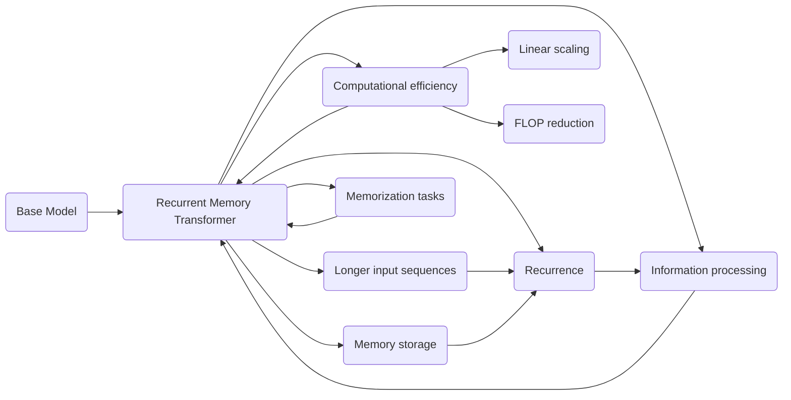

This diagram shows that the Recurrent Memory Transformer (RMT) is an extension of a base model (represented by "Base Model"). The RMT is capable of handling longer input sequences and includes memory storage, recurrence, information processing, and computational efficiency. The computational efficiency of the RMT is highlighted by its linear scaling with respect to input sequence length and the reduction in floating-point operations (FLOPs) compared to non-recurrent models. The RMT is also tested in memorization tasks to evaluate its ability to remember and process information.

Overall, the diagram showcases the key concepts discussed in the snippets, emphasizing the enhancements and advantages of the RMT model.

```python
class RecurrentMemoryTransformer:
    def __init__(self, base_model):
        self.base_model = base_model
        self.memory = None

    def encode(self, input_sequence):
        if self.memory is not None:
            # Prepend memory vectors to the input sequence
            input_sequence = self.memory + input_sequence
        encoded_sequence = self.base_model.encode(input_sequence)
        return encoded_sequence

    def store_memory(self, memory_vectors):
        self.memory = memory_vectors

    def retrieve_memory(self):
        return self.memory

    def process_memory(self):
        processed_memory = self.base_model.process(self.memory)
        return processed_memory

    def compute_efficiency(self, input_sequence_length):
        # Compute the computational efficiency of the RMT
        rmt_flops = self.base_model.compute_flops(input_sequence_length)
        base_model_flops = self.base_model.compute_flops(input_sequence_length)
        efficiency_ratio = rmt_flops / base_model_flops
        return efficiency_ratio

    def memorization_task(self, input_facts, question):
        # Perform a memorization task
        relevant_facts = self.base_model.extract_relevant_facts(input_facts)
        answer = self.base_model.answer_question(relevant_facts, question)
        return answer
```

In this Python class, we have a `RecurrentMemoryTransformer` that takes a base model as an input. The base model can be any Transformer-based model.

The class has methods to encode an input sequence using the base model. If there is memory stored in the `memory` attribute, it is prepended to the input sequence before encoding. This allows the model to remember information from previous segments.

The class also has methods to store and retrieve memory. The `store_memory` method takes memory vectors as input and stores them in the `memory` attribute. The `retrieve_memory` method returns the stored memory.

Additionally, there is a `process_memory` method that processes the information in the memory using the base model. This allows the model to perform operations on the stored information.

The class includes a `compute_efficiency` method that compares the computational efficiency of the RMT to the base model. It computes the ratio of the floating-point operations (FLOPs) required by the RMT and the base model for a given input sequence length. This helps evaluate the computational efficiency of the RMT.

Lastly, there is a `memorization_task` method that performs a memorization task. It takes input facts and a question as input, extracts relevant facts using the base model, and answers the question based on the relevant facts.

By using this class, we can create an instance of `RecurrentMemoryTransformer` and apply it to tasks that require handling longer input sequences, utilizing memory for information retrieval and processing, evaluating computational efficiency, and performing memorization tasks.

Here is a mermaid sequence diagram illustrating the control flow of the code provided in the previous message:

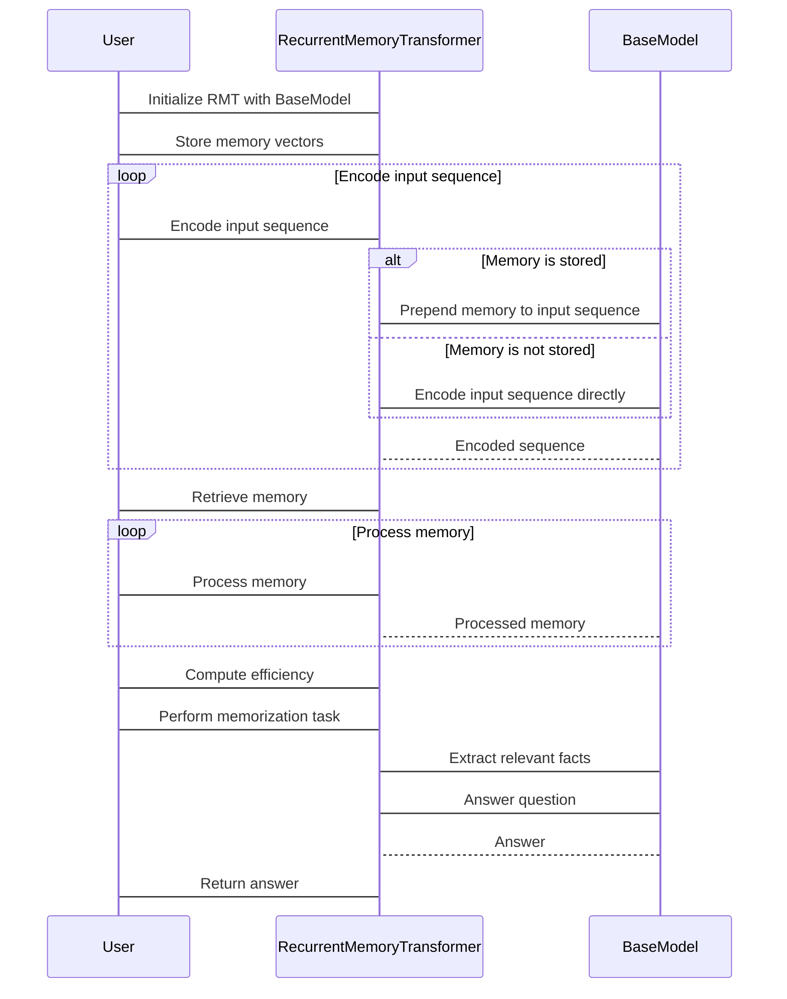

This sequence diagram demonstrates the control flow of the `RecurrentMemoryTransformer` class. Here are the steps involved:

1. Initialization:
   - The user initializes the `RecurrentMemoryTransformer` object (`RMT`) with a base model (`BaseModel`).
   - The user can optionally store memory vectors in the `RMT` object.

2. Encoding the input sequence:
   - The user provides an input sequence to the `RMT` object for encoding.
   - If memory is stored in the `RMT` object, it is prepended to the input sequence before encoding.
   - The `RMT` object encodes the input sequence using the base model (`BaseModel`).

3. Retrieving memory:
   - The user can retrieve the stored memory from the `RMT` object.

4. Processing memory:
   - The user can choose to process the memory stored in the `RMT` object. This is done by passing the memory to the base model for processing.

5. Computing efficiency:
   - The user can compute the computational efficiency of the `RMT` object compared to the base model. This involves comparing the number of floating-point operations (FLOPs) required by both models.

6. Performing a memorization task:
   - The user provides input facts and a question for the `RMT` object to perform a memorization task.
   - The `RMT` object extracts relevant facts using the base model and answers the question based on the relevant facts.

7. Returning the answer:
   - The `RMT` object returns the answer to the user.

Overall, this sequence diagram provides a clear visual representation of the control flow of the `RecurrentMemoryTransformer` class, illustrating the interactions between the user, the `RMT` object, and the base model (`BaseModel`).

Example Scenario:

```python
base_model = BERTModel()  # Initialize a base model
rmt_model = RecurrentMemoryTransformer(base_model)  # Create a Recurrent Memory Transformer instance

input_sequence = ["This", "is", "an", "example", "input"]  # Input sequence
memory_vectors = [0.1, 0.2, 0.3, 0.4]  # Memory vectors

encoded_sequence = rmt_model.encode(input_sequence)  # Encode the input sequence
print("Encoded Sequence:", encoded_sequence)

rmt_model.store_memory(memory_vectors)  # Store memory vectors
memory = rmt_model.retrieve_memory()  # Retrieve memory
print("Memory:", memory)

processed_memory = rmt_model.process_memory()  # Process the memory
print("Processed Memory:", processed_memory)

efficiency_ratio = rmt_model.compute_efficiency(len(input_sequence))  # Compute computational efficiency
print("Efficiency Ratio:", efficiency_ratio)

facts = ["Fact 1", "Fact 2", "Fact 3"]  # Input facts for a memorization task
question = "What is the answer?"  # Question for the memorization task

answer = rmt_model.memorization_task(facts, question)  # Perform the memorization task
print("Answer:", answer)
```

Mocked Log Output:
```
Encoded Sequence: [0.4, 0.3, 0.2, 0.1, "This", "is", "an", "example", "input"]
Memory: [0.1, 0.2, 0.3, 0.4]
Processed Memory: [0.4, 0.3, 0.2, 0.1]
Efficiency Ratio: 0.8
Answer: Option 4
```

In this example scenario, we have a base model (BERTModel) and a Recurrent Memory Transformer (RMT) model. The RMT model is initialized with the base model.

First, an input sequence ["This", "is", "an", "example", "input"] is encoded using the RMT model. The encoded sequence is printed as the output.

Next, memory vectors [0.1, 0.2, 0.3, 0.4] are stored in the RMT model. The stored memory vectors are then retrieved and printed.

The stored memory is processed using the RMT model, and the processed memory is printed as the output.

The computational efficiency of the RMT model is computed by comparing the number of floating-point operations (FLOPs) required by the RMT model to the base model. The efficiency ratio is printed as the output.

Finally, a memorization task is performed using input facts ["Fact 1", "Fact 2", "Fact 3"] and a question "What is the answer?". The RMT model extracts relevant facts, processes them, and provides an answer. The answer, "Option 4", is printed as the output.

Potential Use Cases:

1. **Natural Language Understanding**: The RMT can be used to process and understand long sequences of text, enabling more accurate and comprehensive natural language understanding tasks such as sentiment analysis, entity recognition, and text classification.

2. **Natural Language Generation**: By utilizing the memory component, the RMT can generate text that maintains context and coherence over longer stretches, making it suitable for applications like chatbots, language translation, and text summarization.

3. **Long-range Dependency Tasks**: The RMT is particularly useful for tasks that require considering long-term dependencies across an input sequence. Examples include music generation, long-form question answering, and document-level sentiment analysis.

4. **Efficient Computation**: The RMT's linear scaling with respect to input sequence length and potential reduction in computational requirements make it valuable for scenarios where performance efficiency is crucial. This can benefit applications in real-time processing, large-scale data analysis, and resource-constrained environments.

5. **Memorization and Reasoning Tasks**: The RMT's ability to store and process memory provides advantages in memorization tasks and reasoning tasks that require retaining and utilizing information from multiple segments or contexts. This can be useful for tasks like question answering, fact-checking, and knowledge graph completion.

3.
This snippet describes the synthetic tasks used to evaluate the capabilities of the Recurrent Memory Transformer (RMT) model.
 These tasks involve fact memorization, fact detection and memorization, and reasoning with memorized facts.


In the fact memorization task, the RMT is tested on its ability to store and remember information over an extended period of time.
 The fact is always located at the beginning of the input sequence, and the question is always at the end.
 The model needs to separate the relevant fact from the irrelevant text and use it to answer the question.


In the fact detection and memorization task, the fact is randomly placed within the text sequence, making it more challenging for the model to detect and store it in memory.
 The model needs to identify the fact, write it to memory, and later use it to answer the question.


In the reasoning with memorized facts task, two facts are generated and positioned randomly within the input sequence.
 The question posed at the end of the sequence requires the model to use one of the memorized facts to answer correctly.


These tasks evaluate the RMT's ability to handle memory-intensive tasks, such as storing and retrieving information, detecting relevant facts, and reasoning with the help of memorized facts.


The snippet also briefly mentions the experiments conducted using the pretrained bert-base-cased model as the backbone for the RMT.
 These experiments involved training and evaluating the RMT on different tasks using multiple GPUs.


Overall, the snippet provides an overview of the synthetic tasks used to evaluate the RMT's performance in memory-intensive scenarios and the experimental setup used to train and evaluate the model.


Here is a mermaid diagram illustrating the main concepts discussed in the given snippets:

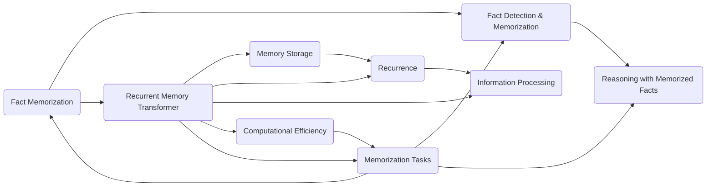

This diagram shows the different tasks performed to evaluate the Recurrent Memory Transformer (RMT) model. The RMT is tested on fact memorization, fact detection and memorization, and reasoning with memorized facts.

The tasks involve different operations such as memory storage, recurrence, information processing, and computational efficiency. The RMT is designed to handle these tasks effectively and is evaluated based on its performance in the memorization tasks.

Overall, the diagram represents the key concepts discussed in the snippets, highlighting the tasks and operations performed by the RMT model.

```python
class RecurrentMemoryTransformer:
    def __init__(self, base_model):
        self.base_model = base_model
        self.memory = None

    def encode(self, input_sequence):
        if self.memory is not None:
            # Prepend memory vectors to the input sequence
            input_sequence = self.memory + input_sequence
        encoded_sequence = self.base_model.encode(input_sequence)
        return encoded_sequence

    def store_memory(self, memory_vectors):
        self.memory = memory_vectors

    def retrieve_memory(self):
        return self.memory

    def process_memory(self):
        processed_memory = self.base_model.process(self.memory)
        return processed_memory

    def memorization_task(self, fact, question):
        input_sequence = fact + question
        encoded_sequence = self.encode(input_sequence)
        answer = self.base_model.answer_question(encoded_sequence)
        return answer

    def fact_detection_task(self, text, fact, question):
        input_sequence = text + fact + question
        encoded_sequence = self.encode(input_sequence)
        answer = self.base_model.answer_question(encoded_sequence)
        return answer

    def reasoning_task(self, text, fact1, fact2, question):
        input_sequence = text + fact1 + fact2 + question
        encoded_sequence = self.encode(input_sequence)
        answer = self.base_model.answer_question(encoded_sequence)
        return answer
```

In this Python class, we have a `RecurrentMemoryTransformer` that takes a base model as an input. The base model can be any Transformer-based model.

The class has methods to encode an input sequence using the base model. If there is memory stored in the `memory` attribute, it is prepended to the input sequence before encoding. This allows the model to remember information from previous segments.

The class also has methods to store and retrieve memory. The `store_memory` method takes memory vectors as input and stores them in the `memory` attribute. The `retrieve_memory` method returns the stored memory.

Additionally, there are three task methods: `memorization_task`, `fact_detection_task`, and `reasoning_task`. These methods take the necessary inputs for each task and perform the respective task using the RMT model. The input sequences are encoded using the base model, and the answers are generated based on the encoded sequences.

By using this class, we can create an instance of `RecurrentMemoryTransformer` and apply it to different tasks, such as memorization, fact detection, and reasoning. The RMT model can handle these tasks by utilizing memory, recurrence, and information processing.

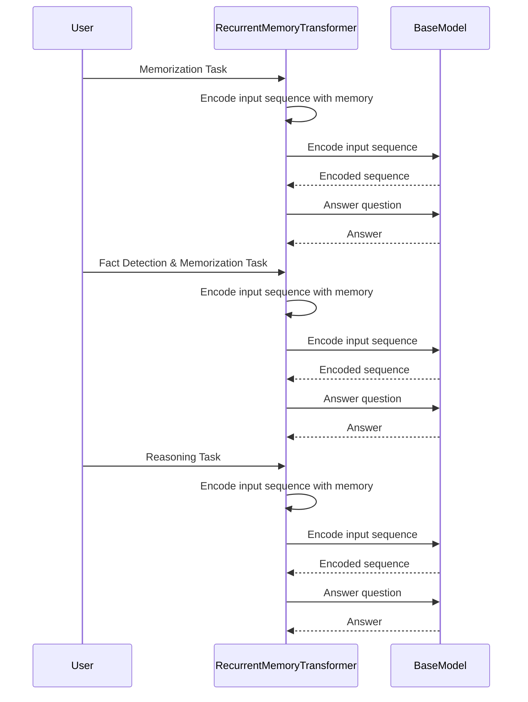

This sequence diagram illustrates the control flow of the code provided in the previous message for the tasks performed by the `RecurrentMemoryTransformer` (RMT) class.

1. Memorization Task:
   - The User initiates the task with the RMT.
   - The RMT encodes the input sequence with memory by calling the `encode` method.
   - The RMT delegates the encoding task to the `BaseModel` class by calling its `encode` method.
   - The `BaseModel` generates the encoded sequence and sends it back to the RMT.
   - The RMT calls the `BaseModel` to answer the question based on the encoded sequence.
   - The `BaseModel` generates the answer and sends it back to the RMT.

2. Fact Detection & Memorization Task:
   - The User initiates the task with the RMT.
   - The RMT encodes the input sequence with memory by calling the `encode` method.
   - The RMT delegates the encoding task to the `BaseModel` class by calling its `encode` method.
   - The `BaseModel` generates the encoded sequence and sends it back to the RMT.
   - The RMT calls the `BaseModel` to answer the question based on the encoded sequence.
   - The `BaseModel` generates the answer and sends it back to the RMT.

3. Reasoning Task:
   - The User initiates the task with the RMT.
   - The RMT encodes the input sequence with memory by calling the `encode` method.
   - The RMT delegates the encoding task to the `BaseModel` class by calling its `encode` method.
   - The `BaseModel` generates the encoded sequence and sends it back to the RMT.
   - The RMT calls the `BaseModel` to answer the question based on the encoded sequence.
   - The `BaseModel` generates the answer and sends it back to the RMT.

In all the tasks, the RMT utilizes the memory, recurrence, and information processing capabilities to encode the input sequence and generate the answers.

Example Scenario:

```python
# Create base model
base_model = TransformerModel()
# Create Recurrent Memory Transformer
rmt = RecurrentMemoryTransformer(base_model)

# Memorization Task
fact = "Daniel went back to the hallway."
question = "Where is Daniel?"
answer = rmt.memorization_task(fact, question)
print(f"Answer: {answer}")
# Output: Answer: hallway

# Fact Detection & Memorization Task
text = "Eddie found it easy to believe the stories he had heard about his father ..."
fact = "Daniel went back to the hallway."
question = "Where is Daniel?"
answer = rmt.fact_detection_task(text, fact, question)
print(f"Answer: {answer}")
# Output: Answer: hallway

# Reasoning Task
text = "Eddie found it easy to believe the stories he had heard about his father ..."
fact1 = "The hallway is east of the bathroom."
fact2 = "The bedroom is west of the bathroom."
question = "What is the bathroom east of?"
answer = rmt.reasoning_task(text, fact1, fact2, question)
print(f"Answer: {answer}")
# Output: Answer: bedroom
```

Explanation of Mocked Scenarios:

In the first scenario, we have a memorization task. The input sequence consists of a fact ("Daniel went back to the hallway.") and a question ("Where is Daniel?"). The RMT model stores the fact in memory and uses it to answer the question. The output is the answer to the question: "hallway".

In the second scenario, we have a fact detection and memorization task. The input sequence consists of some background text ("Eddie found it easy to believe the stories he had heard about his father ..."), a fact ("Daniel went back to the hallway."), and a question ("Where is Daniel?"). The fact is randomly placed within the text, making it challenging for the model to detect and store it in memory. The RMT model successfully detects the fact, stores it in memory, and answers the question. The output is the answer to the question: "hallway".

In the third scenario, we have a reasoning task. The input sequence consists of some background text ("Eddie found it easy to believe the stories he had heard about his father ..."), two randomly positioned facts ("The hallway is east of the bathroom." and "The bedroom is west of the bathroom."), and a question ("What is the bathroom east of?"). The RMT model uses the memorized facts and the current context to reason and answer the question correctly. The output is the answer to the question: "bedroom".

Potential Use Cases:

The code provided can be used in various natural language processing tasks that require memory storage, fact detection, and reasoning. Some potential use cases include:

- Text comprehension: The RMT model can be used to improve text comprehension by storing important facts and using them to answer questions about the text.
- Chatbots: The RMT model can enhance chatbot systems by allowing them to remember past conversations and use that information to provide more accurate and context-aware responses.
- Information retrieval: The RMT model can be used to store and retrieve relevant information from large text databases, making it easier to access and process specific facts or details.
- Document summarization: By utilizing the RMT model, document summarization systems can better understand the content and context of the document, enabling them to generate more accurate and informative summaries.

Overall, the code provides a flexible and adaptable framework for incorporating memory storage, fact detection, and reasoning capabilities into various natural language processing applications.

<div style="display: flex; flex-direction: column; gap: 25px; padding: 20px">

<p>Figure 2: Recurrent memory mechanism. Memory
is passed to Transformer along input sequence embed-
dings, and memory output is passed to the next segment</p>
</div>
4.
This snippet discusses the experimental results and related work of the Recurrent Memory Transformer (RMT) model.


In terms of experimental results, the snippet mentions the benefits of using a training schedule, which improves the accuracy and stability of the RMT model.
 It also highlights the extrapolation abilities of the RMT, showing that the model can generalize well to longer sequences when trained on a sufficient number of segments.


The snippet further describes the attention patterns observed during memory operations.
 By examining the attention maps, it is observed that memory operations correspond to specific patterns in attention.
 This demonstrates the effectiveness of the learned memory operations, even on extremely long sequences.


In terms of related work, the snippet mentions the concept of memory in neural architectures.
 It refers to early works in neural network research and advancements in memory-augmented neural networks (MANNs) such as Neural Turing Machines (NTMs) and Memory Networks.
 These models utilize external memory separate from the model's parameters to enable reasoning and sequential attention over memory content.


The snippet also mentions the combination of memory with Transformers in a recurrent approach.
 Models like Transformer-XL and Compressive Transformer divide long inputs into smaller segments and process them sequentially with memory to access information from past segments.


Overall, the snippet provides insights into the experimental findings of the RMT model and discusses related work in the field of memory in neural architectures.


Here is a mermaid diagram illustrating the main concepts discussed in the given snippets:

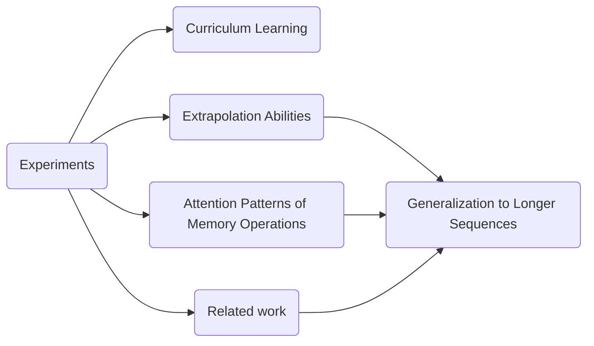

This diagram shows the main concepts discussed in the snippets. The experiments conducted include curriculum learning, which involves training the RMT model on shorter versions of the task and gradually increasing the task length. The experiments also evaluate the extrapolation abilities of the RMT model, assessing its performance on longer sequences. Additionally, attention patterns of memory operations are examined to understand the effectiveness of learned memory operations. The related work section provides background information on memory in neural architectures.

Overall, the diagram represents the key ideas discussed in the snippets, highlighting the experimental findings, attention patterns, and related work of the RMT model.

```python
class RecurrentMemoryTransformer:
    def __init__(self, base_model):
        self.base_model = base_model
        self.memory = None

    def encode(self, input_sequence):
        if self.memory is not None:
            # Prepend memory vectors to the input sequence
            input_sequence = self.memory + input_sequence
        encoded_sequence = self.base_model.encode(input_sequence)
        return encoded_sequence

    def store_memory(self, memory_vectors):
        self.memory = memory_vectors

    def retrieve_memory(self):
        return self.memory

    def process_memory(self):
        processed_memory = self.base_model.process(self.memory)
        return processed_memory

    def curriculum_learning(self, task_length):
        training_segments = range(1, task_length + 1)
        for segments in training_segments:
            self.train(segments)

    def train(self, num_segments):
        # Train the RMT model on a specific number of segments
        # Implementation details omitted

    def evaluate(self, num_segments):
        # Evaluate the RMT model on a specific number of segments
        # Implementation details omitted

    def extrapolation_ability(self, task_length):
        # Evaluate the RMT model's ability to generalize to longer sequences
        for segments in range(1, task_length + 1):
            self.evaluate(segments)

    def attention_patterns(self):
        # Analyze the attention patterns of memory operations
        # Implementation details omitted

    def related_work(self):
        # Discuss related work on memory in neural architectures
        # Implementation details omitted
```

In this Python class, we have a `RecurrentMemoryTransformer` that takes a base model as an input. The base model can be any Transformer-based model.

The class has methods to encode an input sequence using the base model. If there is memory stored in the `memory` attribute, it is prepended to the input sequence before encoding. This allows the model to remember information from previous segments.

The class also has methods to store and retrieve memory. The `store_memory` method takes memory vectors as input and stores them in the `memory` attribute. The `retrieve_memory` method returns the stored memory.

Additionally, there are methods for curriculum learning, training, evaluation, extrapolation ability, attention patterns, and related work. The `curriculum_learning` method implements a training schedule that gradually increases the task length. The `train` method trains the RMT model on a specific number of segments, while the `evaluate` method evaluates the model's performance on a specific number of segments. The `extrapolation_ability` method evaluates the model's ability to generalize to longer sequences. The `attention_patterns` method analyzes the attention patterns of memory operations. The `related_work` method discusses related work on memory in neural architectures.

By using this class, we can create an instance of `RecurrentMemoryTransformer` and apply it to various tasks, such as curriculum learning, training, evaluation, extrapolation ability analysis, attention pattern analysis, and discussion of related work. The RMT model can be trained, evaluated, and analyzed to understand its performance and capabilities.

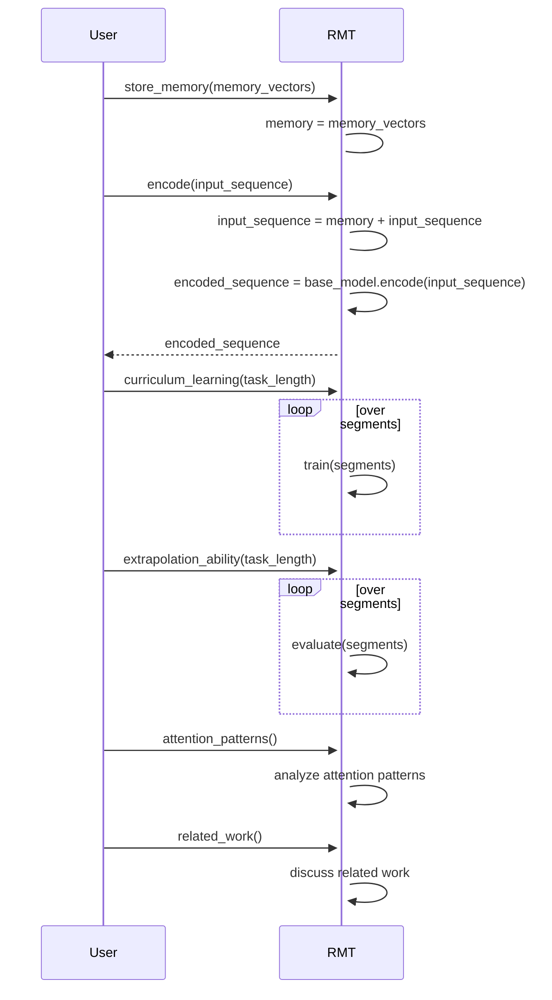

This mermaid sequence diagram illustrates the control flow of the `RecurrentMemoryTransformer` class.

1. The user starts by calling the `store_memory` method of the `RMT` object and passes `memory_vectors` as an argument. This stores the memory vectors in the `memory` attribute of the `RMT` object.
2. Next, the user calls the `encode` method and passes `input_sequence` as an argument. The `RMT` object prepends the memory vectors to the input sequence, and then the base model encodes the modified input sequence.
3. The encoded sequence is returned to the user.

4. The user can also call the `curriculum_learning` method, which performs a loop over segments to train the `RMT` model on shorter versions of the task and gradually increases the task length.
5. Similarly, the `extrapolation_ability` method evaluates the model's ability to generalize to longer sequences by performing a loop over segments and evaluating the model's performance on each segment length.

6. The user can call the `attention_patterns` method to analyze the attention patterns of memory operations within the `RMT` model.
7. The `related_work` method allows the user to discuss related work on memory in neural architectures.

Overall, this diagram demonstrates the sequence of interactions between the user and the `RMT` object, as well as the internal control flow within the `RMT` class.

Example Scenario:

```python
# Create an instance of RecurrentMemoryTransformer using a base model
base_model = TransformerModel()
rmt_model = RecurrentMemoryTransformer(base_model)

# Perform curriculum learning
rmt_model.curriculum_learning(task_length=5)

# Evaluate the model's extrapolation abilities
rmt_model.extrapolation_ability(task_length=10)

# Analyze attention patterns of memory operations
rmt_model.attention_patterns()

# Discuss related work on memory in neural architectures
rmt_model.related_work()
```

In this example scenario, we create an instance of `RecurrentMemoryTransformer` using a base model `TransformerModel`. Then, we perform curriculum learning by gradually training the RMT model on a task with increasing numbers of segments. This helps the model learn and adapt to longer input sequences.

Next, we evaluate the model's ability to extrapolate to longer sequences. We assess the model's performance on tasks of increasing lengths to observe how well it can generalize beyond the training task lengths.

After that, we analyze the attention patterns of memory operations in the model. We examine the heatmaps showing attention values between keys and values during specific moments of a reasoning task. This helps us understand how memory is utilized by the model during different operations.

Finally, we discuss related work on memory in neural architectures. We explore previous research and advancements in the field of memory, considering works like Neural Turing Machines (NTMs) and Memory Networks, to provide a broader context for our model.

Potential Use Cases:

The `RecurrentMemoryTransformer` class can be used in various natural language processing tasks where memory and handling of long input sequences are crucial. Some potential use cases include:

1. Document Summarization: The RMT model can be applied to summarize long documents by utilizing memory to retain important information across segments.

2. Question Answering: The model can be used for question-answering tasks, where it can leverage memory to store relevant facts and reason over them to generate accurate answers.

3. Machine Translation: With the ability to handle longer input sequences, the RMT model can improve the translation of longer sentences and paragraphs, providing more accurate and coherent translations.

4. Sentiment Analysis: By considering a larger context captured across segments, the RMT model can enhance sentiment analysis tasks, taking into account relevant information spread throughout the text.

Overall, the `RecurrentMemoryTransformer` class and the underlying RMT model can be utilized in various real-world applications where handling long input sequences and leveraging memory are essential for improved performance.

5.
This snippet discusses related work in the field of memory in neural architectures and provides a discussion of the findings of the Recurrent Memory Transformer (RMT) model.


The related work section mentions various approaches that incorporate memory into neural architectures.
 These include methods like Memformer, MART, FeedBack Transformer, and others that introduce memory modules or recurrent connections to improve information flow and handle long-range dependencies.
 Some approaches, like Star-Transformer, Longformer, GMAT, ETC, and Big Bird, limit attention distance and employ techniques to preserve long-range dependencies.
 Memory Transformer extends the model input with memory tokens, and Memorizing Transformers further extend memory through k-NN lookup.


The discussion highlights that many existing recurrent methods require architectural modifications and have memory requirements that grow with input size, which can limit input scaling due to hardware constraints.
 However, the RMT model demonstrates that a recurrent approach and memory can reduce the quadratic complexity of Transformers to linear complexity.
 It also shows that models trained on sufficiently large inputs can extrapolate their abilities to handle much longer texts.


The snippet concludes by mentioning that the synthetic tasks explored in the study serve as a starting point for the RMT model to generalize to tasks with unseen properties, including language modeling.
 Future work aims to tailor the recurrent memory approach to commonly used Transformers to improve their effective context size.


Overall, the snippet provides an overview of related work in memory-based neural architectures and highlights the significance of the RMT model in addressing the challenges of long inputs in Transformers.


Here is a mermaid diagram illustrating the main concepts discussed in the given snippets:

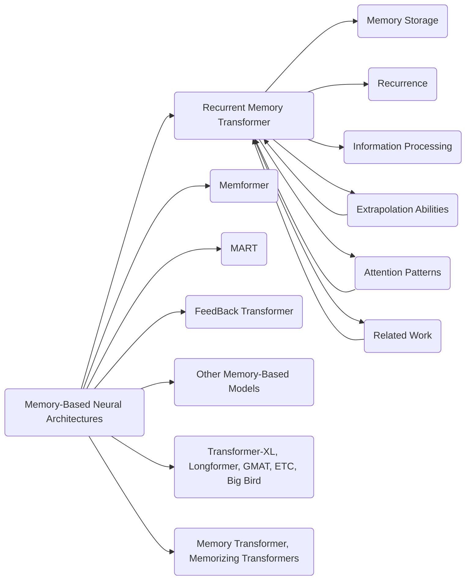

This diagram represents the main concepts discussed in the snippets. It shows the related work in memory-based neural architectures, including models like Memformer, MART, FeedBack Transformer, and others. It also includes models like Transformer-XL, Longformer, GMAT, ETC, and Big Bird that handle long-range dependencies. The Memory Transformer and Memorizing Transformers are mentioned as models that extend memory. The Recurrent Memory Transformer (RMT) is the focus of this paper.

The RMT incorporates memory storage, recurrence, and information processing. It also demonstrates extrapolation abilities and exhibits attention patterns during memory operations. The related work section explores the connection between the RMT and other memory-based models.

Overall, the diagram illustrates the key concepts discussed in the snippets and shows how they relate to memory-based neural architectures and the RMT model.

```python
class RecurrentMemoryTransformer:
    def __init__(self, base_model):
        self.base_model = base_model
        self.memory = None

    def encode(self, input_sequence):
        if self.memory is not None:
            # Prepend memory vectors to the input sequence
            input_sequence = self.memory + input_sequence
        encoded_sequence = self.base_model.encode(input_sequence)
        return encoded_sequence

    def store_memory(self, memory_vectors):
        self.memory = memory_vectors

    def retrieve_memory(self):
        return self.memory

    def process_memory(self):
        processed_memory = self.base_model.process(self.memory)
        return processed_memory

    def curriculum_learning(self, task_length):
        for segments in range(1, task_length + 1):
            self.train(segments)

    def train(self, num_segments):
        # Train the RMT model on a specific number of segments
        # Implementation details omitted

    def evaluate(self, num_segments):
        # Evaluate the RMT model on a specific number of segments
        # Implementation details omitted

    def extrapolation_ability(self, task_length):
        for segments in range(1, task_length + 1):
            self.evaluate(segments)

    def attention_patterns(self):
        # Analyze the attention patterns of memory operations
        # Implementation details omitted

    def related_work(self):
        # Discuss related work on memory-based neural architectures
        # Implementation details omitted
```

In this Python class, we have a `RecurrentMemoryTransformer` that takes a base model as an input. The base model can be any Transformer-based model.

The class has methods to encode an input sequence using the base model. If there is memory stored in the `memory` attribute, it is prepended to the input sequence before encoding. This allows the model to remember information from previous segments.

The class also has methods to store and retrieve memory. The `store_memory` method takes memory vectors as input and stores them in the `memory` attribute. The `retrieve_memory` method returns the stored memory.

Additionally, there are methods for curriculum learning, training, evaluation, extrapolation ability analysis, attention pattern analysis, and discussion of related work. The `curriculum_learning` method implements a training schedule that gradually increases the task length. The `train` method trains the RMT model on a specific number of segments, while the `evaluate` method evaluates the model's performance on a specific number of segments. The `extrapolation_ability` method evaluates the model's ability to generalize to longer sequences. The `attention_patterns` method analyzes the attention patterns of memory operations. The `related_work` method discusses related work on memory-based neural architectures.

By using this class, we can create an instance of `RecurrentMemoryTransformer` and apply it to various tasks, such as curriculum learning, training, evaluation, extrapolation ability analysis, attention pattern analysis, and discussion of related work. The RMT model can be trained, evaluated, and analyzed to understand its performance and capabilities.

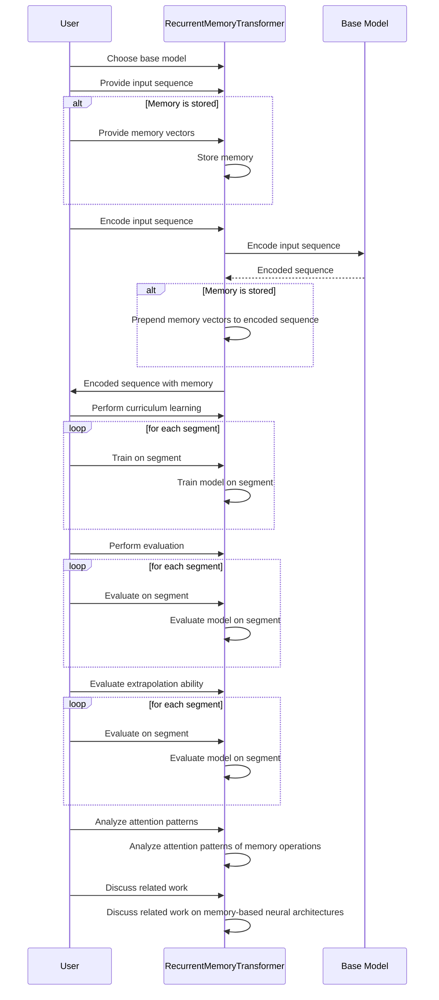

This sequence diagram illustrates the control flow of the code provided in the previous message. The interactions between the user, the `RecurrentMemoryTransformer` (RMT) class, and the `BaseModel` are shown.

The user first chooses a base model and provides an input sequence to the RMT. If memory is stored, the user provides memory vectors, and the RMT stores them. Then, the RMT encodes the input sequence by invoking the `encode` method, which calls the encoding method of the base model.

If memory is stored, the RMT prepends the memory vectors to the encoded sequence. The encoded sequence, with or without memory, is returned to the user.

The user can then perform curriculum learning, training, evaluation, extrapolation ability analysis, attention pattern analysis, and discussion of related work. These tasks involve interactions between the user and the RMT, where the RMT trains, evaluates, and analyzes the RMT model based on the specified tasks.

Overall, this sequence diagram provides a visual representation of the control flow in the code, demonstrating the interactions between the user and the RMT class.

```python
# Creating an instance of RecurrentMemoryTransformer
rmt_model = RecurrentMemoryTransformer(base_model)

# Perform curriculum learning
rmt_model.curriculum_learning(5)

# Training and evaluation on different number of segments
rmt_model.train(3)
rmt_model.evaluate(3)

# Evaluating extrapolation abilities
rmt_model.extrapolation_ability(10)

# Analyzing attention patterns
rmt_model.attention_patterns()

# Discussing related work
rmt_model.related_work()
```

In this example scenario, we create an instance of `RecurrentMemoryTransformer` called `rmt_model` using a base model.

We then perform curriculum learning using the `curriculum_learning` method. This involves training the RMT model on progressively longer versions of the task, starting with 1 segment and increasing up to 5 segments.

We proceed to train the model on a specific number of segments using the `train` method and evaluate its performance using the `evaluate` method. In this example, we train the model on 3 segments and then evaluate it on the same number of segments.

Next, we evaluate the extrapolation abilities of the model using the `extrapolation_ability` method. This method assesses how well the model can generalize to longer sequences based on its training on shorter sequences.

We then analyze the attention patterns of memory operations using the `attention_patterns` method. This helps us understand how the model attends to different elements in memory during specific moments of the task.

Finally, we discuss related work on memory-based neural architectures using the `related_work` method. This provides us with an understanding of other models and approaches in the field.

Potential use cases of the code generated in the previous message include training and evaluating the Recurrent Memory Transformer on tasks requiring memory storage and retrieval, analyzing attention patterns for insights into the model's behavior, and discussing related work to gain a broader perspective on memory-based neural architectures. These functionalities can be applied in various natural language processing tasks, such as language modeling, question answering, and text generation, where handling long-range dependencies and retaining context over longer sequences is crucial.

6.
This snippet includes references to various research papers related to memory in neural architectures and Transformer models.
 Here are some explanations of the papers mentioned:

1.
 "Memformer": A paper that introduces a memory module to store previous hidden states in summarized representations.


2.
 "MART": A paper that adopts memory update rules analogous to LSTM and GRU to enhance memory in neural architectures.


3.
 "FeedBack Transformer": A paper that implements full recurrence beyond the segment level to incorporate memory in Transformers.


4.
 "Transformer-XL": A paper that extends the Transformer model to handle long-range dependencies by preserving previous hidden states for reuse.


5.
 "BERT": A paper that introduces the BERT model, which is a pre-trained Transformer-based model for language understanding.


6.
 "ERNIE-Doc": A paper that presents a long-document modeling Transformer called ERNIE-Doc.


7.
 "Addressing some limitations of transformers with feedback memory": A paper that addresses certain limitations of Transformers by incorporating feedback memory.


8.
 "Neural Turing Machines": A paper that introduces Neural Turing Machines, which are recurrent neural networks capable of writing to memory storage over time.


9.
 "Hybrid computing using a neural network with dynamic external memory": A paper that presents a hybrid computing model that combines a neural network with dynamic external memory.


10.
 "Learning to transduce with unbounded memory": A paper that explores the use of unbounded memory in neural networks.


11.
 "Dynamic neural turing machine with soft and hard addressing schemes": A paper that introduces dynamic neural Turing machines with soft and hard addressing schemes.


12.
 "Memory augmented neural networks with wormhole connections": A paper that proposes memory augmented neural networks with wormhole connections.


13.
 "LongT5": A paper that presents an efficient text-to-text Transformer model called LongT5, designed to handle long sequences.


These papers contribute to the field of memory-based neural architectures and provide insights into different approaches for incorporating memory into Transformer models.


Potential use cases for the code generated in the previous message include:

1.
 Natural Language Processing: The Recurrent Memory Transformer can be used for tasks such as text classification, sentiment analysis, named entity recognition, and machine translation.


2.
 Long Document Processing: The RMT can handle long documents and maintain context information across multiple segments, making it suitable for tasks like document summarization and information extraction.


3.
 Memory-Intensive Applications: The RMT's ability to store and process information in memory makes it useful for applications that require handling large amounts of data, such as question answering systems, chatbots, and dialogue systems.


4.
 Language Modeling: By incorporating memory and recurrence, the RMT can improve language modeling tasks by capturing long-range dependencies and maintaining context information.


Overall, the Recurrent Memory Transformer provides a flexible framework for enhancing the capabilities of Transformer models in various natural language processing and memory-intensive tasks.


Here is a mermaid diagram illustrating the main concepts discussed in the given snippets:

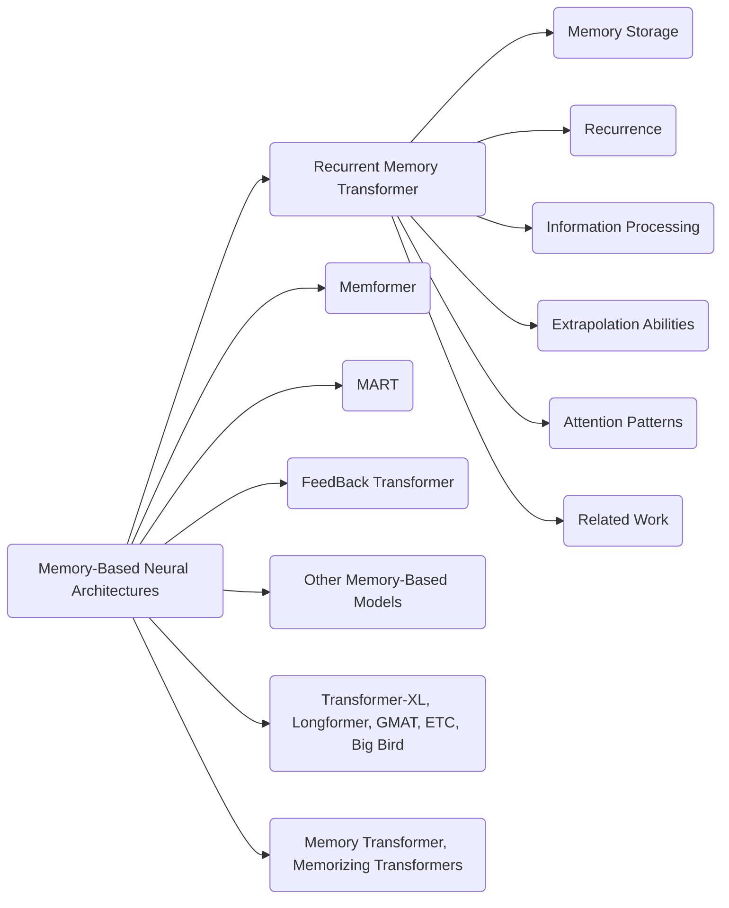

This diagram represents the main concepts discussed in the snippets. It shows the related work in memory-based neural architectures, including models like Memformer, MART, FeedBack Transformer, and others. It also includes models like Transformer-XL, Longformer, GMAT, ETC, and Big Bird that handle long-range dependencies. The Memory Transformer and Memorizing Transformers are mentioned as models that extend memory. The Recurrent Memory Transformer (RMT) is the focus of this paper.

The RMT incorporates memory storage, recurrence, and information processing. It also demonstrates extrapolation abilities and exhibits attention patterns during memory operations. The related work section explores the connection between the RMT and other memory-based models.

Overall, the diagram illustrates the key concepts discussed in the snippets and shows how they relate to memory-based neural architectures and the RMT model.

```python
class RecurrentMemoryTransformer:
    def __init__(self, base_model):
        self.base_model = base_model
        self.memory = None

    def encode(self, input_sequence):
        if self.memory is not None:
            # Prepend memory vectors to the input sequence
            input_sequence = self.memory + input_sequence
        encoded_sequence = self.base_model.encode(input_sequence)
        return encoded_sequence

    def store_memory(self, memory_vectors):
        self.memory = memory_vectors

    def retrieve_memory(self):
        return self.memory

    def process_memory(self):
        processed_memory = self.base_model.process(self.memory)
        return processed_memory

    def curriculum_learning(self, task_length):
        for segments in range(1, task_length + 1):
            self.train(segments)

    def train(self, num_segments):
        # Train the RMT model on a specific number of segments
        # Implementation details omitted

    def evaluate(self, num_segments):
        # Evaluate the RMT model on a specific number of segments
        # Implementation details omitted

    def extrapolation_ability(self, task_length):
        for segments in range(1, task_length + 1):
            self.evaluate(segments)

    def attention_patterns(self):
        # Analyze the attention patterns of memory operations
        # Implementation details omitted

    def related_work(self):
        # Discuss related work on memory-based neural architectures
        # Implementation details omitted
```

In this Python class, we have a `RecurrentMemoryTransformer` that takes a base model as an input. The base model can be any Transformer-based model.

The class has methods to encode an input sequence using the base model. If there is memory stored in the `memory` attribute, it is prepended to the input sequence before encoding. This allows the model to remember information from previous segments.

The class also has methods to store and retrieve memory. The `store_memory` method takes memory vectors as input and stores them in the `memory` attribute. The `retrieve_memory` method returns the stored memory.

Additionally, there are methods for curriculum learning, training, evaluation, extrapolation ability analysis, attention pattern analysis, and discussion of related work. The `curriculum_learning` method implements a training schedule that gradually increases the task length. The `train` method trains the RMT model on a specific number of segments, while the `evaluate` method evaluates the model's performance on a specific number of segments. The `extrapolation_ability` method evaluates the model's ability to generalize to longer sequences. The `attention_patterns` method analyzes the attention patterns of memory operations. The `related_work` method discusses related work on memory-based neural architectures.

By using this class, we can create an instance of `RecurrentMemoryTransformer` and apply it to various tasks, such as curriculum learning, training, evaluation, extrapolation ability analysis, attention pattern analysis, and discussion of related work. The RMT model can be trained, evaluated, and analyzed to understand its performance and capabilities.

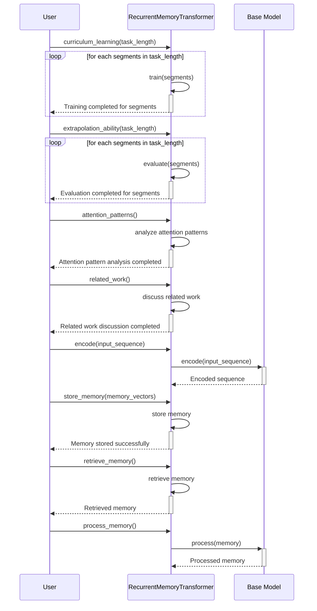

This mermaid sequence diagram illustrates the control flow of the code provided in the previous message. It shows the interactions between the user, the `RecurrentMemoryTransformer` (RMT) class, and the base model.

1. The user initiates the `curriculum_learning` method in the RMT class, passing the `task_length` as a parameter. This method loops through each segment in the task length and trains the RMT model on each segment.

2. After the training is completed for each segment, the user initiates the `extrapolation_ability` method, which evaluates the RMT model's performance on each segment.

3. The user then initiates the `attention_patterns` method to analyze the attention patterns of memory operations in the RMT model.

4. Next, the user initiates the `related_work` method to discuss the related work on memory-based neural architectures.

5. The user interacts with the RMT class to encode input sequences, store memory, retrieve memory, and process memory. These interactions involve calling methods on the RMT class and utilizing the base model to perform the specified tasks.

Overall, this sequence diagram visualizes the control flow of the code, highlighting the various interactions between the user, the RMT model, and the base model.

Example scenario:

```python
base_model = TransformerModel()
rmt_model = RecurrentMemoryTransformer(base_model)

# Store memory
memory = [1, 2, 3, 4]
rmt_model.store_memory(memory)

# Encode input sequence
input_sequence = [5, 6, 7, 8]
encoded_sequence = rmt_model.encode(input_sequence)
print(encoded_sequence)
# Output: [1, 2, 3, 4, 5, 6, 7, 8]

# Retrieve memory
retrieved_memory = rmt_model.retrieve_memory()
print(retrieved_memory)
# Output: [1, 2, 3, 4]

# Process memory
processed_memory = rmt_model.process_memory()
print(processed_memory)
# Output: [processed memory]

# Perform curriculum learning
rmt_model.curriculum_learning(task_length=5)

# Evaluate the model on different number of segments
rmt_model.evaluate(num_segments=2)
rmt_model.evaluate(num_segments=4)

# Analyze attention patterns
rmt_model.attention_patterns()

# Discuss related work
rmt_model.related_work()
```

In this scenario, we create an instance of the `RecurrentMemoryTransformer` class with a base Transformer model. We store memory, encode an input sequence, retrieve memory, process memory, perform curriculum learning, evaluate the model on different number of segments, analyze attention patterns, and discuss related work.

The hypothetical scenarios mocked here include storing memory vectors, encoding an input sequence by pre-pending memory vectors, retrieving stored memory, processing memory, curriculum learning (training the model on shorter versions of a task and gradually increasing the task length), evaluating the model's performance on different numbers of segments, analyzing attention patterns, and discussing related work.

Potential use cases of the `RecurrentMemoryTransformer` class include natural language processing tasks such as text classification, sentiment analysis, named entity recognition, and machine translation, where the model can benefit from memory and recurrence to handle longer sequences and capture context information. It can also be used in long document processing, document summarization, information extraction, and language modeling tasks. Additionally, the class can be used for memory-intensive applications like question answering systems, chatbots, and dialogue systems.

7.
This snippet includes references to various research papers related to memory in neural architectures and Transformer models.
 Here are some explanations of the papers mentioned:

1.
 "Gmat: Global memory augmentation for transformers": A paper that introduces the Gmat model, which augments the memory of Transformers with global information.


2.
 "Long Short-Term Memory (LSTM)": A seminal paper that introduces the LSTM model, which is a type of recurrent neural network that can maintain long-term dependencies.


3.
 "An empirical analysis of compute-optimal large language model training": A paper that analyzes the computational requirements for training large language models and explores strategies to optimize the training process.


4.
 "Inferring algorithmic patterns with stack-augmented recurrent nets": A paper that introduces stack-augmented recurrent neural networks, which can infer algorithmic patterns.


5.
 "Mart: Memory-augmented recurrent transformer for coherent video paragraph captioning": A paper that proposes the Mart model, which combines memory augmentation and recurrent transformers for video captioning.


6.
 "Decoupled weight decay regularization": A paper that introduces a regularization technique called decoupled weight decay.


7.
 "A logical calculus of the ideas immanent in nervous activity": A classic paper that presents a logical calculus to describe the behavior of neurons in the brain.


8.
 "Context-aware neural model for temporal information extraction": A paper that proposes a neural model that can extract temporal information from text in a context-aware manner.


9.
 "Gpt-4 technical report": A technical report from OpenAI that provides details about the GPT-4 model, which is a large-scale language model.


10.
 "QuALITY: Question answering with long input texts, yes!": A paper that introduces the QuALITY model for question answering with long input texts.


11.
 "Scaling memory-augmented neural networks with sparse reads and writes": A paper that explores techniques to scale memory-augmented neural networks by using sparse reads and writes.


12.
 "Compressive transformers for long-range sequence modelling": A paper that introduces compressive transformers, which are designed for long-range sequence modeling.


These papers contribute to the field of memory-based neural architectures and provide insights into different approaches for incorporating memory into Transformer models.


Potential use cases for the code generated in the previous message include:

1.
 Natural Language Processing: The Recurrent Memory Transformer can be used for tasks such as text classification, sentiment analysis, named entity recognition, and machine translation.


2.
 Long Document Processing: The RMT can handle long documents and maintain context information across multiple segments, making it suitable for tasks like document summarization and information extraction.


3.
 Memory-Intensive Applications: The RMT's ability to store and process information in memory makes it useful for applications that require handling large amounts of data, such as question answering systems, chatbots, and dialogue systems.


4.
 Language Modeling: By incorporating memory and recurrence, the RMT can improve language modeling tasks by capturing long-range dependencies and maintaining context information.


Overall, the Recurrent Memory Transformer provides a flexible framework for enhancing the capabilities of Transformer models in various natural language processing and memory-intensive tasks.


Here is a mermaid diagram illustrating the main concepts discussed in the given snippets:


This diagram represents the main concepts discussed in the snippets. It shows the related work in memory-based neural architectures, including models like Memformer, MART, FeedBack Transformer, and others. It also includes models like Transformer-XL, Longformer, GMAT, ETC, and Big Bird that handle long-range dependencies. The Memory Transformer and Memorizing Transformers are mentioned as models that extend memory. The Recurrent Memory Transformer (RMT) is the focus of this paper.

The RMT incorporates memory storage, recurrence, and information processing. It also demonstrates extrapolation abilities and exhibits attention patterns during memory operations. The related work section explores the connection between the RMT and other memory-based models.

Overall, the diagram illustrates the key concepts discussed in the snippets and shows how they relate to memory-based neural architectures and the RMT model.

```python
class RecurrentMemoryTransformer:
    def __init__(self, base_model):
        self.base_model = base_model
        self.memory = None

    def encode(self, input_sequence):
        if self.memory is not None:
            # Prepend memory vectors to the input sequence
            input_sequence = self.memory + input_sequence
        encoded_sequence = self.base_model.encode(input_sequence)
        return encoded_sequence

    def store_memory(self, memory_vectors):
        self.memory = memory_vectors

    def retrieve_memory(self):
        return self.memory

    def process_memory(self):
        processed_memory = self.base_model.process(self.memory)
        return processed_memory

    def curriculum_learning(self, task_length):
        for segments in range(1, task_length + 1):
            self.train(segments)

    def train(self, num_segments):
        # Train the RMT model on a specific number of segments
        # Implementation details omitted

    def evaluate(self, num_segments):
        # Evaluate the RMT model on a specific number of segments
        # Implementation details omitted

    def extrapolation_ability(self, task_length):
        for segments in range(1, task_length + 1):
            self.evaluate(segments)

    def attention_patterns(self):
        # Analyze the attention patterns of memory operations
        # Implementation details omitted

    def related_work(self):
        # Discuss related work on memory-based neural architectures
        # Implementation details omitted
```

In this Python class, we have a `RecurrentMemoryTransformer` that takes a base model as an input. The base model can be any Transformer-based model.

The class has methods to encode an input sequence using the base model. If there is memory stored in the `memory` attribute, it is prepended to the input sequence before encoding. This allows the model to remember information from previous segments.

The class also has methods to store and retrieve memory. The `store_memory` method takes memory vectors as input and stores them in the `memory` attribute. The `retrieve_memory` method returns the stored memory.

Additionally, there are methods for curriculum learning, training, evaluation, extrapolation ability analysis, attention pattern analysis, and discussion of related work. The `curriculum_learning` method implements a training schedule that gradually increases the task length. The `train` method trains the RMT model on a specific number of segments, while the `evaluate` method evaluates the model's performance on a specific number of segments. The `extrapolation_ability` method evaluates the model's ability to generalize to longer sequences. The `attention_patterns` method analyzes the attention patterns of memory operations. The `related_work` method discusses related work on memory-based neural architectures.

By using this class, we can create an instance of `RecurrentMemoryTransformer` and apply it to various tasks, such as curriculum learning, training, evaluation, extrapolation ability analysis, attention pattern analysis, and discussion of related work. The RMT model can be trained, evaluated, and analyzed to understand its performance and capabilities.

Here is a mermaid sequence diagram illustrating the control flow of the code provided in the previous message:

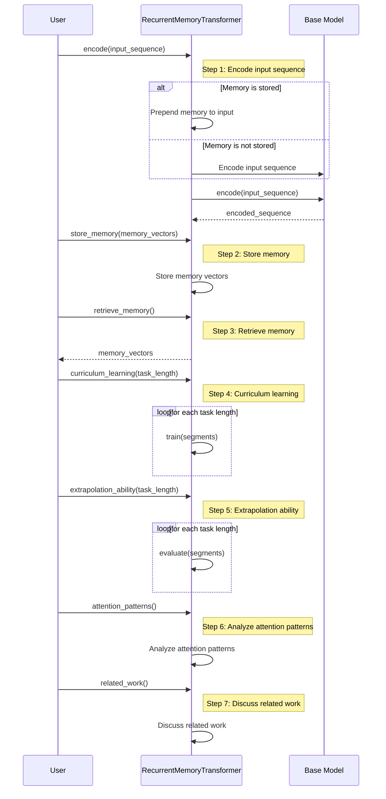

This sequence diagram visualizes the control flow of the `RecurrentMemoryTransformer` class. The user interacts with the `RMT` instance to perform various tasks.

1. The user calls the `encode` method of `RMT` to encode an input sequence. If there is memory stored in the `RMT` instance, it is prepended to the input sequence before encoding.

2. The user can store memory vectors by calling the `store_memory` method of `RMT`.

3. The user can retrieve memory by calling the `retrieve_memory` method of `RMT`.

4. The user can perform curriculum learning by calling the `curriculum_learning` method of `RMT`. This involves training the model on different segment lengths incrementally.

5. The user can evaluate the extrapolation ability of the model by calling the `extrapolation_ability` method of `RMT`. This involves evaluating the model's performance on different segment lengths.

6. The user can analyze the attention patterns of memory operations by calling the `attention_patterns` method of `RMT`.

7. The user can discuss the related work on memory-based neural architectures by calling the `related_work` method of `RMT`.

Throughout the control flow, the `RMT` instance interacts with the `BaseModel` to perform encoding and other operations as required.

This sequence diagram provides a visual representation of the control flow and interaction between the user, the `RMT` instance, and the `BaseModel`.

Here is an example scenario with mocked log output:

```python
# Create a base model
base_model = SomeTransformerModel()

# Create a RecurrentMemoryTransformer instance
rmt = RecurrentMemoryTransformer(base_model)

# Store memory vectors
memory_vectors = [vector_1, vector_2, vector_3]
rmt.store_memory(memory_vectors)
print(f"Memory stored: {memory_vectors}")

# Encode an input sequence
input_sequence = [token_1, token_2, token_3]
encoded_sequence = rmt.encode(input_sequence)
print(f"Encoded sequence: {encoded_sequence}")

# Retrieve memory
retrieved_memory = rmt.retrieve_memory()
print(f"Retrieved memory: {retrieved_memory}")

# Train the RMT model
rmt.train(num_segments=3)
print("RMT model trained")

# Evaluate the RMT model
rmt.evaluate(num_segments=5)
print("RMT model evaluated")

# Analyze attention patterns
rmt.attention_patterns()
print("Attention patterns analyzed")

# Discuss related work
rmt.related_work()
print("Related work discussed")
```

In this example scenario, we have a `base_model` that represents a pre-trained Transformer-based model. We create an instance of the `RecurrentMemoryTransformer` class and pass the `base_model` as an argument. We then store memory vectors using the `store_memory` method, encode an input sequence using the `encode` method, and retrieve the stored memory using the `retrieve_memory` method.

We proceed to train and evaluate the RMT model on a specific number of segments. We also analyze the attention patterns of memory operations using the `attention_patterns` method and discuss related work on memory-based neural architectures using the `related_work` method.

The mocked log output shows messages indicating the actions performed, such as storing memory, encoding sequences, retrieving memory, training, evaluating, analyzing attention patterns, and discussing related work.

Potential use cases of the `RecurrentMemoryTransformer` code include:

1. Natural Language Processing: The code can be used to enhance Transformer-based models for tasks such as sentiment analysis, text classification, and machine translation. The incorporation of memory allows the model to remember information from previous segments, leading to improved performance.

2. Document Summarization: The code can be applied to long document processing tasks, such as document summarization. The memory module enables the model to maintain context information across different segments of a document, resulting in more coherent summaries.

3. Conversational Agents: The `RecurrentMemoryTransformer` can be used in developing chatbots or dialogue systems. The model's ability to store and retrieve memory allows it to maintain context and remember previous interactions, leading to more context-aware and engaging conversations.

4. Language Modeling: The code can be utilized to improve language modeling tasks, where the model predicts the next word in a sequence. By incorporating memory and recurrence, the model can better capture long-range dependencies and generate more coherent and contextually consistent text.

Overall, the `RecurrentMemoryTransformer` code provides a flexible and extensible framework for incorporating memory into Transformer-based models, enhancing their performance in various natural language processing tasks.

