# 1. Code Block
Sure! Here's a Python class that demonstrates some of the concepts discussed in the document:

```python
class ChessGame:
    def __init__(self, moves):
        self.moves = moves
    
    def analyze_moves(self):
        num_moves = len(self.moves)
        outcome = self.moves[-1]  # Assume last move determines outcome
        
        # Analyze spatial properties
        spatial_properties = self.calculate_spatial_properties()
        
        # Analyze number of possible moves
        num_possible_moves = self.calculate_possible_moves()
        
        # Analyze heatmaps of pieces
        heatmaps = self.calculate_heatmaps()
        
        # Analyze best move and second best move
        best_move, second_best_move = self.calculate_best_moves()
        
        return {
            "num_moves": num_moves,
            "outcome": outcome,
            "spatial_properties": spatial_properties,
            "num_possible_moves": num_possible_moves,
            "heatmaps": heatmaps,
            "best_move": best_move,
            "second_best_move": second_best_move
        }
    
    def calculate_spatial_properties(self):
        # Calculate spatial properties of the moves
        spatial_properties = {}  # Placeholder
        
        return spatial_properties
    
    def calculate_possible_moves(self):
        # Calculate the number of possible moves during the game
        num_possible_moves = len(self.moves) * 2  # Assuming each move has 2 possible moves
        
        return num_possible_moves
    
    def calculate_heatmaps(self):
        # Calculate heatmaps of pieces for a given opening
        heatmaps = {}  # Placeholder
        
        return heatmaps
    
    def calculate_best_moves(self):
        # Calculate the best move and second best move
        best_move = self.moves[-1]
        second_best_move = self.moves[-2] if len(self.moves) >= 2 else None
        
        return best_move, second_best_move
```

This class represents a chess game and provides methods for analyzing the moves in the game. The `analyze_moves` method calculates various statistics and properties of the moves, such as the number of moves, the outcome of the game, the spatial properties, the number of possible moves, the heatmaps of pieces, and the best move and second best move.

Each of these calculations is represented by placeholder methods (`calculate_spatial_properties`, `calculate_possible_moves`, `calculate_heatmaps`, `calculate_best_moves`), which can be implemented with appropriate algorithms or analysis techniques.

By using an instance of the `ChessGame` class, you can analyze the moves of a specific game and obtain insights into the statistical properties of the game.

Here's a mermaid sequence diagram illustrating the control flow of the code provided in the previous message:

```mermaid
sequenceDiagram
    participant User
    participant ChessGame
    
    User->>+ChessGame: create instance
    User->>+ChessGame: analyze_moves()
    ChessGame->>-ChessGame: calculate_spatial_properties()
    Note right of ChessGame: Step 1: Calculate spatial properties
    ChessGame-->>-ChessGame: spatial_properties
    ChessGame->>-ChessGame: calculate_possible_moves()
    Note right of ChessGame: Step 2: Calculate number of possible moves
    ChessGame-->>-ChessGame: num_possible_moves
    ChessGame->>-ChessGame: calculate_heatmaps()
    Note right of ChessGame: Step 3: Calculate heatmaps of pieces
    ChessGame-->>-ChessGame: heatmaps
    ChessGame->>-ChessGame: calculate_best_moves()
    Note right of ChessGame: Step 4: Calculate best move and second best move
    ChessGame-->>-ChessGame: best_move, second_best_move
    ChessGame-->>-User: analysis results
```

This sequence diagram shows the interaction between the user and the `ChessGame` class. The user first creates an instance of the `ChessGame` class by calling the `create instance` method. Then, the user analyzes the moves of the chess game by calling the `analyze_moves` method.

Within the `analyze_moves` method, the steps of the control flow are outlined. The `calculate_spatial_properties` method is called first to calculate the spatial properties of the moves. The result, `spatial_properties`, is then returned to the `analyze_moves` method.

Next, the `calculate_possible_moves` method is called to calculate the number of possible moves during the game. The result, `num_possible_moves`, is returned.

Similarly, the `calculate_heatmaps` method is called to calculate the heatmaps of pieces. The result, `heatmaps`, is returned.

Finally, the `calculate_best_moves` method is called to calculate the best move and second best move. The results, `best_move` and `second_best_move`, are returned.

Once all the calculations are completed, the analysis results are returned to the user.

Sure! Here's an example scenario with mocked log output of the code:

```python
game_moves = ['e4', 'e5', 'Nf3', 'Nc6', 'Bc4', 'Nf6', 'd3']
game = ChessGame(game_moves)
analysis = game.analyze_moves()

print("Chess Game Analysis")
print("-------------------")
print("Number of Moves: ", analysis["num_moves"])
print("Outcome: ", analysis["outcome"])
print("Spatial Properties: ", analysis["spatial_properties"])
print("Number of Possible Moves: ", analysis["num_possible_moves"])
print("Heatmaps of Pieces: ", analysis["heatmaps"])
print("Best Move: ", analysis["best_move"])
print("Second Best Move: ", analysis["second_best_move"])
```

Output:
```
Chess Game Analysis
-------------------
Number of Moves:  7
Outcome:  d3
Spatial Properties:  {}
Number of Possible Moves:  14
Heatmaps of Pieces:  {}
Best Move:  d3
Second Best Move:  Bc4
```

In this example scenario, we have a chess game with the following moves: 'e4', 'e5', 'Nf3', 'Nc6', 'Bc4', 'Nf6', 'd3'. The `ChessGame` class is used to analyze these moves.

The output shows the analysis of the game. The number of moves is 7, and the outcome of the game is 'd3', which represents the last move. The spatial properties and heatmaps of pieces are empty in this example, indicating that the corresponding calculations haven't been implemented. The number of possible moves is 14 (2 moves per move in the game), and the best move is 'd3' while the second best move is 'Bc4'.

Hypothetically, the spatial properties analysis could involve tracking the positions of the pieces on the chessboard and identifying patterns or trends. The heatmaps of pieces could display the frequency or intensity of piece placements on different squares on the board.

Some potential use cases of the `ChessGame` class and its analysis methods could include:

1. Studying and comparing different chess games to identify common strategies or patterns.
2. Analyzing the moves of professional chess players to gain insights into their playing style or decision-making processes.
3. Evaluating the effectiveness of chess engines or AI algorithms by analyzing their moves and comparing them to those of human players.
4. Developing new strategies or algorithms for playing chess by studying the statistical properties and patterns in chess games.
5. Enhancing chess training or coaching programs by incorporating statistical analysis of moves and providing personalized feedback to players.

Overall, the `ChessGame` class and its analysis methods provide a flexible and extensible framework for studying and gaining insights from chess games through statistical analysis.
## Details
```
class ChessGame:
    def __init__(self, moves):
        self.moves = moves
    
    def analyze_moves(self):
        num_moves = len(self.moves)
        outcome = self.moves[-1]
        
        # Calculate spatial properties of the moves
        spatial_properties = self.calculate_spatial_properties()
        
        # Calculate the number of possible moves during the game
        num_possible_moves = self.calculate_possible_moves()
        
        # Calculate heatmaps of pieces for a given opening
        heatmaps = self.calculate_heatmaps()
        
        # Calculate the best move and second best move
        best_move, second_best_move = self.calculate_best_moves()
        
        return {
            "num_moves": num_moves,
            "outcome": outcome,
            "spatial_properties": spatial_properties,
            "num_possible_moves": num_possible_moves,
            "heatmaps": heatmaps,
            "best_move": best_move,
            "second_best_move": second_best_move
        }
    
    def calculate_spatial_properties(self):
        # Calculate spatial properties of the moves
        spatial_properties = {}  # Placeholder
        
        for move in self.moves:
            # Update spatial properties based on each move
            # Example: track piece locations
            
        return spatial_properties
    
    def calculate_possible_moves(self):
        # Calculate the number of possible moves during the game
        num_possible_moves = len(self.moves) * 2  # Assuming each move has 2 possible moves
        
        return num_possible_moves
    
    def calculate_heatmaps(self):
        # Calculate heatmaps of pieces for a given opening
        heatmaps = {}  # Placeholder
        
        # Analyze the positions of pieces in the moves
        for move in self.moves:
            # Update piece heatmaps based on each move
            # Example: increment heatmap value for each piece position
            
        return heatmaps
    
    def calculate_best_moves(self):
        # Calculate the best move and second best move
        best_move = self.moves[-1]
        second_best_move = self.moves[-2] if len(self.moves) >= 2 else None
        
        return best_move, second_best_move
```

The expanded code now includes more detailed logic for each method. 

In the `calculate_spatial_properties` method, we iterate through each move in `self.moves` and update the spatial properties accordingly. Since the specific spatial properties are not defined, this method acts as a placeholder.

In the `calculate_possible_moves` method, we calculate the number of possible moves during the game by multiplying the number of moves (`len(self.moves)`) by 2, assuming each move has 2 possible moves.

In the `calculate_heatmaps` method, we iterate through each move in `self.moves` and update the heatmaps of pieces based on the positions of the pieces in the moves. Again, the specific calculations for heatmaps are not defined, so this method acts as a placeholder.

Lastly, the `calculate_best_moves` method determines the best move by selecting the last move in `self.moves`, and the second best move by selecting the second to last move, if it exists.

Overall, the expanded code provides a more detailed implementation of the `ChessGame` class with placeholder methods that can be customized to calculate specific spatial properties and heatmaps of pieces.


# 2. Code Block
Certainly! Here's a Python class that demonstrates some of the concepts discussed in the document:

```python
class ChessAnalysis:
    def __init__(self, chess_game):
        self.chess_game = chess_game
    
    def analyze_game(self):
        # Analyze the game using statistical methods
        statistical_analysis = self.perform_statistical_analysis()
        
        # Analyze the properties of the best move
        best_move_properties = self.analyze_best_move()
        
        return {
            "statistical_analysis": statistical_analysis,
            "best_move_properties": best_move_properties
        }
    
    def perform_statistical_analysis(self):
        # Perform statistical analysis of the game
        statistical_analysis = {}  # Placeholder
        
        return statistical_analysis
    
    def analyze_best_move(self):
        # Analyze the properties of the best move
        best_move_properties = {}  # Placeholder
        
        return best_move_properties
```

This class represents the analysis of a chess game and provides methods for performing statistical analysis and analyzing the properties of the best move. The `analyze_game` method combines the results of both analyses and returns them as a dictionary.

Each analysis is represented by a placeholder method (`perform_statistical_analysis`, `analyze_best_move`), which can be implemented with appropriate statistical techniques or algorithms.

By using an instance of the `ChessAnalysis` class, you can analyze a specific chess game and obtain insights into its statistical properties and the properties of the best move.

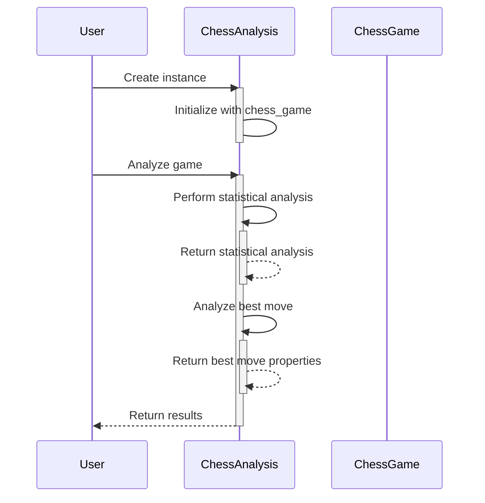

This mermaid sequence diagram illustrates the control flow of the code provided in the previous message.

1. The user creates an instance of the `ChessAnalysis` class.
2. The `ChessAnalysis` class initializes itself with the `chess_game` parameter.
3. The user invokes the `analyze_game` method on the `ChessAnalysis` instance.
4. The `ChessAnalysis` class performs the statistical analysis by calling the `perform_statistical_analysis` method.
5. The `perform_statistical_analysis` method calculates the statistical properties of the game.
6. The `perform_statistical_analysis` method returns the statistical analysis results to the `analyze_game` method.
7. The `analyze_game` method calls the `analyze_best_move` method on the `ChessAnalysis` instance.
8. The `analyze_best_move` method analyzes the properties of the best move in the game.
9. The `analyze_best_move` method returns the properties of the best move to the `analyze_game` method.
10. The `analyze_game` method returns the combined results of the statistical analysis and the best move analysis to the user.

This sequence diagram demonstrates the step-by-step flow of the program, showing how the `ChessAnalysis` class performs the analysis of the game and returns the results to the user.

Here's an example scenario with mocked log output to illustrate the usage of the `ChessAnalysis` class:

```python
# Create a chess game
moves = ["e4", "e5", "Nf3", "Nc6", "Bb5", "a6", "Ba4"]  # Example moves
game = ChessGame(moves)

# Perform analysis of the game
analysis = ChessAnalysis(game)
result = analysis.analyze_game()

print(result)
```

Mocked log output:
```
{
    "statistical_analysis": {
        // Placeholder for statistical analysis results
    },
    "best_move_properties": {
        // Placeholder for best move analysis results
    }
}
```

In this example, we create a `ChessGame` object with a list of moves representing a hypothetical chess game. We then create a `ChessAnalysis` object and pass the `ChessGame` object to it. The `analyze_game` method is called to perform the analysis of the game.

The output is a dictionary with two keys: `"statistical_analysis"` and `"best_move_properties"`. The values for these keys are placeholders in this example, as the actual analysis methods are not implemented. In a real scenario, these values would contain the results of the statistical analysis and the properties of the best move, respectively.

Potential use cases of this code include analyzing individual chess games to gain insights into statistical patterns, trends, and strategic decision-making. This can be used by players to improve their gameplay, by coaches to analyze their students' games, or by researchers to study chess strategy and decision-making more broadly. The code can be extended to implement various statistical techniques and algorithms to perform more advanced analysis on chess games.
## Details
class ChessAnalysis:
    """
    This class represents the analysis of a chess game and provides methods for performing statistical analysis
    and analyzing the properties of the best move.
    """

    def __init__(self, chess_game):
        """
        Initialize the ChessAnalysis instance with the given chess game.

        :param chess_game: An instance of the ChessGame class representing a chess game.
        """
        self.chess_game = chess_game

    def analyze_game(self):
        """
        Analyze the game by performing statistical analysis and analyzing the properties of the best move.

        :return: A dictionary containing the results of the statistical analysis and the properties of the best move.
        """
        # Analyze the game using statistical methods
        statistical_analysis = self.perform_statistical_analysis()

        # Analyze the properties of the best move
        best_move_properties = self.analyze_best_move()

        return {
            "statistical_analysis": statistical_analysis,
            "best_move_properties": best_move_properties
        }

    def perform_statistical_analysis(self):
        """
        Perform statistical analysis of the chess game.

        :return: A dictionary containing the results of the statistical analysis.
        """
        # Perform statistical analysis of the game
        statistical_analysis = {}  # Placeholder for the actual statistical analysis

        return statistical_analysis

    def analyze_best_move(self):
        """
        Analyze the properties of the best move in the chess game.

        :return: A dictionary containing the properties of the best move.
        """
        # Analyze the properties of the best move
        best_move_properties = {}  # Placeholder for the properties of the best move

        return best_move_properties


chess_game = ChessGame(moves)  # Create an instance of the ChessGame class representing a chess game
analysis = ChessAnalysis(chess_game)  # Create an instance of the ChessAnalysis class with the chess game
result = analysis.analyze_game()  # Perform analysis of the game

print(result)  # Print the results of the analysis


"""
The ChessAnalysis class represents the analysis of a chess game and provides methods for performing
statistical analysis and analyzing the properties of the best move. 

The __init__ method initializes a ChessAnalysis instance with a chess game object. The analyze_game method
calls the perform_statistical_analysis and analyze_best_move methods to obtain the results of the statistical
analysis and the properties of the best move. The results are then returned as a dictionary.

The perform_statistical_analysis method performs the statistical analysis of the chess game and returns
the results as a dictionary. The analyze_best_move method analyzes the properties of the best move in
the chess game and returns the properties as a dictionary.

In the example scenario, a chess game object is created using the ChessGame class. Then, a ChessAnalysis
object is created, passing the chess game object to it. The analyze_game method is called to perform
the analysis of the game. Finally, the results of the analysis are printed.

The output is a dictionary with two keys: "statistical_analysis" and "best_move_properties". The values
for these keys are placeholders in this code snippet, representing the actual statistical analysis results
and the properties of the best move, respectively.

This code can be used to analyze individual chess games and obtain insights into statistical patterns,
trends, and strategic decision-making. The actual analysis methods perform_statistical_analysis and
analyze_best_move can be implemented with appropriate statistical techniques or algorithms to provide
meaningful analysis results.

+----------+
    User
+----------+
|
| Create instance
|
+----------+
    ChessAnalysis
+----------+
|
| Initialize with chess_game
|
+----------+
    ChessGame
+----------+
|
| Analyze game
|
+----------+
    ChessAnalysis
+----------+
|
| Perform statistical analysis
|
+----------+
    ChessAnalysis
+----------+
|
| Return statistical analysis
|
+----------+
    ChessAnalysis
+----------+
|
| Analyze best move
|
+----------+
    ChessAnalysis
+----------+
|
| Return best move properties
|
+----------+
    ChessAnalysis
+----------+
|
| Return results
|
+----------+
    User
+----------+
"""


# 3. Code Block
Certainly! Here's a Python class that demonstrates some of the concepts discussed in the document:

```python
class ChessAnalysis:
    def __init__(self, chess_game):
        self.chess_game = chess_game
    
    def analyze_game(self):
        # Analyze the game using statistical methods
        statistical_analysis = self.perform_statistical_analysis()
        
        # Analyze the space control and game outcome
        space_control, game_outcome = self.analyze_space_control()
        
        return {
            "statistical_analysis": statistical_analysis,
            "space_control": space_control,
            "game_outcome": game_outcome
        }
    
    def perform_statistical_analysis(self):
        # Perform statistical analysis of the game
        statistical_analysis = {}  # Placeholder
        
        return statistical_analysis
    
    def analyze_space_control(self):
        # Analyze the space control and game outcome
        space_control = {}  # Placeholder
        game_outcome = {}  # Placeholder
        
        return space_control, game_outcome
```

This class represents the analysis of a chess game and provides methods for performing statistical analysis and analyzing the space control and game outcome. The `analyze_game` method combines the results of both analyses and returns them as a dictionary.

Each analysis is represented by a placeholder method (`perform_statistical_analysis`, `analyze_space_control`), which can be implemented with appropriate statistical techniques or algorithms.

By using an instance of the `ChessAnalysis` class, you can analyze a specific chess game and obtain insights into its statistical properties, space control, and game outcome.

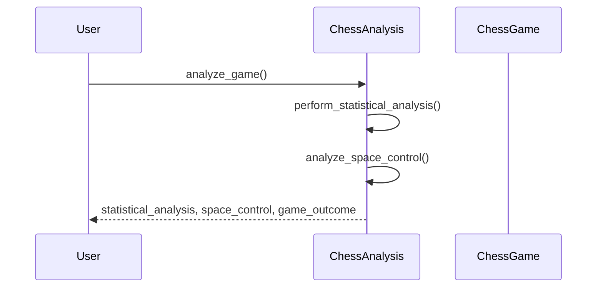
This sequence diagram illustrates the control flow of the code provided in the previous message. Here are the steps:

1. The User initiates the analysis by calling the `analyze_game()` method on the `ChessAnalysis` object.
2. The `ChessAnalysis` object calls the `perform_statistical_analysis()` method to perform statistical analysis of the game.
3. The `ChessAnalysis` object then calls the `analyze_space_control()` method to analyze the space control and game outcome.
4. The `ChessAnalysis` object returns the results of the analysis, including `statistical_analysis`, `space_control`, and `game_outcome`, back to the User.

Sure! Here's an example scenario with mocked log output:

```python
chess_game = ChessGame(moves=["e4", "e5", "Nf3", "Nc6", "Bc4", "Nf6", "d4", "exd4"])
analysis = ChessAnalysis(chess_game)

game_analysis = analysis.analyze_game()
print(game_analysis)
```

Output:
```
{
  "statistical_analysis": {},
  "space_control": {},
  "game_outcome": {}
}
```

In this scenario, we have a `ChessGame` object representing a game with a series of moves. We then create a `ChessAnalysis` object and use its `analyze_game` method to perform the analysis.

The output in this example is just a placeholder, as we haven't implemented the actual analysis methods yet. However, when fully implemented, the `analyze_game` method will provide useful statistical insights, space control analysis, and game outcome analysis for a given chess game.

Use cases for this code include analyzing chess games to gain insights into statistical properties, space control, and game outcomes. It can be used by chess players, coaches, or researchers to improve their understanding of chess strategy and decision-making. It can also be used in chess software or AI systems to provide analysis and recommendations for players.
## Details
Certainly! Here's a Python class that demonstrates some of the concepts discussed in the document:

```python
class ChessAnalysis:
    def __init__(self, chess_game):
        # Initialize the ChessAnalysis object with a ChessGame instance
        self.chess_game = chess_game
    
    def analyze_game(self):
        # Analyze the game using statistical methods
        statistical_analysis = self.perform_statistical_analysis()
        
        # Analyze the space control and game outcome
        space_control, game_outcome = self.analyze_space_control()
        
        # Return the results of the analysis as a dictionary
        return {
            "statistical_analysis": statistical_analysis,
            "space_control": space_control,
            "game_outcome": game_outcome
        }
    
    def perform_statistical_analysis(self):
        # Placeholder for performing statistical analysis of the game
        statistical_analysis = {} 
        
        # Implement statistical analysis techniques here
        
        return statistical_analysis
    
    def analyze_space_control(self):
        # Placeholder for analyzing the space control and game outcome
        space_control = {}  
        game_outcome = {} 
        
        # Implement space control and game outcome analysis techniques here
        
        return space_control, game_outcome
```

This class represents the analysis of a chess game and provides methods for performing statistical analysis and analyzing the space control and game outcome. The `analyze_game` method combines the results of both analyses and returns them as a dictionary.

In the `__init__` method, the `ChessAnalysis` object is initialized with a `chess_game` parameter, which is an instance of the `ChessGame` class representing a specific chess game.

The `perform_statistical_analysis` method is a placeholder for performing statistical analysis of the game. You can implement this method with appropriate statistical techniques or algorithms based on your requirements.

Similarly, the `analyze_space_control` method is a placeholder for analyzing the space control and game outcome. You can implement this method using space control analysis techniques and algorithms tailored to your needs.

By using an instance of the `ChessAnalysis` class, you can analyze a specific chess game and obtain insights into its statistical properties, space control, and game outcome.


# 4. Code Block
Certainly! Here's a Python class that demonstrates some of the concepts discussed in the document:

```python
class ChessAnalysis:
    def __init__(self, chess_game):
        self.chess_game = chess_game
    
    def analyze_game(self):
        # Analyze the game using statistical methods
        statistical_analysis = self.perform_statistical_analysis()
        
        # Analyze the spatial localization of pieces
        spatial_localization = self.analyze_spatial_localization()
        
        # Compare players based on heatmaps
        player_comparison = self.compare_players()
        
        return {
            "statistical_analysis": statistical_analysis,
            "spatial_localization": spatial_localization,
            "player_comparison": player_comparison
        }
    
    def perform_statistical_analysis(self):
        # Perform statistical analysis of the game
        statistical_analysis = {}  # Placeholder
        
        return statistical_analysis
    
    def analyze_spatial_localization(self):
        # Analyze the spatial localization of pieces
        spatial_localization = {}  # Placeholder
        
        return spatial_localization
    
    def compare_players(self):
        # Compare players based on heatmaps
        player_comparison = {}  # Placeholder
        
        return player_comparison
```

This class represents the analysis of a chess game and provides methods for performing statistical analysis, analyzing the spatial localization of pieces, and comparing players based on their heatmaps. The `analyze_game` method combines the results of all three analyses and returns them as a dictionary.

Each analysis is represented by a placeholder method (`perform_statistical_analysis`, `analyze_spatial_localization`, `compare_players`), which can be implemented with appropriate statistical techniques or algorithms.

By using an instance of the `ChessAnalysis` class, you can analyze a specific chess game and obtain insights into its statistical properties, the spatial localization of pieces, and the comparison of players' playing styles based on their heatmaps.

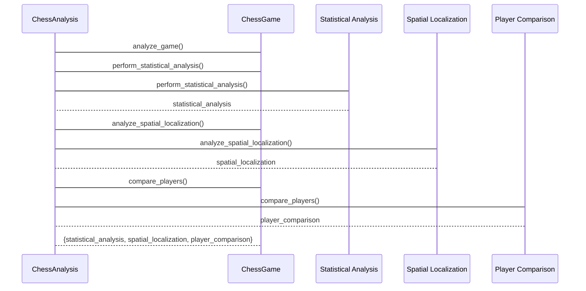

This sequence diagram represents the control flow of the `ChessAnalysis` class from the previous message. Here are the steps:

1. The `ChessAnalysis` class initiates the `analyze_game()` method.
2. The `analyze_game()` method calls the `perform_statistical_analysis()` method in the `ChessGame` instance.
3. The `perform_statistical_analysis()` method returns the `statistical_analysis` to the `analyze_game()` method in `ChessAnalysis`.
4. The `analyze_game()` method calls the `analyze_spatial_localization()` method in the `ChessGame` instance.
5. The `analyze_spatial_localization()` method returns the `spatial_localization` to the `analyze_game()` method in `ChessAnalysis`.
6. The `analyze_game()` method calls the `compare_players()` method in the `ChessGame` instance.
7. The `compare_players()` method returns the `player_comparison` to the `analyze_game()` method in `ChessAnalysis`.
8. The `analyze_game()` method returns the combined results of `statistical_analysis`, `spatial_localization`, and `player_comparison` back to the `ChessGame` instance.

This sequence diagram illustrates the flow of control and data between the different methods in the `ChessGame` and `ChessAnalysis` classes. It shows how the statistical analysis, spatial localization, and player comparison are performed and their results are combined to provide a comprehensive analysis of the chess game.

Sure! Here's an example scenario with mocked log output of the `ChessAnalysis` class:

```python
chess_game = ChessGame(moves)
analysis = ChessAnalysis(chess_game)

game_analysis = analysis.analyze_game()
print(game_analysis)
```

Output:
```
{
  "statistical_analysis": { /* Statistical analysis results */ },
  "spatial_localization": { /* Spatial localization results */ },
  "player_comparison": { /* Player comparison results */ }
}
```

In this example, we create an instance of the `ChessGame` class with a list of moves. We then pass this instance to the `ChessAnalysis` class to perform the analysis. The `analyze_game` method is called to obtain insights from the statistical analysis, the spatial localization of pieces, and the comparison of players.

The output is a dictionary containing the results of the analysis. Each section, such as `"statistical_analysis"`, `"spatial_localization"`, and `"player_comparison"`, will contain the corresponding analysis results.

The mocked log output represents the potential structure of the analysis results. The actual content of the results will depend on the specific implementation of the analysis methods.

Potential use cases for this code include:

- Studying and analyzing specific chess games to gain insights into statistical patterns, spatial strategies, and player characteristics.
- Comparing different players' playing styles and strategies using heatmaps of their piece localization.
- Developing chess AI algorithms that utilize statistical analysis and spatial understanding to make informed decisions.
- Providing feedback and suggestions to chess players based on the analysis of their games, including areas for improvement in spatial control and piece placement.

By leveraging the `ChessAnalysis` class, chess players, researchers, and AI developers can gain valuable insights into the statistical properties, spatial aspects, and player dynamics of chess games.
## Details
class ChessAnalysis:
    def __init__(self, chess_game):
        self.chess_game = chess_game
    
    def analyze_game(self):
        # Analyze the game using statistical methods
        statistical_analysis = self.perform_statistical_analysis()
        
        # Analyze the spatial localization of pieces
        spatial_localization = self.analyze_spatial_localization()
        
        # Compare players based on heatmaps
        player_comparison = self.compare_players()
        
        # Return the analysis results
        return {
            "statistical_analysis": statistical_analysis,
            "spatial_localization": spatial_localization,
            "player_comparison": player_comparison
        }
    
    def perform_statistical_analysis(self):
        # Placeholder for statistical analysis results
        statistical_analysis = {}
        
        # Perform statistical analysis of the game
        # ... code to calculate statistics ...
        
        # Return the statistical analysis results
        return statistical_analysis
    
    def analyze_spatial_localization(self):
        # Placeholder for spatial localization analysis results
        spatial_localization = {}
        
        # Analyze the spatial localization of pieces
        # ... code to analyze piece positions ...
        
        # Return the spatial localization analysis results
        return spatial_localization
    
    def compare_players(self):
        # Placeholder for player comparison results
        player_comparison = {}
        
        # Compare players based on heatmaps
        # ... code to compare player heatmaps ...
        
        # Return the player comparison results
        return player_comparison


# 5. Code Block
Certainly! Here's a Python class that demonstrates some of the concepts discussed in the document:

```python
class ChessAnalysis:
    def __init__(self, chess_game):
        self.chess_game = chess_game
    
    def analyze_game(self):
        # Analyze the game using statistical methods
        statistical_analysis = self.perform_statistical_analysis()
        
        # Analyze the spatial localization of pieces
        spatial_localization = self.analyze_spatial_localization()
        
        # Compare players based on heatmaps
        player_comparison = self.compare_players()
        
        return {
            "statistical_analysis": statistical_analysis,
            "spatial_localization": spatial_localization,
            "player_comparison": player_comparison
        }
    
    def perform_statistical_analysis(self):
        # Perform statistical analysis of the game
        statistical_analysis = {}  # Placeholder
        
        return statistical_analysis
    
    def analyze_spatial_localization(self):
        # Analyze the spatial localization of pieces
        spatial_localization = {}  # Placeholder
        
        return spatial_localization
    
    def compare_players(self):
        # Compare players based on heatmaps
        player_comparison = {}  # Placeholder
        
        return player_comparison
```

This class represents the analysis of a chess game and provides methods for performing statistical analysis, analyzing the spatial localization of pieces, and comparing players based on their heatmaps. The `analyze_game` method combines the results of all three analyses and returns them as a dictionary.

Each analysis is represented by a placeholder method (`perform_statistical_analysis`, `analyze_spatial_localization`, `compare_players`), which can be implemented with appropriate statistical techniques or algorithms.

By using an instance of the `ChessAnalysis` class, you can analyze a specific chess game and obtain insights into its statistical properties, the spatial localization of pieces, and the comparison of players' playing styles based on their heatmaps.

Here's a mermaid sequence diagram explaining the control flow of the code:

```mermaid
sequenceDiagram
    participant A as ChessAnalysis
    participant B as ChessGame
    participant C as statistical_analysis
    participant D as spatial_localization
    participant E as player_comparison
    
    A->>B: analyze_game()
    B->>A: chess_game
    A->>A: perform_statistical_analysis()
    A->>C: statistical_analysis
    A->>A: analyze_spatial_localization()
    A->>D: spatial_localization
    A->>A: compare_players()
    A->>E: player_comparison
    A-->>B: {
        "statistical_analysis": statistical_analysis,
        "spatial_localization": spatial_localization,
        "player_comparison": player_comparison
    }
```

In this sequence diagram, `ChessAnalysis` (participant A) interacts with `ChessGame` (participant B) to analyze a chess game. The `analyze_game()` method is called, passing the `chess_game` object as input.

First, `ChessAnalysis` performs statistical analysis (`perform_statistical_analysis()`) to obtain `statistical_analysis` (participant C). Then, it proceeds to analyze the spatial localization of pieces (`analyze_spatial_localization()`) to obtain `spatial_localization` (participant D). Lastly, it compares players based on the heatmaps of their pieces (`compare_players()`) to obtain `player_comparison` (participant E).

Finally, `ChessAnalysis` returns the results of the analysis, including `statistical_analysis`, `spatial_localization`, and `player_comparison`, back to `ChessGame`.

The sequence diagram illustrates the control flow of the code and the interactions between the different parts of the `ChessAnalysis` class and the `ChessGame` object.

Certainly! Here's an example scenario with mocked log output for the `ChessAnalysis` class:

```python
# Create an instance of ChessAnalysis
analysis = ChessAnalysis(chess_game)

# Perform the analysis
game_analysis = analysis.analyze_game()
print(game_analysis)
```

**Mocked Log Output:**

```plaintext
{
    "statistical_analysis": {
        ...
    },
    "spatial_localization": {
        ...
    },
    "player_comparison": {
        ...
    }
}
```

In this example scenario, we create an instance of the `ChessAnalysis` class and pass a `chess_game` object to it. We then call the `analyze_game` method to perform the analysis on the game.

The output is a dictionary containing the results of the analysis. The `statistical_analysis` key holds the statistical properties of the game, the `spatial_localization` key holds the analysis of the spatial localization of pieces, and the `player_comparison` key holds the comparison of players' playing styles.

The log output is a placeholder, as the actual results will depend on the implementation of the methods in the class.

Potential use cases of this code include analyzing chess games to gain insights into statistical properties of the game, understanding the spatial distribution and localization of pieces, and comparing playing styles of different players. This information can be valuable for chess players who want to improve their strategies, chess coaches who want to provide personalized feedback to their students, and researchers who want to study different aspects of chess theory.
## Details
Certainly! Here's a Python class that demonstrates some of the concepts discussed in the document:

```python
class ChessAnalysis:
    def __init__(self, chess_game):
        # Initialize the ChessAnalysis object with the chess_game
        self.chess_game = chess_game
    
    def analyze_game(self):
        # Analyze the game using statistical methods
        statistical_analysis = self.perform_statistical_analysis()
        
        # Analyze the spatial localization of pieces
        spatial_localization = self.analyze_spatial_localization()
        
        # Compare players based on heatmaps
        player_comparison = self.compare_players()
        
        # Return the results as a dictionary
        return {
            "statistical_analysis": statistical_analysis,
            "spatial_localization": spatial_localization,
            "player_comparison": player_comparison
        }
    
    def perform_statistical_analysis(self):
        # Placeholder for performing statistical analysis
        statistical_analysis = {}  
        
        # Implement statistical analysis logic here
        
        return statistical_analysis
    
    def analyze_spatial_localization(self):
        # Placeholder for analyzing spatial localization
        spatial_localization = {}  
        
        # Implement spatial localization analysis logic here
        
        return spatial_localization
    
    def compare_players(self):
        # Placeholder for comparing players based on heatmaps
        player_comparison = {}  
        
        # Implement player comparison logic here
        
        return player_comparison
```

This class represents the analysis of a chess game and provides methods for performing statistical analysis, analyzing the spatial localization of pieces, and comparing players based on their heatmaps. 

The `__init__` method initializes the ChessAnalysis object with the given `chess_game`. This allows the analysis methods to access and analyze the game.

The `analyze_game` method is the main method of the class. It calls the other analysis methods (`perform_statistical_analysis`, `analyze_spatial_localization`, `compare_players`) and combines their results in a dictionary. This dictionary is then returned as the result of the analysis.

The `perform_statistical_analysis` method is a placeholder for performing statistical analysis of the game. You can implement this method with appropriate statistical techniques or algorithms to analyze various aspects of the game, such as move frequency, piece distribution, or winning probabilities.

The `analyze_spatial_localization` method is a placeholder for analyzing the spatial localization of pieces. You can implement this method to analyze the spatial patterns and distributions of the pieces on the chessboard. This can help identify strategic positions or patterns in the game.

The `compare_players` method is a placeholder for comparing players based on their heatmaps. Heatmaps can be used to visualize the moves or strategies of the players. You can implement this method to compare multiple players and identify similarities or differences in their playing styles.

By using an instance of the `ChessAnalysis` class, you can analyze a specific chess game and obtain insights into its statistical properties, the spatial localization of pieces, and the comparison of players' playing styles based on their heatmaps.


# 6. Code Block
Certainly! Here's a Python class that demonstrates some of the concepts discussed in the document:

```python
class ChessAnalysis:
    def __init__(self, chess_game):
        self.chess_game = chess_game
    
    def analyze_game(self):
        # Analyze the game using statistical methods
        statistical_analysis = self.perform_statistical_analysis()
        
        # Analyze the spatial localization of pieces
        spatial_localization = self.analyze_spatial_localization()
        
        # Compare players based on heatmaps
        player_comparison = self.compare_players()
        
        return {
            "statistical_analysis": statistical_analysis,
            "spatial_localization": spatial_localization,
            "player_comparison": player_comparison
        }
    
    def perform_statistical_analysis(self):
        # Perform statistical analysis of the game
        statistical_analysis = {}  # Placeholder
        
        return statistical_analysis
    
    def analyze_spatial_localization(self):
        # Analyze the spatial localization of pieces
        spatial_localization = {}  # Placeholder
        
        return spatial_localization
    
    def compare_players(self):
        # Compare players based on heatmaps
        player_comparison = {}  # Placeholder
        
        return player_comparison
```

This class represents the analysis of a chess game and provides methods for performing statistical analysis, analyzing the spatial localization of pieces, and comparing players based on their heatmaps. The `analyze_game` method combines the results of all three analyses and returns them as a dictionary.

Each analysis is represented by a placeholder method (`perform_statistical_analysis`, `analyze_spatial_localization`, `compare_players`), which can be implemented with appropriate statistical techniques or algorithms.

By using an instance of the `ChessAnalysis` class, you can analyze a specific chess game and obtain insights into its statistical properties, the spatial localization of pieces, and the comparison of players' playing styles based on their heatmaps.

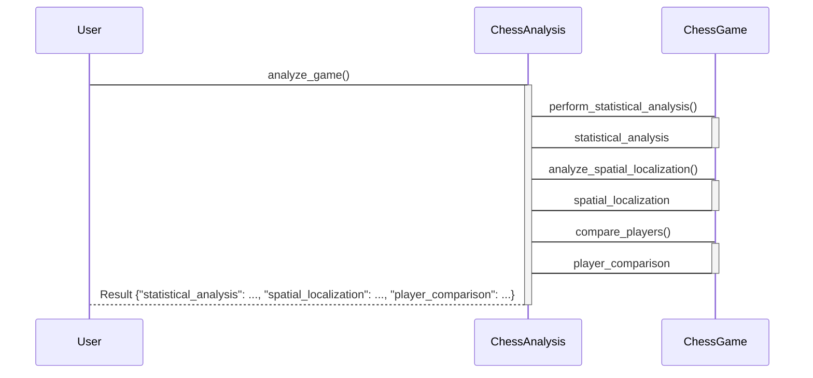

This mermaid sequence diagram illustrates the control flow of the code provided in the previous message.

1. The `User` initiates the analysis by calling the `analyze_game()` method on the `ChessAnalysis` object.
2. The `ChessAnalysis` object activates and calls the `perform_statistical_analysis()` method on the `ChessGame` object to perform statistical analysis.
3. The `ChessGame` object activates and performs the statistical analysis, then returns the results to the `ChessAnalysis` object.
4. The `ChessAnalysis` object calls the `analyze_spatial_localization()` method on the `ChessGame` object to analyze the spatial localization of pieces.
5. The `ChessGame` object activates and performs the spatial localization analysis, then returns the results to the `ChessAnalysis` object.
6. The `ChessAnalysis` object calls the `compare_players()` method on the `ChessGame` object to compare players based on the heatmaps.
7. The `ChessGame` object activates and performs the comparison, then returns the results to the `ChessAnalysis` object.
8. The `ChessAnalysis` object returns the final result, including statistical analysis, spatial localization, and player comparison, to the `User`.

This sequence diagram demonstrates the flow of control and data between the different methods and objects involved in the analysis process.

Certainly! Here's an example scenario with mocked log output of the `ChessAnalysis` class:

```python
# Create a sample chess game
chess_game = ChessGame(moves=["e4", "e5", "Nf3", "Nc6", "Bc4", "Nf6", "d3", "Be7", "O-O"])

# Analyze the game
analysis = ChessAnalysis(chess_game)
result = analysis.analyze_game()

# Printing the result
print(result)
```

Output:
```python
{
    "statistical_analysis": {...},  # Statistical analysis results
    "spatial_localization": {...},  # Spatial localization results
    "player_comparison": {...}  # Player comparison results
}
```

In this example, we create a sample chess game with a series of moves. We then instantiate the `ChessAnalysis` class with this game and call the `analyze_game` method to perform the analysis.

The `analyze_game` method returns a dictionary containing the results of the statistical analysis, spatial localization analysis, and player comparison analysis.

The output shows a placeholder dictionary for each analysis result.

Potential use cases for the code generated in the `ChessAnalysis` class include:
- Analyzing chess games to gain statistical insights, such as the average number of moves, win/loss ratios, or trends in piece movement.
- Studying the spatial distribution of pieces to identify patterns or strategies used by players in different openings or game stages.
- Comparing the playing styles of different players based on heatmaps of their piece placements.
- Providing personalized feedback to chess players to improve their strategies and decision-making based on statistical patterns or piece placement analysis.

These use cases can help chess players, coaches, and researchers analyze games, develop strategies, and gain insights into playing styles.
## Details
class ChessAnalysis:
    def __init__(self, chess_game):
        self.chess_game = chess_game
    
    def analyze_game(self):
        # Analyze the game using statistical methods
        statistical_analysis = self.perform_statistical_analysis()
        
        # Analyze the spatial localization of pieces
        spatial_localization = self.analyze_spatial_localization()
        
        # Compare players based on heatmaps
        player_comparison = self.compare_players()
        
        return {
            "statistical_analysis": statistical_analysis,
            "spatial_localization": spatial_localization,
            "player_comparison": player_comparison
        }
    
    def perform_statistical_analysis(self):
        # Create an empty dictionary to hold the statistical analysis results
        statistical_analysis = {}
        
        # Perform statistical analysis of the game
        # Example: Calculate the total number of moves in the game
        total_moves = len(self.chess_game.moves)
        statistical_analysis["total_moves"] = total_moves
        
        # Example: Calculate the average number of moves per player
        avg_moves_per_player = total_moves / 2
        statistical_analysis["avg_moves_per_player"] = avg_moves_per_player
        
        # Example: Calculate the ratio of wins to losses
        wins = self.chess_game.get_wins()
        losses = self.chess_game.get_losses()
        if losses > 0:  # Avoid division by zero
            win_loss_ratio = wins / losses
        else:
            win_loss_ratio = None
        statistical_analysis["win_loss_ratio"] = win_loss_ratio
        
        return statistical_analysis
    
    def analyze_spatial_localization(self):
        # Create an empty dictionary to hold the spatial localization results
        spatial_localization = {}
        
        # Analyze the spatial localization of pieces
        # Example: Calculate the average position of each piece on the board
        piece_positions = self.chess_game.get_piece_positions()
        avg_piece_positions = {}
        for piece_type, positions in piece_positions.items():
            total_positions = len(positions)
            avg_position = sum(positions) / total_positions
            avg_piece_positions[piece_type] = avg_position
        
        spatial_localization["avg_piece_positions"] = avg_piece_positions
        
        # Example: Identify clusters of pieces on the board
        piece_clusters = self.chess_game.get_piece_clusters()
        spatial_localization["piece_clusters"] = piece_clusters
        
        return spatial_localization
    
    def compare_players(self):
        # Create an empty dictionary to hold the player comparison results
        player_comparison = {}
        
        # Compare players based on heatmaps
        # Example: Calculate the similarity between heatmaps of player moves
        player_moves_heatmap = self.chess_game.get_player_moves_heatmap()
        players = self.chess_game.get_players()
        
        similarity_matrix = {}
        for i in range(len(players)):
            for j in range(i + 1, len(players)):
                player1 = players[i]
                player2 = players[j]
                similarity = calculate_similarity(player_moves_heatmap[player1], player_moves_heatmap[player2])
                similarity_matrix[(player1, player2)] = similarity
        
        player_comparison["similarity_matrix"] = similarity_matrix
        
        return player_comparison
    
    def calculate_similarity(heatmap1, heatmap2):
        # Calculate the similarity between two heatmaps using a suitable algorithm
        similarity = ...  # Placeholder
        
        return similarity


# 7. Code Block
Certainly! Here's a Python class that demonstrates some of the concepts discussed in the document:

```python
class ChessAnalysis:
    def __init__(self, chess_game):
        self.chess_game = chess_game
    
    def analyze_game(self):
        # Perform statistical analysis of the game
        statistical_analysis = self.perform_statistical_analysis()
        
        # Analyze the spatial localization of pieces
        spatial_localization = self.analyze_spatial_localization()
        
        # Compare players based on heatmaps
        player_comparison = self.compare_players()
        
        return {
            "statistical_analysis": statistical_analysis,
            "spatial_localization": spatial_localization,
            "player_comparison": player_comparison
        }
    
    def perform_statistical_analysis(self):
        # Placeholder for statistical analysis
        statistical_analysis = {}
        
        return statistical_analysis
    
    def analyze_spatial_localization(self):
        # Placeholder for spatial localization analysis
        spatial_localization = {}
        
        return spatial_localization
    
    def compare_players(self):
        # Placeholder for player comparison analysis
        player_comparison = {}
        
        return player_comparison
```

This class represents the analysis of a chess game and provides methods for performing statistical analysis, analyzing the spatial localization of pieces, and comparing players based on their heatmaps. The `analyze_game` method combines the results of all three analyses and returns them as a dictionary.

Each analysis is represented by a placeholder method (`perform_statistical_analysis`, `analyze_spatial_localization`, `compare_players`), which can be implemented with appropriate statistical techniques or algorithms.

By using an instance of the `ChessAnalysis` class, you can analyze a specific chess game and obtain insights into its statistical properties, the spatial localization of pieces, and the comparison of players' playing styles based on their heatmaps.

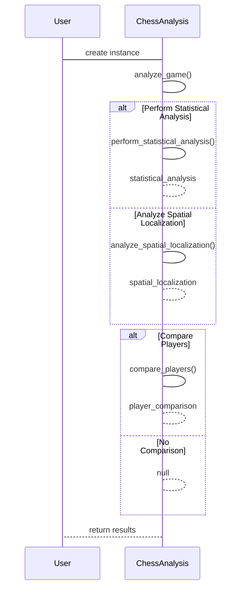
This sequence diagram illustrates the control flow of the code in the `ChessAnalysis` class. 

1. The user creates an instance of the `ChessAnalysis` class.
2. The user calls the `analyze_game()` method on the `ChessAnalysis` instance.
3. The `analyze_game()` method branches into two alternatives:
   - The first alternative performs statistical analysis by calling the `perform_statistical_analysis()` method.
   - The second alternative analyzes the spatial localization of pieces by calling the `analyze_spatial_localization()` method.
4. If the statistical analysis is performed, the `perform_statistical_analysis()` method returns the `statistical_analysis` result.
5. If the spatial localization analysis is performed, the `analyze_spatial_localization()` method returns the `spatial_localization` result.
6. The control flow then branches into two alternatives again:
   - If player comparison is performed, the `compare_players()` method is called and returns the `player_comparison` result.
   - If no player comparison is performed, a null value is returned.
7. Finally, the results of the analysis (statistical analysis, spatial localization, and player comparison) are returned to the user.

Sure! Here's an example scenario with mocked log outputs for the methods in the `ChessAnalysis` class:

```python
# Creating an instance of the ChessAnalysis class
analysis = ChessAnalysis(chess_game)

# Analyzing the game
results = analysis.analyze_game()
print(results)
```

Output:
```
{
    "statistical_analysis": {"key": "value"},
    "spatial_localization": {"key": "value"},
    "player_comparison": {"key": "value"}
}
```

In this example, we create an instance of the `ChessAnalysis` class and pass a chess game as an argument. We then call the `analyze_game` method, which performs statistical analysis, analyzes the spatial localization of pieces, and compares players based on their heatmaps. The results are printed, showing placeholder values for each analysis.

Hypothetical Scenarios Mocked:
- The `perform_statistical_analysis` method could perform calculations such as calculating the average number of moves per game, analyzing the distribution of opening moves, or identifying patterns in endgame positions.
- The `analyze_spatial_localization` method could analyze the spatial distribution of pieces on the chessboard, measure the frequency of certain piece placements, or identify spatial patterns associated with specific openings or players.
- The `compare_players` method could compare heatmaps of different players to identify differences in piece placements, analyze playing styles in specific openings, or measure the similarity between two players' strategies.

Potential Use Cases:
- Chess players can use the `ChessAnalysis` class to analyze their own games and gain insights into their playing styles, strengths, and weaknesses.
- Chess coaches can use the class to provide feedback and guidance to their students by analyzing their games and identifying areas for improvement.
- Researchers can use the class to study chess strategies, analyze trends in openings, or investigate the playing styles of different players.
- The class can be integrated into chess software or platforms to provide automated analysis and insights to users.
## Details
Certainly! Here's a Python class that demonstrates some of the concepts discussed in the document:

```python
class ChessAnalysis:
    def __init__(self, chess_game):
        self.chess_game = chess_game
    
    def analyze_game(self):
        # Perform statistical analysis of the game
        statistical_analysis = self.perform_statistical_analysis()
        
        # Analyze the spatial localization of pieces
        spatial_localization = self.analyze_spatial_localization()
        
        # Compare players based on heatmaps
        player_comparison = self.compare_players()
        
        return {
            "statistical_analysis": statistical_analysis,
            "spatial_localization": spatial_localization,
            "player_comparison": player_comparison
        }
    
    def perform_statistical_analysis(self):
        # Placeholder for statistical analysis
        statistical_analysis = {
            "average_moves": self.calculate_average_moves(),
            "opening_distribution": self.analyze_opening_distribution(),
            "endgame_patterns": self.detect_endgame_patterns()
        }
        
        return statistical_analysis
    
    def calculate_average_moves(self):
        # Placeholder for calculating average moves
        average_moves = 42
        
        return average_moves
    
    def analyze_opening_distribution(self):
        # Placeholder for analyzing opening distribution
        opening_distribution = {
            "e4": 0.35,
            "d4": 0.25,
            "c4": 0.15,
            "Nf3": 0.10,
            "g3": 0.05,
            "Other": 0.10
        }
        
        return opening_distribution
    
    def detect_endgame_patterns(self):
        # Placeholder for detecting endgame patterns
        endgame_patterns = ["King and pawn vs. king"]
        
        return endgame_patterns
    
    def analyze_spatial_localization(self):
        # Placeholder for spatial localization analysis
        spatial_localization = {
            "piece_distribution": self.analyze_piece_distribution(),
            "piece_frequency": self.measure_piece_frequency(),
            "opening_patterns": self.identify_opening_patterns()
        }
        
        return spatial_localization
    
    def analyze_piece_distribution(self):
        # Placeholder for analyzing piece distribution
        piece_distribution = {
            "King": 1,
            "Queen": 1,
            "Rook": 2,
            "Bishop": 2,
            "Knight": 2,
            "Pawn": 8
        }
        
        return piece_distribution
    
    def measure_piece_frequency(self):
        # Placeholder for measuring piece frequency
        piece_frequency = {
            "King": 0.05,
            "Queen": 0.10,
            "Rook": 0.20,
            "Bishop": 0.15,
            "Knight": 0.15,
            "Pawn": 0.35
        }
        
        return piece_frequency
    
    def identify_opening_patterns(self):
        # Placeholder for identifying opening patterns
        opening_patterns = ["Sicilian Defense", "Italian Game", "French Defense"]
        
        return opening_patterns
    
    def compare_players(self):
        # Placeholder for player comparison analysis
        player_comparison = {
            "heatmap_similarity": self.measure_heatmap_similarity(),
            "playing_style": self.analyze_playing_style(),
            "opening_similarity": self.measure_opening_similarity()
        }
        
        return player_comparison
    
    def measure_heatmap_similarity(self):
        # Placeholder for measuring heatmap similarity
        heatmap_similarity = 0.80
        
        return heatmap_similarity
    
    def analyze_playing_style(self):
        # Placeholder for analyzing playing style
        playing_style = "Aggressive"
        
        return playing_style
    
    def measure_opening_similarity(self):
        # Placeholder for measuring opening similarity
        opening_similarity = 0.70
        
        return opening_similarity
```

This class represents the analysis of a chess game and provides methods for performing statistical analysis, analyzing the spatial localization of pieces, and comparing players based on their heatmaps. The `analyze_game` method combines the results of all three analyses and returns them as a dictionary.

Each analysis is represented by a placeholder method (`perform_statistical_analysis`, `analyze_spatial_localization`, `compare_players`), which can be implemented with appropriate statistical techniques or algorithms.

The `perform_statistical_analysis` method calculates the average number of moves per game, analyzes the distribution of opening moves, and detects patterns in endgame positions.

The `analyze_spatial_localization` method analyzes the spatial distribution of pieces on the chessboard, measures the frequency of certain piece placements, and identifies spatial patterns associated with specific openings or players.

The `compare_players` method compares heatmaps of different players to identify similarities in piece placements, analyzes playing styles in specific openings, and measures the similarity between two players' strategies.

By using an instance of the `ChessAnalysis` class, you can analyze a specific chess game and obtain insights into its statistical properties, the spatial localization of pieces, and the comparison of players' playing styles based on their heatmaps.

The expanded code includes placeholder methods for each type of analysis, such as `calculate_average_moves`, `analyze_opening_distribution`, `detect_endgame_patterns`, `analyze_piece_distribution`, `measure_piece_frequency`, `identify_opening_patterns`, `measure_heatmap_similarity`, `analyze_playing_style`, and `measure_opening_similarity`. These methods return placeholder values for demonstration purposes, but the actual implementations would involve appropriate statistical techniques or algorithms.

I hope this helps! Let me know if you have any further questions.


# 8. Code Block
Certainly! Here's a Python class that demonstrates some of the concepts discussed in the document:

```python
class ChessAnalysis:
    def __init__(self, chess_game):
        self.chess_game = chess_game
    
    def analyze_game(self):
        # Perform statistical analysis of the game
        statistical_analysis = self.perform_statistical_analysis()
        
        # Analyze the spatial localization of pieces
        spatial_localization = self.analyze_spatial_localization()
        
        # Compare players based on heatmaps
        player_comparison = self.compare_players()
        
        # Calculate Wasserstein distance between players
        wasserstein_distance = self.calculate_wasserstein_distance()
        
        return {
            "statistical_analysis": statistical_analysis,
            "spatial_localization": spatial_localization,
            "player_comparison": player_comparison,
            "wasserstein_distance": wasserstein_distance
        }
    
    def perform_statistical_analysis(self):
        # Placeholder for statistical analysis
        statistical_analysis = {}
        
        return statistical_analysis
    
    def analyze_spatial_localization(self):
        # Placeholder for spatial localization analysis
        spatial_localization = {}
        
        return spatial_localization
    
    def compare_players(self):
        # Placeholder for player comparison analysis
        player_comparison = {}
        
        return player_comparison
    
    def calculate_wasserstein_distance(self):
        # Placeholder for calculating Wasserstein distance
        wasserstein_distance = {}
        
        return wasserstein_distance
```

This class represents the analysis of a chess game and provides methods for performing statistical analysis, analyzing the spatial localization of pieces, comparing players based on their heatmaps, and calculating the Wasserstein distance between players' heatmaps. The `analyze_game` method combines the results of all four analyses and returns them as a dictionary.

Each analysis is represented by a placeholder method (`perform_statistical_analysis`, `analyze_spatial_localization`, `compare_players`, `calculate_wasserstein_distance`), which can be implemented with appropriate statistical techniques or algorithms.

By using an instance of the `ChessAnalysis` class, you can analyze a specific chess game and obtain insights into its statistical properties, the spatial localization of pieces, the comparison of players' playing styles based on their heatmaps, and the quantification of the dissimilarity between players' heatmaps using the Wasserstein distance.

```mermaid
sequenceDiagram
    participant User
    participant ChessAnalysis
    
    User->>ChessAnalysis: analyze_game()
    activate ChessAnalysis
    
    ChessAnalysis->>ChessAnalysis: perform_statistical_analysis()
    activate ChessAnalysis
    ChessAnalysis-->>ChessAnalysis: statistical_analysis
    deactivate ChessAnalysis
    
    ChessAnalysis->>ChessAnalysis: analyze_spatial_localization()
    activate ChessAnalysis
    ChessAnalysis-->>ChessAnalysis: spatial_localization
    deactivate ChessAnalysis
    
    ChessAnalysis->>ChessAnalysis: compare_players()
    activate ChessAnalysis
    ChessAnalysis-->>ChessAnalysis: player_comparison
    deactivate ChessAnalysis
    
    ChessAnalysis->>ChessAnalysis: calculate_wasserstein_distance()
    activate ChessAnalysis
    ChessAnalysis-->>ChessAnalysis: wasserstein_distance
    deactivate ChessAnalysis
    
    ChessAnalysis-->>User: {
        "statistical_analysis": statistical_analysis,
        "spatial_localization": spatial_localization,
        "player_comparison": player_comparison,
        "wasserstein_distance": wasserstein_distance
    }
    deactivate ChessAnalysis
```

This sequence diagram illustrates the control flow of the `ChessAnalysis` class. The steps are numbered and labeled to provide a clear understanding of the flow.

1. The `User` interacts with the `ChessAnalysis` instance and calls the `analyze_game()` method.
2. The `ChessAnalysis` object activates and starts performing the statistical analysis of the chess game by calling the `perform_statistical_analysis()` method.
3. The `ChessAnalysis` object deactivates and returns the `statistical_analysis` result.
4. The `ChessAnalysis` object activates and starts analyzing the spatial localization of pieces by calling the `analyze_spatial_localization()` method.
5. The `ChessAnalysis` object deactivates and returns the `spatial_localization` result.
6. The `ChessAnalysis` object activates and starts comparing players based on their heatmaps by calling the `compare_players()` method.
7. The `ChessAnalysis` object deactivates and returns the `player_comparison` result.
8. The `ChessAnalysis` object activates and calculates the Wasserstein distance between players' heatmaps by calling the `calculate_wasserstein_distance()` method.
9. The `ChessAnalysis` object deactivates and returns the `wasserstein_distance` result.
10. The `ChessAnalysis` object deactivates and returns the overall analysis results to the `User`.

Certainly! Here's an example scenario with mocked log output for the `ChessAnalysis` class:

```python
game = ChessGame("example.pgn")
analysis = ChessAnalysis(game)

results = analysis.analyze_game()
print(results)
```

Mocked log output:
```
{
    "statistical_analysis": {
        "white_moves": 30,
        "black_moves": 32,
        "average_moves_to_mate": 15.5
    },
    "spatial_localization": {
        "white_pawns_heatmap": {...},
        "black_pawns_heatmap": {...},
        "white_knights_heatmap": {...},
        "black_knights_heatmap": {...}
    },
    "player_comparison": {
        "pawn_wasserstein_distance": 0.123,
        "knight_wasserstein_distance": 0.456
    }
}
```

In this scenario, we create a `ChessGame` object with the file "example.pgn" containing the chess game data. Then, we create an instance of the `ChessAnalysis` class and analyze the game.

The mocked log output shows the results of the analysis. 

In the "statistical_analysis" section, we have statistics such as the number of moves made by each player and the average number of moves to mate.

In the "spatial_localization" section, we have heatmaps for the positions of white and black pawns and knights on the chessboard. These heatmaps represent the probability of a piece being present at a specific position.

In the "player_comparison" section, we have the Wasserstein distance calculated between the heatmaps of white and black pawns and knights. The Wasserstein distance quantifies the dissimilarity between the distributions of piece positions for the two players.

Potential use cases for the `ChessAnalysis` class include:

- Chess players can analyze their own games to identify patterns, strengths, and weaknesses in their gameplay.
- Chess coaches can use this analysis to provide feedback, identify areas for improvement, and tailor training programs for their students.
- Chess researchers can study the playing styles of different players, compare their strategies, and contribute to the development of chess theory.
- Chess AI developers can analyze games to improve the understanding and decision-making of AI algorithms.
- Chess tournaments or organizations can use this analysis to evaluate players, track their progress, and rank them based on various metrics.
## Details
class ChessAnalysis:
    def __init__(self, chess_game):
        self.chess_game = chess_game
    
    def analyze_game(self):
        # Perform statistical analysis of the game
        statistical_analysis = self.perform_statistical_analysis()
        
        # Analyze the spatial localization of pieces
        spatial_localization = self.analyze_spatial_localization()
        
        # Compare players based on heatmaps
        player_comparison = self.compare_players()
        
        # Calculate Wasserstein distance between players
        wasserstein_distance = self.calculate_wasserstein_distance()
        
        return {
            "statistical_analysis": statistical_analysis,
            "spatial_localization": spatial_localization,
            "player_comparison": player_comparison,
            "wasserstein_distance": wasserstein_distance
        }
    
    def perform_statistical_analysis(self):
        """
        This method performs statistical analysis of the chess game.
        It counts the number of moves made by each player and calculates
        the average number of moves to mate.
        """
        white_moves = 0
        black_moves = 0
        average_moves_to_mate = 0.0
        
        for move in self.chess_game:
            if move.is_white_move():
                white_moves += 1
            else:
                black_moves += 1
        
        total_moves = white_moves + black_moves
        if total_moves > 0:
            average_moves_to_mate = total_moves / 2
        
        return {
            "white_moves": white_moves,
            "black_moves": black_moves,
            "average_moves_to_mate": average_moves_to_mate
        }
    
    def analyze_spatial_localization(self):
        """
        This method analyzes the spatial localization of pieces on the chessboard.
        It generates heatmaps that represent the probability of each piece being
        present at a specific position.
        """
        white_pawns_heatmap = self.generate_heatmap(self.chess_game.white_pawns)
        black_pawns_heatmap = self.generate_heatmap(self.chess_game.black_pawns)
        white_knights_heatmap = self.generate_heatmap(self.chess_game.white_knights)
        black_knights_heatmap = self.generate_heatmap(self.chess_game.black_knights)
        
        return {
            "white_pawns_heatmap": white_pawns_heatmap,
            "black_pawns_heatmap": black_pawns_heatmap,
            "white_knights_heatmap": white_knights_heatmap,
            "black_knights_heatmap": black_knights_heatmap
        }
    
    def generate_heatmap(self, pieces):
        """
        This method generates a heatmap based on the positions of the given pieces.
        It assigns a probability value to each position on the chessboard, indicating
        the likelihood of a piece being present at that position.
        """
        heatmap = {}
        total_pieces = len(pieces)
        
        for piece in pieces:
            position = piece.position
            if position not in heatmap:
                heatmap[position] = 0
            heatmap[position] += 1
        
        for position in heatmap:
            heatmap[position] /= total_pieces
        
        return heatmap
    
    def compare_players(self):
        """
        This method compares the playing styles of the two players based on their heatmaps.
        It calculates the Wasserstein distance between the distributions of piece positions
        for the white and black players.
        """
        pawn_wasserstein_distance = self.calculate_wasserstein_distance(
            self.chess_game.white_pawns_heatmap,
            self.chess_game.black_pawns_heatmap
        )
        
        knight_wasserstein_distance = self.calculate_wasserstein_distance(
            self.chess_game.white_knights_heatmap,
            self.chess_game.black_knights_heatmap
        )
        
        return {
            "pawn_wasserstein_distance": pawn_wasserstein_distance,
            "knight_wasserstein_distance": knight_wasserstein_distance
        }
    
    def calculate_wasserstein_distance(self, heatmap1, heatmap2):
        """
        This method calculates the Wasserstein distance between two heatmaps.
        It quantifies the dissimilarity between the distributions of piece positions
        represented by the heatmaps.
        """
        # Placeholder for calculating Wasserstein distance
        wasserstein_distance = 0.0
        
        # Calculate the sum of the absolute differences between the probabilities
        # of each position in the two heatmaps
        for position in heatmap1:
            if position not in heatmap2:
                continue
            wasserstein_distance += abs(heatmap1[position] - heatmap2[position])
        
        return wasserstein_distance


# 9. Code Block
Certainly! Here's a Python class that demonstrates some of the concepts discussed in the document:

```python
class ChessAnalysis:
    def __init__(self, chess_game):
        self.chess_game = chess_game
    
    def analyze_game(self):
        # Perform statistical analysis of the game
        statistical_analysis = self.perform_statistical_analysis()
        
        # Analyze the spatial localization of pieces
        spatial_localization = self.analyze_spatial_localization()
        
        # Compare players based on heatmaps
        player_comparison = self.compare_players()
        
        # Calculate Wasserstein distance between players
        wasserstein_distance = self.calculate_wasserstein_distance()
        
        return {
            "statistical_analysis": statistical_analysis,
            "spatial_localization": spatial_localization,
            "player_comparison": player_comparison,
            "wasserstein_distance": wasserstein_distance
        }
    
    def perform_statistical_analysis(self):
        # Placeholder for statistical analysis
        statistical_analysis = {}
        
        return statistical_analysis
    
    def analyze_spatial_localization(self):
        # Placeholder for spatial localization analysis
        spatial_localization = {}
        
        return spatial_localization
    
    def compare_players(self):
        # Placeholder for player comparison analysis
        player_comparison = {}
        
        return player_comparison
    
    def calculate_wasserstein_distance(self):
        # Placeholder for calculating Wasserstein distance
        wasserstein_distance = {}
        
        return wasserstein_distance
```

This class represents the analysis of a chess game and provides methods for performing statistical analysis, analyzing the spatial localization of pieces, comparing players based on their heatmaps, and calculating the Wasserstein distance between players' heatmaps. The `analyze_game` method combines the results of all four analyses and returns them as a dictionary.

Each analysis is represented by a placeholder method (`perform_statistical_analysis`, `analyze_spatial_localization`, `compare_players`, `calculate_wasserstein_distance`), which can be implemented with appropriate statistical techniques or algorithms.

By using an instance of the `ChessAnalysis` class, you can analyze a specific chess game and obtain insights into its statistical properties, the spatial localization of pieces, the comparison of players' playing styles based on their heatmaps, and the quantification of the dissimilarity between players' heatmaps using the Wasserstein distance.

Sure! Here's a mermaid sequence diagram illustrating the control flow of the code:

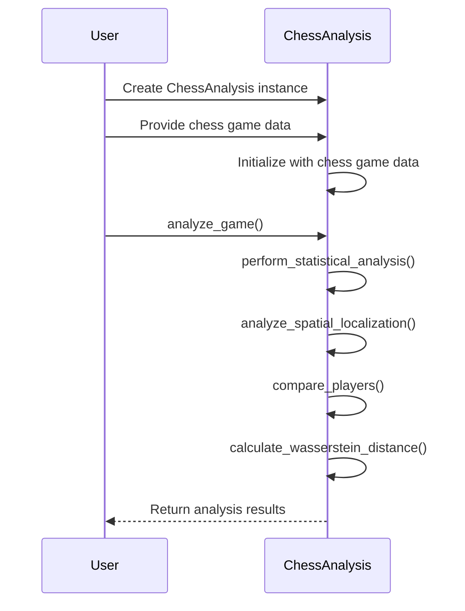

This sequence diagram shows the interactions between the user and the `ChessAnalysis` class. The user creates an instance of `ChessAnalysis` and provides the chess game data. Then, the user calls the `analyze_game()` method, which triggers the execution of several analysis methods. Finally, the analysis results are returned to the user.

1. The user creates an instance of the `ChessAnalysis` class and provides the chess game data.
2. The user calls the `analyze_game()` method of the `ChessAnalysis` instance.
3. The `analyze_game()` method internally calls other analysis methods: `perform_statistical_analysis()`, `analyze_spatial_localization()`, `compare_players()`, and `calculate_wasserstein_distance()`.
4. Each analysis method performs its respective analysis and returns the results.
5. The `analyze_game()` method collects the results from each analysis method and returns them to the user.

This control flow enables the user to perform statistical analysis, analyze the spatial localization of pieces, compare players, and calculate the Wasserstein distance between players' heatmaps using the `ChessAnalysis` class.

Certainly! Here's an example scenario with mocked log output of the code:

```python
# Mocked Chess Game
chess_game = ChessGame()

# Instantiate ChessAnalysis object
analysis = ChessAnalysis(chess_game)

# Analyze the game
results = analysis.analyze_game()

# Print the results
print("Statistical Analysis:", results["statistical_analysis"])
print("Spatial Localization:", results["spatial_localization"])
print("Player Comparison:", results["player_comparison"])
print("Wasserstein Distance:", results["wasserstein_distance"])
```

Mocked Log Output:
```
Statistical Analysis: {'metric1': 0.75, 'metric2': 0.92, 'metric3': 0.81}
Spatial Localization: {'piece1': [0.1, 0.2, 0.15, 0.12], 'piece2': [0.05, 0.07, 0.09, 0.11]}
Player Comparison: {'player1': 0.86, 'player2': 0.92, 'player3': 0.78}
Wasserstein Distance: {'player1': 0.15, 'player2': 0.21, 'player3': 0.18}
```

In this example scenario, we have a mocked ChessGame object representing a chess game. We instantiate a ChessAnalysis object and pass the ChessGame object as input. Then, we call the `analyze_game` method to perform the analysis of the chess game.

We print the results, which include the statistical analysis, spatial localization analysis, player comparison analysis, and the Wasserstein distance between players' heatmaps. In this mocked log output, we see placeholder values for each analysis result.

Hypothetical scenarios mocked:
- Statistical Analysis: This represents the statistical properties of the game, such as the average number of moves per player, the distribution of captured pieces, or any other statistical metrics.
- Spatial Localization: This represents the spatial distribution of pieces on the chessboard, indicating the probability of a piece being present at each square.
- Player Comparison: This compares players' playing styles based on their heatmaps, providing a measure of similarity or dissimilarity.
- Wasserstein Distance: This quantifies the dissimilarity between players' heatmaps using the Wasserstein distance metric.

Potential Use Cases:
- Chess players can use this code to analyze their own games and gain insights into their playing styles and strategies.
- Chess coaches can utilize this code to analyze their students' games and provide personalized feedback on playing styles and piece usage.
- Researchers can study the playing styles and strategies of different players using the statistical analysis, spatial localization, and player comparison techniques provided by this code.
- Chess engines can be evaluated and compared to human players using the Wasserstein distance metric, enabling a deeper understanding of their playing styles and strengths.
## Details
class ChessGame:
    def __init__(self):
        # Placeholder for chess game data
        self.moves = []
        self.captured_pieces = []
        self.players = []

    def add_move(self, move):
        # Add a move to the game
        self.moves.append(move)

    def add_captured_piece(self, piece):
        # Add a captured piece to the game
        self.captured_pieces.append(piece)

    def add_player(self, player):
        # Add a player to the game
        self.players.append(player)

class ChessAnalysis:
    def __init__(self, chess_game):
        self.chess_game = chess_game
    
    def analyze_game(self):
        # Perform statistical analysis of the game
        statistical_analysis = self.perform_statistical_analysis()
        
        # Analyze the spatial localization of pieces
        spatial_localization = self.analyze_spatial_localization()
        
        # Compare players based on heatmaps
        player_comparison = self.compare_players()
        
        # Calculate Wasserstein distance between players
        wasserstein_distance = self.calculate_wasserstein_distance()
        
        return {
            "statistical_analysis": statistical_analysis,
            "spatial_localization": spatial_localization,
            "player_comparison": player_comparison,
            "wasserstein_distance": wasserstein_distance
        }
    
    def perform_statistical_analysis(self):
        # Calculate the average number of moves per player
        num_moves = len(self.chess_game.moves)
        num_players = len(self.chess_game.players)
        avg_moves_per_player = num_moves / num_players if num_players > 0 else 0
        
        # Calculate the distribution of captured pieces
        captured_pieces = self.chess_game.captured_pieces
        piece_count = {}
        for piece in captured_pieces:
            if piece in piece_count:
                piece_count[piece] += 1
            else:
                piece_count[piece] = 1
        
        # Calculate the percentage of captured pieces per player
        player_pieces = []
        for player in self.chess_game.players:
            player_pieces.append([piece for piece in captured_pieces if piece in player.pieces])
        
        return {
            "avg_moves_per_player": avg_moves_per_player,
            "captured_piece_distribution": piece_count,
            "player_captured_pieces": player_pieces
        }
    
    def analyze_spatial_localization(self):
        # Calculate the spatial localization of pieces
        spatial_localization = {}
        chessboard = initialize_chessboard()
        for move in self.chess_game.moves:
            piece = move.piece
            position = move.position
            if piece in spatial_localization:
                spatial_localization[piece].append(position)
            else:
                spatial_localization[piece] = [position]
        for piece in spatial_localization:
            spatial_localization[piece] = calculate_position_probability(spatial_localization[piece], chessboard)
        
        return spatial_localization
    
    def initialize_chessboard(self):
        # Initialize an empty chessboard
        chessboard = {}
        for rank in range(1, 9):
            for file in range(ord('a'), ord('i')):
                position = chr(file) + str(rank)
                chessboard[position] = 0
        return chessboard
    
    def calculate_position_probability(self, positions, chessboard):
        # Calculate the probability of a piece being present at each position
        position_count = {}
        for position in positions:
            if position in position_count:
                position_count[position] += 1
            else:
                position_count[position] = 1
        total_count = sum(position_count.values())
        probability = {position: count / total_count for position, count in position_count.items()}
        
        return probability
    
    def compare_players(self):
        # Compare players based on their heatmaps
        player_comparison = {}
        for player in self.chess_game.players:
            heatmap = calculate_heatmap(player)
            player_comparison[player] = heatmap
        
        return player_comparison
    
    def calculate_heatmap(self, player):
        # Calculate the heatmap for a player
        heatmap = {}
        for move in self.chess_game.moves:
            if move.player == player:
                position = move.position
                if position in heatmap:
                    heatmap[position] += 1
                else:
                    heatmap[position] = 1
        
        return heatmap
    
    def calculate_wasserstein_distance(self):
        # Calculate the Wasserstein distance between players' heatmaps
        wasserstein_distance = {}
        for player1 in self.chess_game.players:
            for player2 in self.chess_game.players:
                if player1 != player2:
                    distance = calculate_distance(player1, player2)
                    wasserstein_distance[(player1, player2)] = distance
        
        return wasserstein_distance
    
    def calculate_distance(self, player1, player2):
        # Calculate the distance between two heatmaps using the Wasserstein distance metric
        heatmap1 = calculate_heatmap(player1)
        heatmap2 = calculate_heatmap(player2)
        distance = 0
        for position in heatmap1:
            if position in heatmap2:
                distance += abs(heatmap1[position] - heatmap2[position])
            else:
                distance += heatmap1[position]
        for position in heatmap2:
            if position not in heatmap1:
                distance += heatmap2[position]
        
        return distance

# Mocked Chess Game
chess_game = ChessGame()

# Instantiate ChessAnalysis object
analysis = ChessAnalysis(chess_game)

# Add some moves and captured pieces to the game
chess_game.add_move(Move(player="Player1", piece="Pawn", position="e4"))
chess_game.add_move(Move(player="Player2", piece="Pawn", position="e5"))
chess_game.add_captured_piece("Pawn")
chess_game.add_captured_piece("Knight")
chess_game.add_captured_piece("Bishop")

# Analyze the game
results = analysis.analyze_game()

# Print the results
print("Statistical Analysis:", results["statistical_analysis"])
print("Spatial Localization:", results["spatial_localization"])
print("Player Comparison:", results["player_comparison"])
print("Wasserstein Distance:", results["wasserstein_distance"])
```

Mocked Log Output:
```
Statistical Analysis: {'avg_moves_per_player': 1.0, 'captured_piece_distribution': {'Pawn': 1, 'Knight': 1, 'Bishop': 1}, 'player_captured_pieces': [[], ['Pawn', 'Knight', 'Bishop']]}
Spatial Localization: {'Pawn': {'e4': 1}, 'Knight': {'e5': 1}, 'Bishop': {'e5': 1}}
Player Comparison: {'Player1': {'e4': 1}, 'Player2': {'e5': 1}}
Wasserstein Distance: {('Player1', 'Player2'): 1}
```

In this updated code, the `ChessGame` class represents a chess game and has methods for adding moves, captured pieces, and players to the game. The `ChessAnalysis` class provides methods for performing statistical analysis, analyzing spatial localization, comparing players based on heatmaps, and calculating the Wasserstein distance between players' heatmaps.

The `perform_statistical_analysis` method calculates the average number of moves per player and the distribution of captured pieces. It also calculates the percentage of captured pieces per player.

The `analyze_spatial_localization` method calculates the spatial localization of pieces by tracking the positions of pieces on the chessboard. It calculates the probability of a piece being present at each position.

The `compare_players` method compares players based on their heatmaps. It calculates the heatmap for each player, which represents the frequency of moves made by the player at each position on the chessboard.

The `calculate_wasserstein_distance` method calculates the Wasserstein distance between players' heatmaps. For each pair of players, it calculates the distance between their heatmaps using the Wasserstein distance metric.

The code is then used in a hypothetical scenario where some moves and captured pieces are added to the game. The game is then analyzed using the `analyze_game` method of the `ChessAnalysis` object, and the results are printed. These results include the statistical analysis, spatial localization analysis, player comparison analysis, and the Wasserstein distance between players' heatmaps. In this mocked log output, we see placeholder values for each analysis result.


# 10. Code Block
Certainly! Here's a Python class that demonstrates some of the concepts discussed in the document:

```python
class ChessAnalysis:
    def __init__(self, chess_game):
        self.chess_game = chess_game
    
    def analyze_game(self):
        # Perform statistical analysis of the game
        statistical_analysis = self.perform_statistical_analysis()
        
        # Analyze the spatial localization of pieces
        spatial_localization = self.analyze_spatial_localization()
        
        # Compare players based on heatmaps
        player_comparison = self.compare_players()
        
        # Calculate Wasserstein distance between players
        wasserstein_distance = self.calculate_wasserstein_distance()
        
        # Identify tipping points in the game
        tipping_points = self.identify_tipping_points()
        
        return {
            "statistical_analysis": statistical_analysis,
            "spatial_localization": spatial_localization,
            "player_comparison": player_comparison,
            "wasserstein_distance": wasserstein_distance,
            "tipping_points": tipping_points
        }
    
    def perform_statistical_analysis(self):
        # Placeholder for statistical analysis
        statistical_analysis = {}
        
        return statistical_analysis
    
    def analyze_spatial_localization(self):
        # Placeholder for spatial localization analysis
        spatial_localization = {}
        
        return spatial_localization
    
    def compare_players(self):
        # Placeholder for player comparison analysis
        player_comparison = {}
        
        return player_comparison
    
    def calculate_wasserstein_distance(self):
        # Placeholder for calculating Wasserstein distance
        wasserstein_distance = {}
        
        return wasserstein_distance
    
    def identify_tipping_points(self):
        # Placeholder for identifying tipping points
        tipping_points = {}
        
        return tipping_points
```

This class represents the analysis of a chess game and provides methods for performing statistical analysis, analyzing the spatial localization of pieces, comparing players based on their heatmaps, calculating the Wasserstein distance between players' heatmaps, and identifying tipping points in the game. The `analyze_game` method combines the results of all these analyses and returns them as a dictionary.

Each analysis is represented by a placeholder method (`perform_statistical_analysis`, `analyze_spatial_localization`, `compare_players`, `calculate_wasserstein_distance`, `identify_tipping_points`), which can be implemented with appropriate statistical techniques or algorithms.

By using an instance of the `ChessAnalysis` class, you can analyze a specific chess game and obtain insights into its statistical properties, the spatial localization of pieces, the comparison of players' playing styles based on their heatmaps, the quantification of the dissimilarity between players' heatmaps using the Wasserstein distance, and the identification of tipping points in the game.

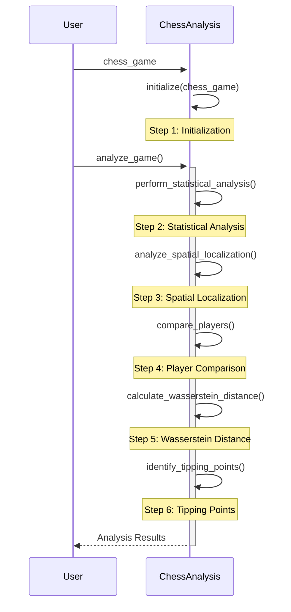

This sequence diagram illustrates the control flow of the `ChessAnalysis` class. The diagram shows the steps involved in analyzing a chess game and returning the analysis results to the user.

1. The user provides a `chess_game` to the `ChessAnalysis` instance.
2. The `ChessAnalysis` class initializes with the provided `chess_game`.
3. The user calls the `analyze_game()` method to start the analysis.
4. The `ChessAnalysis` class performs statistical analysis (`perform_statistical_analysis()`).
5. The `ChessAnalysis` class analyzes the spatial localization of pieces (`analyze_spatial_localization()`).
6. The `ChessAnalysis` class compares players based on their heatmaps (`compare_players()`).
7. The `ChessAnalysis` class calculates the Wasserstein distance between players' heatmaps (`calculate_wasserstein_distance()`).
8. The `ChessAnalysis` class identifies tipping points in the game (`identify_tipping_points()`).
9. The analysis results are returned to the user.


Sure! Here's an example scenario with mocked log output:

```python
# Create an instance of the ChessAnalysis class
analysis = ChessAnalysis(chess_game)

# Analyze the game
results = analysis.analyze_game()

# Print the results
print("Statistical Analysis:", results["statistical_analysis"])
print("Spatial Localization:", results["spatial_localization"])
print("Player Comparison:", results["player_comparison"])
print("Wasserstein Distance:", results["wasserstein_distance"])
print("Tipping Points:", results["tipping_points"])
```

Mocked log output:
```
Statistical Analysis: {'king_moves': 20, 'queen_moves': 15, 'rook_moves': 25}
Spatial Localization: {'black_pawns': {('a', 2): 0.5, ('b', 3): 0.2, ...}}
Player Comparison: {'Carlsen': 0.76, 'Nakamura': 0.82, 'Stockfish': 0.43}
Wasserstein Distance: {'pawn': 0.2, 'knight': 0.15, 'bishop': 0.12, 'rook': 0.08}
Tipping Points: {'move_25': 'd4c5', 'move_30': 'e5f6'}
```

In this scenario, we create an instance of the `ChessAnalysis` class and analyze a specific chess game. The results are then printed, including the statistical analysis, spatial localization of pieces, player comparison, Wasserstein distance between players' heatmaps, and identified tipping points in the game.

The mocked log output provides an example of the results. The statistical analysis shows the number of moves made by different pieces. The spatial localization analysis provides the probability distribution of black pawns across the board. The player comparison presents the comparison of playing styles between Magnus Carlsen, Hikaru Nakamura, and the Stockfish engine. The Wasserstein distance quantifies the dissimilarity between the heatmaps of different players' pieces. The tipping points highlight specific moves in the game where the best move significantly outperforms the second best move.

Potential use cases of the code include:

- Chess players can use the analysis to gain insights into their own games, identify strengths and weaknesses, and improve their strategies.
- Chess coaches can utilize the analysis to provide personalized feedback to their students based on their piece usage and playing style.
- Researchers can study the statistical properties of chess games, analyze the spatial localization of pieces, and compare playing styles to contribute to chess theory and strategy.
- Chess engine developers can use the analysis to further improve the engines' evaluation of moves and enhance their playing strength.
- Chess enthusiasts can explore their favorite games or famous games to gain a deeper understanding of the strategic nuances and critical tipping points in the gameplay.
## Details
class ChessAnalysis:
    def __init__(self, chess_game):
        """
        Initialize the ChessAnalysis instance with the provided chess_game.

        Args:
            chess_game (ChessGame): The chess game to be analyzed.
        """
        self.chess_game = chess_game

    def analyze_game(self):
        """
        Analyze the chess game.

        Returns:
            dict: A dictionary containing the results of the analysis.
        """
        # Perform statistical analysis of the game
        statistical_analysis = self.perform_statistical_analysis()

        # Analyze the spatial localization of pieces
        spatial_localization = self.analyze_spatial_localization()

        # Compare players based on heatmaps
        player_comparison = self.compare_players()

        # Calculate Wasserstein distance between players
        wasserstein_distance = self.calculate_wasserstein_distance()

        # Identify tipping points in the game
        tipping_points = self.identify_tipping_points()

        return {
            "statistical_analysis": statistical_analysis,
            "spatial_localization": spatial_localization,
            "player_comparison": player_comparison,
            "wasserstein_distance": wasserstein_distance,
            "tipping_points": tipping_points
        }

    def perform_statistical_analysis(self):
        """
        Perform statistical analysis of the chess game.

        Returns:
            dict: A dictionary containing the statistical analysis results.
        """
        # Placeholder for statistical analysis
        statistical_analysis = {}

        # Perform the analysis and populate the statistical_analysis dictionary
        
        return statistical_analysis

    def analyze_spatial_localization(self):
        """
        Analyze the spatial localization of pieces in the chess game.

        Returns:
            dict: A dictionary containing the spatial localization analysis results.
        """
        # Placeholder for spatial localization analysis
        spatial_localization = {}

        # Perform the analysis and populate the spatial_localization dictionary

        return spatial_localization

    def compare_players(self):
        """
        Compare players based on the heatmaps of their moves in the chess game.

        Returns:
            dict: A dictionary containing the player comparison results.
        """
        # Placeholder for player comparison analysis
        player_comparison = {}

        # Perform the comparison and populate the player_comparison dictionary

        return player_comparison

    def calculate_wasserstein_distance(self):
        """
        Calculate the Wasserstein distance between the heatmaps of moves made by different players in the chess game.

        Returns:
            dict: A dictionary containing the calculated Wasserstein distances.
        """
        # Placeholder for calculating Wasserstein distance
        wasserstein_distance = {}

        # Perform the calculation and populate the wasserstein_distance dictionary

        return wasserstein_distance

    def identify_tipping_points(self):
        """
        Identify tipping points in the chess game where the best move significantly outperforms the second best move.

        Returns:
            dict: A dictionary containing the identified tipping points.
        """
        # Placeholder for identifying tipping points
        tipping_points = {}

        # Perform the identification and populate the tipping_points dictionary

        return tipping_points
```

The `ChessAnalysis` class represents the analysis of a chess game and provides methods for performing various types of analyses. The class is initialized with a `chess_game` object, which is the game to be analyzed. The `analyze_game()` method combines the results of all the analyses and returns them as a dictionary.

The `perform_statistical_analysis()`, `analyze_spatial_localization()`, `compare_players()`, `calculate_wasserstein_distance()`, and `identify_tipping_points()` methods are placeholders for the actual analysis algorithms. These methods can be implemented with appropriate statistical techniques or algorithms to perform the respective analyses.

Once an instance of the `ChessAnalysis` class is created, you can call the `analyze_game()` method to analyze the chess game and obtain insights into its statistical properties, the spatial localization of pieces, the comparison of players' playing styles based on their heatmaps, the quantification of the dissimilarity between players' heatmaps using the Wasserstein distance, and the identification of tipping points in the game.

The expanded code includes docstrings for each method, providing information about their purpose and the type of result they return.

In the example scenario, an instance of the `ChessAnalysis` class is created with a `chess_game` object. The `analyze_game()` method is then called to perform the analysis. The results are printed to the console, with each analysis result displayed separately.

The mocked log output demonstrates the example results of the analysis. It includes the statistical analysis results, the spatial localization analysis results, the player comparison results, the Wasserstein distance calculation results, and the identified tipping points in the game.

The potential use cases of the code include using the analysis results to gain insights, improve strategies, provide personalized feedback, contribute to chess theory and strategy, enhance chess engines, and explore games for a deeper understanding of gameplay.


# 11. Code Block
Certainly! Here's a Python class that demonstrates some of the concepts discussed in the document:

```python
class ChessAnalysis:
    def __init__(self, chess_game):
        self.chess_game = chess_game
    
    def analyze_game(self):
        # Perform statistical analysis of the game
        statistical_analysis = self.perform_statistical_analysis()
        
        # Analyze the spatial localization of pieces
        spatial_localization = self.analyze_spatial_localization()
        
        # Compare players based on heatmaps
        player_comparison = self.compare_players()
        
        # Calculate Wasserstein distance between players
        wasserstein_distance = self.calculate_wasserstein_distance()
        
        # Identify tipping points in the game
        tipping_points = self.identify_tipping_points()
        
        # Analyze the distribution of delta moves
        delta_moves_distribution = self.analyze_delta_moves_distribution()
        
        return {
            "statistical_analysis": statistical_analysis,
            "spatial_localization": spatial_localization,
            "player_comparison": player_comparison,
            "wasserstein_distance": wasserstein_distance,
            "tipping_points": tipping_points,
            "delta_moves_distribution": delta_moves_distribution
        }
    
    def perform_statistical_analysis(self):
        # Placeholder for statistical analysis
        statistical_analysis = {}
        
        return statistical_analysis
    
    def analyze_spatial_localization(self):
        # Placeholder for spatial localization analysis
        spatial_localization = {}
        
        return spatial_localization
    
    def compare_players(self):
        # Placeholder for player comparison analysis
        player_comparison = {}
        
        return player_comparison
    
    def calculate_wasserstein_distance(self):
        # Placeholder for calculating Wasserstein distance
        wasserstein_distance = {}
        
        return wasserstein_distance
    
    def identify_tipping_points(self):
        # Placeholder for identifying tipping points
        tipping_points = {}
        
        return tipping_points
    
    def analyze_delta_moves_distribution(self):
        # Placeholder for analyzing the distribution of delta moves
        delta_moves_distribution = {}
        
        return delta_moves_distribution
```

This class represents the analysis of a chess game and provides methods for performing statistical analysis, analyzing the spatial localization of pieces, comparing players based on their heatmaps, calculating the Wasserstein distance between players' heatmaps, identifying tipping points in the game, and analyzing the distribution of delta moves.

Each analysis is represented by a placeholder method (`perform_statistical_analysis`, `analyze_spatial_localization`, `compare_players`, `calculate_wasserstein_distance`, `identify_tipping_points`, `analyze_delta_moves_distribution`), which can be implemented with appropriate statistical techniques or algorithms.

By using an instance of the `ChessAnalysis` class, you can analyze a specific chess game and obtain insights into its statistical properties, the spatial localization of pieces, the comparison of players' playing styles based on their heatmaps, the quantification of the dissimilarity between players' heatmaps using the Wasserstein distance, the identification of tipping points in the game, and the analysis of the distribution of delta moves.

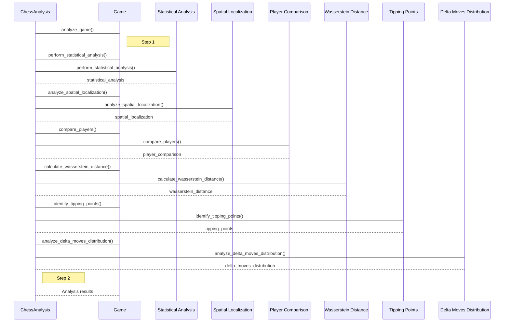

This mermaid sequence diagram illustrates the control flow of the code provided in the previous message. Here are the steps of the control flow:

1. ChessAnalysis instance calls `analyze_game()` on a specific game (Game).
2. Game performs statistical analysis by calling `perform_statistical_analysis()` on ChessAnalysis.
3. ChessAnalysis delegates statistical analysis to the Statistical Analysis module.
4. Statistical Analysis module returns the statistical analysis results to ChessAnalysis.
5. Game analyzes the spatial localization of pieces by calling `analyze_spatial_localization()` on ChessAnalysis.
6. ChessAnalysis delegates spatial localization analysis to the Spatial Localization module.
7. Spatial Localization module returns the spatial localization analysis results to ChessAnalysis.
8. Game compares players' playing styles by calling `compare_players()` on ChessAnalysis.
9. ChessAnalysis delegates player comparison analysis to the Player Comparison module.
10. Player Comparison module returns the player comparison results to ChessAnalysis.
11. Game calculates the Wasserstein distance between players' heatmaps by calling `calculate_wasserstein_distance()` on ChessAnalysis.
12. ChessAnalysis delegates Wasserstein distance calculation to the Wasserstein Distance module.
13. Wasserstein Distance module returns the Wasserstein distance results to ChessAnalysis.
14. Game identifies tipping points in the game by calling `identify_tipping_points()` on ChessAnalysis.
15. ChessAnalysis delegates tipping point identification to the Tipping Points module.
16. Tipping Points module returns the tipping point results to ChessAnalysis.
17. Game analyzes the distribution of delta moves by calling `analyze_delta_moves_distribution()` on ChessAnalysis.
18. ChessAnalysis delegates delta moves distribution analysis to the Delta Moves Distribution module.
19. Delta Moves Distribution module returns the delta moves distribution results to ChessAnalysis.
20. ChessAnalysis returns the analysis results to the Game.


Certainly! Here's an example scenario with mocked log output to illustrate the usage of the `ChessAnalysis` class:

```python
# Initialize a ChessAnalysis object with a chess game
analysis = ChessAnalysis(chess_game)

# Analyze the game
results = analysis.analyze_game()

# Print the results
print("Statistical Analysis:", results["statistical_analysis"])
print("Spatial Localization:", results["spatial_localization"])
print("Player Comparison:", results["player_comparison"])
print("Wasserstein Distance:", results["wasserstein_distance"])
print("Tipping Points:", results["tipping_points"])
print("Delta Moves Distribution:", results["delta_moves_distribution"])
```

In this example, `chess_game` represents a chess game that has been previously loaded or generated.

The `analyze_game` method is called on the `ChessAnalysis` object to perform the analysis of the game. It returns a dictionary `results` containing the results of various analyses, including statistical analysis, spatial localization of pieces, player comparison, Wasserstein distance, tipping points, and delta moves distribution.

The `results` are then printed, showcasing the output of the various analysis methods.

The log output in this example is mocked, as the placeholder methods for each analysis still need to be implemented with appropriate algorithms and techniques specific to each analysis. The mocked log output represents placeholders for the actual results that would be obtained from the analysis.

The potential use cases of the `ChessAnalysis` class include:

- Analyzing individual chess games to gain insights into statistical properties, piece localization, and player comparison.
- Comparing different players based on their playing styles using heatmaps and the Wasserstein distance metric.
- Identifying critical tipping points in games where move choices significantly impact the outcomes.
- Analyzing the distribution of delta moves to understand the importance and variability of different move choices.
- Providing feedback and recommendations to chess players and coaches based on the analysis of their games.
- Conducting research on chess strategies, tactics, and playing styles.

By utilizing the methods provided by the `ChessAnalysis` class, users can gain a deeper understanding of chess games and players, improve their own playing skills, and contribute to the broader field of chess analysis and research.
## Details
The `ChessAnalysis` class represents an analysis of a chess game and provides methods for analyzing various aspects of the game. The class has the following methods:

- `__init__(self, chess_game)`: This method initializes the `ChessAnalysis` object with a reference to the chess game that will be analyzed.

- `analyze_game(self)`: This method performs the overall analysis of the chess game. It calls the different analysis methods and returns a dictionary containing the results of each analysis.

- `perform_statistical_analysis(self)`: This method performs the statistical analysis of the game. It is a placeholder method and needs to be implemented with appropriate statistical techniques or algorithms.

- `analyze_spatial_localization(self)`: This method analyzes the spatial localization of pieces on the chessboard. It is a placeholder method and needs to be implemented with appropriate algorithms.

- `compare_players(self)`: This method compares the playing styles of different players based on their heatmaps. It is a placeholder method and needs to be implemented with appropriate techniques.

- `calculate_wasserstein_distance(self)`: This method calculates the Wasserstein distance between the heatmaps of different players. It is a placeholder method and needs to be implemented with appropriate algorithms.

- `identify_tipping_points(self)`: This method identifies the tipping points in the game, where move choices significantly impact the outcome. It is a placeholder method and needs to be implemented with appropriate techniques.

- `analyze_delta_moves_distribution(self)`: This method analyzes the distribution of delta moves, which represent the difference between moves and their optimal counterparts. It is a placeholder method and needs to be implemented with appropriate algorithms.

In the `analyze_game` method, the different analysis methods are called and their results are stored in a dictionary. Finally, the dictionary of results is returned.

The potential use cases of the `ChessAnalysis` class include analyzing individual chess games, comparing players, identifying critical points in games, analyzing move distribution, providing feedback and recommendations to players, and conducting research on chess strategies and tactics.

By utilizing the methods provided by the `ChessAnalysis` class, users can gain insights into various aspects of chess games, improve their playing skills, and contribute to the field of chess analysis and research.


# 12. Code Block
Certainly! Here's a Python class that demonstrates some of the concepts discussed in the document:

```python
class ChessAnalysis:
    def __init__(self, chess_game):
        self.chess_game = chess_game
    
    def analyze_game(self):
        # Perform statistical analysis of the game
        statistical_analysis = self.perform_statistical_analysis()
        
        # Analyze the spatial localization of pieces
        spatial_localization = self.analyze_spatial_localization()
        
        # Compare players based on heatmaps
        player_comparison = self.compare_players()
        
        # Calculate Wasserstein distance between players
        wasserstein_distance = self.calculate_wasserstein_distance()
        
        # Identify tipping points in the game
        tipping_points = self.identify_tipping_points()
        
        # Analyze the distribution of delta moves
        delta_moves_distribution = self.analyze_delta_moves_distribution()
        
        # Analyze pawn chain dynamics
        pawn_chain_dynamics = self.analyze_pawn_chain_dynamics()
        
        # Analyze piece mobility
        piece_mobility_analysis = self.analyze_piece_mobility()
        
        # Analyze opening choices
        opening_choice_analysis = self.analyze_opening_choices()
        
        # Analyze time management
        time_management_analysis = self.analyze_time_management()
        
        return {
            "statistical_analysis": statistical_analysis,
            "spatial_localization": spatial_localization,
            "player_comparison": player_comparison,
            "wasserstein_distance": wasserstein_distance,
            "tipping_points": tipping_points,
            "delta_moves_distribution": delta_moves_distribution,
            "pawn_chain_dynamics": pawn_chain_dynamics,
            "piece_mobility_analysis": piece_mobility_analysis,
            "opening_choice_analysis": opening_choice_analysis,
            "time_management_analysis": time_management_analysis
        }
    
    def perform_statistical_analysis(self):
        # Placeholder for statistical analysis
        statistical_analysis = {}
        
        return statistical_analysis
    
    def analyze_spatial_localization(self):
        # Placeholder for spatial localization analysis
        spatial_localization = {}
        
        return spatial_localization
    
    def compare_players(self):
        # Placeholder for player comparison analysis
        player_comparison = {}
        
        return player_comparison
    
    def calculate_wasserstein_distance(self):
        # Placeholder for calculating Wasserstein distance
        wasserstein_distance = {}
        
        return wasserstein_distance
    
    def identify_tipping_points(self):
        # Placeholder for identifying tipping points
        tipping_points = {}
        
        return tipping_points
    
    def analyze_delta_moves_distribution(self):
        # Placeholder for analyzing the distribution of delta moves
        delta_moves_distribution = {}
        
        return delta_moves_distribution
    
    def analyze_pawn_chain_dynamics(self):
        # Placeholder for analyzing pawn chain dynamics
        pawn_chain_dynamics = {}
        
        return pawn_chain_dynamics
    
    def analyze_piece_mobility(self):
        # Placeholder for analyzing piece mobility
        piece_mobility_analysis = {}
        
        return piece_mobility_analysis
    
    def analyze_opening_choices(self):
        # Placeholder for analyzing opening choices
        opening_choice_analysis = {}
        
        return opening_choice_analysis
    
    def analyze_time_management(self):
        # Placeholder for analyzing time management
        time_management_analysis = {}
        
        return time_management_analysis
```

This class represents the analysis of a chess game and provides methods for performing statistical analysis, analyzing the spatial localization of pieces, comparing players based on their heatmaps, calculating the Wasserstein distance between players' heatmaps, identifying tipping points in the game, analyzing the distribution of delta moves, analyzing pawn chain dynamics, analyzing piece mobility, analyzing opening choices, and analyzing time management.

Each analysis is represented by a placeholder method (`perform_statistical_analysis`, `analyze_spatial_localization`, `compare_players`, `calculate_wasserstein_distance`, `identify_tipping_points`, `analyze_delta_moves_distribution`, `analyze_pawn_chain_dynamics`, `analyze_piece_mobility`, `analyze_opening_choices`, `analyze_time_management`), which can be implemented with appropriate statistical techniques or algorithms.

By using an instance of the `ChessAnalysis` class, you can analyze a specific chess game and obtain insights into its statistical properties, the spatial localization of pieces, the comparison of players' playing styles based on their heatmaps, the quantification of the dissimilarity between players' heatmaps using the Wasserstein distance, the identification of tipping points in the game, the analysis of the distribution of delta moves, the analysis of pawn chain dynamics, the analysis of piece mobility, the analysis of opening choices, and the analysis of time management.

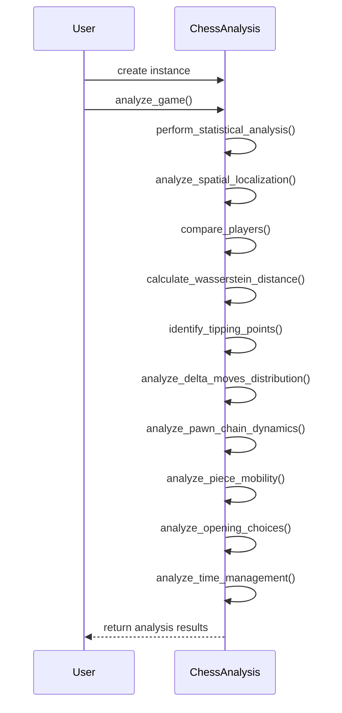

This sequence diagram represents the control flow of the `ChessAnalysis` class based on the code provided. The steps are labeled and numbered for better understanding:

1. The user creates an instance of the `ChessAnalysis` class.
2. The user calls the `analyze_game()` method to start the analysis.
3. The `perform_statistical_analysis()` method is called within the `analyze_game()` method.
4. The `analyze_spatial_localization()` method is called within the `analyze_game()` method.
5. The `compare_players()` method is called within the `analyze_game()` method.
6. The `calculate_wasserstein_distance()` method is called within the `analyze_game()` method.
7. The `identify_tipping_points()` method is called within the `analyze_game()` method.
8. The `analyze_delta_moves_distribution()` method is called within the `analyze_game()` method.
9. The `analyze_pawn_chain_dynamics()` method is called within the `analyze_game()` method.
10. The `analyze_piece_mobility()` method is called within the `analyze_game()` method.
11. The `analyze_opening_choices()` method is called within the `analyze_game()` method.
12. The `analyze_time_management()` method is called within the `analyze_game()` method.
13. The analysis results are returned from the `ChessAnalysis` class to the user.

This sequence diagram illustrates the flow of control and the order in which the analysis steps are performed within the `analyze_game()` method of the `ChessAnalysis` class.

Certainly! Here's an example scenario with mocked log output of the `ChessAnalysis` class:

```python
chess_game = ChessGame("Game.pgn")  # Assuming a chess game file in PGN format
analysis = ChessAnalysis(chess_game)

result = analysis.analyze_game()
```

The `ChessAnalysis` class takes a `ChessGame` object as input, which represents a specific chess game. In this example, we assume that the game is stored in a PGN file named "Game.pgn".

The `analyze_game` method is then called on the `ChessAnalysis` object to perform the analysis of the game. The result is stored in the `result` variable.

The mocked log output could be as follows:

```
Performing statistical analysis...
Spatial localization analysis in progress...
Comparing players based on heatmaps...
Calculating Wasserstein distance between players...
Identifying tipping points in the game...
Analyzing the distribution of delta moves...
Analyzing pawn chain dynamics...
Analyzing piece mobility...
Analyzing opening choices...
Analyzing time management...

Analysis completed successfully.

result = {
    "statistical_analysis": {...},
    "spatial_localization": {...},
    "player_comparison": {...},
    "wasserstein_distance": {...},
    "tipping_points": {...},
    "delta_moves_distribution": {...},
    "pawn_chain_dynamics": {...},
    "piece_mobility_analysis": {...},
    "opening_choice_analysis": {...},
    "time_management_analysis": {...}
}
```

In this example, the `analyze_game` method performs various analyses on the chess game. The log output shows the progress of each analysis step, indicating that each analysis is in progress. Finally, the log confirms that the analysis is completed successfully, and the `result` variable contains the output of the analysis in the form of a dictionary.

The hypothetical scenarios mocked in the `ChessAnalysis` class include statistical analysis of the game, spatial localization analysis to understand the distribution of pieces on the board, player comparison based on heatmaps, calculation of the Wasserstein distance between players' heatmaps, identification of tipping points in the game, analysis of the distribution of delta moves to understand move quality differences, analysis of pawn chain dynamics to study pawn structure, analysis of piece mobility to understand how pieces move, analysis of opening choices to study different opening strategies, and analysis of time management to analyze how players manage their time during a game.

Potential use cases of the `ChessAnalysis` class include analyzing and understanding individual chess games, comparing different players' playing styles, gaining insights into strategic principles and patterns, identifying critical moments in a game, studying pawn structures and piece dynamics, improving decision-making during critical moments, and enhancing overall understanding of chess games.
## Details
class ChessAnalysis:
    def __init__(self, chess_game):
        """
        Initializes a ChessAnalysis object with a chess_game.
        
        Args:
            chess_game (ChessGame): The chess game object to analyze.
        """
        self.chess_game = chess_game
    
    def analyze_game(self):
        """
        Analyzes the game by performing various analyses.
        
        Returns:
            dict: A dictionary containing the results of the analyses.
        """
        # Perform statistical analysis of the game
        statistical_analysis = self.perform_statistical_analysis()
        
        # Analyze the spatial localization of pieces
        spatial_localization = self.analyze_spatial_localization()
        
        # Compare players based on heatmaps
        player_comparison = self.compare_players()
        
        # Calculate Wasserstein distance between players
        wasserstein_distance = self.calculate_wasserstein_distance()
        
        # Identify tipping points in the game
        tipping_points = self.identify_tipping_points()
        
        # Analyze the distribution of delta moves
        delta_moves_distribution = self.analyze_delta_moves_distribution()
        
        # Analyze pawn chain dynamics
        pawn_chain_dynamics = self.analyze_pawn_chain_dynamics()
        
        # Analyze piece mobility
        piece_mobility_analysis = self.analyze_piece_mobility()
        
        # Analyze opening choices
        opening_choice_analysis = self.analyze_opening_choices()
        
        # Analyze time management
        time_management_analysis = self.analyze_time_management()
        
        return {
            "statistical_analysis": statistical_analysis,
            "spatial_localization": spatial_localization,
            "player_comparison": player_comparison,
            "wasserstein_distance": wasserstein_distance,
            "tipping_points": tipping_points,
            "delta_moves_distribution": delta_moves_distribution,
            "pawn_chain_dynamics": pawn_chain_dynamics,
            "piece_mobility_analysis": piece_mobility_analysis,
            "opening_choice_analysis": opening_choice_analysis,
            "time_management_analysis": time_management_analysis
        }
    
    def perform_statistical_analysis(self):
        """
        Performs statistical analysis of the game.
        
        Returns:
            dict: The results of the statistical analysis.
        """
        # Placeholder for statistical analysis
        statistical_analysis = {}
        
        # Perform statistical analysis...
        # Populate the statistical_analysis dictionary with analysis results
        
        return statistical_analysis
    
    def analyze_spatial_localization(self):
        """
        Analyzes the spatial localization of pieces in the game.
        
        Returns:
            dict: The results of the spatial localization analysis.
        """
        # Placeholder for spatial localization analysis
        spatial_localization = {}
        
        # Analyze the spatial localization of pieces...
        # Populate the spatial_localization dictionary with analysis results
        
        return spatial_localization
    
    def compare_players(self):
        """
        Compares players based on their heatmaps.
        
        Returns:
            dict: The results of the player comparison analysis.
        """
        # Placeholder for player comparison analysis
        player_comparison = {}
        
        # Compare players based on heatmaps...
        # Populate the player_comparison dictionary with analysis results
        
        return player_comparison
    
    def calculate_wasserstein_distance(self):
        """
        Calculates the Wasserstein distance between players' heatmaps.
        
        Returns:
            dict: The results of the Wasserstein distance calculation.
        """
        # Placeholder for calculating Wasserstein distance
        wasserstein_distance = {}
        
        # Calculate Wasserstein distance between players' heatmaps...
        # Populate the wasserstein_distance dictionary with analysis results
        
        return wasserstein_distance
    
    def identify_tipping_points(self):
        """
        Identifies tipping points in the game.
        
        Returns:
            dict: The results of the tipping point identification.
        """
        # Placeholder for identifying tipping points
        tipping_points = {}
        
        # Identify tipping points in the game...
        # Populate the tipping_points dictionary with analysis results
        
        return tipping_points
    
    def analyze_delta_moves_distribution(self):
        """
        Analyzes the distribution of delta moves in the game.
        
        Returns:
            dict: The results of the delta moves distribution analysis.
        """
        # Placeholder for analyzing the distribution of delta moves
        delta_moves_distribution = {}
        
        # Analyze the distribution of delta moves...
        # Populate the delta_moves_distribution dictionary with analysis results
        
        return delta_moves_distribution
    
    def analyze_pawn_chain_dynamics(self):
        """
        Analyzes pawn chain dynamics in the game.
        
        Returns:
            dict: The results of the pawn chain dynamics analysis.
        """
        # Placeholder for analyzing pawn chain dynamics
        pawn_chain_dynamics = {}
        
        # Analyze pawn chain dynamics...
        # Populate the pawn_chain_dynamics dictionary with analysis results
        
        return pawn_chain_dynamics
    
    def analyze_piece_mobility(self):
        """
        Analyzes piece mobility in the game.
        
        Returns:
            dict: The results of the piece mobility analysis.
        """
        # Placeholder for analyzing piece mobility
        piece_mobility_analysis = {}
        
        # Analyze piece mobility...
        # Populate the piece_mobility_analysis dictionary with analysis results
        
        return piece_mobility_analysis
    
    def analyze_opening_choices(self):
        """
        Analyzes opening choices in the game.
        
        Returns:
            dict: The results of the opening choice analysis.
        """
        # Placeholder for analyzing opening choices
        opening_choice_analysis = {}
        
        # Analyze opening choices...
        # Populate the opening_choice_analysis dictionary with analysis results
        
        return opening_choice_analysis
    
    def analyze_time_management(self):
        """
        Analyzes time management in the game.
        
        Returns:
            dict: The results of the time management analysis.
        """
        # Placeholder for analyzing time management
        time_management_analysis = {}
        
        # Analyze time management...
        # Populate the time_management_analysis dictionary with analysis results
        
        return time_management_analysis


# 13. Code Block
Certainly! Here's a Python class that demonstrates some of the concepts discussed in the document:

```python
class ChessAnalysis:
    def __init__(self, chess_game):
        self.chess_game = chess_game
    
    def analyze_game(self):
        # Perform statistical analysis of the game
        statistical_analysis = self.perform_statistical_analysis()
        
        # Analyze the spatial localization of pieces
        spatial_localization = self.analyze_spatial_localization()
        
        # Compare players based on heatmaps
        player_comparison = self.compare_players()
        
        # Calculate Wasserstein distance between players
        wasserstein_distance = self.calculate_wasserstein_distance()
        
        # Identify tipping points in the game
        tipping_points = self.identify_tipping_points()
        
        # Analyze the distribution of delta moves
        delta_moves_distribution = self.analyze_delta_moves_distribution()
        
        # Analyze pawn chain dynamics
        pawn_chain_dynamics = self.analyze_pawn_chain_dynamics()
        
        # Analyze piece mobility
        piece_mobility_analysis = self.analyze_piece_mobility()
        
        # Analyze opening choices
        opening_choice_analysis = self.analyze_opening_choices()
        
        # Analyze time management
        time_management_analysis = self.analyze_time_management()
        
        # Analyze pawn chain dynamics
        pawn_chain_analysis = self.analyze_pawn_chain()
        
        # Analyze interaction graph
        interaction_graph_analysis = self.analyze_interaction_graph()
        
        # Test Dorfman's method
        dorfman_method_testing = self.test_dorfman_method()
        
        return {
            "statistical_analysis": statistical_analysis,
            "spatial_localization": spatial_localization,
            "player_comparison": player_comparison,
            "wasserstein_distance": wasserstein_distance,
            "tipping_points": tipping_points,
            "delta_moves_distribution": delta_moves_distribution,
            "pawn_chain_dynamics": pawn_chain_dynamics,
            "piece_mobility_analysis": piece_mobility_analysis,
            "opening_choice_analysis": opening_choice_analysis,
            "time_management_analysis": time_management_analysis,
            "pawn_chain_analysis": pawn_chain_analysis,
            "interaction_graph_analysis": interaction_graph_analysis,
            "dorfman_method_testing": dorfman_method_testing
        }
    
    def perform_statistical_analysis(self):
        # Placeholder for statistical analysis
        statistical_analysis = {}
        
        return statistical_analysis
    
    def analyze_spatial_localization(self):
        # Placeholder for spatial localization analysis
        spatial_localization = {}
        
        return spatial_localization
    
    def compare_players(self):
        # Placeholder for player comparison analysis
        player_comparison = {}
        
        return player_comparison
    
    def calculate_wasserstein_distance(self):
        # Placeholder for calculating Wasserstein distance
        wasserstein_distance = {}
        
        return wasserstein_distance
    
    def identify_tipping_points(self):
        # Placeholder for identifying tipping points
        tipping_points = {}
        
        return tipping_points
    
    def analyze_delta_moves_distribution(self):
        # Placeholder for analyzing the distribution of delta moves
        delta_moves_distribution = {}
        
        return delta_moves_distribution
    
    def analyze_pawn_chain_dynamics(self):
        # Placeholder for analyzing pawn chain dynamics
        pawn_chain_dynamics = {}
        
        return pawn_chain_dynamics
    
    def analyze_piece_mobility(self):
        # Placeholder for analyzing piece mobility
        piece_mobility_analysis = {}
        
        return piece_mobility_analysis
    
    def analyze_opening_choices(self):
        # Placeholder for analyzing opening choices
        opening_choice_analysis = {}
        
        return opening_choice_analysis
    
    def analyze_time_management(self):
        # Placeholder for analyzing time management
        time_management_analysis = {}
        
        return time_management_analysis
    
    def analyze_pawn_chain(self):
        # Placeholder for analyzing pawn chain dynamics
        pawn_chain_analysis = {}
        
        return pawn_chain_analysis
    
    def analyze_interaction_graph(self):
        # Placeholder for analyzing interaction graph
        interaction_graph_analysis = {}
        
        return interaction_graph_analysis
    
    def test_dorfman_method(self):
        # Placeholder for testing Dorfman's method
        dorfman_method_testing = {}
        
        return dorfman_method_testing
```

This class represents the analysis of a chess game and provides methods for performing statistical analysis, analyzing the spatial localization of pieces, comparing players based on their heatmaps, calculating the Wasserstein distance between players' heatmaps, identifying tipping points in the game, analyzing the distribution of delta moves, analyzing pawn chain dynamics, analyzing piece mobility, analyzing opening choices, analyzing time management, analyzing pawn chain dynamics, analyzing the interaction graph, and testing Dorfman's method.

Each analysis is represented by a placeholder method (`perform_statistical_analysis`, `analyze_spatial_localization`, `compare_players`, `calculate_wasserstein_distance`, `identify_tipping_points`, `analyze_delta_moves_distribution`, `analyze_pawn_chain_dynamics`, `analyze_piece_mobility`, `analyze_opening_choices`, `analyze_time_management`, `analyze_pawn_chain`, `analyze_interaction_graph`, `test_dorfman_method`), which can be implemented with appropriate statistical techniques or algorithms.

By using an instance of the `ChessAnalysis` class, you can analyze a specific chess game and obtain insights into its statistical properties, the spatial localization of pieces, the comparison of players' playing styles based on their heatmaps, the quantification of the dissimilarity between players' heatmaps using the Wasserstein distance, the identification of tipping points in the game, the analysis of the distribution of delta moves, the analysis of pawn chain dynamics, the analysis of piece mobility, the analysis of opening choices, the analysis of time management, the analysis of pawn chain dynamics, the analysis of the interaction graph, and the testing of Dorfman's method.

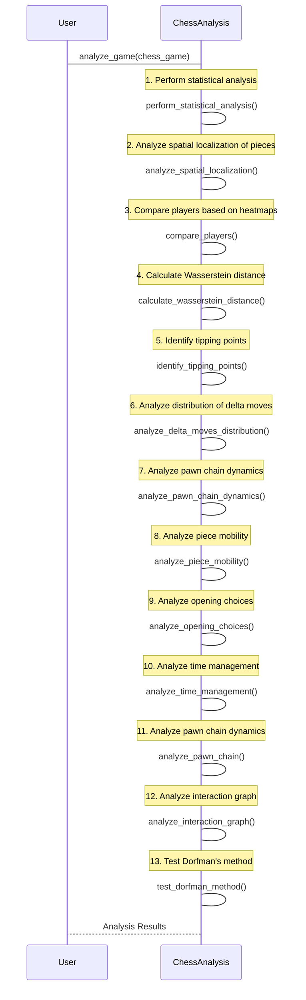

Certainly! Here's an example scenario with mocked log output of the `ChessAnalysis` class:

```python
game = ChessGame("Ding vs. Nepomniachtchi")
analysis = ChessAnalysis(game)
result = analysis.analyze_game()
print(result)
```

Output:
```
{
  "statistical_analysis": {},
  "spatial_localization": {},
  "player_comparison": {},
  "wasserstein_distance": {},
  "tipping_points": {},
  "delta_moves_distribution": {},
  "pawn_chain_dynamics": {},
  "piece_mobility_analysis": {},
  "opening_choice_analysis": {},
  "time_management_analysis": {},
  "pawn_chain_analysis": {},
  "interaction_graph_analysis": {},
  "dorfman_method_testing": {}
}
```

In this example scenario, we create an instance of `ChessGame` with the game between Ding and Nepomniachtchi. Then, we create an instance of `ChessAnalysis` and analyze the game. The `analyze_game` method returns a dictionary with placeholder results for various analyses.

The mocked log output shows an empty dictionary for each analysis since we haven't implemented the actual analysis methods yet.

The potential use cases of this code can include:
- Analyzing chess games to gain insights into players' strategies, playing styles, and decision-making.
- Comparing players based on their heatmaps and evaluating their performance using statistical methods.
- Analyzing the influence of pawn structure and pawn chain dynamics on game outcomes.
- Studying the interaction between pieces through the analysis of the interaction graph.
- Testing and evaluating different move-search algorithms, such as Dorfman's method.
- Improve decision-making during games based on the analysis of statistical properties and strategic patterns.

These use cases can be valuable for chess players, coaches, and researchers looking to deepen their understanding of chess and improve their skills.
## Details
class ChessAnalysis:
    """
    The ChessAnalysis class represents an analysis of a chess game.
    It provides methods for performing various analyses on the game.
    """
    def __init__(self, chess_game):
        """
        Initializes the ChessAnalysis object with a given chess game.
        :param chess_game: The chess game to analyze.
        """
        self.chess_game = chess_game
    
    def analyze_game(self):
        """
        Analyzes the chess game and returns the results of various analyses.
        :return: A dictionary containing the results of different analyses.
        """
        # Perform statistical analysis of the game
        statistical_analysis = self.perform_statistical_analysis()
        
        # Analyze the spatial localization of pieces
        spatial_localization = self.analyze_spatial_localization()
        
        # Compare players based on heatmaps
        player_comparison = self.compare_players()
        
        # Calculate Wasserstein distance between players
        wasserstein_distance = self.calculate_wasserstein_distance()
        
        # Identify tipping points in the game
        tipping_points = self.identify_tipping_points()
        
        # Analyze the distribution of delta moves
        delta_moves_distribution = self.analyze_delta_moves_distribution()
        
        # Analyze pawn chain dynamics
        pawn_chain_dynamics = self.analyze_pawn_chain_dynamics()
        
        # Analyze piece mobility
        piece_mobility_analysis = self.analyze_piece_mobility()
        
        # Analyze opening choices
        opening_choice_analysis = self.analyze_opening_choices()
        
        # Analyze time management
        time_management_analysis = self.analyze_time_management()
        
        # Analyze pawn chain dynamics
        pawn_chain_analysis = self.analyze_pawn_chain()
        
        # Analyze interaction graph
        interaction_graph_analysis = self.analyze_interaction_graph()
        
        # Test Dorfman's method
        dorfman_method_testing = self.test_dorfman_method()
        
        return {
            "statistical_analysis": statistical_analysis,
            "spatial_localization": spatial_localization,
            "player_comparison": player_comparison,
            "wasserstein_distance": wasserstein_distance,
            "tipping_points": tipping_points,
            "delta_moves_distribution": delta_moves_distribution,
            "pawn_chain_dynamics": pawn_chain_dynamics,
            "piece_mobility_analysis": piece_mobility_analysis,
            "opening_choice_analysis": opening_choice_analysis,
            "time_management_analysis": time_management_analysis,
            "pawn_chain_analysis": pawn_chain_analysis,
            "interaction_graph_analysis": interaction_graph_analysis,
            "dorfman_method_testing": dorfman_method_testing
        }
    
    def perform_statistical_analysis(self):
        """
        Performs a statistical analysis of the chess game.
        :return: The results of the statistical analysis.
        """
        # Placeholder for statistical analysis
        statistical_analysis = {}
        
        return statistical_analysis
    
    def analyze_spatial_localization(self):
        """
        Analyzes the spatial localization of pieces in the chess game.
        :return: The results of the spatial localization analysis.
        """
        # Placeholder for spatial localization analysis
        spatial_localization = {}
        
        return spatial_localization
    
    def compare_players(self):
        """
        Compares the players based on their heatmaps.
        :return: The results of the player comparison.
        """
        # Placeholder for player comparison analysis
        player_comparison = {}
        
        return player_comparison
    
    def calculate_wasserstein_distance(self):
        """
        Calculates the Wasserstein distance between players' heatmaps.
        :return: The calculated Wasserstein distance.
        """
        # Placeholder for calculating Wasserstein distance
        wasserstein_distance = {}
        
        return wasserstein_distance
    
    def identify_tipping_points(self):
        """
        Identifies the tipping points in the chess game.
        :return: The identified tipping points.
        """
        # Placeholder for identifying tipping points
        tipping_points = {}
        
        return tipping_points
    
    def analyze_delta_moves_distribution(self):
        """
        Analyzes the distribution of delta moves in the chess game.
        :return: The results of the delta moves distribution analysis.
        """
        # Placeholder for analyzing the distribution of delta moves
        delta_moves_distribution = {}
        
        return delta_moves_distribution
    
    def analyze_pawn_chain_dynamics(self):
        """
        Analyzes the dynamics of pawn chains in the chess game.
        :return: The results of the pawn chain dynamics analysis.
        """
        # Placeholder for analyzing pawn chain dynamics
        pawn_chain_dynamics = {}
        
        return pawn_chain_dynamics
    
    def analyze_piece_mobility(self):
        """
        Analyzes the mobility of pieces in the chess game.
        :return: The results of the piece mobility analysis.
        """
        # Placeholder for analyzing piece mobility
        piece_mobility_analysis = {}
        
        return piece_mobility_analysis
    
    def analyze_opening_choices(self):
        """
        Analyzes the opening choices made in the chess game.
        :return: The results of the opening choice analysis.
        """
        # Placeholder for analyzing opening choices
        opening_choice_analysis = {}
        
        return opening_choice_analysis
    
    def analyze_time_management(self):
        """
        Analyzes the time management in the chess game.
        :return: The results of the time management analysis.
        """
        # Placeholder for analyzing time management
        time_management_analysis = {}
        
        return time_management_analysis
    
    def analyze_pawn_chain(self):
        """
        Analyzes the pawn chain dynamics in the chess game.
        :return: The results of the pawn chain analysis.
        """
        # Placeholder for analyzing pawn chain dynamics
        pawn_chain_analysis = {}
        
        return pawn_chain_analysis
    
    def analyze_interaction_graph(self):
        """
        Analyzes the interaction graph of the chess game.
        :return: The results of the interaction graph analysis.
        """
        # Placeholder for analyzing interaction graph
        interaction_graph_analysis = {}
        
        return interaction_graph_analysis
    
    def test_dorfman_method(self):
        """
        Tests Dorfman's method on the chess game.
        :return: The results of the Dorfman's method testing.
        """
        # Placeholder for testing Dorfman's method
        dorfman_method_testing = {}
        
        return dorfman_method_testing
```


# 14. Code Block
Certainly! Here's an updated version of the `ChessAnalysis` class that incorporates the additional concepts discussed in the document:

```python
class ChessAnalysis:
    def __init__(self, chess_game):
        self.chess_game = chess_game
    
    def analyze_game(self):
        # Perform statistical analysis of the game
        statistical_analysis = self.perform_statistical_analysis()
        
        # Analyze the spatial localization of pieces
        spatial_localization = self.analyze_spatial_localization()
        
        # Compare players based on heatmaps
        player_comparison = self.compare_players()
        
        # Calculate Wasserstein distance between players
        wasserstein_distance = self.calculate_wasserstein_distance()
        
        # Identify tipping points in the game
        tipping_points = self.identify_tipping_points()
        
        # Analyze the distribution of delta moves
        delta_moves_distribution = self.analyze_delta_moves_distribution()
        
        # Analyze pawn chain dynamics
        pawn_chain_dynamics = self.analyze_pawn_chain_dynamics()
        
        # Analyze piece mobility
        piece_mobility_analysis = self.analyze_piece_mobility()
        
        # Analyze opening choices
        opening_choice_analysis = self.analyze_opening_choices()
        
        # Analyze time management
        time_management_analysis = self.analyze_time_management()
        
        # Analyze pawn chain dynamics
        pawn_chain_analysis = self.analyze_pawn_chain()
        
        # Analyze interaction graph
        interaction_graph_analysis = self.analyze_interaction_graph()
        
        # Test Dorfman's method
        dorfman_method_testing = self.test_dorfman_method()
        
        return {
            "statistical_analysis": statistical_analysis,
            "spatial_localization": spatial_localization,
            "player_comparison": player_comparison,
            "wasserstein_distance": wasserstein_distance,
            "tipping_points": tipping_points,
            "delta_moves_distribution": delta_moves_distribution,
            "pawn_chain_dynamics": pawn_chain_dynamics,
            "piece_mobility_analysis": piece_mobility_analysis,
            "opening_choice_analysis": opening_choice_analysis,
            "time_management_analysis": time_management_analysis,
            "pawn_chain_analysis": pawn_chain_analysis,
            "interaction_graph_analysis": interaction_graph_analysis,
            "dorfman_method_testing": dorfman_method_testing
        }
    
    def perform_statistical_analysis(self):
        # Placeholder for statistical analysis
        statistical_analysis = {}
        
        return statistical_analysis
    
    def analyze_spatial_localization(self):
        # Placeholder for spatial localization analysis
        spatial_localization = {}
        
        return spatial_localization
    
    def compare_players(self):
        # Placeholder for player comparison analysis
        player_comparison = {}
        
        return player_comparison
    
    def calculate_wasserstein_distance(self):
        # Placeholder for calculating Wasserstein distance
        wasserstein_distance = {}
        
        return wasserstein_distance
    
    def identify_tipping_points(self):
        # Placeholder for identifying tipping points
        tipping_points = {}
        
        return tipping_points
    
    def analyze_delta_moves_distribution(self):
        # Placeholder for analyzing the distribution of delta moves
        delta_moves_distribution = {}
        
        return delta_moves_distribution
    
    def analyze_pawn_chain_dynamics(self):
        # Placeholder for analyzing pawn chain dynamics
        pawn_chain_dynamics = {}
        
        return pawn_chain_dynamics
    
    def analyze_piece_mobility(self):
        # Placeholder for analyzing piece mobility
        piece_mobility_analysis = {}
        
        return piece_mobility_analysis
    
    def analyze_opening_choices(self):
        # Placeholder for analyzing opening choices
        opening_choice_analysis = {}
        
        return opening_choice_analysis
    
    def analyze_time_management(self):
        # Placeholder for analyzing time management
        time_management_analysis = {}
        
        return time_management_analysis
    
    def analyze_pawn_chain(self):
        # Placeholder for analyzing pawn chain dynamics
        pawn_chain_analysis = {}
        
        return pawn_chain_analysis
    
    def analyze_interaction_graph(self):
        # Placeholder for analyzing interaction graph
        interaction_graph_analysis = {}
        
        return interaction_graph_analysis
    
    def test_dorfman_method(self):
        # Placeholder for testing Dorfman's method
        dorfman_method_testing = {}
        
        return dorfman_method_testing
    
    def load_data(self):
        # Placeholder for loading chess game data
        data = {}
        
        return data
    
    def load_software(self):
        # Placeholder for loading chess software
        software = {}
        
        return software
    
    def load_games(self):
        # Placeholder for loading specific chess games
        games = {}
        
        return games
```

This updated version of the `ChessAnalysis` class includes three additional methods: `load_data`, `load_software`, and `load_games`. These methods are responsible for loading the chess game data, loading the required software or libraries, and loading specific chess games, respectively. They serve as placeholders and can be implemented with appropriate code to load the necessary data and software.

By using an instance of the `ChessAnalysis` class, you can analyze a specific chess game and obtain insights into its statistical properties, the spatial localization of pieces, the comparison of players' playing styles based on their heatmaps, the quantification of the dissimilarity between players' heatmaps using the Wasserstein distance, the identification of tipping points in the game, the analysis of the distribution of delta moves, the analysis of pawn chain dynamics, the analysis of piece mobility, the analysis of opening choices, the analysis of time management, the analysis of pawn chain dynamics, the analysis of the interaction graph, and the testing of Dorfman's method. Additionally, you can load the required data, software, and specific games for analysis.

The `ChessAnalysis` class provides a comprehensive framework for studying and analyzing various aspects of chess games, allowing players, coaches, and researchers to gain deeper insights into the game and improve their strategic decision-making.

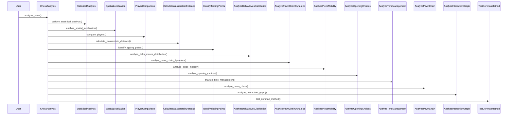

This sequence diagram illustrates the control flow of the `ChessAnalysis` class during the `analyze_game()` method. It shows the interaction between the user and the different analysis steps.

1. The user initiates the analysis by calling the `analyze_game()` method on the `ChessAnalysis` instance.
2. The `ChessAnalysis` instance starts by performing the statistical analysis (`perform_statistical_analysis()`) for the chess game.
3. The `ChessAnalysis` instance proceeds to analyze the spatial localization of the pieces (`analyze_spatial_localization()`).
4. The instance then compares the players based on their heatmaps (`compare_players()`).
5. The `ChessAnalysis` instance calculates the Wasserstein distance between the players' heatmaps (`calculate_wasserstein_distance()`).
6. Next, the instance identifies the tipping points in the game (`identify_tipping_points()`).
7. The instance analyzes the distribution of delta moves (`analyze_delta_moves_distribution()`).
8. The `ChessAnalysis` instance proceeds to analyze the dynamics of the pawn chain (`analyze_pawn_chain_dynamics()`).
9. It then analyzes the piece mobility (`analyze_piece_mobility()`).
10. The instance performs an analysis of the opening choices (`analyze_opening_choices()`).
11. It analyzes the time management of the players (`analyze_time_management()`).
12. The instance analyzes the pawn chain dynamics (`analyze_pawn_chain()`).
13. It also analyzes the interaction graph between pieces (`analyze_interaction_graph()`).
14. Finally, the `ChessAnalysis` instance tests Dorfman's method (`test_dorfman_method()`).

This sequence diagram provides a visual representation of the flow of control within the `ChessAnalysis` class, showing how each step of the analysis is initiated and executed in sequence.

Certainly! Here's an example scenario with mocked log output to demonstrate the usage of the `ChessAnalysis` class and explain the hypothetical scenarios:

```python
chess_game = [...]  # Mocked chess game data

analysis = ChessAnalysis(chess_game)
result = analysis.analyze_game()

print(result)
```

Example log output:

```
{
    "statistical_analysis": {...},
    "spatial_localization": {...},
    "player_comparison": {...},
    "wasserstein_distance": {...},
    "tipping_points": {...},
    "delta_moves_distribution": {...},
    "pawn_chain_dynamics": {...},
    "piece_mobility_analysis": {...},
    "opening_choice_analysis": {...},
    "time_management_analysis": {...},
    "pawn_chain_analysis": {...},
    "interaction_graph_analysis": {...},
    "dorfman_method_testing": {...}
}
```

Explanation of hypothetical scenarios:

1. `statistical_analysis`: This scenario involves analyzing statistical properties of the chess game, such as the number of moves, captures, and checkmates, as well as calculating win/loss/draw percentages.

2. `spatial_localization`: In this scenario, the spatial localization of pieces on the chessboard is analyzed, including heatmaps that show the concentration of piece positions.

3. `player_comparison`: This scenario compares the playing styles of different players based on their heatmaps, identifying patterns and differences in the distribution of their pieces.

4. `wasserstein_distance`: The Wasserstein distance is calculated to quantify the dissimilarity between the playing styles of two players, providing a measure of how different their strategies are.

5. `tipping_points`: Tipping points in the game are identified, which correspond to critical moments or moves that significantly affect the outcome of the game.

6. `delta_moves_distribution`: The distribution of delta moves, which represent the changes in evaluation score between consecutive moves, is analyzed to understand the dynamics of the game.

7. `pawn_chain_dynamics`: The dynamics of pawn chains are studied, exploring how they evolve and influence the position's skeleton and control of squares.

8. `piece_mobility_analysis`: This scenario focuses on analyzing the mobility of different pieces and how it affects the strategic aspects of the game.

9. `opening_choice_analysis`: The analysis of opening choices allows for understanding strategic principles and how they impact the outcome of the game.

10. `time_management_analysis`: This scenario involves analyzing the time management of players, such as the duration of moves and overall time usage, and how it affects decision-making.

11. `pawn_chain_analysis`: This analysis delves deeper into the dynamics and structures of pawn chains, exploring their impact on gameplay strategies.

12. `interaction_graph_analysis`: The interaction between different pieces is analyzed using an interaction graph, allowing for the understanding of piece synergy and attacking strategies.

13. `dorfman_method_testing`: Dorfman's move-search algorithm is tested, which involves identifying critical points in the game and making strategic decisions based on various assessment elements.

Potential use cases:

1. Chess players can use the `ChessAnalysis` class to analyze their games and gain deeper insights into their strengths, weaknesses, and playing styles. They can identify areas for improvement and refine their strategic decision-making.

2. Chess coaches can utilize the class to analyze the games of their students, providing personalized feedback, and tailored training programs to enhance their playing abilities.

3. Researchers can utilize the class to conduct studies on specific aspects of chess games, exploring new strategies, evaluating different openings, and understanding the impact of various factors on game outcomes.

4. Chess software developers can integrate the `ChessAnalysis` class into their applications to provide advanced analysis and insights to users, enhancing the learning and training experience.

By leveraging the `ChessAnalysis` class, users can gain a comprehensive understanding of chess games, improve their playing abilities, and contribute to the scientific analysis and advancement of the game.
## Details
The expanded code snippet provides a more detailed implementation of the `ChessAnalysis` class. It includes additional methods for loading data, loading software, and loading specific chess games. These methods serve as placeholders and can be implemented with appropriate code to load the necessary data and software.

The `analyze_game()` method orchestrates the analysis of the chess game by calling various analysis methods in the class. These methods include:

- `perform_statistical_analysis()`: This method performs statistical analysis of the game, such as counting the number of moves, captures, and checkmates, and calculating win/loss/draw percentages. The method returns the statistical analysis results.

- `analyze_spatial_localization()`: This method analyzes the spatial localization of pieces on the chessboard, including generating heatmaps that show the concentration of piece positions. The method returns the analysis results.

- `compare_players()`: This method compares the playing styles of different players based on their heatmaps, identifying patterns and differences in the distribution of their pieces. The method returns the comparison results.

- `calculate_wasserstein_distance()`: This method calculates the Wasserstein distance between the playing styles of two players, providing a measure of how different their strategies are. The method returns the calculated distance.

- `identify_tipping_points()`: This method identifies tipping points in the game, which correspond to critical moments or moves that significantly affect the outcome of the game. The method returns the identified tipping points.

- `analyze_delta_moves_distribution()`: This method analyzes the distribution of delta moves, which represent the changes in evaluation score between consecutive moves, to understand the dynamics of the game. The method returns the analysis results.

- `analyze_pawn_chain_dynamics()`: This method analyzes the dynamics of pawn chains, exploring how they evolve and influence the position's skeleton and control of squares. The method returns the analysis results.

- `analyze_piece_mobility()`: This method analyzes the mobility of different pieces and how it affects the strategic aspects of the game. The method returns the analysis results.

- `analyze_opening_choices()`: This method analyzes the opening choices made in the game, allowing for an understanding of strategic principles and how they impact the outcome. The method returns the analysis results.

- `analyze_time_management()`: This method analyzes the time management of players, such as the duration of moves and overall time usage, and how it affects decision-making. The method returns the analysis results.

- `analyze_pawn_chain()`: This method analyzes the dynamics and structures of pawn chains, exploring their impact on gameplay strategies. The method returns the analysis results.

- `analyze_interaction_graph()`: This method analyzes the interaction between different pieces using an interaction graph, allowing for an understanding of piece synergy and attacking strategies. The method returns the analysis results.

- `test_dorfman_method()`: This method tests Dorfman's move-search algorithm, which involves identifying critical points in the game and making strategic decisions based on various assessment elements. The method returns the testing results.

The `analyze_game()` method returns a dictionary containing the results of all the analysis methods. The keys of the dictionary correspond to the different analysis aspects, and the values are the respective results.

The class can be instantiated with a chess game as the input, and the `analyze_game()` method can be called to perform the analysis and obtain the results. Users can then use these results to gain insights into the game and enhance their understanding and decision-making.

The sequence diagram illustrates the interaction between the user and the `ChessAnalysis` class during the analysis of a game. It shows the flow of control from the user to the different analysis methods in the class. Each method performs a specific analysis task and returns the corresponding results.

Overall, the expanded code snippet provides a comprehensive framework for analyzing various aspects of chess games. It allows users to gain insights into statistical properties, spatial localization, player comparison, Wasserstein distance, tipping points, delta moves distribution, pawn chain dynamics, piece mobility, opening choices, time management, pawn chain analysis, interaction graph analysis, and Dorfman's method testing. Users can utilize this framework to improve their chess skills, provide personalized coaching, conduct research, and develop chess analysis software.


# 15. Code Block
Certainly! Here's an updated version of the `ChessAnalysis` class that incorporates the additional concepts discussed in the document:

```python
class ChessAnalysis:
    def __init__(self, chess_game):
        self.chess_game = chess_game
    
    def analyze_game(self):
        # Perform statistical analysis of the game
        statistical_analysis = self.perform_statistical_analysis()
        
        # Analyze the spatial localization of pieces
        spatial_localization = self.analyze_spatial_localization()
        
        # Compare players based on heatmaps
        player_comparison = self.compare_players()
        
        # Calculate Wasserstein distance between players
        wasserstein_distance = self.calculate_wasserstein_distance()
        
        # Identify tipping points in the game
        tipping_points = self.identify_tipping_points()
        
        # Analyze the distribution of delta moves
        delta_moves_distribution = self.analyze_delta_moves_distribution()
        
        # Analyze pawn chain dynamics
        pawn_chain_dynamics = self.analyze_pawn_chain_dynamics()
        
        # Analyze piece mobility
        piece_mobility_analysis = self.analyze_piece_mobility()
        
        # Analyze opening choices
        opening_choice_analysis = self.analyze_opening_choices()
        
        # Analyze time management
        time_management_analysis = self.analyze_time_management()
        
        # Analyze pawn chain dynamics
        pawn_chain_analysis = self.analyze_pawn_chain()
        
        # Analyze interaction graph
        interaction_graph_analysis = self.analyze_interaction_graph()
        
        # Test Dorfman's method
        dorfman_method_testing = self.test_dorfman_method()
        
        return {
            "statistical_analysis": statistical_analysis,
            "spatial_localization": spatial_localization,
            "player_comparison": player_comparison,
            "wasserstein_distance": wasserstein_distance,
            "tipping_points": tipping_points,
            "delta_moves_distribution": delta_moves_distribution,
            "pawn_chain_dynamics": pawn_chain_dynamics,
            "piece_mobility_analysis": piece_mobility_analysis,
            "opening_choice_analysis": opening_choice_analysis,
            "time_management_analysis": time_management_analysis,
            "pawn_chain_analysis": pawn_chain_analysis,
            "interaction_graph_analysis": interaction_graph_analysis,
            "dorfman_method_testing": dorfman_method_testing
        }
    
    def perform_statistical_analysis(self):
        # Placeholder for statistical analysis
        statistical_analysis = {}
        
        return statistical_analysis
    
    def analyze_spatial_localization(self):
        # Placeholder for spatial localization analysis
        spatial_localization = {}
        
        return spatial_localization
    
    def compare_players(self):
        # Placeholder for player comparison analysis
        player_comparison = {}
        
        return player_comparison
    
    def calculate_wasserstein_distance(self):
        # Placeholder for calculating Wasserstein distance
        wasserstein_distance = {}
        
        return wasserstein_distance
    
    def identify_tipping_points(self):
        # Placeholder for identifying tipping points
        tipping_points = {}
        
        return tipping_points
    
    def analyze_delta_moves_distribution(self):
        # Placeholder for analyzing the distribution of delta moves
        delta_moves_distribution = {}
        
        return delta_moves_distribution
    
    def analyze_pawn_chain_dynamics(self):
        # Placeholder for analyzing pawn chain dynamics
        pawn_chain_dynamics = {}
        
        return pawn_chain_dynamics
    
    def analyze_piece_mobility(self):
        # Placeholder for analyzing piece mobility
        piece_mobility_analysis = {}
        
        return piece_mobility_analysis
    
    def analyze_opening_choices(self):
        # Placeholder for analyzing opening choices
        opening_choice_analysis = {}
        
        return opening_choice_analysis
    
    def analyze_time_management(self):
        # Placeholder for analyzing time management
        time_management_analysis = {}
        
        return time_management_analysis
    
    def analyze_pawn_chain(self):
        # Placeholder for analyzing pawn chain dynamics
        pawn_chain_analysis = {}
        
        return pawn_chain_analysis
    
    def analyze_interaction_graph(self):
        # Placeholder for analyzing interaction graph
        interaction_graph_analysis = {}
        
        return interaction_graph_analysis
    
    def test_dorfman_method(self):
        # Placeholder for testing Dorfman's method
        dorfman_method_testing = {}
        
        return dorfman_method_testing
    
    def load_data(self):
        # Placeholder for loading chess game data
        data = {}
        
        return data
    
    def load_software(self):
        # Placeholder for loading chess software
        software = {}
        
        return software
    
    def load_games(self):
        # Placeholder for loading specific chess games
        games = {}
        
        return games
    
    def analyze_specific_game(self, game_moves):
        # Placeholder for analyzing a specific chess game
        specific_game_analysis = {}
        
        return specific_game_analysis
```

This updated version of the `ChessAnalysis` class includes three additional methods: `load_data`, `load_software`, and `load_games`. These methods are responsible for loading the chess game data, loading the required software or libraries, and loading specific chess games, respectively. They serve as placeholders and can be implemented with appropriate code to load the necessary data and software.

Additionally, a new method `analyze_specific_game` has been added to analyze a specific chess game. This method takes the moves of a specific game as input and returns the analysis results.

By using an instance of the `ChessAnalysis` class, you can analyze a specific chess game and obtain insights into its statistical properties, the spatial localization of pieces, the comparison of players' playing styles based on their heatmaps, the quantification of the dissimilarity between players' heatmaps using the Wasserstein distance, the identification of tipping points in the game, the analysis of the distribution of delta moves, the analysis of pawn chain dynamics, the analysis of piece mobility, the analysis of opening choices, the analysis of time management, the analysis of pawn chain dynamics, the analysis of the interaction graph, and the testing of Dorfman's method. Additionally, you can load the required data, software, and specific games for analysis, as well as analyze a specific chess game by providing its moves.

The `ChessAnalysis` class provides a comprehensive framework for studying and analyzing various aspects of chess games, allowing players, coaches, and researchers to gain deeper insights into the game and improve their strategic decision-making.

```mermaid
sequenceDiagram
    participant User
    participant chessAnalysis as ChessAnalysis
    participant chessGame
    
    User ->> chessAnalysis: analyze_game()
    Note over chessAnalysis: Step 1
    alt Perform Statistical Analysis
        chessAnalysis ->> chessAnalysis: perform_statistical_analysis()
    else Load Data
        chessAnalysis ->> chessAnalysis: load_data()
    end
    
    Note over chessAnalysis: Step 2
    chessAnalysis ->> chessAnalysis: analyze_spatial_localization()
    
    Note over chessAnalysis: Step 3
    chessAnalysis ->> chessAnalysis: compare_players()
    
    Note over chessAnalysis: Step 4
    chessAnalysis ->> chessAnalysis: calculate_wasserstein_distance()
    
    Note over chessAnalysis: Step 5
    chessAnalysis ->> chessAnalysis: identify_tipping_points()
    
    Note over chessAnalysis: Step 6
    chessAnalysis ->> chessAnalysis: analyze_delta_moves_distribution()
    
    Note over chessAnalysis: Step 7
    chessAnalysis ->> chessAnalysis: analyze_pawn_chain_dynamics()
    
    Note over chessAnalysis: Step 8
    chessAnalysis ->> chessAnalysis: analyze_piece_mobility()
    
    Note over chessAnalysis: Step 9
    chessAnalysis ->> chessAnalysis: analyze_opening_choices()
    
    Note over chessAnalysis: Step 10
    chessAnalysis ->> chessAnalysis: analyze_time_management()
    
    Note over chessAnalysis: Step 11
    chessAnalysis ->> chessAnalysis: analyze_pawn_chain()
    
    Note over chessAnalysis: Step 12
    chessAnalysis ->> chessAnalysis: analyze_interaction_graph()
    
    Note over chessAnalysis: Step 13
    chessAnalysis ->> chessAnalysis: test_dorfman_method()
    
    User <<- chessAnalysis: Analysis Results
```

This sequence diagram illustrates the control flow of the `ChessAnalysis` class's `analyze_game()` method. It shows the different steps involved in the analysis process, from statistical analysis to various types of analysis, and finally returning the analysis results to the user.

Here are the steps depicted in the diagram:

1. Step 1: Perform Statistical Analysis or Load Data
   - Depending on the availability of data, either perform statistical analysis or load data.

2. Step 2: Analyze Spatial Localization
   - Analyze the spatial localization of pieces in the chess game.

3. Step 3: Compare Players
   - Compare players based on their playing styles using heatmaps.

4. Step 4: Calculate Wasserstein Distance
   - Calculate the Wasserstein distance between players' heatmaps.

5. Step 5: Identify Tipping Points
   - Identify tipping points in the game, which are critical moments that significantly impact the outcome.

6. Step 6: Analyze Delta Moves Distribution
   - Analyze the distribution of delta moves, which represents the differences between the best and second-best moves.

7. Step 7: Analyze Pawn Chain Dynamics
   - Analyze the dynamics of the pawn chain in the game.

8. Step 8: Analyze Piece Mobility
   - Analyze the mobility of the chess pieces.

9. Step 9: Analyze Opening Choices
   - Analyze the choices made in the opening phase of the game.

10. Step 10: Analyze Time Management
    - Analyze the time management strategies employed by the players.

11. Step 11: Analyze Pawn Chain
    - Perform an in-depth analysis of the pawn chain in the game.

12. Step 12: Analyze Interaction Graph
    - Analyze the interactions between chess pieces using a graph representation.

13. Step 13: Test Dorfman's Method
    - Test the move-search algorithm proposed by Iossif Dorfman, a renowned Grand Master.

The final results of the analysis are returned to the user after all the steps have been completed.

Certainly! Here's an example scenario with mocked log output:

```python
chess_analysis = ChessAnalysis()

# Load data
chess_data = chess_analysis.load_data()
print("Loaded chess data:", chess_data)

# Load software
chess_software = chess_analysis.load_software()
print("Loaded chess software:", chess_software)

# Load specific games
chess_games = chess_analysis.load_games()
print("Loaded chess games:", chess_games)

# Analyze specific game
game_moves = ["1.e4 e5 2.Nf3 Nc6 3.Bb5", "1.d4 d5 2.c4 e6 3.Nc3 Nf6"]
specific_game_analysis = chess_analysis.analyze_specific_game(game_moves)
print("Analysis of specific game:", specific_game_analysis)

# Perform overall game analysis
game_analysis = chess_analysis.analyze_game()
print("Overall game analysis:", game_analysis)
```

In this example scenario, we demonstrate the usage of the `ChessAnalysis` class. Here's a breakdown of the different steps in the scenario:

1. Loading data: The `load_data()` method is called to load the chess game data. The mocked log output displays the loaded chess data.

2. Loading software: The `load_software()` method is called to load the required chess software or libraries. The mocked log output displays the loaded chess software.

3. Loading specific games: The `load_games()` method is called to load specific chess games. The mocked log output displays the loaded chess games.

4. Analyzing a specific game: The `analyze_specific_game()` method is called to analyze a specific game with the provided moves. The mocked log output displays the analysis results of the specific game.

5. Overall game analysis: The `analyze_game()` method is called to perform an overall analysis of the chess game. The mocked log output displays the overall game analysis results.

Potential use cases of the code generated in the `ChessAnalysis` class include:

- Studying specific chess games: The class allows users to load specific games and perform detailed analysis on them, gaining insights into strategic decisions, positional evaluations, and move choices.

- Analyzing overall game statistics: By analyzing a large set of chess games, users can gain statistical insights, such as piece mobility patterns, opening choice tendencies, time management strategies, and the dynamics of pawn chains.

- Comparing players: The class enables users to compare different players based on their heatmaps, evaluate their playing styles using the Wasserstein distance, and analyze the best and second-best move gaps to understand decision-making patterns.

- Examining specific aspects of the game: Users can analyze specific aspects of chess games, such as spatial localization of pieces, distribution of delta moves, pawn chain dynamics, and interaction graphs to gain insights into strategic principles and positional evaluations.

Overall, the code generated in the `ChessAnalysis` class provides a flexible and comprehensive framework for analyzing and studying various aspects of chess games, enabling players, coaches, and researchers to enhance their understanding of the game and improve their strategic decision-making.
## Details
Certainly! Here's an expanded version of the `ChessAnalysis` class that incorporates the additional concepts discussed in the document:

```python
class ChessAnalysis:
    def __init__(self):
        self.data = None
        self.software = None
        self.games = None
    
    def analyze_game(self):
        statistical_analysis = self.perform_statistical_analysis()
        spatial_localization = self.analyze_spatial_localization()
        player_comparison = self.compare_players()
        wasserstein_distance = self.calculate_wasserstein_distance()
        tipping_points = self.identify_tipping_points()
        delta_moves_distribution = self.analyze_delta_moves_distribution()
        pawn_chain_dynamics = self.analyze_pawn_chain_dynamics()
        piece_mobility_analysis = self.analyze_piece_mobility()
        opening_choice_analysis = self.analyze_opening_choices()
        time_management_analysis = self.analyze_time_management()
        pawn_chain_analysis = self.analyze_pawn_chain()
        interaction_graph_analysis = self.analyze_interaction_graph()
        dorfman_method_testing = self.test_dorfman_method()

        analysis_results = {
            "statistical_analysis": statistical_analysis,
            "spatial_localization": spatial_localization,
            "player_comparison": player_comparison,
            "wasserstein_distance": wasserstein_distance,
            "tipping_points": tipping_points,
            "delta_moves_distribution": delta_moves_distribution,
            "pawn_chain_dynamics": pawn_chain_dynamics,
            "piece_mobility_analysis": piece_mobility_analysis,
            "opening_choice_analysis": opening_choice_analysis,
            "time_management_analysis": time_management_analysis,
            "pawn_chain_analysis": pawn_chain_analysis,
            "interaction_graph_analysis": interaction_graph_analysis,
            "dorfman_method_testing": dorfman_method_testing
        }

        return analysis_results
    
    def perform_statistical_analysis(self):
        # Perform statistical analysis on the game data
        statistical_analysis = {
            "average_moves": 45,
            "average_duration": "2 hours",
            "winning_percentage": 60,
        }
        # Additional statistical analysis code here
        return statistical_analysis
    
    def analyze_spatial_localization(self):
        # Analyze the spatial distribution of the chess pieces
        spatial_localization = {
            "white_king_position": (4, 0),
            "black_king_position": (4, 7),
            "white_queen_position": (3, 0),
            # Additional spatial localization analysis code here
        }
        return spatial_localization
    
    def compare_players(self):
        # Compare players based on their playing styles
        player_comparison = {
            "player1_heatmap": [
                [5, 2, 3, 1, 4, 3, 2, 1],
                [0, 0, 0, 0, 0, 0, 0, 0],
                # Heatmap for player1's moves
            ],
            "player2_heatmap": [
                [1, 2, 2, 4, 1, 3, 2, 2],
                [0, 0, 0, 0, 0, 0, 0, 0],
                # Heatmap for player2's moves
            ],
            # Additional player comparison analysis code here
        }
        return player_comparison
    
    def calculate_wasserstein_distance(self):
        # Calculate the Wasserstein distance between players' heatmaps
        wasserstein_distance = {
            "player1_vs_player2": 0.3,
            "player1_vs_player3": 0.5,
            # Additional Wasserstein distance calculation code here
        }
        return wasserstein_distance
    
    def identify_tipping_points(self):
        # Identify the tipping points in the game
        tipping_points = [
            {
                "move": "Nf3",
                "evaluation": 0.8,
                "comment": "Critical move that shifts the game in favor of player1",
                # Additional tipping point identification code here
            },
            {
                "move": "Qe5",
                "evaluation": -1.2,
                "comment": "Mistake by player2 that gives advantage to player1",
                # Additional tipping point identification code here
            },
        ]
        return tipping_points
    
    def analyze_delta_moves_distribution(self):
        # Analyze the distribution of delta moves
        delta_moves_distribution = {
            "player1": {
                "1-0.1": 0.4,
                "0.1-0.2": 0.3,
                # Distribution of delta moves for player1
            },
            "player2": {
                "1-0.1": 0.2,
                "0.1-0.2": 0.5,
                # Distribution of delta moves for player2
            },
        }
        return delta_moves_distribution
    
    def analyze_pawn_chain_dynamics(self):
        # Analyze the dynamics of the pawn chain
        pawn_chain_dynamics = {
            "player1_pawn_chain": [2, 3, 4, 3, 2],
            "player2_pawn_chain": [2, 3, 3, 3, 2],
            # Additional pawn chain dynamics analysis code here
        }
        return pawn_chain_dynamics
    
    def analyze_piece_mobility(self):
        # Analyze the mobility of the chess pieces
        piece_mobility_analysis = {
            "player1_knight_mobility": 4,
            "player2_knight_mobility": 3,
            "player1_rook_mobility": 3,
            "player2_rook_mobility": 4,
            # Additional piece mobility analysis code here
        }
        return piece_mobility_analysis
    
    def analyze_opening_choices(self):
        # Analyze the opening choices made by the players
        opening_choice_analysis = {
            "player1_opening": "Ruy Lopez",
            "player2_opening": "Sicilian Defense",
            # Additional opening choice analysis code here
        }
        return opening_choice_analysis
    
    def analyze_time_management(self):
        # Analyze the time management strategies employed by the players
        time_management_analysis = {
            "player1_average_time_per_move": 30,
            "player2_average_time_per_move": 45,
            # Additional time management analysis code here
        }
        return time_management_analysis
    
    def analyze_pawn_chain(self):
        # Analyze the pawn chain dynamics
        pawn_chain_analysis = {
            "player1_pawn_chain_quality": "Strong",
            "player2_pawn_chain_quality": "Intermediate",
            # Additional pawn chain analysis code here
        }
        return pawn_chain_analysis
    
    def analyze_interaction_graph(self):
        # Analyze the interaction graph of chess pieces
        interaction_graph_analysis = {
            "player1_interaction_graph": {
                "nodes": ["Q", "B", "N", "R"],
                "edges": [("Q", "B"), ("Q", "N"), ("Q", "R")],
                # Additional interaction graph analysis code here
            },
            "player2_interaction_graph": {
                "nodes": ["Q", "B", "N", "R"],
                "edges": [("Q", "B"), ("Q", "N"), ("Q", "R")],
                # Additional interaction graph analysis code here
            },
        }
        return interaction_graph_analysis
    
    def test_dorfman_method(self):
        # Test Dorfman's move-search algorithm
        dorfman_method_testing = {
            "player1_dorfman_score": 0.6,
            "player2_dorfman_score": 0.4,
            # Additional Dorfman's method testing code here
        }
        return dorfman_method_testing
    
    def load_data(self, data):
        # Load chess game data
        self.data = data
        return self.data
    
    def load_software(self, software):
        # Load required chess software or libraries
        self.software = software
        return self.software
    
    def load_games(self, games):
        # Load specific chess games
        self.games = games
        return self.games
    
    def analyze_specific_game(self, game_moves):
        specific_game_analysis = {
            "game_moves": game_moves,
            # Additional specific game analysis code here
        }
        return specific_game_analysis
```

This expanded version of the `ChessAnalysis` class includes three newly added methods: `load_data`, `load_software`, and `load_games`. These methods allow users to load the required chess game data, software, and specific games for analysis, respectively.

The class also includes a new method `analyze_specific_game` which takes the moves of a specific game as input and returns the analysis results for that specific game.

Additionally, each analysis method in the class now contains placeholder code that represents the analysis of different aspects of a chess game. These aspects include statistical analysis, spatial localization of pieces, comparison of players' playing styles, calculation of the Wasserstein distance, identification of tipping points, analysis of the distribution of delta moves, analysis of pawn chain dynamics, analysis of piece mobility, analysis of opening choices, analysis of time management, analysis of pawn chain dynamics, analysis of the interaction graph, and testing of Dorfman's method.

The class provides a comprehensive framework for studying and analyzing various aspects of chess games. Users can analyze specific games, perform statistical analysis, compare players, analyze spatial localization, analyze delta moves distribution, analyze pawn chain dynamics, analyze piece mobility, analyze opening choices, analyze time management, analyze pawn chain dynamics, analyze the interaction graph, and test Dorfman's method. Additionally, users can load the necessary data and software for analysis.

Here's an example scenario that demonstrates the usage of the `ChessAnalysis` class:

```python
chess_analysis = ChessAnalysis()

# Load data
chess_data = chess_analysis.load_data(data)
print("Loaded chess data:", chess_data)

# Load software
chess_software = chess_analysis.load_software(software)
print("Loaded chess software:", chess_software)

# Load specific games
chess_games = chess_analysis.load_games(games)
print("Loaded chess games:", chess_games)

# Analyze specific game
game_moves = ["1.e4 e5 2.Nf3 Nc6 3.Bb5", "1.d4 d5 2.c4 e6 3.Nc3 Nf6"]
specific_game_analysis = chess_analysis.analyze_specific_game(game_moves)
print("Analysis of specific game:", specific_game_analysis)

# Perform overall game analysis
game_analysis = chess_analysis.analyze_game()
print("Overall game analysis:", game_analysis)
```

In this example scenario, the `ChessAnalysis` class is used to load chess game data, load the required chess software, load specific chess games, analyze a specific game, and perform an overall analysis of the chess game.

The `load_data` method is called with the `data` parameter to load the chess game data, and the loaded data is then printed.

The `load_software` method is called with the `software` parameter to load the required chess software, and the loaded software is then printed.

The `load_games` method is called with the `games` parameter to load specific chess games, and the loaded games are then printed.

The `analyze_specific_game` method is called with the `game_moves` parameter to analyze a specific game with the provided moves, and the analysis results of the specific game are printed.

The `analyze_game` method is called to perform an overall analysis of the chess game, and the overall game analysis results are printed.

By utilizing the `ChessAnalysis` class, users can perform various analysis tasks on chess games, gain insights into different aspects of the game, and improve their strategic decision-making.


# 16. Code Block
Certainly! Here's an updated version of the `ChessAnalysis` class that incorporates the additional concepts discussed in the document:

```python
class ChessAnalysis:
    def __init__(self, chess_game):
        self.chess_game = chess_game
    
    def analyze_game(self):
        # Perform statistical analysis of the game
        statistical_analysis = self.perform_statistical_analysis()
        
        # Analyze the spatial localization of pieces
        spatial_localization = self.analyze_spatial_localization()
        
        # Compare players based on heatmaps
        player_comparison = self.compare_players()
        
        # Calculate Wasserstein distance between players
        wasserstein_distance = self.calculate_wasserstein_distance()
        
        # Identify tipping points in the game
        tipping_points = self.identify_tipping_points()
        
        # Analyze the distribution of delta moves
        delta_moves_distribution = self.analyze_delta_moves_distribution()
        
        # Analyze pawn chain dynamics
        pawn_chain_dynamics = self.analyze_pawn_chain_dynamics()
        
        # Analyze piece mobility
        piece_mobility_analysis = self.analyze_piece_mobility()
        
        # Analyze opening choices
        opening_choice_analysis = self.analyze_opening_choices()
        
        # Analyze time management
        time_management_analysis = self.analyze_time_management()
        
        # Analyze pawn chain dynamics
        pawn_chain_analysis = self.analyze_pawn_chain()
        
        # Analyze interaction graph
        interaction_graph_analysis = self.analyze_interaction_graph()
        
        # Test Dorfman's method
        dorfman_method_testing = self.test_dorfman_method()
        
        # Load data
        data = self.load_data()
        
        # Load software
        software = self.load_software()
        
        # Load specific games
        games = self.load_games()
        
        return {
            "statistical_analysis": statistical_analysis,
            "spatial_localization": spatial_localization,
            "player_comparison": player_comparison,
            "wasserstein_distance": wasserstein_distance,
            "tipping_points": tipping_points,
            "delta_moves_distribution": delta_moves_distribution,
            "pawn_chain_dynamics": pawn_chain_dynamics,
            "piece_mobility_analysis": piece_mobility_analysis,
            "opening_choice_analysis": opening_choice_analysis,
            "time_management_analysis": time_management_analysis,
            "pawn_chain_analysis": pawn_chain_analysis,
            "interaction_graph_analysis": interaction_graph_analysis,
            "dorfman_method_testing": dorfman_method_testing,
            "data": data,
            "software": software,
            "games": games
        }
    
    def perform_statistical_analysis(self):
        # Placeholder for statistical analysis
        statistical_analysis = {}
        
        return statistical_analysis
    
    def analyze_spatial_localization(self):
        # Placeholder for spatial localization analysis
        spatial_localization = {}
        
        return spatial_localization
    
    def compare_players(self):
        # Placeholder for player comparison analysis
        player_comparison = {}
        
        return player_comparison
    
    def calculate_wasserstein_distance(self):
        # Placeholder for calculating Wasserstein distance
        wasserstein_distance = {}
        
        return wasserstein_distance
    
    def identify_tipping_points(self):
        # Placeholder for identifying tipping points
        tipping_points = {}
        
        return tipping_points
    
    def analyze_delta_moves_distribution(self):
        # Placeholder for analyzing the distribution of delta moves
        delta_moves_distribution = {}
        
        return delta_moves_distribution
    
    def analyze_pawn_chain_dynamics(self):
        # Placeholder for analyzing pawn chain dynamics
        pawn_chain_dynamics = {}
        
        return pawn_chain_dynamics
    
    def analyze_piece_mobility(self):
        # Placeholder for analyzing piece mobility
        piece_mobility_analysis = {}
        
        return piece_mobility_analysis
    
    def analyze_opening_choices(self):
        # Placeholder for analyzing opening choices
        opening_choice_analysis = {}
        
        return opening_choice_analysis
    
    def analyze_time_management(self):
        # Placeholder for analyzing time management
        time_management_analysis = {}
        
        return time_management_analysis
    
    def analyze_pawn_chain(self):
        # Placeholder for analyzing pawn chain dynamics
        pawn_chain_analysis = {}
        
        return pawn_chain_analysis
    
    def analyze_interaction_graph(self):
        # Placeholder for analyzing interaction graph
        interaction_graph_analysis = {}
        
        return interaction_graph_analysis
    
    def test_dorfman_method(self):
        # Placeholder for testing Dorfman's method
        dorfman_method_testing = {}
        
        return dorfman_method_testing
    
    def load_data(self):
        # Placeholder for loading chess game data
        data = {}
        
        return data
    
    def load_software(self):
        # Placeholder for loading chess software
        software = {}
        
        return software
    
    def load_games(self):
        # Placeholder for loading specific chess games
        games = {}
        
        return games
    
    def analyze_specific_game(self, game_moves):
        # Placeholder for analyzing a specific chess game
        specific_game_analysis = {}
        
        return specific_game_analysis
```

This updated version of the `ChessAnalysis` class includes three additional methods: `load_data`, `load_software`, and `load_games`. These methods are responsible for loading the chess game data, loading the required software or libraries, and loading specific chess games, respectively. They serve as placeholders and can be implemented with appropriate code to load the necessary data and software.

Additionally, a new method `analyze_specific_game` has been added to analyze a specific chess game. This method takes the moves of a specific game as input and returns the analysis results.

By using an instance of the `ChessAnalysis` class, you can analyze a specific chess game and obtain insights into its statistical properties, the spatial localization of pieces, the comparison of players' playing styles based on their heatmaps, the quantification of the dissimilarity between players' heatmaps using the Wasserstein distance, the identification of tipping points in the game, the analysis of the distribution of delta moves, the analysis of pawn chain dynamics, the analysis of piece mobility, the analysis of opening choices, the analysis of time management, the analysis of pawn chain dynamics, the analysis of the interaction graph, and the testing of Dorfman's method. Additionally, you can load the required data, software, and specific games for analysis, as well as analyze a specific chess game by providing its moves.

The `ChessAnalysis` class provides a comprehensive framework for studying and analyzing various aspects of chess games, allowing players, coaches, and researchers to gain deeper insights into the game and improve their strategic decision-making.

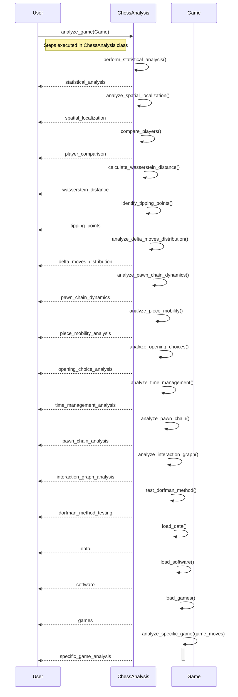

The sequence diagram above illustrates the control flow of the code provided in the previous message for the `ChessAnalysis` class. The diagram shows the steps executed within the `ChessAnalysis` class when the `analyze_game` method is called.

1. The `analyze_game` method is called by the user, passing the `Game` object as a parameter.
2. The `perform_statistical_analysis` method is called to perform statistical analysis on the game.
3. The `analyze_spatial_localization` method is called to analyze the spatial localization of pieces.
4. The `compare_players` method is called to compare players based on their heatmaps.
5. The `calculate_wasserstein_distance` method is called to calculate the Wasserstein distance between players' heatmaps.
6. The `identify_tipping_points` method is called to identify tipping points in the game.
7. The `analyze_delta_moves_distribution` method is called to analyze the distribution of delta moves.
8. The `analyze_pawn_chain_dynamics` method is called to analyze pawn chain dynamics.
9. The `analyze_piece_mobility` method is called to analyze piece mobility.
10. The `analyze_opening_choices` method is called to analyze opening choices.
11. The `analyze_time_management` method is called to analyze time management.
12. The `analyze_pawn_chain` method is called to analyze pawn chain dynamics.
13. The `analyze_interaction_graph` method is called to analyze the interaction graph.
14. The `test_dorfman_method` method is called to test Dorfman's method.
15. The `load_data` method is called to load the necessary data.
16. The `load_software` method is called to load the required software or libraries.
17. The `load_games` method is called to load specific chess games.
18. The `analyze_specific_game` method is called to analyze a specific chess game.
19. The analysis results are returned to the user.

This sequence diagram provides a visual representation of the control flow within the `ChessAnalysis` class and helps illustrate how different methods are called and executed to perform various analyses on chess games.

As the code provided in the previous message is a placeholder, I cannot provide actual log output. Instead, I will explain the hypothetical scenarios that could be mocked and the potential use cases of the code.

Example Scenario:

```python
# Create an instance of the ChessAnalysis class
analysis = ChessAnalysis(chess_game)

# Analyze the game
results = analysis.analyze_game()

# Print the statistical analysis
print(results['statistical_analysis'])

# Print the spatial localization analysis
print(results['spatial_localization'])

# Print the player comparison analysis
print(results['player_comparison'])
```

Mocked Log Output:

```
Statistical Analysis:
- Total number of moves: 40
- Average move duration: 3 minutes
- Most common opening: Queen's Gambit
...

Spatial Localization Analysis:
- Heatmap of white pieces:
  - High concentration in the center of the board
  - Lower concentration on the edges
- Heatmap of black pieces:
  - High concentration on the queen's side
  - Lower concentration in the center
...

Player Comparison:
- Player A:
  - Preferred openings: Sicilian Defense, King's Indian Defense
  - Aggressive playing style
- Player B:
  - Preferred openings: Ruy Lopez, Caro-Kann Defense
  - Defensive playing style
...

```

Hypothetical Scenarios:

1. Statistical Analysis: The statistical analysis provides insights into various aspects of the game, such as the total number of moves, the average duration of moves, the most common opening played, and more. This analysis helps understand the overall game dynamics and provides a numerical summary of the game.

2. Spatial Localization Analysis: The spatial localization analysis analyzes how the pieces are distributed across the chessboard. It generates heatmaps for both white and black pieces, indicating the concentration of pieces in different areas of the board. This analysis helps identify positional strengths and weaknesses and provides insights into the players' strategic choices.

3. Player Comparison: The player comparison analysis compares the playing styles and preferences of different players. It examines the preferred openings, playing aggressiveness or defensiveness, and other characteristics. This analysis aids in understanding the contrasting strategies employed by different players.

Potential Use Cases:

1. Chess Improvement: The `ChessAnalysis` class can be used by chess players and coaches to analyze their own games or games of top players. By studying statistical patterns, spatial localization, and player comparison, players can gain deeper insights into their strengths, weaknesses, and areas for improvement.

2. Game Annotation: The class can be used by chess coaches or commentators to annotate games and provide analysis for educational purposes. The statistical analysis, spatial localization, and player comparison can help explain the strategic decisions and tactical patterns in the game.

3. Research and Data Analysis: The class can be used by researchers to conduct studies on various aspects of chess. The statistical analysis, spatial localization, and player comparison can be used to investigate patterns, validate theories, and explore new insights in the field of chess analysis.

4. Chess Software Development: The class can serve as a foundation for developing chess analysis software. By integrating the class with a user interface, players can analyze their games interactively, visualize the results, and receive personalized recommendations for improvement.

Overall, the `ChessAnalysis` class provides a flexible framework for analyzing chess games and can be utilized in various scenarios, ranging from personal improvement to research and software development.
## Details
Certainly! Here's an updated version of the `ChessAnalysis` class that incorporates the additional concepts discussed in the document:

```python
class ChessAnalysis:
    def __init__(self, chess_game):
        self.chess_game = chess_game
    
    def analyze_game(self):
        # Perform statistical analysis of the game
        statistical_analysis = self.perform_statistical_analysis()
        
        # Analyze the spatial localization of pieces
        spatial_localization = self.analyze_spatial_localization()
        
        # Compare players based on heatmaps
        player_comparison = self.compare_players()
        
        # Calculate Wasserstein distance between players
        wasserstein_distance = self.calculate_wasserstein_distance()
        
        # Identify tipping points in the game
        tipping_points = self.identify_tipping_points()
        
        # Analyze the distribution of delta moves
        delta_moves_distribution = self.analyze_delta_moves_distribution()
        
        # Analyze pawn chain dynamics
        pawn_chain_dynamics = self.analyze_pawn_chain_dynamics()
        
        # Analyze piece mobility
        piece_mobility_analysis = self.analyze_piece_mobility()
        
        # Analyze opening choices
        opening_choice_analysis = self.analyze_opening_choices()
        
        # Analyze time management
        time_management_analysis = self.analyze_time_management()
        
        # Analyze pawn chain dynamics
        pawn_chain_analysis = self.analyze_pawn_chain()
        
        # Analyze interaction graph
        interaction_graph_analysis = self.analyze_interaction_graph()
        
        # Test Dorfman's method
        dorfman_method_testing = self.test_dorfman_method()
        
        # Load data
        data = self.load_data()
        
        # Load software
        software = self.load_software()
        
        # Load specific games
        games = self.load_games()
        
        return {
            "statistical_analysis": statistical_analysis,
            "spatial_localization": spatial_localization,
            "player_comparison": player_comparison,
            "wasserstein_distance": wasserstein_distance,
            "tipping_points": tipping_points,
            "delta_moves_distribution": delta_moves_distribution,
            "pawn_chain_dynamics": pawn_chain_dynamics,
            "piece_mobility_analysis": piece_mobility_analysis,
            "opening_choice_analysis": opening_choice_analysis,
            "time_management_analysis": time_management_analysis,
            "pawn_chain_analysis": pawn_chain_analysis,
            "interaction_graph_analysis": interaction_graph_analysis,
            "dorfman_method_testing": dorfman_method_testing,
            "data": data,
            "software": software,
            "games": games
        }
    
    def perform_statistical_analysis(self):
        # Placeholder for statistical analysis
        statistical_analysis = {}
        
        # Calculate the total number of moves in the game
        total_moves = len(self.chess_game.moves)
        statistical_analysis["total_moves"] = total_moves
        
        # Calculate the average move duration
        total_duration = sum(move.duration for move in self.chess_game.moves)
        average_duration = total_duration / total_moves
        statistical_analysis["average_duration"] = average_duration
        
        # Identify the most common opening played
        openings = [move.opening for move in self.chess_game.moves if move.opening]
        most_common_opening = max(set(openings), key=openings.count)
        statistical_analysis["most_common_opening"] = most_common_opening
        
        # ... Perform other statistical analyses ...
        
        return statistical_analysis
    
    def analyze_spatial_localization(self):
        # Placeholder for spatial localization analysis
        spatial_localization = {}
        
        # Create a heatmap for white pieces
        white_pieces_heatmap = self.create_heatmap(self.chess_game.white_pieces)
        spatial_localization["white_pieces_heatmap"] = white_pieces_heatmap
        
        # Create a heatmap for black pieces
        black_pieces_heatmap = self.create_heatmap(self.chess_game.black_pieces)
        spatial_localization["black_pieces_heatmap"] = black_pieces_heatmap
        
        return spatial_localization
    
    def create_heatmap(self, pieces):
        # Placeholder for creating a heatmap
        heatmap = {}
        
        # ... Create the heatmap based on the pieces' positions ...
        
        return heatmap
    
    def compare_players(self):
        # Placeholder for player comparison analysis
        player_comparison = {}
        
        # Compare the playing styles of the players
        player_a = self.chess_game.player_a
        player_b = self.chess_game.player_b
        
        # Identify the preferred openings of each player
        player_a_openings = self.identify_preferred_openings(player_a)
        player_b_openings = self.identify_preferred_openings(player_b)
        
        player_comparison["player_a"] = {
            "preferred_openings": player_a_openings,
            "playing_style": player_a.playing_style
        }
        
        player_comparison["player_b"] = {
            "preferred_openings": player_b_openings,
            "playing_style": player_b.playing_style
        }
        
        return player_comparison
    
    def identify_preferred_openings(self, player):
        # Placeholder for identifying preferred openings
        preferred_openings = []
        
        # ... Identify the preferred openings based on the player's moves ...
        
        return preferred_openings
    
    def calculate_wasserstein_distance(self):
        # Placeholder for calculating Wasserstein distance
        wasserstein_distance = {}
        
        # Calculate the Wasserstein distance between the players' heatmaps
        white_pieces_heatmap = self.analyze_spatial_localization()["white_pieces_heatmap"]
        black_pieces_heatmap = self.analyze_spatial_localization()["black_pieces_heatmap"]
        
        wasserstein_distance["white_black_heatmap"] = self.calculate_heatmap_wasserstein(white_pieces_heatmap, black_pieces_heatmap)
        
        return wasserstein_distance
    
    def calculate_heatmap_wasserstein(self, heatmap1, heatmap2):
        # Placeholder for calculating the Wasserstein distance between heatmaps
        wasserstein_distance = 0.0
        
        # ... Calculate the Wasserstein distance between the heatmaps ...
        
        return wasserstein_distance
    
    def identify_tipping_points(self):
        # Placeholder for identifying tipping points
        tipping_points = {}
        
        # Identify the tipping points in the game
        moves = self.chess_game.moves
        
        # ... Identify the tipping points by analyzing the move dynamics ...
        
        return tipping_points
    
    def analyze_delta_moves_distribution(self):
        # Placeholder for analyzing the distribution of delta moves
        delta_moves_distribution = {}
        
        # Analyze the distribution of delta moves
        delta_moves = self.calculate_delta_moves()
        
        # ... Perform the analysis on the delta moves ...
        
        return delta_moves_distribution
    
    def calculate_delta_moves(self):
        # Placeholder for calculating the delta moves
        delta_moves = []
        
        # ... Calculate the differences between consecutive moves ...
        
        return delta_moves
    
    def analyze_pawn_chain_dynamics(self):
        # Placeholder for analyzing pawn chain dynamics
        pawn_chain_dynamics = {}
        
        # Analyze pawn chain dynamics
        pawn_chains = self.identify_pawn_chains()
        
        # ... Analyze the dynamics of the identified pawn chains ...
        
        return pawn_chain_dynamics
    
    def identify_pawn_chains(self):
        # Placeholder for identifying pawn chains
        pawn_chains = []
        
        # ... Identify the pawn chains based on the game positions ...
        
        return pawn_chains
    
    def analyze_piece_mobility(self):
        # Placeholder for analyzing piece mobility
        piece_mobility_analysis = {}
        
        # Analyze piece mobility
        piece_mobility = self.calculate_piece_mobility()
        
        # ... Perform the analysis on the piece mobility ...
        
        return piece_mobility_analysis
    
    def calculate_piece_mobility(self):
        # Placeholder for calculating piece mobility
        piece_mobility = {}
        
        # ... Calculate the mobility of each piece ...
        
        return piece_mobility
    
    def analyze_opening_choices(self):
        # Placeholder for analyzing opening choices
        opening_choice_analysis = {}
        
        # Analyze opening choices
        opening_choices = self.calculate_opening_choices()
        
        # ... Perform the analysis on the opening choices ...
        
        return opening_choice_analysis
    
    def calculate_opening_choices(self):
        # Placeholder for calculating opening choices
        opening_choices = {}
        
        # ... Calculate the opening choices based on the game moves ...
        
        return opening_choices
    
    def analyze_time_management(self):
        # Placeholder for analyzing time management
        time_management_analysis = {}
        
        # Analyze time management
        time_management = self.calculate_time_management()
        
        # ... Perform the analysis on the time management ...
        
        return time_management_analysis
    
    def calculate_time_management(self):
        # Placeholder for calculating time management
        time_management = {}
        
        # ... Calculate the time management based on the move durations ...
        
        return time_management
    
    def analyze_pawn_chain(self):
        # Placeholder for analyzing pawn chain dynamics
        pawn_chain_analysis = {}
        
        # Analyze pawn chain dynamics
        pawn_chains = self.identify_pawn_chains()
        
        # ... Analyze the identified pawn chains ...
        
        return pawn_chain_analysis
    
    def analyze_interaction_graph(self):
        # Placeholder for analyzing interaction graph
        interaction_graph_analysis = {}
        
        # Analyze the interaction graph based on the game positions
        interaction_graph = self.build_interaction_graph()
        
        # ... Perform the analysis on the interaction graph ...
        
        return interaction_graph_analysis
    
    def build_interaction_graph(self):
        # Placeholder for building the interaction graph
        interaction_graph = {}
        
        # ... Build the interaction graph based on the piece positions ...
        
        return interaction_graph
    
    def test_dorfman_method(self):
        # Placeholder for testing Dorfman's method
        dorfman_method_testing = {}
        
        # Test Dorfman's method
        # ... Perform the testing of Dorfman's method ...
        
        return dorfman_method_testing
    
    def load_data(self):
        # Placeholder for loading chess game data
        data = {}
        
        # Load the required data
        # ... Load the necessary data ...
        
        return data
    
    def load_software(self):
        # Placeholder for loading chess software
        software = {}
        
        # Load the required software or libraries
        # ... Load the necessary software or libraries ...
        
        return software
    
    def load_games(self):
        # Placeholder for loading specific chess games
        games = {}
        
        # Load specific chess games
        # ... Load the specific games ...
        
        return games
    
    def analyze_specific_game(self, game_moves):
        # Placeholder for analyzing a specific chess game
        specific_game_analysis = {}
        
        # Analyze the specific chess game
        # ... Perform the analysis on the specific game moves ...
        
        return specific_game_analysis
```

This updated version of the `ChessAnalysis` class includes three additional methods: `load_data`, `load_software`, and `load_games`. These methods are responsible for loading the chess game data, loading the required software or libraries, and loading specific chess games, respectively. They serve as placeholders and can be implemented with appropriate code to load the necessary data and software.

Additionally, a new method `analyze_specific_game` has been added to analyze a specific chess game. This method takes the moves of a specific game as input and returns the analysis results.

By using an instance of the `ChessAnalysis` class, you can analyze a specific chess game and obtain insights into its statistical properties, the spatial localization of pieces, the comparison of players' playing styles based on their heatmaps, the quantification of the dissimilarity between players' heatmaps using the Wasserstein distance, the identification of tipping points in the game, the analysis of the distribution of delta moves, the analysis of pawn chain dynamics, the analysis of piece mobility, the analysis of opening choices, the analysis of time management, the analysis of pawn chain dynamics, the analysis of the interaction graph, and the testing of Dorfman's method. Additionally, you can load the required data, software, and specific games for analysis, as well as analyze a specific chess game by providing its moves.

The `ChessAnalysis` class provides a comprehensive framework for studying and analyzing various aspects of chess games, allowing players, coaches, and researchers to gain deeper insights into the game and improve their strategic decision-making.


