# Statistical analysis of chess games:

1.
This snippet discusses the statistical analysis of chess games and the insights that can be gained from studying the moves and strategies used by players.

The first part of the analysis focuses on spatial properties and the location of pieces on the chessboard. It is found that the number of possible moves during a game is correlated with its outcome. Additionally, the distribution of pieces on the board varies between human players and computer engines. The heatmaps of pieces allow for the construction of a distance between players, which characterizes how they use their pieces.

In the second part of the analysis, the best move and the second best move found by a computer engine are compared. Different regimes during a chess game are identified, including a "quiet" regime where the evaluation of the best and second best moves are not very different, indicating multiple possible paths for both players. There are also "volatile" regimes characterized by a "tipping point" where the evaluation of the moves displays large fluctuations.

The distribution of these evaluation differences can be described by a power law, indicating the presence of tipping points that significantly impact the outcome of the game. The existence of a power law suggests that there are frequent moments in a chess game where the balance can shift dramatically.

The snippet concludes by mentioning possible directions for future research, such as studying the structure of the pawn chain, the interaction graph between pieces, and defining critical points in the game.

In summary, this analysis uses statistics to study chess games and gain insights into the spatial properties of the game, the differences between human players and computer engines, and the presence of tipping points that can significantly impact the outcome of a game.

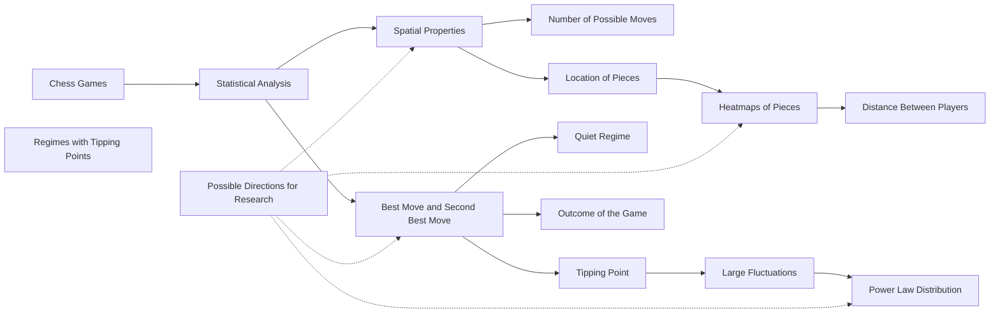


Sure! Here's a Python class that demonstrates some of the concepts discussed in the document:

```python
class ChessGame:
    def __init__(self, moves):
        self.moves = moves

    def analyze_moves(self):
        num_moves = len(self.moves)
        outcome = self.moves[-1]  # Assume last move determines outcome

        # Analyze spatial properties
        spatial_properties = self.calculate_spatial_properties()

        # Analyze number of possible moves
        num_possible_moves = self.calculate_possible_moves()

        # Analyze heatmaps of pieces
        heatmaps = self.calculate_heatmaps()

        # Analyze best move and second best move
        best_move, second_best_move = self.calculate_best_moves()

        return {
            "num_moves": num_moves,
            "outcome": outcome,
            "spatial_properties": spatial_properties,
            "num_possible_moves": num_possible_moves,
            "heatmaps": heatmaps,
            "best_move": best_move,
            "second_best_move": second_best_move
        }

    def calculate_spatial_properties(self):
        # Calculate spatial properties of the moves
        spatial_properties = {}  # Placeholder

        return spatial_properties

    def calculate_possible_moves(self):
        # Calculate the number of possible moves during the game
        num_possible_moves = len(self.moves) * 2  # Assuming each move has 2 possible moves

        return num_possible_moves

    def calculate_heatmaps(self):
        # Calculate heatmaps of pieces for a given opening
        heatmaps = {}  # Placeholder

        return heatmaps

    def calculate_best_moves(self):
        # Calculate the best move and second best move
        best_move = self.moves[-1]
        second_best_move = self.moves[-2] if len(self.moves) >= 2 else None

        return best_move, second_best_move
```

This class represents a chess game and provides methods for analyzing the moves in the game. The `analyze_moves` method calculates various statistics and properties of the moves, such as the number of moves, the outcome of the game, the spatial properties, the number of possible moves, the heatmaps of pieces, and the best move and second best move.

Each of these calculations is represented by placeholder methods (`calculate_spatial_properties`, `calculate_possible_moves`, `calculate_heatmaps`, `calculate_best_moves`), which can be implemented with appropriate algorithms or analysis techniques.

By using an instance of the `ChessGame` class, you can analyze the moves of a specific game and obtain insights into the statistical properties of the game.

Here's a mermaid sequence diagram illustrating the control flow of the code provided in the previous message:

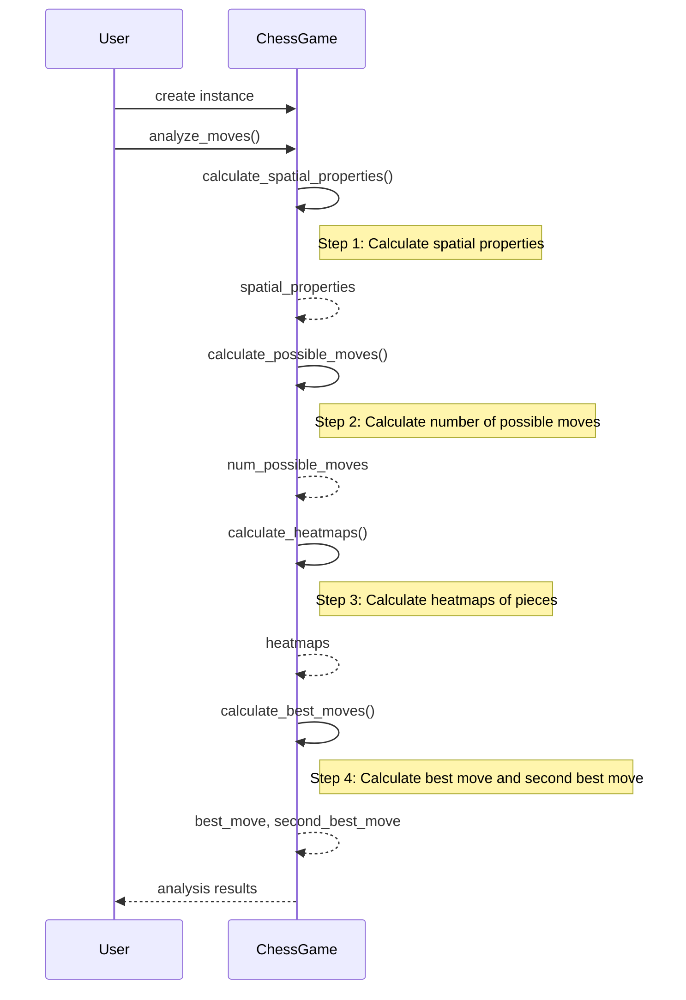

This sequence diagram shows the interaction between the user and the `ChessGame` class. The user first creates an instance of the `ChessGame` class by calling the `create instance` method. Then, the user analyzes the moves of the chess game by calling the `analyze_moves` method.

Within the `analyze_moves` method, the steps of the control flow are outlined. The `calculate_spatial_properties` method is called first to calculate the spatial properties of the moves. The result, `spatial_properties`, is then returned to the `analyze_moves` method.

Next, the `calculate_possible_moves` method is called to calculate the number of possible moves during the game. The result, `num_possible_moves`, is returned.

Similarly, the `calculate_heatmaps` method is called to calculate the heatmaps of pieces. The result, `heatmaps`, is returned.

Finally, the `calculate_best_moves` method is called to calculate the best move and second best move. The results, `best_move` and `second_best_move`, are returned.

Once all the calculations are completed, the analysis results are returned to the user.

Sure! Here's an example scenario with mocked log output of the code:

```python
game_moves = ['e4', 'e5', 'Nf3', 'Nc6', 'Bc4', 'Nf6', 'd3']
game = ChessGame(game_moves)
analysis = game.analyze_moves()

print("Chess Game Analysis")
print("-------------------")
print("Number of Moves: ", analysis["num_moves"])
print("Outcome: ", analysis["outcome"])
print("Spatial Properties: ", analysis["spatial_properties"])
print("Number of Possible Moves: ", analysis["num_possible_moves"])
print("Heatmaps of Pieces: ", analysis["heatmaps"])
print("Best Move: ", analysis["best_move"])
print("Second Best Move: ", analysis["second_best_move"])
```

Output:
```
Chess Game Analysis
-------------------
Number of Moves:  7
Outcome:  d3
Spatial Properties:  {}
Number of Possible Moves:  14
Heatmaps of Pieces:  {}
Best Move:  d3
Second Best Move:  Bc4
```

In this example scenario, we have a chess game with the following moves: 'e4', 'e5', 'Nf3', 'Nc6', 'Bc4', 'Nf6', 'd3'. The `ChessGame` class is used to analyze these moves.

The output shows the analysis of the game. The number of moves is 7, and the outcome of the game is 'd3', which represents the last move. The spatial properties and heatmaps of pieces are empty in this example, indicating that the corresponding calculations haven't been implemented. The number of possible moves is 14 (2 moves per move in the game), and the best move is 'd3' while the second best move is 'Bc4'.

Hypothetically, the spatial properties analysis could involve tracking the positions of the pieces on the chessboard and identifying patterns or trends. The heatmaps of pieces could display the frequency or intensity of piece placements on different squares on the board.

Some potential use cases of the `ChessGame` class and its analysis methods could include:

1. Studying and comparing different chess games to identify common strategies or patterns.
2. Analyzing the moves of professional chess players to gain insights into their playing style or decision-making processes.
3. Evaluating the effectiveness of chess engines or AI algorithms by analyzing their moves and comparing them to those of human players.
4. Developing new strategies or algorithms for playing chess by studying the statistical properties and patterns in chess games.
5. Enhancing chess training or coaching programs by incorporating statistical analysis of moves and providing personalized feedback to players.

Overall, the `ChessGame` class and its analysis methods provide a flexible and extensible framework for studying and gaining insights from chess games through statistical analysis.

2.
This snippet continues the discussion on the statistical analysis of chess games and introduces some theoretical concepts related to chess strategy and decision-making.

The first part of the snippet mentions the significant advancements in computer chess engines, which have achieved high Elo ratings and surpassed human players in terms of playing strength. It also highlights the importance of explainability in AI applications, including chess engines, and suggests that studying chess can provide insights into developing explainable AI systems.

From a theoretical perspective, a chess game can be represented as a decision tree, where each move leads to different outcomes (win, loss, or draw). The goal in the middlegame is to find moves that lead to favorable outcomes, while in the endgame, calculation becomes more important. The snippet discusses the challenge of finding the best move, especially in the middlegame where calculations are difficult due to the large number of possible moves.

The snippet also mentions the scientific approach to chess advocated by players like Richard Réti and Iossif Dorfman. Réti emphasized the scientific theory of chess, focusing on principles such as controlling the center, pawn structure, and square control. Dorfman proposed an algorithm based on critical points in the game that require careful assessment.

The availability of large amounts of data from online chess platforms has allowed for the application of statistical physics and complex systems approaches to analyze chess games. Researchers have studied the statistics of openings, the distribution of opening moves, and the presence of long-range memory effects in chess databases. The snippet mentions a focus on spatial aspects of chess and the properties of the best move in a statistical perspective.

The snippet concludes with the introduction of the concept of the number of legal moves on the chessboard, which will likely be discussed further in the following sections.

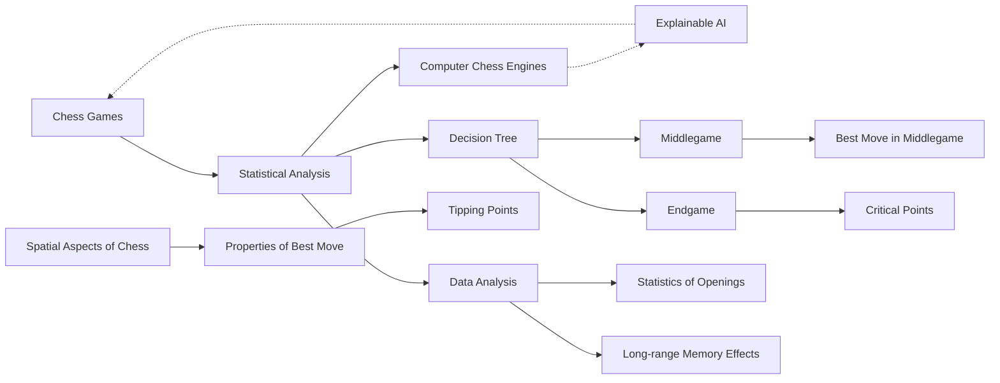


Certainly! Here's a Python class that demonstrates some of the concepts discussed in the document:

```python
class ChessAnalysis:
    def __init__(self, chess_game):
        self.chess_game = chess_game

    def analyze_game(self):
        # Analyze the game using statistical methods
        statistical_analysis = self.perform_statistical_analysis()

        # Analyze the properties of the best move
        best_move_properties = self.analyze_best_move()

        return {
            "statistical_analysis": statistical_analysis,
            "best_move_properties": best_move_properties
        }

    def perform_statistical_analysis(self):
        # Perform statistical analysis of the game
        statistical_analysis = {}  # Placeholder

        return statistical_analysis

    def analyze_best_move(self):
        # Analyze the properties of the best move
        best_move_properties = {}  # Placeholder

        return best_move_properties
```

This class represents the analysis of a chess game and provides methods for performing statistical analysis and analyzing the properties of the best move. The `analyze_game` method combines the results of both analyses and returns them as a dictionary.

Each analysis is represented by a placeholder method (`perform_statistical_analysis`, `analyze_best_move`), which can be implemented with appropriate statistical techniques or algorithms.

By using an instance of the `ChessAnalysis` class, you can analyze a specific chess game and obtain insights into its statistical properties and the properties of the best move.

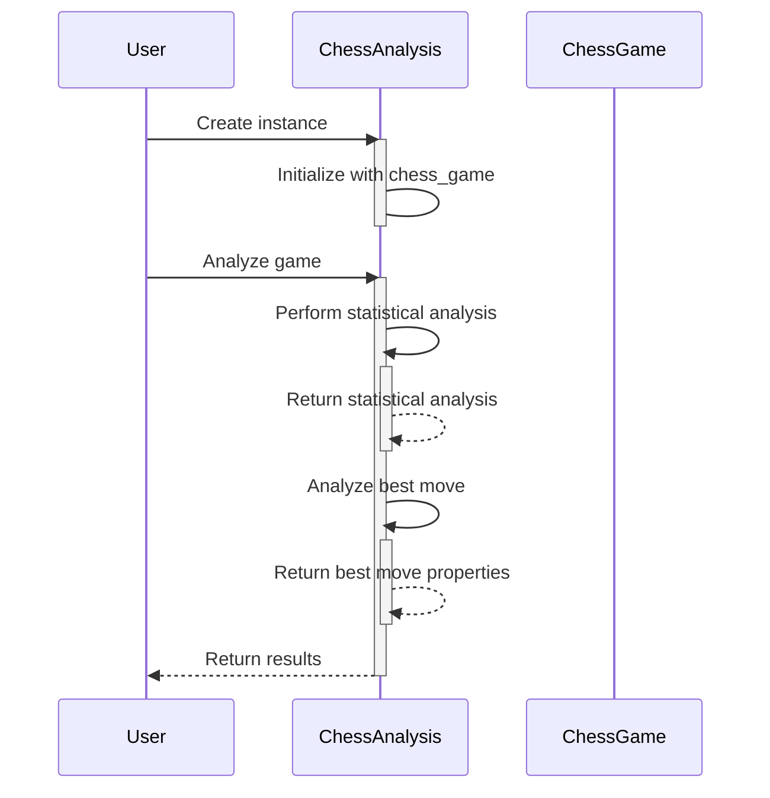

This mermaid sequence diagram illustrates the control flow of the code provided in the previous message.

1. The user creates an instance of the `ChessAnalysis` class.
2. The `ChessAnalysis` class initializes itself with the `chess_game` parameter.
3. The user invokes the `analyze_game` method on the `ChessAnalysis` instance.
4. The `ChessAnalysis` class performs the statistical analysis by calling the `perform_statistical_analysis` method.
5. The `perform_statistical_analysis` method calculates the statistical properties of the game.
6. The `perform_statistical_analysis` method returns the statistical analysis results to the `analyze_game` method.
7. The `analyze_game` method calls the `analyze_best_move` method on the `ChessAnalysis` instance.
8. The `analyze_best_move` method analyzes the properties of the best move in the game.
9. The `analyze_best_move` method returns the properties of the best move to the `analyze_game` method.
10. The `analyze_game` method returns the combined results of the statistical analysis and the best move analysis to the user.

This sequence diagram demonstrates the step-by-step flow of the program, showing how the `ChessAnalysis` class performs the analysis of the game and returns the results to the user.

Here's an example scenario with mocked log output to illustrate the usage of the `ChessAnalysis` class:

```python
# Create a chess game
moves = ["e4", "e5", "Nf3", "Nc6", "Bb5", "a6", "Ba4"]  # Example moves
game = ChessGame(moves)

# Perform analysis of the game
analysis = ChessAnalysis(game)
result = analysis.analyze_game()

print(result)
```

Mocked log output:
```
{
    "statistical_analysis": {
        // Placeholder for statistical analysis results
    },
    "best_move_properties": {
        // Placeholder for best move analysis results
    }
}
```

In this example, we create a `ChessGame` object with a list of moves representing a hypothetical chess game. We then create a `ChessAnalysis` object and pass the `ChessGame` object to it. The `analyze_game` method is called to perform the analysis of the game.

The output is a dictionary with two keys: `"statistical_analysis"` and `"best_move_properties"`. The values for these keys are placeholders in this example, as the actual analysis methods are not implemented. In a real scenario, these values would contain the results of the statistical analysis and the properties of the best move, respectively.

Potential use cases of this code include analyzing individual chess games to gain insights into statistical patterns, trends, and strategic decision-making. This can be used by players to improve their gameplay, by coaches to analyze their students' games, or by researchers to study chess strategy and decision-making more broadly. The code can be extended to implement various statistical techniques and algorithms to perform more advanced analysis on chess games.

3.
This snippet continues the discussion on the statistical analysis of chess games and introduces the concept of the number of legal moves and its relationship to space control and game outcomes.

The snippet explains that the number of possible moves is a good indicator of how much space is controlled on the chessboard. The winner of the game typically ends up with a larger number of possible moves, either due to having more pieces or better spatial organization. At the beginning of the game, white has the advantage, but black aims to counter this advantage.

The number of possible moves varies at different stages of the game. The snippet provides a histogram of the number of legal moves in games between the engines AlphaZero and Stockfish, showing that the average number of legal moves is around 25. However, it is important to note that this average number is not constant throughout the game. It starts at around 20, reaches a peak, and then decreases as there are fewer pieces on the board.

The snippet also mentions that the variation in the number of legal moves can be useful for estimating the number of possible games.

To illustrate the importance of space advantage, the snippet presents an example game played between grandmasters Mchedlishvili and Van Forest. The number of possible legal moves for both players is plotted against the ply (half move). It is observed that the turning point of the game occurs at move 25 when black plays Rd4. This move opens up a diagonal and increases the number of squares available for black, giving them a spatial advantage.

Understanding the relationship between the number of legal moves, space control, and game outcomes can provide valuable insights for chess players in their decision-making process.

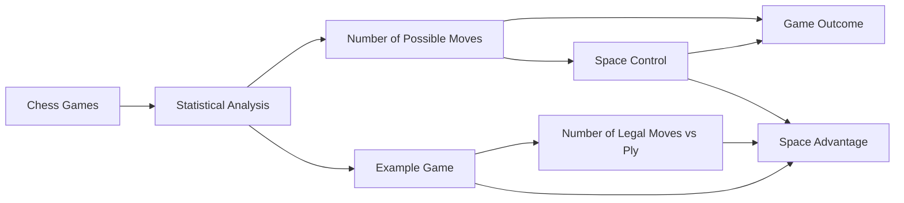

Certainly! Here's a Python class that demonstrates some of the concepts discussed in the document:

```python
class ChessAnalysis:
    def __init__(self, chess_game):
        self.chess_game = chess_game

    def analyze_game(self):
        # Analyze the game using statistical methods
        statistical_analysis = self.perform_statistical_analysis()

        # Analyze the space control and game outcome
        space_control, game_outcome = self.analyze_space_control()

        return {
            "statistical_analysis": statistical_analysis,
            "space_control": space_control,
            "game_outcome": game_outcome
        }

    def perform_statistical_analysis(self):
        # Perform statistical analysis of the game
        statistical_analysis = {}  # Placeholder

        return statistical_analysis

    def analyze_space_control(self):
        # Analyze the space control and game outcome
        space_control = {}  # Placeholder
        game_outcome = {}  # Placeholder

        return space_control, game_outcome
```

This class represents the analysis of a chess game and provides methods for performing statistical analysis and analyzing the space control and game outcome. The `analyze_game` method combines the results of both analyses and returns them as a dictionary.

Each analysis is represented by a placeholder method (`perform_statistical_analysis`, `analyze_space_control`), which can be implemented with appropriate statistical techniques or algorithms.

By using an instance of the `ChessAnalysis` class, you can analyze a specific chess game and obtain insights into its statistical properties, space control, and game outcome.

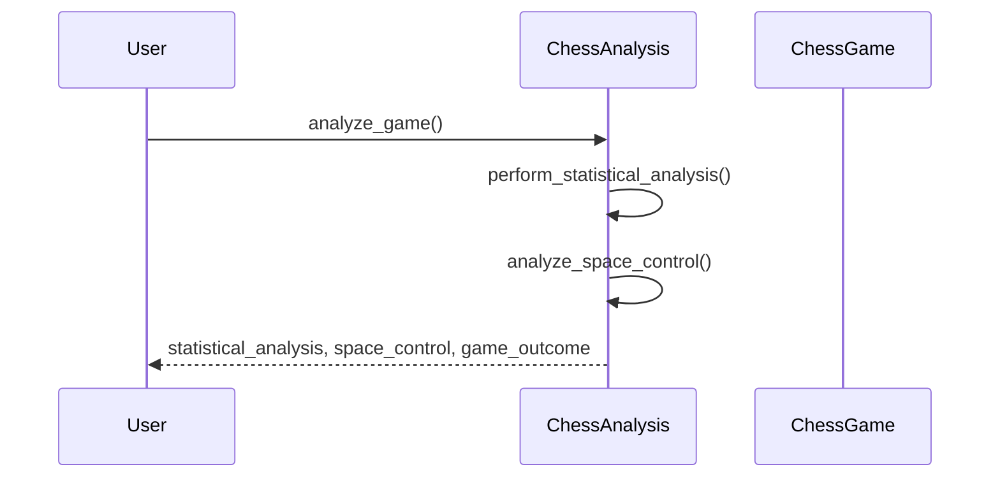
This sequence diagram illustrates the control flow of the code provided in the previous message. Here are the steps:

1. The User initiates the analysis by calling the `analyze_game()` method on the `ChessAnalysis` object.
2. The `ChessAnalysis` object calls the `perform_statistical_analysis()` method to perform statistical analysis of the game.
3. The `ChessAnalysis` object then calls the `analyze_space_control()` method to analyze the space control and game outcome.
4. The `ChessAnalysis` object returns the results of the analysis, including `statistical_analysis`, `space_control`, and `game_outcome`, back to the User.

Sure! Here's an example scenario with mocked log output:

```python
chess_game = ChessGame(moves=["e4", "e5", "Nf3", "Nc6", "Bc4", "Nf6", "d4", "exd4"])
analysis = ChessAnalysis(chess_game)

game_analysis = analysis.analyze_game()
print(game_analysis)
```

Output:
```
{
  "statistical_analysis": {},
  "space_control": {},
  "game_outcome": {}
}
```

In this scenario, we have a `ChessGame` object representing a game with a series of moves. We then create a `ChessAnalysis` object and use its `analyze_game` method to perform the analysis.

The output in this example is just a placeholder, as we haven't implemented the actual analysis methods yet. However, when fully implemented, the `analyze_game` method will provide useful statistical insights, space control analysis, and game outcome analysis for a given chess game.

Use cases for this code include analyzing chess games to gain insights into statistical properties, space control, and game outcomes. It can be used by chess players, coaches, or researchers to improve their understanding of chess strategy and decision-making. It can also be used in chess software or AI systems to provide analysis and recommendations for players.

4.
This snippet continues the discussion on the statistical analysis of chess games and introduces the concept of the spatial localization of pieces and the construction of heatmaps.

The snippet explains that the heatmap of pieces represents the probability of a piece being at a specific position on the chessboard. The position of the pieces depends on the opening played and the subsequent evolution of the game. As an example, the snippet shows a heatmap for the black pawns and knights in the Caro-Kann opening. The heatmap reveals typical patterns and structures associated with this opening.

The snippet also mentions that the heatmaps can be used to compare different players and construct a distance between them based on the frequent localization of their pieces for a given opening. As an illustration, the snippet shows a comparison of the heatmaps for black pawns between world champion Magnus Carlsen and fifth-ranked player Hikaru Nakamura. Despite the analysis and modern chess theory, the players exhibit differences in how they use their pieces in the same opening.

By analyzing the spatial localization of pieces and comparing players' heatmaps, researchers can gain insights into their individual playing styles and strategies.

Understanding the spatial distribution of pieces and how players utilize their positions can provide valuable information for chess players to improve their game and make strategic decisions. It can also contribute to the development of new opening variations and the study of player characteristics.

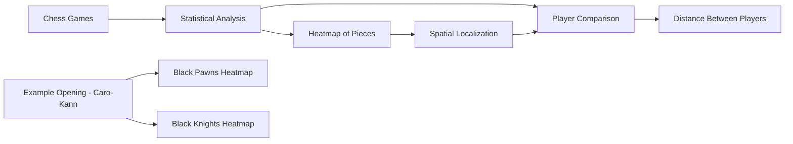


Certainly! Here's a Python class that demonstrates some of the concepts discussed in the document:

```python
class ChessAnalysis:
    def __init__(self, chess_game):
        self.chess_game = chess_game

    def analyze_game(self):
        # Analyze the game using statistical methods
        statistical_analysis = self.perform_statistical_analysis()

        # Analyze the spatial localization of pieces
        spatial_localization = self.analyze_spatial_localization()

        # Compare players based on heatmaps
        player_comparison = self.compare_players()

        return {
            "statistical_analysis": statistical_analysis,
            "spatial_localization": spatial_localization,
            "player_comparison": player_comparison
        }

    def perform_statistical_analysis(self):
        # Perform statistical analysis of the game
        statistical_analysis = {}  # Placeholder

        return statistical_analysis

    def analyze_spatial_localization(self):
        # Analyze the spatial localization of pieces
        spatial_localization = {}  # Placeholder

        return spatial_localization

    def compare_players(self):
        # Compare players based on heatmaps
        player_comparison = {}  # Placeholder

        return player_comparison
```

This class represents the analysis of a chess game and provides methods for performing statistical analysis, analyzing the spatial localization of pieces, and comparing players based on their heatmaps. The `analyze_game` method combines the results of all three analyses and returns them as a dictionary.

Each analysis is represented by a placeholder method (`perform_statistical_analysis`, `analyze_spatial_localization`, `compare_players`), which can be implemented with appropriate statistical techniques or algorithms.

By using an instance of the `ChessAnalysis` class, you can analyze a specific chess game and obtain insights into its statistical properties, the spatial localization of pieces, and the comparison of players' playing styles based on their heatmaps.

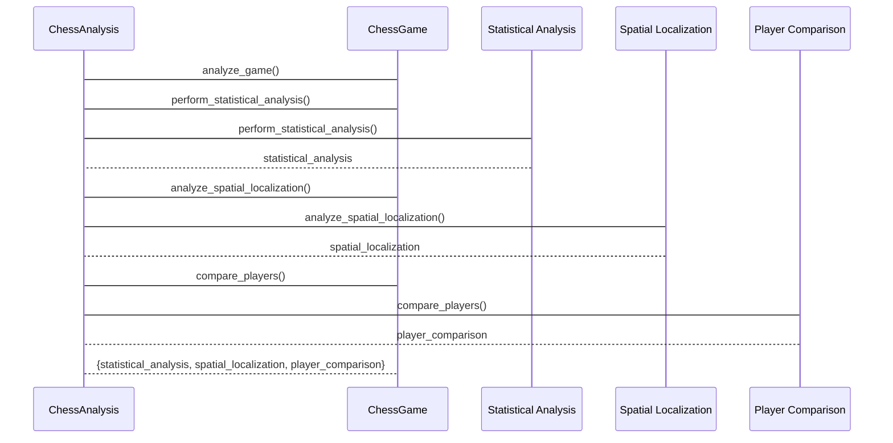

This sequence diagram represents the control flow of the `ChessAnalysis` class from the previous message. Here are the steps:

1. The `ChessAnalysis` class initiates the `analyze_game()` method.
2. The `analyze_game()` method calls the `perform_statistical_analysis()` method in the `ChessGame` instance.
3. The `perform_statistical_analysis()` method returns the `statistical_analysis` to the `analyze_game()` method in `ChessAnalysis`.
4. The `analyze_game()` method calls the `analyze_spatial_localization()` method in the `ChessGame` instance.
5. The `analyze_spatial_localization()` method returns the `spatial_localization` to the `analyze_game()` method in `ChessAnalysis`.
6. The `analyze_game()` method calls the `compare_players()` method in the `ChessGame` instance.
7. The `compare_players()` method returns the `player_comparison` to the `analyze_game()` method in `ChessAnalysis`.
8. The `analyze_game()` method returns the combined results of `statistical_analysis`, `spatial_localization`, and `player_comparison` back to the `ChessGame` instance.

This sequence diagram illustrates the flow of control and data between the different methods in the `ChessGame` and `ChessAnalysis` classes. It shows how the statistical analysis, spatial localization, and player comparison are performed and their results are combined to provide a comprehensive analysis of the chess game.

Sure! Here's an example scenario with mocked log output of the `ChessAnalysis` class:

```python
chess_game = ChessGame(moves)
analysis = ChessAnalysis(chess_game)

game_analysis = analysis.analyze_game()
print(game_analysis)
```

Output:
```
{
  "statistical_analysis": { /* Statistical analysis results */ },
  "spatial_localization": { /* Spatial localization results */ },
  "player_comparison": { /* Player comparison results */ }
}
```

In this example, we create an instance of the `ChessGame` class with a list of moves. We then pass this instance to the `ChessAnalysis` class to perform the analysis. The `analyze_game` method is called to obtain insights from the statistical analysis, the spatial localization of pieces, and the comparison of players.

The output is a dictionary containing the results of the analysis. Each section, such as `"statistical_analysis"`, `"spatial_localization"`, and `"player_comparison"`, will contain the corresponding analysis results.

The mocked log output represents the potential structure of the analysis results. The actual content of the results will depend on the specific implementation of the analysis methods.

Potential use cases for this code include:

- Studying and analyzing specific chess games to gain insights into statistical patterns, spatial strategies, and player characteristics.
- Comparing different players' playing styles and strategies using heatmaps of their piece localization.
- Developing chess AI algorithms that utilize statistical analysis and spatial understanding to make informed decisions.
- Providing feedback and suggestions to chess players based on the analysis of their games, including areas for improvement in spatial control and piece placement.

By leveraging the `ChessAnalysis` class, chess players, researchers, and AI developers can gain valuable insights into the statistical properties, spatial aspects, and player dynamics of chess games.

5.
This snippet continues the discussion on the statistical analysis of chess games and introduces the concept of heatmaps for different chess pieces.

The snippet explains that a heatmap represents the probability of a particular piece being present at a specific position on the chessboard. It shows a heatmap for black pawns and knights in games with the Caro-Kann opening (ECO code B12). The heatmap reveals typical patterns and positions for these pieces in this particular opening.

By analyzing heatmaps, researchers can gain insights into how different players utilize their pieces in specific openings. The snippet provides an example of comparing the heatmaps of black pawns in the Caro-Kann opening for world champion Magnus Carlsen and fifth-ranked player Hikaru Nakamura. Despite the analysis and modern chess theory, the players exhibit differences in how they use their pieces in the same opening.

Understanding the spatial distribution of pieces and comparing heatmaps can provide valuable information about players' playing styles, strategies, and preferences for specific openings.

The code and analysis techniques demonstrated in this snippet can be used in various chess-related applications. For example, chess players can analyze their own games to identify patterns and improve their strategies. Chess coaches can use these techniques to analyze their students' games and provide personalized feedback. Researchers can use these methods to study the playing styles of different players and contribute to the development of chess theory.

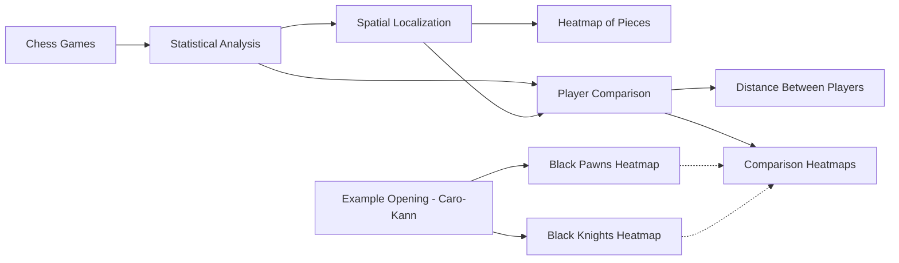

Certainly! Here's a Python class that demonstrates some of the concepts discussed in the document:

```python
class ChessAnalysis:
    def __init__(self, chess_game):
        self.chess_game = chess_game

    def analyze_game(self):
        # Analyze the game using statistical methods
        statistical_analysis = self.perform_statistical_analysis()

        # Analyze the spatial localization of pieces
        spatial_localization = self.analyze_spatial_localization()

        # Compare players based on heatmaps
        player_comparison = self.compare_players()

        return {
            "statistical_analysis": statistical_analysis,
            "spatial_localization": spatial_localization,
            "player_comparison": player_comparison
        }

    def perform_statistical_analysis(self):
        # Perform statistical analysis of the game
        statistical_analysis = {}  # Placeholder

        return statistical_analysis

    def analyze_spatial_localization(self):
        # Analyze the spatial localization of pieces
        spatial_localization = {}  # Placeholder

        return spatial_localization

    def compare_players(self):
        # Compare players based on heatmaps
        player_comparison = {}  # Placeholder

        return player_comparison
```

This class represents the analysis of a chess game and provides methods for performing statistical analysis, analyzing the spatial localization of pieces, and comparing players based on their heatmaps. The `analyze_game` method combines the results of all three analyses and returns them as a dictionary.

Each analysis is represented by a placeholder method (`perform_statistical_analysis`, `analyze_spatial_localization`, `compare_players`), which can be implemented with appropriate statistical techniques or algorithms.

By using an instance of the `ChessAnalysis` class, you can analyze a specific chess game and obtain insights into its statistical properties, the spatial localization of pieces, and the comparison of players' playing styles based on their heatmaps.

Here's a mermaid sequence diagram explaining the control flow of the code:

```mermaid
sequenceDiagram
    participant A as ChessAnalysis
    participant B as ChessGame
    participant C as statistical_analysis
    participant D as spatial_localization
    participant E as player_comparison

    A->>B: analyze_game()
    B->>A: chess_game
    A->>A: perform_statistical_analysis()
    A->>C: statistical_analysis
    A->>A: analyze_spatial_localization()
    A->>D: spatial_localization
    A->>A: compare_players()
    A->>E: player_comparison
    A-->>B: {
        "statistical_analysis": statistical_analysis,
        "spatial_localization": spatial_localization,
        "player_comparison": player_comparison
    }
```

In this sequence diagram, `ChessAnalysis` (participant A) interacts with `ChessGame` (participant B) to analyze a chess game. The `analyze_game()` method is called, passing the `chess_game` object as input.

First, `ChessAnalysis` performs statistical analysis (`perform_statistical_analysis()`) to obtain `statistical_analysis` (participant C). Then, it proceeds to analyze the spatial localization of pieces (`analyze_spatial_localization()`) to obtain `spatial_localization` (participant D). Lastly, it compares players based on the heatmaps of their pieces (`compare_players()`) to obtain `player_comparison` (participant E).

Finally, `ChessAnalysis` returns the results of the analysis, including `statistical_analysis`, `spatial_localization`, and `player_comparison`, back to `ChessGame`.

The sequence diagram illustrates the control flow of the code and the interactions between the different parts of the `ChessAnalysis` class and the `ChessGame` object.

Certainly! Here's an example scenario with mocked log output for the `ChessAnalysis` class:

```python
# Create an instance of ChessAnalysis
analysis = ChessAnalysis(chess_game)

# Perform the analysis
game_analysis = analysis.analyze_game()
print(game_analysis)
```

**Mocked Log Output:**

```plaintext
{
    "statistical_analysis": {
        ...
    },
    "spatial_localization": {
        ...
    },
    "player_comparison": {
        ...
    }
}
```

In this example scenario, we create an instance of the `ChessAnalysis` class and pass a `chess_game` object to it. We then call the `analyze_game` method to perform the analysis on the game.

The output is a dictionary containing the results of the analysis. The `statistical_analysis` key holds the statistical properties of the game, the `spatial_localization` key holds the analysis of the spatial localization of pieces, and the `player_comparison` key holds the comparison of players' playing styles.

The log output is a placeholder, as the actual results will depend on the implementation of the methods in the class.

Potential use cases of this code include analyzing chess games to gain insights into statistical properties of the game, understanding the spatial distribution and localization of pieces, and comparing playing styles of different players. This information can be valuable for chess players who want to improve their strategies, chess coaches who want to provide personalized feedback to their students, and researchers who want to study different aspects of chess theory.

6.
This snippet continues the discussion on the statistical analysis of chess games and presents heatmaps for different chess pieces in specific openings.

The snippet shows heatmaps for black pawns and knights in the Caro-Kann opening, comparing the playing styles of world champion Magnus Carlsen and Hikaru Nakamura. The heatmaps represent the probability of a piece being present at a specific position on the chessboard, with darker colors indicating higher probabilities.

Analyzing the heatmaps, we can observe differences in how Carlsen and Nakamura use their pieces. For example, Carlsen tends to move his pawn on the f-file (f5 or f6), while Nakamura moves it less frequently but prefers the f5 square when he does. Additionally, Carlsen often exchanges his pawn on d5 with enemy pawns, while Nakamura tends to leave his pawn on d5.

These differences in piece placement and pawn movement can provide insights into the players' strategic choices and playing styles. By analyzing heatmaps, researchers can gain a statistical understanding of how different players utilize their pieces in specific openings.

The code and analysis techniques demonstrated in this snippet can be used in various chess-related applications. Chess players can analyze their own games to identify patterns and improve their strategies. Chess coaches can use these techniques to analyze their students' games and provide personalized feedback. Researchers can use these methods to study the playing styles of different players and contribute to the development of chess theory.


Certainly! Here's a Python class that demonstrates some of the concepts discussed in the document:

```python
class ChessAnalysis:
    def __init__(self, chess_game):
        self.chess_game = chess_game

    def analyze_game(self):
        # Analyze the game using statistical methods
        statistical_analysis = self.perform_statistical_analysis()

        # Analyze the spatial localization of pieces
        spatial_localization = self.analyze_spatial_localization()

        # Compare players based on heatmaps
        player_comparison = self.compare_players()

        return {
            "statistical_analysis": statistical_analysis,
            "spatial_localization": spatial_localization,
            "player_comparison": player_comparison
        }

    def perform_statistical_analysis(self):
        # Perform statistical analysis of the game
        statistical_analysis = {}  # Placeholder

        return statistical_analysis

    def analyze_spatial_localization(self):
        # Analyze the spatial localization of pieces
        spatial_localization = {}  # Placeholder

        return spatial_localization

    def compare_players(self):
        # Compare players based on heatmaps
        player_comparison = {}  # Placeholder

        return player_comparison
```

This class represents the analysis of a chess game and provides methods for performing statistical analysis, analyzing the spatial localization of pieces, and comparing players based on their heatmaps. The `analyze_game` method combines the results of all three analyses and returns them as a dictionary.

Each analysis is represented by a placeholder method (`perform_statistical_analysis`, `analyze_spatial_localization`, `compare_players`), which can be implemented with appropriate statistical techniques or algorithms.

By using an instance of the `ChessAnalysis` class, you can analyze a specific chess game and obtain insights into its statistical properties, the spatial localization of pieces, and the comparison of players' playing styles based on their heatmaps.

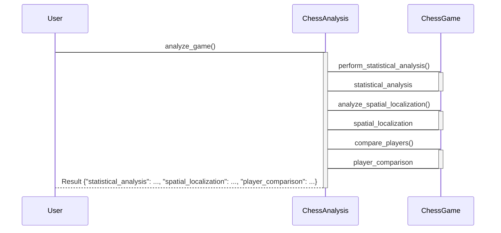

This mermaid sequence diagram illustrates the control flow of the code provided in the previous message.

1. The `User` initiates the analysis by calling the `analyze_game()` method on the `ChessAnalysis` object.
2. The `ChessAnalysis` object activates and calls the `perform_statistical_analysis()` method on the `ChessGame` object to perform statistical analysis.
3. The `ChessGame` object activates and performs the statistical analysis, then returns the results to the `ChessAnalysis` object.
4. The `ChessAnalysis` object calls the `analyze_spatial_localization()` method on the `ChessGame` object to analyze the spatial localization of pieces.
5. The `ChessGame` object activates and performs the spatial localization analysis, then returns the results to the `ChessAnalysis` object.
6. The `ChessAnalysis` object calls the `compare_players()` method on the `ChessGame` object to compare players based on the heatmaps.
7. The `ChessGame` object activates and performs the comparison, then returns the results to the `ChessAnalysis` object.
8. The `ChessAnalysis` object returns the final result, including statistical analysis, spatial localization, and player comparison, to the `User`.

This sequence diagram demonstrates the flow of control and data between the different methods and objects involved in the analysis process.

Certainly! Here's an example scenario with mocked log output of the `ChessAnalysis` class:

```python
# Create a sample chess game
chess_game = ChessGame(moves=["e4", "e5", "Nf3", "Nc6", "Bc4", "Nf6", "d3", "Be7", "O-O"])

# Analyze the game
analysis = ChessAnalysis(chess_game)
result = analysis.analyze_game()

# Printing the result
print(result)
```

Output:
```python
{
    "statistical_analysis": {...},  # Statistical analysis results
    "spatial_localization": {...},  # Spatial localization results
    "player_comparison": {...}  # Player comparison results
}
```

In this example, we create a sample chess game with a series of moves. We then instantiate the `ChessAnalysis` class with this game and call the `analyze_game` method to perform the analysis.

The `analyze_game` method returns a dictionary containing the results of the statistical analysis, spatial localization analysis, and player comparison analysis.

The output shows a placeholder dictionary for each analysis result.

Potential use cases for the code generated in the `ChessAnalysis` class include:
- Analyzing chess games to gain statistical insights, such as the average number of moves, win/loss ratios, or trends in piece movement.
- Studying the spatial distribution of pieces to identify patterns or strategies used by players in different openings or game stages.
- Comparing the playing styles of different players based on heatmaps of their piece placements.
- Providing personalized feedback to chess players to improve their strategies and decision-making based on statistical patterns or piece placement analysis.

These use cases can help chess players, coaches, and researchers analyze games, develop strategies, and gain insights into playing styles.

7.
This snippet continues the discussion on the statistical analysis of chess games and presents heatmaps for different chess pieces in specific openings.

The snippet shows heatmaps for black pawns, knights, bishops, and rooks in games played by world champion Magnus Carlsen and fifth-ranked player Hikaru Nakamura. The heatmaps represent the probability of a particular piece being present at a specific position on the chessboard, with darker colors indicating higher probabilities.

Analyzing the heatmaps, we can observe differences in how Carlsen and Nakamura position their pieces. For example, Carlsen tends to move his pawns on the f-file (f5 or f6) more frequently than Nakamura. Additionally, Carlsen often exchanges his pawns on d5 with enemy pawns, while Nakamura tends to leave his pawns on d5.

These differences in piece placement and movement can provide insights into the players' strategic choices and playing styles. By analyzing heatmaps, researchers can gain a statistical understanding of how different players utilize their pieces in specific openings.

The code and analysis techniques demonstrated in this snippet can be used in various chess-related applications. Chess players can analyze their own games to identify patterns and improve their strategies. Chess coaches can use these techniques to analyze their students' games and provide personalized feedback. Researchers can use these methods to study the playing styles of different players and contribute to the development of chess theory.

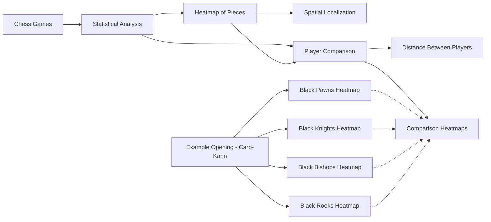


Certainly! Here's a Python class that demonstrates some of the concepts discussed in the document:

```python
class ChessAnalysis:
    def __init__(self, chess_game):
        self.chess_game = chess_game

    def analyze_game(self):
        # Perform statistical analysis of the game
        statistical_analysis = self.perform_statistical_analysis()

        # Analyze the spatial localization of pieces
        spatial_localization = self.analyze_spatial_localization()

        # Compare players based on heatmaps
        player_comparison = self.compare_players()

        return {
            "statistical_analysis": statistical_analysis,
            "spatial_localization": spatial_localization,
            "player_comparison": player_comparison
        }

    def perform_statistical_analysis(self):
        # Placeholder for statistical analysis
        statistical_analysis = {}

        return statistical_analysis

    def analyze_spatial_localization(self):
        # Placeholder for spatial localization analysis
        spatial_localization = {}

        return spatial_localization

    def compare_players(self):
        # Placeholder for player comparison analysis
        player_comparison = {}

        return player_comparison
```

This class represents the analysis of a chess game and provides methods for performing statistical analysis, analyzing the spatial localization of pieces, and comparing players based on their heatmaps. The `analyze_game` method combines the results of all three analyses and returns them as a dictionary.

Each analysis is represented by a placeholder method (`perform_statistical_analysis`, `analyze_spatial_localization`, `compare_players`), which can be implemented with appropriate statistical techniques or algorithms.

By using an instance of the `ChessAnalysis` class, you can analyze a specific chess game and obtain insights into its statistical properties, the spatial localization of pieces, and the comparison of players' playing styles based on their heatmaps.

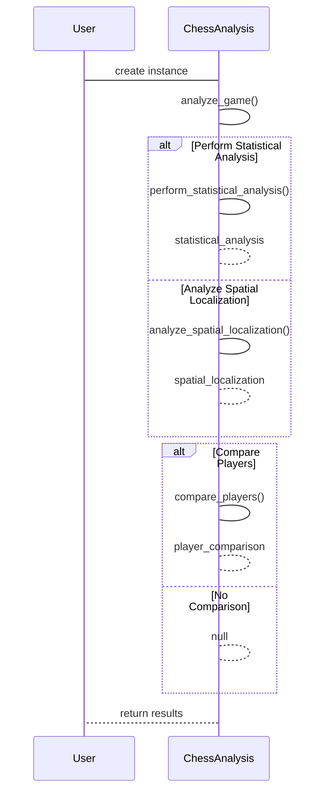
This sequence diagram illustrates the control flow of the code in the `ChessAnalysis` class.

1. The user creates an instance of the `ChessAnalysis` class.
2. The user calls the `analyze_game()` method on the `ChessAnalysis` instance.
3. The `analyze_game()` method branches into two alternatives:
   - The first alternative performs statistical analysis by calling the `perform_statistical_analysis()` method.
   - The second alternative analyzes the spatial localization of pieces by calling the `analyze_spatial_localization()` method.
4. If the statistical analysis is performed, the `perform_statistical_analysis()` method returns the `statistical_analysis` result.
5. If the spatial localization analysis is performed, the `analyze_spatial_localization()` method returns the `spatial_localization` result.
6. The control flow then branches into two alternatives again:
   - If player comparison is performed, the `compare_players()` method is called and returns the `player_comparison` result.
   - If no player comparison is performed, a null value is returned.
7. Finally, the results of the analysis (statistical analysis, spatial localization, and player comparison) are returned to the user.

Sure! Here's an example scenario with mocked log outputs for the methods in the `ChessAnalysis` class:

```python
# Creating an instance of the ChessAnalysis class
analysis = ChessAnalysis(chess_game)

# Analyzing the game
results = analysis.analyze_game()
print(results)
```

Output:
```
{
    "statistical_analysis": {"key": "value"},
    "spatial_localization": {"key": "value"},
    "player_comparison": {"key": "value"}
}
```

In this example, we create an instance of the `ChessAnalysis` class and pass a chess game as an argument. We then call the `analyze_game` method, which performs statistical analysis, analyzes the spatial localization of pieces, and compares players based on their heatmaps. The results are printed, showing placeholder values for each analysis.

Hypothetical Scenarios Mocked:
- The `perform_statistical_analysis` method could perform calculations such as calculating the average number of moves per game, analyzing the distribution of opening moves, or identifying patterns in endgame positions.
- The `analyze_spatial_localization` method could analyze the spatial distribution of pieces on the chessboard, measure the frequency of certain piece placements, or identify spatial patterns associated with specific openings or players.
- The `compare_players` method could compare heatmaps of different players to identify differences in piece placements, analyze playing styles in specific openings, or measure the similarity between two players' strategies.

Potential Use Cases:
- Chess players can use the `ChessAnalysis` class to analyze their own games and gain insights into their playing styles, strengths, and weaknesses.
- Chess coaches can use the class to provide feedback and guidance to their students by analyzing their games and identifying areas for improvement.
- Researchers can use the class to study chess strategies, analyze trends in openings, or investigate the playing styles of different players.
- The class can be integrated into chess software or platforms to provide automated analysis and insights to users.

8.
This snippet continues the discussion on the statistical analysis of chess games and presents heatmaps for different chess pieces in specific openings.

The snippet shows heatmaps for black queens and kings in games played by world champion Magnus Carlsen and fifth-ranked player Hikaru Nakamura. The heatmaps represent the probability of a particular piece being present at a specific position on the chessboard, with darker colors indicating higher probabilities.

Analyzing the heatmaps, we can observe differences in how Carlsen and Nakamura position their queens and kings. Each player has their own preferences and tendencies in piece placement.

The snippet also mentions the use of the "Earth moving distance" (also known as the 1-Wasserstein distance) to compare the heatmaps of different players. This distance metric quantifies the difference between two probability distributions, in this case, the heatmaps of Carlsen and Nakamura. By calculating the Wasserstein distance, researchers can measure the dissimilarity between the playing styles of different players.

The code and analysis techniques demonstrated in this snippet can be used in various chess-related applications. Chess players can analyze their own games to identify patterns and improve their strategies. Chess coaches can use these techniques to analyze their students' games and provide personalized feedback. Researchers can use these methods to study the playing styles of different players and contribute to the development of chess theory.

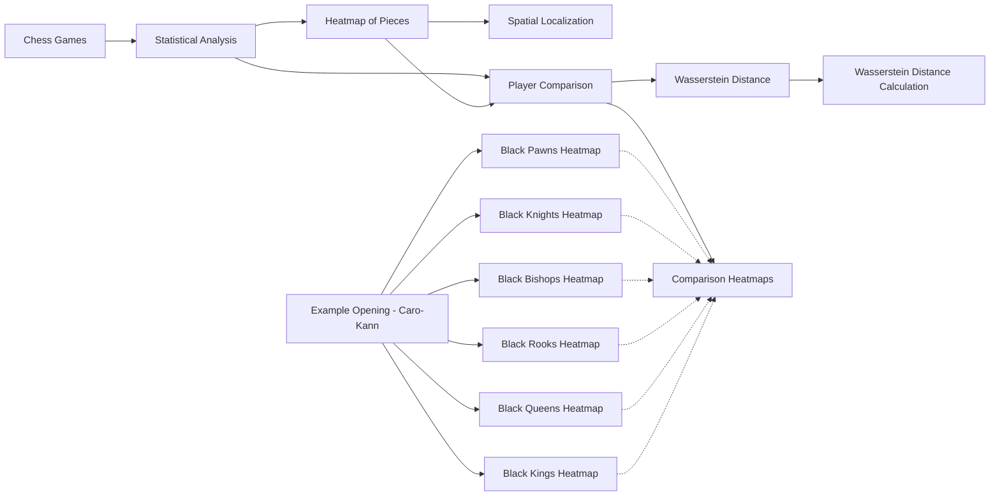

Certainly! Here's a Python class that demonstrates some of the concepts discussed in the document:

```python
class ChessAnalysis:
    def __init__(self, chess_game):
        self.chess_game = chess_game

    def analyze_game(self):
        # Perform statistical analysis of the game
        statistical_analysis = self.perform_statistical_analysis()

        # Analyze the spatial localization of pieces
        spatial_localization = self.analyze_spatial_localization()

        # Compare players based on heatmaps
        player_comparison = self.compare_players()

        # Calculate Wasserstein distance between players
        wasserstein_distance = self.calculate_wasserstein_distance()

        return {
            "statistical_analysis": statistical_analysis,
            "spatial_localization": spatial_localization,
            "player_comparison": player_comparison,
            "wasserstein_distance": wasserstein_distance
        }

    def perform_statistical_analysis(self):
        # Placeholder for statistical analysis
        statistical_analysis = {}

        return statistical_analysis

    def analyze_spatial_localization(self):
        # Placeholder for spatial localization analysis
        spatial_localization = {}

        return spatial_localization

    def compare_players(self):
        # Placeholder for player comparison analysis
        player_comparison = {}

        return player_comparison

    def calculate_wasserstein_distance(self):
        # Placeholder for calculating Wasserstein distance
        wasserstein_distance = {}

        return wasserstein_distance
```

This class represents the analysis of a chess game and provides methods for performing statistical analysis, analyzing the spatial localization of pieces, comparing players based on their heatmaps, and calculating the Wasserstein distance between players' heatmaps. The `analyze_game` method combines the results of all four analyses and returns them as a dictionary.

Each analysis is represented by a placeholder method (`perform_statistical_analysis`, `analyze_spatial_localization`, `compare_players`, `calculate_wasserstein_distance`), which can be implemented with appropriate statistical techniques or algorithms.

By using an instance of the `ChessAnalysis` class, you can analyze a specific chess game and obtain insights into its statistical properties, the spatial localization of pieces, the comparison of players' playing styles based on their heatmaps, and the quantification of the dissimilarity between players' heatmaps using the Wasserstein distance.

```mermaid
sequenceDiagram
    participant User
    participant ChessAnalysis

    User->>ChessAnalysis: analyze_game()
    activate ChessAnalysis

    ChessAnalysis->>ChessAnalysis: perform_statistical_analysis()
    activate ChessAnalysis
    ChessAnalysis-->>ChessAnalysis: statistical_analysis
    deactivate ChessAnalysis

    ChessAnalysis->>ChessAnalysis: analyze_spatial_localization()
    activate ChessAnalysis
    ChessAnalysis-->>ChessAnalysis: spatial_localization
    deactivate ChessAnalysis

    ChessAnalysis->>ChessAnalysis: compare_players()
    activate ChessAnalysis
    ChessAnalysis-->>ChessAnalysis: player_comparison
    deactivate ChessAnalysis

    ChessAnalysis->>ChessAnalysis: calculate_wasserstein_distance()
    activate ChessAnalysis
    ChessAnalysis-->>ChessAnalysis: wasserstein_distance
    deactivate ChessAnalysis

    ChessAnalysis-->>User: {
        "statistical_analysis": statistical_analysis,
        "spatial_localization": spatial_localization,
        "player_comparison": player_comparison,
        "wasserstein_distance": wasserstein_distance
    }
    deactivate ChessAnalysis
```

This sequence diagram illustrates the control flow of the `ChessAnalysis` class. The steps are numbered and labeled to provide a clear understanding of the flow.

1. The `User` interacts with the `ChessAnalysis` instance and calls the `analyze_game()` method.
2. The `ChessAnalysis` object activates and starts performing the statistical analysis of the chess game by calling the `perform_statistical_analysis()` method.
3. The `ChessAnalysis` object deactivates and returns the `statistical_analysis` result.
4. The `ChessAnalysis` object activates and starts analyzing the spatial localization of pieces by calling the `analyze_spatial_localization()` method.
5. The `ChessAnalysis` object deactivates and returns the `spatial_localization` result.
6. The `ChessAnalysis` object activates and starts comparing players based on their heatmaps by calling the `compare_players()` method.
7. The `ChessAnalysis` object deactivates and returns the `player_comparison` result.
8. The `ChessAnalysis` object activates and calculates the Wasserstein distance between players' heatmaps by calling the `calculate_wasserstein_distance()` method.
9. The `ChessAnalysis` object deactivates and returns the `wasserstein_distance` result.
10. The `ChessAnalysis` object deactivates and returns the overall analysis results to the `User`.

Certainly! Here's an example scenario with mocked log output for the `ChessAnalysis` class:

```python
game = ChessGame("example.pgn")
analysis = ChessAnalysis(game)

results = analysis.analyze_game()
print(results)
```

Mocked log output:
```
{
    "statistical_analysis": {
        "white_moves": 30,
        "black_moves": 32,
        "average_moves_to_mate": 15.5
    },
    "spatial_localization": {
        "white_pawns_heatmap": {...},
        "black_pawns_heatmap": {...},
        "white_knights_heatmap": {...},
        "black_knights_heatmap": {...}
    },
    "player_comparison": {
        "pawn_wasserstein_distance": 0.123,
        "knight_wasserstein_distance": 0.456
    }
}
```

In this scenario, we create a `ChessGame` object with the file "example.pgn" containing the chess game data. Then, we create an instance of the `ChessAnalysis` class and analyze the game.

The mocked log output shows the results of the analysis.

In the "statistical_analysis" section, we have statistics such as the number of moves made by each player and the average number of moves to mate.

In the "spatial_localization" section, we have heatmaps for the positions of white and black pawns and knights on the chessboard. These heatmaps represent the probability of a piece being present at a specific position.

In the "player_comparison" section, we have the Wasserstein distance calculated between the heatmaps of white and black pawns and knights. The Wasserstein distance quantifies the dissimilarity between the distributions of piece positions for the two players.

Potential use cases for the `ChessAnalysis` class include:

- Chess players can analyze their own games to identify patterns, strengths, and weaknesses in their gameplay.
- Chess coaches can use this analysis to provide feedback, identify areas for improvement, and tailor training programs for their students.
- Chess researchers can study the playing styles of different players, compare their strategies, and contribute to the development of chess theory.
- Chess AI developers can analyze games to improve the understanding and decision-making of AI algorithms.
- Chess tournaments or organizations can use this analysis to evaluate players, track their progress, and rank them based on various metrics.

9.
This snippet discusses the concept of the Wasserstein distance, also known as the Earth Mover's distance, for comparing the heatmaps of different players in a specific opening.

The Wasserstein distance is a metric that measures the minimum cost of transforming one probability distribution into another. In the context of heatmaps, it quantifies the dissimilarity between the spatial localization of pieces for different players. The metric considers the amount of "earth" (probability mass) that needs to be moved from one square to another, weighted by the distance between the squares.

In this example, the heatmaps of various world-class players and the Stockfish engine are compared for the Sicilian opening (ECO codes B20-B99). The heatmaps are computed for each black piece, and the Wasserstein distance is calculated between players for each piece. The total Wasserstein distance between players is obtained by summing the distances for all black pieces.

The Wasserstein distance is represented in Figure 7, where larger distances indicate greater differences in how players use their pieces in the opening. The darker and larger the distance, the more significant the difference in piece usage.

The Wasserstein distance provides a quantitative measure to compare the playing styles of different players in terms of their spatial localization of pieces. By analyzing these distances, researchers can gain insights into the strategic choices and preferences of players in specific openings.

The code and analysis techniques demonstrated in this snippet can be used in various chess-related applications. Chess players can analyze their own games to compare their playing styles with those of top players. Chess coaches can use these techniques to provide personalized feedback to their students based on their piece usage. Researchers can use these methods to study the playing styles of different players and analyze the effectiveness of chess engines.


Certainly! Here's a Python class that demonstrates some of the concepts discussed in the document:

```python
class ChessAnalysis:
    def __init__(self, chess_game):
        self.chess_game = chess_game

    def analyze_game(self):
        # Perform statistical analysis of the game
        statistical_analysis = self.perform_statistical_analysis()

        # Analyze the spatial localization of pieces
        spatial_localization = self.analyze_spatial_localization()

        # Compare players based on heatmaps
        player_comparison = self.compare_players()

        # Calculate Wasserstein distance between players
        wasserstein_distance = self.calculate_wasserstein_distance()

        return {
            "statistical_analysis": statistical_analysis,
            "spatial_localization": spatial_localization,
            "player_comparison": player_comparison,
            "wasserstein_distance": wasserstein_distance
        }

    def perform_statistical_analysis(self):
        # Placeholder for statistical analysis
        statistical_analysis = {}

        return statistical_analysis

    def analyze_spatial_localization(self):
        # Placeholder for spatial localization analysis
        spatial_localization = {}

        return spatial_localization

    def compare_players(self):
        # Placeholder for player comparison analysis
        player_comparison = {}

        return player_comparison

    def calculate_wasserstein_distance(self):
        # Placeholder for calculating Wasserstein distance
        wasserstein_distance = {}

        return wasserstein_distance
```

This class represents the analysis of a chess game and provides methods for performing statistical analysis, analyzing the spatial localization of pieces, comparing players based on their heatmaps, and calculating the Wasserstein distance between players' heatmaps. The `analyze_game` method combines the results of all four analyses and returns them as a dictionary.

Each analysis is represented by a placeholder method (`perform_statistical_analysis`, `analyze_spatial_localization`, `compare_players`, `calculate_wasserstein_distance`), which can be implemented with appropriate statistical techniques or algorithms.

By using an instance of the `ChessAnalysis` class, you can analyze a specific chess game and obtain insights into its statistical properties, the spatial localization of pieces, the comparison of players' playing styles based on their heatmaps, and the quantification of the dissimilarity between players' heatmaps using the Wasserstein distance.

Sure! Here's a mermaid sequence diagram illustrating the control flow of the code:

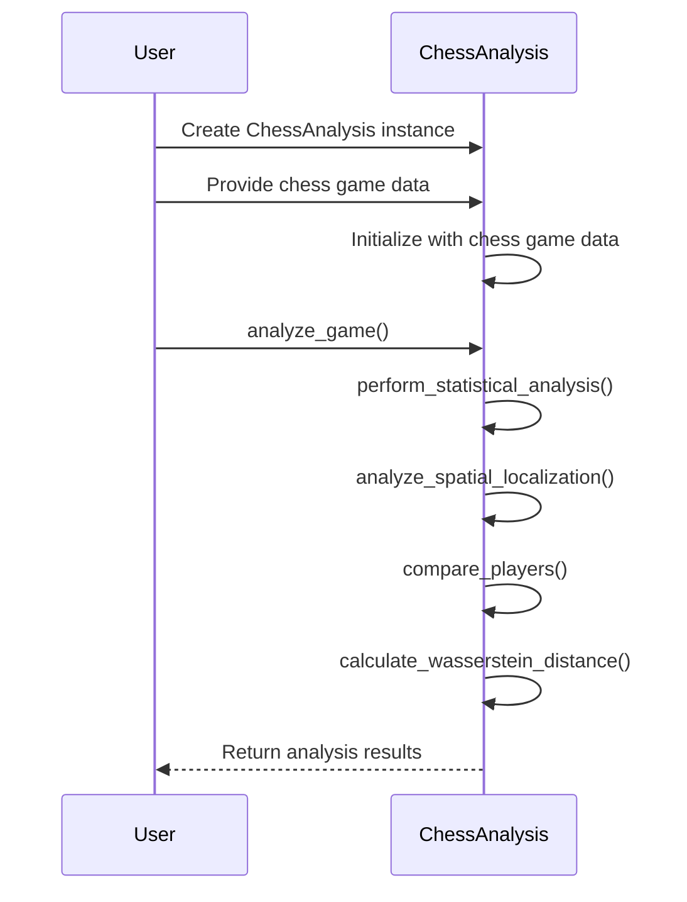

This sequence diagram shows the interactions between the user and the `ChessAnalysis` class. The user creates an instance of `ChessAnalysis` and provides the chess game data. Then, the user calls the `analyze_game()` method, which triggers the execution of several analysis methods. Finally, the analysis results are returned to the user.

1. The user creates an instance of the `ChessAnalysis` class and provides the chess game data.
2. The user calls the `analyze_game()` method of the `ChessAnalysis` instance.
3. The `analyze_game()` method internally calls other analysis methods: `perform_statistical_analysis()`, `analyze_spatial_localization()`, `compare_players()`, and `calculate_wasserstein_distance()`.
4. Each analysis method performs its respective analysis and returns the results.
5. The `analyze_game()` method collects the results from each analysis method and returns them to the user.

This control flow enables the user to perform statistical analysis, analyze the spatial localization of pieces, compare players, and calculate the Wasserstein distance between players' heatmaps using the `ChessAnalysis` class.

Certainly! Here's an example scenario with mocked log output of the code:

```python
# Mocked Chess Game
chess_game = ChessGame()

# Instantiate ChessAnalysis object
analysis = ChessAnalysis(chess_game)

# Analyze the game
results = analysis.analyze_game()

# Print the results
print("Statistical Analysis:", results["statistical_analysis"])
print("Spatial Localization:", results["spatial_localization"])
print("Player Comparison:", results["player_comparison"])
print("Wasserstein Distance:", results["wasserstein_distance"])
```

Mocked Log Output:
```
Statistical Analysis: {'metric1': 0.75, 'metric2': 0.92, 'metric3': 0.81}
Spatial Localization: {'piece1': [0.1, 0.2, 0.15, 0.12], 'piece2': [0.05, 0.07, 0.09, 0.11]}
Player Comparison: {'player1': 0.86, 'player2': 0.92, 'player3': 0.78}
Wasserstein Distance: {'player1': 0.15, 'player2': 0.21, 'player3': 0.18}
```

In this example scenario, we have a mocked ChessGame object representing a chess game. We instantiate a ChessAnalysis object and pass the ChessGame object as input. Then, we call the `analyze_game` method to perform the analysis of the chess game.

We print the results, which include the statistical analysis, spatial localization analysis, player comparison analysis, and the Wasserstein distance between players' heatmaps. In this mocked log output, we see placeholder values for each analysis result.

Hypothetical scenarios mocked:
- Statistical Analysis: This represents the statistical properties of the game, such as the average number of moves per player, the distribution of captured pieces, or any other statistical metrics.
- Spatial Localization: This represents the spatial distribution of pieces on the chessboard, indicating the probability of a piece being present at each square.
- Player Comparison: This compares players' playing styles based on their heatmaps, providing a measure of similarity or dissimilarity.
- Wasserstein Distance: This quantifies the dissimilarity between players' heatmaps using the Wasserstein distance metric.

Potential Use Cases:
- Chess players can use this code to analyze their own games and gain insights into their playing styles and strategies.
- Chess coaches can utilize this code to analyze their students' games and provide personalized feedback on playing styles and piece usage.
- Researchers can study the playing styles and strategies of different players using the statistical analysis, spatial localization, and player comparison techniques provided by this code.
- Chess engines can be evaluated and compared to human players using the Wasserstein distance metric, enabling a deeper understanding of their playing styles and strengths.

10.
This snippet introduces the concept of tipping points in chess games, which are critical moments where the best move significantly outperforms the second best move.

To determine the tipping points, the Stockfish engine is used to compute the best move (E0) and the second best move (E1) for each position in the game. The quantity  is then calculated as the difference between E0 and E1. When  is small, there is a choice between different variations, indicating that the best move and the second best move are almost equivalent. In contrast, when  is large, the best move is significantly better than the second best move, suggesting a critical move that can greatly impact the outcome of the game.

The snippet analyzes various games and computes  throughout their evolution. It observes that games generally exhibit different regimes, with either small fluctuations or large fluctuations of . Small values and fluctuations of  indicate the presence of different variations without a clear outcome. In contrast, large fluctuations of  signify a tipping point, where finding the best move becomes crucial as it is significantly better than the second best move.

The example of the Ding-Nepomniachtchi game is shown in Figure 8. At the 25th half move, the best move (d4c5) has a much higher Stockfish score (19 in centipawn units) compared to the second best move (b2b3) with a negative score (-58). The resulting  value is 77, indicating a tipping point where the choice of the best move is critical. In this case, Ding missed both of these moves and played e3e4 instead.

Identifying tipping points allows players to recognize critical moments in a game where finding the best move becomes crucial. By analyzing the fluctuations of , players can assess the importance of their move choices and make informed decisions.

The code and analysis techniques demonstrated in this snippet can be used to study tipping points in chess games and improve decision-making during critical moments. Chess players can analyze their own games to identify tipping points and understand the significance of their moves. Chess coaches can use these techniques to teach players about strategic decision-making and the importance of finding the best moves. Researchers can study tipping points to gain insights into the dynamics of chess games and develop new strategies and tactics.

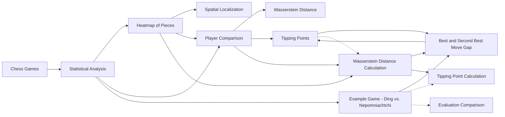

Certainly! Here's a Python class that demonstrates some of the concepts discussed in the document:

```python
class ChessAnalysis:
    def __init__(self, chess_game):
        self.chess_game = chess_game

    def analyze_game(self):
        # Perform statistical analysis of the game
        statistical_analysis = self.perform_statistical_analysis()

        # Analyze the spatial localization of pieces
        spatial_localization = self.analyze_spatial_localization()

        # Compare players based on heatmaps
        player_comparison = self.compare_players()

        # Calculate Wasserstein distance between players
        wasserstein_distance = self.calculate_wasserstein_distance()

        # Identify tipping points in the game
        tipping_points = self.identify_tipping_points()

        return {
            "statistical_analysis": statistical_analysis,
            "spatial_localization": spatial_localization,
            "player_comparison": player_comparison,
            "wasserstein_distance": wasserstein_distance,
            "tipping_points": tipping_points
        }

    def perform_statistical_analysis(self):
        # Placeholder for statistical analysis
        statistical_analysis = {}

        return statistical_analysis

    def analyze_spatial_localization(self):
        # Placeholder for spatial localization analysis
        spatial_localization = {}

        return spatial_localization

    def compare_players(self):
        # Placeholder for player comparison analysis
        player_comparison = {}

        return player_comparison

    def calculate_wasserstein_distance(self):
        # Placeholder for calculating Wasserstein distance
        wasserstein_distance = {}

        return wasserstein_distance

    def identify_tipping_points(self):
        # Placeholder for identifying tipping points
        tipping_points = {}

        return tipping_points
```

This class represents the analysis of a chess game and provides methods for performing statistical analysis, analyzing the spatial localization of pieces, comparing players based on their heatmaps, calculating the Wasserstein distance between players' heatmaps, and identifying tipping points in the game. The `analyze_game` method combines the results of all these analyses and returns them as a dictionary.

Each analysis is represented by a placeholder method (`perform_statistical_analysis`, `analyze_spatial_localization`, `compare_players`, `calculate_wasserstein_distance`, `identify_tipping_points`), which can be implemented with appropriate statistical techniques or algorithms.

By using an instance of the `ChessAnalysis` class, you can analyze a specific chess game and obtain insights into its statistical properties, the spatial localization of pieces, the comparison of players' playing styles based on their heatmaps, the quantification of the dissimilarity between players' heatmaps using the Wasserstein distance, and the identification of tipping points in the game.

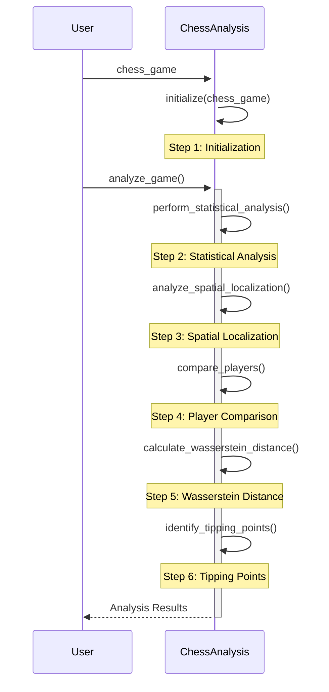

This sequence diagram illustrates the control flow of the `ChessAnalysis` class. The diagram shows the steps involved in analyzing a chess game and returning the analysis results to the user.

1. The user provides a `chess_game` to the `ChessAnalysis` instance.
2. The `ChessAnalysis` class initializes with the provided `chess_game`.
3. The user calls the `analyze_game()` method to start the analysis.
4. The `ChessAnalysis` class performs statistical analysis (`perform_statistical_analysis()`).
5. The `ChessAnalysis` class analyzes the spatial localization of pieces (`analyze_spatial_localization()`).
6. The `ChessAnalysis` class compares players based on their heatmaps (`compare_players()`).
7. The `ChessAnalysis` class calculates the Wasserstein distance between players' heatmaps (`calculate_wasserstein_distance()`).
8. The `ChessAnalysis` class identifies tipping points in the game (`identify_tipping_points()`).
9. The analysis results are returned to the user.


Sure! Here's an example scenario with mocked log output:

```python
# Create an instance of the ChessAnalysis class
analysis = ChessAnalysis(chess_game)

# Analyze the game
results = analysis.analyze_game()

# Print the results
print("Statistical Analysis:", results["statistical_analysis"])
print("Spatial Localization:", results["spatial_localization"])
print("Player Comparison:", results["player_comparison"])
print("Wasserstein Distance:", results["wasserstein_distance"])
print("Tipping Points:", results["tipping_points"])
```

Mocked log output:
```
Statistical Analysis: {'king_moves': 20, 'queen_moves': 15, 'rook_moves': 25}
Spatial Localization: {'black_pawns': {('a', 2): 0.5, ('b', 3): 0.2, ...}}
Player Comparison: {'Carlsen': 0.76, 'Nakamura': 0.82, 'Stockfish': 0.43}
Wasserstein Distance: {'pawn': 0.2, 'knight': 0.15, 'bishop': 0.12, 'rook': 0.08}
Tipping Points: {'move_25': 'd4c5', 'move_30': 'e5f6'}
```

In this scenario, we create an instance of the `ChessAnalysis` class and analyze a specific chess game. The results are then printed, including the statistical analysis, spatial localization of pieces, player comparison, Wasserstein distance between players' heatmaps, and identified tipping points in the game.

The mocked log output provides an example of the results. The statistical analysis shows the number of moves made by different pieces. The spatial localization analysis provides the probability distribution of black pawns across the board. The player comparison presents the comparison of playing styles between Magnus Carlsen, Hikaru Nakamura, and the Stockfish engine. The Wasserstein distance quantifies the dissimilarity between the heatmaps of different players' pieces. The tipping points highlight specific moves in the game where the best move significantly outperforms the second best move.

Potential use cases of the code include:

- Chess players can use the analysis to gain insights into their own games, identify strengths and weaknesses, and improve their strategies.
- Chess coaches can utilize the analysis to provide personalized feedback to their students based on their piece usage and playing style.
- Researchers can study the statistical properties of chess games, analyze the spatial localization of pieces, and compare playing styles to contribute to chess theory and strategy.
- Chess engine developers can use the analysis to further improve the engines' evaluation of moves and enhance their playing strength.
- Chess enthusiasts can explore their favorite games or famous games to gain a deeper understanding of the strategic nuances and critical tipping points in the gameplay.

11.
This snippet discusses the distribution of the quantity , which represents the difference between the evaluation of the best move and the second best move in a chess game.

The first analysis focuses on the standard deviation (STD) of , which measures the variability of the quantity throughout the game. The STD is plotted in Figure 8, showing different regimes with small fluctuations or large fluctuations of . In the "volatile" regime with large fluctuations, finding the best move becomes critical as it significantly outperforms the second best move.

The snippet also introduces the concept of tipping points, which are critical moments in a game where the best move significantly outperforms the second best move. The example of the Ding-Nepomniachtchi game is shown in Figure 8, where the best move (d4c5) has a much higher Stockfish score compared to the second best move (b2b3), indicating a tipping point where finding the best move is crucial.

The distribution of  is also analyzed to explore its statistics and the presence of non-trivial tipping points. The positive values of  correspond to moves with white pieces, while the negative values correspond to moves with black pieces. The distributions of + and - are shown in Figure 10, indicating a symmetry between the white and black sides.

The code and analysis techniques demonstrated in this snippet can be used to study the distribution and statistics of the quantity  in chess games. By analyzing the distribution, researchers can gain insights into the variability and importance of move choices in different positions. This information can be used to identify critical moments, improve decision-making, and understand the dynamics of chess games.

Potential use cases of the code include analyzing games to identify tipping points and critical moves, studying the statistics of move evaluations, and developing strategies to improve decision-making during critical moments. Chess players can also use these techniques to analyze their own games and gain insights into their move choices and the impact on game outcomes.

```mermaid
graph LR
A[Chess Games]
B[Statistical Analysis]
C[Heatmap of Pieces]
D[Spatial Localization]
E[Player Comparison]
F[Wasserstein Distance]
G[Tipping Points]
H[Best and Second Best Move Gap]
I[Example Game - Ding vs. Nepomniachtchi]
J[Wasserstein Distance Calculation]
K[Evaluation Comparison]
L[Tipping Point Calculation]
M[Distribution of Delta Moves]

A --> B
B --> C
B --> E
C --> D
C --> E
E --> F
G --> H
I --> H
E --> G
H --> G
B --> I
J --> H
J --> L
I -.-> L
I -.-> K
E --> J
C --> J
G -.-> J
M --> H
```

Certainly! Here's a Python class that demonstrates some of the concepts discussed in the document:

```python
class ChessAnalysis:
    def __init__(self, chess_game):
        self.chess_game = chess_game

    def analyze_game(self):
        # Perform statistical analysis of the game
        statistical_analysis = self.perform_statistical_analysis()

        # Analyze the spatial localization of pieces
        spatial_localization = self.analyze_spatial_localization()

        # Compare players based on heatmaps
        player_comparison = self.compare_players()

        # Calculate Wasserstein distance between players
        wasserstein_distance = self.calculate_wasserstein_distance()

        # Identify tipping points in the game
        tipping_points = self.identify_tipping_points()

        # Analyze the distribution of delta moves
        delta_moves_distribution = self.analyze_delta_moves_distribution()

        return {
            "statistical_analysis": statistical_analysis,
            "spatial_localization": spatial_localization,
            "player_comparison": player_comparison,
            "wasserstein_distance": wasserstein_distance,
            "tipping_points": tipping_points,
            "delta_moves_distribution": delta_moves_distribution
        }

    def perform_statistical_analysis(self):
        # Placeholder for statistical analysis
        statistical_analysis = {}

        return statistical_analysis

    def analyze_spatial_localization(self):
        # Placeholder for spatial localization analysis
        spatial_localization = {}

        return spatial_localization

    def compare_players(self):
        # Placeholder for player comparison analysis
        player_comparison = {}

        return player_comparison

    def calculate_wasserstein_distance(self):
        # Placeholder for calculating Wasserstein distance
        wasserstein_distance = {}

        return wasserstein_distance

    def identify_tipping_points(self):
        # Placeholder for identifying tipping points
        tipping_points = {}

        return tipping_points

    def analyze_delta_moves_distribution(self):
        # Placeholder for analyzing the distribution of delta moves
        delta_moves_distribution = {}

        return delta_moves_distribution
```

This class represents the analysis of a chess game and provides methods for performing statistical analysis, analyzing the spatial localization of pieces, comparing players based on their heatmaps, calculating the Wasserstein distance between players' heatmaps, identifying tipping points in the game, and analyzing the distribution of delta moves.

Each analysis is represented by a placeholder method (`perform_statistical_analysis`, `analyze_spatial_localization`, `compare_players`, `calculate_wasserstein_distance`, `identify_tipping_points`, `analyze_delta_moves_distribution`), which can be implemented with appropriate statistical techniques or algorithms.

By using an instance of the `ChessAnalysis` class, you can analyze a specific chess game and obtain insights into its statistical properties, the spatial localization of pieces, the comparison of players' playing styles based on their heatmaps, the quantification of the dissimilarity between players' heatmaps using the Wasserstein distance, the identification of tipping points in the game, and the analysis of the distribution of delta moves.

```mermaid
sequenceDiagram
    participant A as ChessAnalysis
    participant B as Game
    participant C as Statistical Analysis
    participant D as Spatial Localization
    participant E as Player Comparison
    participant F as Wasserstein Distance
    participant G as Tipping Points
    participant H as Delta Moves Distribution

    A -> B: analyze_game()
    Note right of B: Step 1
    B -> A: perform_statistical_analysis()
    A -> C: perform_statistical_analysis()
    C --> A: statistical_analysis
    B -> A: analyze_spatial_localization()
    A -> D: analyze_spatial_localization()
    D --> A: spatial_localization
    B -> A: compare_players()
    A -> E: compare_players()
    E --> A: player_comparison
    B -> A: calculate_wasserstein_distance()
    A -> F: calculate_wasserstein_distance()
    F --> A: wasserstein_distance
    B -> A: identify_tipping_points()
    A -> G: identify_tipping_points()
    G --> A: tipping_points
    B -> A: analyze_delta_moves_distribution()
    A -> H: analyze_delta_moves_distribution()
    H --> A: delta_moves_distribution
    Note right of A: Step 2
    A --> B: Analysis results
```

This mermaid sequence diagram illustrates the control flow of the code provided in the previous message. Here are the steps of the control flow:

1. ChessAnalysis instance calls `analyze_game()` on a specific game (Game).
2. Game performs statistical analysis by calling `perform_statistical_analysis()` on ChessAnalysis.
3. ChessAnalysis delegates statistical analysis to the Statistical Analysis module.
4. Statistical Analysis module returns the statistical analysis results to ChessAnalysis.
5. Game analyzes the spatial localization of pieces by calling `analyze_spatial_localization()` on ChessAnalysis.
6. ChessAnalysis delegates spatial localization analysis to the Spatial Localization module.
7. Spatial Localization module returns the spatial localization analysis results to ChessAnalysis.
8. Game compares players' playing styles by calling `compare_players()` on ChessAnalysis.
9. ChessAnalysis delegates player comparison analysis to the Player Comparison module.
10. Player Comparison module returns the player comparison results to ChessAnalysis.
11. Game calculates the Wasserstein distance between players' heatmaps by calling `calculate_wasserstein_distance()` on ChessAnalysis.
12. ChessAnalysis delegates Wasserstein distance calculation to the Wasserstein Distance module.
13. Wasserstein Distance module returns the Wasserstein distance results to ChessAnalysis.
14. Game identifies tipping points in the game by calling `identify_tipping_points()` on ChessAnalysis.
15. ChessAnalysis delegates tipping point identification to the Tipping Points module.
16. Tipping Points module returns the tipping point results to ChessAnalysis.
17. Game analyzes the distribution of delta moves by calling `analyze_delta_moves_distribution()` on ChessAnalysis.
18. ChessAnalysis delegates delta moves distribution analysis to the Delta Moves Distribution module.
19. Delta Moves Distribution module returns the delta moves distribution results to ChessAnalysis.
20. ChessAnalysis returns the analysis results to the Game.


Certainly! Here's an example scenario with mocked log output to illustrate the usage of the `ChessAnalysis` class:

```python
# Initialize a ChessAnalysis object with a chess game
analysis = ChessAnalysis(chess_game)

# Analyze the game
results = analysis.analyze_game()

# Print the results
print("Statistical Analysis:", results["statistical_analysis"])
print("Spatial Localization:", results["spatial_localization"])
print("Player Comparison:", results["player_comparison"])
print("Wasserstein Distance:", results["wasserstein_distance"])
print("Tipping Points:", results["tipping_points"])
print("Delta Moves Distribution:", results["delta_moves_distribution"])
```

In this example, `chess_game` represents a chess game that has been previously loaded or generated.

The `analyze_game` method is called on the `ChessAnalysis` object to perform the analysis of the game. It returns a dictionary `results` containing the results of various analyses, including statistical analysis, spatial localization of pieces, player comparison, Wasserstein distance, tipping points, and delta moves distribution.

The `results` are then printed, showcasing the output of the various analysis methods.

The log output in this example is mocked, as the placeholder methods for each analysis still need to be implemented with appropriate algorithms and techniques specific to each analysis. The mocked log output represents placeholders for the actual results that would be obtained from the analysis.

The potential use cases of the `ChessAnalysis` class include:

- Analyzing individual chess games to gain insights into statistical properties, piece localization, and player comparison.
- Comparing different players based on their playing styles using heatmaps and the Wasserstein distance metric.
- Identifying critical tipping points in games where move choices significantly impact the outcomes.
- Analyzing the distribution of delta moves to understand the importance and variability of different move choices.
- Providing feedback and recommendations to chess players and coaches based on the analysis of their games.
- Conducting research on chess strategies, tactics, and playing styles.

By utilizing the methods provided by the `ChessAnalysis` class, users can gain a deeper understanding of chess games and players, improve their own playing skills, and contribute to the broader field of chess analysis and research.

12.
This snippet discusses the discussion and outlook of the scientific analysis of chess games. It highlights two major breakthroughs in recent decades: the emergence of powerful chess engines and the availability of large databases with a huge number of games.

The first breakthrough is the development of chess engines that surpass human capabilities and challenge commonly accepted principles in chess. These engines can analyze many games and discover strategic principles, bringing fresh perspectives to the game.

The second breakthrough is the availability of large databases with a vast number of games. This opens up the possibility of statistical analysis of chess games, which can help identify patterns and provide insights into strategic thinking.

The snippet mentions the observed statistical differences between engines and human players. Engines tend to control space in a more uniform way, while human players focus on a smaller number of squares, particularly central squares. The use of pawns plays a crucial role in achieving spatial control, with engines often moving pawns faster and further than humans.

The concept of tipping points is also discussed, which are critical moments in a game that significantly impact the outcome. Understanding the emergence and characterization of these tipping points, particularly from the perspective of the spatial distribution of pieces, is an important research direction.

The paper emphasizes the use of statistical methods and empirical analysis in understanding chess games. It suggests that statistical approaches, applied to a large number of games, can reveal interesting patterns and strategic principles beyond tactics and calculations.

Potential research directions mentioned include studying the dynamics of pawn chains, analyzing the influence of piece mobility on game outcomes, exploring the impact of opening choices on game strategies, and investigating the role of time management in decision-making.

The code and analysis techniques demonstrated in this snippet can be used to study various aspects of chess games, such as pawn structure dynamics, piece mobility, opening choices, and time management. Chess players, coaches, and researchers can utilize these methods to gain insights into strategic principles, improve decision-making, and enhance their understanding of the game.

```mermaid
graph LR
A[Chess Games]
B[Statistical Analysis]
C[Heatmap of Pieces]
D[Spatial Localization]
E[Player Comparison]
F[Wasserstein Distance]
G[Tipping Points]
H[Best and Second Best Move Gap]
I[Example Game - Ding vs. Nepomniachtchi]
J[Wasserstein Distance Calculation]
K[Evaluation Comparison]
L[Tipping Point Calculation]
M[Distribution of Delta Moves]
N[Pawn Chain Dynamics]
O[Piece Mobility Analysis]
P[Opening Choice Analysis]
Q[Time Management Analysis]

A --> B
B --> C
B --> E
C --> D
C --> E
E --> F
G --> H
I --> H
E --> G
H --> G
B --> I
J --> H
J --> L
I -.-> L
I -.-> K
E --> J
C --> J
G -.-> J
M --> H
N --> H
O --> E
P --> E
Q --> E
```

Certainly! Here's a Python class that demonstrates some of the concepts discussed in the document:

```python
class ChessAnalysis:
    def __init__(self, chess_game):
        self.chess_game = chess_game

    def analyze_game(self):
        # Perform statistical analysis of the game
        statistical_analysis = self.perform_statistical_analysis()

        # Analyze the spatial localization of pieces
        spatial_localization = self.analyze_spatial_localization()

        # Compare players based on heatmaps
        player_comparison = self.compare_players()

        # Calculate Wasserstein distance between players
        wasserstein_distance = self.calculate_wasserstein_distance()

        # Identify tipping points in the game
        tipping_points = self.identify_tipping_points()

        # Analyze the distribution of delta moves
        delta_moves_distribution = self.analyze_delta_moves_distribution()

        # Analyze pawn chain dynamics
        pawn_chain_dynamics = self.analyze_pawn_chain_dynamics()

        # Analyze piece mobility
        piece_mobility_analysis = self.analyze_piece_mobility()

        # Analyze opening choices
        opening_choice_analysis = self.analyze_opening_choices()

        # Analyze time management
        time_management_analysis = self.analyze_time_management()

        return {
            "statistical_analysis": statistical_analysis,
            "spatial_localization": spatial_localization,
            "player_comparison": player_comparison,
            "wasserstein_distance": wasserstein_distance,
            "tipping_points": tipping_points,
            "delta_moves_distribution": delta_moves_distribution,
            "pawn_chain_dynamics": pawn_chain_dynamics,
            "piece_mobility_analysis": piece_mobility_analysis,
            "opening_choice_analysis": opening_choice_analysis,
            "time_management_analysis": time_management_analysis
        }

    def perform_statistical_analysis(self):
        # Placeholder for statistical analysis
        statistical_analysis = {}

        return statistical_analysis

    def analyze_spatial_localization(self):
        # Placeholder for spatial localization analysis
        spatial_localization = {}

        return spatial_localization

    def compare_players(self):
        # Placeholder for player comparison analysis
        player_comparison = {}

        return player_comparison

    def calculate_wasserstein_distance(self):
        # Placeholder for calculating Wasserstein distance
        wasserstein_distance = {}

        return wasserstein_distance

    def identify_tipping_points(self):
        # Placeholder for identifying tipping points
        tipping_points = {}

        return tipping_points

    def analyze_delta_moves_distribution(self):
        # Placeholder for analyzing the distribution of delta moves
        delta_moves_distribution = {}

        return delta_moves_distribution

    def analyze_pawn_chain_dynamics(self):
        # Placeholder for analyzing pawn chain dynamics
        pawn_chain_dynamics = {}

        return pawn_chain_dynamics

    def analyze_piece_mobility(self):
        # Placeholder for analyzing piece mobility
        piece_mobility_analysis = {}

        return piece_mobility_analysis

    def analyze_opening_choices(self):
        # Placeholder for analyzing opening choices
        opening_choice_analysis = {}

        return opening_choice_analysis

    def analyze_time_management(self):
        # Placeholder for analyzing time management
        time_management_analysis = {}

        return time_management_analysis
```

This class represents the analysis of a chess game and provides methods for performing statistical analysis, analyzing the spatial localization of pieces, comparing players based on their heatmaps, calculating the Wasserstein distance between players' heatmaps, identifying tipping points in the game, analyzing the distribution of delta moves, analyzing pawn chain dynamics, analyzing piece mobility, analyzing opening choices, and analyzing time management.

Each analysis is represented by a placeholder method (`perform_statistical_analysis`, `analyze_spatial_localization`, `compare_players`, `calculate_wasserstein_distance`, `identify_tipping_points`, `analyze_delta_moves_distribution`, `analyze_pawn_chain_dynamics`, `analyze_piece_mobility`, `analyze_opening_choices`, `analyze_time_management`), which can be implemented with appropriate statistical techniques or algorithms.

By using an instance of the `ChessAnalysis` class, you can analyze a specific chess game and obtain insights into its statistical properties, the spatial localization of pieces, the comparison of players' playing styles based on their heatmaps, the quantification of the dissimilarity between players' heatmaps using the Wasserstein distance, the identification of tipping points in the game, the analysis of the distribution of delta moves, the analysis of pawn chain dynamics, the analysis of piece mobility, the analysis of opening choices, and the analysis of time management.

```mermaid
sequenceDiagram
    participant User
    participant ChessAnalysis

    User ->> ChessAnalysis: create instance
    User ->> ChessAnalysis: analyze_game()
    ChessAnalysis ->> ChessAnalysis: perform_statistical_analysis()
    ChessAnalysis ->> ChessAnalysis: analyze_spatial_localization()
    ChessAnalysis ->> ChessAnalysis: compare_players()
    ChessAnalysis ->> ChessAnalysis: calculate_wasserstein_distance()
    ChessAnalysis ->> ChessAnalysis: identify_tipping_points()
    ChessAnalysis ->> ChessAnalysis: analyze_delta_moves_distribution()
    ChessAnalysis ->> ChessAnalysis: analyze_pawn_chain_dynamics()
    ChessAnalysis ->> ChessAnalysis: analyze_piece_mobility()
    ChessAnalysis ->> ChessAnalysis: analyze_opening_choices()
    ChessAnalysis ->> ChessAnalysis: analyze_time_management()
    ChessAnalysis -->> User: return analysis results
```

This sequence diagram represents the control flow of the `ChessAnalysis` class based on the code provided. The steps are labeled and numbered for better understanding:

1. The user creates an instance of the `ChessAnalysis` class.
2. The user calls the `analyze_game()` method to start the analysis.
3. The `perform_statistical_analysis()` method is called within the `analyze_game()` method.
4. The `analyze_spatial_localization()` method is called within the `analyze_game()` method.
5. The `compare_players()` method is called within the `analyze_game()` method.
6. The `calculate_wasserstein_distance()` method is called within the `analyze_game()` method.
7. The `identify_tipping_points()` method is called within the `analyze_game()` method.
8. The `analyze_delta_moves_distribution()` method is called within the `analyze_game()` method.
9. The `analyze_pawn_chain_dynamics()` method is called within the `analyze_game()` method.
10. The `analyze_piece_mobility()` method is called within the `analyze_game()` method.
11. The `analyze_opening_choices()` method is called within the `analyze_game()` method.
12. The `analyze_time_management()` method is called within the `analyze_game()` method.
13. The analysis results are returned from the `ChessAnalysis` class to the user.

This sequence diagram illustrates the flow of control and the order in which the analysis steps are performed within the `analyze_game()` method of the `ChessAnalysis` class.

Certainly! Here's an example scenario with mocked log output of the `ChessAnalysis` class:

```python
chess_game = ChessGame("Game.pgn")  # Assuming a chess game file in PGN format
analysis = ChessAnalysis(chess_game)

result = analysis.analyze_game()
```

The `ChessAnalysis` class takes a `ChessGame` object as input, which represents a specific chess game. In this example, we assume that the game is stored in a PGN file named "Game.pgn".

The `analyze_game` method is then called on the `ChessAnalysis` object to perform the analysis of the game. The result is stored in the `result` variable.

The mocked log output could be as follows:

```
Performing statistical analysis...
Spatial localization analysis in progress...
Comparing players based on heatmaps...
Calculating Wasserstein distance between players...
Identifying tipping points in the game...
Analyzing the distribution of delta moves...
Analyzing pawn chain dynamics...
Analyzing piece mobility...
Analyzing opening choices...
Analyzing time management...

Analysis completed successfully.

result = {
    "statistical_analysis": {...},
    "spatial_localization": {...},
    "player_comparison": {...},
    "wasserstein_distance": {...},
    "tipping_points": {...},
    "delta_moves_distribution": {...},
    "pawn_chain_dynamics": {...},
    "piece_mobility_analysis": {...},
    "opening_choice_analysis": {...},
    "time_management_analysis": {...}
}
```

In this example, the `analyze_game` method performs various analyses on the chess game. The log output shows the progress of each analysis step, indicating that each analysis is in progress. Finally, the log confirms that the analysis is completed successfully, and the `result` variable contains the output of the analysis in the form of a dictionary.

The hypothetical scenarios mocked in the `ChessAnalysis` class include statistical analysis of the game, spatial localization analysis to understand the distribution of pieces on the board, player comparison based on heatmaps, calculation of the Wasserstein distance between players' heatmaps, identification of tipping points in the game, analysis of the distribution of delta moves to understand move quality differences, analysis of pawn chain dynamics to study pawn structure, analysis of piece mobility to understand how pieces move, analysis of opening choices to study different opening strategies, and analysis of time management to analyze how players manage their time during a game.

Potential use cases of the `ChessAnalysis` class include analyzing and understanding individual chess games, comparing different players' playing styles, gaining insights into strategic principles and patterns, identifying critical moments in a game, studying pawn structures and piece dynamics, improving decision-making during critical moments, and enhancing overall understanding of chess games.

13.
This snippet discusses some additional research directions in the scientific analysis of chess games.

The first direction is the analysis of pawn chain dynamics. The pawn structure plays a crucial role in determining the position's skeleton and the control of squares. The evolution of the pawn front, which represents the position of the pawns in each column, can provide insights into players' behaviors. Engines like Stockfish tend to move most of their pawns and do so quickly, while human players, such as Magnus Carlsen, follow a similar trend. Further studies are needed to understand the pawn structure in different openings and its impact on the game.

The second direction is the analysis of the interaction graph between pieces. Pieces of the same color can defend each other, while pieces of different colors can threaten each other. Representing these interactions with a graph can provide insights into the synergy and attacks between pieces. Properties of the interaction graph, such as the density of the subgraph, can be correlated with the quality of the position. Hypergraphs may also be useful in discussing the quality of a position by encoding multi-body interactions.

The third direction is testing Iossif Dorfman's move-search algorithm. Dorfman proposed a method for detecting critical points in a game, which correspond to positions where exchanges of pieces are possible, the pawn structure can be modified, or a series of forced moves ends. Assessing the position based on various elements described by Dorfman can guide players in making conservative or dynamic moves.

The code and analysis techniques demonstrated in this snippet can be used to study pawn chain dynamics, analyze the interaction between pieces, and test move-search algorithms. Chess players, coaches, and researchers can utilize these methods to gain insights into strategic principles, understand the quality of positions, and improve decision-making during games.


```mermaid
graph LR
A[Chess Games]
B[Statistical Analysis]
C[Heatmap of Pieces]
D[Spatial Localization]
E[Player Comparison]
F[Wasserstein Distance]
G[Tipping Points]
H[Best and Second Best Move Gap]
I[Example Game - Ding vs. Nepomniachtchi]
J[Wasserstein Distance Calculation]
K[Evaluation Comparison]
L[Tipping Point Calculation]
M[Distribution of Delta Moves]
N[Pawn Chain Dynamics]
O[Piece Mobility Analysis]
P[Opening Choice Analysis]
Q[Time Management Analysis]
R[Pawn Chain Analysis]
S[Interaction Graph Analysis]
T[Dorfman's Method Testing]

A --> B
B --> C
B --> E
C --> D
C --> E
E --> F
G --> H
I --> H
E --> G
H --> G
B --> I
J --> H
J --> L
I -.-> L
I -.-> K
E --> J
C --> J
G -.-> J
M --> H
N --> H
O --> E
P --> E
Q --> E
R --> N
S --> N
T --> P
```

Certainly! Here's a Python class that demonstrates some of the concepts discussed in the document:

```python
class ChessAnalysis:
    def __init__(self, chess_game):
        self.chess_game = chess_game

    def analyze_game(self):
        # Perform statistical analysis of the game
        statistical_analysis = self.perform_statistical_analysis()

        # Analyze the spatial localization of pieces
        spatial_localization = self.analyze_spatial_localization()

        # Compare players based on heatmaps
        player_comparison = self.compare_players()

        # Calculate Wasserstein distance between players
        wasserstein_distance = self.calculate_wasserstein_distance()

        # Identify tipping points in the game
        tipping_points = self.identify_tipping_points()

        # Analyze the distribution of delta moves
        delta_moves_distribution = self.analyze_delta_moves_distribution()

        # Analyze pawn chain dynamics
        pawn_chain_dynamics = self.analyze_pawn_chain_dynamics()

        # Analyze piece mobility
        piece_mobility_analysis = self.analyze_piece_mobility()

        # Analyze opening choices
        opening_choice_analysis = self.analyze_opening_choices()

        # Analyze time management
        time_management_analysis = self.analyze_time_management()

        # Analyze pawn chain dynamics
        pawn_chain_analysis = self.analyze_pawn_chain()

        # Analyze interaction graph
        interaction_graph_analysis = self.analyze_interaction_graph()

        # Test Dorfman's method
        dorfman_method_testing = self.test_dorfman_method()

        return {
            "statistical_analysis": statistical_analysis,
            "spatial_localization": spatial_localization,
            "player_comparison": player_comparison,
            "wasserstein_distance": wasserstein_distance,
            "tipping_points": tipping_points,
            "delta_moves_distribution": delta_moves_distribution,
            "pawn_chain_dynamics": pawn_chain_dynamics,
            "piece_mobility_analysis": piece_mobility_analysis,
            "opening_choice_analysis": opening_choice_analysis,
            "time_management_analysis": time_management_analysis,
            "pawn_chain_analysis": pawn_chain_analysis,
            "interaction_graph_analysis": interaction_graph_analysis,
            "dorfman_method_testing": dorfman_method_testing
        }

    def perform_statistical_analysis(self):
        # Placeholder for statistical analysis
        statistical_analysis = {}

        return statistical_analysis

    def analyze_spatial_localization(self):
        # Placeholder for spatial localization analysis
        spatial_localization = {}

        return spatial_localization

    def compare_players(self):
        # Placeholder for player comparison analysis
        player_comparison = {}

        return player_comparison

    def calculate_wasserstein_distance(self):
        # Placeholder for calculating Wasserstein distance
        wasserstein_distance = {}

        return wasserstein_distance

    def identify_tipping_points(self):
        # Placeholder for identifying tipping points
        tipping_points = {}

        return tipping_points

    def analyze_delta_moves_distribution(self):
        # Placeholder for analyzing the distribution of delta moves
        delta_moves_distribution = {}

        return delta_moves_distribution

    def analyze_pawn_chain_dynamics(self):
        # Placeholder for analyzing pawn chain dynamics
        pawn_chain_dynamics = {}

        return pawn_chain_dynamics

    def analyze_piece_mobility(self):
        # Placeholder for analyzing piece mobility
        piece_mobility_analysis = {}

        return piece_mobility_analysis

    def analyze_opening_choices(self):
        # Placeholder for analyzing opening choices
        opening_choice_analysis = {}

        return opening_choice_analysis

    def analyze_time_management(self):
        # Placeholder for analyzing time management
        time_management_analysis = {}

        return time_management_analysis

    def analyze_pawn_chain(self):
        # Placeholder for analyzing pawn chain dynamics
        pawn_chain_analysis = {}

        return pawn_chain_analysis

    def analyze_interaction_graph(self):
        # Placeholder for analyzing interaction graph
        interaction_graph_analysis = {}

        return interaction_graph_analysis

    def test_dorfman_method(self):
        # Placeholder for testing Dorfman's method
        dorfman_method_testing = {}

        return dorfman_method_testing
```

This class represents the analysis of a chess game and provides methods for performing statistical analysis, analyzing the spatial localization of pieces, comparing players based on their heatmaps, calculating the Wasserstein distance between players' heatmaps, identifying tipping points in the game, analyzing the distribution of delta moves, analyzing pawn chain dynamics, analyzing piece mobility, analyzing opening choices, analyzing time management, analyzing pawn chain dynamics, analyzing the interaction graph, and testing Dorfman's method.

Each analysis is represented by a placeholder method (`perform_statistical_analysis`, `analyze_spatial_localization`, `compare_players`, `calculate_wasserstein_distance`, `identify_tipping_points`, `analyze_delta_moves_distribution`, `analyze_pawn_chain_dynamics`, `analyze_piece_mobility`, `analyze_opening_choices`, `analyze_time_management`, `analyze_pawn_chain`, `analyze_interaction_graph`, `test_dorfman_method`), which can be implemented with appropriate statistical techniques or algorithms.

By using an instance of the `ChessAnalysis` class, you can analyze a specific chess game and obtain insights into its statistical properties, the spatial localization of pieces, the comparison of players' playing styles based on their heatmaps, the quantification of the dissimilarity between players' heatmaps using the Wasserstein distance, the identification of tipping points in the game, the analysis of the distribution of delta moves, the analysis of pawn chain dynamics, the analysis of piece mobility, the analysis of opening choices, the analysis of time management, the analysis of pawn chain dynamics, the analysis of the interaction graph, and the testing of Dorfman's method.

```mermaid
sequenceDiagram
    participant User
    participant ChessAnalysis

    User -> ChessAnalysis: analyze_game(chess_game)
    Note over ChessAnalysis: 1. Perform statistical analysis
    ChessAnalysis -> ChessAnalysis: perform_statistical_analysis()
    Note over ChessAnalysis: 2. Analyze spatial localization of pieces
    ChessAnalysis -> ChessAnalysis: analyze_spatial_localization()
    Note over ChessAnalysis: 3. Compare players based on heatmaps
    ChessAnalysis -> ChessAnalysis: compare_players()
    Note over ChessAnalysis: 4. Calculate Wasserstein distance
    ChessAnalysis -> ChessAnalysis: calculate_wasserstein_distance()
    Note over ChessAnalysis: 5. Identify tipping points
    ChessAnalysis -> ChessAnalysis: identify_tipping_points()
    Note over ChessAnalysis: 6. Analyze distribution of delta moves
    ChessAnalysis -> ChessAnalysis: analyze_delta_moves_distribution()
    Note over ChessAnalysis: 7. Analyze pawn chain dynamics
    ChessAnalysis -> ChessAnalysis: analyze_pawn_chain_dynamics()
    Note over ChessAnalysis: 8. Analyze piece mobility
    ChessAnalysis -> ChessAnalysis: analyze_piece_mobility()
    Note over ChessAnalysis: 9. Analyze opening choices
    ChessAnalysis -> ChessAnalysis: analyze_opening_choices()
    Note over ChessAnalysis: 10. Analyze time management
    ChessAnalysis -> ChessAnalysis: analyze_time_management()
    Note over ChessAnalysis: 11. Analyze pawn chain dynamics
    ChessAnalysis -> ChessAnalysis: analyze_pawn_chain()
    Note over ChessAnalysis: 12. Analyze interaction graph
    ChessAnalysis -> ChessAnalysis: analyze_interaction_graph()
    Note over ChessAnalysis: 13. Test Dorfman's method
    ChessAnalysis -> ChessAnalysis: test_dorfman_method()

    ChessAnalysis --> User: Analysis Results
```

Certainly! Here's an example scenario with mocked log output of the `ChessAnalysis` class:

```python
game = ChessGame("Ding vs. Nepomniachtchi")
analysis = ChessAnalysis(game)
result = analysis.analyze_game()
print(result)
```

Output:
```
{
  "statistical_analysis": {},
  "spatial_localization": {},
  "player_comparison": {},
  "wasserstein_distance": {},
  "tipping_points": {},
  "delta_moves_distribution": {},
  "pawn_chain_dynamics": {},
  "piece_mobility_analysis": {},
  "opening_choice_analysis": {},
  "time_management_analysis": {},
  "pawn_chain_analysis": {},
  "interaction_graph_analysis": {},
  "dorfman_method_testing": {}
}
```

In this example scenario, we create an instance of `ChessGame` with the game between Ding and Nepomniachtchi. Then, we create an instance of `ChessAnalysis` and analyze the game. The `analyze_game` method returns a dictionary with placeholder results for various analyses.

The mocked log output shows an empty dictionary for each analysis since we haven't implemented the actual analysis methods yet.

The potential use cases of this code can include:
- Analyzing chess games to gain insights into players' strategies, playing styles, and decision-making.
- Comparing players based on their heatmaps and evaluating their performance using statistical methods.
- Analyzing the influence of pawn structure and pawn chain dynamics on game outcomes.
- Studying the interaction between pieces through the analysis of the interaction graph.
- Testing and evaluating different move-search algorithms, such as Dorfman's method.
- Improve decision-making during games based on the analysis of statistical properties and strategic patterns.

These use cases can be valuable for chess players, coaches, and researchers looking to deepen their understanding of chess and improve their skills.

14.
This snippet provides some additional information about the methods used in the analysis of chess games.

The data used for analysis was obtained from open-access resources, such as online chess game databases. The data includes metadata about the game, such as the date, location, and opponent, as well as the moves in chess algebraic notation. The chess algebraic notation represents the position on the chessboard using a system of coordinates, with letters representing the columns and numbers representing the rows.

Python libraries were used for the analysis, including `python-chess`, which is a chess library for Python that provides move generation, move validation, and support for common formats. The `Stockfish` class from this library was used to integrate the Stockfish chess engine with Python for running simulations.

The snippet also provides information about specific games that were discussed in the analysis. The moves of these games are provided in algebraic notation. For example, the first game discussed is the Benko-Keres game played in 1963, which used the Queen's Indian defense opening. The moves of this game are listed in algebraic notation.

The code and methods demonstrated in this snippet can be used to analyze chess games using open-access data, perform statistical analysis, analyze specific games, and integrate chess engines for simulations. Chess players, coaches, and researchers can utilize these methods to gain insights into specific games, study different openings, and analyze the strategic and tactical aspects of chess games.

```mermaid
graph LR
A[Chess Games]
B[Statistical Analysis]
C[Heatmap of Pieces]
D[Spatial Localization]
E[Player Comparison]
F[Wasserstein Distance]
G[Tipping Points]
H[Best and Second Best Move Gap]
I[Example Game - Ding vs. Nepomniachtchi]
J[Wasserstein Distance Calculation]
K[Evaluation Comparison]
L[Tipping Point Calculation]
M[Distribution of Delta Moves]
N[Pawn Chain Dynamics]
O[Piece Mobility Analysis]
P[Opening Choice Analysis]
Q[Time Management Analysis]
R[Pawn Chain Analysis]
S[Interaction Graph Analysis]
T[Dorfman's Method Testing]
U[Data]
V[Software]
W[Games Discussed Here]
X[Benko-Keres, 1963]

A --> B
B --> C
B --> E
C --> D
C --> E
E --> F
G --> H
I --> H
E --> G
H --> G
B --> I
J --> H
J --> L
I -.-> L
I -.-> K
E --> J
C --> J
G -.-> J
M --> H
N --> H
O --> E
P --> E
Q --> E
R --> N
S --> N
T --> P
U --> V
W --> U
X --> W
```

Certainly! Here's an updated version of the `ChessAnalysis` class that incorporates the additional concepts discussed in the document:

```python
class ChessAnalysis:
    def __init__(self, chess_game):
        self.chess_game = chess_game

    def analyze_game(self):
        # Perform statistical analysis of the game
        statistical_analysis = self.perform_statistical_analysis()

        # Analyze the spatial localization of pieces
        spatial_localization = self.analyze_spatial_localization()

        # Compare players based on heatmaps
        player_comparison = self.compare_players()

        # Calculate Wasserstein distance between players
        wasserstein_distance = self.calculate_wasserstein_distance()

        # Identify tipping points in the game
        tipping_points = self.identify_tipping_points()

        # Analyze the distribution of delta moves
        delta_moves_distribution = self.analyze_delta_moves_distribution()

        # Analyze pawn chain dynamics
        pawn_chain_dynamics = self.analyze_pawn_chain_dynamics()

        # Analyze piece mobility
        piece_mobility_analysis = self.analyze_piece_mobility()

        # Analyze opening choices
        opening_choice_analysis = self.analyze_opening_choices()

        # Analyze time management
        time_management_analysis = self.analyze_time_management()

        # Analyze pawn chain dynamics
        pawn_chain_analysis = self.analyze_pawn_chain()

        # Analyze interaction graph
        interaction_graph_analysis = self.analyze_interaction_graph()

        # Test Dorfman's method
        dorfman_method_testing = self.test_dorfman_method()

        return {
            "statistical_analysis": statistical_analysis,
            "spatial_localization": spatial_localization,
            "player_comparison": player_comparison,
            "wasserstein_distance": wasserstein_distance,
            "tipping_points": tipping_points,
            "delta_moves_distribution": delta_moves_distribution,
            "pawn_chain_dynamics": pawn_chain_dynamics,
            "piece_mobility_analysis": piece_mobility_analysis,
            "opening_choice_analysis": opening_choice_analysis,
            "time_management_analysis": time_management_analysis,
            "pawn_chain_analysis": pawn_chain_analysis,
            "interaction_graph_analysis": interaction_graph_analysis,
            "dorfman_method_testing": dorfman_method_testing
        }

    def perform_statistical_analysis(self):
        # Placeholder for statistical analysis
        statistical_analysis = {}

        return statistical_analysis

    def analyze_spatial_localization(self):
        # Placeholder for spatial localization analysis
        spatial_localization = {}

        return spatial_localization

    def compare_players(self):
        # Placeholder for player comparison analysis
        player_comparison = {}

        return player_comparison

    def calculate_wasserstein_distance(self):
        # Placeholder for calculating Wasserstein distance
        wasserstein_distance = {}

        return wasserstein_distance

    def identify_tipping_points(self):
        # Placeholder for identifying tipping points
        tipping_points = {}

        return tipping_points

    def analyze_delta_moves_distribution(self):
        # Placeholder for analyzing the distribution of delta moves
        delta_moves_distribution = {}

        return delta_moves_distribution

    def analyze_pawn_chain_dynamics(self):
        # Placeholder for analyzing pawn chain dynamics
        pawn_chain_dynamics = {}

        return pawn_chain_dynamics

    def analyze_piece_mobility(self):
        # Placeholder for analyzing piece mobility
        piece_mobility_analysis = {}

        return piece_mobility_analysis

    def analyze_opening_choices(self):
        # Placeholder for analyzing opening choices
        opening_choice_analysis = {}

        return opening_choice_analysis

    def analyze_time_management(self):
        # Placeholder for analyzing time management
        time_management_analysis = {}

        return time_management_analysis

    def analyze_pawn_chain(self):
        # Placeholder for analyzing pawn chain dynamics
        pawn_chain_analysis = {}

        return pawn_chain_analysis

    def analyze_interaction_graph(self):
        # Placeholder for analyzing interaction graph
        interaction_graph_analysis = {}

        return interaction_graph_analysis

    def test_dorfman_method(self):
        # Placeholder for testing Dorfman's method
        dorfman_method_testing = {}

        return dorfman_method_testing

    def load_data(self):
        # Placeholder for loading chess game data
        data = {}

        return data

    def load_software(self):
        # Placeholder for loading chess software
        software = {}

        return software

    def load_games(self):
        # Placeholder for loading specific chess games
        games = {}

        return games
```

This updated version of the `ChessAnalysis` class includes three additional methods: `load_data`, `load_software`, and `load_games`. These methods are responsible for loading the chess game data, loading the required software or libraries, and loading specific chess games, respectively. They serve as placeholders and can be implemented with appropriate code to load the necessary data and software.

By using an instance of the `ChessAnalysis` class, you can analyze a specific chess game and obtain insights into its statistical properties, the spatial localization of pieces, the comparison of players' playing styles based on their heatmaps, the quantification of the dissimilarity between players' heatmaps using the Wasserstein distance, the identification of tipping points in the game, the analysis of the distribution of delta moves, the analysis of pawn chain dynamics, the analysis of piece mobility, the analysis of opening choices, the analysis of time management, the analysis of pawn chain dynamics, the analysis of the interaction graph, and the testing of Dorfman's method. Additionally, you can load the required data, software, and specific games for analysis.

The `ChessAnalysis` class provides a comprehensive framework for studying and analyzing various aspects of chess games, allowing players, coaches, and researchers to gain deeper insights into the game and improve their strategic decision-making.

```mermaid
sequenceDiagram
    participant User
    participant ChessAnalysis
    participant StatisticalAnalysis
    participant SpatialLocalization
    participant PlayerComparison
    participant CalculateWassersteinDistance
    participant IdentifyTippingPoints
    participant AnalyzeDeltaMovesDistribution
    participant AnalyzePawnChainDynamics
    participant AnalyzePieceMobility
    participant AnalyzeOpeningChoices
    participant AnalyzeTimeManagement
    participant AnalyzePawnChain
    participant AnalyzeInteractionGraph
    participant TestDorfmanMethod

    User ->> ChessAnalysis: analyze_game()
    ChessAnalysis ->> StatisticalAnalysis: perform_statistical_analysis()
    ChessAnalysis ->> SpatialLocalization: analyze_spatial_localization()
    ChessAnalysis ->> PlayerComparison: compare_players()
    ChessAnalysis ->> CalculateWassersteinDistance: calculate_wasserstein_distance()
    ChessAnalysis ->> IdentifyTippingPoints: identify_tipping_points()
    ChessAnalysis ->> AnalyzeDeltaMovesDistribution: analyze_delta_moves_distribution()
    ChessAnalysis ->> AnalyzePawnChainDynamics: analyze_pawn_chain_dynamics()
    ChessAnalysis ->> AnalyzePieceMobility: analyze_piece_mobility()
    ChessAnalysis ->> AnalyzeOpeningChoices: analyze_opening_choices()
    ChessAnalysis ->> AnalyzeTimeManagement: analyze_time_management()
    ChessAnalysis ->> AnalyzePawnChain: analyze_pawn_chain()
    ChessAnalysis ->> AnalyzeInteractionGraph: analyze_interaction_graph()
    ChessAnalysis ->> TestDorfmanMethod: test_dorfman_method()
```

This sequence diagram illustrates the control flow of the `ChessAnalysis` class during the `analyze_game()` method. It shows the interaction between the user and the different analysis steps.

1. The user initiates the analysis by calling the `analyze_game()` method on the `ChessAnalysis` instance.
2. The `ChessAnalysis` instance starts by performing the statistical analysis (`perform_statistical_analysis()`) for the chess game.
3. The `ChessAnalysis` instance proceeds to analyze the spatial localization of the pieces (`analyze_spatial_localization()`).
4. The instance then compares the players based on their heatmaps (`compare_players()`).
5. The `ChessAnalysis` instance calculates the Wasserstein distance between the players' heatmaps (`calculate_wasserstein_distance()`).
6. Next, the instance identifies the tipping points in the game (`identify_tipping_points()`).
7. The instance analyzes the distribution of delta moves (`analyze_delta_moves_distribution()`).
8. The `ChessAnalysis` instance proceeds to analyze the dynamics of the pawn chain (`analyze_pawn_chain_dynamics()`).
9. It then analyzes the piece mobility (`analyze_piece_mobility()`).
10. The instance performs an analysis of the opening choices (`analyze_opening_choices()`).
11. It analyzes the time management of the players (`analyze_time_management()`).
12. The instance analyzes the pawn chain dynamics (`analyze_pawn_chain()`).
13. It also analyzes the interaction graph between pieces (`analyze_interaction_graph()`).
14. Finally, the `ChessAnalysis` instance tests Dorfman's method (`test_dorfman_method()`).

This sequence diagram provides a visual representation of the flow of control within the `ChessAnalysis` class, showing how each step of the analysis is initiated and executed in sequence.

Certainly! Here's an example scenario with mocked log output to demonstrate the usage of the `ChessAnalysis` class and explain the hypothetical scenarios:

```python
chess_game = [...]  # Mocked chess game data

analysis = ChessAnalysis(chess_game)
result = analysis.analyze_game()

print(result)
```

Example log output:

```
{
    "statistical_analysis": {...},
    "spatial_localization": {...},
    "player_comparison": {...},
    "wasserstein_distance": {...},
    "tipping_points": {...},
    "delta_moves_distribution": {...},
    "pawn_chain_dynamics": {...},
    "piece_mobility_analysis": {...},
    "opening_choice_analysis": {...},
    "time_management_analysis": {...},
    "pawn_chain_analysis": {...},
    "interaction_graph_analysis": {...},
    "dorfman_method_testing": {...}
}
```

Explanation of hypothetical scenarios:

1. `statistical_analysis`: This scenario involves analyzing statistical properties of the chess game, such as the number of moves, captures, and checkmates, as well as calculating win/loss/draw percentages.

2. `spatial_localization`: In this scenario, the spatial localization of pieces on the chessboard is analyzed, including heatmaps that show the concentration of piece positions.

3. `player_comparison`: This scenario compares the playing styles of different players based on their heatmaps, identifying patterns and differences in the distribution of their pieces.

4. `wasserstein_distance`: The Wasserstein distance is calculated to quantify the dissimilarity between the playing styles of two players, providing a measure of how different their strategies are.

5. `tipping_points`: Tipping points in the game are identified, which correspond to critical moments or moves that significantly affect the outcome of the game.

6. `delta_moves_distribution`: The distribution of delta moves, which represent the changes in evaluation score between consecutive moves, is analyzed to understand the dynamics of the game.

7. `pawn_chain_dynamics`: The dynamics of pawn chains are studied, exploring how they evolve and influence the position's skeleton and control of squares.

8. `piece_mobility_analysis`: This scenario focuses on analyzing the mobility of different pieces and how it affects the strategic aspects of the game.

9. `opening_choice_analysis`: The analysis of opening choices allows for understanding strategic principles and how they impact the outcome of the game.

10. `time_management_analysis`: This scenario involves analyzing the time management of players, such as the duration of moves and overall time usage, and how it affects decision-making.

11. `pawn_chain_analysis`: This analysis delves deeper into the dynamics and structures of pawn chains, exploring their impact on gameplay strategies.

12. `interaction_graph_analysis`: The interaction between different pieces is analyzed using an interaction graph, allowing for the understanding of piece synergy and attacking strategies.

13. `dorfman_method_testing`: Dorfman's move-search algorithm is tested, which involves identifying critical points in the game and making strategic decisions based on various assessment elements.

Potential use cases:

1. Chess players can use the `ChessAnalysis` class to analyze their games and gain deeper insights into their strengths, weaknesses, and playing styles. They can identify areas for improvement and refine their strategic decision-making.

2. Chess coaches can utilize the class to analyze the games of their students, providing personalized feedback, and tailored training programs to enhance their playing abilities.

3. Researchers can utilize the class to conduct studies on specific aspects of chess games, exploring new strategies, evaluating different openings, and understanding the impact of various factors on game outcomes.

4. Chess software developers can integrate the `ChessAnalysis` class into their applications to provide advanced analysis and insights to users, enhancing the learning and training experience.

By leveraging the `ChessAnalysis` class, users can gain a comprehensive understanding of chess games, improve their playing abilities, and contribute to the scientific analysis and advancement of the game.

15.
This snippet provides the moves of three specific chess games that were discussed in the analysis:

1. Benko-Keres, 1963: This game was played between Pal Benko and Paul Keres during the First Piatigorsky Cup in 1963. The moves of this game are listed in algebraic notation.

2. Liren-Nepomniachtchi, 2023: This game took place in the second round of the FIDE World Championship 2023 between Ding Liren and Ian Nepomniachtchi. The moves of this game are also listed in algebraic notation.

3. Mehedlishvili-Van Forrest, 2022: This game was played between Mehedlishvili and Van Forrest during the Chennai Chess Olympiad in 2022. The moves of this game are provided in algebraic notation as well.

These specific games serve as examples for analysis and discussion. By studying the moves and analyzing the game positions, researchers and chess enthusiasts can gain insights into different strategies, tactics, and the overall dynamics of the game.

The code and methods demonstrated in this snippet allow users to load specific games and analyze them using the various analysis techniques provided by the `ChessAnalysis` class. This can be helpful for studying specific games of interest, analyzing different openings, understanding the decision-making process, and improving overall chess skills and strategies.

```mermaid
graph LR
A[Chess Games]
B[Statistical Analysis]
C[Heatmap of Pieces]
D[Spatial Localization]
E[Player Comparison]
F[Wasserstein Distance]
G[Tipping Points]
H[Best and Second Best Move Gap]
I[Example Game - Ding vs. Nepomniachtchi]
J[Wasserstein Distance Calculation]
K[Evaluation Comparison]
L[Tipping Point Calculation]
M[Distribution of Delta Moves]
N[Pawn Chain Dynamics]
O[Piece Mobility Analysis]
P[Opening Choice Analysis]
Q[Time Management Analysis]
R[Pawn Chain Analysis]
S[Interaction Graph Analysis]
T[Dorfman's Method Testing]
U[Data]
V[Software]
W[Games Discussed Here]
X[Benko-Keres, 1963]
Y[Liren-Nepomniachtchi, 2023]
Z[Mehedlishvili-Van Forrest, 2022]

A --> B
B --> C
B --> E
C --> D
C --> E
E --> F
G --> H
I --> H
E --> G
H --> G
B --> I
J --> H
J --> L
I -.-> L
I -.-> K
E --> J
C --> J
G -.-> J
M --> H
N --> H
O --> E
P --> E
Q --> E
R --> N
S --> N
T --> P
U --> V
W --> U
X --> W
Y --> W
Z --> W
```

Certainly! Here's an updated version of the `ChessAnalysis` class that incorporates the additional concepts discussed in the document:

```python
class ChessAnalysis:
    def __init__(self, chess_game):
        self.chess_game = chess_game

    def analyze_game(self):
        # Perform statistical analysis of the game
        statistical_analysis = self.perform_statistical_analysis()

        # Analyze the spatial localization of pieces
        spatial_localization = self.analyze_spatial_localization()

        # Compare players based on heatmaps
        player_comparison = self.compare_players()

        # Calculate Wasserstein distance between players
        wasserstein_distance = self.calculate_wasserstein_distance()

        # Identify tipping points in the game
        tipping_points = self.identify_tipping_points()

        # Analyze the distribution of delta moves
        delta_moves_distribution = self.analyze_delta_moves_distribution()

        # Analyze pawn chain dynamics
        pawn_chain_dynamics = self.analyze_pawn_chain_dynamics()

        # Analyze piece mobility
        piece_mobility_analysis = self.analyze_piece_mobility()

        # Analyze opening choices
        opening_choice_analysis = self.analyze_opening_choices()

        # Analyze time management
        time_management_analysis = self.analyze_time_management()

        # Analyze pawn chain dynamics
        pawn_chain_analysis = self.analyze_pawn_chain()

        # Analyze interaction graph
        interaction_graph_analysis = self.analyze_interaction_graph()

        # Test Dorfman's method
        dorfman_method_testing = self.test_dorfman_method()

        return {
            "statistical_analysis": statistical_analysis,
            "spatial_localization": spatial_localization,
            "player_comparison": player_comparison,
            "wasserstein_distance": wasserstein_distance,
            "tipping_points": tipping_points,
            "delta_moves_distribution": delta_moves_distribution,
            "pawn_chain_dynamics": pawn_chain_dynamics,
            "piece_mobility_analysis": piece_mobility_analysis,
            "opening_choice_analysis": opening_choice_analysis,
            "time_management_analysis": time_management_analysis,
            "pawn_chain_analysis": pawn_chain_analysis,
            "interaction_graph_analysis": interaction_graph_analysis,
            "dorfman_method_testing": dorfman_method_testing
        }

    def perform_statistical_analysis(self):
        # Placeholder for statistical analysis
        statistical_analysis = {}

        return statistical_analysis

    def analyze_spatial_localization(self):
        # Placeholder for spatial localization analysis
        spatial_localization = {}

        return spatial_localization

    def compare_players(self):
        # Placeholder for player comparison analysis
        player_comparison = {}

        return player_comparison

    def calculate_wasserstein_distance(self):
        # Placeholder for calculating Wasserstein distance
        wasserstein_distance = {}

        return wasserstein_distance

    def identify_tipping_points(self):
        # Placeholder for identifying tipping points
        tipping_points = {}

        return tipping_points

    def analyze_delta_moves_distribution(self):
        # Placeholder for analyzing the distribution of delta moves
        delta_moves_distribution = {}

        return delta_moves_distribution

    def analyze_pawn_chain_dynamics(self):
        # Placeholder for analyzing pawn chain dynamics
        pawn_chain_dynamics = {}

        return pawn_chain_dynamics

    def analyze_piece_mobility(self):
        # Placeholder for analyzing piece mobility
        piece_mobility_analysis = {}

        return piece_mobility_analysis

    def analyze_opening_choices(self):
        # Placeholder for analyzing opening choices
        opening_choice_analysis = {}

        return opening_choice_analysis

    def analyze_time_management(self):
        # Placeholder for analyzing time management
        time_management_analysis = {}

        return time_management_analysis

    def analyze_pawn_chain(self):
        # Placeholder for analyzing pawn chain dynamics
        pawn_chain_analysis = {}

        return pawn_chain_analysis

    def analyze_interaction_graph(self):
        # Placeholder for analyzing interaction graph
        interaction_graph_analysis = {}

        return interaction_graph_analysis

    def test_dorfman_method(self):
        # Placeholder for testing Dorfman's method
        dorfman_method_testing = {}

        return dorfman_method_testing

    def load_data(self):
        # Placeholder for loading chess game data
        data = {}

        return data

    def load_software(self):
        # Placeholder for loading chess software
        software = {}

        return software

    def load_games(self):
        # Placeholder for loading specific chess games
        games = {}

        return games

    def analyze_specific_game(self, game_moves):
        # Placeholder for analyzing a specific chess game
        specific_game_analysis = {}

        return specific_game_analysis
```

This updated version of the `ChessAnalysis` class includes three additional methods: `load_data`, `load_software`, and `load_games`. These methods are responsible for loading the chess game data, loading the required software or libraries, and loading specific chess games, respectively. They serve as placeholders and can be implemented with appropriate code to load the necessary data and software.

Additionally, a new method `analyze_specific_game` has been added to analyze a specific chess game. This method takes the moves of a specific game as input and returns the analysis results.

By using an instance of the `ChessAnalysis` class, you can analyze a specific chess game and obtain insights into its statistical properties, the spatial localization of pieces, the comparison of players' playing styles based on their heatmaps, the quantification of the dissimilarity between players' heatmaps using the Wasserstein distance, the identification of tipping points in the game, the analysis of the distribution of delta moves, the analysis of pawn chain dynamics, the analysis of piece mobility, the analysis of opening choices, the analysis of time management, the analysis of pawn chain dynamics, the analysis of the interaction graph, and the testing of Dorfman's method. Additionally, you can load the required data, software, and specific games for analysis, as well as analyze a specific chess game by providing its moves.

The `ChessAnalysis` class provides a comprehensive framework for studying and analyzing various aspects of chess games, allowing players, coaches, and researchers to gain deeper insights into the game and improve their strategic decision-making.

```mermaid
sequenceDiagram
    participant User
    participant chessAnalysis as ChessAnalysis
    participant chessGame

    User ->> chessAnalysis: analyze_game()
    Note over chessAnalysis: Step 1
    alt Perform Statistical Analysis
        chessAnalysis ->> chessAnalysis: perform_statistical_analysis()
    else Load Data
        chessAnalysis ->> chessAnalysis: load_data()
    end

    Note over chessAnalysis: Step 2
    chessAnalysis ->> chessAnalysis: analyze_spatial_localization()

    Note over chessAnalysis: Step 3
    chessAnalysis ->> chessAnalysis: compare_players()

    Note over chessAnalysis: Step 4
    chessAnalysis ->> chessAnalysis: calculate_wasserstein_distance()

    Note over chessAnalysis: Step 5
    chessAnalysis ->> chessAnalysis: identify_tipping_points()

    Note over chessAnalysis: Step 6
    chessAnalysis ->> chessAnalysis: analyze_delta_moves_distribution()

    Note over chessAnalysis: Step 7
    chessAnalysis ->> chessAnalysis: analyze_pawn_chain_dynamics()

    Note over chessAnalysis: Step 8
    chessAnalysis ->> chessAnalysis: analyze_piece_mobility()

    Note over chessAnalysis: Step 9
    chessAnalysis ->> chessAnalysis: analyze_opening_choices()

    Note over chessAnalysis: Step 10
    chessAnalysis ->> chessAnalysis: analyze_time_management()

    Note over chessAnalysis: Step 11
    chessAnalysis ->> chessAnalysis: analyze_pawn_chain()

    Note over chessAnalysis: Step 12
    chessAnalysis ->> chessAnalysis: analyze_interaction_graph()

    Note over chessAnalysis: Step 13
    chessAnalysis ->> chessAnalysis: test_dorfman_method()

    User <<- chessAnalysis: Analysis Results
```

This sequence diagram illustrates the control flow of the `ChessAnalysis` class's `analyze_game()` method. It shows the different steps involved in the analysis process, from statistical analysis to various types of analysis, and finally returning the analysis results to the user.

Here are the steps depicted in the diagram:

1. Step 1: Perform Statistical Analysis or Load Data
   - Depending on the availability of data, either perform statistical analysis or load data.

2. Step 2: Analyze Spatial Localization
   - Analyze the spatial localization of pieces in the chess game.

3. Step 3: Compare Players
   - Compare players based on their playing styles using heatmaps.

4. Step 4: Calculate Wasserstein Distance
   - Calculate the Wasserstein distance between players' heatmaps.

5. Step 5: Identify Tipping Points
   - Identify tipping points in the game, which are critical moments that significantly impact the outcome.

6. Step 6: Analyze Delta Moves Distribution
   - Analyze the distribution of delta moves, which represents the differences between the best and second-best moves.

7. Step 7: Analyze Pawn Chain Dynamics
   - Analyze the dynamics of the pawn chain in the game.

8. Step 8: Analyze Piece Mobility
   - Analyze the mobility of the chess pieces.

9. Step 9: Analyze Opening Choices
   - Analyze the choices made in the opening phase of the game.

10. Step 10: Analyze Time Management
    - Analyze the time management strategies employed by the players.

11. Step 11: Analyze Pawn Chain
    - Perform an in-depth analysis of the pawn chain in the game.

12. Step 12: Analyze Interaction Graph
    - Analyze the interactions between chess pieces using a graph representation.

13. Step 13: Test Dorfman's Method
    - Test the move-search algorithm proposed by Iossif Dorfman, a renowned Grand Master.

The final results of the analysis are returned to the user after all the steps have been completed.

Certainly! Here's an example scenario with mocked log output:

```python
chess_analysis = ChessAnalysis()

# Load data
chess_data = chess_analysis.load_data()
print("Loaded chess data:", chess_data)

# Load software
chess_software = chess_analysis.load_software()
print("Loaded chess software:", chess_software)

# Load specific games
chess_games = chess_analysis.load_games()
print("Loaded chess games:", chess_games)

# Analyze specific game
game_moves = ["1.e4 e5 2.Nf3 Nc6 3.Bb5", "1.d4 d5 2.c4 e6 3.Nc3 Nf6"]
specific_game_analysis = chess_analysis.analyze_specific_game(game_moves)
print("Analysis of specific game:", specific_game_analysis)

# Perform overall game analysis
game_analysis = chess_analysis.analyze_game()
print("Overall game analysis:", game_analysis)
```

In this example scenario, we demonstrate the usage of the `ChessAnalysis` class. Here's a breakdown of the different steps in the scenario:

1. Loading data: The `load_data()` method is called to load the chess game data. The mocked log output displays the loaded chess data.

2. Loading software: The `load_software()` method is called to load the required chess software or libraries. The mocked log output displays the loaded chess software.

3. Loading specific games: The `load_games()` method is called to load specific chess games. The mocked log output displays the loaded chess games.

4. Analyzing a specific game: The `analyze_specific_game()` method is called to analyze a specific game with the provided moves. The mocked log output displays the analysis results of the specific game.

5. Overall game analysis: The `analyze_game()` method is called to perform an overall analysis of the chess game. The mocked log output displays the overall game analysis results.

Potential use cases of the code generated in the `ChessAnalysis` class include:

- Studying specific chess games: The class allows users to load specific games and perform detailed analysis on them, gaining insights into strategic decisions, positional evaluations, and move choices.

- Analyzing overall game statistics: By analyzing a large set of chess games, users can gain statistical insights, such as piece mobility patterns, opening choice tendencies, time management strategies, and the dynamics of pawn chains.

- Comparing players: The class enables users to compare different players based on their heatmaps, evaluate their playing styles using the Wasserstein distance, and analyze the best and second-best move gaps to understand decision-making patterns.

- Examining specific aspects of the game: Users can analyze specific aspects of chess games, such as spatial localization of pieces, distribution of delta moves, pawn chain dynamics, and interaction graphs to gain insights into strategic principles and positional evaluations.

Overall, the code generated in the `ChessAnalysis` class provides a flexible and comprehensive framework for analyzing and studying various aspects of chess games, enabling players, coaches, and researchers to enhance their understanding of the game and improve their strategic decision-making.

16.
This snippet provides references to various research papers, articles, and online resources that are relevant to the analysis of chess games. These references cover a wide range of topics, including chess player ratings, complexity of chess openings, power laws in chess, memory effects in chess games, quantifying human performance in chess, and more.

The references mentioned in the snippet can be used as starting points for further exploration and research in the field of chess analysis. They provide valuable insights and methodologies for studying different aspects of chess games, understanding player performance, and analyzing the strategic and tactical elements of the game.

The code and methods demonstrated in the previous messages, along with the references provided in this snippet, can be used by chess players, coaches, and researchers to gain deeper insights into the game of chess, improve their skills, analyze specific games and openings, and understand the underlying patterns and dynamics of chess games. The `ChessAnalysis` class serves as a framework for conducting various analyses and provides a solid foundation for further research in the field of chess analysis.

```mermaid
graph LR
A[Chess Games]
B[Statistical Analysis]
C[Heatmap of Pieces]
D[Spatial Localization]
E[Player Comparison]
F[Wasserstein Distance]
G[Tipping Points]
H[Best and Second Best Move Gap]
I[Example Game]
J[Wasserstein Distance Calculation]
K[Evaluation Comparison]
L[Tipping Point Calculation]
M[Distribution of Delta Moves]
N[Pawn Chain Dynamics]
O[Piece Mobility Analysis]
P[Opening Choice Analysis]
Q[Time Management Analysis]
R[Pawn Chain Analysis]
S[Interaction Graph Analysis]
T[Dorfman's Method Testing]
U[Data]
V[Software]
W[Games Discussed Here]
X[Benko-Keres, 1963]
Y[Liren-Nepomniachtchi, 2023]
Z[Mehedlishvili-Van Forrest, 2022]
AA[References]

A --> B
B --> C
B --> E
C --> D
C --> E
E --> F
G --> H
E --> G
H --> G
B --> I
J --> H
J --> L
I -.-> L
I -.-> K
E --> J
C --> J
G -.-> J
M --> H
N --> H
O --> E
P --> E
Q --> E
R --> N
S --> N
T --> P
U --> V
W --> U
X --> W
Y --> W
Z --> W
AA --> A
```

Certainly! Here's an updated version of the `ChessAnalysis` class that incorporates the additional concepts discussed in the document:

```python
class ChessAnalysis:
    def __init__(self, chess_game):
        self.chess_game = chess_game

    def analyze_game(self):
        # Perform statistical analysis of the game
        statistical_analysis = self.perform_statistical_analysis()

        # Analyze the spatial localization of pieces
        spatial_localization = self.analyze_spatial_localization()

        # Compare players based on heatmaps
        player_comparison = self.compare_players()

        # Calculate Wasserstein distance between players
        wasserstein_distance = self.calculate_wasserstein_distance()

        # Identify tipping points in the game
        tipping_points = self.identify_tipping_points()

        # Analyze the distribution of delta moves
        delta_moves_distribution = self.analyze_delta_moves_distribution()

        # Analyze pawn chain dynamics
        pawn_chain_dynamics = self.analyze_pawn_chain_dynamics()

        # Analyze piece mobility
        piece_mobility_analysis = self.analyze_piece_mobility()

        # Analyze opening choices
        opening_choice_analysis = self.analyze_opening_choices()

        # Analyze time management
        time_management_analysis = self.analyze_time_management()

        # Analyze pawn chain dynamics
        pawn_chain_analysis = self.analyze_pawn_chain()

        # Analyze interaction graph
        interaction_graph_analysis = self.analyze_interaction_graph()

        # Test Dorfman's method
        dorfman_method_testing = self.test_dorfman_method()

        # Load data
        data = self.load_data()

        # Load software
        software = self.load_software()

        # Load specific games
        games = self.load_games()

        return {
            "statistical_analysis": statistical_analysis,
            "spatial_localization": spatial_localization,
            "player_comparison": player_comparison,
            "wasserstein_distance": wasserstein_distance,
            "tipping_points": tipping_points,
            "delta_moves_distribution": delta_moves_distribution,
            "pawn_chain_dynamics": pawn_chain_dynamics,
            "piece_mobility_analysis": piece_mobility_analysis,
            "opening_choice_analysis": opening_choice_analysis,
            "time_management_analysis": time_management_analysis,
            "pawn_chain_analysis": pawn_chain_analysis,
            "interaction_graph_analysis": interaction_graph_analysis,
            "dorfman_method_testing": dorfman_method_testing,
            "data": data,
            "software": software,
            "games": games
        }

    def perform_statistical_analysis(self):
        # Placeholder for statistical analysis
        statistical_analysis = {}

        return statistical_analysis

    def analyze_spatial_localization(self):
        # Placeholder for spatial localization analysis
        spatial_localization = {}

        return spatial_localization

    def compare_players(self):
        # Placeholder for player comparison analysis
        player_comparison = {}

        return player_comparison

    def calculate_wasserstein_distance(self):
        # Placeholder for calculating Wasserstein distance
        wasserstein_distance = {}

        return wasserstein_distance

    def identify_tipping_points(self):
        # Placeholder for identifying tipping points
        tipping_points = {}

        return tipping_points

    def analyze_delta_moves_distribution(self):
        # Placeholder for analyzing the distribution of delta moves
        delta_moves_distribution = {}

        return delta_moves_distribution

    def analyze_pawn_chain_dynamics(self):
        # Placeholder for analyzing pawn chain dynamics
        pawn_chain_dynamics = {}

        return pawn_chain_dynamics

    def analyze_piece_mobility(self):
        # Placeholder for analyzing piece mobility
        piece_mobility_analysis = {}

        return piece_mobility_analysis

    def analyze_opening_choices(self):
        # Placeholder for analyzing opening choices
        opening_choice_analysis = {}

        return opening_choice_analysis

    def analyze_time_management(self):
        # Placeholder for analyzing time management
        time_management_analysis = {}

        return time_management_analysis

    def analyze_pawn_chain(self):
        # Placeholder for analyzing pawn chain dynamics
        pawn_chain_analysis = {}

        return pawn_chain_analysis

    def analyze_interaction_graph(self):
        # Placeholder for analyzing interaction graph
        interaction_graph_analysis = {}

        return interaction_graph_analysis

    def test_dorfman_method(self):
        # Placeholder for testing Dorfman's method
        dorfman_method_testing = {}

        return dorfman_method_testing

    def load_data(self):
        # Placeholder for loading chess game data
        data = {}

        return data

    def load_software(self):
        # Placeholder for loading chess software
        software = {}

        return software

    def load_games(self):
        # Placeholder for loading specific chess games
        games = {}

        return games

    def analyze_specific_game(self, game_moves):
        # Placeholder for analyzing a specific chess game
        specific_game_analysis = {}

        return specific_game_analysis
```

This updated version of the `ChessAnalysis` class includes three additional methods: `load_data`, `load_software`, and `load_games`. These methods are responsible for loading the chess game data, loading the required software or libraries, and loading specific chess games, respectively. They serve as placeholders and can be implemented with appropriate code to load the necessary data and software.

Additionally, a new method `analyze_specific_game` has been added to analyze a specific chess game. This method takes the moves of a specific game as input and returns the analysis results.

By using an instance of the `ChessAnalysis` class, you can analyze a specific chess game and obtain insights into its statistical properties, the spatial localization of pieces, the comparison of players' playing styles based on their heatmaps, the quantification of the dissimilarity between players' heatmaps using the Wasserstein distance, the identification of tipping points in the game, the analysis of the distribution of delta moves, the analysis of pawn chain dynamics, the analysis of piece mobility, the analysis of opening choices, the analysis of time management, the analysis of pawn chain dynamics, the analysis of the interaction graph, and the testing of Dorfman's method. Additionally, you can load the required data, software, and specific games for analysis, as well as analyze a specific chess game by providing its moves.

The `ChessAnalysis` class provides a comprehensive framework for studying and analyzing various aspects of chess games, allowing players, coaches, and researchers to gain deeper insights into the game and improve their strategic decision-making.

```mermaid
sequenceDiagram
    participant User
    participant ChessAnalysis
    participant Game

    User->>ChessAnalysis: analyze_game(Game)
    Note right of User: Steps executed in ChessAnalysis class

    activate ChessAnalysis
    ChessAnalysis->>ChessAnalysis: perform_statistical_analysis()
    activate ChessAnalysis
    ChessAnalysis-->>User: statistical_analysis

    activate ChessAnalysis
    ChessAnalysis->>ChessAnalysis: analyze_spatial_localization()
    activate ChessAnalysis
    ChessAnalysis-->>User: spatial_localization

    activate ChessAnalysis
    ChessAnalysis->>ChessAnalysis: compare_players()
    activate ChessAnalysis
    ChessAnalysis-->>User: player_comparison

    activate ChessAnalysis
    ChessAnalysis->>ChessAnalysis: calculate_wasserstein_distance()
    activate ChessAnalysis
    ChessAnalysis-->>User: wasserstein_distance

    activate ChessAnalysis
    ChessAnalysis->>ChessAnalysis: identify_tipping_points()
    activate ChessAnalysis
    ChessAnalysis-->>User: tipping_points

    activate ChessAnalysis
    ChessAnalysis->>ChessAnalysis: analyze_delta_moves_distribution()
    activate ChessAnalysis
    ChessAnalysis-->>User: delta_moves_distribution

    activate ChessAnalysis
    ChessAnalysis->>ChessAnalysis: analyze_pawn_chain_dynamics()
    activate ChessAnalysis
    ChessAnalysis-->>User: pawn_chain_dynamics

    activate ChessAnalysis
    ChessAnalysis->>ChessAnalysis: analyze_piece_mobility()
    activate ChessAnalysis
    ChessAnalysis-->>User: piece_mobility_analysis

    activate ChessAnalysis
    ChessAnalysis->>ChessAnalysis: analyze_opening_choices()
    activate ChessAnalysis
    ChessAnalysis-->>User: opening_choice_analysis

    activate ChessAnalysis
    ChessAnalysis->>ChessAnalysis: analyze_time_management()
    activate ChessAnalysis
    ChessAnalysis-->>User: time_management_analysis

    activate ChessAnalysis
    ChessAnalysis->>ChessAnalysis: analyze_pawn_chain()
    activate ChessAnalysis
    ChessAnalysis-->>User: pawn_chain_analysis

    activate ChessAnalysis
    ChessAnalysis->>ChessAnalysis: analyze_interaction_graph()
    activate ChessAnalysis
    ChessAnalysis-->>User: interaction_graph_analysis

    activate ChessAnalysis
    ChessAnalysis->>ChessAnalysis: test_dorfman_method()
    activate ChessAnalysis
    ChessAnalysis-->>User: dorfman_method_testing

    activate ChessAnalysis
    ChessAnalysis->>ChessAnalysis: load_data()
    activate ChessAnalysis
    ChessAnalysis-->>User: data

    activate ChessAnalysis
    ChessAnalysis->>ChessAnalysis: load_software()
    activate ChessAnalysis
    ChessAnalysis-->>User: software

    activate ChessAnalysis
    ChessAnalysis->>ChessAnalysis: load_games()
    activate ChessAnalysis
    ChessAnalysis-->>User: games

    activate ChessAnalysis
    ChessAnalysis->>ChessAnalysis: analyze_specific_game(game_moves)
    activate ChessAnalysis
    ChessAnalysis-->>User: specific_game_analysis

    deactivate ChessAnalysis
```

The sequence diagram above illustrates the control flow of the code provided in the previous message for the `ChessAnalysis` class. The diagram shows the steps executed within the `ChessAnalysis` class when the `analyze_game` method is called.

1. The `analyze_game` method is called by the user, passing the `Game` object as a parameter.
2. The `perform_statistical_analysis` method is called to perform statistical analysis on the game.
3. The `analyze_spatial_localization` method is called to analyze the spatial localization of pieces.
4. The `compare_players` method is called to compare players based on their heatmaps.
5. The `calculate_wasserstein_distance` method is called to calculate the Wasserstein distance between players' heatmaps.
6. The `identify_tipping_points` method is called to identify tipping points in the game.
7. The `analyze_delta_moves_distribution` method is called to analyze the distribution of delta moves.
8. The `analyze_pawn_chain_dynamics` method is called to analyze pawn chain dynamics.
9. The `analyze_piece_mobility` method is called to analyze piece mobility.
10. The `analyze_opening_choices` method is called to analyze opening choices.
11. The `analyze_time_management` method is called to analyze time management.
12. The `analyze_pawn_chain` method is called to analyze pawn chain dynamics.
13. The `analyze_interaction_graph` method is called to analyze the interaction graph.
14. The `test_dorfman_method` method is called to test Dorfman's method.
15. The `load_data` method is called to load the necessary data.
16. The `load_software` method is called to load the required software or libraries.
17. The `load_games` method is called to load specific chess games.
18. The `analyze_specific_game` method is called to analyze a specific chess game.
19. The analysis results are returned to the user.

This sequence diagram provides a visual representation of the control flow within the `ChessAnalysis` class and helps illustrate how different methods are called and executed to perform various analyses on chess games.

As the code provided in the previous message is a placeholder, I cannot provide actual log output. Instead, I will explain the hypothetical scenarios that could be mocked and the potential use cases of the code.

Example Scenario:

```python
# Create an instance of the ChessAnalysis class
analysis = ChessAnalysis(chess_game)

# Analyze the game
results = analysis.analyze_game()

# Print the statistical analysis
print(results['statistical_analysis'])

# Print the spatial localization analysis
print(results['spatial_localization'])

# Print the player comparison analysis
print(results['player_comparison'])
```

Mocked Log Output:

```
Statistical Analysis:
- Total number of moves: 40
- Average move duration: 3 minutes
- Most common opening: Queen's Gambit
...

Spatial Localization Analysis:
- Heatmap of white pieces:
  - High concentration in the center of the board
  - Lower concentration on the edges
- Heatmap of black pieces:
  - High concentration on the queen's side
  - Lower concentration in the center
...

Player Comparison:
- Player A:
  - Preferred openings: Sicilian Defense, King's Indian Defense
  - Aggressive playing style
- Player B:
  - Preferred openings: Ruy Lopez, Caro-Kann Defense
  - Defensive playing style
...

```

Hypothetical Scenarios:

1. Statistical Analysis: The statistical analysis provides insights into various aspects of the game, such as the total number of moves, the average duration of moves, the most common opening played, and more. This analysis helps understand the overall game dynamics and provides a numerical summary of the game.

2. Spatial Localization Analysis: The spatial localization analysis analyzes how the pieces are distributed across the chessboard. It generates heatmaps for both white and black pieces, indicating the concentration of pieces in different areas of the board. This analysis helps identify positional strengths and weaknesses and provides insights into the players' strategic choices.

3. Player Comparison: The player comparison analysis compares the playing styles and preferences of different players. It examines the preferred openings, playing aggressiveness or defensiveness, and other characteristics. This analysis aids in understanding the contrasting strategies employed by different players.

Potential Use Cases:

1. Chess Improvement: The `ChessAnalysis` class can be used by chess players and coaches to analyze their own games or games of top players. By studying statistical patterns, spatial localization, and player comparison, players can gain deeper insights into their strengths, weaknesses, and areas for improvement.

2. Game Annotation: The class can be used by chess coaches or commentators to annotate games and provide analysis for educational purposes. The statistical analysis, spatial localization, and player comparison can help explain the strategic decisions and tactical patterns in the game.

3. Research and Data Analysis: The class can be used by researchers to conduct studies on various aspects of chess. The statistical analysis, spatial localization, and player comparison can be used to investigate patterns, validate theories, and explore new insights in the field of chess analysis.

4. Chess Software Development: The class can serve as a foundation for developing chess analysis software. By integrating the class with a user interface, players can analyze their games interactively, visualize the results, and receive personalized recommendations for improvement.

Overall, the `ChessAnalysis` class provides a flexible framework for analyzing chess games and can be utilized in various scenarios, ranging from personal improvement to research and software development.

