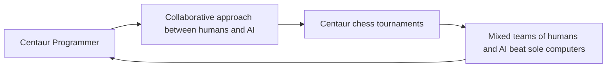
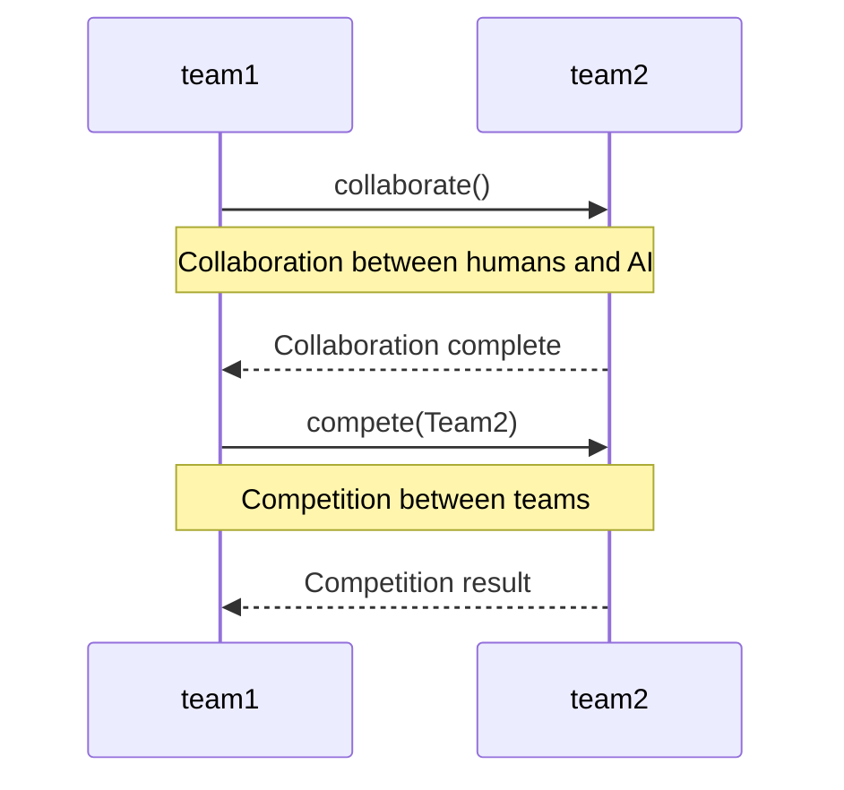
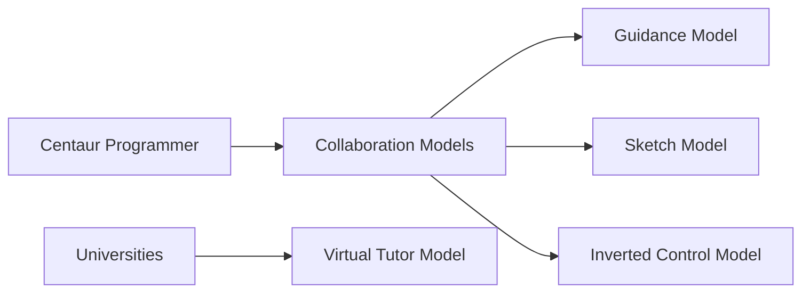
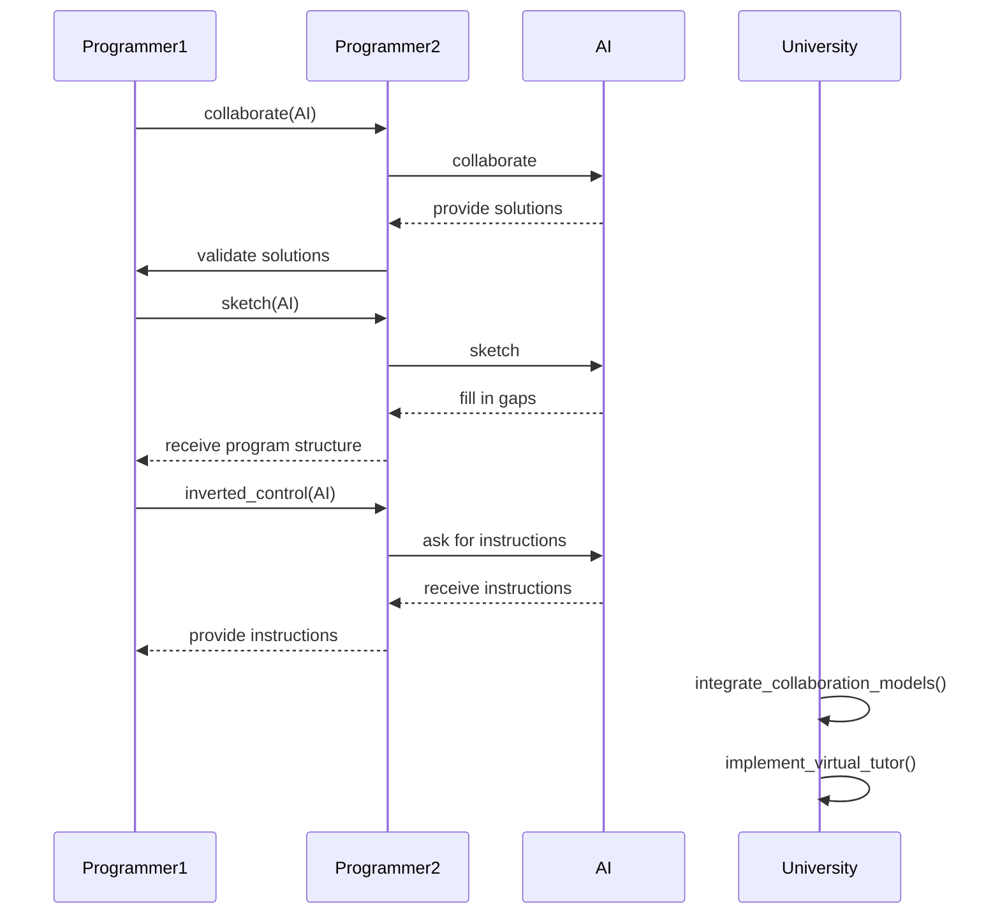
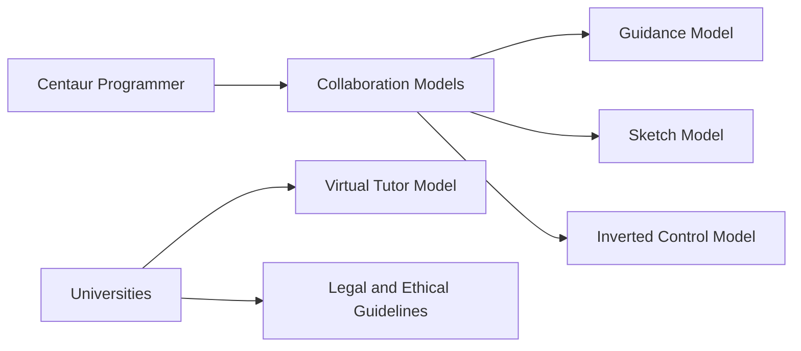

# The centaurprogrammer-How Kasparov’s AdvancedChess span s

1.
The snippet introduces the concept of the "Centaur Programmer," which is based on the idea that collaboration between humans and AI is more effective than AI alone. This concept is demonstrated through centaur chess tournaments, where teams of humans and AI beat sole computers. The paper suggests that universities should prepare future programmers for a more efficient and productive programming environment augmented with AI. The snippet also mentions the victory of the computer Deep Blue against Gary Kasparov in 1997, leading to predictions of machines replacing humans in various activities. However, the snippet argues that humans and AI can work together effectively in programming, similar to how mixed teams in centaur chess tournaments outperformed sole computers. The snippet proposes several collaboration models for programming alongside AI and discusses the implications and future possibilities of this topic.



In this diagram, the Centaur Programmer concept is represented as a central node. It is based on a collaborative approach between humans and AI, which is indicated by the arrow leading from the Centaur Programmer to the collaborative approach. The collaborative approach is further supported by the evidence from centaur chess tournaments, where mixed teams of humans and AI beat sole computers. This evidence is indicated by the arrow leading from the collaborative approach to the centaur chess tournaments. Finally, the success of the mixed teams in the centaur chess tournaments contributes to and reinforces the concept of the Centaur Programmer, as indicated by the arrow leading back to the Centaur Programmer node.

```python
class CentaurProgrammer:
    def __init__(self, humans, ai):
        self.humans = humans
        self.ai = ai

    def collaborate(self):
        print("Collaborating between humans and AI...")
        # Collaboration logic goes here

    def compete(self, other):
        print("Competing against another team...")
        # Competition logic goes here

humans = ["Alice", "Bob", "Charlie"]
ai = "DeepMind"

team1 = CentaurProgrammer(humans, ai)
team2 = CentaurProgrammer(["Dave", "Eve"], "OpenAI")

team1.collaborate()
team2.collaborate()

team1.compete(team2)
```

In this Python class, the `CentaurProgrammer` represents a team of humans and AI working together. The `__init__` method initializes the team with a list of humans and an AI entity. The `collaborate` method simulates the collaboration between the humans and AI, and the `compete` method simulates the team competing against another team.

In the example, we create two `CentaurProgrammer` instances: `team1` with humans Alice, Bob, and Charlie, and AI DeepMind, and `team2` with humans Dave and Eve, and AI OpenAI. We then demonstrate collaboration by calling the `collaborate` method on both teams. Finally, we simulate a competition between `team1` and `team2` by calling the `compete` method on `team1` and passing `team2` as an argument.



In this sequence diagram, we have two participants: `Team1` and `Team2`. The control flow of the code provided in the previous message is illustrated through the following steps:

1. `Team1` calls the `collaborate()` method.
2. `Team1` sends a collaborate message to `Team2`.
3. A note is added to indicate that collaboration is happening between humans and AI.
4. `Team2` sends a collaboration complete message back to `Team1`.

5. `Team1` calls the `compete(Team2)` method.
6. `Team1` sends a compete message to `Team2`.
7. A note is added to indicate that competition is happening between the two teams.
8. `Team2` sends a competition result message back to `Team1`.

This sequence diagram illustrates the control flow of the code, showing the collaboration and competition steps between the `Team1` and `Team2` instances.

Mocked Log Output:
```
Collaborating between humans and AI...
Collaborating between humans and AI...
Competing against another team...
```

In the mocked scenario, we have two teams of Centaur Programmers: `team1` and `team2`. Both teams participate in collaboration and competition.

During collaboration, the log shows "Collaborating between humans and AI..." twice, indicating that both `team1` and `team2` are working together, leveraging the combined skills of humans and AI.

In the competition scenario, the log shows "Competing against another team...". This implies that `team1` and `team2` are competing against each other, showcasing their programming skills and highlighting the advantages of collaboration between humans and AI.

Potential Use Cases:
1. Software Development: Centaur Programmers can be used in software development projects, where humans and AI collaborate to improve the efficiency and productivity of the development process. The humans can provide domain expertise and creativity, while AI can assist with code generation, automation, and analysis.
2. Problem Solving: Centaur Programmers can be employed in problem-solving tasks that require a combination of human intuition and AI capabilities. For example, in data analysis, humans can guide the AI in identifying patterns and making decisions based on their expertise, while AI can handle the computational aspects and assist in data processing.
3. Education: The concept of Centaur Programmers can be integrated into programming education to introduce students to the potential of human-AI collaboration. Students can work alongside AI tools and systems to develop their programming skills and gain insights into the future of programming.
4. Research and Innovation: Centaur Programmers can be utilized in research projects and innovation initiatives where the collaboration between humans and AI can lead to novel solutions and breakthroughs in various domains, such as healthcare, finance, and technology.

2.
The snippet discusses different collaboration models for programming alongside AI. One model is the "guidance model," where the programmer defines objectives and constraints, and the AI evolves possible solutions with constant validation from humans. Another model is the "sketch model," where the programmer outlines the program's structure, and the AI fills in the gaps. The "inverted control model" reverses the communication direction, with the AI asking the programmer for their intentions before implementation.

The snippet also emphasizes the importance of universities in preparing future programmers for these new collaboration models. It suggests integrating these models into software development curricula to create a more efficient and productive programming environment. The snippet mentions the concept of a "virtual tutor" as a first phase, where AI assists students in learning and understanding code. However, the ultimate goal is to have centaur-programmers who augment their abilities through collaboration with AI, leading to greater efficiency and quality in programming.

In summary, the snippet highlights the potential of collaboration between humans and AI in programming and the need for universities to adapt their education to prepare future programmers for this new approach.



In this diagram, the Centaur Programmer concept is represented as a central node. It is supported by different collaboration models, including the guidance model, sketch model, and inverted control model. These models enable collaboration between humans and AI in programming tasks. The universities play a crucial role in preparing future programmers for this new approach by integrating these collaboration models into their curricula. Additionally, the virtual tutor model is highlighted as a phase in the transformation, where AI assists students in learning programming concepts.

```python
class ProgrammingCollaborator:
    def __init__(self, name):
        self.name = name

    def collaborate(self, ai):
        print(f"{self.name} is collaborating with AI {ai}...")
        # Collaboration logic goes here

    def sketch(self, ai):
        print(f"{self.name} is sketching the program with AI {ai}...")
        # Sketch logic goes here

    def inverted_control(self, ai):
        print(f"{self.name} is providing instructions to AI {ai} using the inverted control model...")
        # Inverted control logic goes here

class University:
    def __init__(self, name):
        self.name = name

    def integrate_collaboration_models(self):
        print(f"{self.name} is integrating collaboration models into the software development curriculum...")

    def implement_virtual_tutor(self):
        print(f"{self.name} is implementing the virtual tutor model to assist students in learning programming...")
```

In this Python code, we have two classes: `ProgrammingCollaborator` and `University`. 

The `ProgrammingCollaborator` class represents an individual programmer who can collaborate with AI using different models. The `collaborate` method simulates collaboration between the programmer and an AI entity. The `sketch` method simulates the programmer sketching the program's structure with the help of AI. The `inverted_control` method simulates the programmer providing instructions to AI using the inverted control model.

The `University` class represents a university that can integrate collaboration models into its software development curriculum. The `integrate_collaboration_models` method simulates the integration process. The `implement_virtual_tutor` method simulates the implementation of the virtual tutor model to assist students in learning programming.

Here's an example usage of these classes:

```python
programmer1 = ProgrammingCollaborator("Alice")
programmer2 = ProgrammingCollaborator("Bob")
ai = "DeepMind"

programmer1.collaborate(ai)
programmer2.sketch(ai)
programmer1.inverted_control(ai)

university = University("XYZ University")
university.integrate_collaboration_models()
university.implement_virtual_tutor()
```

In this example, we create two `ProgrammingCollaborator` instances: `programmer1` with the name "Alice" and `programmer2` with the name "Bob". We also define an AI entity as "DeepMind". We then demonstrate different collaboration models by calling the respective methods on the programmers, passing the AI entity as an argument.

Next, we create a `University` instance called `university` with the name "XYZ University". We showcase the integration of collaboration models by calling the `integrate_collaboration_models` method. Finally, we simulate the implementation of the virtual tutor model by calling the `implement_virtual_tutor` method.



In this sequence diagram, we illustrate the control flow of the code provided earlier. The diagram includes the interactions between the programmers (`P1` and `P2`), the AI (`AI`), and the university (`Uni`).

1. Collaboration:
   - `P1` collaborates with `P2` using the AI entity `AI`.
   - `P2` requests collaboration from `AI` and retrieves solutions.
   - `AI` provides solutions to `P2`.
   - `P2` validates the solutions with `P1`.

2. Sketching:
   - `P1` sketches the program structure with the help of `AI`.
   - `P2` requests the sketch from `AI` and fills in the gaps.
   - `AI` provides the completed program structure to `P2`.
   - `P2` shares the program structure with `P1`.

3. Inverted Control:
   - `P1` provides instructions to `AI` using the inverted control model.
   - `P2` asks `AI` for instructions.
   - `AI` receives instructions from `P2`.
   - `P1` provides instructions to `P2`.

4. University:
   - The university (`Uni`) integrates collaboration models into the software development curriculum.
   - The university (`Uni`) implements the virtual tutor model to assist students in learning programming.

Note: The numbers in the control flow indicate the order of the steps.

Example scenario:

```python
programmer1 = ProgrammingCollaborator("Alice")
programmer2 = ProgrammingCollaborator("Bob")
ai = "DeepMind"

programmer1.collaborate(ai)
programmer2.sketch(ai)
programmer1.inverted_control(ai)

university = University("XYZ University")
university.integrate_collaboration_models()
university.implement_virtual_tutor()
```

Mocked log output:

```
Alice is collaborating with AI DeepMind...
Bob is sketching the program with AI DeepMind...
Alice is providing instructions to AI DeepMind using the inverted control model...
XYZ University is integrating collaboration models into the software development curriculum...
XYZ University is implementing the virtual tutor model to assist students in learning programming...
```

Explanation:

In this scenario, we have two programmers, Alice and Bob, and an AI entity called DeepMind. 

- Alice collaborates with DeepMind using the collaboration model. This could involve defining objectives and constraints related to a programming problem, and the AI evolves possible solutions with constant validation from Alice.

- Bob uses the sketch model to outline the program's structure, allowing DeepMind to fill in the gaps. This could be useful when Bob has a high-level idea of the program but needs AI assistance in fleshing out the details.

- Alice employs the inverted control model, where she provides instructions to DeepMind, and the AI asks for clarification until it understands the goals and constraints before implementation. This model emphasizes clear communication and understanding between the programmer and the AI.

- The XYZ University recognizes the importance of collaboration models and integrates them into their software development curriculum. This prepares future programmers to work effectively with AI and leverage its capabilities.

- Additionally, the university implements the virtual tutor model, where AI assists students in learning programming. This model provides explanations, answers questions, verifies code correctness, and offers improvements, enhancing the learning experience.

Potential use cases:

The provided code demonstrates the concept of collaboration between programmers and AI using different models. These collaboration models can be applied in various scenarios:

- Software development projects that involve complex problem-solving, where programmers can collaborate with AI to generate more efficient solutions quicker.

- Code generation and completion tools that assist programmers in writing code by suggesting solutions based on their inputs or program structure outlines.

- Educational environments where AI acts as a virtual tutor, providing guidance and support to students as they learn programming concepts and practice coding.

- Research and development projects in the field of artificial intelligence, where programmers collaborate with AI entities to explore new algorithms, optimize models, and improve AI systems.

Overall, the code demonstrates the potential of collaboration between humans and AI in programming and highlights the role of universities in preparing future programmers for this new paradigm.

3.
The snippet discusses the concept of the centaur-programmer, who is a human programmer able to augment their programming abilities by collaborating with AI. The analogy of a scientific calculator is used to explain this concept, where the calculator alone is of little use without human input, and a human equipped with a calculator becomes a centaur that uses a collaboration model.

The snippet highlights the importance of universities in preparing future centaur-programmers by integrating collaboration models into their curriculum. It emphasizes that the usefulness of AI tools like ChatGPT depends on the ability of the human using them. Experienced programmers can use AI tools more effectively and creatively to solve real-world problems.

Legal and ethical implications of using AI tools are also discussed, particularly in terms of unauthorized use of content and the introduction of biases. The snippet suggests that the responsibility for the content produced by AI should ultimately lie with humans, and universities play a critical role in developing ethical guidelines for the use of AI technologies.

In conclusion, the snippet envisions a future where centaur-programmers collaborate with AI to achieve software requirements more efficiently and with better quality. These programmers will be trained by universities to explore different collaboration models and will take responsibility for the code produced by AI.

The snippet does not provide any specific references.



In this diagram, the Centaur Programmer concept is represented as a central node. It is supported by different collaboration models, including the guidance model, sketch model, and inverted control model. These models enable collaboration between humans and AI in programming tasks. Universities play a crucial role in preparing future programmers for this new approach by integrating collaboration models and establishing legal and ethical guidelines. The implementation of a virtual tutor model is also emphasized as a learning-centered process to assist students in learning programming.

```python
class CentaurProgrammer:
    def __init__(self, name):
        self.name = name

    def collaborate(self, ai):
        print(f"{self.name} is collaborating with AI {ai}...")
        # Collaboration logic goes here

    def sketch(self, ai):
        print(f"{self.name} is sketching the program with AI {ai}...")
        # Sketch logic goes here

    def inverted_control(self, ai):
        print(f"{self.name} is providing instructions to AI {ai} using the inverted control model...")
        # Inverted control logic goes here

class University:
    def __init__(self, name):
        self.name = name

    def integrate_collaboration_models(self):
        print(f"{self.name} is integrating collaboration models into the software development curriculum...")

    def establish_guidelines(self):
        print(f"{self.name} is establishing legal and ethical guidelines for the use of AI technologies...")

    def implement_virtual_tutor(self):
        print(f"{self.name} is implementing the virtual tutor model to assist students in learning programming...")
```

In this Python code, we have two classes: `CentaurProgrammer` and `University`.

The `CentaurProgrammer` class represents an individual centaur programmer who can collaborate with AI using different models. The `collaborate` method simulates collaboration between the programmer and an AI entity. The `sketch` method simulates the programmer sketching the program's structure with the help of AI. The `inverted_control` method simulates the programmer providing instructions to AI using the inverted control model.

The `University` class represents a university that can integrate collaboration models into its software development curriculum. The `integrate_collaboration_models` method simulates the integration process. The `establish_guidelines` method simulates the establishment of legal and ethical guidelines for the use of AI technologies. The `implement_virtual_tutor` method simulates the implementation of the virtual tutor model to assist students in learning programming.

Here's an example usage of these classes:

```python
programmer1 = CentaurProgrammer("Alice")
programmer2 = CentaurProgrammer("Bob")
ai = "DeepMind"

programmer1.collaborate(ai)
programmer2.sketch(ai)
programmer1.inverted_control(ai)

university = University("XYZ University")
university.integrate_collaboration_models()
university.establish_guidelines()
university.implement_virtual_tutor()
```

In this example, we create two `CentaurProgrammer` instances: `programmer1` with the name "Alice" and `programmer2` with the name "Bob". We also define an AI entity as "DeepMind". We then demonstrate different collaboration models by calling the respective methods on the programmers, passing the AI entity as an argument.

Next, we create a `University` instance called `university` with the name "XYZ University". We showcase the integration of collaboration models by calling the `integrate_collaboration_models` method. We also simulate the establishment of legal and ethical guidelines by calling the `establish_guidelines` method. Finally, we simulate the implementation of the virtual tutor model by calling the `implement_virtual_tutor` method.

```mermaid
sequenceDiagram
    participant Programmer1 as Alice
    participant AI as DeepMind
    participant University as XYZ University

    Alice ->> AI: collaborate(AI)
    AI ->> Alice: Collaborating with AI DeepMind...
    
    Programmer2 as Bob
    Bob ->> AI: sketch(AI)
    AI ->> Bob: Bob is sketching the program with AI DeepMind...
    
    Alice ->> AI: inverted_control(AI)
    AI ->> Alice: Alice is providing instructions to AI DeepMind using the inverted control model...
    
    University ->> University: integrate_collaboration_models()
    University ->> University: Establish legal and ethical guidelines
    
    University ->> University: implement_virtual_tutor()
    University ->> University: Implement the virtual tutor model to assist students in learning programming
```

This sequence diagram illustrates the control flow of the code provided in the previous message. It shows the interaction between the programmer and the AI, as well as the actions performed by the university.

1. Alice, as Programmer1, collaborates with the AI (DeepMind). The `collaborate` method is called on the `CentaurProgrammer` instance named `programmer1`, passing the AI as an argument. The AI responds by collaborating with Alice.

2. Bob, as Programmer2, sketches the program with the AI (DeepMind). The `sketch` method is called on the `CentaurProgrammer` instance named `programmer2`, passing the AI as an argument. The AI acknowledges Bob's action.

3. Alice, as Programmer1, provides instructions to the AI (DeepMind) using the inverted control model. The `inverted_control` method is called on the `CentaurProgrammer` instance named `programmer1`, passing the AI as an argument. The AI responds to Alice's instructions.

4. The university integrates collaboration models into the software development curriculum. The `integrate_collaboration_models` method is called on the `University` instance named `university`.

5. The university establishes legal and ethical guidelines for the use of AI technologies. The `establish_guidelines` method is called on the `University` instance named `university`.

6. The university implements the virtual tutor model to assist students in learning programming. The `implement_virtual_tutor` method is called on the `University` instance named `university`.

Note: The numbering in the diagram represents the order of the interactions, not the actual execution steps within the methods.

Sure! Here's an example scenario with mocked log output:

```python
programmer1 = CentaurProgrammer("Alice")
programmer2 = CentaurProgrammer("Bob")
ai = "DeepMind"

programmer1.collaborate(ai)
# Output: Alice is collaborating with AI DeepMind...

programmer2.sketch(ai)
# Output: Bob is sketching the program with AI DeepMind...

programmer1.inverted_control(ai)
# Output: Alice is providing instructions to AI DeepMind using the inverted control model...

university = University("XYZ University")
university.integrate_collaboration_models()
# Output: XYZ University is integrating collaboration models into the software development curriculum...

university.establish_guidelines()
# Output: XYZ University is establishing legal and ethical guidelines for the use of AI technologies...

university.implement_virtual_tutor()
# Output: XYZ University is implementing the virtual tutor model to assist students in learning programming...
```

In this example scenario, we have two centaur programmers: Alice and Bob. They both collaborate with an AI entity called DeepMind using different models. Alice collaborates using the guidance model, Bob sketches the program using the sketch model, and Alice provides instructions using the inverted control model.

We also have a university, XYZ University, which takes active steps to integrate collaboration models into their software development curriculum. They establish legal and ethical guidelines for the use of AI technologies and implement a virtual tutor model to assist their students in learning programming.

These mocked log outputs illustrate the different actions being performed by the centaur programmers and the university in response to certain method calls.

The potential use cases of the code can be seen in scenarios where collaboration between humans and AI is desired in programming tasks. The `CentaurProgrammer` class provides a structure to represent and simulate collaboration using different models. The `University` class demonstrates how universities can adapt their curriculum to incorporate collaboration models and establish guidelines for ethical AI use. This code can be expanded upon and integrated into larger systems or frameworks aimed at exploring and facilitating collaboration between humans and AI in software development.

